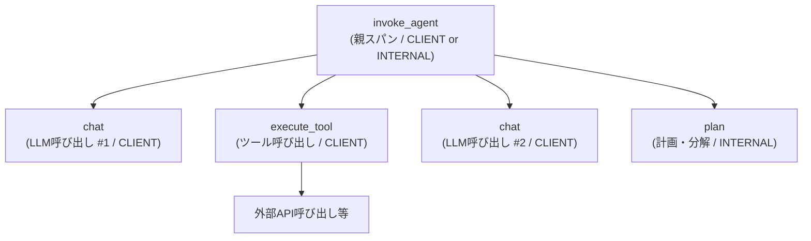
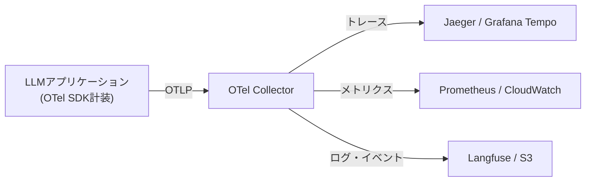

## ブログ概要

本記事は [https://opentelemetry.io/blog/2026/genai-observability/](https://opentelemetry.io/blog/2026/genai-observability/) の解説記事です。

OpenTelemetry公式ブログ「Inside the LLM Call: GenAI Observability with OpenTelemetry」は、LLMアプリケーションの可観測性を標準化するGenAI Semantic Conventionsの設計思想と実装パターンを体系的に解説した技術記事である。VS Code Copilot、OpenAI Codex、Claude CodeがOTLPエクスポートに対応したことを受け、`invoke_agent` / `chat` / `execute_tool`の3種類のスパン階層、`gen_ai.*`属性群、メトリクス定義、イベントスキーマを網羅的に紹介している。GenAI Semantic Conventions and Instrumentation SIG（Special Interest Group）が策定するこの仕様は、ベンダーやモデルに依存しない統一的なテレメトリスキーマを提供する。

この記事は [Zenn記事: LangfuseとOpenTelemetryで実装するLLMアプリの本番監視](https://zenn.dev/0h_n0/articles/93ea7afbeb3a96) の深掘り解説記事である。

## 情報源

- **種別**: 公式プロジェクトブログ
- **URL**: [opentelemetry.io/blog/2026/genai-observability/](https://opentelemetry.io/blog/2026/genai-observability/)
- **組織**: OpenTelemetry Project（Cloud Native Computing Foundation傘下）
- **発表年**: 2026年

## 技術的背景

### CNCFとOpenTelemetryの位置づけ

OpenTelemetryはCloud Native Computing Foundation（CNCF）のIncubatingプロジェクトであり、Kubernetesに次ぐ貢献者数を持つオブザーバビリティの事実上の標準である。トレース、メトリクス、ログの3シグナルに対してベンダー中立なAPI・SDK・プロトコル（OTLP）を提供する。

### GenAI SIG設立の経緯

LLMアプリケーションの急速な普及に伴い、OpenTelemetryプロジェクト内にGenAI Semantic Conventions and Instrumentation SIGが設立された。ブログによれば、「Every time an application calls an LLM, a chain of model calls, tool invocations, and token exchanges happens behind the scenes --- and without observability, you are guessing」という課題認識のもと、プロバイダ固有のダッシュボード（OpenAI usage page等）や自前のログ埋め込みでは複数プロバイダ構成やエージェントの再帰的LLM呼び出しの追跡が困難であるため、ベンダー中立な標準の策定が進められた。

2026年7月時点で、GenAI Semantic Conventionsの仕様はGitHub上で`open-telemetry/semantic-conventions-genai`リポジトリに移管され、活発に開発が継続されている。仕様のステータスはほぼ全ての属性・メトリクスが**Development**（開発中）段階にあり、安定版（Stable）に到達するまでに破壊的変更が入る可能性がある点に注意が必要である。

## 実装アーキテクチャ

### スパン階層設計

公式ブログが示すスパン階層は、エージェントワークフローの論理構造をそのままトレースに投影したものである。



GenAI Semantic Conventionsは以下の3種類のスパンを定義している。

**1. `invoke_agent`スパン**

エージェントの呼び出し全体を表す親スパンである。Span Kindは、リモートのエージェントサービスを呼び出す場合はCLIENT、同一プロセス内で実行する場合（LangChain、CrewAI等）はINTERNALを使用する。スパン名は`invoke_agent {gen_ai.agent.name}`の形式で、エージェント名を含む。

**2. `chat`スパン**

個々のLLM呼び出しを表す子スパンである。1回のエージェント呼び出し内で複数回のLLM呼び出しが発生するため、`invoke_agent`の子スパンとして複数出現する。スパン名は`chat {gen_ai.request.model}`の形式で、モデル名を含む。

**3. `execute_tool`スパン**

ツール呼び出し（関数呼び出し、API呼び出し等）を表す子スパンである。LLMが`tool_calls`をfinish_reasonとして返した場合に、各ツールの実行が個別のスパンとして記録される。

加えて、`plan`スパン（タスク分解・計画フェーズ）や`invoke_workflow`スパン（ワークフロー呼び出し）も定義されている。

### コア属性の詳細

GenAI Semantic Conventionsは`gen_ai.*`名前空間に統一された属性群を定義している。以下に主要な属性を示す。

#### 必須属性（Required）

| 属性名 | 型 | 説明 |
|--------|-----|------|
| `gen_ai.operation.name` | string | 操作種別（`chat`, `invoke_agent`, `execute_tool`, `embeddings`等） |
| `gen_ai.provider.name` | string | プロバイダ名（`openai`, `anthropic`, `aws.bedrock`等） |

#### リクエスト属性（Conditionally Required / Recommended）

| 属性名 | 型 | 説明 |
|--------|-----|------|
| `gen_ai.request.model` | string | リクエスト時に指定したモデル名 |
| `gen_ai.request.max_tokens` | int | 最大生成トークン数 |
| `gen_ai.request.temperature` | double | 温度パラメータ |
| `gen_ai.request.top_p` | double | Top-pサンプリング |
| `gen_ai.request.top_k` | int | Top-kサンプリング |
| `gen_ai.request.frequency_penalty` | double | 頻度ペナルティ |
| `gen_ai.request.presence_penalty` | double | 存在ペナルティ |
| `gen_ai.request.stop_sequences` | string[] | 停止シーケンス |
| `gen_ai.request.seed` | int | 再現性のためのシード値 |
| `gen_ai.request.stream` | boolean | ストリーミング有無 |
| `gen_ai.request.choice.count` | int | 候補生成数（1以外の場合） |
| `gen_ai.request.reasoning.level` | string | 推論・思考レベル |

#### レスポンス属性（Recommended）

| 属性名 | 型 | 説明 |
|--------|-----|------|
| `gen_ai.response.model` | string | 実際にレスポンスを生成したモデル名 |
| `gen_ai.response.id` | string | レスポンスの一意識別子 |
| `gen_ai.response.finish_reasons` | string[] | 生成停止理由（`stop`, `tool_calls`等） |
| `gen_ai.response.time_to_first_chunk` | double | 最初のチャンクまでの時間（秒） |

#### 使用量属性（Recommended）

| 属性名 | 型 | 説明 |
|--------|-----|------|
| `gen_ai.usage.input_tokens` | int | 入力トークン数 |
| `gen_ai.usage.output_tokens` | int | 出力トークン数 |
| `gen_ai.usage.reasoning.output_tokens` | int | 推論（Chain-of-Thought）トークン数 |
| `gen_ai.usage.cache_creation.input_tokens` | int | キャッシュ書き込みトークン数 |
| `gen_ai.usage.cache_read.input_tokens` | int | キャッシュ読み取りトークン数 |

#### エージェント属性

| 属性名 | 型 | 説明 |
|--------|-----|------|
| `gen_ai.agent.id` | string | プロバイダが割り当てるエージェント識別子 |
| `gen_ai.agent.name` | string | 人間が読めるエージェント名 |
| `gen_ai.agent.description` | string | エージェントの説明 |
| `gen_ai.agent.version` | string | エージェントバージョン |
| `gen_ai.conversation.id` | string | 会話・セッション識別子 |

#### コンテンツ属性（Opt-In）

以下の属性はプライバシー上の理由からデフォルトでは無効であり、明示的に有効化する必要がある。

| 属性名 | 型 | 説明 |
|--------|-----|------|
| `gen_ai.system_instructions` | any | システムプロンプト |
| `gen_ai.input.messages` | any | 入力メッセージ（チャット履歴） |
| `gen_ai.output.messages` | any | 出力メッセージ |
| `gen_ai.tool.definitions` | any | 利用可能なツール定義 |

ブログでは、VS Code Copilotで`github.copilot.chat.otel.captureContent`設定を有効にすることでプロンプト・レスポンスの全文キャプチャが可能になると説明している。

### メトリクス定義

GenAI Semantic Conventionsは以下のメトリクスを定義している。

#### クライアントメトリクス

| メトリクス名 | 型 | 単位 | 説明 |
|-------------|-----|------|------|
| `gen_ai.client.operation.duration` | Histogram | `s` | LLM操作の総所要時間 |
| `gen_ai.client.token.usage` | Histogram | `{token}` | 入出力トークン使用量 |
| `gen_ai.client.operation.time_to_first_chunk` | Histogram | `s` | 最初のチャンクまでの時間（ストリーミング時） |
| `gen_ai.client.operation.time_per_output_chunk` | Histogram | `s` | チャンク間の時間（ストリーミング時） |

`gen_ai.client.token.usage`は`gen_ai.token.type`属性で`input`と`output`を区別する。これにより、1つのメトリクスで入出力トークンの両方を集計できる。

#### サーバーメトリクス

| メトリクス名 | 型 | 単位 | 説明 |
|-------------|-----|------|------|
| `gen_ai.server.request.duration` | Histogram | `s` | サーバー側のリクエスト処理時間 |
| `gen_ai.server.time_per_output_token` | Histogram | `s` | トークンあたりの生成時間 |
| `gen_ai.server.time_to_first_token` | Histogram | `s` | 最初のトークン生成までの時間 |

#### エージェント・ワークフローメトリクス

| メトリクス名 | 型 | 説明 |
|-------------|-----|------|
| `gen_ai.workflow.duration` | Histogram | ワークフロー全体の所要時間 |
| `gen_ai.invoke_agent.duration` | Histogram | エージェント呼び出しの所要時間 |
| `gen_ai.invoke_agent.inference_calls` | Counter | エージェント内の推論API呼び出し回数 |
| `gen_ai.invoke_agent.tool_calls` | Counter | エージェント内のツール呼び出し回数 |
| `gen_ai.execute_tool.duration` | Histogram | ツール実行の所要時間 |

### イベントスキーマ

GenAI Semantic Conventionsは2種類のイベントを定義している。

**`gen_ai.client.inference.operation.details`**: LLM推論操作の詳細を記録するイベントである。`gen_ai.operation.name`、`gen_ai.provider.name`を必須フィールドとし、`gen_ai.input.messages`や`gen_ai.output.messages`をOpt-Inで含めることができる。

**`gen_ai.evaluation.result`**: 生成結果の品質評価を記録するイベントである。`gen_ai.evaluation.name`（評価指標名）、`gen_ai.evaluation.score.value`（数値スコア）、`gen_ai.evaluation.score.label`（ラベル）、`gen_ai.evaluation.explanation`（理由）を含む。LLM-as-a-Judgeパターンとの統合を想定した設計になっている。

### Developmentステータスの意味

GenAI Semantic Conventionsの属性・メトリクスはほぼ全てが**Development**ステータスにある。OpenTelemetryプロジェクトは以下のステータスを定義している。

- **Development**: 活発に開発中。破壊的変更が入る可能性がある
- **Experimental**: ある程度安定しているが、変更の可能性がある
- **Stable**: 後方互換性が保証される

Developmentステータスは、仕様がまだ成熟途上にあることを意味する。本番環境で採用する場合、将来の仕様変更に追従するためのアダプタ層を設けることが推奨される。GenAI SIGは仕様の安定化に向けて積極的にフィードバックを募集しており、GitHubのDiscussionsで議論が行われている。

### プロバイダサポート状況

ブログは以下のツール・プロダクトがOTLPエクスポートに対応していると報告している。

| ツール | 対応状況 |
|--------|---------|
| VS Code Copilot | トレース、メトリクス、イベントをエージェントインタラクションごとにエクスポート |
| OpenAI Codex | 構造化ログイベントとOTelメトリクスをAPIリクエスト、ツール呼び出し、セッション単位でエクスポート |
| Claude Code | メトリクスとログイベントをOTel経由でエクスポート。トレースサポートはベータ段階 |
| Aspire Dashboard | 無料・オープンソースのテレメトリビューア。Docker一発で起動可能 |

Aspire Dashboardの起動コマンドは以下のとおりである。

```sh
docker run --rm -p 18888:18888 -p 4317:18889 -p 4318:18890 -d --name aspire-dashboard \
    -e ASPIRE_DASHBOARD_UNSECURED_ALLOW_ANONYMOUS=true \
    mcr.microsoft.com/dotnet/aspire-dashboard:latest
```

ポート18888がダッシュボードUI、4317がgRPC（OTLP）、4318がHTTP（OTLP）に対応している。

## Production Deployment Guide

GenAI Semantic Conventionsに基づくLLMオブザーバビリティスタックをAWS上に構築するパターンを示す。OTel Collectorを中心に据え、トレース・メトリクス・ログを複数バックエンドに分配する構成である。

### AWS実装パターン（コスト最適化重視）

#### アーキテクチャ概要



#### トラフィック量別の推奨構成

**Small構成（~100 req/日）: Lambda + OTel Collector sidecar**

- Lambda関数内でOTel SDKを使用し、Lambda Extension経由でOTLPを送信
- Langfuse CloudをバックエンドとしLLMトレースを可視化
- CloudWatch MetricsでOTelメトリクスを収集
- 月額概算: $50-150（Lambda実行料 + Langfuse Cloud無料枠 + CloudWatch）

| サービス | 用途 | 月額概算 |
|----------|------|---------|
| Lambda | アプリケーション実行 | $5-20 |
| Lambda Extension (OTel) | テレメトリ送信 | $0（Lambda実行に含む） |
| Langfuse Cloud | LLMトレース可視化 | $0（無料枠） |
| CloudWatch Metrics | メトリクス収集 | $10-30 |
| CloudWatch Logs | ログ保管 | $5-20 |
| Bedrock | LLM推論 | $30-80 |

**Medium構成（~1,000 req/日）: ECS Fargate + OTel Collector + Langfuse**

- ECS Fargateでアプリケーションとセルフホストのlangfuseを実行
- OTel Collectorをサイドカーコンテナとしてデプロイ
- Grafana Tempoにトレースを送信し、Grafanaダッシュボードで可視化
- 月額概算: $300-800

| サービス | 用途 | 月額概算 |
|----------|------|---------|
| ECS Fargate（アプリ） | アプリケーション実行 | $50-100 |
| ECS Fargate（Langfuse） | セルフホストLangfuse | $30-60 |
| ECS Fargate（OTel Collector） | テレメトリルーティング | $15-30 |
| RDS PostgreSQL | Langfuseデータ保管 | $30-60 |
| Bedrock | LLM推論 | $100-400 |
| CloudWatch | メトリクス・ログ | $20-50 |
| ALB | ロードバランシング | $20-40 |

**Large構成（10,000+ req/日）: EKS + OTel Collector DaemonSet + Grafana Tempo**

- EKSクラスタにアプリケーションPodをデプロイ
- OTel CollectorをDaemonSetとして各ノードに配置し、低レイテンシでテレメトリを収集
- Grafana Tempo（トレース）+ Prometheus（メトリクス）+ Loki（ログ）の統合スタック
- Karpenterによる自動スケーリング、Spot Instances活用
- 月額概算: $2,000-5,000

| サービス | 用途 | 月額概算 |
|----------|------|---------|
| EKS コントロールプレーン | クラスタ管理 | $73 |
| EC2 Spot Instances | ワーカーノード | $200-600 |
| Grafana Tempo | 分散トレース保管 | $50-150（S3ストレージ） |
| Prometheus | メトリクス収集・保管 | $30-80 |
| Bedrock | LLM推論 | $1,000-3,000 |
| S3 | テレメトリ長期保管 | $20-50 |
| NAT Gateway | アウトバウンド通信 | $50-100 |

**コスト試算の注意事項**: 上記は2026年7月時点のAWS ap-northeast-1（東京）リージョン料金に基づく概算値である。実際のコストはトラフィックパターン、リージョン、バースト使用量により変動する。最新料金はAWS料金計算ツールで確認を推奨する。

### Terraformインフラコード

#### Small構成（Serverless）: Lambda + OTel Extension

```hcl
# OTel GenAI Observability - Small構成
# Lambda + OTel Lambda Extension + CloudWatch

terraform {
  required_version = ">= 1.9"
  required_providers {
    aws = {
      source  = "hashicorp/aws"
      version = "~> 5.60"
    }
  }
}

provider "aws" {
  region = "ap-northeast-1"
}

# --- IAMロール（最小権限） ---
resource "aws_iam_role" "lambda_role" {
  name = "genai-otel-lambda-role"
  assume_role_policy = jsonencode({
    Version = "2012-10-17"
    Statement = [{
      Action = "sts:AssumeRole"
      Effect = "Allow"
      Principal = { Service = "lambda.amazonaws.com" }
    }]
  })
}

resource "aws_iam_role_policy" "lambda_policy" {
  name = "genai-otel-lambda-policy"
  role = aws_iam_role.lambda_role.id
  policy = jsonencode({
    Version = "2012-10-17"
    Statement = [
      {
        Effect   = "Allow"
        Action   = ["logs:CreateLogGroup", "logs:CreateLogStream", "logs:PutLogEvents"]
        Resource = "arn:aws:logs:*:*:*"
      },
      {
        Effect   = "Allow"
        Action   = ["bedrock:InvokeModel", "bedrock:InvokeModelWithResponseStream"]
        Resource = "arn:aws:bedrock:ap-northeast-1::foundation-model/*"
      },
      {
        # DynamoDBへのトレース・メタデータ保管
        Effect   = "Allow"
        Action   = ["dynamodb:PutItem", "dynamodb:GetItem", "dynamodb:Query"]
        Resource = aws_dynamodb_table.trace_metadata.arn
      }
    ]
  })
}

# --- Lambda関数 ---
resource "aws_lambda_function" "genai_app" {
  function_name = "genai-otel-app"
  runtime       = "python3.12"
  handler       = "main.handler"
  role          = aws_iam_role.lambda_role.arn
  memory_size   = 512  # OTel SDK分のメモリ余裕
  timeout       = 120  # LLM呼び出しタイムアウト

  # OTel Lambda Extension Layer
  layers = [
    "arn:aws:lambda:ap-northeast-1:901920570463:layer:aws-otel-python-amd64-ver-1-25-0:1"
  ]

  environment {
    variables = {
      OPENTELEMETRY_COLLECTOR_CONFIG_FILE = "/var/task/otel-config.yaml"
      OTEL_SERVICE_NAME                   = "genai-app"
      OTEL_EXPORTER_OTLP_ENDPOINT        = "http://localhost:4317"
      # gen_ai属性の自動計装有効化
      OTEL_INSTRUMENTATION_GENAI_CAPTURE_MESSAGE_CONTENT = "false"  # PII保護
    }
  }

  filename = "lambda.zip"
}

# --- DynamoDB（On-Demand） ---
resource "aws_dynamodb_table" "trace_metadata" {
  name         = "genai-trace-metadata"
  billing_mode = "PAY_PER_REQUEST"  # コスト最適化: On-Demand
  hash_key     = "trace_id"
  range_key    = "span_id"

  attribute {
    name = "trace_id"
    type = "S"
  }
  attribute {
    name = "span_id"
    type = "S"
  }

  # KMS暗号化
  server_side_encryption {
    enabled = true
  }

  ttl {
    attribute_name = "ttl"
    enabled        = true
  }
}

# --- CloudWatchアラーム ---
resource "aws_cloudwatch_metric_alarm" "token_usage_spike" {
  alarm_name          = "genai-token-usage-spike"
  comparison_operator = "GreaterThanThreshold"
  evaluation_periods  = 2
  metric_name         = "gen_ai.client.token.usage"
  namespace           = "GenAI/OTel"
  period              = 300
  statistic           = "Sum"
  threshold           = 100000  # 5分間で10万トークン超過
  alarm_description   = "GenAIトークン使用量のスパイク検知"
  alarm_actions       = [aws_sns_topic.alerts.arn]
}

resource "aws_sns_topic" "alerts" {
  name = "genai-otel-alerts"
}
```

#### Large構成（Container）: EKS + OTel Collector DaemonSet

```hcl
# OTel GenAI Observability - Large構成
# EKS + Karpenter + OTel Collector DaemonSet

# --- EKSクラスタ ---
module "eks" {
  source  = "terraform-aws-modules/eks/aws"
  version = "~> 20.24"

  cluster_name    = "genai-otel-cluster"
  cluster_version = "1.31"

  vpc_id     = module.vpc.vpc_id
  subnet_ids = module.vpc.private_subnets

  # コスト最適化: パブリックアクセスを制限
  cluster_endpoint_public_access = true
  cluster_endpoint_private_access = true

  # OTel Collector用のIRSA
  enable_irsa = true
}

# --- Karpenter Provisioner（Spot優先） ---
resource "kubectl_manifest" "karpenter_nodepool" {
  yaml_body = yamlencode({
    apiVersion = "karpenter.sh/v1"
    kind       = "NodePool"
    metadata   = { name = "genai-workers" }
    spec = {
      template = {
        spec = {
          requirements = [
            { key = "karpenter.sh/capacity-type", operator = "In", values = ["spot", "on-demand"] },
            { key = "node.kubernetes.io/instance-type", operator = "In",
              values = ["m6i.xlarge", "m6i.2xlarge", "m7i.xlarge", "m7i.2xlarge"] }
          ]
        }
      }
      limits   = { cpu = "100", memory = "400Gi" }
      disruption = {
        consolidationPolicy = "WhenEmptyOrUnderutilized"
        consolidateAfter    = "30s"
      }
    }
  })
}

# --- OTel Collector DaemonSet ---
resource "kubectl_manifest" "otel_collector" {
  yaml_body = yamlencode({
    apiVersion = "apps/v1"
    kind       = "DaemonSet"
    metadata = {
      name      = "otel-collector"
      namespace = "monitoring"
    }
    spec = {
      selector = { matchLabels = { app = "otel-collector" } }
      template = {
        metadata = { labels = { app = "otel-collector" } }
        spec = {
          containers = [{
            name  = "collector"
            image = "otel/opentelemetry-collector-contrib:0.108.0"
            ports = [
              { containerPort = 4317, name = "otlp-grpc" },
              { containerPort = 4318, name = "otlp-http" }
            ]
            volumeMounts = [{
              name      = "config"
              mountPath = "/etc/otelcol"
            }]
            resources = {
              requests = { cpu = "200m", memory = "256Mi" }
              limits   = { cpu = "500m", memory = "512Mi" }
            }
          }]
          volumes = [{
            name = "config"
            configMap = { name = "otel-collector-config" }
          }]
        }
      }
    }
  })
}

# --- AWS Budgets ---
resource "aws_budgets_budget" "genai_monthly" {
  name         = "genai-otel-monthly"
  budget_type  = "COST"
  limit_amount = "5000"
  limit_unit   = "USD"
  time_unit    = "MONTHLY"

  notification {
    comparison_operator       = "GREATER_THAN"
    threshold                 = 80
    threshold_type            = "PERCENTAGE"
    notification_type         = "ACTUAL"
    subscriber_email_addresses = ["ops-team@example.com"]
  }
}
```

### 運用・監視設定

#### CloudWatch Logs Insights クエリ

```
# トークン使用量の1時間あたり集計（コスト異常検知）
fields @timestamp, gen_ai.usage.input_tokens, gen_ai.usage.output_tokens, gen_ai.request.model
| stats sum(gen_ai.usage.input_tokens) as total_input,
        sum(gen_ai.usage.output_tokens) as total_output,
        count(*) as call_count
  by bin(1h), gen_ai.request.model
| sort total_output desc

# レイテンシ分析（P95, P99）
fields @timestamp, gen_ai.client.operation.duration, gen_ai.operation.name
| stats pct(gen_ai.client.operation.duration, 95) as p95,
        pct(gen_ai.client.operation.duration, 99) as p99,
        avg(gen_ai.client.operation.duration) as avg_duration
  by bin(1h), gen_ai.operation.name
```

#### X-Ray トレーシング設定

```python
"""OTel SDK + X-Ray統合のGenAI計装設定."""

from opentelemetry import trace
from opentelemetry.exporter.otlp.proto.grpc.trace_exporter import OTLPSpanExporter
from opentelemetry.sdk.trace import TracerProvider
from opentelemetry.sdk.trace.export import BatchSpanProcessor
from opentelemetry.sdk.resources import Resource
from opentelemetry.propagators.aws import AwsXRayPropagator
from opentelemetry.sdk.extension.aws.trace import AwsXRayIdGenerator


def setup_otel_tracing(service_name: str = "genai-app") -> trace.Tracer:
    """OTelトレーシングを初期化しX-Ray互換のトレーサーを返す.

    Args:
        service_name: サービス名（gen_ai.provider.nameとは別にサービスレベルで識別）

    Returns:
        設定済みのTracerインスタンス
    """
    resource = Resource.create({
        "service.name": service_name,
        "service.version": "1.0.0",
    })

    provider = TracerProvider(
        resource=resource,
        id_generator=AwsXRayIdGenerator(),
    )

    # OTel Collectorへの送信（DaemonSetまたはサイドカー）
    otlp_exporter = OTLPSpanExporter(
        endpoint="http://localhost:4317",
        insecure=True,
    )
    provider.add_span_processor(BatchSpanProcessor(otlp_exporter))

    trace.set_tracer_provider(provider)
    return trace.get_tracer(__name__)
```

#### Cost Explorer自動レポート

```python
"""日次コストレポート取得・SNS通知."""

import boto3
from datetime import datetime, timedelta


def get_daily_genai_cost(threshold_usd: float = 100.0) -> dict:
    """Bedrock・Lambda・EKSの日次コストを取得し閾値超過時にSNS通知.

    Args:
        threshold_usd: アラート閾値（USD/日）

    Returns:
        サービス別コスト内訳の辞書
    """
    ce = boto3.client("ce", region_name="ap-northeast-1")
    sns = boto3.client("sns", region_name="ap-northeast-1")

    end = datetime.utcnow().strftime("%Y-%m-%d")
    start = (datetime.utcnow() - timedelta(days=1)).strftime("%Y-%m-%d")

    response = ce.get_cost_and_usage(
        TimePeriod={"Start": start, "End": end},
        Granularity="DAILY",
        Metrics=["UnblendedCost"],
        Filter={
            "Or": [
                {"Dimensions": {"Key": "SERVICE", "Values": ["Amazon Bedrock"]}},
                {"Dimensions": {"Key": "SERVICE", "Values": ["AWS Lambda"]}},
                {"Dimensions": {"Key": "SERVICE", "Values": ["Amazon Elastic Kubernetes Service"]}},
            ]
        },
        GroupBy=[{"Type": "DIMENSION", "Key": "SERVICE"}],
    )

    costs = {}
    total = 0.0
    for group in response["ResultsByTime"][0]["Groups"]:
        service = group["Keys"][0]
        amount = float(group["Metrics"]["UnblendedCost"]["Amount"])
        costs[service] = amount
        total += amount

    if total > threshold_usd:
        sns.publish(
            TopicArn="arn:aws:sns:ap-northeast-1:123456789012:genai-otel-alerts",
            Subject=f"GenAI日次コスト超過: ${total:.2f}",
            Message=f"閾値${threshold_usd}超過。内訳: {costs}",
        )

    return costs
```

### コスト最適化チェックリスト

**アーキテクチャ選択**:

- [ ] トラフィック100 req/日以下 → Serverless（Lambda + OTel Extension）
- [ ] トラフィック100-5,000 req/日 → Hybrid（ECS Fargate + OTel Collector sidecar）
- [ ] トラフィック5,000 req/日以上 → Container（EKS + OTel Collector DaemonSet）

**リソース最適化**:

- [ ] EC2: Spot Instances優先（最大90%削減）
- [ ] Reserved Instances: 1年コミットで最大72%削減
- [ ] Savings Plans: Compute Savings Plansで最大66%削減
- [ ] Lambda: メモリサイズをPower Tuningで最適化
- [ ] ECS/EKS: Karpenterでアイドル時自動スケールダウン

**LLMコスト削減**:

- [ ] Bedrock Batch API使用で50%削減
- [ ] Prompt Caching有効化で30-90%削減（`gen_ai.usage.cache_read.input_tokens`で効果測定）
- [ ] タスク複雑度に応じたモデル選択ロジック（Haiku → Sonnet → Opus）
- [ ] `gen_ai.request.max_tokens`で最大トークン数を制限

**監視・アラート**:

- [ ] AWS Budgets: 月次予算アラート設定（80%/100%閾値）
- [ ] CloudWatch: `gen_ai.client.token.usage`のスパイク検知アラーム
- [ ] Cost Anomaly Detection: ML異常検知有効化
- [ ] 日次コストレポート: Cost Explorer APIで自動取得・SNS通知

**リソース管理**:

- [ ] 未使用EBSボリューム・ENI・EIPの定期削除
- [ ] タグ戦略: `project:genai-otel`タグで全リソースをグループ化
- [ ] S3ライフサイクルポリシー: テレメトリデータを30日後にIA、90日後にGlacierへ
- [ ] 開発環境: 夜間・週末の自動停止（EventBridge + Lambda）
- [ ] OTel Collectorのサンプリング設定: 本番以外のトレースはhead-basedサンプリング10%

## Pythonによるgen_ai.*属性の手動計装コード例

OTel SDKを使用してGenAI Semantic Conventionsに準拠したスパンを手動で計装するPythonコードを示す。Langfuseの`@observe`デコレータがこれらの属性を内部的にラップしているが、以下のコードはデコレータを使わずに直接OTel APIを呼び出す例である。

```python
"""GenAI Semantic Conventionsに準拠したOTel手動計装の実装例.

OpenTelemetry GenAI Semantic Conventions (Development) に基づき、
invoke_agent / chat / execute_tool の3種類のスパンを生成する。

注意: gen_ai.*属性はDevelopmentステータスのため、
将来のバージョンで属性名が変更される可能性がある。
"""

from __future__ import annotations

import time
from typing import Any

import anthropic
from opentelemetry import metrics, trace
from opentelemetry.exporter.otlp.proto.grpc.metric_exporter import OTLPMetricExporter
from opentelemetry.exporter.otlp.proto.grpc.trace_exporter import OTLPSpanExporter
from opentelemetry.sdk.metrics import MeterProvider
from opentelemetry.sdk.metrics.export import PeriodicExportingMetricReader
from opentelemetry.sdk.resources import Resource
from opentelemetry.sdk.trace import TracerProvider
from opentelemetry.sdk.trace.export import BatchSpanProcessor
from opentelemetry.trace import StatusCode

# --- OTel初期化 ---
_resource = Resource.create({"service.name": "genai-demo"})

_tracer_provider = TracerProvider(resource=_resource)
_tracer_provider.add_span_processor(
    BatchSpanProcessor(OTLPSpanExporter(endpoint="http://localhost:4317", insecure=True))
)
trace.set_tracer_provider(_tracer_provider)

_meter_provider = MeterProvider(
    resource=_resource,
    metric_readers=[
        PeriodicExportingMetricReader(
            OTLPMetricExporter(endpoint="http://localhost:4317", insecure=True),
            export_interval_millis=10000,
        )
    ],
)
metrics.set_meter_provider(_meter_provider)

tracer = trace.get_tracer("genai.instrumentation", "0.1.0")
meter = metrics.get_meter("genai.instrumentation", "0.1.0")

# --- GenAIメトリクス定義 ---
token_usage_histogram = meter.create_histogram(
    name="gen_ai.client.token.usage",
    description="Number of input and output tokens used",
    unit="{token}",
)
operation_duration_histogram = meter.create_histogram(
    name="gen_ai.client.operation.duration",
    description="GenAI operation duration",
    unit="s",
)


def record_token_usage(
    input_tokens: int,
    output_tokens: int,
    model: str,
    operation_name: str = "chat",
    provider_name: str = "anthropic",
) -> None:
    """トークン使用量をOTelメトリクスとして記録する.

    Args:
        input_tokens: 入力トークン数
        output_tokens: 出力トークン数
        model: モデル名
        operation_name: 操作種別
        provider_name: プロバイダ名
    """
    common_attrs = {
        "gen_ai.operation.name": operation_name,
        "gen_ai.provider.name": provider_name,
        "gen_ai.request.model": model,
    }
    token_usage_histogram.record(
        input_tokens,
        attributes={**common_attrs, "gen_ai.token.type": "input"},
    )
    token_usage_histogram.record(
        output_tokens,
        attributes={**common_attrs, "gen_ai.token.type": "output"},
    )


def chat_completion(
    client: anthropic.Anthropic,
    model: str,
    messages: list[dict[str, str]],
    system: str | None = None,
    max_tokens: int = 1024,
    temperature: float = 1.0,
) -> anthropic.types.Message:
    """GenAI Semantic Conventions準拠のchatスパンを生成するLLM呼び出し.

    Args:
        client: Anthropicクライアント
        model: モデル名（例: claude-sonnet-4-20250514）
        messages: チャットメッセージ配列
        system: システムプロンプト
        max_tokens: 最大生成トークン数
        temperature: 温度パラメータ

    Returns:
        Anthropic APIのレスポンス
    """
    # スパン名: "{operation_name} {model}"
    with tracer.start_as_current_span(
        name=f"chat {model}",
        kind=trace.SpanKind.CLIENT,
        attributes={
            # 必須属性
            "gen_ai.operation.name": "chat",
            "gen_ai.provider.name": "anthropic",
            # リクエスト属性
            "gen_ai.request.model": model,
            "gen_ai.request.max_tokens": max_tokens,
            "gen_ai.request.temperature": temperature,
        },
    ) as span:
        start_time = time.monotonic()
        try:
            response = client.messages.create(
                model=model,
                max_tokens=max_tokens,
                temperature=temperature,
                system=system or "",
                messages=messages,
            )

            # レスポンス属性を記録
            span.set_attribute("gen_ai.response.model", response.model)
            span.set_attribute("gen_ai.response.id", response.id)
            span.set_attribute(
                "gen_ai.response.finish_reasons", [response.stop_reason]
            )

            # 使用量属性を記録
            span.set_attribute(
                "gen_ai.usage.input_tokens", response.usage.input_tokens
            )
            span.set_attribute(
                "gen_ai.usage.output_tokens", response.usage.output_tokens
            )

            # メトリクスを記録
            duration = time.monotonic() - start_time
            record_token_usage(
                input_tokens=response.usage.input_tokens,
                output_tokens=response.usage.output_tokens,
                model=model,
            )
            operation_duration_histogram.record(
                duration,
                attributes={
                    "gen_ai.operation.name": "chat",
                    "gen_ai.provider.name": "anthropic",
                    "gen_ai.request.model": model,
                },
            )

            return response

        except Exception as exc:
            span.set_status(StatusCode.ERROR, str(exc))
            span.set_attribute("error.type", type(exc).__name__)
            raise


def execute_tool(
    tool_name: str,
    tool_input: dict[str, Any],
    tool_func: Any,
) -> Any:
    """GenAI Semantic Conventions準拠のexecute_toolスパンを生成するツール実行.

    Args:
        tool_name: ツール名
        tool_input: ツールへの入力パラメータ
        tool_func: 実行するツール関数

    Returns:
        ツール関数の戻り値
    """
    with tracer.start_as_current_span(
        name=f"execute_tool {tool_name}",
        kind=trace.SpanKind.CLIENT,
        attributes={
            "gen_ai.operation.name": "execute_tool",
            "gen_ai.provider.name": "custom",
        },
    ) as span:
        start_time = time.monotonic()
        try:
            result = tool_func(**tool_input)
            duration = time.monotonic() - start_time
            span.set_attribute("gen_ai.tool.name", tool_name)
            return result
        except Exception as exc:
            span.set_status(StatusCode.ERROR, str(exc))
            span.set_attribute("error.type", type(exc).__name__)
            raise


def invoke_agent(
    client: anthropic.Anthropic,
    agent_name: str,
    model: str,
    system_prompt: str,
    user_message: str,
    tools: list[dict[str, Any]] | None = None,
    tool_registry: dict[str, Any] | None = None,
    max_turns: int = 5,
) -> str:
    """GenAI Semantic Conventions準拠のinvoke_agentスパンを生成するエージェント実行.

    invoke_agent親スパンの下にchat子スパンとexecute_tool子スパンが
    階層的に配置される。

    Args:
        client: Anthropicクライアント
        agent_name: エージェント名
        model: モデル名
        system_prompt: システムプロンプト
        user_message: ユーザーメッセージ
        tools: ツール定義のリスト
        tool_registry: ツール名→関数のマッピング
        max_turns: 最大ターン数

    Returns:
        エージェントの最終レスポンステキスト
    """
    with tracer.start_as_current_span(
        name=f"invoke_agent {agent_name}",
        kind=trace.SpanKind.INTERNAL,  # 同一プロセス内実行
        attributes={
            "gen_ai.operation.name": "invoke_agent",
            "gen_ai.provider.name": "anthropic",
            "gen_ai.agent.name": agent_name,
            "gen_ai.request.model": model,
        },
    ) as agent_span:
        messages: list[dict[str, Any]] = [{"role": "user", "content": user_message}]
        total_input_tokens = 0
        total_output_tokens = 0

        for turn in range(max_turns):
            # chatスパン（子スパン）
            response = chat_completion(
                client=client,
                model=model,
                messages=messages,
                system=system_prompt,
            )
            total_input_tokens += response.usage.input_tokens
            total_output_tokens += response.usage.output_tokens

            # finish_reasonがtool_useの場合、ツールを実行
            if response.stop_reason == "end_turn":
                break

            if response.stop_reason == "tool_use":
                for block in response.content:
                    if block.type == "tool_use" and tool_registry:
                        # execute_toolスパン（子スパン）
                        tool_result = execute_tool(
                            tool_name=block.name,
                            tool_input=block.input,
                            tool_func=tool_registry.get(block.name, lambda **kw: ""),
                        )
                        messages.append({"role": "assistant", "content": response.content})
                        messages.append({
                            "role": "user",
                            "content": [{
                                "type": "tool_result",
                                "tool_use_id": block.id,
                                "content": str(tool_result),
                            }],
                        })

        # エージェントレベルの集計属性
        agent_span.set_attribute("gen_ai.usage.input_tokens", total_input_tokens)
        agent_span.set_attribute("gen_ai.usage.output_tokens", total_output_tokens)

        final_text = ""
        for block in response.content:
            if hasattr(block, "text"):
                final_text += block.text
        return final_text
```

上記コードのスパン階層は以下のようになる。

```
invoke_agent my-agent           # 親スパン（INTERNAL）
├── chat claude-sonnet-4-20250514      # LLM呼び出し #1（CLIENT）
├── execute_tool web_search     # ツール実行（CLIENT）
├── chat claude-sonnet-4-20250514      # LLM呼び出し #2（CLIENT）
└── ...
```

### Langfuse SDKとの関連

Langfuseの`@observe`デコレータは、内部的にこれらの`gen_ai.*`属性をOTelスパンとしてエクスポートする機能を持つ。Langfuse SDKがOTLP互換のエクスポーターを使用する場合、上記の手動計装と同等のスパン構造が自動的に生成される。Zenn記事で解説している`@observe`デコレータのトレースは、GenAI Semantic Conventionsの`chat`スパンに相当する。

### OTel Collector経由のデータフロー

OTel Collectorはテレメトリのルーティング・変換・バッファリングを担う中核コンポーネントである。以下はGenAI計装に適したCollector設定例である。

```yaml
# otel-collector-config.yaml
receivers:
  otlp:
    protocols:
      grpc:
        endpoint: "0.0.0.0:4317"
      http:
        endpoint: "0.0.0.0:4318"

processors:
  # gen_ai.*属性のPII除去
  attributes/redact:
    actions:
      - key: gen_ai.input.messages
        action: delete
      - key: gen_ai.output.messages
        action: delete
      - key: gen_ai.system_instructions
        action: delete

  # バッチ処理（コスト最適化）
  batch:
    timeout: 5s
    send_batch_size: 1024

  # テールベースサンプリング（エラー・高レイテンシを優先保持）
  tail_sampling:
    decision_wait: 10s
    policies:
      - name: errors
        type: status_code
        status_code:
          status_codes: [ERROR]
      - name: high-latency
        type: latency
        latency:
          threshold_ms: 5000
      - name: default
        type: probabilistic
        probabilistic:
          sampling_percentage: 10

exporters:
  # トレース → Grafana Tempo
  otlp/tempo:
    endpoint: "tempo:4317"
    tls:
      insecure: true

  # メトリクス → Prometheus
  prometheus:
    endpoint: "0.0.0.0:8889"
    metric_expiration: 5m

  # ログ → Loki
  loki:
    endpoint: "http://loki:3100/loki/api/v1/push"

service:
  pipelines:
    traces:
      receivers: [otlp]
      processors: [attributes/redact, tail_sampling, batch]
      exporters: [otlp/tempo]
    metrics:
      receivers: [otlp]
      processors: [batch]
      exporters: [prometheus]
    logs:
      receivers: [otlp]
      processors: [attributes/redact, batch]
      exporters: [loki]
```

この構成により、アプリケーションはOTel SDKでOTLPを送信するだけで、Collector側でPII除去、サンプリング、マルチバックエンド分配が自動的に行われる。

## パフォーマンス最適化

GenAI計装のオーバーヘッドについて、OTel SDKのスパン生成コストはマイクロ秒オーダーであり、LLM呼び出し自体のレイテンシ（数百ミリ秒～数秒）と比較して無視できるレベルである。ただし以下の点に注意が必要である。

- **`gen_ai.input.messages`/`gen_ai.output.messages`の記録**: 数千トークンのテキストをスパン属性に含めるとシリアライゼーションコストとネットワーク帯域が増加する。本番環境ではOpt-Inをデフォルト無効にし、デバッグ時のみ有効化することがGenAI SIGにより推奨されている
- **BatchSpanProcessorのチューニング**: `max_queue_size`（デフォルト2048）と`max_export_batch_size`（デフォルト512）を高スループット環境では増加させる
- **Collectorのテールベースサンプリング**: 全トレースを保持する代わりにエラー・高レイテンシを優先保持し、ストレージコストを削減する

## 運用での学び

GenAI Semantic Conventionsを本番環境で運用する際の留意点を整理する。

**トークンコスト可視化の重要性**: `gen_ai.client.token.usage`メトリクスを`gen_ai.request.model`でグループ化することで、どのモデル・どのエージェントがコストを消費しているかを即座に特定できる。これによりモデル選択ロジックの最適化（簡易タスクはHaiku、複雑タスクはOpus等）が定量的に判断可能になる。

**Developmentステータスへの対処**: 属性名が変更される可能性があるため、アプリケーションとCollectorの間にアダプタ層を設けることが推奨される。具体的には、OTel Collectorの`attributes`プロセッサで属性名のリネームを行うことで、アプリケーションコードの変更なしに仕様変更に追従できる。

**プライバシーとコンプライアンス**: `gen_ai.input.messages`等のOpt-In属性はPII（個人識別情報）を含む可能性が高い。GDPRやHIPPA準拠が求められる環境では、Collector側で`attributes/redact`プロセッサを使用して確実に除去する。

## 学術研究との関連

LLMオブザーバビリティの標準化は、分散システムの計測に関する研究の延長線上にある。Google Dapper（2010年）が提唱した分散トレーシングの概念は、OpenTelemetryを経てLLMワークフローの可観測性にまで拡張された。GenAI Semantic Conventionsは、非決定論的な出力を持つLLM呼び出しに対して、従来の決定論的RPCトレーシングのスキーマを適応させた仕様といえる。`gen_ai.evaluation.result`イベントの導入は、MLOps領域のモデル評価パイプラインとオブザーバビリティの融合を示すものであり、この分野の今後の発展が注目される。

## まとめと実践への示唆

OpenTelemetry GenAI Semantic Conventionsは、LLMアプリケーションの可観測性をベンダー中立な標準で提供する意欲的な取り組みである。`invoke_agent` / `chat` / `execute_tool`のスパン階層と`gen_ai.*`属性群により、エージェントワークフローの各ステップでレイテンシ・トークン消費・エラーを構造的に追跡できる。Developmentステータスである点を踏まえ、アダプタ層を介した段階的な導入が推奨される。Langfuseの`@observe`デコレータとの組み合わせにより、既存コードへの計装コストを最小化しつつ、OTel Collector経由のマルチバックエンド構成で柔軟なテレメトリ基盤を構築できる。

## 参考文献

- **Blog URL**: [https://opentelemetry.io/blog/2026/genai-observability/](https://opentelemetry.io/blog/2026/genai-observability/)
- **GenAI Semantic Conventions Spec**: [https://github.com/open-telemetry/semantic-conventions-genai](https://github.com/open-telemetry/semantic-conventions-genai)
- **OpenTelemetry公式ドキュメント**: [https://opentelemetry.io/docs/](https://opentelemetry.io/docs/)
- **Aspire Dashboard**: [https://learn.microsoft.com/en-us/dotnet/aspire/fundamentals/dashboard/overview](https://learn.microsoft.com/en-us/dotnet/aspire/fundamentals/dashboard/overview)
- **Related Zenn article**: [https://zenn.dev/0h_n0/articles/93ea7afbeb3a96](https://zenn.dev/0h_n0/articles/93ea7afbeb3a96)
