## 論文概要

本記事は [MemTool: Optimizing Short-Term Memory Management for Dynamic Tool Calling in LLM Agent Multi-Turn Conversations](https://arxiv.org/abs/2507.21428) の解説記事です。

MemToolは、LLMエージェントがマルチターン会話において動的にツールを呼び出す際の短期記憶管理を最適化するフレームワークである。LLMのコンテキストウィンドウは有限であり、会話が進むにつれてツール定義が蓄積すると、利用可能なトークン領域が圧迫される。著者らはこの問題に対し、Autonomous Agent Mode、Workflow Mode、Hybrid Modeの3つのアーキテクチャモードを提案し、ScaleMCPベンチマーク上で13以上のLLMを100連続インタラクションにわたって評価している。

この記事は [Zenn記事: Haystack Agent APIで会話型QAを構築する：Tool統合・State管理・MCP連携](https://zenn.dev/0h_n0/articles/23e4f1a8fc45e9) の深掘りです。

## 情報源

- **arXiv ID**: 2507.21428
- **URL**: [https://arxiv.org/abs/2507.21428](https://arxiv.org/abs/2507.21428)
- **著者**: Elias Lumer, Anmol Gulati, Vamse Kumar Subbiah, et al.
- **投稿日**: 2025年7月29日
- **分野**: cs.CL（計算言語学）
- **ページ数**: 23ページ、20図

## 背景と動機

LLMエージェントがツール呼び出し（function calling）を通じて外部APIやシステムと連携する際、利用可能なツールの定義はコンテキストウィンドウ内にJSON Schemaとして格納される。現在のフラッグシップモデルのコンテキストウィンドウは100,000から1,000,000トークンに達するが、マルチターン会話においてツール定義が累積すると、会話履歴やユーザーの入力に割り当てられるトークン領域が減少する。

著者らは、既存のコンテキストエンジニアリング研究がメッセージ履歴の要約や切り詰め（truncation）に集中しており、ツール定義の動的管理という観点が見落とされていると指摘している。Model Context Protocol（MCP）の普及により、エージェントが接続可能なツールサーバーは数千規模に拡大しており、固定的なツールセットを事前に定義するアプローチでは対応できない場面が増えている。

この課題は、HaystackのAgent APIにおけるState管理やMCPTool統合とも密接に関連する。Haystackでは`state_schema`と`outputs_to_state`/`inputs_from_state`によりツール間のデータ共有を実現しているが、ツール定義そのものの動的な追加・削除は明示的にはサポートされていない。MemToolが提案するツール管理の枠組みは、こうしたフレームワークレベルの課題を補完する位置にある。

## 主要な貢献

著者らが主張する本論文の貢献は以下の通りである。

- **MemToolフレームワーク**: マルチターン会話におけるツール定義の動的管理に特化した3つのアーキテクチャモード（Autonomous Agent Mode、Workflow Mode、Hybrid Mode）を提案
- **ScaleMCPベンチマーク**: 5,000のMCPサーバーから100インスタンスを層化抽出し、100連続インタラクションでツール管理能力を評価する大規模ベンチマークを構築
- **13以上のLLMの体系的評価**: 推論モデルから中規模モデルまで幅広いLLMについて、ツール除去効率・タスク完了率・ツール正確性を比較分析
- **モード選択ガイドライン**: モデル能力・タスク特性に応じた3モードの選択基準とトレードオフの整理

## 技術的詳細

### 3つのアーキテクチャモードの概要

MemToolは、ツール定義の動的管理をエージェントの自律性の度合いに応じて3つのモードに分類している。以下のダイアグラムにその全体像を示す。

```mermaid
flowchart TB
    subgraph AM["Autonomous Agent Mode"]
        A1[ユーザークエリ受信] --> A2[Search_Toolsでツール検索]
        A2 --> A3[LLMがタスク実行]
        A3 --> A4{ツール数 > L?}
        A4 -->|Yes| A5[Remove_Toolsで不要ツール除去]
        A5 --> A3
        A4 -->|No| A6[応答生成]
        A6 --> A7[履歴管理: truncation/summarization]
    end

    subgraph WM["Workflow Mode"]
        W1[ユーザークエリ受信] --> W2[LLMpruneで不要ツール除去]
        W2 --> W3[LLMsearchでキーワード生成]
        W3 --> W4[ベクトル検索でツール取得]
        W4 --> W5[LLMがタスク実行・応答生成]
        W5 --> W6[履歴管理]
    end

    subgraph HM["Hybrid Mode"]
        H1[ユーザークエリ受信] --> H2[決定論的pruningステップ]
        H2 --> H3[エージェントにSearch_Tools権限付与]
        H3 --> H4[LLMがタスク実行]
        H4 --> H5{追加ツール必要?}
        H5 -->|Yes| H3
        H5 -->|No| H6[応答生成]
        H6 --> H7[履歴管理]
    end
```



#### Autonomous Agent Mode（完全自律モード）

Autonomous Agent Modeでは、エージェントに`Search_Tools`と`Remove_Tools`の2つのメタツールが付与され、ツール管理の完全な自律性が与えられる。論文のAlgorithm 1として定式化されている。

入力はLLMモデル、クエリ $q$、過去のメッセージ履歴、前ターンのツールセット $T_{\text{prev}}$、ベクトルDB、検索上位数 $k=5$、ツール上限 $L=128$、および履歴管理関数 $H$ である。

エージェントはwhileループ内でタスク実行とツール管理を並行して行う。システムプロンプトには現在のツール数を動的に埋め込む変数が含まれ、これがツール除去の判断材料となる。著者らは、この動的変数の有無がツール除去行動に大きな影響を与えると報告している。

ツール数がリミット $L$ を超過した場合、APIエラーが発生し、エージェントは強制的にツール除去を実行する。推論モデル（GPT-o3、Gemini 2.5 Pro）は90-94%のツール除去効率を達成する一方、中規模モデルは0-60%にとどまるとされている（論文Table 1より）。

#### Workflow Mode（決定論的制御モード）

Workflow Modeはエージェントの自律性を排除し、決定論的なパイプラインとしてツール管理を実行する（Algorithm 2）。各ターンで以下の3ステップを実行する。

1. **LLMprune**: 専用のLLM呼び出しにより、現在のツールセットからクエリに無関係なツールを除去
2. **LLMsearch**: 別のLLM呼び出しにより、新たに必要なツールを検索するためのキーワードを生成
3. **ベクトル検索**: 生成されたキーワードを用いてベクトルDBから上位 $k$ 件のツールを取得

この後、pruning済みのツールセットと新規取得ツールを合わせた状態で、LLMがタスクを実行し応答を生成する。エージェントにはSearch_ToolsもRemove_Toolsも与えられないため、ツール管理の自己修正能力はない。

著者らは、Workflow Modeが「テストしたほぼすべてのLLMモデルにわたって一貫して高い性能を示す」と報告している（論文Section 4.2より）。

#### Hybrid Mode（ハイブリッドモード）

Hybrid Modeは、Workflow Modeの決定論的pruningステップとAutonomous Agent Modeの検索自律性を組み合わせたアーキテクチャである（Algorithm 3）。

まず決定論的なpruningステップで不要ツールが除去される。次にエージェントには`Search_Tools`のみが付与され（`Remove_Tools`は付与されない）、追加ツールの検索を自律的に行える。著者らは「LLMはツール除去よりもツール検索において優れた性能を示す傾向がある」という観察に基づきこの設計を採用したと述べている。

### ツール除去の評価指標

MemToolでは、ツール管理の効率を定量的に評価するために以下の指標を導入している。

**Removal Ratio（除去率）**:

$$
\text{RemovalRatio} = \frac{\sum_t R_t}{\sum_t A_t} \leq 1
$$

ここで $R_t$ はターン $t$ で除去されたツール数、$A_t$ はターン $t$ で追加されたツール数である。値が1に近いほど、追加されたツールと同程度のツールが除去されていることを意味する。

**Average Removal Ratio 3-Turn Window（3ターン平均除去率）**:

3ターン単位のスライディングウィンドウで除去率のローリング平均を計算する。これにより、単一ターンのばらつきを平滑化し、安定したツール管理行動を評価できる。

**Average Residual（平均残留ツール数）**:

$$
\text{AvgResidual}_{+3} = \frac{1}{K} \sum_{w} \frac{1}{3} \sum_{t \in w} T_t
$$

3ターンの猶予期間後に残存するツール数の平均であり、値が小さいほどツールの蓄積が抑制されていることを示す。

**Task Completion（タスク完了度）**:

$$
\text{TaskCompletion} = \text{Alignment}(\text{Task}, \text{Output})
$$

GPT-4o Miniを用いたLLM-as-judge方式で、タスク出力と期待される結果のアラインメントをスコアリングする。

**Tool Correctness（ツール正確性）**:

$$
\text{ToolCorrectness} = \frac{\text{正しいツール呼び出し数}}{\text{総ツール呼び出し数}}
$$

### ScaleMCPベンチマークの設計

ScaleMCPベンチマークは、5,000のMCPサーバーからなるツールリポジトリを基盤としている。ベンチマークの設計における主要な要素は以下の通りである。

- **ツール総数**: 5,000 MCPサーバー
- **評価インスタンス**: 100インスタンス（層化抽出）
- **層化基準**: ターンあたりの平均ツール呼び出し数（平均5.0回/ターン）
- **ツール上限**: 128ツール（OpenAI GPT系の制約に合わせて標準化。Gemini 2.5 ProやClaude Opus 4は256-512ツールをサポートする）
- **エンベディング**: Azure OpenAI text-embedding-ada-002
- **評価形式**: 100連続インタラクションのマルチターン対話

著者らは、ツール上限を128に標準化した理由として、モデル間の公平な比較を可能にするためと説明している。ただし、この制約により一部のモデル（Claude、Gemini）は本来のツール容量よりも制限された条件下での評価となっている点に留意が必要である。

## 実装のポイント

### Haystackのstate_schemaとの対応

MemToolのツール管理アーキテクチャは、HaystackのAgent APIにおけるState管理機構と構造的に対応する部分がある。

Haystackの`state_schema`ではツール間のデータ共有を宣言的に定義し、`outputs_to_state`で出力結果をStateに保存、`inputs_from_state`でStateからツールに入力を供給する。MemToolのWorkflow Modeにおける決定論的パイプライン（prune → search → execute）は、Haystackのパイプライン実行モデルと類似した設計思想に基づいている。

一方、MemToolが扱うのはツール定義そのものの動的管理であり、Haystackの現行設計ではAgent初期化時に`tools`パラメータとして渡したツールセットが会話を通じて固定される。MemToolのHybrid ModeのようにSearch_Toolsメタツールを追加し、動的にツールリストを更新するアプローチをHaystack上で実装するには、`Agent.run()`のループ内でツールリストを書き換える拡張が必要となる。

### MCPサーバーの動的管理パターン

MemToolが5,000のMCPサーバーを管理する方式は、Haystackの`MCPTool`と組み合わせることで実装可能なパターンを示唆している。Haystackでは`StdioServerInfo`や`StreamableHttpServerInfo`で個別のMCPサーバーに接続するが、MemToolのベクトル検索によるツール発見と組み合わせれば、必要なMCPサーバーへの接続をオンデマンドで確立する動的管理が実現できる。ただし、MCPサーバーへの接続確立コスト（特にStdIOの場合のプロセス起動コスト）を考慮すると、接続プールの管理が実運用では重要な設計要素となる。

## Production Deployment Guide

MemToolの3つのアーキテクチャモードをAWS上で本番運用するための実装パターンを示す。システム規模に応じた3段階の構成を提案する。

### 構成パターン概要

| 項目 | Small（PoC/個人） | Medium（チーム） | Large（全社基盤） |
|------|-------------------|-----------------|------------------|
| **月間リクエスト** | ~10,000 | ~100,000 | ~1,000,000+ |
| **同時接続** | ~10 | ~100 | ~1,000+ |
| **MemToolモード** | Workflow | Hybrid | Autonomous/Hybrid |
| **コンピュート** | Lambda | ECS Fargate | EKS + Karpenter |
| **LLM** | Bedrock (Claude/Haiku) | Bedrock (Claude Sonnet) | Bedrock + SageMaker |
| **ベクトルDB** | DynamoDB + GSI | OpenSearch Serverless | OpenSearch Managed |
| **ツール定義ストア** | DynamoDB | DynamoDB + ElastiCache | DynamoDB + ElastiCache + S3 |
| **メッセージ履歴** | DynamoDB | DynamoDB + DAX | DynamoDB + DAX |
| **月額コスト概算** | $150-400 | $1,500-3,500 | $8,000-25,000 |

コスト試算は2026年7月時点のAWS東京リージョン（ap-northeast-1）料金に基づく。LLM推論コスト（Bedrock従量課金）は含まない。

### Small構成: Lambda + Bedrock + DynamoDB

PoCや個人プロジェクト向けの最小構成。Workflow Modeは決定論的パイプラインのためステートレス実行と相性が良く、Lambda関数として自然に実装できる。

```hcl
# --- Provider & Variables ---
terraform {
  required_version = ">= 1.5"
  required_providers {
    aws = { source = "hashicorp/aws", version = "~> 5.0" }
  }
}

variable "project" { default = "memtool-small" }
variable "environment" { default = "dev" }

# --- DynamoDB: ツール定義 & セッション管理 ---
resource "aws_dynamodb_table" "tool_definitions" {
  name         = "${var.project}-tool-definitions"
  billing_mode = "PAY_PER_REQUEST"
  hash_key     = "server_id"
  range_key    = "tool_name"

  attribute {
    name = "server_id"
    type = "S"
  }
  attribute {
    name = "tool_name"
    type = "S"
  }
  attribute {
    name = "category"
    type = "S"
  }

  global_secondary_index {
    name            = "category-index"
    hash_key        = "category"
    projection_type = "ALL"
  }

  point_in_time_recovery { enabled = true }
  tags = { Project = var.project, Environment = var.environment }
}

resource "aws_dynamodb_table" "session_state" {
  name         = "${var.project}-session-state"
  billing_mode = "PAY_PER_REQUEST"
  hash_key     = "session_id"
  range_key    = "turn_number"

  attribute {
    name = "session_id"
    type = "S"
  }
  attribute {
    name = "turn_number"
    type = "N"
  }

  ttl { attribute_name = "expires_at", enabled = true }
  tags = { Project = var.project, Environment = var.environment }
}

# --- Lambda: Workflow Mode パイプライン ---
resource "aws_lambda_function" "memtool_workflow" {
  function_name = "${var.project}-workflow"
  runtime       = "python3.12"
  handler       = "handler.lambda_handler"
  timeout       = 120
  memory_size   = 512

  environment {
    variables = {
      TOOL_TABLE_NAME    = aws_dynamodb_table.tool_definitions.name
      SESSION_TABLE_NAME = aws_dynamodb_table.session_state.name
      BEDROCK_MODEL_ID   = "anthropic.claude-3-5-haiku-20241022-v1:0"
      TOOL_LIMIT         = "128"
      TOP_K              = "5"
    }
  }

  tags = { Project = var.project, Environment = var.environment }
}

# --- API Gateway ---
resource "aws_apigatewayv2_api" "memtool_api" {
  name          = "${var.project}-api"
  protocol_type = "HTTP"
}

resource "aws_apigatewayv2_integration" "lambda_integration" {
  api_id             = aws_apigatewayv2_api.memtool_api.id
  integration_type   = "AWS_PROXY"
  integration_uri    = aws_lambda_function.memtool_workflow.invoke_arn
  payload_format_version = "2.0"
}

resource "aws_apigatewayv2_route" "post_chat" {
  api_id    = aws_apigatewayv2_api.memtool_api.id
  route_key = "POST /chat"
  target    = "integrations/${aws_apigatewayv2_integration.lambda_integration.id}"
}
```

Small構成のポイントは以下の通りである。

- Workflow Modeの3ステップ（prune → search → execute）をLambda関数内で逐次実行する
- DynamoDB TTLにより古いセッションデータを自動削除し、ストレージコストを抑制する
- ベクトル検索はDynamoDB GSI上のカテゴリフィルタリング＋アプリケーション層でのコサイン類似度計算で簡易的に実現する（本格的なANN検索が必要な場合はMedium構成に移行）

### Large構成: EKS + Karpenter

全社基盤やSaaS提供向けの大規模構成。Autonomous/Hybrid Modeのwhile-trueループはリクエスト処理時間が不定のため、EKS上の長時間実行コンテナとして稼働させる。

```hcl
# --- EKS Cluster ---
module "eks" {
  source  = "terraform-aws-modules/eks/aws"
  version = "~> 20.0"

  cluster_name    = "${var.project}-cluster"
  cluster_version = "1.30"

  vpc_id     = module.vpc.vpc_id
  subnet_ids = module.vpc.private_subnets

  cluster_addons = {
    karpenter = { most_recent = true }
  }

  eks_managed_node_groups = {
    system = {
      instance_types = ["m7i.large"]
      min_size       = 2
      max_size       = 4
      desired_size   = 2
      labels         = { role = "system" }
    }
  }

  tags = { Project = var.project, Environment = var.environment }
}

# --- Karpenter NodePool: MemTool Agent ワーカー ---
resource "kubectl_manifest" "karpenter_nodepool" {
  yaml_body = yamlencode({
    apiVersion = "karpenter.sh/v1"
    kind       = "NodePool"
    metadata   = { name = "memtool-agents" }
    spec = {
      template = {
        spec = {
          requirements = [
            { key = "karpenter.sh/capacity-type", operator = "In", values = ["spot", "on-demand"] },
            { key = "node.kubernetes.io/instance-type", operator = "In",
              values = ["m7i.xlarge", "m7i.2xlarge", "c7i.xlarge", "c7i.2xlarge"] },
          ]
          nodeClassRef = { name = "default" }
        }
      }
      limits   = { cpu = "200", memory = "400Gi" }
      disruption = {
        consolidationPolicy = "WhenEmptyOrUnderutilized"
        consolidateAfter    = "30s"
      }
    }
  })
}

# --- OpenSearch Managed: ベクトル検索 ---
resource "aws_opensearch_domain" "tool_vectors" {
  domain_name    = "${var.project}-vectors"
  engine_version = "OpenSearch_2.15"

  cluster_config {
    instance_type          = "r6g.large.search"
    instance_count         = 3
    zone_awareness_enabled = true
    zone_awareness_config { availability_zone_count = 3 }
  }

  ebs_options {
    ebs_enabled = true
    volume_size = 100
    volume_type = "gp3"
  }

  tags = { Project = var.project, Environment = var.environment }
}

# --- ElastiCache: ツール定義キャッシュ ---
resource "aws_elasticache_replication_group" "tool_cache" {
  replication_group_id = "${var.project}-tool-cache"
  description          = "MemTool tool definition cache"
  engine               = "redis"
  engine_version       = "7.1"
  node_type            = "cache.r7g.large"
  num_cache_clusters   = 3

  automatic_failover_enabled = true
  multi_az_enabled           = true

  tags = { Project = var.project, Environment = var.environment }
}
```

Large構成のポイントは以下の通りである。

- Karpenterのspot/on-demand混在によるコスト最適化（spotで60-70%のコスト削減を見込む）
- OpenSearch Managedで5,000 MCPサーバーのツール定義に対するk-NN検索を高速に処理
- ElastiCacheでツール定義のキャッシュを行い、DynamoDBへの読み取りリクエストを削減
- Autonomous Modeのwhile-trueループは1リクエストあたり数十秒から数分に及ぶ可能性があるため、Pod単位の水平スケーリングで対応

### 運用・監視設定

MemToolの本番運用では、ツール管理の効率性とLLM推論コストの両面を監視する必要がある。

```hcl
# --- CloudWatch Dashboard ---
resource "aws_cloudwatch_dashboard" "memtool_ops" {
  dashboard_name = "${var.project}-operations"
  dashboard_body = jsonencode({
    widgets = [
      {
        type   = "metric"
        properties = {
          title   = "Tool Removal Ratio (3-Turn Average)"
          metrics = [
            ["MemTool", "RemovalRatio3T", "Mode", "Autonomous"],
            ["MemTool", "RemovalRatio3T", "Mode", "Workflow"],
            ["MemTool", "RemovalRatio3T", "Mode", "Hybrid"],
          ]
          period = 300
          stat   = "Average"
        }
      },
      {
        type   = "metric"
        properties = {
          title   = "Active Tool Count per Session"
          metrics = [
            ["MemTool", "ActiveToolCount", "Mode", "Autonomous"],
            ["MemTool", "ActiveToolCount", "Mode", "Workflow"],
            ["MemTool", "ActiveToolCount", "Mode", "Hybrid"],
          ]
          period = 60
          stat   = "Average"
        }
      },
      {
        type   = "metric"
        properties = {
          title   = "Bedrock Invocation Latency"
          metrics = [
            ["AWS/Bedrock", "InvocationLatency", "ModelId", "anthropic.claude-3-5-sonnet-20241022-v2:0"],
          ]
          period = 60
          stat   = "p99"
        }
      },
      {
        type   = "metric"
        properties = {
          title   = "Task Completion Rate"
          metrics = [["MemTool", "TaskCompletion", "Mode", "ALL"]]
          period = 3600
          stat   = "Average"
        }
      }
    ]
  })
}

# --- X-Ray Tracing ---
resource "aws_xray_sampling_rule" "memtool_tracing" {
  rule_name      = "${var.project}-sampling"
  priority       = 1000
  reservoir_size = 10
  fixed_rate     = 0.1
  host           = "*"
  http_method    = "*"
  service_name   = "${var.project}*"
  service_type   = "*"
  url_path       = "/chat*"
  version        = 1
  resource_arn   = "*"
}

# --- Alarms ---
resource "aws_cloudwatch_metric_alarm" "tool_accumulation" {
  alarm_name          = "${var.project}-tool-accumulation"
  comparison_operator = "GreaterThanThreshold"
  evaluation_periods  = 3
  metric_name         = "ActiveToolCount"
  namespace           = "MemTool"
  period              = 300
  statistic           = "Average"
  threshold           = 100
  alarm_description   = "Active tool count approaching limit (128). Check tool removal efficiency."
  alarm_actions       = [aws_sns_topic.alerts.arn]
}

resource "aws_cloudwatch_metric_alarm" "low_removal_ratio" {
  alarm_name          = "${var.project}-low-removal-ratio"
  comparison_operator = "LessThanThreshold"
  evaluation_periods  = 5
  metric_name         = "RemovalRatio3T"
  namespace           = "MemTool"
  period              = 300
  statistic           = "Average"
  threshold           = 0.7
  alarm_description   = "Tool removal ratio below 70%. Consider switching to Workflow/Hybrid mode."
  alarm_actions       = [aws_sns_topic.alerts.arn]
}

resource "aws_sns_topic" "alerts" {
  name = "${var.project}-alerts"
  tags = { Project = var.project, Environment = var.environment }
}

# --- Cost Explorer Tag ---
resource "aws_ce_cost_allocation_tag" "project_tag" {
  tag_key = "Project"
  status  = "Active"
}
```

### コスト最適化チェックリスト

#### コンピュート

- [ ] Small: Lambda関数のメモリサイズを512MB-1024MBの範囲で最適化（Power Tuning）
- [ ] Small: Lambda Provisioned Concurrencyは不要（コールドスタートはWorkflow Modeで許容範囲）
- [ ] Medium: Fargate Spot（最大70%割引）をnon-criticalワークロードに適用
- [ ] Large: KarpenterでSpotインスタンスの優先利用を設定（consolidationPolicyで自動最適化）
- [ ] Large: Pod Disruption Budgetで可用性を維持しつつノード統合を許可

#### LLM推論

- [ ] Bedrock Provisioned Throughputの検討（月間100,000リクエスト以上で費用対効果あり）
- [ ] Workflow Modeの3段階LLM呼び出し（prune, search, execute）で、prune/searchにはHaikuクラスの小型モデルを使用
- [ ] Hybrid ModeのpruningステップにHaikuを、タスク実行にSonnetを割り当てるモデルミックス
- [ ] Prompt Cachingの活用（ツール定義のJSON Schemaは繰り返し送信されるためキャッシュ効果が大きい）
- [ ] Batch APIの検討（リアルタイム性が不要な分析タスクで最大50%割引）

#### ストレージ

- [ ] DynamoDB TTLでセッションデータを自動期限切れ（24-72時間推奨）
- [ ] DynamoDB Reserved Capacityの検討（1年/3年コミットで最大75%割引）
- [ ] S3 Intelligent-Tieringでツール定義のアーカイブ自動階層化
- [ ] OpenSearchのUltraWarmノード活用（過去のベンチマークデータ等、アクセス頻度の低いインデックス）

#### ネットワーク

- [ ] VPCエンドポイントでBedrock/DynamoDB/S3へのプライベート接続（NATゲートウェイのデータ処理料金を回避）
- [ ] CloudFront + API Gatewayで静的レスポンスのキャッシュ（ツール一覧取得等）
- [ ] MCPサーバーへの接続プール管理（接続の再利用でTLSハンドシェイクコストを削減）

#### 監視・運用

- [ ] CloudWatch Logsの保持期間を環境別に設定（dev: 7日、staging: 30日、prod: 90日）
- [ ] X-Rayサンプリングレートを10%に設定（全量トレースは不要）
- [ ] Cost Explorerで`Project`タグによるコスト配分を有効化
- [ ] AWS Budgetsで月次予算アラートを設定（80%/100%/120%閾値）
- [ ] Savings Plansの検討（Compute Savings Plans: 1年コミットで最大66%割引）

## 実験結果

著者らはScaleMCPベンチマーク上で13以上のLLMを3つのモード全てで評価している。以下に主要な結果を示す（論文Table 1, Table 2より）。

### Autonomous Agent Mode

| モデル | 3ターン平均除去率 | 平均残留ツール数 | ツール正確性 | タスク完了率 |
|--------|------------------|-----------------|-------------|-------------|
| GPT-o3 | 0.941 | 7.44 | 0.75 | 0.90 |
| Gemini 2.5 Pro | 0.924 | 6.51 | 0.81 | 0.80 |
| Claude 3.5 Sonnet | 0.062 | 124.00 | 0.38 | 0.59 |
| GPT-4.1 Nano | 0.000 | 0.00 | 0.13 | 0.60 |

著者らは、推論モデル（GPT-o3、Gemini 2.5 Pro）が90%以上の除去率を達成する一方、Claude 3.5 Sonnetは除去率0.062と低く、ツールが128の上限付近まで蓄積する傾向があると報告している（Figure 2より）。GPT-4.1 Nanoの除去率0.000はツール除去を一切行わなかったことを意味する。

### Workflow Mode / Hybrid Mode（代表モデル）

| モデル | モード | 3ターン平均除去率 | タスク完了率 |
|--------|--------|------------------|-------------|
| GPT-4o | Workflow | 0.938 | 0.70 |
| GPT-4.1 | Workflow | 0.934 | 0.83 |
| GPT-4.1 Nano | Workflow | 0.904 | 0.66 |
| GPT-4o | Hybrid | 0.943 | 0.76 |
| GPT-4.1 | Hybrid | 0.941 | 0.80 |
| Claude 3.5 Sonnet | Hybrid | 0.935 | 0.83 |

Workflow ModeとHybrid Modeでは、Autonomous Modeでツール管理に苦戦した中規模モデルも90%以上の除去率を達成している。特にClaude 3.5 SonnetはAutonomous Modeの0.062からHybrid Modeの0.935へと大幅に改善している点が注目に値する。著者らはこの結果について、「決定論的なpruningステップがモデル能力の差を補完する」と分析している。

タスク完了率ではAutonomous/Hybrid Modeが優れており、Workflow Modeは再検索能力の欠如により一部のタスクで完了率が低下する傾向がある。

## 実運用への応用

MemToolの知見を実運用に適用する際の指針は以下の通りである。

**モード選択基準**: 推論モデル（GPT-o3レベル）を利用可能な環境ではAutonomous Modeが最も高いタスク完了率を達成するが、モデル選択に制約がある場合はHybrid Modeが安定した選択肢となる。コスト最小化が優先される定型タスクではWorkflow Modeの決定論的パイプラインが適切である。

**段階的移行**: 小規模なPoCではWorkflow Mode（Lambda構成）から開始し、タスクの複雑性やユーザー数の増加に応じてHybrid Mode（ECS構成）、Autonomous Mode（EKS構成）へと段階的に移行する戦略が現実的である。

**ツール上限の設定**: 論文では128ツールを標準としているが、実運用ではモデルのコンテキストウィンドウサイズとツール定義の平均トークン数に基づいて個別に設定すべきである。ツール定義が平均500トークンの場合、128ツールで64,000トークンを消費し、128Kコンテキストウィンドウの半分を占めることになる。

**メッセージ履歴管理**: MemToolはツール定義の管理に焦点を当てているが、メッセージ履歴のtruncation/summarizationも並行して実施する必要がある。Haystackの`InMemoryChatMessageStore`のようなメッセージストアと組み合わせ、会話履歴とツール定義の両方のトークン予算を管理する設計が求められる。

## 関連研究

MemToolが位置する研究領域には、以下の先行研究が存在する。

**メモリフレームワーク**: Mem0、Zep、Lettaといったフレームワークは長期記憶の管理に焦点を当てている。これらはセッション間の情報保持を扱うが、MemToolが対象とするセッション内のツール定義管理（短期記憶）とは相補的な関係にある。

**ツール検索・選択**: ToolShedやToolACEは、大規模なツールセットからの検索・選択を扱う研究である。MemToolのベクトル検索によるツール発見はこれらの知見を活用しつつ、検索だけでなく不要ツールの除去という双方向の管理を提案している点が新規性として挙げられる。

**ファインチューニングアプローチ**: MOLoRAやSEAL-Toolsは、ツール呼び出し能力をモデルのファインチューニングで向上させるアプローチである。MemToolはモデル非依存のフレームワークとして設計されており、ファインチューニング不要で既存モデルに適用可能である点で異なるアプローチをとっている。

## まとめ

MemToolは、LLMエージェントのマルチターン会話におけるツール定義の短期記憶管理という、従来あまり注目されてこなかった課題に対して体系的な解決策を提示している。3つのアーキテクチャモードは、モデル能力とシステム要件に応じた柔軟な選択肢を提供する。特に、Autonomous Modeで推論モデルが90%以上のツール除去効率を達成する一方、中規模モデルではWorkflow/Hybrid Modeの構造化されたアプローチが有効であるという知見は、実運用におけるモード選択の判断材料として有用である。

MCPの普及に伴い、エージェントが接続可能なツール数は今後さらに増加することが予想される。MemToolが提示したツール管理の枠組みは、HaystackのAgent APIのようなフレームワークレベルでの実装にも示唆を与えるものであり、エージェント基盤の設計において重要な参照点となる。

## 参考文献

- Lumer, E., Gulati, A., Subbiah, V. K., Basavaraju, P. H., & Burke, J. A. (2025). MemTool: Optimizing Short-Term Memory Management for Dynamic Tool Calling in LLM Agent Multi-Turn Conversations. arXiv:2507.21428. [https://arxiv.org/abs/2507.21428](https://arxiv.org/abs/2507.21428)
- Anthropic. (2024). Model Context Protocol Specification. [https://modelcontextprotocol.io/](https://modelcontextprotocol.io/)
- deepset. (2026). Haystack Agent API Documentation. [https://docs.haystack.deepset.ai/](https://docs.haystack.deepset.ai/)
- Mem0 Project. (2024). Mem0: The Memory Layer for AI Applications. [https://github.com/mem0ai/mem0](https://github.com/mem0ai/mem0)
- ScaleMCP Benchmark. (2025). [論文内で定義されたベンチマーク]
