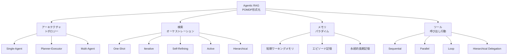

## 論文概要

本記事は [SoK: Agentic Retrieval-Augmented Generation (RAG): Taxonomy, Architectures, Evaluation, and Research Directions](https://arxiv.org/abs/2603.07379) の解説記事です。

Mishra, Niroula, Yadav, Thakur, Gyawali, Gaireの6名による本論文は、RAGシステムが静的なパイプラインからエージェント型アーキテクチャへ進化する過程を包括的に体系化（Systemization of Knowledge）したものである。著者らは、エージェント的な検索-生成ループを有限期間部分観測マルコフ決定過程（POMDP）として形式化し、計画メカニズム・検索オーケストレーション・メモリパラダイム・ツール呼び出し行動の4軸で既存システムを分類している。さらに、4つのシステミックリスクを特定し、今後の研究方向を提示している。

この記事は [Zenn記事: Haystack Agent APIで会話型QAを構築する](https://zenn.dev/0h_n0/articles/23e4f1a8fc45e9) の深掘りです。

## 情報源

- **論文タイトル**: SoK: Agentic Retrieval-Augmented Generation (RAG): Taxonomy, Architectures, Evaluation, and Research Directions
- **arXiv ID**: 2603.07379
- **著者**: Saroj Mishra, Suman Niroula, Umesh Yadav, Dilip Thakur, Srijan Gyawali, Shiva Gaire
- **投稿日**: 2026年3月7日
- **分野**: cs.AI, cs.CL, cs.IR
- **URL**: [https://arxiv.org/abs/2603.07379](https://arxiv.org/abs/2603.07379)

## 背景と動機

### 静的RAGの限界

従来のRAG（Retrieval-Augmented Generation）は「検索してから生成する」という一方向のパイプラインとして構成されてきた。ユーザーのクエリに対してtop-k件の文書を検索し、それをコンテキストとしてLLMに渡して回答を生成する。このアプローチはシンプルで実装しやすいが、著者らは以下の根本的な限界を指摘している。

1. **盲目的な初期検索**: 下流の推論ニーズに適応できない固定的な検索
2. **修正ループの欠如**: ノイズの多い検索結果や不十分なエビデンスに対する自己修正機構がない
3. **コンテキスト過負荷**: 大量のコンテキストが注意機構を劣化させる「lost in the middle」効果
4. **複合クエリの分解不能**: 複雑な質問を検索可能なサブ問題に分解する能力がない

### エージェント型RAGの必要性

これらの限界を克服するため、RAGシステムは「エージェント」としての振る舞いを獲得しつつある。つまり、LLM自身が検索タイミングの判断、クエリの再構成、ツールの選択、中間結果の評価を自律的に行う。しかし、著者らはこの分野の研究が断片的であり、統一的なフレームワークが存在しないことを問題視している。本論文は、この断片化に対する初めての体系的な整理を提供するものである。

### HaystackのAgent API + RAGパターンとの関連

関連するZenn記事で扱ったHaystackのAgent APIは、まさにこの論文が体系化しようとしているAgentic RAGの実装フレームワークの一つに位置づけられる。HaystackのAgentが持つ反復ループ（LLMにメッセージ送信 → ツール呼び出し → State更新 → exit_conditions判定）は、本論文のPOMDP形式化における「ポリシーに基づく逐次的意思決定」に対応している。

## 主要な貢献

著者らが主張する本論文の主要な貢献は以下の通りである。

- **POMDP形式化**: エージェント的検索-生成ループを有限期間部分観測マルコフ決定過程として形式化し、Agentic RAGの統一的な理論基盤を提供
- **多次元分類体系**: アーキテクチャトポロジー、検索戦略、推論パラダイム、メモリ設計の4つの独立な設計軸で既存システムを整理
- **7つの設計パターン**: Plan-Then-Retrieve、Retrieve-Reflect-Refine、Decomposition-Based Retrieval等の再利用可能なパターンを定義
- **システミックリスクの体系化**: 複合的幻覚伝播、メモリポイズニング、検索ミスアライメント、カスケード的ツール実行脆弱性の4つの重大な脆弱性を特定
- **評価フレームワークの提案**: コンポーネント評価・軌跡評価・システム評価の3層パイプラインを提案
- **研究方向の提示**: 安定的な適応検索、コスト考慮オーケストレーション、形式的軌跡評価等の博士レベルの研究課題を提示

## 技術的詳細

### POMDP形式化

本論文の理論的核心は、Agentic RAGシステムを部分観測マルコフ決定過程（POMDP）として定式化した点にある。著者らは以下のようにシステムを定義している。

$$
\mathcal{S}_{\text{ARAG}} = \langle \mathcal{S}_{\text{env}}, \mathcal{A}, \Omega, \mathcal{O}, \pi_\theta, \mathcal{M}, \mathcal{T} \rangle
$$

各要素の定義は以下の通りである。

- **状態空間 $\mathcal{S}_{\text{env}}$**: コーパス $\mathcal{C}$ に存在する潜在的知識。エージェントはこの全体を直接観測できず、検索を通じて部分的に観測する
- **行動空間 $\mathcal{A}$**: $\text{Retrieval} \cup \text{Reasoning} \cup \text{Tool Use} \cup \{\text{STOP}\}$。検索の実行、推論の実施、外部ツールの利用、および処理の終了を含む
- **観測空間 $\Omega$**: 検索されたテキストチャンクやツールの出力。状態空間の部分的な写像
- **観測モデル $\mathcal{O}$**: 隠れ状態と行動から観測への確率的写像。検索エンジンの精度やツールの信頼性がここに反映される
- **ポリシー $\pi_\theta$**: ワーキングメモリ $\mathcal{M}_t$ に条件付けられた確率的制御ポリシー。LLMのパラメータ $\theta$ によって規定される
- **メモリ $\mathcal{M}_t$**: 信念状態を近似する観測可能な履歴。エージェントの意思決定のコンテキストとなる
- **遷移関数 $\mathcal{T}$**: 潜在状態の遷移を記述する関数

最適化の目的関数は以下のように定義されている。

$$
\max_{\pi_\theta} \mathbb{E}_{\tau \sim \pi_\theta} \left[ R_{\text{task}}(y, y^*) - \lambda \sum_{t} C(a_t) \right]
$$

ここで $R_{\text{task}}(y, y^*)$ はタスク報酬（生成された回答 $y$ と正解 $y^*$ の一致度）、$C(a_t)$ は各行動のコスト（API呼び出し料金、レイテンシ等）、$\lambda$ はコストと品質のトレードオフを制御するハイパーパラメータである。

著者らはAgentic RAGの必要十分条件として以下の4つの性質を挙げている。

1. **確率的ポリシーに基づく反復制御**: 固定パイプラインではなく、各ステップでポリシーが行動を選択する
2. **進化する状態に条件付けられた動的検索クエリ**: 過去の検索結果や推論に基づいてクエリを適応的に変化させる
3. **観測モデルを介した明示的なツール媒介インタラクション**: ツールの出力が観測として扱われ、次の意思決定に影響する
4. **ループを跨ぐ永続的なエピソード的ワーキングメモリ**: 各ステップの結果が蓄積され、後続の意思決定に利用される

この形式化により、従来バラバラに議論されてきた様々なAgentic RAGシステムを統一的な枠組みで比較・分析することが可能になる。

### 4つの分類軸の詳細解説

著者らは、Agentic RAGシステムを4つの独立した設計軸（orthogonal axes）で分類している。以下、各軸の詳細を解説する。

#### 軸1: アーキテクチャトポロジーと計画メカニズム

アーキテクチャトポロジーは3種類に分類されている。

**Single-Agent RAG**: 一つのエンティティが計画・検索・生成を統一的な制御ポリシーの下で実行する。ReActがこのカテゴリの代表例であり、推論（Thought）と行動（Action）を交互に実行し、観測（Observation）を受け取るループを形成する。

**Planner-Executor アーキテクチャ**: 計画と実行を明示的に分離する。Plannerがゴールを分解しツールを選択し、Executorが検索を実行して観測を返す。著者らはこのアプローチの強みとして構成的な明確さを挙げる一方、初期分解の誤りに対する脆弱性を指摘している。

**Multi-Agent RAGシステム**: 分散的な意思決定を行う複数のエージェントが協調する。AutoGenの会話プロトコルやLangGraphのグラフベースワークフローがこのカテゴリに含まれる。

計画メカニズムとしては、以下の3つのパターンが特定されている。

- **Plan-Then-Retrieve**: 事前にクエリを分解し、各サブタスクに対して検索を実行してから統合する
- **Retrieve-Reflect-Refine**: 検索 → 草稿生成 → 有用性の振り返り → クエリ洗練を反復する
- **Decomposition-Based Retrieval**: 推論の途中で暗黙的にクエリを分解し、仮説の進化に基づいて検索をトリガーする（IRCoT、ReActなど）

#### 軸2: 検索オーケストレーション戦略

検索のオーケストレーションは、静的なものから適応的なものまで段階的に分類されている。

**One-Shot Retrieval（静的）**: ユーザークエリに対して一度だけ検索を実行し、固定コンテキストで生成する。従来のRAGのベースライン。DPR（Dense Passage Retrieval）やFusion-in-Decoderがこのカテゴリに該当する。

**Iterative Retrieval（反復的）**: 複数回の状態依存的な検索行動を実行し、後続のクエリが先行する検索結果に条件付けられる。IRCoTやIter-RetGenが、検索と中間推論を交互に実行することでこのパターンを実現している。

**Self-Refining Retrieval（自己洗練的）**: 検索と批評・修正ループを結合する。Self-RAGはオンデマンド検索と自己批評を学習し、RARRは言語モデルを使って生成結果を調査・修正する。

**Active Retrieval**: 生成中の確率閾値やヒューリスティックなトリガーで検索タイミングを判断する。FLAREがこのアプローチの代表例である。

**Hierarchical Interfaces**: 字句マッチング、密ベクトル検索、セグメント抽出など粒度の異なるツールを提供し、エージェントが自律的に検索戦略を調整する。A-RAGがこのカテゴリに含まれる。

#### 軸3: メモリパラダイム

メモリシステムは3つのレベルに分類されている。

**短期ワーキングメモリ**: 現在のタスク状態を維持する即時的なスクラッチパッド。動的なコンテキストプルーニング（FILCOやProvence）でコンテキスト枯渇を防止し、厳密な状態チェックポイントでリカバリを可能にする。

**エピソード記憶**: 過去の問題解決行動の離散的な軌跡を捕捉する。Reflexionがフィードバックを格納するエピソード記憶を用い、Generative Agentsが過去の経験に基づく振り返りを行う。CMA（Continuum Memory Architectures）は永続性、減衰、検索誘発干渉をモデル化している。

**永続的長期記憶**: セッションを跨ぐアーティファクト保存と学習されたリフレッシュポリシーを持つ。MemoryBankやMemGPTが、コンテキスト記述の自己生成や、強化学習によるメモリアクセス・保持・忘却の自律的な意思決定を実現している。

#### 軸4: ツール呼び出し行動

ツールオーケストレーションのパターンは以下の4種類が特定されている。

- **Sequential Routing（逐次）**: 共有コンテキストを渡しながらパイプライン的に実行
- **Parallel Routing（並列）**: 独立した検索を並行してファンアウトし、結果を集約
- **Loop Routing（ループ）**: Generator-Criticの反復を収束まで実行
- **Hierarchical Delegation（階層的委任）**: プライマリエージェントが特化したサブエージェントを機能的ツールとしてラップ

### 分類体系の視覚化

以下のMermaidダイアグラムで、本論文の分類体系の全体像を示す。

### 代表的システムのアーキタイプ比較

著者らは、代表的なAgentic RAGシステムを以下のアーキタイプに分類している（論文のTable IIIに基づく）。

| アーキタイプ | トポロジー | 検索戦略 | 推論 | メモリ | 代表システム |
|---|---|---|---|---|---|
| ベースライン接地生成 | Single-Agent | One-Shot | 最小限 | フィルタリング | DPR, FiD |
| 反復的エビデンス蓄積 | Single-Agent | Iterative | CoT/ReAct | 動的コンテキスト | IRCoT, Iter-RetGen |
| 反省的洗練 | Single-Agent | Self-Refining | Reflection | エピソード+プルーニング | Self-RAG, RARR |
| 役割分離オーケストレーション | Planner-Executor | Iterative/Self-Refining | 計画+実行 | Executor logging | Search-R2 |
| 分散型ナレッジワーク | Multi-Agent | Iterative/Mixed | ReAct/Reflective | エージェントローカル | AutoGen, LangGraph |
| メモリ中心長期 | 任意 | Mixed | Reflection | 永続+エピソード | MemGPT, MemoryBank |

### コアアーキテクチャモジュール

著者らは、Agentic RAGシステムを構成する6つのコアモジュールを特定している。

**Plannerモジュール**: 高次元のインテントをトラクタブルなサブタスクに分解し、適応的な実行戦略を策定する。動的なロール割り当てと環境の不確実性に適応する柔軟な計画を通じて、静的RAGの限界に対処する。

**Retrieval Engine**: 密ベクトル、疎キーワード、SQL、知識グラフなど多様なインデキシングを統合するアクティブな論理コプロセッサとして機能する。階層的インターフェースがエージェントに粒度の細かいツールを提供し、多段階ランキングが精度とレイテンシのバランスを取り、出所認識型フェッチングが検証可能性を確保する。

**Reasoning Engine（Controller）**: 検索されたコンテキストを解釈し、合意状態を更新し、段階的な計画解決を管理する。Agent-Computer Interface（ACI）を確立してコンテキスト過負荷やエラー誘発の無限ループを防止する。

**Memory Systems**: 短期ワーキング状態、エピソード軌跡捕捉、永続的長期保存を分離する。自己進化型システムがコンテキスト記述を生成し、強化学習がいつ情報にアクセス・保持・忘却するかを自律的に最適化する。

**Tool Orchestration Layer**: 認知層と外部APIを接続するミドルウェア。ペイロードフォーマッティングとリソース制約を、確定的ルーティング（逐次、並列、ループパターン）を通じて管理する。

**Verification and Self-Correction Modules**: 閉ループPPAR（Perception-Planning-Action-Reflection）サイクルを実装する。ドメイン固有の検証エージェントが事実の不整合を検出し、解決不能なループはHuman-in-the-Loop（HITL）介入にエスカレーションする。

### 7つの設計パターン

著者らは、制御フロー戦略を具体化する7つの再利用可能な設計パターンを定義している。

1. **Plan-Then-Retrieve**: 事前分解 → サブタスクごとの検索 → 中間合成 → 最終回答
2. **Retrieve-Reflect-Refine**: 検索 → 草稿 → 有用性振り返り → クエリ洗練の反復サイクル
3. **Decomposition-Based Retrieval**: 軌跡途中での暗黙的な段階的分解による検索トリガー
4. **Tool-Augmented Retrieval Loop**: 反復的なツール呼び出しと観測の取り込み
5. **Multi-Agent Collaboration**: エージェント間の情報交換による分散的問題解決
6. **Retrieval-Grounded Self-Verification**: 内部または外部の批評者による検索エビデンスとの照合
7. **Human-As-A-Tool（HITL）**: エージェントが解決不能な決定に対するエスカレーションパス

## システミックリスクの分析

著者らは、Agentic RAGシステムに固有の6つのシステミックリスクを特定し、反復ループが脆弱性を増幅するメカニズムを分析している。

### 検索ドリフトとクエリミスアライメント

反復システムにおいて、クエリの再構成が誤解を複合的に積み重ねることで、元の意図から段階的に乖離していく。著者らはこれを「検索ドリフト」と呼び、multi-hopタスクにおいて特に深刻であると指摘している。HaystackのAgent APIにおける`max_agent_steps`パラメータは、この無限ドリフトを防止するための実装上のセーフガードに対応する。

### 検索にもかかわらず発生する幻覚

検索コンテキストが存在する場合でも、エビデンスが不完全または矛盾している場合にモデルは幻覚を生成する。著者らは、モデルが自己の不整合を検出できないことを問題視している。Agentic RAGでは、反復ループを通じて幻覚が次のステップの入力となり、エラーが伝播・増幅される「複合的幻覚伝播」が発生する。

### ツールの誤用とカスケードエラー

逐次的なツールチェーンにおいて、初期段階の軽微な実行失敗がワークフロー全体に伝播する。エラーリカバリ機構がない場合、一つのツール呼び出しの失敗が後続のすべてのステップを汚染する。Haystackの`exit_conditions`による早期終了は、このカスケードを制限するためのメカニズムとして機能する。

### 反復検索におけるプロンプトインジェクション

検索された文書が敵対的なプロンプトを含む場合、後続の推論ステップが操作される。反復検索システムでは、汚染された文書が複数のステップにわたって影響を及ぼすため、攻撃の影響が増大する。

### メモリポイズニング

エピソード記憶や永続記憶に破損したエントリが混入すると、下流の計画や検索の意思決定が劣化する。著者らは、勾配ベースの攻撃と意味的攻撃の両方に対する耐性が不十分であると指摘している。

### システミックリスクの増幅

上記の脆弱性は独立ではなく、反復ループを通じて相互に増幅する。幻覚のフィードバックループ、収束なしの無限反復、制御不能なコンテキスト成長が組み合わさることで、システム全体の信頼性が急速に低下する。著者らは、ループ内検証（in-loop verification）の導入を緩和策として提案している。

### 各リスクの緩和策

| リスク | 具体例 | 緩和策 |
|---|---|---|
| 検索ドリフト | multi-hopで元の質問から逸脱 | 反復回数制限、元クエリとの類似度監視 |
| 複合的幻覚伝播 | 誤った中間回答に基づく再検索 | Self-Verification、PPAR サイクル |
| カスケードツール実行 | API呼び出し失敗の連鎖 | exit_conditions、フォールバック機構 |
| プロンプトインジェクション | 検索文書内の悪意あるプロンプト | 入力サニタイズ、出所検証 |
| メモリポイズニング | 破損エントリによる意思決定劣化 | メモリ整合性チェック、減衰メカニズム |
| システミック増幅 | 上記の複合的な相互作用 | ループ内検証、HITL エスカレーション |

## 実装のポイント

本論文の分類体系は、HaystackのAgent APIアーキテクチャと密接に対応している。

**POMDPポリシーとAgent反復ループ**: Haystackの`Agent`クラスが実装する「LLMにメッセージ送信 → ツール呼び出し → State更新 → exit_conditions判定」のループは、本論文のPOMDP形式化における確率的ポリシー $\pi_\theta$ に基づく逐次的意思決定そのものである。`max_agent_steps`は有限期間の制約に、`exit_conditions`はSTOP行動の条件に対応する。

**PipelineToolとツールオーケストレーション**: Haystackの`PipelineTool`は、既存のPipelineをツールとしてラップする機構であり、本論文のHierarchical Delegation（階層的委任）パターンに対応する。RAGパイプラインをPipelineToolとしてエージェントに登録することで、エージェントが検索タイミングを自律的に判断するAgentic RAGパターンが実現できる。

**State管理とメモリパラダイム**: Haystackの`state_schema`による型安全なツール間データ共有は、本論文の短期ワーキングメモリに相当する。`InMemoryChatMessageStore`を用いた会話履歴管理はエピソード記憶に、セッション跨ぎのState永続化は永続的長期記憶に対応する。

**MCPToolと外部ツール連携**: HaystackのMCP（Model Context Protocol）統合は、本論文のTool Orchestration Layerに位置づけられる。MCPサーバーを通じて外部サービスに接続することで、エージェントの行動空間 $\mathcal{A}$ を動的に拡張できる。

## 実運用への応用

### Agentic RAGの設計パターン選択指針

本論文の分類体系は、実運用システムの設計において以下のような指針を提供する。

**シンプルなFAQシステム**: One-Shot Retrieval + Single-Agent + 短期ワーキングメモリで十分。計画や反復のオーバーヘッドが不要な場合は、従来のRAGパイプラインが最適である。

**multi-hopの質問応答**: Iterative Retrieval + Decomposition-Based Retrieval + エピソード記憶が適する。IRCoTやReActのパターンで、検索と推論を交互に実行する。

**長期対話型アシスタント**: Self-Refining Retrieval + 永続的長期記憶 + Loop Routingが必要。MemGPTのようなメモリ管理機構を導入し、セッションを跨ぐ知識の蓄積と活用を行う。

**エンタープライズ知識検索**: Multi-Agent + Hierarchical Interfaces + HITL。複数のデータソースを持つ大規模システムでは、専門化されたサブエージェントへの委任と、信頼度が低い場合の人間へのエスカレーションが重要となる。

### コスト-品質トレードオフ

著者らは、Agentic RAGの設計において3つのトレードオフが不可避であると主張している。

- **検索深度 vs コスト**: 深い検索はmulti-hopのカバレッジを向上させるが、API呼び出し回数とコンテキスト長が増大する
- **計画複雑度 vs レイテンシ**: 明示的な計画はエラーを削減するが、推論のオーバーヘッドが積み重なる
- **トークンエコノミクス**: 反復的アプローチはモデル呼び出し回数と中間推論トークンを乗算的に増加させる

目的関数の $\lambda$ パラメータが示すように、タスク報酬と累積コストのバランスを最適化することが、実運用システムの設計において最も重要な課題の一つである。

### 評価の3層パイプライン

著者らは、Agentic RAGシステムの評価に関して既存のベンチマーク（HotpotQA、FEVER等）が最終回答の精度のみを測定し、軌跡の品質を無視していることを問題視している。代替として以下の3層評価パイプラインを提案している。

- **Layer 1: コンポーネント評価** — Plannerの精度、検索のPrecision/Recall、推論の整合性を独立に評価
- **Layer 2: 軌跡の整合性** — 推論ステップが論理的に接続し、検索の選択が目的と整合しているかを評価
- **Layer 3: システム成果** — 事実性、エビデンスへの忠実性、コスト-品質のトレードオフを測定

## 関連研究

本論文は以下の先行研究との関係を明確にしている。

- **Lewis et al. (2020)** の原著RAG論文は、検索と生成の統合という基本的なアイデアを提示したが、静的な一方向パイプラインに限定されていた。本論文はこれをPOMDPベースの逐次的意思決定へと拡張している。

- **Yao et al. (2023)** のReActは、推論と行動の交互実行パターンを提案し、Agentic RAGの基盤となった。本論文はReActを含む複数のパターンを統一的に分類する枠組みを提供している。

- **Asai et al. (2024)** のSelf-RAGは、LLMがいつ検索するかを学習し、自己批評を行うアプローチを提案した。本論文の分類ではSelf-Refining Retrievalカテゴリに位置づけられている。

- **Gao et al. (2024)** のRAGサーベイは、検索・生成・拡張の3段階でRAGを整理したが、エージェント的な側面の体系化は不十分であった。本論文はこの空白を埋めるものとして位置づけられている。

- **FLARE (Jiang et al., 2023)** は生成中の確率閾値に基づくActive Retrievalを提案し、本論文のActive Retrieval分類の代表例として参照されている。

## まとめと今後の展望

本論文は、Agentic RAGという急速に発展する分野に対して、初めての統一的な理論基盤と分類体系を提供した。POMDP形式化により、多様なシステムを共通の枠組みで比較可能にしたことの意義は大きい。

著者らが提示する今後の研究方向として、安定的な適応検索（いつ検索しいつ推論するかの原理的なポリシー設計）、形式的な軌跡評価（回答一致を超えた推論品質の評価）、メモリの堅牢性（ポイズニング攻撃への耐性）、コスト考慮型オーケストレーション（トークン予算とレイテンシ制約の統合）、信頼較正と監視メカニズム（エスカレーション基準の形式化）が挙げられている。

Haystackのようなフレームワークが提供するAgent API、PipelineTool、State管理、MCP統合といった機能は、本論文が体系化した各設計軸の具体的な実装手段として位置づけることができる。本論文の分類体系を参照することで、実装するシステムの設計判断をより体系的に行うことが可能になる。

## 参考文献

- Mishra, S., Niroula, S., Yadav, U., Thakur, D., Gyawali, S., & Gaire, S. (2026). SoK: Agentic Retrieval-Augmented Generation (RAG): Taxonomy, Architectures, Evaluation, and Research Directions. arXiv:2603.07379.
- Lewis, P., Perez, E., Piktus, A., et al. (2020). Retrieval-Augmented Generation for Knowledge-Intensive NLP Tasks. NeurIPS 2020.
- Yao, S., Zhao, J., Yu, D., et al. (2023). ReAct: Synergizing Reasoning and Acting in Language Models. ICLR 2023.
- Asai, A., Wu, Z., Wang, Y., Sil, A., & Hajishirzi, H. (2024). Self-RAG: Learning to Retrieve, Generate, and Critique through Self-Reflection. ICLR 2024.
- Gao, Y., Xiong, Y., Gao, X., et al. (2024). Retrieval-Augmented Generation for Large Language Models: A Survey. arXiv:2312.10997.
- Jiang, Z., Xu, F. F., Gao, L., et al. (2023). Active Retrieval Augmented Generation. EMNLP 2023.
- Shinn, N., Cassano, F., Gopinath, A., et al. (2023). Reflexion: Language Agents with Verbal Reinforcement Learning. NeurIPS 2023.
- Packer, C., Wooders, S., Lin, K., et al. (2024). MemGPT: Towards LLMs as Operating Systems. ICLR 2024.
