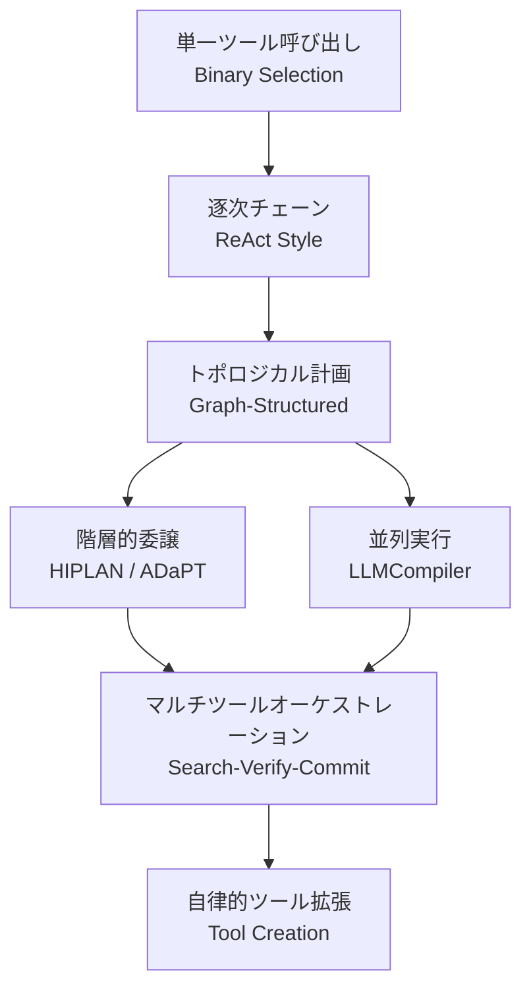
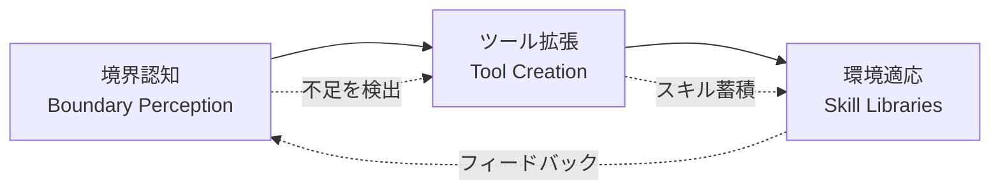

## 論文概要（Abstract）

本記事は [The Evolution of Tool Use in LLM Agents: From Single-Tool Call to Multi-Tool Orchestration](https://arxiv.org/abs/2603.22862) の解説記事です。本論文は、LLMエージェントにおけるツール使用が初期の単一ツール呼び出しから、状態管理・フィードバックループ・依存関係モデリングを伴うマルチツールオーケストレーションへと進化した過程を包括的にレビューしたサーベイである。著者らは6つのコア分析次元（推論時計画・学習・安全性・効率性・能力完全性・ベンチマーク設計）を軸に既存研究を整理し、単一ツール選択の正否を問う段階から、動的なツール集合選択・依存関係モデリング・障害復旧・再計画を含む結合的意思決定への質的転換を論じている。

この記事は [Zenn記事: Haystack Agent APIで会話型QAを構築する：Tool統合・State管理・MCP連携](https://zenn.dev/0h_n0/articles/23e4f1a8fc45e9) の深掘りです。Zenn記事で扱ったHaystackのAgent APIにおけるツール統合パターン（`@tool`・`PipelineTool`・`MCPTool`）やState管理が、本論文の分析フレームワークのどこに位置づけられるかを対応付けながら解説します。

## 情報源

- **arXiv ID**: 2603.22862
- **URL**: [https://arxiv.org/abs/2603.22862](https://arxiv.org/abs/2603.22862)
- **著者**: Haoyuan Xu, Chang Li, Xinyan Ma, et al.
- **発表年**: 2026年3月
- **分野**: cs.SE（ソフトウェア工学）, cs.CL（計算言語学）

## 背景と動機

LLMエージェントのツール使用研究は、当初「モデルが正しいツールを選択し、適切な引数で呼び出せるか」という二項選択の正確性を問う段階から始まった。Toolformer（Schick et al., 2023）やGorilla（Patil et al., 2023）に代表される初期の研究では、単一のAPIを正しく呼び出すことが主要な課題であった。

しかし、実世界のタスクは単一ツール呼び出しでは完結しない。例えば、会話型QAシステムでは、ナレッジベース検索・データベース問い合わせ・計算処理・外部API呼び出しといった複数のツールを、依存関係を考慮しながら動的に選択・実行する必要がある。Zenn記事で紹介したHaystackのAgent APIが`PipelineTool`や`MCPTool`を組み合わせてマルチツール連携を実現しているのは、まさにこの要請への実践的な応答である。

著者らは、単一ツール呼び出しからマルチツールオーケストレーションへの移行が「量的な拡張ではなく質的な転換」であると主張している。具体的には、状態の一貫性維持、並列実行時の競合回避、エラー連鎖からの復旧、フィードバックに基づく動的再計画といった新たな課題が生じる。既存のサーベイがツール学習（Qu et al.）やエージェント方法論（Luo et al.）を個別に扱ってきたのに対し、本論文はマルチツールオーケストレーションを一次的な分析単位として据え、6つの連関する次元で統一的に整理した点に独自性がある。

## 主要な貢献

著者らは本論文の貢献として以下の点を挙げている。

1. **マルチツールオーケストレーションの形式的定義**: ツール集合 $D$、状態遷移 $s_t$、コスト関数を含む統一的な問題定式化を提示し、単一ツール呼び出しとマルチツールオーケストレーションの境界を明確化した
2. **6次元分析フレームワーク**: 推論時計画・学習・安全性・効率性・能力完全性・ベンチマーク設計の6つの次元を相互に関連付けた体系的な整理を行った
3. **40以上のベンチマークの体系的分類**: トポロジカル複雑性・時間スケール・環境動態・状態永続性の4軸でベンチマークを分類し、評価の包括性を可視化した
4. **応用ドメインの横断的分析**: ソフトウェアエンジニアリング・企業ワークフロー・GUI自動化・モバイルシステムにおけるマルチツールオーケストレーションの実態を整理した
5. **未解決課題の明示**: 信用割当の理論的基盤、オーケストレーション正当性の形式的保証、動的APIエコシステムへのスケーラビリティなど、今後の研究方向を提示した

## 技術的詳細

### 問題定式化

著者らはマルチツールオーケストレーションを以下のように定式化している。

クエリ空間 $q \in Q$、潜在状態 $s_t$ と観測 $o_t$ を持つ対話的環境、ツールインベントリ $D = \{d_i\}$ が与えられたとき、行動空間は次のように定義される。

$$a_t \in A := (D \times U) \cup \{\text{Finish}(y)\}$$

ここで $U$ は引数空間、$\text{Finish}(y)$ は最終出力 $y$ を伴う終了アクションである。実行インターフェースは、ツール $d$ と引数 $u$ を受け取り、フィードバック $f$ と新しい状態 $s'$ を返す。

$$\text{Exec}(d, u; s) \rightarrow (f, s')$$

最適化目標は、タスク成功報酬と計算コストのバランスを取る。

$$\max_\theta \mathbb{E}\left[R_{\text{task}}(q, \tau, y) - \lambda \cdot \text{Cost}(\tau)\right]$$

ここで $\tau$ は可変長の軌跡（trajectory）、$\lambda$ はコスト重みパラメータである。この定式化により、単一ツール呼び出し（$|\tau| = 1$）はマルチツールオーケストレーション（$|\tau| \gg 1$、ツール間依存関係あり）の特殊ケースとして位置づけられる。

### 6つのコア分析次元

#### 次元1: 推論時計画と実行（Section 3）

著者らは推論時のパラダイムを3つの階層に分類している。

**トポロジカル計画（Section 3.1）**: ReActに代表される逐次的な思考-行動チェーンは、ネスト呼び出しや並列I/O操作に対して「構造的ミスマッチ」を示すと著者らは指摘している。これに対し、ToolNetやStructuredAgentはツール使用を有向グラフやAND/OR分解として表現し、非同期・部分並列化可能なサブ問題を扱えるようにしている。AutoToolは過去のツール遷移パターンから規則性を抽出し、不要な推論をバイパスするアプローチを取る。

**長期的オーケストレーション（Section 3.2）**: 階層的な委譲アプローチとして以下の手法が紹介されている。

- **HIPLAN**: マクロスコピックなマイルストーン空間での計画と、下位レベルでの状態ギャップ解消を行う二層アーキテクチャ
- **ADaPT**: フラット実行をデフォルトとし、失敗時にのみ再帰的に分解を呼び出す適応的アプローチ
- **AFlow**: 推論を実行可能なノード構成と制御フローエッジとして表現するフレームワーク

**エージェントの自己改善（Section 3.3）**: 探索とコミットを分離するアプローチとして、Smurfs（コンテキスト効率的なロールバックとブランチ分離）、AB-MCTS（外部フィードバック下での適応的分岐）、ARTIS（内部シミュレータによる探索とコミットの分離）が挙げられている。著者らはこれらを「生成して実行する（generate-once-and-execute）」パラダイムから「探索し、検証し、コミットする（search-verify-commit）」パラダイムへの移行として位置づけている。

#### 次元2: 学習と軌跡構築（Section 4）

学習パラダイムは計算オーバーヘッドの昇順で4段階に整理されている。

**訓練不要手法（Section 4.1）**: ToolLLMのようなツール検索やプロンプトエンジニアリング、MCP-Zeroによるアクティブなツール発見、Mementoによるエピソード記憶を活用するアプローチが含まれる。

**合成データ生成（Section 4.2）**: 著者らは「合成-検証-拡張（Synthesis-Validation-Expansion）」フレームワークを提示している。

1. **合成（Synthesis）**: ツールグラフに構造的に根ざした組成的軌跡をセルフブートストラップで生成する
2. **検証（Validation）**: 構文チェック、実行ベースの検証、意味的検証の3段階で実行ベースの品質保証を行う
3. **拡張（Expansion）**: ロングテールの失敗パターンに対応するため、ツール組成空間の体系的な探索を行う

**教師あり微調整（Section 4.3）**: Gorilla、GPT4Tools、ToolGen（検索と呼び出しの統一）、Chain-of-Abstraction（推論とツール実行の分離）といった手法が紹介されている。ToolGenはツール検索とツール呼び出しを統一的なモデルで扱い、Chain-of-Abstractionは推論プロセスをツール実行から分離することでモジュール性を高めている。

**強化学習（Section 4.4）**: 階層的報酬メカニズムとターンレベルのポリシー最適化を用いたアプローチが含まれる。マルチツールオーケストレーションでは、長い軌跡における信用割当（credit assignment）が依然として困難な課題であると著者らは指摘している。

#### 次元3: 安全性と制御（Section 5）

著者らは安全性リスクを並列実行と長期的ツールチェーンの2つの文脈で分類している。

**並列実行のリスク（Section 5.1）**:

| リスク類型 | 障害モード | 防御メカニズム |
|-----------|-----------|--------------|
| 並行競合 | 競合状態、書き込み干渉、共有状態の破損 | 依存関係認識スケジューリング、ポリシーゲーティング、事前ディスパッチ検証 |
| 部分コミット | 不可逆な副作用によるグローバルな状態不整合 | トランザクション型分離、遅延コミット、補償・ロールバック |
| 実行後異常 | ツール実行後にのみ発現する安全性違反 | 批評者/検証者ベースの監査、実行時チェック |

**長期的ドリフトのリスク（Section 5.2）**:

| リスク類型 | 障害モード | 防御メカニズム |
|-----------|-----------|--------------|
| 記憶/計画汚染 | 悪意あるコンテキストがステップ間で永続化し再活性化 | 軌跡レベルの検証、メタ検証、証拠ベースの棄却 |
| 長期的ドリフト | エラー蓄積、状態汚染、混乱した代理人の行動 | 先読み探索、ロールバック、トレース診断 |

具体的な防御手法として、SagaLLM（トランザクションセマンティクス）、Atomix（エポックベースの分離）、CRITIC（自己修正）が挙げられている。SagaLLMはデータベースのSagaパターンをエージェントのツール実行に適用し、部分的な失敗時の補償トランザクションを実現するアプローチである。

#### 次元4: リソース制約下の効率性（Section 6）

効率性の最適化は、レイテンシ削減とコスト管理の2つの軸で整理されている。

**レイテンシ削減**: 独立したサブタスクの並列実行（LLMCompiler）、計画とI/O集約型実行の非同期分離、投機的推論によるレイテンシのマスキングの3つのアプローチが紹介されている。LLMCompilerはツール間の依存関係を解析し、独立したツール呼び出しを並列に実行することで、逐次実行と比較して大幅なレイテンシ削減を実現する。

**コスト管理**: 動的ツール検索によるコンテキストオーバーヘッドの削減、タスク難易度に応じた適応的モデルルーティング（小型モデルと大型モデルのカスケード）、インテリジェントキャッシングによる重複呼び出しの回避が含まれる。

#### 次元5: 能力完全性（Section 7）

オープン環境でのエージェント能力を3段階で整理している。

1. **能力境界の認知（Section 7.1）**: エージェントが自らのツール集合の限界を認識し、曖昧な意図に対して能動的に明確化を求める能力
2. **自律的ツール拡張（Section 7.2）**: LATM（Large Language Models as Tool Makers）に代表される、コード生成によるツールの自律的作成。エージェントが必要なツールが存在しない場合に、Pythonコードとしてツールを生成する
3. **オープン環境への適応（Section 7.3）**: Voyager（スキルライブラリへの経験の統合）やExpeL（経験からの学習）のように、経験を再利用可能なスキルとして蓄積し、長期的な進化を実現する

#### 次元6: ベンチマーク設計と評価（Section 8）

著者らはベンチマークを4つの評価軸で分類している。

- **トポロジカル複雑性（Section 8.1）**: ツール間の依存関係構造の複雑さ。単純な線形チェーンからDAG（有向非巡回グラフ）構造まで
- **時間スケール（Section 8.2）**: 軌跡の長さと実行時間。短期的なAPI呼び出しから長期的なマルチセッションタスクまで
- **環境動態（Section 8.3）**: 静的データセット、対話的シミュレータ、実世界環境の3段階
- **状態永続性（Section 8.4）**: ステップ間での状態の維持と自己修正の評価

### マルチツールオーケストレーションの設計パターン

論文の分析から、マルチツールオーケストレーションには以下の設計パターンが抽出される。

**逐次チェーンパターン**: ReAct型の思考-行動-観察のループ。実装が容易だが、早期の決定エラーが軌跡全体に伝播するリスクがある。

**DAG実行パターン**: ツール間の依存関係を有向グラフとして表現し、独立したツールは並列実行する。LLMCompilerがこのパターンの代表例である。

**階層的委譲パターン**: 高レベルの計画と低レベルの実行を分離する。HIPLANの二層アーキテクチャやADaPTの適応的分解がこれに該当する。

**探索-検証-コミットパターン**: 複数の実行パスを探索し、学習済み評価器で品質を検証した上で、高信頼度の行動系列のみをコミットする。

## 実装のポイント

### マルチツールオーケストレーションの設計パターンとHaystack

本論文の分析フレームワークは、Zenn記事で紹介したHaystackのAgent APIと以下のように対応する。

**ツール統合**: Haystackの`@tool`デコレータは単一関数のツール化、`PipelineTool`は既存パイプライン全体のツール化、`MCPTool`は外部MCPサーバーとの連携を担う。論文の分類では、`@tool`はアトミックなツール呼び出し、`PipelineTool`はサブパイプラインの組成的実行、`MCPTool`はオープン環境でのツール発見（MCP-Zeroに類似）にそれぞれ対応する。

**状態管理**: Haystackの`state_schema`によるツール間データ共有は、論文が指摘する「状態永続性」の課題に対する実装レベルの解決策である。`state_schema`で型付きの共有状態を定義し、各ツールが読み書きすることで、ツール間のデータ整合性を担保できる。これは論文のSagaLLMが扱うトランザクション型の状態管理の簡易版と位置づけられる。

**動的ツール選択**: HaystackのAgentはLLMがループ内でツールを動的に選択する。これは論文の「推論時計画」次元におけるReAct型の逐次チェーンに相当する。`exit_conditions`や`max_agent_steps`による制御は、論文が指摘する「長期的ドリフト」リスクへの実用的な緩和策である。

**MCPとの対応**: HaystackのMCPToolは、論文のSection 7（能力完全性）で議論されている「オープン環境への適応」と直接関連する。MCP準拠のツールサーバーを動的に発見・接続することで、エージェントのツールインベントリを実行時に拡張できる。

## 実験結果（ベンチマーク分析）

本論文はサーベイであるため独自の実験結果は含まれていないが、著者らは40以上のベンチマークを体系的に分析している。以下に代表的なベンチマークを整理する（論文Section 8より）。

| ベンチマーク | ツール数 | インスタンス数 | 環境タイプ | 評価対象 |
|------------|---------|-------------|-----------|---------|
| NESTFUL | 900+ | 1,800 | 静的（S） | トポロジカル複雑性 |
| ToolBench | 3,451 | 126,000+ | 静的（S） | 大規模ツール空間 |
| StableToolBench | 16,000+ | - | 静的（S） | API安定性 |
| ToolGym | 5,571 | - | 対話（I） | 動的環境 |
| UltraHorizon | 400+ | 168 | 静的（S） | 超長期軌跡 |
| OSWorld | - | 369 | 実世界（R） | デスクトップ操作 |
| Windows Agent Arena | - | - | 実世界（R） | Windows GUI |
| Mobile-Bench | - | - | 実世界（R） | モバイルアプリ |
| AppWorld | - | - | 実世界（R） | アプリ組成 |
| RealWebAssist | - | 1,885 | 人間（H） | ウェブ操作 |
| MTU-Bench | - | 159,000+ | 静的（S） | 大規模インスタンス |
| τ-bench / τ²-bench | - | - | 人間（H） | 人間評価 |

環境タイプ: S=静的データセット、I=対話型シミュレータ、R=実世界システム、H=人間評価

著者らは、既存ベンチマークの多くが静的データセットに偏っており、実世界の動的環境やマルチセッションにわたる状態永続性の評価が不十分であると指摘している。特に、ツール間の依存関係のトポロジカル複雑性を体系的に評価するベンチマーク（NESTFUL、ToolHop）と、超長期軌跡を扱うベンチマーク（UltraHorizon、AgentLongBench）のギャップが大きいと述べている。

## 実運用への応用

### HaystackのAgent APIとの関連

本論文の分析は、Haystackを用いたマルチツール型QAシステムの設計に複数の示唆を与える。

**PipelineToolの位置づけ**: 論文のDAG実行パターンの観点から、HaystackのPipelineToolは「パイプライン全体を1つのアトミックなツールとしてカプセル化する」アプローチであり、内部の依存関係解決をパイプライン層に委ねることで、Agentレベルの計画複雑性を軽減する設計と解釈できる。

**MCPToolとツール発見**: 論文のSection 7で議論されている「自律的ツール拡張」は、MCPToolの設計思想と合致する。MCPプロトコルにより、Agentは実行時に利用可能なツールを動的に発見し、ツールインベントリを拡張できる。Zenn記事で示した`StdioServerInfo`と`StreamableHttpServerInfo`の2つのトランスポートは、ローカルとリモートのツール発見をそれぞれサポートしている。

**会話型QAでのマルチツール設計**: 実際の会話型QAシステムでは、以下のようなマルチツール構成が考えられる。

1. **ナレッジベース検索**（PipelineTool）: RAGパイプラインをラップ
2. **データベース問い合わせ**（MCPTool）: SQL実行用MCPサーバーに接続
3. **計算処理**（@tool）: 類似度計算や集計をPython関数で実装
4. **外部API呼び出し**（MCPTool）: 時刻取得やメール送信などのユーティリティ

論文の分析に基づけば、これらのツール間の依存関係を明示的にモデリングし、独立したツール（例: 時刻取得と検索）は並列実行する設計が効率性の観点から望ましい。Haystackの現行Agent APIはReAct型の逐次実行が基本だが、`state_schema`を活用してツール間の中間結果を共有し、依存関係のあるツールチェーンを構成することは可能である。

## 関連研究

著者らは本論文の位置づけを明確にするため、以下の先行サーベイと比較している。

- **Wang et al.**: LLMの観点からのツール定義に焦点。ツールの記述・選択・呼び出しのパイプラインを整理しているが、マルチツール間の依存関係やオーケストレーションの複雑性は主要な分析対象としていない
- **Qu et al.**: ツール学習全般（計画・選択・呼び出し）をカバーするが、単一ツール呼び出しとマルチツールオーケストレーションの質的な違いを強調していない
- **He et al.**: LLMエージェントのセキュリティとプライバシーに特化。本論文のSection 5（安全性）と部分的に重複するが、効率性や能力完全性の次元は扱っていない
- **Mohammadi et al.**: 評価とベンチマーキングに焦点。本論文のSection 8と補完的な関係にある

本論文の独自性は、マルチツールオーケストレーションを一次的な分析単位として据え、6つの次元を相互に関連付けた統一的フレームワークを提供している点にあると著者らは主張している。

## まとめと今後の展望

本論文は、LLMエージェントのツール使用が単一呼び出しからマルチツールオーケストレーションへ進化した過程を6つのコア分析次元で包括的に整理した。著者らは、この進化が二項選択の正否判定から、動的なツール集合選択・依存関係モデリング・スケジューリング・障害復旧・再計画を含む結合的意思決定への質的転換であると結論付けている。

著者らが提示する今後の研究方向は以下の通りである。

- **信用割当の理論的基盤**: 長い軌跡における各ツール呼び出しの貢献度を正確に評価する理論の構築
- **オーケストレーション正当性の形式的保証**: ツールチェーンの正しさを形式的に検証する手法の開発
- **動的APIエコシステムへのスケーラビリティ**: 実世界のAPIが変更・廃止される環境での適応能力
- **長期記憶と生涯学習の統合**: マルチセッションにわたる経験の蓄積と活用
- **環境間汎化と転移**: 異なるドメイン・ツール集合間でのオーケストレーション能力の転移

HaystackのAgent APIのようなフレームワークは、本論文が整理した課題の多くに対する実装レベルの解決策を提供しつつある。`state_schema`による状態管理、MCPToolによるオープン環境対応、PipelineToolによるパイプライン資産の再利用は、論文の分析次元と直接的に対応しており、研究と実装のギャップを埋める重要な役割を果たしている。

## 参考文献

1. Xu, H., Li, C., Ma, X., et al. (2026). "The Evolution of Tool Use in LLM Agents: From Single-Tool Call to Multi-Tool Orchestration." arXiv:2603.22862.
2. Schick, T., et al. (2023). "Toolformer: Language Models Can Teach Themselves to Use Tools." NeurIPS 2023.
3. Patil, S. G., et al. (2023). "Gorilla: Large Language Model Connected with Massive APIs." arXiv:2305.15334.
4. Yao, S., et al. (2023). "ReAct: Synergizing Reasoning and Acting in Language Models." ICLR 2023.
5. Kim, S., et al. (2024). "LLMCompiler: An LLM Compiler for Parallel Function Calling." ICML 2024.
6. Cai, T., et al. (2024). "LATM: Large Language Models as Tool Makers." ICLR 2024.
7. Wang, G., et al. (2023). "Voyager: An Open-Ended Embodied Agent with Large Language Models." NeurIPS 2023.
8. Qin, Y., et al. (2024). "ToolLLM: Facilitating Large Language Models to Master 16000+ Real-world APIs." ICLR 2024.
9. Haystack Documentation. (2026). "Agent API - Haystack." https://docs.haystack.deepset.ai/docs/agent
10. Model Context Protocol Specification. (2025). "MCP Specification." https://spec.modelcontextprotocol.io/
