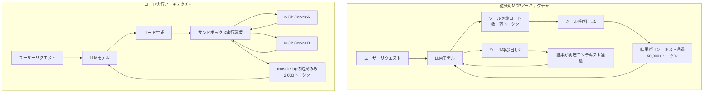

## ブログ概要

本記事は [Code execution with MCP: Building more efficient AI agents](https://www.anthropic.com/engineering/code-execution-with-mcp) の解説記事です。

Anthropic Engineeringチームの Adam Jones 氏と Conor Kelly 氏は、MCPサーバーを直接的なツール呼び出しではなくコードAPIとして提示することで、エージェントの効率を大幅に向上させるアーキテクチャを提案している。従来のMCPツール呼び出しでは、数千のツール定義がコンテキストウィンドウを圧迫し、中間結果がモデルを複数回通過することで冗長なトークン消費が発生していた。著者らは、MCPサーバーをTypeScriptファイルシステム構造として提示し、コード実行環境内でデータフィルタリングや制御フローを処理するアーキテクチャにより、150,000トークンから2,000トークンへの98.7%削減を報告している（ブログ記載のベンチマーク値より）。

この記事は [Zenn記事: Haystack Agent APIで会話型QAを構築する：Tool統合・State管理・MCP連携](https://zenn.dev/0h_n0/articles/23e4f1a8fc45e9) の深掘りです。

## 情報源

- **種別**: 企業テックブログ
- **URL**: [https://www.anthropic.com/engineering/code-execution-with-mcp](https://www.anthropic.com/engineering/code-execution-with-mcp)
- **組織**: Anthropic Engineering
- **著者**: Adam Jones, Conor Kelly
- **発表日**: 2025年11月4日

## 技術的背景

### MCPのコンテキスト過負荷問題

Model Context Protocol（MCP）は2024年11月にAnthropicが公開したエージェント・ツール連携の標準プロトコルであり、公開以来数千のコミュニティ製MCPサーバーが構築されている。しかし、著者らはMCPの普及に伴い2つの効率性の課題が顕在化していると述べている。

第一の課題は**ツール定義によるコンテキスト過負荷**である。エージェントが数千のツールに接続する場合、ツール定義だけで数十万トークンを消費する。モデルはリクエストを読む前にこれらの定義を処理する必要があり、応答時間とコストが増大する。

第二の課題は**中間結果による冗長なトークン消費**である。従来のMCPアーキテクチャでは、MCPクライアントがツール定義をモデルのコンテキストウィンドウにロードし、各ツール呼び出しと結果がモデルを通過するメッセージループを構成する。例えば、Google Driveから2時間の会議書き起こし（50,000+トークン）を取得してSalesforceに書き込むタスクでは、書き起こしデータがモデルのコンテキストを2回通過し、150,000トークン以上を消費する可能性がある（ブログの具体例より）。

### HaystackのMCPToolとの関連

関連するZenn記事で紹介したHaystackのAgent APIでは、`MCPTool`を通じてMCPサーバーと連携する設計を採用している。HaystackのToolインターフェースはツール定義をJSON Schemaとしてモデルに渡す標準的なアプローチであり、本ブログで指摘されたコンテキスト過負荷の課題が同様に当てはまる。本ブログの提案するコード実行アーキテクチャは、Haystackに限らずMCPを利用するすべてのエージェントフレームワークに適用可能な効率化パターンである。

## 実装アーキテクチャ

### コード実行アーキテクチャの全体設計

著者らが提案するアーキテクチャの核心は、MCPサーバーの各ツールをTypeScript関数として公開し、エージェントがコードを生成・実行することでツール間の連携を行う点にある。従来のアプローチでは各ツール呼び出しの結果がモデルのコンテキストウィンドウを通過するのに対し、コード実行アーキテクチャではサンドボックス化された実行環境内でデータ処理が完結する。



### Progressive Disclosure: ファイルシステムベースのツール発見

著者らは、すべてのツール定義を事前にロードする代わりに、ファイルシステム探索によるオンデマンドのツール発見メカニズムを提案している。MCPサーバーは以下のTypeScriptファイルシステム構造として提示される。

```
servers/
├── google-drive/
│   ├── getDocument.ts
│   ├── getSheet.ts
│   └── index.ts
├── salesforce/
│   ├── updateRecord.ts
│   ├── query.ts
│   └── index.ts
├── slack/
│   ├── getChannelHistory.ts
│   └── index.ts
└── [other servers]
```

エージェントはまず`./servers/`ディレクトリを一覧し、利用可能なサーバーを発見する。次に、タスクに必要なサーバーのディレクトリに入り、特定のツールファイルを読み込む。これにより、数千のツール定義を一括ロードする必要がなくなる。

著者らはさらに代替アプローチとして、`search_tools`ユーティリティの実装も提案している。詳細度パラメータを指定し、「名前のみ」「名前と説明」「スキーマを含む完全な定義」といったレベルでツール情報を段階的に取得する方式である。

各ツールファイルは以下のようなTypeScriptモジュールとして定義される。

```typescript
import { callMCPTool } from "../../../client.js";

interface GetDocumentInput {
  documentId: string;
}

interface GetDocumentResponse {
  content: string;
}

/** Google Driveからドキュメントを取得する */
export async function getDocument(
  input: GetDocumentInput
): Promise<GetDocumentResponse> {
  return callMCPTool<GetDocumentResponse>(
    'google_drive__get_document',
    input
  );
}
```

### Data Filtering: 実行環境内でのデータ前処理

従来のツール呼び出しでは、ツールの返却値がすべてモデルのコンテキストウィンドウに入る。例えば10,000行のスプレッドシートを取得した場合、全行がモデルを通過する。コード実行アーキテクチャでは、実行環境内でフィルタリングと変換を行い、必要な結果のみをモデルに返す。

```typescript
// 従来: 全行がコンテキストを通過
// TOOL CALL: gdrive.getSheet(sheetId: 'abc123')
//   → 10,000行すべてがモデルのコンテキストに入る

// コード実行: 実行環境内でフィルタリング
const allRows = await gdrive.getSheet({ sheetId: 'abc123' });
const pendingOrders = allRows.filter(
  row => row["Status"] === 'pending'
);
console.log(`Found ${pendingOrders.length} pending orders`);
console.log(pendingOrders.slice(0, 5)); // 先頭5件のみモデルに返す
```

この方式により、モデルが受け取るデータ量が大幅に削減される。`console.log`で出力した内容のみがモデルのコンテキストに返され、中間データは実行環境内に留まる。

### Control Flow: ネイティブコード実行

著者らは、ループ・条件分岐・エラーハンドリングをコードでネイティブに実行できることの利点を強調している。従来のアプローチでは、各条件分岐がモデルの推論を必要とし、ツール呼び出しのチェーンが発生する。コード実行では、これらの制御フローが実行環境内で評価されるため、モデルの推論回数と「Time to First Token」レイテンシの両方が削減される。

```typescript
// ポーリングをコードで表現
let found = false;
while (!found) {
  const messages = await slack.getChannelHistory({
    channel: 'C123456'
  });
  found = messages.some(
    m => m.text.includes('deployment complete')
  );
  if (!found) {
    await new Promise(r => setTimeout(r, 5000));
  }
}
console.log('Deployment notification received');
```

従来のツール呼び出しでは、ポーリングの各イテレーションでモデルが「まだ見つからなかった、もう一度呼び出そう」と推論する必要がある。コード実行では、`while`ループが実行環境内で完結するため、モデルは最終結果のみを受け取る。

### Privacy Preservation: PII自動トークン化

著者らは、コード実行アーキテクチャのセキュリティ上の副次的利点として、プライバシー保護を挙げている。中間結果がデフォルトで実行環境内に留まるため、機密データがモデルのコンテキストウィンドウに入ることを防げる。

```typescript
// PIIデータが実行環境内で処理される例
const sheet = await gdrive.getSheet({ sheetId: 'abc123' });
for (const row of sheet.rows) {
  await salesforce.updateRecord({
    objectType: 'Lead',
    recordId: row.salesforceId,
    data: {
      Email: row.email,   // 実データは実行環境内のみ
      Phone: row.phone,
      Name: row.name
    }
  });
}
console.log(`Updated ${sheet.rows.length} leads`);
// → モデルが見るのは件数のみ
```

さらに、MCPクライアントがPIIの自動トークン化を実装することも可能であると述べている。モデルには`[EMAIL_1]`、`[PHONE_1]`といったトークン化されたデータが渡され、実データはMCPクライアントのルックアップテーブルを通じてツール間で直接受け渡される。これにより、機密データの偶発的なログ出力を防止できる。

### State Persistence: 進捗保存と関数再利用

著者らは、実行環境でファイルシステムにアクセスできるため、中間状態の保存と再利用が可能であると述べている。

```typescript
// 中間結果をファイルに保存
const leads = await salesforce.query({
  query: 'SELECT Id, Email FROM Lead LIMIT 1000'
});
const csvData = leads.map(l => `${l.Id},${l.Email}`).join('\n');
await fs.writeFile('./workspace/leads.csv', csvData);

// 後続の実行で再利用
const saved = await fs.readFile(
  './workspace/leads.csv', 'utf-8'
);
```

さらに、再利用可能な関数を「スキル」として永続化するパターンも提案されている。

```typescript
// ./skills/save-sheet-as-csv.ts として保存
import * as gdrive from './servers/google-drive';
import * as fs from 'fs/promises';

/** スプレッドシートをCSVとして保存するスキル */
export async function saveSheetAsCsv(
  sheetId: string
): Promise<string> {
  const data = await gdrive.getSheet({ sheetId });
  const csv = data.map(row => row.join(',')).join('\n');
  const path = `./workspace/sheet-${sheetId}.csv`;
  await fs.writeFile(path, csv);
  return path;
}
```

これらのスキルはAnthropicの`SKILL.md`ファイル機能と連携し、構造化された再利用可能な機能として管理できると著者らは述べている。

## パフォーマンス最適化

### 150,000 → 2,000トークン（98.7%削減）の分析

著者らが示すベンチマークでは、会議書き起こしをGoogle Driveから取得してSalesforceに書き込むタスクにおいて、トークン使用量が150,000トークンから2,000トークンに削減されたと報告されている（ブログ記載値）。

この削減の内訳を分析すると、以下の3つの要因が寄与している。

1. **ツール定義の遅延ロード（Progressive Disclosure）**: 数千のツール定義を一括ロードする代わりに、タスクに必要な2-3個のツール定義のみを読み込む
2. **中間データのコンテキスト除外（Data Filtering）**: 50,000+トークンの書き起こしデータがモデルのコンテキストを通過せず、実行環境内で直接転送される
3. **制御フローの環境内実行（Control Flow）**: 条件分岐やループの各ステップでモデルの推論が不要

### 従来型ツール呼び出し vs コード実行の比較

| 観点 | 従来型ツール呼び出し | コード実行アーキテクチャ |
|------|---------------------|------------------------|
| **ツール定義ロード** | 全ツール一括（数十万トークン） | オンデマンド（数百トークン） |
| **中間結果の処理** | 全データがコンテキスト通過 | 実行環境内で処理、結果のみ返却 |
| **制御フロー** | 各分岐でモデル推論が必要 | コードでネイティブ実行 |
| **トークン消費（例）** | 150,000トークン | 2,000トークン |
| **モデル呼び出し回数** | ツール数 $\times$ ステップ数に比例 | 1-2回（コード生成 + 結果確認） |
| **レイテンシ** | 各ツール呼び出しでモデル推論待ち | コード実行は即時、モデル推論は最小限 |
| **コスト（API課金）** | トークン数に比例して高額 | トークン98.7%削減に比例して削減 |
| **プライバシー** | 全データがモデルを通過 | 機密データは実行環境内に保持 |
| **実装コスト** | MCP標準で低コスト | サンドボックス環境の構築が必要 |

コスト面では、トークン消費量の98.7%削減がそのままAPI利用料金の削減に直結する。レイテンシについても、モデルの推論回数が減少するため、特に複数ツールの連携が必要なタスクで大幅な改善が見込まれる。

## Production Deployment Guide

本セクションでは、ブログで提案されたコード実行アーキテクチャをAWS上で実装するための具体的な構成パターンとコスト試算を示す。コスト試算は2026年7月時点のAWS東京リージョン（ap-northeast-1）料金に基づく概算値であり、実際のコストはトラフィックパターン、バースト使用量により変動する。最新料金はAWS料金計算ツールで確認を推奨する。

### AWS実装パターン（コスト最適化重視）

**トラフィック量別の推奨構成**:

| 構成 | トラフィック | コンピュート | コード実行環境 | ストレージ | 月額概算 |
|------|------------|-------------|--------------|----------|---------|
| **Small** | ~100 req/日 | Lambda (512MB, 30s) | Lambda内Node.jsランタイム | DynamoDB On-Demand | $50-150 |
| **Medium** | ~1,000 req/日 | ECS Fargate (1vCPU, 2GB) | Fargateコンテナ内サンドボックス | DynamoDB Provisioned + S3 | $300-800 |
| **Large** | 10,000+ req/日 | EKS + Karpenter (Spot優先) | gVisor/Firecrackerサンドボックス | ElastiCache + S3 + EBS | $2,000-5,000 |

**Small構成の詳細（~100 req/日、月額$50-150）**:
- Lambda: 512MB RAM, 30秒タイムアウト, Node.js 20.x ランタイム（$5-15/月）
- Bedrock Claude API: 入力/出力トークン課金（$30-100/月）
- DynamoDB On-Demand: セッション状態・スキルキャッシュ保存（$5-15/月）
- CloudWatch Logs: ログ保存・アラーム（$5-10/月）
- API Gateway: RESTエンドポイント（$5-10/月）

**Large構成の詳細（10,000+ req/日、月額$2,000-5,000）**:
- EKS コントロールプレーン: $73/月
- Karpenter管理ワーカーノード: m6i.xlarge Spot（$50-100/月 x 3-10台）
- gVisorサンドボックス: Pod内でコード実行を隔離
- ElastiCache Redis: スキルキャッシュ・セッション管理（$150-300/月）
- S3: コード実行の永続ワークスペース（$10-30/月）
- ALB: ロードバランシング（$20-50/月）
- Bedrock Claude API: バッチAPI利用で50%削減（$1,000-3,000/月）

**コスト削減テクニック**:
- Spot Instances活用: EKSワーカーノードで最大90%削減
- Reserved Instances: 1年コミットで最大72%削減
- Bedrock Batch API: 非同期処理で50%削減
- Prompt Caching: ツール定義のキャッシュで30-90%削減

### Terraformインフラコード

**Small構成（Serverless）: Lambda + Bedrock + DynamoDB**

```hcl
# === Small構成: コード実行MCPエージェント ===
# Lambda内でTypeScriptコードを実行し、MCPサーバーと連携

terraform {
  required_version = ">= 1.9"
  required_providers {
    aws = {
      source  = "hashicorp/aws"
      version = "~> 5.60"
    }
  }
}

provider "aws" {
  region = "ap-northeast-1"
}

# --- DynamoDB: セッション状態・スキルキャッシュ ---
resource "aws_dynamodb_table" "session_state" {
  name         = "mcp-code-exec-sessions"
  billing_mode = "PAY_PER_REQUEST" # On-Demand: 低トラフィック最適
  hash_key     = "session_id"

  attribute {
    name = "session_id"
    type = "S"
  }

  ttl {
    attribute_name = "expires_at"
    enabled        = true
  }

  server_side_encryption {
    enabled = true # KMS暗号化
  }

  tags = {
    Project = "mcp-code-execution"
    Cost    = "on-demand"
  }
}

# --- IAMロール: 最小権限 ---
resource "aws_iam_role" "lambda_exec" {
  name = "mcp-code-exec-lambda-role"

  assume_role_policy = jsonencode({
    Version = "2012-10-17"
    Statement = [{
      Action = "sts:AssumeRole"
      Effect = "Allow"
      Principal = { Service = "lambda.amazonaws.com" }
    }]
  })
}

resource "aws_iam_role_policy" "lambda_permissions" {
  name = "mcp-code-exec-permissions"
  role = aws_iam_role.lambda_exec.id

  policy = jsonencode({
    Version = "2012-10-17"
    Statement = [
      {
        # Bedrock: モデル推論のみ
        Effect   = "Allow"
        Action   = ["bedrock:InvokeModel", "bedrock:InvokeModelWithResponseStream"]
        Resource = "arn:aws:bedrock:ap-northeast-1::foundation-model/anthropic.claude-*"
      },
      {
        # DynamoDB: セッションテーブルのみ
        Effect   = "Allow"
        Action   = ["dynamodb:GetItem", "dynamodb:PutItem", "dynamodb:DeleteItem"]
        Resource = aws_dynamodb_table.session_state.arn
      },
      {
        # CloudWatch Logs
        Effect   = "Allow"
        Action   = ["logs:CreateLogGroup", "logs:CreateLogStream", "logs:PutLogEvents"]
        Resource = "arn:aws:logs:ap-northeast-1:*:*"
      }
    ]
  })
}

# --- Lambda関数: コード実行エージェント ---
resource "aws_lambda_function" "code_executor" {
  function_name = "mcp-code-executor"
  runtime       = "nodejs20.x"
  handler       = "index.handler"
  role          = aws_iam_role.lambda_exec.arn
  timeout       = 30
  memory_size   = 512

  filename         = "lambda.zip"
  source_code_hash = filebase64sha256("lambda.zip")

  environment {
    variables = {
      DYNAMODB_TABLE    = aws_dynamodb_table.session_state.name
      BEDROCK_MODEL_ID  = "anthropic.claude-sonnet-4-20250514"
      SANDBOX_MODE      = "restricted" # コード実行のサンドボックスモード
      MAX_EXECUTION_MS  = "10000"      # コード実行タイムアウト
    }
  }

  tags = {
    Project = "mcp-code-execution"
  }
}

# --- CloudWatchアラーム: コスト監視 ---
resource "aws_cloudwatch_metric_alarm" "lambda_cost" {
  alarm_name          = "mcp-code-exec-invocation-spike"
  comparison_operator = "GreaterThanThreshold"
  evaluation_periods  = 1
  metric_name         = "Invocations"
  namespace           = "AWS/Lambda"
  period              = 3600
  statistic           = "Sum"
  threshold           = 500 # 1時間500回超でアラート
  alarm_description   = "Lambda invocation spike detection"
  alarm_actions       = [] # SNSトピックARNを設定

  dimensions = {
    FunctionName = aws_lambda_function.code_executor.function_name
  }
}
```

**Large構成（Container）: EKS + Karpenter + Spot Instances**

```hcl
# === Large構成: EKS + Karpenterによるコード実行環境 ===

module "eks" {
  source  = "terraform-aws-modules/eks/aws"
  version = "~> 20.24"

  cluster_name    = "mcp-code-exec-cluster"
  cluster_version = "1.31"

  vpc_id     = module.vpc.vpc_id
  subnet_ids = module.vpc.private_subnets

  # コントロールプレーンのみ（$73/月）
  cluster_endpoint_public_access = false

  tags = {
    Project = "mcp-code-execution"
  }
}

# --- Karpenter: Spot優先の自動スケーリング ---
resource "kubectl_manifest" "karpenter_nodepool" {
  yaml_body = yamlencode({
    apiVersion = "karpenter.sh/v1"
    kind       = "NodePool"
    metadata   = { name = "code-exec-pool" }
    spec = {
      template = {
        spec = {
          requirements = [
            {
              key      = "karpenter.sh/capacity-type"
              operator = "In"
              values   = ["spot", "on-demand"] # Spot優先
            },
            {
              key      = "node.kubernetes.io/instance-type"
              operator = "In"
              values   = ["m6i.xlarge", "m6i.2xlarge", "m7i.xlarge"]
            }
          ]
          nodeClassRef = {
            group = "karpenter.k8s.aws"
            kind  = "EC2NodeClass"
            name  = "default"
          }
        }
      }
      limits = {
        cpu    = "100"  # 最大100 vCPU
        memory = "400Gi"
      }
      disruption = {
        consolidationPolicy = "WhenEmptyOrUnderutilized"
        consolidateAfter    = "30s" # アイドル30秒で縮退
      }
    }
  })
}

# --- Secrets Manager: MCP接続情報 ---
resource "aws_secretsmanager_secret" "mcp_config" {
  name = "mcp-code-exec/mcp-servers"

  tags = {
    Project = "mcp-code-execution"
  }
}

# --- AWS Budgets: 月額予算アラート ---
resource "aws_budgets_budget" "monthly" {
  name         = "mcp-code-exec-monthly"
  budget_type  = "COST"
  limit_amount = "5000"
  limit_unit   = "USD"
  time_unit    = "MONTHLY"

  notification {
    comparison_operator       = "GREATER_THAN"
    threshold                 = 80
    threshold_type            = "PERCENTAGE"
    notification_type         = "FORECASTED"
    subscriber_email_addresses = ["alert@example.com"]
  }
}
```

### 運用・監視設定

**CloudWatch Logs Insights クエリ: コスト異常検知**

```
# 1時間あたりのトークン使用量推移
fields @timestamp, input_tokens, output_tokens
| stats sum(input_tokens) as total_input,
        sum(output_tokens) as total_output,
        count(*) as request_count
  by bin(1h)
| sort @timestamp desc

# コード実行タイムアウト検知
fields @timestamp, execution_id, duration_ms, status
| filter status = "TIMEOUT"
| stats count(*) as timeout_count by bin(15m)
| sort @timestamp desc
```

**CloudWatch アラーム設定（Python boto3）**:

```python
import boto3

cloudwatch = boto3.client("cloudwatch", region_name="ap-northeast-1")

def create_token_usage_alarm(sns_topic_arn: str) -> None:
    """Bedrockトークン使用量スパイク検知アラームを作成する"""
    cloudwatch.put_metric_alarm(
        AlarmName="mcp-bedrock-token-spike",
        MetricName="InputTokenCount",
        Namespace="AWS/Bedrock",
        Statistic="Sum",
        Period=3600,
        EvaluationPeriods=1,
        Threshold=500000,
        ComparisonOperator="GreaterThanThreshold",
        AlarmActions=[sns_topic_arn],
        Dimensions=[
            {"Name": "ModelId", "Value": "anthropic.claude-sonnet-4-20250514"}
        ],
    )
```

**X-Ray トレーシング設定（Python boto3）**:

```python
from aws_xray_sdk.core import xray_recorder, patch_all

# boto3の自動計装
patch_all()

def trace_code_execution(session_id: str, code: str) -> dict:
    """コード実行をX-Rayでトレースする"""
    with xray_recorder.in_subsegment("code-execution") as seg:
        seg.put_annotation("session_id", session_id)
        seg.put_metadata("code_length", len(code))

        result = execute_sandboxed(code)

        seg.put_metadata("output_tokens", result["token_count"])
        seg.put_metadata("execution_ms", result["duration_ms"])
    return result
```

**Cost Explorer自動レポート（Python boto3）**:

```python
import boto3
from datetime import datetime, timedelta

ce = boto3.client("ce", region_name="ap-northeast-1")
sns = boto3.client("sns", region_name="ap-northeast-1")

def daily_cost_report(sns_topic_arn: str) -> None:
    """日次コストレポートを取得し、閾値超過でSNS通知する"""
    today = datetime.utcnow().strftime("%Y-%m-%d")
    yesterday = (datetime.utcnow() - timedelta(days=1)).strftime("%Y-%m-%d")

    resp = ce.get_cost_and_usage(
        TimePeriod={"Start": yesterday, "End": today},
        Granularity="DAILY",
        Metrics=["UnblendedCost"],
        Filter={
            "Tags": {
                "Key": "Project",
                "Values": ["mcp-code-execution"],
            }
        },
        GroupBy=[{"Type": "DIMENSION", "Key": "SERVICE"}],
    )

    total = sum(
        float(g["Metrics"]["UnblendedCost"]["Amount"])
        for group in resp["ResultsByTime"]
        for g in group["Groups"]
    )

    if total > 100:  # $100/日超過で通知
        sns.publish(
            TopicArn=sns_topic_arn,
            Subject="MCP Code Exec: Daily cost alert",
            Message=f"Daily cost: ${total:.2f} (threshold: $100)",
        )
```

### コスト最適化チェックリスト

**アーキテクチャ選択**:
- [ ] トラフィック量に応じた構成選択（Small: ~100 req/日 → Serverless、Medium: ~1,000 req/日 → Hybrid、Large: 10,000+ req/日 → Container）
- [ ] コード実行の平均実行時間に応じたコンピュート選択（<15秒: Lambda、>15秒: Fargate/EKS）

**リソース最適化**:
- [ ] EC2/EKSワーカー: Spot Instances優先（最大90%削減）
- [ ] Reserved Instances: 1年コミットで最大72%削減
- [ ] Savings Plans: Compute Savings Plansの検討
- [ ] Lambda: Power Tuningでメモリサイズ最適化
- [ ] ECS/EKS: Karpenterでアイドル時30秒後にスケールダウン
- [ ] NAT Gateway: VPCエンドポイントで置換（$32/月削減）

**LLMコスト削減**:
- [ ] Bedrock Batch API: 非同期処理に使用（50%削減）
- [ ] Prompt Caching: ツール定義をキャッシュ（30-90%削減）
- [ ] モデル選択ロジック: 簡易タスクにはHaiku、複雑タスクにはSonnetを振り分け
- [ ] トークン数制限: `max_tokens`パラメータで上限設定
- [ ] Progressive Disclosure: 必要なツール定義のみロードしてトークン削減

**監視・アラート**:
- [ ] AWS Budgets: 月額予算の80%到達で予測アラート
- [ ] CloudWatch アラーム: トークン使用量スパイク検知
- [ ] Cost Anomaly Detection: 自動異常検知の有効化
- [ ] 日次コストレポート: Cost Explorer APIで自動取得
- [ ] X-Ray: コード実行のレイテンシ分布監視

**リソース管理**:
- [ ] 未使用リソース削除: 月次で未使用Lambda/ECSタスク棚卸し
- [ ] タグ戦略: `Project`、`Environment`、`Cost`タグ必須
- [ ] ライフサイクルポリシー: DynamoDB TTL、S3 Intelligent-Tiering
- [ ] 開発環境夜間停止: EventBridgeスケジュールで平日夜間・週末停止
- [ ] CloudWatch Logs: 保持期間を30日に設定（デフォルト無期限を変更）

## 運用での学び

### セキュリティ考慮事項

著者らは、コード実行アーキテクチャの導入には相応のインフラストラクチャ要件が伴うと述べている。エージェントが生成したコードを実行するため、以下のセキュリティ対策が不可欠である。

**サンドボックス化**: コード実行環境はホストシステムから隔離する必要がある。ブログでは「Claude Code sandboxing」が参照されており、gVisor、Firecracker、Dockerコンテナ等のサンドボックス技術が候補となる。ネットワークアクセスはMCPサーバーへの通信のみに制限し、ファイルシステムアクセスも指定されたワークスペースディレクトリに限定すべきである。

**リソース制限**: CPU時間、メモリ使用量、ディスク容量、ネットワーク帯域に上限を設定する。無限ループや大量データの生成によるリソース枯渇を防止する。Lambda環境では`MAX_EXECUTION_MS`環境変数でタイムアウトを制御する設計が有効である。

**監視とログ**: コード実行の入力（生成されたコード）と出力（実行結果）の両方をログに記録し、異常検知と事後分析を可能にする。ただし、PIIデータのログ出力は自動トークン化により防止する。

著者らは「コード実行のメリット（トークンコスト削減、低レイテンシ、ツール合成の改善）は、これらの実装コストと比較検討すべきである」と述べており、すべてのユースケースでコード実行が最適というわけではないことを示唆している。

## 学術研究との関連

本ブログの提案は、LLMエージェントの効率化に関するいくつかの学術研究と関連がある。ツール定義のProgressive Disclosureは、Retrieval-Augmented Generation（RAG）における関連文書の動的取得と類似の発想に基づいている。また、Cloudflareが同時期に「Code Mode」として同様のアプローチを報告していると著者らは述べており、コード実行によるエージェント効率化は業界全体のトレンドとして認識されつつある。データフィルタリングによるコンテキスト最適化は、長文コンテキスト処理の研究（Lost in the Middle問題等）とも関連し、モデルに渡す情報量を制御することの重要性を実践面から裏付けている。

## まとめと実践への示唆

Anthropicの提案するコード実行アーキテクチャは、MCPの普及に伴うスケーラビリティ課題に対する実践的な解決策である。Progressive Disclosure、Data Filtering、Control Flow、Privacy Preservation、State Persistenceの5つのパターンを組み合わせることで、ブログの報告値では98.7%のトークン削減を達成している。ただし、セキュアなサンドボックス環境の構築・運用コストとのトレードオフが存在するため、ツール数が多くデータ転送量が大きいユースケースで導入効果が高い。Haystackの`MCPTool`をはじめ、既存のエージェントフレームワークにコード実行層を追加する形で段階的に導入することが現実的なアプローチとなるだろう。

## 参考文献

- **Blog URL**: [https://www.anthropic.com/engineering/code-execution-with-mcp](https://www.anthropic.com/engineering/code-execution-with-mcp)
- **MCP Specification**: [https://modelcontextprotocol.io/](https://modelcontextprotocol.io/)
- **Cloudflare Code Mode**: Cloudflare社による同様のコード実行アプローチの報告（ブログ内で言及）
- **Related Zenn article**: [https://zenn.dev/0h_n0/articles/23e4f1a8fc45e9](https://zenn.dev/0h_n0/articles/23e4f1a8fc45e9)
