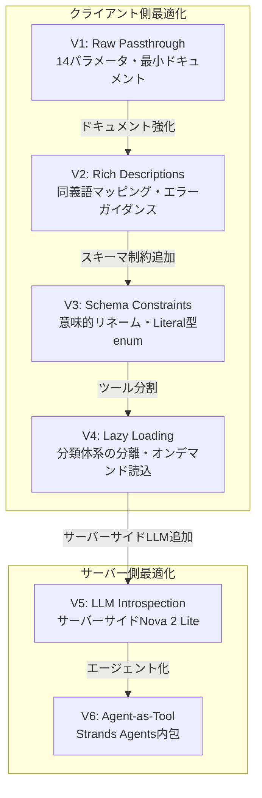

## ブログ概要

本記事は [MCP tool design: Practical approaches and tradeoffs](https://aws.amazon.com/blogs/machine-learning/mcp-tool-design-practical-approaches-and-tradeoffs/) の解説記事です。AWS Machine Learning BlogにてDaniel WellsとRaian Osmanが2026年7月9日に公開したこのブログでは、Model Context Protocol（MCP）のツール設計における実践的なアプローチとトレードオフを体系的に解説しています。K-12（幼稚園から高校まで）の教育コンテンツ検索APIを題材に、Raw Passthrough（生のパススルー）からAgent-as-Tool（エージェントとしてのツール）まで6段階のデザインパターンを段階的に提示し、MCPツール設計における2つの根本的問題であるBloat（肥大化）とConfusion（混乱）への対処法を論じています。

## 情報源

| 項目 | 内容 |
|------|------|
| タイトル | MCP tool design: Practical approaches and tradeoffs |
| 著者 | Daniel Wells, Raian Osman |
| 公開日 | 2026年7月9日 |
| URL | [AWS Machine Learning Blog](https://aws.amazon.com/blogs/machine-learning/mcp-tool-design-practical-approaches-and-tradeoffs/) |
| 組織 | AWS Machine Learning Blog |

## 技術的背景

### MCPとツール設計の本質的課題

Model Context Protocol（MCP）は、LLMアプリケーションが外部ツールやデータソースと標準化されたインターフェースで接続するためのオープンプロトコルである。MCPサーバーはツール定義（名前、説明、パラメータスキーマ）をクライアントに公開し、LLMはこの定義を参照してツールの呼び出しを判断する。

著者らは、MCPツール設計において2つの根本的問題を指摘している。

**Bloat（肥大化）**: ツール定義はツールが使用されるかどうかに関わらず、すべての呼び出しでLLMのコンテキストウィンドウに読み込まれる。複数のMCPサーバーを接続すると、ユーザーが質問する前にかなりのコンテキストが消費される。コンテキストが埋まるにつれて「LLMの推論能力が劣化する」と著者らは述べている。

**Confusion（混乱）**: 推論能力の劣化に伴い、LLMは誤ったツールを呼び出したり、不正なパラメータを選択したりする。リトライはさらにBloatを悪化させ、悪循環を生む。ツール間の意味的類似性、過剰なオプション、曖昧な命名がこの問題を助長する。

著者らは「MCP自体が問題ではない。問題はツール設計にある」と強調しており、既存のAPIをそのまま公開するのではなく、LLMやエージェントシステムの動作特性に合わせたツール設計が必要であると主張している。

### HaystackのMCPToolとの関連

Haystackフレームワークでは`MCPTool`クラスを通じてMCPサーバーのツールをAgent内で利用できる。本ブログで議論されているツール定義の肥大化や混乱の問題は、HaystackのAgent APIでMCPツールを統合する際にも直接的に影響する。特に複数のMCPサーバーを接続する場合、各サーバーのツール定義がAgentのコンテキストを圧迫し、ツール選択精度の低下を引き起こす可能性がある。

## 実装アーキテクチャ

### 6つのデザインアプローチの詳細

著者らはK-12教育コンテンツ検索APIを題材に、6つの段階的なデザインアプローチを提示している。このバックエンドAPIは14のフィルタリング可能なフィールド（subject、grade、format、standards alignment、language、resource_classなど）を持ち、各フィールドに制御された語彙が定義されている。

#### V1: Raw Passthrough（生のパススルー）

V1はバックエンドAPIを最小限のドキュメントで直接MCPツールとして公開するアプローチである。著者らはこれをアンチパターンとして位置づけている。

```python
# V1: Raw Passthrough - アンチパターン
from mcp.server.fastmcp import FastMCP

mcp = FastMCP("content-search-v1")

@mcp.tool()
def search_content(
    keyword: str | None = None,
    discipline: str | None = None,      # 内部的なDB名をそのまま使用
    media_type: str | None = None,
    content_bucket: str | None = None,   # LLMには意味不明
    grade_level: str | None = None,
    state_standard: str | None = None,
    language: str | None = None,
    # ... 14パラメータすべてを公開
) -> dict:
    """Search for K-12 educational content."""  # 1行のdocstringのみ
    return backend_api.search(**locals())
```

このアプローチの問題点は、`discipline`（教科）や`content_bucket`（リソース分類）といった内部的なデータベースカラム名がそのまま公開され、LLMが正しい値を推測できないことである。有効な値のガイダンスも自然言語マッピングも存在しない。

#### V2: Rich Descriptions（詳細なドキュメント付与）

V2はV1と同じスキーマ構造を維持しつつ、ドキュメントを大幅に強化するアプローチである。

```python
@mcp.tool()
def search_content(
    keyword: str | None = None,
    discipline: str | None = None,
    media_type: str | None = None,
    content_bucket: str | None = None,
    grade_level: str | None = None,
) -> dict:
    """Search for K-12 educational content.

    Parameters:
        discipline: Subject area. Valid values: 'Math', 'Science',
            'English Language Arts', 'Social Studies', 'Spanish'.
            Synonyms: 'reading'/'writing' → 'English Language Arts'
        media_type: Content format. Valid values: 'Video', 'Interactive',
            'Document', 'Image'.
        content_bucket: Resource classification.
            'Student Resource' - materials for student use
            'Assessment' - quizzes, tests ('quiz'/'test' → Assessment)
            'Activity' - worksheets, exercises ('worksheet' → Activity)
        keyword: Fuzzy text search across titles and descriptions.
            Use for topic searches. Distinct from strict filters above.

    Error Guidance:
        If no results found, suggest broadening search by removing
        filters or trying synonym mappings listed above.
    """
    return backend_api.search(**locals())
```

著者らによれば、V2はV1と比較して精度が向上するが、ツール定義のサイズが大幅に増加し、呼び出しごとのオーバーヘッドが生じるというトレードオフがある。ただし、リトライ回数の減少によりコンテキスト消費量はV1の4%からV2では3%に改善される場合があると報告されている。

#### V3: Schema Constraints（スキーマ制約）

V3はパラメータの意味的リネーム、Literal型によるenum制約、デフォルト値の設定を行うアプローチである。

```python
from typing import Literal

@mcp.tool()
def search_content(
    keyword: str | None = None,
    subject: Literal[                         # discipline → subject にリネーム
        "Math", "Science",
        "English Language Arts",
        "Social Studies", "Spanish"
    ] | None = None,
    format: Literal[                          # media_type → format
        "Video", "Interactive",
        "Document", "Image"
    ] | None = None,
    resource_class: Literal[                  # content_bucket → resource_class
        "Student Resource",
        "Assessment", "Activity"
    ] = "Student Resource",                   # デフォルト値を設定
    grade: str | None = None,
    language: Literal["en", "es"] = "en",     # デフォルト: 英語
) -> dict:
    """Search K-12 educational content.

    Returns include defaults_applied field showing which
    defaults were used, so the LLM can inform the user.
    """
    ...

@mcp.tool()
def get_resource_detail(resource_id: str) -> dict:
    """Get full details for a specific resource by ID.
    Use after search to drill down into a specific result."""
    ...
```

V3の設計上の要点は以下の通りである。

- **意味的リネーム**: `discipline` → `subject`、`content_bucket` → `resource_class`のように、LLMのドメイン理解に合致するパラメータ名に変更
- **Literal型enum**: 有効な値をスキーマレベルで制約し、不正な値の送信をプロトコルレベルで防止
- **デフォルト値**: `resource_class='Student Resource'`、`language='en'`など、最も一般的な値をデフォルトに設定
- **ツール分離**: 詳細取得を`get_resource_detail`として分離し、検索レスポンスを軽量化
- **defaults_applied**: レスポンスに適用されたデフォルト値を含め、LLMがユーザーに透明性を提供できるようにする

#### V4: Lazy Loading（遅延読み込み）

V4はツール定義を分割し、詳細なスキーマ情報を別のディスカバリーツールに移動するアプローチである。

```python
@mcp.tool()
def search_content(
    keyword: str | None = None,
    subject: str | None = None,       # 型制約なし - ヒントのみ
    format: str | None = None,
    resource_class: str = "Student Resource",
    grade: str | None = None,
) -> dict:
    """Search K-12 content.

    Common subjects: Math, Science, ELA.
    Common formats: Video, Interactive, Document.
    For full taxonomy and synonym mappings, call get_taxonomy first.
    """
    ...

@mcp.tool()
def get_taxonomy() -> dict:
    """Returns all valid filter values, synonym mappings,
    and parameter descriptions for search_content.

    Call this when:
    - User query is ambiguous
    - You need to discover valid values
    - Search returns unexpected results
    """
    return {
        "subjects": ["Math", "Science", "English Language Arts", ...],
        "synonyms": {"reading": "English Language Arts", "quiz": "Assessment", ...},
        "formats": ["Video", "Interactive", "Document", "Image"],
        ...
    }
```

著者らはV4を「全バージョンで最もリーンなベースライン」と評価している。Anthropicの研究を引用し、関連するツール定義のみを必要時に読み込むアプローチは「最大85%のトークン削減」をもたらすと述べている。コンテキスト使用量はV4で2%まで低下している。曖昧なクエリでは`get_taxonomy`の追加ラウンドトリップが発生するが、一般的な値は検索ツールのヒントでカバーされるため、頻出の検索では追加呼び出しなしで処理できる。

#### V5: LLM Introspection（サーバーサイドLLM解釈）

V5はサーバーサイドでAmazon Nova 2 Lite（Amazon Bedrock上）を使用し、自然言語クエリを構造化されたフィルタ値に変換するアプローチである。

```python
import boto3
import json

bedrock = boto3.client("bedrock-runtime")

@mcp.tool()
def introspect_query(question: str) -> dict:
    """Interpret a natural-language education content query.

    Takes a free-text question and returns recommended
    filter values with rationale for each choice.

    Example:
        Input: "TEKS-aligned content for dividing in middle school"
        Output: {
            "subject": "Math",
            "grades": ["6", "7", "8"],
            "state_standard": "TX-TEKS",
            "topic": "dividing,division",
            "rationale": "TEKS is a Texas standard; dividing maps
                         to Math; middle school = grades 6-8"
        }
    """
    response = bedrock.invoke_model(
        modelId="amazon.nova-lite-v2:0",
        body=json.dumps({
            "messages": [{
                "role": "user",
                "content": f"Interpret this query: {question}"
            }],
            "system": [{
                "text": TAXONOMY_PROMPT  # 全分類体系を含むプロンプト
            }]
        })
    )
    return json.loads(response["body"].read())
```

V5の利点として著者らは以下を挙げている。

- **クライアントモデル非依存**: サーバーサイドで解釈するため、クライアント側のLLMの能力に依存しない一貫した結果が得られる
- **信頼性の高いプロンプトエンジニアリング**: サーバーサイドのプロンプトを独立してテスト・改善できる
- **コンテキスト節約**: クライアント側のコンテキストを軽量に保てる

トレードオフとして、クエリごとに推論コストが発生し、インフラ要件がV1-V4より高くなる。

#### V6: Agent-as-Tool（エージェントとしてのツール）

V6は単一のMCPツールの背後に自律エージェント（Strands Agentsフレームワークを使用）を配置し、推論全体をカプセル化するアプローチである。

```python
from strands import Agent
from strands.models import BedrockModel

# 内部エージェントの定義（クライアントLLMからは不可視）
internal_agent = Agent(
    model=BedrockModel(model_id="amazon.nova-lite-v2:0"),
    tools=[search_content, get_taxonomy, get_resource_detail],
    system_prompt="""You are a K-12 content search assistant.
    Use get_taxonomy to understand valid filter values.
    Use search_content to find resources.
    Use get_resource_detail for specific items.
    Maintain conversation context for follow-up questions."""
)

# 外部に公開されるMCPツールは1つだけ
@mcp.tool()
def agentic_search_content(question: str) -> str:
    """Search for K-12 educational content using natural language.

    Handles complex queries, follow-up questions, and
    multi-step searches automatically.

    Args:
        question: Natural language question about educational content
    """
    response = internal_agent(question)
    return response.message
```

V6の特徴は以下の通りである。

- **最小限のクライアント負荷**: クライアントLLMは単一の文字列パラメータを持つツールを1つ認識するのみ
- **動作の一貫性**: クライアントLLMの種類に関わらず、内部エージェントが推論を制御するため結果が安定する
- **会話コンテキストの維持**: 内部エージェントが会話履歴を保持し、フォローアップの質問を自然に処理できる
- **直接的な制御**: ツール設計者がエージェントの推論ロジックを完全に制御できる

トレードオフとして、インフラコストとレイテンシが最も高く、運用の複雑さも最大となる。

### 各アプローチのトレードオフ比較

| バージョン | アプローチ | コンテキスト消費 | 精度 | インフラコスト | 運用複雑性 |
|-----------|-----------|----------------|------|-------------|-----------|
| V1 | Raw Passthrough | 4%（+リトライ） | 低 | 最低 | 最低 |
| V2 | Rich Descriptions | 3% | 中 | 最低 | 低 |
| V3 | Schema Constraints | 3%未満 | 高 | 最低 | 低 |
| V4 | Lazy Loading | 2% | 高 | 最低 | 中 |
| V5 | LLM Introspection | 低 | 高 | 中（Bedrock） | 中 |
| V6 | Agent-as-Tool | 最低 | 最高 | 高（Bedrock+Agent） | 高 |

### V1からV6への設計進化



### HaystackのMCPTool設計への適用

HaystackでMCPツールを統合する際、本ブログの知見は以下のように適用できる。

```python
from haystack_experimental.components.tools import MCPClientInfo
from haystack.components.agents import Agent
from haystack.tools import MCPTool

# V4アプローチ: Lazy Loadingを適用したMCPサーバーに接続
mcp_config = MCPClientInfo(
    server_command=["python", "mcp_server_v4.py"],
    server_args=["--lazy-loading"]
)

# MCPToolでツールを取得
search_tool = MCPTool(
    name="search_content",
    mcp_client_info=mcp_config
)
taxonomy_tool = MCPTool(
    name="get_taxonomy",
    mcp_client_info=mcp_config
)

# Agentに統合
agent = Agent(
    chat_model=chat_model,
    tools=[search_tool, taxonomy_tool],
    system_prompt="必要に応じてget_taxonomyで有効な値を確認してから検索してください。"
)
```

複数のMCPサーバーを接続する場合は、V4のLazy Loadingパターンを採用することで、Agentのコンテキストウィンドウへの負荷を最小化できる。V3のスキーマ制約は、Haystack側でツール定義を受け取る際にLLMが正しいパラメータを選択する確率を高める効果がある。

## パフォーマンス最適化

### コンテキスト消費量の比較

著者らが報告しているコンテキスト消費量のデータは、MCPツール設計の最適化がLLMの実効的な推論能力に直接影響することを示している。

V1のRaw Passthroughではベースラインで4%のコンテキストを消費するが、混乱によるリトライが加わると実質的な消費量はさらに増加する。V2のRich Descriptionsでは定義サイズが増大するにもかかわらず、リトライ減少により3%に改善される。V4のLazy Loadingでは2%まで低下し、著者らが引用するAnthropicの研究では最大85%のトークン削減が報告されている。

レスポンスサイズについても、V3以降ではデフォルトで必須フィールドのみ（約5フィールド）を返し、詳細が必要な場合は`get_resource_detail`で取得する設計により、レスポンスあたり約3分の2のトークン削減が実現できるとAnthropicの研究を引用して述べている。

AWS Prescriptive Guidanceの推奨として、パラメータ数は8個以下に抑えることが挙げられている。V1の14パラメータからV3で6パラメータに削減し、V6では1パラメータ（自然言語の質問文のみ）まで簡素化される。

## Production Deployment Guide

### AWS実装パターン

本ブログの6つのアプローチをAWS上で本番運用する際の構成パターンを、規模別に整理する。

#### 構成パターン比較表

| 項目 | Small（V1-V3） | Medium（V4） | Large（V5-V6） |
|------|----------------|-------------|----------------|
| コンピュート | Lambda | Lambda + Step Functions | ECS Fargate / EKS |
| MCPサーバー | Lambda関数内 | Lambda関数内 | コンテナ（常駐） |
| データストア | DynamoDB | DynamoDB | DynamoDB + ElastiCache |
| LLM推論 | なし（クライアント側） | なし | Amazon Bedrock |
| 月間リクエスト想定 | 〜10万 | 〜100万 | 100万〜 |
| 月額コスト概算（東京） | $15-50 | $80-200 | $500-3,000+ |

※コスト試算は2026年7月時点のAWS東京リージョン（ap-northeast-1）料金に基づく概算値。実際のコストはリクエストパターン、レスポンスサイズ、Bedrockモデルの利用量により変動する。

#### Small構成（V1-V3向け）: Lambda + DynamoDB

V1-V3はサーバーサイドのLLM推論を必要としないため、Lambda関数とDynamoDBのシンプルな構成で運用できる。

```hcl
# Terraform: Small構成 - Lambda + Bedrock + DynamoDB

terraform {
  required_version = ">= 1.5"
  required_providers {
    aws = {
      source  = "hashicorp/aws"
      version = "~> 5.0"
    }
  }
}

provider "aws" {
  region = "ap-northeast-1"
}

# DynamoDB: 教育コンテンツのメタデータストア
resource "aws_dynamodb_table" "content_metadata" {
  name         = "mcp-content-metadata"
  billing_mode = "PAY_PER_REQUEST"
  hash_key     = "resource_id"

  attribute {
    name = "resource_id"
    type = "S"
  }

  attribute {
    name = "subject"
    type = "S"
  }

  global_secondary_index {
    name            = "subject-index"
    hash_key        = "subject"
    projection_type = "ALL"
  }

  point_in_time_recovery {
    enabled = true
  }

  tags = {
    Environment = "production"
    Service     = "mcp-content-search"
  }
}

# Lambda: MCPサーバー (V3: Schema Constraints)
resource "aws_lambda_function" "mcp_server" {
  function_name = "mcp-content-search-v3"
  runtime       = "python3.12"
  handler       = "handler.lambda_handler"
  timeout       = 30
  memory_size   = 256

  filename         = data.archive_file.lambda_zip.output_path
  source_code_hash = data.archive_file.lambda_zip.output_base64sha256

  role = aws_iam_role.lambda_exec.arn

  environment {
    variables = {
      DYNAMODB_TABLE = aws_dynamodb_table.content_metadata.name
      LOG_LEVEL      = "INFO"
      MCP_VERSION    = "v3"
    }
  }

  tracing_config {
    mode = "Active"  # X-Ray トレーシング有効化
  }

  tags = {
    Environment = "production"
    Service     = "mcp-content-search"
  }
}

# Lambda実行ロール
resource "aws_iam_role" "lambda_exec" {
  name = "mcp-server-lambda-role"

  assume_role_policy = jsonencode({
    Version = "2012-10-17"
    Statement = [{
      Action = "sts:AssumeRole"
      Effect = "Allow"
      Principal = {
        Service = "lambda.amazonaws.com"
      }
    }]
  })
}

# DynamoDBアクセスポリシー
resource "aws_iam_role_policy" "dynamodb_access" {
  name = "dynamodb-access"
  role = aws_iam_role.lambda_exec.id

  policy = jsonencode({
    Version = "2012-10-17"
    Statement = [{
      Effect = "Allow"
      Action = [
        "dynamodb:GetItem",
        "dynamodb:Query",
        "dynamodb:Scan"
      ]
      Resource = [
        aws_dynamodb_table.content_metadata.arn,
        "${aws_dynamodb_table.content_metadata.arn}/index/*"
      ]
    }]
  })
}

# CloudWatch Logsポリシー
resource "aws_iam_role_policy_attachment" "lambda_logs" {
  role       = aws_iam_role.lambda_exec.name
  policy_arn = "arn:aws:iam::aws:policy/service-role/AWSLambdaBasicExecutionRole"
}

# Lambda Function URL（MCP over HTTP/SSE用）
resource "aws_lambda_function_url" "mcp_endpoint" {
  function_name      = aws_lambda_function.mcp_server.function_name
  authorization_type = "AWS_IAM"

  cors {
    allow_origins = ["*"]
    allow_methods = ["POST"]
    allow_headers = ["content-type"]
  }
}

# CloudWatch Alarm: エラー率監視
resource "aws_cloudwatch_metric_alarm" "lambda_errors" {
  alarm_name          = "mcp-server-error-rate"
  comparison_operator = "GreaterThanThreshold"
  evaluation_periods  = 2
  metric_name         = "Errors"
  namespace           = "AWS/Lambda"
  period              = 300
  statistic           = "Sum"
  threshold           = 10
  alarm_description   = "MCPサーバーのエラー率が閾値を超過"

  dimensions = {
    FunctionName = aws_lambda_function.mcp_server.function_name
  }

  alarm_actions = [aws_sns_topic.alerts.arn]
}

# SNSアラート通知
resource "aws_sns_topic" "alerts" {
  name = "mcp-server-alerts"
}

output "mcp_endpoint_url" {
  value = aws_lambda_function_url.mcp_endpoint.function_url
}
```

#### Large構成（V5-V6向け）: ECS/EKS + Bedrock

V5-V6はサーバーサイドでのLLM推論が必要なため、常駐型のコンテナ基盤が適している。特にV6のAgent-as-Toolでは会話コンテキストの維持が求められるため、ステートフルなサービスとしての運用が必要となる。

```hcl
# Terraform: Large構成 - EKS + Karpenter + Bedrock

# EKSクラスタ
module "eks" {
  source  = "terraform-aws-modules/eks/aws"
  version = "~> 20.0"

  cluster_name    = "mcp-platform"
  cluster_version = "1.31"

  vpc_id     = module.vpc.vpc_id
  subnet_ids = module.vpc.private_subnets

  cluster_endpoint_public_access = false

  eks_managed_node_groups = {
    # MCPサーバー用ノードグループ
    mcp_servers = {
      instance_types = ["m7i.large"]
      min_size       = 2
      max_size       = 10
      desired_size   = 3

      labels = {
        workload = "mcp-server"
      }
    }
  }

  # Karpenter用IRSA
  enable_karpenter = true

  tags = {
    Environment = "production"
    Service     = "mcp-platform"
  }
}

# Karpenter NodePool: オートスケーリング
resource "kubectl_manifest" "karpenter_nodepool" {
  yaml_body = yamlencode({
    apiVersion = "karpenter.sh/v1"
    kind       = "NodePool"
    metadata = {
      name = "mcp-server-pool"
    }
    spec = {
      template = {
        spec = {
          requirements = [
            {
              key      = "karpenter.sh/capacity-type"
              operator = "In"
              values   = ["on-demand", "spot"]
            },
            {
              key      = "node.kubernetes.io/instance-type"
              operator = "In"
              values   = ["m7i.large", "m7i.xlarge", "m6i.large"]
            }
          ]
          nodeClassRef = {
            group = "karpenter.k8s.aws"
            kind  = "EC2NodeClass"
            name  = "default"
          }
        }
      }
      limits = {
        cpu    = "100"
        memory = "200Gi"
      }
      disruption = {
        consolidationPolicy = "WhenEmptyOrUnderutilized"
        consolidateAfter    = "30s"
      }
    }
  })
}

# Bedrock アクセス用IAMポリシー（V5/V6で必要）
resource "aws_iam_policy" "bedrock_access" {
  name = "mcp-bedrock-invoke"

  policy = jsonencode({
    Version = "2012-10-17"
    Statement = [{
      Effect = "Allow"
      Action = [
        "bedrock:InvokeModel",
        "bedrock:InvokeModelWithResponseStream"
      ]
      Resource = [
        "arn:aws:bedrock:ap-northeast-1::foundation-model/amazon.nova-lite-v2:0"
      ]
    }]
  })
}

# ElastiCache: V6の会話コンテキスト保持用
resource "aws_elasticache_replication_group" "session_store" {
  replication_group_id = "mcp-session-store"
  description          = "MCP Agent-as-Tool session store"
  node_type            = "cache.r7g.large"
  num_cache_clusters   = 2
  engine               = "redis"
  engine_version       = "7.1"

  at_rest_encryption_enabled = true
  transit_encryption_enabled = true

  subnet_group_name = aws_elasticache_subnet_group.private.name

  tags = {
    Environment = "production"
    Service     = "mcp-platform"
  }
}
```

### 運用・監視設定

#### CloudWatch メトリクスとダッシュボード

MCPサーバーの運用では、以下のメトリクスを継続的に監視する必要がある。

```json
{
  "dashboard_widgets": [
    {
      "title": "MCP Tool Invocation Rate",
      "metrics": [
        ["MCP", "ToolInvocations", "ToolName", "search_content"],
        ["MCP", "ToolInvocations", "ToolName", "get_taxonomy"],
        ["MCP", "ToolInvocations", "ToolName", "introspect_query"]
      ]
    },
    {
      "title": "Context Token Usage",
      "metrics": [
        ["MCP", "ContextTokensConsumed", "Version", "v3"],
        ["MCP", "ContextTokensConsumed", "Version", "v4"],
        ["MCP", "ContextTokensConsumed", "Version", "v5"]
      ]
    },
    {
      "title": "Bedrock Inference Latency (V5/V6)",
      "metrics": [
        ["AWS/Bedrock", "InvocationLatency", "ModelId", "amazon.nova-lite-v2:0"]
      ]
    },
    {
      "title": "Error Rate by Tool",
      "metrics": [
        ["MCP", "ToolErrors", "ToolName", "search_content"],
        ["MCP", "ToolErrors", "ToolName", "introspect_query"]
      ]
    }
  ]
}
```

#### X-Ray トレーシング

MCPツールの呼び出しチェーンを可視化するため、X-Rayによる分散トレーシングを有効化する。特にV5-V6ではクライアントLLM → MCPサーバー → Bedrock推論の多段呼び出しが発生するため、各段階のレイテンシをトレースすることが重要となる。

#### Cost Explorer によるコスト監視

Bedrockの推論コストはリクエスト量に比例して増加するため、Cost Explorerのアラートを設定する。

```json
{
  "cost_anomaly_detection": {
    "monitor": {
      "name": "mcp-bedrock-cost-monitor",
      "type": "DIMENSIONAL",
      "dimension": "SERVICE",
      "value": "Amazon Bedrock"
    },
    "threshold": {
      "type": "PERCENTAGE",
      "value": 20
    },
    "notification": {
      "sns_topic_arn": "arn:aws:sns:ap-northeast-1:ACCOUNT:mcp-cost-alerts"
    }
  }
}
```

### コスト最適化チェックリスト

MCPサーバーの本番運用におけるコスト最適化のためのチェックリストを以下に示す。

**ツール設計レベル**

- [ ] パラメータ数が8個以下に収まっているか
- [ ] デフォルトレスポンスが必須フィールドのみ（5項目程度）を返しているか
- [ ] 不要なパラメータを削除したか
- [ ] Literal型enumでドキュメント量を削減しているか
- [ ] ツール説明文が簡潔かつ十分か（過剰でも不足でもない）

**コンテキスト最適化**

- [ ] V4のLazy Loadingパターンを検討したか
- [ ] ツール定義のトークン数を測定し、ベースラインを把握しているか
- [ ] 複数MCPサーバー接続時のコンテキスト合計を確認したか
- [ ] リトライ率を監視し、混乱によるコンテキスト浪費を検出しているか

**インフラコスト**

- [ ] Lambda関数のメモリサイズが適切か（過剰割当でないか）
- [ ] DynamoDBのキャパシティモードが適切か（PAY_PER_REQUESTまたはプロビジョンド）
- [ ] Karpenterのスポットインスタンス利用を検討したか
- [ ] ElastiCacheのノードタイプがワークロードに適しているか
- [ ] 使用していないリソース（未使用のENI、EBSボリュームなど）を削除したか

**Bedrock推論コスト（V5-V6）**

- [ ] Amazon Nova 2 Liteなど軽量モデルを選択しているか
- [ ] プロンプトキャッシングを活用しているか
- [ ] バッチ推論が適用可能なユースケースで利用しているか
- [ ] Provisioned Throughputの損益分岐点を計算したか
- [ ] 不要な推論呼び出しを削減するキャッシュ層を設けているか

**監視・アラート**

- [ ] Cost Explorerの異常検知を設定したか
- [ ] Bedrockの月次コスト予算アラートを設定したか
- [ ] Lambda/ECSのコンピュートコストを月次で確認しているか
- [ ] X-Rayのサンプリングレートが適切か（コスト vs 可視性のバランス）
- [ ] CloudWatch Logsの保持期間を適切に設定しているか

## 運用での学び

著者らのブログから読み取れる運用上の教訓は以下の通りである。

第一に、**ツール設計はイテレーティブなプロセスである**。V1からV6は段階的な改善を表しており、すべてのユースケースでV6が最適というわけではない。シンプルなAPIであればV3のスキーマ制約で十分な精度が得られ、複雑なドメイン知識を要するAPIではV5やV6のサーバーサイド推論が有効となる。

第二に、**コンテキストエンジニアリングの重要性**である。著者らは「コンテキストエンジニアリングとは、LLMが見るものとそのタイミングを制御し、より良い結果を生み出すこと」と定義している。ツール定義、レスポンス構造、エラーメッセージのすべてがLLMの推論品質に影響する。

第三に、**エラーメッセージの設計**が見過ごされがちだが重要であるという点である。V2以降で導入された「修正を導くエラーメッセージ」は、LLMが自律的にリトライを成功させるために不可欠な要素である。単に「not found」と返すのではなく、「フィルタを緩和するか、上記の同義語マッピングを試してください」と具体的な次のアクションを提示することで、リトライの成功率が向上する。

## 学術研究との関連

本ブログの内容は、MCP仕様（2024年11月にAnthropicが公開）の実装ベストプラクティスとして位置づけられる。MCPはJSON-RPCベースのプロトコルであり、ツール定義のスキーマはJSON Schemaで記述される。本ブログで議論されているBloatとConfusionの問題は、MCPに限らずOpenAI Function CallingやLangChainのToolなど、LLMにツール定義を提供するすべてのフレームワークに共通する課題である。

著者らが引用しているAnthropicの研究（ツール定義のオンデマンド読み込みによる最大85%のトークン削減）は、MCPのDynamic Tool Discoveryの方向性と一致している。V4のLazy Loadingパターンは、この研究知見をMCPサーバー設計に落とし込んだ実践的なアプローチといえる。

## まとめと実践への示唆

AWSチームが提示した6段階のMCPツール設計アプローチは、ツール設計の成熟度モデルとして捉えることができる。実践への示唆として、以下の3点が重要である。

1. **V3（Schema Constraints）を出発点とする**: パラメータの意味的リネームとLiteral型enumだけでも、LLMのツール選択精度は大幅に向上する。ほとんどのユースケースではV3で十分である。

2. **コンテキスト消費量を定量的に監視する**: ツール定義のトークン数、リトライ率、セッションあたりのコンテキスト使用率を計測し、BloatやConfusionの兆候を早期に検出する。

3. **複雑さのコストを認識する**: V5やV6はより高い精度を提供するが、インフラコスト、レイテンシ、運用複雑性も増大する。ドメインの複雑さとユーザーの要求に応じて、適切なバージョンを選択すべきである。

## 参考文献

1. Wells, D., & Osman, R. (2026). "MCP tool design: Practical approaches and tradeoffs." AWS Machine Learning Blog. [https://aws.amazon.com/blogs/machine-learning/mcp-tool-design-practical-approaches-and-tradeoffs/](https://aws.amazon.com/blogs/machine-learning/mcp-tool-design-practical-approaches-and-tradeoffs/)
2. Model Context Protocol Specification. [https://modelcontextprotocol.io/](https://modelcontextprotocol.io/)
3. AWS Prescriptive Guidance. "MCP tool design best practices."
4. Anthropic. "Research on dynamic tool discovery and token reduction."
5. Haystack MCP Integration. [https://docs.haystack.deepset.ai/](https://docs.haystack.deepset.ai/)
6. Strands Agents Framework. [https://github.com/strands-agents/sdk-python](https://github.com/strands-agents/sdk-python)
7. Amazon Nova 2 Model Family. [https://aws.amazon.com/bedrock/nova/](https://aws.amazon.com/bedrock/nova/)
