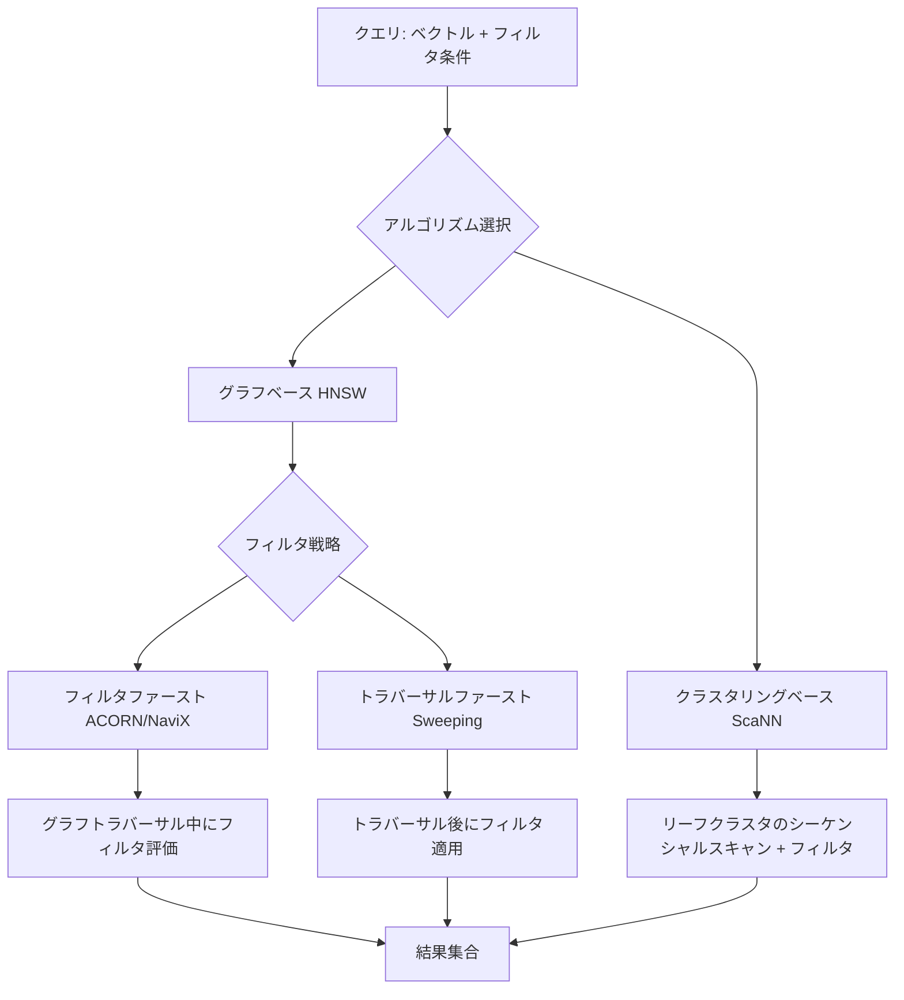

## 論文概要

本記事は [An In-Depth Study of Filter-Agnostic Vector Search on a PostgreSQL Database System](https://arxiv.org/abs/2603.23710) の解説記事です。

Duo Lu, Helena Caminal, Manos Chatzakis, Yannis Papakonstantinou, Yannis Chronis, Vaibhav Jain, Fatma Ozcanの7名による本論文は、PostgreSQLデータベースシステム上でのフィルタ付きベクトル検索（Filtered Vector Search; FVS）を体系的に実証分析したものである。著者らは、ベクトル検索ライブラリとデータベースシステムの間で性能が最大10倍異なることを明らかにし、その要因がページベースストレージ管理、バッファプール相互作用、メタデータ間接参照といったシステムレベルのオーバーヘッドにあることを示している。HNSW系（ACORN, NaviX, Sweeping）とクラスタリング系（ScaNN）の4種のアルゴリズムを4つのデータセットで比較し、最適なアルゴリズム選択がワークロード特性とシステムアーキテクチャの相互作用に依存することを報告している。

この記事は [Zenn記事: ベクトルDB選定を自社データで検証する：5軸ベンチマーク設計と再現可能な評価手法](https://zenn.dev/0h_n0/articles/2cd2c26ec816f5) の深掘りです。

## 情報源

- **会議名**: SIGMOD 2026（ACM International Conference on Management of Data）
- **年**: 2026
- **URL**: [https://arxiv.org/abs/2603.23710](https://arxiv.org/abs/2603.23710)
- **著者**: Duo Lu, Helena Caminal, Manos Chatzakis, Yannis Papakonstantinou, Yannis Chronis, Vaibhav Jain, Fatma Ozcan
- **ページ数**: 26ページ、13図

## カンファレンス情報

**SIGMOD**（ACM International Conference on Management of Data）は、データベースおよびデータ管理分野における最高峰の国際会議の1つである。ACM（計算機学会）が主催し、データベースシステム、クエリ処理、トランザクション管理、データ分析基盤などの研究が集まる。採択率は例年20%前後と競争率が高く、VLDB・ICDEと並んでデータベース分野のトップカンファレンスとして位置づけられている。本論文はSIGMOD 2026に採択されており、PostgreSQLという実用的なデータベースシステム上でのベクトル検索を対象とした実証研究として、産業界との接点が強い内容である。

## 背景と動機

### フィルタ付きベクトル検索の課題

ベクトル検索は、RAG（Retrieval-Augmented Generation）やレコメンデーションシステムの基盤技術として広く利用されている。実運用では、ベクトル類似度だけでなく「カテゴリ=A」「日付>=2026-01-01」などの属性フィルタを組み合わせた**フィルタ付きベクトル検索（FVS）**が求められる場面が多い。

従来のFVS研究は、FAISSやHnswlibなどのスタンドアロンライブラリ上で行われてきた。しかし、著者らは実運用でベクトル検索がPostgreSQLやその他のデータベースシステムに組み込まれて使われている点に注目している。ライブラリ実装はメモリ上のコンパクトなデータ構造に直接アクセスできるのに対し、データベースシステムではタプルベースストレージ、バッファプール管理、メタデータ間接参照といった構造的なオーバーヘッドが存在する。

### なぜPostgreSQLか

pgvectorの普及により、PostgreSQL上でのベクトル検索は実運用で広く採用されている。しかし、ライブラリレベルで設計されたアルゴリズムがデータベースシステムに移植された際にどの程度性能が変化するかについて、体系的な分析は行われてこなかった。著者らは「最適なアルゴリズムは距離計算コストだけで決まるものではなく、距離計算とフィルタ操作の双方のシステムレベルオーバーヘッドが重要な役割を果たす」と述べており、この問題提起が本論文の出発点である。

## 技術的詳細

### ライブラリ vs PostgreSQL のアーキテクチャ差

著者らが分析した両者の構造的差異は以下の通りである。

| 観点 | ライブラリ実装 | PostgreSQL実装 |
|------|-------------|---------------|
| インデックスストレージ | コンパクトなポインタベース表現 | タプルベースストレージ（8KBページ） |
| ノードアクセス | 直接メモリデリファレンス | 複数ページアクセスが必要 |
| フィルタ評価 | 属性への直接アクセス | ダブルルックアップ（インデックスページ → HeapTID → ヒープページ） |
| 並列性 | スレッドレベル並列化 | コネクション単位の実行に限定 |
| メモリ管理 | ユーザー空間で完結 | バッファプール経由のページ管理 |

PostgreSQLでは、HNSWインデックスのノードが8KBページに格納されるため、1つのノードにアクセスするために複数ページを読み出す必要がある。さらに、フィルタ条件を評価する際には、インデックスページからHeapTID（ヒープタプルID）を取得し、そのTIDを使ってヒープページにアクセスするという**ダブルルックアップパターン**が発生する。著者らはこの構造的差異が、ライブラリ実装と比較して最大10倍の性能差を生む要因であると報告している。

### フィルタ付きベクトル検索アルゴリズムの分類

著者らは、評価対象のアルゴリズムを大きく2つのカテゴリに分類している。

#### グラフベース手法（HNSW系）

**ACORN**: フィルタファースト戦略を採用する。HNSWグラフのトラバーサル時に、フィルタ条件を満たさないノードをスキップする。ただし、フィルタによってグラフの接続性が失われる問題に対処するため、各ノードの近傍を2ホップ先まで展開する。これにより、低selectivity（通過率が低い = 厳しいフィルタ）環境でもグラフの到達可能性を維持する。

**NaviX**: 適応的トラバーサル戦略を実装する。3つのヒューリスティック（Blind, Directed, OneHop-s）を使い分け、selectivityに応じて最適なトラバーサル方法を選択する。特にDirectedヒューリスティックは、フィルタを満たすノードへの方向性を考慮した探索を行う。

**Sweeping**: トラバーサルファースト戦略を採用する。まずHNSWグラフを通常通りトラバーサルし、得られた候補に対して事後的にフィルタを適用する。高selectivity（通過率が高い = 緩いフィルタ）では効率的だが、低selectivityではフィルタを通過する候補が見つかるまで多くのノードを探索する必要がある。

#### クラスタリングベース手法

**ScaNN**: 3レベルのツリー構造を持つ。ベクトル空間を階層的に分割し、クエリベクトルに近いリーフクラスタをシーケンシャルにスキャンする。フィルタ条件はリーフスキャン時に適用される。リーフ内のベクトルはメモリ上で連続配置されるため、シーケンシャルアクセスパターンによりキャッシュ効率が高い。

フィルタ付きベクトル検索の処理フローを以下に示す。



### フィルタ付き検索の数式的定義

著者らはFVS問題を以下のように形式化している。データセット $\mathcal{D} = \{(\mathbf{v}_i, \mathbf{a}_i)\}_{i=1}^{N}$ が与えられたとき、クエリ $(\mathbf{q}, F)$ に対して以下を求める。

$$
\text{FVS}(\mathbf{q}, F, k) = \arg\min_{S \subseteq \mathcal{D}_F, |S|=k} \sum_{\mathbf{v} \in S} d(\mathbf{q}, \mathbf{v})
$$

ここで、
- $\mathbf{v}_i \in \mathbb{R}^d$: $d$次元ベクトル
- $\mathbf{a}_i$: ベクトル $\mathbf{v}_i$ に紐づく属性メタデータ
- $\mathbf{q} \in \mathbb{R}^d$: クエリベクトル
- $F$: フィルタ述語（例: `category = 'tech' AND date >= '2026-01-01'`）
- $\mathcal{D}_F = \{\mathbf{v}_i \mid F(\mathbf{a}_i) = \text{true}\}$: フィルタ条件を満たす部分集合
- $d(\cdot, \cdot)$: 距離関数（L2距離または内積）
- $k$: 返却するベクトル数
- **selectivity** $\sigma = |\mathcal{D}_F| / |\mathcal{D}|$: フィルタ通過率（0に近いほど厳しいフィルタ）

### Translation Map最適化

著者らは、フィルタファースト手法のオーバーヘッドを削減するために**Translation Map**を提案している。これはインメモリハッシュマップで、インデックスノードIDからフィルタ属性への直接マッピングを保持する。従来のダブルルックアップ（インデックスページ → HeapTID → ヒープページ）を単一のハッシュマップ参照に置き換えることで、フィルタファースト手法のオーバーヘッドを60-75%削減できると報告されている。

```python
from typing import Any


class TranslationMap:
    """インデックスノードIDからフィルタ属性への直接マッピング

    PostgreSQLのダブルルックアップパターンを回避し、
    フィルタ評価のオーバーヘッドを削減する。

    Attributes:
        _map: ノードIDをキー、属性辞書を値とするハッシュマップ
    """

    def __init__(self) -> None:
        self._map: dict[int, dict[str, Any]] = {}

    def build_from_heap(
        self,
        heap_pages: list[tuple[int, dict[str, Any]]],
    ) -> None:
        """ヒープページからTranslation Mapを構築する

        Args:
            heap_pages: (node_id, attributes) のリスト
        """
        for node_id, attrs in heap_pages:
            self._map[node_id] = attrs

    def evaluate_filter(
        self,
        node_id: int,
        filter_predicate: dict[str, Any],
    ) -> bool:
        """Translation Mapを使ったフィルタ評価

        ヒープページへのアクセスなしにフィルタ条件を評価する。
        従来: インデックスページ → HeapTID → ヒープページ（2回I/O）
        最適化後: ハッシュマップ参照（O(1)、I/O不要）

        Args:
            node_id: インデックス内のノードID
            filter_predicate: フィルタ条件（例: {"category": "tech"}）

        Returns:
            フィルタ条件を満たす場合True
        """
        if node_id not in self._map:
            return False
        attrs = self._map[node_id]
        return all(
            attrs.get(key) == value
            for key, value in filter_predicate.items()
        )
```

## 実験結果

### データセットと実験設定

著者らは以下の4つのデータセットを使用している（論文Table 1より）。

| Dataset | Vectors | Dimensions | Metric | 特徴 |
|---------|---------|-----------|--------|------|
| sift10M | 10M | 128 | L2 | 低次元、画像特徴量 |
| openai5M | 5M | 1536 | IP | 高次元、テキスト埋め込み |
| cohere10M | 10M | 768 | L2 | 中次元、多言語埋め込み |
| text2image10M | 10M | 200 | L2 | 低次元、マルチモーダル |

selectivityは1%から100%まで変化させ、フィルタ条件とベクトル分布の相関パターン（正相関・無相関・負相関）も評価対象としている。

### 主要な結果

著者らが報告している主要な実験結果は以下の通りである。

**1. ScaNNの低次元での優位性**: sift10M（128次元）やtext2image10M（200次元）において、ScaNNはグラフベース手法を2-3倍上回るスループットを示している。一方、openai5M（1536次元）では差が縮小しており、次元数が距離計算コストとシーケンシャルスキャン効率に影響していることが示唆されている。

**2. selectivityによるアルゴリズム優位性の逆転**: フィルタファースト手法（NaviX, ACORN）は低selectivity（1-10%）で優位であるが、高selectivity（50%以上）ではトラバーサルファースト手法（Sweeping）やIterative Scanが改善する。これは、低selectivityではグラフの接続性維持が重要になり、高selectivityではフィルタのオーバーヘッドが相対的に小さくなるためと著者らは分析している。

**3. NaviX-Directed vs ACORN**: NaviX-Directedは5-30%のselectivity範囲でACORNを一貫して上回ると報告されている。NaviXの適応的トラバーサルが、ACORNの固定的な2ホップ展開よりも効率的にフィルタ済みグラフを探索できるためである。

**4. データ相関の影響**: フィルタ属性とベクトル分布に負の相関がある場合、ScaNNのスループットが6%増加する一方、グラフベース手法は44-89%低下すると報告されている。負の相関下ではフィルタを満たすノードがグラフ上で分散するため、グラフトラバーサルの局所性が失われることが要因である。

## 実装のポイント

### pgvectorでの実装上の注意点

本論文の知見を踏まえた、pgvector環境での実装における重要な考慮事項を以下に整理する。

**インデックス選択**: 低次元（200次元以下）のベクトルかつフィルタのselectivityが高い場合は、IVFFlat（ScaNN的なクラスタリングベース）が有効である。高次元（768次元以上）やselectivityが低い場合はHNSWが適している。

**Translation Mapの実現**: pgvector単体ではTranslation Mapに相当する機能は提供されていないが、PostgreSQLの`INCLUDE`インデックス機能やカバリングインデックスを活用することで、類似の効果を得られる可能性がある。

```sql
-- カバリングインデックスによるフィルタ属性のインクルード
-- HeapTID → ヒープページのルックアップを削減
CREATE INDEX idx_items_embedding_covering
ON items USING hnsw (embedding vector_cosine_ops)
INCLUDE (category, created_at);

-- パーティショニングによるselectivityの事前絞り込み
-- フィルタ条件に対応するパーティションのみスキャン
CREATE TABLE items_partitioned (
    id BIGINT,
    embedding vector(768),
    category TEXT,
    created_at TIMESTAMPTZ
) PARTITION BY LIST (category);

CREATE TABLE items_tech PARTITION OF items_partitioned
    FOR VALUES IN ('tech');
CREATE TABLE items_science PARTITION OF items_partitioned
    FOR VALUES IN ('science');
```

**shared_buffersの設定**: 論文が示すように、バッファプールの効率がベクトル検索性能に直結する。ベクトルインデックスがバッファプールに収まるよう、`shared_buffers`を十分に確保することが重要である。目安として、HNSWインデックスサイズの1.5倍以上を推奨する。

**並列性の制限**: PostgreSQLではベクトル検索がコネクション単位で実行されるため、ライブラリ実装のようなスレッドレベル並列化ができない。高スループットが必要な場合は、コネクションプーリング（PgBouncer等）やリードレプリカの活用が必要となる。

## Production Deployment Guide

本論文はpgvector本番環境の設計指針を含むため、AWS上での実装パターンを示す。

> **注記**: 以下のコスト試算は2026年7月時点のAWS ap-northeast-1（東京）リージョン料金に基づく概算値です。実際のコストはトラフィックパターン、リージョン、バースト使用量により変動します。最新料金は[AWS料金計算ツール](https://calculator.aws/)で確認を推奨します。

### AWS実装パターン（コスト最適化重視）

論文の知見を踏まえた、トラフィック量別の推奨構成を以下に示す。

| 構成 | トラフィック | 主要サービス | 月額概算 |
|------|------------|------------|---------|
| **Small** | ~100 req/日 | RDS PostgreSQL (db.t4g.medium) + pgvector | $80-150 |
| **Medium** | ~1,000 req/日 | RDS PostgreSQL (db.r7g.large) + PgBouncer on ECS | $400-900 |
| **Large** | 10,000+ req/日 | Aurora PostgreSQL (db.r7g.2xlarge) + リードレプリカ + EKS | $2,500-5,500 |

**Small構成の内訳**:
- RDS db.t4g.medium（2 vCPU, 4GB RAM）: 約$55/月
- gp3ストレージ 100GB: 約$10/月
- Lambda（クエリAPI）: 約$5-15/月
- CloudWatch: 約$10/月

**Medium構成の内訳**:
- RDS db.r7g.large（2 vCPU, 16GB RAM）: 約$230/月
- gp3ストレージ 500GB + IOPS追加: 約$60/月
- ECS Fargate（PgBouncer + APIサーバー）: 約$80-150/月
- ALB: 約$30/月

**Large構成の内訳**:
- Aurora PostgreSQL db.r7g.2xlarge（8 vCPU, 64GB RAM）: 約$800/月
- リードレプリカ x2: 約$1,200/月（論文の知見: コネクション単位並列性の制限を分散で解消）
- EKS + Karpenter（Spot優先）: 約$300-500/月
- Aurora I/O最適化: 約$200/月

**コスト削減テクニック**:
- Reserved Instances（1年コミット）で最大40%削減（RDS/Aurora）
- Aurora I/O最適化モードで高I/Oワークロードのコスト予測性を向上
- EKS WorkerにSpot Instancesを活用し最大90%削減
- `shared_buffers`最適化で不要なディスクI/Oを削減（論文の知見を直接活用）

### Terraformインフラコード

#### Small構成（Serverless + RDS pgvector）

```hcl
# small_pgvector/main.tf
# Small構成: Lambda + RDS PostgreSQL (pgvector)
# 対象: ~100 req/日

terraform {
  required_version = ">= 1.9"
  required_providers {
    aws = {
      source  = "hashicorp/aws"
      version = "~> 5.60"
    }
  }
}

provider "aws" {
  region = "ap-northeast-1"
}

# --- VPC基盤 ---
module "vpc" {
  source  = "terraform-aws-modules/vpc/aws"
  version = "~> 5.13"

  name = "pgvector-small-vpc"
  cidr = "10.0.0.0/16"

  azs              = ["ap-northeast-1a", "ap-northeast-1c"]
  private_subnets  = ["10.0.1.0/24", "10.0.2.0/24"]
  database_subnets = ["10.0.101.0/24", "10.0.102.0/24"]

  # コスト削減: NAT Gatewayを使わずVPCエンドポイントで対応
  enable_nat_gateway = false
}

# --- RDS PostgreSQL with pgvector ---
resource "aws_db_instance" "pgvector" {
  identifier     = "pgvector-small"
  engine         = "postgres"
  engine_version = "16.4"
  instance_class = "db.t4g.medium" # 2 vCPU, 4GB RAM

  allocated_storage     = 100
  storage_type          = "gp3"
  storage_encrypted     = true
  kms_key_id            = aws_kms_key.rds.arn

  db_name  = "vectordb"
  username = "pgadmin"
  manage_master_user_password = true # Secrets Manager自動管理

  db_subnet_group_name   = aws_db_subnet_group.pgvector.name
  vpc_security_group_ids = [aws_security_group.rds.id]

  # 論文の知見: shared_buffersはインデックスサイズの1.5倍以上
  parameter_group_name = aws_db_parameter_group.pgvector.name

  backup_retention_period = 7
  skip_final_snapshot     = false
  deletion_protection     = true

  tags = { Project = "pgvector-search", Env = "production" }
}

resource "aws_db_parameter_group" "pgvector" {
  family = "postgres16"
  name   = "pgvector-optimized"

  # 論文の知見に基づくパラメータチューニング
  parameter {
    name  = "shared_buffers"
    value = "{DBInstanceClassMemory*3/16}" # メモリの約19%
  }
  parameter {
    name  = "effective_cache_size"
    value = "{DBInstanceClassMemory*3/4}"
  }
  parameter {
    name  = "work_mem"
    value = "65536" # 64MB: ベクトル検索のソートに十分なメモリ
  }
  parameter {
    name  = "maintenance_work_mem"
    value = "524288" # 512MB: インデックス構築用
  }
}

# --- Lambda関数（クエリAPI） ---
resource "aws_lambda_function" "query_api" {
  function_name = "pgvector-query"
  runtime       = "python3.12"
  handler       = "handler.lambda_handler"
  timeout       = 30
  memory_size   = 512

  filename = "lambda_package.zip"

  vpc_config {
    subnet_ids         = module.vpc.private_subnets
    security_group_ids = [aws_security_group.lambda.id]
  }

  environment {
    variables = {
      DB_SECRET_ARN = aws_db_instance.pgvector.master_user_secret[0].secret_arn
      DB_HOST       = aws_db_instance.pgvector.address
      DB_NAME       = "vectordb"
    }
  }

  tags = { Project = "pgvector-search" }
}

# --- CloudWatch アラーム（コスト監視） ---
resource "aws_cloudwatch_metric_alarm" "rds_cpu" {
  alarm_name          = "pgvector-rds-high-cpu"
  comparison_operator = "GreaterThanThreshold"
  evaluation_periods  = 3
  metric_name         = "CPUUtilization"
  namespace           = "AWS/RDS"
  period              = 300
  statistic           = "Average"
  threshold           = 80
  alarm_actions       = [aws_sns_topic.alerts.arn]

  dimensions = {
    DBInstanceIdentifier = aws_db_instance.pgvector.identifier
  }
}

# --- KMS暗号化 ---
resource "aws_kms_key" "rds" {
  description             = "KMS key for RDS pgvector encryption"
  deletion_window_in_days = 7
  enable_key_rotation     = true
}
```

#### Large構成（EKS + Aurora PostgreSQL pgvector）

```hcl
# large_pgvector/main.tf
# Large構成: EKS + Aurora PostgreSQL (pgvector) + リードレプリカ
# 対象: 10,000+ req/日

# --- Aurora PostgreSQL クラスタ ---
resource "aws_rds_cluster" "pgvector" {
  cluster_identifier = "pgvector-large"
  engine             = "aurora-postgresql"
  engine_version     = "16.4"
  engine_mode        = "provisioned"

  database_name   = "vectordb"
  master_username = "pgadmin"
  manage_master_user_password = true

  db_subnet_group_name   = aws_db_subnet_group.aurora.name
  vpc_security_group_ids = [aws_security_group.aurora.id]

  storage_encrypted = true
  kms_key_id        = aws_kms_key.aurora.arn

  # I/O最適化モード: 高I/Oワークロード向け
  storage_type = "aurora-iopt1"

  backup_retention_period = 14
  deletion_protection     = true

  tags = { Project = "pgvector-search", Env = "production" }
}

# Writer + Reader x2（論文の知見: コネクション単位並列性を分散で解消）
resource "aws_rds_cluster_instance" "writer" {
  identifier         = "pgvector-writer"
  cluster_identifier = aws_rds_cluster.pgvector.id
  instance_class     = "db.r7g.2xlarge" # 8 vCPU, 64GB RAM
  engine             = "aurora-postgresql"

  # shared_buffers: 64GB * 0.25 = 16GB（インデックスキャッシュに十分）
  db_parameter_group_name = aws_db_parameter_group.aurora_pgvector.name
}

resource "aws_rds_cluster_instance" "readers" {
  count              = 2
  identifier         = "pgvector-reader-${count.index}"
  cluster_identifier = aws_rds_cluster.pgvector.id
  instance_class     = "db.r7g.2xlarge"
  engine             = "aurora-postgresql"

  db_parameter_group_name = aws_db_parameter_group.aurora_pgvector.name
}

# --- EKS クラスタ ---
module "eks" {
  source  = "terraform-aws-modules/eks/aws"
  version = "~> 20.24"

  cluster_name    = "pgvector-api"
  cluster_version = "1.31"

  vpc_id     = module.vpc.vpc_id
  subnet_ids = module.vpc.private_subnets

  # Karpenter用のIRSA設定
  enable_cluster_creator_admin_permissions = true
}

# --- Karpenter Provisioner（Spot優先） ---
resource "kubectl_manifest" "karpenter_nodepool" {
  yaml_body = yamlencode({
    apiVersion = "karpenter.sh/v1"
    kind       = "NodePool"
    metadata   = { name = "default" }
    spec = {
      template = {
        spec = {
          requirements = [
            { key = "karpenter.sh/capacity-type", operator = "In", values = ["spot", "on-demand"] },
            { key = "node.kubernetes.io/instance-type", operator = "In",
              values = ["m7g.xlarge", "m7g.2xlarge", "c7g.xlarge", "c7g.2xlarge"] },
          ]
          nodeClassRef = { group = "karpenter.k8s.aws", kind = "EC2NodeClass", name = "default" }
        }
      }
      limits   = { cpu = "64", memory = "256Gi" }
      disruption = {
        consolidationPolicy = "WhenEmptyOrUnderutilized"
        consolidateAfter    = "30s"
      }
    }
  })
}

# --- AWS Budgets（予算アラート） ---
resource "aws_budgets_budget" "pgvector" {
  name         = "pgvector-monthly-budget"
  budget_type  = "COST"
  limit_amount = "6000"
  limit_unit   = "USD"
  time_unit    = "MONTHLY"

  notification {
    comparison_operator       = "GREATER_THAN"
    threshold                 = 80
    threshold_type            = "PERCENTAGE"
    notification_type         = "FORECASTED"
    subscriber_email_addresses = ["ops-team@example.com"]
  }
}
```

### 運用・監視設定

#### CloudWatch Logs Insights クエリ

```
# ベクトル検索レイテンシ分析（P95, P99）
fields @timestamp, @message
| filter @message like /vector_search/
| stats
    avg(duration_ms) as avg_latency,
    pct(duration_ms, 95) as p95_latency,
    pct(duration_ms, 99) as p99_latency,
    count(*) as query_count
  by bin(1h)
| sort @timestamp desc

# selectivity別のクエリ性能分析
fields @timestamp, selectivity, duration_ms, algorithm
| filter @message like /fvs_query/
| stats avg(duration_ms) as avg_ms by algorithm, bin(selectivity, 10)
| sort selectivity asc
```

#### CloudWatch アラーム設定

```python
import boto3


def create_pgvector_alarms(
    rds_instance_id: str,
    sns_topic_arn: str,
) -> list[str]:
    """pgvector向けCloudWatchアラームを作成する

    論文の知見に基づき、バッファプールヒット率と
    ディスクI/Oを重点的に監視する。

    Args:
        rds_instance_id: RDSインスタンスID
        sns_topic_arn: 通知先SNSトピックARN

    Returns:
        作成されたアラームARNのリスト
    """
    cw = boto3.client("cloudwatch", region_name="ap-northeast-1")
    alarm_arns: list[str] = []

    # バッファキャッシュヒット率の低下検知
    # 論文の知見: バッファプール効率がベクトル検索性能に直結
    cw.put_metric_alarm(
        AlarmName=f"{rds_instance_id}-low-buffer-hit",
        MetricName="BufferCacheHitRatio",
        Namespace="AWS/RDS",
        Statistic="Average",
        Period=300,
        EvaluationPeriods=3,
        Threshold=95.0,
        ComparisonOperator="LessThanThreshold",
        AlarmActions=[sns_topic_arn],
        Dimensions=[
            {"Name": "DBInstanceIdentifier", "Value": rds_instance_id},
        ],
    )

    # ディスクI/O異常検知（ページアクセス増加の兆候）
    cw.put_metric_alarm(
        AlarmName=f"{rds_instance_id}-high-read-iops",
        MetricName="ReadIOPS",
        Namespace="AWS/RDS",
        Statistic="Average",
        Period=300,
        EvaluationPeriods=3,
        Threshold=5000.0,
        ComparisonOperator="GreaterThanThreshold",
        AlarmActions=[sns_topic_arn],
        Dimensions=[
            {"Name": "DBInstanceIdentifier", "Value": rds_instance_id},
        ],
    )

    return alarm_arns
```

#### X-Ray トレーシング設定

```python
from aws_xray_sdk.core import xray_recorder, patch_all


# boto3 + psycopg2 の自動計装
patch_all()


@xray_recorder.capture("vector_search")
def execute_fvs_query(
    query_vector: list[float],
    filter_predicate: dict[str, str],
    k: int = 10,
) -> list[dict]:
    """フィルタ付きベクトル検索を実行しトレースする

    Args:
        query_vector: クエリベクトル
        filter_predicate: フィルタ条件
        k: 返却件数

    Returns:
        検索結果のリスト
    """
    subsegment = xray_recorder.current_subsegment()
    if subsegment:
        subsegment.put_annotation("algorithm", "hnsw")
        subsegment.put_annotation("dimensions", len(query_vector))
        subsegment.put_metadata(
            "filter", filter_predicate, "pgvector"
        )

    # pgvector検索の実行
    results = _run_pgvector_query(query_vector, filter_predicate, k)

    if subsegment:
        subsegment.put_annotation("result_count", len(results))

    return results
```

#### Cost Explorer 自動レポート

```python
import boto3
from datetime import datetime, timedelta


def get_daily_pgvector_cost(
    sns_topic_arn: str,
    threshold_usd: float = 100.0,
) -> dict[str, float]:
    """pgvector関連の日次コストレポートを取得する

    $100/日超過でSNS通知を送信する。

    Args:
        sns_topic_arn: 通知先SNSトピックARN
        threshold_usd: 通知閾値（USD/日）

    Returns:
        サービス別コスト辞書
    """
    ce = boto3.client("ce", region_name="us-east-1")
    sns = boto3.client("sns", region_name="ap-northeast-1")

    today = datetime.utcnow().strftime("%Y-%m-%d")
    yesterday = (datetime.utcnow() - timedelta(days=1)).strftime("%Y-%m-%d")

    response = ce.get_cost_and_usage(
        TimePeriod={"Start": yesterday, "End": today},
        Granularity="DAILY",
        Metrics=["UnblendedCost"],
        Filter={
            "Tags": {
                "Key": "Project",
                "Values": ["pgvector-search"],
            }
        },
        GroupBy=[{"Type": "DIMENSION", "Key": "SERVICE"}],
    )

    costs: dict[str, float] = {}
    total = 0.0
    for group in response["ResultsByTime"][0]["Groups"]:
        service = group["Keys"][0]
        amount = float(group["Metrics"]["UnblendedCost"]["Amount"])
        costs[service] = amount
        total += amount

    if total > threshold_usd:
        sns.publish(
            TopicArn=sns_topic_arn,
            Subject=f"pgvector Cost Alert: ${total:.2f}/day",
            Message=(
                f"Daily cost exceeded threshold.\n"
                f"Total: ${total:.2f}\n"
                f"Threshold: ${threshold_usd:.2f}\n"
                f"Breakdown: {costs}"
            ),
        )

    return costs
```

### コスト最適化チェックリスト

#### アーキテクチャ選択

- [ ] トラフィック量に応じた構成選択（Small: ~100 req/日 → RDS + Lambda / Medium: ~1,000 req/日 → RDS + ECS / Large: 10,000+ req/日 → Aurora + EKS）
- [ ] リードレプリカ数は論文の知見（コネクション単位並列性の制限）に基づいて決定
- [ ] パーティショニング戦略はselectivity分布に基づいて設計

#### リソース最適化

- [ ] EC2/EKS Worker: Spot Instances優先（Karpenter `spot` > `on-demand`）
- [ ] RDS/Aurora: Reserved Instances 1年コミットで最大40%削減
- [ ] Savings Plans: Compute Savings Plans検討（ECS/Lambda/EKS横断）
- [ ] Lambda: メモリサイズを512MB-1024MBで最適化（ベクトル処理に十分なメモリ）
- [ ] EKS: Karpenter `consolidationPolicy: WhenEmptyOrUnderutilized`で自動スケールダウン
- [ ] Aurora: I/O最適化モード（`aurora-iopt1`）で高I/Oワークロードのコスト予測性向上

#### pgvector固有の最適化（論文の知見）

- [ ] `shared_buffers`: HNSWインデックスサイズの1.5倍以上に設定
- [ ] `effective_cache_size`: 利用可能メモリの75%に設定
- [ ] `work_mem`: ベクトル検索のソートに64MB以上確保
- [ ] カバリングインデックス（`INCLUDE`）でフィルタ属性をインデックスに含める
- [ ] パーティショニングで高頻度フィルタ条件の事前絞り込みを実現
- [ ] `hnsw.ef_search`をrecall要件に応じて調整（デフォルト40、高recall時は100-200）

#### 監視・アラート

- [ ] AWS Budgets: 月額予算アラート設定（80%/100%閾値）
- [ ] CloudWatch: バッファキャッシュヒット率95%以下でアラート
- [ ] CloudWatch: ReadIOPS異常検知（ページアクセス増加の兆候）
- [ ] Cost Anomaly Detection: 日次コスト異常検知有効化
- [ ] 日次コストレポート: Cost Explorer APIで自動取得、$100/日超過で通知

#### リソース管理

- [ ] 未使用リードレプリカの削除（トラフィック減少時）
- [ ] タグ戦略: `Project`, `Env`, `Team`タグを全リソースに付与
- [ ] RDSスナップショット: ライフサイクルポリシーで90日超過分を自動削除
- [ ] 開発環境: 夜間・休日にRDSインスタンスを停止（最大7日間）
- [ ] EKSノード: 夜間のmin replicasを削減

## 実運用への応用

### Zenn記事との関連

関連するZenn記事「ベクトルDB選定を自社データで検証する」では、5軸ベンチマーク設計と再現可能な評価手法について論じている。本論文はその中でも特にpgvectorの性能特性を深く理解するための知見を提供するものである。

Zenn記事で提案されている5軸評価（レイテンシ、スループット、リコール、スケーラビリティ、コスト）のうち、本論文はレイテンシとスループットにおいて、フィルタ条件・データ次元・selectivityという3つの追加軸が評価に必要であることを示唆している。

### プロダクション環境での選択指針

著者らの結論を踏まえると、pgvectorを採用する際の選択指針は以下のようになる。

**低次元ベクトル（128-200次元）+ 高selectivity**: IVFFlat（ScaNN的アプローチ）が有利。画像特徴量やハッシュベースの埋め込みに該当する。

**高次元ベクトル（768-1536次元）+ 低selectivity**: HNSW + パーティショニングの組み合わせが適切。テキスト埋め込み（OpenAI, Cohere等）で厳密なフィルタを適用するケースに該当する。

**データ相関が存在する場合**: フィルタ属性とベクトル分布の相関を事前に分析し、負の相関が強い場合はグラフベース手法を避けるか、パーティショニングで局所性を回復する設計が必要である。

## 関連研究

**ACORN (VLDB 2025)**: Chai, Kipf, Linらによる、HNSWグラフの2ホップ近傍展開によるフィルタ対応手法。本論文ではACORNをベースラインの1つとして採用し、NaviX-Directedが5-30%のselectivity範囲で上回ることを示している。

**ScaNN (ICML 2020)**: Guo, Sun, Hu, Rubanらによる、学習ベースの量子化とクラスタリングを組み合わせたベクトル検索手法。本論文ではScaNNの3レベルツリー構造をPostgreSQLに移植し、低次元でのシーケンシャルスキャン効率の優位性を確認している。

**pgvector (OSS)**: PostgreSQL向けのベクトル検索拡張。HNSW（v0.5.0以降）とIVFFlat（v0.1.0以降）をサポートし、本論文のベンチマーク基盤として使用されている。

## まとめと今後の展望

本論文の中心的な知見は、「フィルタ付きベクトル検索の最適なアルゴリズム選択は、ワークロード特性と実世界データベースアーキテクチャにおけるデータアクセスの基礎コストとの相互作用に依存するシステム認識的な判断である」というものである。ライブラリベンチマークの結果がそのままデータベースシステムに適用できないことを実証的に示した点は、pgvectorを本番環境で運用するエンジニアにとって重要な示唆を与えている。

今後の方向性として、著者らはTranslation Mapのような最適化をPostgreSQLの拡張機能として標準化すること、およびワークロード特性に基づいてアルゴリズムを自動選択するアダプティブなクエリプランナーの開発を挙げている。pgvectorコミュニティにおけるフィルタ付き検索の性能改善は、RAGシステムの本番運用品質を左右する重要なテーマとして今後も注目される。

## 参考文献

- **論文**: [An In-Depth Study of Filter-Agnostic Vector Search on a PostgreSQL Database System](https://arxiv.org/abs/2603.23710)
- **カンファレンス**: [SIGMOD 2026](https://sigmod2026.org/)
- **pgvector**: [pgvector - Open-source vector similarity search for Postgres](https://github.com/pgvector/pgvector)
- **関連Zenn記事**: [ベクトルDB選定を自社データで検証する：5軸ベンチマーク設計と再現可能な評価手法](https://zenn.dev/0h_n0/articles/2cd2c26ec816f5)
