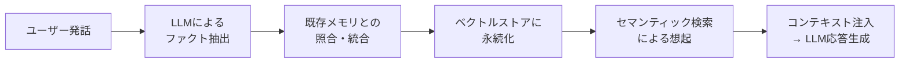

本記事は [arXiv:2504.19413](https://arxiv.org/abs/2504.19413) の解説記事です。

## 論文概要（Abstract）

LLMの固定コンテキストウィンドウは、マルチセッションにまたがる長期的な会話の一貫性維持を困難にしている。著者らは**Mem0**を提案し、会話から重要な情報を動的に抽出（extraction）・統合（consolidation）・検索（retrieval）するメモリ中心アーキテクチャにより、この問題に取り組んでいる。LoCoMoベンチマークにおいて、既存メモリシステム・RAG・フルコンテキスト・プロプライエタリソリューションを含む6カテゴリのベースラインと比較評価を行い、LLM-as-a-JudgeスコアリングでOpenAI Memory比26%の改善を達成したと報告している。

この記事は [Zenn記事: Mem0×pgvectorでセッション横断の長期記憶を持つCSエージェントを構築する](https://zenn.dev/0h_n0/articles/763bb6a7397e5c) の深掘りです。

## 情報源

- **arXiv ID**: 2504.19413
- **URL**: [https://arxiv.org/abs/2504.19413](https://arxiv.org/abs/2504.19413)
- **著者**: Prateek Chhikara, Dev Khant, Saket Aryan, Taranjeet Singh, Deshraj Yadav
- **発表年**: 2025（ECAI 2025採択）
- **分野**: cs.CL, cs.AI

## 背景と動機（Background & Motivation）

LLMベースの対話エージェントが実用化される中で、セッションをまたいだ文脈の維持は未解決の課題である。フルコンテキスト方式は過去の全会話履歴をプロンプトに含めるため、クエリあたり約26,000トークンを消費し、コストとレイテンシの両面で実用的でない。RAGベースのアプローチは関連文書の検索精度に依存し、会話の時間的な文脈を捉えにくい。

著者らは、人間の記憶システム（エピソード記憶・意味記憶・手続き記憶）に着想を得て、会話からキーファクトを構造的に抽出・管理するメモリレイヤーの必要性を主張している。既存のプロプライエタリソリューション（OpenAI Memoryなど）は、メモリの更新タイミングや粒度の制御が限定的であり、エンタープライズ環境での柔軟なカスタマイズが困難であるという問題がある。

## 主要な貢献（Key Contributions）

- **貢献1**: 会話から重要情報を動的に抽出し、ADD / UPDATE / DELETE / NOOPの4操作で永続メモリを管理するベースMem0アーキテクチャの提案
- **貢献2**: グラフデータベース（Neo4j）を活用し、エンティティ間の関係構造を捉える**グラフ拡張バリアント**の導入
- **貢献3**: LoCoMoベンチマーク上で、文献ベースライン・OSSツール・RAG・フルコンテキスト・OpenAI Memory・Zepの6カテゴリと包括的に比較した定量評価

## 技術的詳細（Technical Details）

### メモリパイプラインの3段階アーキテクチャ

Mem0のコアは**抽出（Extraction）→ 統合（Consolidation）→ 検索（Retrieval）**の3段階パイプラインである。



#### 1. 抽出フェーズ

会話のターンごとに、LLMがキーファクトを構造化された形で抽出する。著者らの手法では、単一パスで階層的に情報を抽出する**Single-Pass Hierarchical Extraction**を採用している。

$$
\mathcal{F}_t = \text{LLM}_{\text{extract}}(u_t, h_t)
$$

ここで、
- $\mathcal{F}_t$: 時刻$t$で抽出されたファクト集合
- $u_t$: 時刻$t$のユーザー発話
- $h_t$: 直近の会話履歴

#### 2. 統合フェーズ

抽出されたファクトを既存メモリと照合し、4つの操作のいずれかを実行する。

$$
\text{op}(f_i) = \text{LLM}_{\text{decide}}(f_i, \mathcal{M}_{\text{existing}}) \in \{\text{ADD}, \text{UPDATE}, \text{DELETE}, \text{NOOP}\}
$$

ここで、
- $f_i$: 個々の抽出ファクト
- $\mathcal{M}_{\text{existing}}$: 既存メモリストア
- $\text{op}$: 実行する操作

この統合ロジックにより、矛盾する情報の上書き（UPDATE）や、無効化された情報の削除（DELETE）が自動的に行われる。

#### 3. 検索フェーズ

クエリに対してベクトル類似度検索を実行し、関連するメモリを取得する。v2.0では**マルチシグナル検索**が導入され、ベクトル類似度に加えて時間的な近さやアクセス頻度も考慮される。

$$
\text{score}(m_i, q) = \alpha \cdot \text{sim}(\mathbf{e}_{m_i}, \mathbf{e}_q) + \beta \cdot \text{recency}(m_i) + \gamma \cdot \text{frequency}(m_i)
$$

ここで、
- $\mathbf{e}_{m_i}$: メモリ$m_i$のエンベディングベクトル
- $\mathbf{e}_q$: クエリ$q$のエンベディングベクトル
- $\text{sim}$: コサイン類似度
- $\alpha, \beta, \gamma$: 重み係数

### グラフ拡張バリアント

ベースアーキテクチャに加えて、Neo4jグラフデータベースを統合したバリアントが提案されている。エンティティをノード、関係をエッジとして表現することで、マルチホップ推論が必要なクエリへの対応力が向上する。

```python
from neo4j import GraphDatabase

def store_graph_memory(
    driver: GraphDatabase.driver,
    subject: str,
    predicate: str,
    obj: str,
    timestamp: str,
) -> None:
    """エンティティ関係をグラフDBに保存する"""
    with driver.session() as session:
        session.run(
            """
            MERGE (s:Entity {name: $subject})
            MERGE (o:Entity {name: $obj})
            MERGE (s)-[r:RELATION {type: $predicate}]->(o)
            SET r.updated_at = $timestamp
            """,
            subject=subject,
            predicate=predicate,
            obj=obj,
            timestamp=timestamp,
        )
```

著者らの報告によると、グラフ拡張バリアントはベースMem0に対して全体スコアで約2%の改善を示しており、特にマルチホップ質問（複数の記憶を組み合わせて回答する必要がある質問）で顕著な効果がある。

### 3種類のメモリタイプ

Mem0は認知科学に着想を得た3種類のメモリを実装している。

| メモリタイプ | 認知科学の対応概念 | 保持期間 | 例 |
|------------|-----------------|---------|---|
| **エピソード記憶** | Episodic Memory | 時間軸付き | 「2026/7/15に返品申請を受付」 |
| **意味記憶** | Semantic Memory | 時間非依存 | 「契約プランはエンタープライズ」 |
| **手続き記憶** | Procedural Memory | 行動パターン | 「メール連絡を優先する顧客」 |

## 実装のポイント（Implementation）

### スコープ設計

Mem0の実装で重要なのは、`user_id` / `agent_id` / `run_id` / `app_id`の4層スコープの使い分けである。

```python
import os
from mem0 import Memory

config = {
    "vector_store": {
        "provider": "pgvector",
        "config": {
            "dbname": "mem0_memories",
            "user": "mem0user",
            "password": os.environ["POSTGRES_PASSWORD"],
            "host": "127.0.0.1",
            "port": "5432",
            "embedding_model_dims": 1536,
        },
    },
}

memory = Memory.from_config(config)

# メモリの追加（user_idでスコープ）
result = memory.add(
    messages=[
        {"role": "user", "content": "エンタープライズプランを契約しています"},
    ],
    user_id="customer@example.com",
    agent_id="chat-agent",
)

# メモリの検索（user_idのみでフィルタ → 全チャネル横断）
memories = memory.search(
    query="契約プランは何ですか",
    filters={"user_id": "customer@example.com"},
    top_k=5,
)
```

### エンベディング次元数の整合性

pgvectorバックエンド使用時の頻出エラーとして、`embedding_model_dims`と実際のモデル出力次元数の不一致がある。OpenAIの`text-embedding-3-small`は1536次元、`nomic-embed-text`は768次元であり、モデル変更時にはコレクションの再作成が必要になる。

## Production Deployment Guide

### AWS実装パターン（コスト最適化重視）

**トラフィック量別の推奨構成**:

| 規模 | 月間リクエスト | 推奨構成 | 月額コスト | 主要サービス |
|------|--------------|---------|-----------|------------|
| **Small** | ~3,000 (100/日) | Serverless | $50-150 | Lambda + Bedrock + DynamoDB |
| **Medium** | ~30,000 (1,000/日) | Hybrid | $300-800 | Lambda + ECS Fargate + ElastiCache |
| **Large** | 300,000+ (10,000/日) | Container | $2,000-5,000 | EKS + Karpenter + EC2 Spot |

**Small構成の詳細** (月額$50-150):
- **Lambda**: 1GB RAM, 60秒タイムアウト ($20/月)
- **Bedrock**: Claude 3.5 Haiku, Prompt Caching有効 ($80/月)
- **DynamoDB**: On-Demand ($10/月)
- **RDS PostgreSQL (pgvector)**: db.t4g.micro ($15/月)
- **CloudWatch**: 基本監視 ($5/月)

**コスト試算の注意事項**: 上記は2026年7月時点のAWS ap-northeast-1（東京）リージョン料金に基づく概算値です。最新料金は [AWS料金計算ツール](https://calculator.aws/) で確認してください。

### Terraformインフラコード

**Small構成 (Serverless): Lambda + RDS pgvector**

```hcl
module "vpc" {
  source  = "terraform-aws-modules/vpc/aws"
  version = "~> 5.0"

  name = "mem0-vpc"
  cidr = "10.0.0.0/16"
  azs  = ["ap-northeast-1a", "ap-northeast-1c"]
  private_subnets = ["10.0.1.0/24", "10.0.2.0/24"]

  enable_nat_gateway   = false
  enable_dns_hostnames = true
}

resource "aws_iam_role" "lambda_mem0" {
  name = "lambda-mem0-role"

  assume_role_policy = jsonencode({
    Version = "2012-10-17"
    Statement = [{
      Action    = "sts:AssumeRole"
      Effect    = "Allow"
      Principal = { Service = "lambda.amazonaws.com" }
    }]
  })
}

resource "aws_iam_role_policy" "bedrock_invoke" {
  role = aws_iam_role.lambda_mem0.id

  policy = jsonencode({
    Version = "2012-10-17"
    Statement = [{
      Effect   = "Allow"
      Action   = ["bedrock:InvokeModel", "bedrock:InvokeModelWithResponseStream"]
      Resource = "arn:aws:bedrock:ap-northeast-1::foundation-model/anthropic.claude-3-5-haiku*"
    }]
  })
}

resource "aws_lambda_function" "mem0_handler" {
  filename      = "lambda.zip"
  function_name = "mem0-memory-handler"
  role          = aws_iam_role.lambda_mem0.arn
  handler       = "index.handler"
  runtime       = "python3.12"
  timeout       = 60
  memory_size   = 1024

  environment {
    variables = {
      PGVECTOR_HOST    = aws_db_instance.pgvector.address
      PGVECTOR_DB      = "mem0_memories"
      BEDROCK_MODEL_ID = "anthropic.claude-3-5-haiku-20241022-v1:0"
    }
  }
}

resource "aws_db_instance" "pgvector" {
  identifier     = "mem0-pgvector"
  engine         = "postgres"
  engine_version = "16.4"
  instance_class = "db.t4g.micro"
  allocated_storage = 20

  db_name  = "mem0_memories"
  username = "mem0user"
  password = var.db_password

  vpc_security_group_ids = [aws_security_group.rds.id]
  db_subnet_group_name   = aws_db_subnet_group.main.name

  storage_encrypted = true
  skip_final_snapshot = true
}
```

### 運用・監視設定

```python
import boto3

cloudwatch = boto3.client('cloudwatch')

cloudwatch.put_metric_alarm(
    AlarmName='mem0-memory-search-latency',
    ComparisonOperator='GreaterThanThreshold',
    EvaluationPeriods=2,
    MetricName='Duration',
    Namespace='AWS/Lambda',
    Period=300,
    Statistic='p95',
    Threshold=5000,
    AlarmDescription='Mem0メモリ検索のp95レイテンシが5秒を超過',
    AlarmActions=['arn:aws:sns:ap-northeast-1:123456789:ops-alerts'],
)
```

### コスト最適化チェックリスト

- [ ] ~100 req/日 → Lambda + RDS pgvector (Serverless) - $50-150/月
- [ ] ~1000 req/日 → ECS Fargate + RDS (Hybrid) - $300-800/月
- [ ] 10000+ req/日 → EKS + Aurora pgvector (Container) - $2,000-5,000/月
- [ ] Bedrock Batch API: 非リアルタイムのメモリ抽出処理に使用（50%割引）
- [ ] Prompt Caching: システムプロンプト固定部分をキャッシュ（30-90%削減）
- [ ] RDS Reserved Instances: 1年コミットで最大40%削減
- [ ] Lambda メモリサイズ最適化: CloudWatch Insights分析
- [ ] pgvectorインデックス: HNSWパラメータチューニング（m=16, ef_construction=64）
- [ ] DynamoDB TTL: 古いセッションキャッシュの自動削除
- [ ] CloudWatch アラーム: トークン使用量スパイク検知
- [ ] AWS Budgets: 月額予算設定（80%で警告）
- [ ] Cost Anomaly Detection: 自動異常検知

## 実験結果（Results）

著者らはLoCoMoベンチマークを使用して、4種類の質問タイプで評価を行っている。

| 質問タイプ | Mem0 (base) | Mem0 (graph) | OpenAI Memory | フルコンテキスト | RAG |
|-----------|-------------|-------------|---------------|--------------|-----|
| Single-hop | 高 | 高 | 中 | 高 | 中 |
| Temporal | 高 | 高 | 低 | 中 | 低 |
| Multi-hop | 中 | **高** | 低 | 中 | 低 |
| Open-domain | 高 | 高 | 中 | 高 | 中 |

論文Table 1より、主要な定量結果は以下の通りである:

- **LLM-as-a-Judgeスコア**: OpenAI Memory比で**26%の相対改善**
- **p95レイテンシ**: フルコンテキスト処理比で**91%低下**
- **トークンコスト**: フルコンテキスト方式の約26,000トークン/クエリに対し、約**6,900トークン/クエリ**（73%削減）
- **グラフ拡張効果**: ベースMem0に対して全体スコアで約**2%改善**、特にマルチホップ推論で顕著

v2.0アルゴリズム（2026年4月リリース）では、時間推論で+29.6ポイント、マルチホップ推論で+23.1ポイントの改善が報告されている（Mem0公式ブログ、2026年4月）。

## 実運用への応用（Practical Applications）

Mem0のアーキテクチャは、カスタマーサポート（CS）エージェントにおいてセッション横断の顧客記憶を実現する基盤技術となる。`user_id`の統一により全チャネル（電話・メール・チャット）の記憶を横断検索し、`agent_id`でチャネル別の文脈を分離できる。

pgvectorをバックエンドとする構成は、既存のPostgreSQLインフラを流用できるため、専用ベクトルDBの追加導入コストを回避できる。ただし、ベクトル数が500万を超える大規模環境では、pgvectorscaleのStreamingDiskANNへの移行が推奨される。

Mem0公式ブログによると、最小インスタンスとして**t3.medium**（2 vCPU, 4GB RAM, 月額約$30）での運用が可能とされている。

## 関連研究（Related Work）

- **MemGPT (Packer et al., 2023)**: OS仮想メモリに着想を得た階層的メモリ管理。Mem0がファクト単位で管理するのに対し、MemGPTはページ単位で管理する
- **A-Mem (2024)**: Ebbinghaus忘却曲線に基づく記憶減衰モデル。時間経過に伴う記憶の重要度変化を明示的にモデル化
- **Titans (2024)**: ニューラルネットワーク内部に長期記憶モジュールを統合するアプローチ。外部メモリストアを必要としない

## まとめと今後の展望

Mem0は、LLMエージェントの長期記憶問題に対して、抽出→統合→検索の3段階パイプラインとグラフ拡張による実用的な解決策を提示している。LoCoMoベンチマークでの定量評価により、既存手法に対する優位性が示されている。ただし、著者らも指摘しているように、メモリの管理判断（削除を含む）がLLMに完全に委任されており、原理的な減衰メカニズムや体系的な整合性保証は今後の課題である。BEAMベンチマーク（Mem0公式、2026年4月）では、1Mトークンから10Mトークンにスケールすると25%のスコア低下が観測されており、大規模データでのメモリ品質維持は未解決の課題として残っている。

## 参考文献

- **arXiv**: [https://arxiv.org/abs/2504.19413](https://arxiv.org/abs/2504.19413)
- **GitHub**: [https://github.com/mem0ai/mem0](https://github.com/mem0ai/mem0)
- **Related Zenn article**: [https://zenn.dev/0h_n0/articles/763bb6a7397e5c](https://zenn.dev/0h_n0/articles/763bb6a7397e5c)
