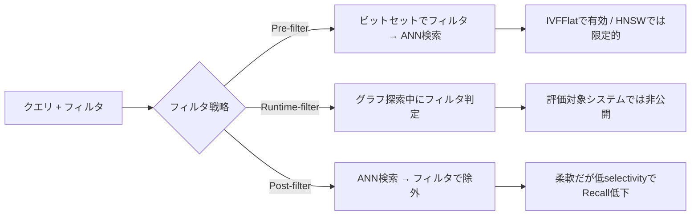

本記事は [arXiv:2602.11443](https://arxiv.org/abs/2602.11443) の解説記事です。

## 論文概要

この論文は、ベクトルデータベースにおけるフィルタ付き近似最近傍検索（Filtered ANN Search）のフィルタリング戦略を体系的に分類し、FAISS・Milvus・pgvectorの3システムで実証比較した研究である。著者らは768次元のテキスト埋め込みを含む新しいリレーショナルベンチマーク「MoReVec」を構築し、フィルタのselectivity（データの何割がフィルタ条件を満たすか）がRecallとスループットに与える影響を定量的に分析している。中心的な発見は「エンジン内部のアルゴリズム適応が、生のインデックス性能を凌駕する場合がある」という点であり、特にMilvusのDual-Poolハイブリッド実行やpgvectorのクエリオプティマイザの挙動に関する知見は、本番環境での選定判断に直結する。

この記事は [Zenn記事: ベクトルDB選定を自社データで検証する：5軸ベンチマーク設計と再現可能な評価手法](https://zenn.dev/0h_n0/articles/2cd2c26ec816f5) の深掘りです。

## 情報源

- **arXiv ID**: 2602.11443
- **URL**: [https://arxiv.org/abs/2602.11443](https://arxiv.org/abs/2602.11443)
- **著者**: Abylay Amanbayev, Brian Tsan, Tri Dang, Florin Rusu
- **発表年**: 2026年2月
- **分野**: cs.DB, cs.IR

## 背景と動機

RAGシステムの普及に伴い、ベクトルデータベースでのフィルタ付き検索は本番環境で不可欠な機能となっている。テナントID、カテゴリ、日付範囲などのメタデータフィルタとベクトル類似度検索を組み合わせる場面は実運用では常態であるが、ベンダーが公開するベンチマークはフィルタなしの純粋なANN検索で測定されていることが多い。

著者らが指摘する構造的な問題は、フィルタのselectivityが低下すると（つまり、フィルタで残るデータが少なくなると）、HNSWやIVFFlatといったインデックスのRecallが一様に劣化するものの、その劣化メカニズムがインデックスタイプとシステムアーキテクチャによって大きく異なるという点である。さらに、ANN-Benchmarksなどの既存ベンチマークはフィルタ付き検索をサポートしておらず、公平な比較が困難であった。

この研究は、ANN-Benchmarksをフィルタ付き検索に拡張し、リレーショナルなメタデータを持つ新しいデータセットMoReVecを用いて、3つの主要ベクトルDBシステムのフィルタ付き検索性能を統一的に比較するものである。

## 主要な貢献

- **Global-Local Selectivity（GLS）相関メトリクス**: フィルタとベクトル空間の独立性を定量化する正規化指標の提案
- **フィルタリング戦略の体系的分類**: Pre-filter / Post-filter / Runtime-filterの3分類と各戦略の適用条件の明確化
- **MoReVecベンチマーク**: 768次元テキスト埋め込みとリレーショナルメタデータを含む新しいデータセット
- **3システム比較**: FAISS・Milvus・pgvectorのシステムレベルの性能差異の解明

## 技術的詳細

### GLS相関メトリクス

著者らは、フィルタ条件とベクトル空間の関係を定量化するために、Global-Local Selectivity（GLS）相関メトリクスを提案している。

まず、以下の2つのselectivityを定義する:

- **Global selectivity** $\sigma_g$: データセット全体でフィルタ条件を満たすデータの割合
- **Local selectivity** $\sigma_l$: exact-kNN結果（上位k件）の中でフィルタ条件を満たすデータの割合

これらの比率 $r$ を用いて、GLS相関 $\rho_q$ を以下のように定義する:

$$
r = \frac{\sigma_l}{\sigma_g}, \quad \rho_q = \frac{r - 1}{r + 1} \in [-1, 1)
$$

ここで、
- $\rho_q \approx 0$: フィルタとベクトル空間が独立（メタデータがベクトル空間にクラスタリングされていない）
- $\rho_q > 0$: 正の相関（フィルタ条件を満たすデータがクエリの近傍に集中）
- $\rho_q < 0$: 負の相関（フィルタ条件を満たすデータがクエリから遠い位置に集中）

著者らの実験では、MoReVecデータセットの平均GLS相関が$\rho_q \approx 0$であることが確認されており、メタデータ属性は埋め込み空間からほぼ独立していることが示されている。

### フィルタリング戦略の3分類



| 戦略 | 仕組み | HNSW適用 | IVFFlat適用 |
|------|--------|---------|------------|
| Pre-filter | ビットセットで候補を絞りANN検索 | 限定的（グラフ構造を維持したまま探索するため） | 有効（クラスタプルーニングと相性が良い） |
| Runtime-filter | グラフ探索中にフィルタ条件を遅延評価 | 理論上は有効だが評価対象システムでは非公開 | 適用困難 |
| Post-filter | ANN検索後にフィルタで候補を除外 | 柔軟だが低selectivityでk件に満たないリスク | 同左 |

### MoReVecデータセット

著者らは`gte-base-en-v1.5`モデルで生成した768次元のL2正規化ベクトルを含むリレーショナルベンチマークを構築している。

| テーブル | レコード数 | 次元数 | メタデータ |
|---------|----------|-------|----------|
| Movies | 9,999〜551,155 | 768 | year, genre, rating, vote_count |
| Reviews | 247,286〜2,598,267 | 768 | quality rating, foreign key |

評価条件として、1,000クエリベクトルに対して6〜7段階のselectivity（$\sigma_g \approx 0.0003$〜$0.5$）、$k \in \{1, 10, 40, 100\}$でシングルスレッド・インメモリモードの実験を行っている。

### インデックスパラメータ

```python
hnsw_configs = {
    "M": [5, 10, 15],
    "ef_construction": [25, 50, 75],
    "ef_search": [1, 10, 40, 100, 200, 500, 1000],
}

ivfflat_configs = {
    "clusters": [100, 200, 400, 800, 1600],  # データ規模依存
    "n_probe": [1, 5, 10, 20, 50, 150, 300],
}
```

## 実験結果

### selectivityがRecallに与える影響

著者らは「フィルタselectivityの増加（データが少なくなる方向）はHNSWとIVFFlat双方のRecallに対して一貫して負の圧力を与える」と報告している（Section 7.2.1より）。ただし、劣化のメカニズムは異なる:

- **グラフベース（HNSW）**: QPSはselectivityに対してほぼ不変（トラバーサルコストが支配的）だが、Recallが低下
- **IVFFlat**: 低selectivityでクラスタプルーニングが効率的に動作し、QPSが優位

### 通説への反証: 低selectivityでIVFFlatがHNSWを上回る

論文の重要な発見の一つとして、著者らはselectivity 5%以下ではIVFFlatがHNSWを上回ると報告している（Section 7.2.3-7.2.5より）。これは、IVFFlatのクラスタプルーニングが低selectivity環境で効率的に動作するためである。HNSWはselectivityが高い場合や近似結果で十分な場合に優位となる。

| 条件 | HNSW | IVFFlat | 優位 |
|------|------|---------|------|
| selectivity > 10% | 高Recall・低レイテンシ | 中程度 | HNSW |
| selectivity 1-10% | Recall低下 | クラスタプルーニングが有効 | 条件依存 |
| selectivity < 1% | 大幅Recall低下 | プルーニング効率が良い | IVFFlat |

### システムアーキテクチャの影響

**Milvus（Section 7.2.7）**: Dual-Poolハイブリッド実行方式を採用し、グラフ探索と適応的ブルートフォースフォールバックを切り替える。著者らは「Milvusが極端な低selectivityにおいて優れたRecall安定性を示す」と報告しており、アルゴリズム適応が生のインデックス性能を凌駕するケースがあることを実証している。

**pgvector（Section 7.2.8）**: コストベースオプティマイザが近似インデックススキャンと正確なシーケンシャルスキャンの選択を誤るケースが確認されている。著者らは「pgvectorのオプティマイザは、正確なシーケンシャルスキャンが同等のレイテンシで完全なRecallを達成する場合でも、近似インデックススキャンを選択することがある」と報告しており、カーディナリティ推定エラーが低selectivityで増幅される問題を指摘している。

**FAISS**: ビットセットによるPre-filteringを実装。IDSelectorのオーバーヘッドは大規模データセットでも1ms未満。適応的メカニズムはなく、性能は予測可能である。

### クエリ-フィルタ相関の検証

実験結果はメタデータ属性が埋め込み空間からほぼ独立していること（平均GLS $\approx 0$）を確認しており、性能がフィルタの空間的クラスタリングではなくフィルタの疎密度（selectivity）によって駆動されることを示している。

## 実装のポイント

著者らの知見を実装に活かす際のポイントを整理する:

1. **selectivity 5%未満**: HNSWよりIVFFlatの方がクラスタプルーニングの効率で優位になる場合がある。本番のフィルタ条件のselectivity分布を事前に分析し、低selectivityが頻出する場合はIVFFlatも検討する
2. **Recall重視のワークロード**: Milvusのハイブリッドアーキテクチャ、またはフォールバック・トゥ・ブルートフォースのロジックを実装する
3. **pgvector使用時**: クエリプラン選択を`EXPLAIN ANALYZE`で検証し、コストエスティメータの誤判定を確認する。`SET enable_indexscan = off`で強制シーケンシャルスキャンとの比較も有効
4. **HNSWパラメータ**: 中程度のM値（$M \approx 10$）が構築コストと検索品質のバランスが良い

```python
def select_index_strategy(
    selectivity: float,
    recall_target: float = 0.95,
) -> str:
    """selectivityに基づくインデックス戦略の選択ガイドライン。

    著者らの実験結果（Section 7.2.3-7.2.5）に基づく簡易判定。
    実際の選定では自社データでのベンチマークが不可欠。
    """
    if selectivity < 0.01:
        return "brute_force_fallback"
    elif selectivity < 0.05:
        return "ivfflat_with_pruning"
    elif selectivity < 0.30:
        return "hnsw_or_ivfflat_benchmark_required"
    else:
        return "hnsw_preferred"
```

## Production Deployment Guide

### AWS実装パターン（コスト最適化重視）

フィルタ付きベクトル検索システムをAWS上に構築する際の推奨構成を示す。本論文の知見を踏まえ、selectivity分布に応じたインデックス戦略の切り替えを考慮した設計とする。

**トラフィック量別の推奨構成**:

| 規模 | 月間リクエスト | 推奨構成 | 月額コスト | 主要サービス |
|------|--------------|---------|-----------|------------|
| **Small** | ~3,000 (100/日) | Serverless | $50-150 | Lambda + RDS pgvector + S3 |
| **Medium** | ~30,000 (1,000/日) | Hybrid | $400-900 | ECS Fargate + RDS pgvector + ElastiCache |
| **Large** | 300,000+ (10,000/日) | Container | $2,500-6,000 | EKS + Milvus on EC2 + ElastiCache |

**Small構成の詳細** (月額$50-150):
- **Lambda**: 1GB RAM, 60秒タイムアウト ($20/月)
- **RDS PostgreSQL + pgvector**: db.t4g.medium ($70/月)
- **S3**: ベクトルデータバックアップ ($5/月)
- **CloudWatch**: 基本監視 ($5/月)

**Medium構成の詳細** (月額$400-900):
- **ECS Fargate**: 1 vCPU, 2GB RAM × 2タスク ($150/月)
- **RDS PostgreSQL + pgvector**: db.r6g.large, Multi-AZ ($400/月)
- **ElastiCache Redis**: cache.t4g.micro ($15/月)
- **Application Load Balancer**: ($20/月)

**Large構成の詳細** (月額$2,500-6,000):
- **EKS**: コントロールプレーン ($72/月)
- **EC2**: r6i.2xlarge × 3台 (Milvus分散) ($1,500/月)
- **EC2 Spot Instances**: ベンチマーク用 (平均$200/月)
- **ElastiCache Redis**: cache.r6g.large ($300/月)
- **S3 + CloudWatch + X-Ray**: ($100/月)

**コスト削減テクニック**:
- Reserved Instances購入でRDS/EC2コストを最大72%削減（1年コミット）
- pgvector使用時はRDS Auroraの代わりにスタンダードRDSを選択（pgvector拡張のサポート状況を確認）
- 開発環境はdb.t4g.microで月額$15程度に抑制
- アイドルタイムのAuto Scaling to Zero（Lambda/Fargate）

**コスト試算の注意事項**:
- 上記は2026年7月時点のAWS ap-northeast-1（東京）リージョン料金に基づく概算値です
- 実際のコストはトラフィックパターン、データ規模、クエリ複雑度により変動します
- 最新料金は [AWS料金計算ツール](https://calculator.aws/) で確認してください

### Terraformインフラコード

**Small構成 (Serverless): Lambda + RDS pgvector**

```hcl
module "vpc" {
  source  = "terraform-aws-modules/vpc/aws"
  version = "~> 5.0"

  name = "vectordb-bench-vpc"
  cidr = "10.0.0.0/16"
  azs  = ["ap-northeast-1a", "ap-northeast-1c"]
  private_subnets  = ["10.0.1.0/24", "10.0.2.0/24"]
  database_subnets = ["10.0.3.0/24", "10.0.4.0/24"]

  enable_nat_gateway = false
  enable_dns_hostnames = true

  create_database_subnet_group = true
}

resource "aws_db_instance" "pgvector" {
  identifier        = "vectordb-pgvector"
  engine            = "postgres"
  engine_version    = "17.4"
  instance_class    = "db.t4g.medium"
  allocated_storage = 100
  storage_type      = "gp3"

  db_name  = "vectordb"
  username = "vectoradmin"
  manage_master_user_password = true

  db_subnet_group_name   = module.vpc.database_subnet_group_name
  vpc_security_group_ids = [aws_security_group.pgvector.id]

  parameter_group_name = aws_db_parameter_group.pgvector.name

  backup_retention_period = 7
  skip_final_snapshot     = false
  storage_encrypted       = true
}

resource "aws_db_parameter_group" "pgvector" {
  family = "postgres17"
  name   = "pgvector-optimized"

  parameter {
    name  = "shared_preload_libraries"
    value = "vector"
  }

  parameter {
    name  = "shared_buffers"
    value = "{DBInstanceClassMemory/4}"
  }

  parameter {
    name  = "work_mem"
    value = "262144"  # 256MB
  }

  parameter {
    name  = "maintenance_work_mem"
    value = "2097152"  # 2GB
  }

  parameter {
    name  = "effective_cache_size"
    value = "{DBInstanceClassMemory*3/4}"
  }
}

resource "aws_security_group" "pgvector" {
  name_prefix = "pgvector-"
  vpc_id      = module.vpc.vpc_id

  ingress {
    from_port       = 5432
    to_port         = 5432
    protocol        = "tcp"
    security_groups = [aws_security_group.lambda.id]
  }
}

resource "aws_lambda_function" "vector_search" {
  filename      = "lambda.zip"
  function_name = "vector-search-handler"
  role          = aws_iam_role.lambda.arn
  handler       = "index.handler"
  runtime       = "python3.12"
  timeout       = 60
  memory_size   = 1024

  vpc_config {
    subnet_ids         = module.vpc.private_subnets
    security_group_ids = [aws_security_group.lambda.id]
  }

  environment {
    variables = {
      DB_SECRET_ARN = aws_db_instance.pgvector.master_user_secret[0].secret_arn
      DB_HOST       = aws_db_instance.pgvector.address
      DB_NAME       = "vectordb"
    }
  }
}

resource "aws_cloudwatch_metric_alarm" "pgvector_cpu" {
  alarm_name          = "pgvector-cpu-high"
  comparison_operator = "GreaterThanThreshold"
  evaluation_periods  = 3
  metric_name         = "CPUUtilization"
  namespace           = "AWS/RDS"
  period              = 300
  statistic           = "Average"
  threshold           = 80
  alarm_description   = "pgvector CPU使用率80%超過"

  dimensions = {
    DBInstanceIdentifier = aws_db_instance.pgvector.identifier
  }
}
```

**Large構成 (Container): EKS + Milvus**

```hcl
module "eks" {
  source  = "terraform-aws-modules/eks/aws"
  version = "~> 20.0"

  cluster_name    = "vectordb-cluster"
  cluster_version = "1.31"

  vpc_id     = module.vpc.vpc_id
  subnet_ids = module.vpc.private_subnets

  cluster_endpoint_public_access = true
  enable_cluster_creator_admin_permissions = true
}

resource "helm_release" "milvus" {
  name       = "milvus"
  repository = "https://zilliztech.github.io/milvus-helm/"
  chart      = "milvus"
  namespace  = "milvus"

  create_namespace = true

  set {
    name  = "cluster.enabled"
    value = "true"
  }

  set {
    name  = "queryNode.replicas"
    value = "3"
  }

  set {
    name  = "queryNode.resources.requests.memory"
    value = "8Gi"
  }
}

resource "aws_budgets_budget" "vectordb_monthly" {
  name         = "vectordb-monthly-budget"
  budget_type  = "COST"
  limit_amount = "6000"
  limit_unit   = "USD"
  time_unit    = "MONTHLY"

  notification {
    comparison_operator       = "GREATER_THAN"
    threshold                 = 80
    threshold_type            = "PERCENTAGE"
    notification_type         = "ACTUAL"
    subscriber_email_addresses = ["ops@example.com"]
  }
}
```

### セキュリティベストプラクティス

1. **ネットワークセキュリティ**: RDS pgvectorはプライベートサブネットに配置し、Lambda/ECSからのみアクセスを許可。パブリックアクセスは無効化
2. **認証・認可**: IAMロールは最小権限の原則。RDSのマスターパスワードはSecrets Managerで管理
3. **暗号化**: RDSストレージのKMS暗号化を有効化。転送中のデータはTLS 1.2以上必須
4. **監査**: CloudTrail全リージョン有効化。RDS監査ログの長期保存

### 運用・監視設定

**CloudWatch Logs Insights クエリ**:
```sql
-- pgvectorクエリレイテンシ分析
fields @timestamp, duration_ms, query_type, selectivity
| stats pct(duration_ms, 50) as p50,
        pct(duration_ms, 95) as p95,
        pct(duration_ms, 99) as p99
  by bin(5m)

-- selectivity別のRecall劣化検知
fields @timestamp, selectivity, recall_at_10
| filter selectivity < 0.05
| stats avg(recall_at_10) as avg_recall by bin(1h)
| filter avg_recall < 0.85
```

**CloudWatch アラーム設定**:
```python
import boto3

cloudwatch = boto3.client('cloudwatch')

cloudwatch.put_metric_alarm(
    AlarmName='pgvector-query-latency-p99',
    ComparisonOperator='GreaterThanThreshold',
    EvaluationPeriods=3,
    MetricName='QueryLatencyP99',
    Namespace='Custom/VectorDB',
    Period=300,
    Statistic='Average',
    Threshold=500,  # 500ms超過でアラート
    ActionsEnabled=True,
    AlarmActions=['arn:aws:sns:ap-northeast-1:123456789:vectordb-alerts'],
    AlarmDescription='pgvector p99レイテンシ異常'
)

cloudwatch.put_metric_alarm(
    AlarmName='vectordb-recall-degradation',
    ComparisonOperator='LessThanThreshold',
    EvaluationPeriods=2,
    MetricName='RecallAt10',
    Namespace='Custom/VectorDB',
    Period=3600,
    Statistic='Average',
    Threshold=0.85,
    AlarmDescription='Recall@10が0.85未満に低下'
)
```

**X-Ray トレーシング設定**:
```python
from aws_xray_sdk.core import xray_recorder, patch_all

patch_all()

@xray_recorder.capture('vector_search')
def search_vectors(
    query_vector: list[float],
    filter_condition: dict,
    k: int = 10,
) -> list[dict]:
    xray_recorder.put_annotation('selectivity', filter_condition.get('selectivity', 'unknown'))
    xray_recorder.put_annotation('index_type', 'hnsw')
    xray_recorder.put_metadata('k', k)
    xray_recorder.put_metadata('filter_keys', list(filter_condition.keys()))

    results = execute_filtered_search(query_vector, filter_condition, k)

    xray_recorder.put_metadata('result_count', len(results))
    return results
```

### コスト最適化チェックリスト

**アーキテクチャ選択（トラフィック量で判断）**:
- [ ] ~100 req/日 → Lambda + RDS pgvector (Serverless) - $50-150/月
- [ ] ~1,000 req/日 → ECS Fargate + RDS pgvector (Hybrid) - $400-900/月
- [ ] 10,000+ req/日 → EKS + Milvus (Container) - $2,500-6,000/月

**リソース最適化**:
- [ ] RDS: Reserved Instances購入で最大72%削減（1年コミット）
- [ ] EC2: Spot Instances優先（ベンチマーク実行環境）
- [ ] Lambda: メモリサイズ最適化（CloudWatch Insights分析）
- [ ] ECS/EKS: アイドルタイムのスケールダウン（夜間0台）
- [ ] RDS: 開発環境はdb.t4g.microで$15/月

**pgvector固有の最適化**:
- [ ] shared_buffersをインスタンスメモリの25%に設定
- [ ] work_memを256MB以上に設定（HNSW検索に必要）
- [ ] maintenance_work_memを2GB以上に設定（インデックス構築用）
- [ ] HNSWパラメータ: M=10, ef_construction=50を初期値に
- [ ] 低selectivityクエリはEXPLAIN ANALYZEでプラン検証

**監視・アラート（性能異常の即時検知）**:
- [ ] AWS Budgets: 月額予算設定（80%で警告）
- [ ] CloudWatch アラーム: p99レイテンシ、Recall劣化
- [ ] RDS Performance Insights: クエリ分析
- [ ] 日次コストレポート: SNS/Slackへ自動送信

**リソース管理**:
- [ ] 未使用リソース削除: Trusted Advisor活用
- [ ] タグ戦略: 環境別（dev/staging/prod）でコスト可視化
- [ ] RDS: 開発環境は夜間停止（Auto Start/Stop）
- [ ] S3ライフサイクル: 古いバックアップの自動削除（90日）

## 実運用への応用

本論文の知見は、Zenn記事で紹介した5軸ベンチマーク設計に直接活用できる。特に以下の3点が重要である:

1. **selectivity分布の事前分析**: 本番のフィルタクエリのselectivity分布を分析し、5%未満が頻出する場合はIVFFlatの検討が必要。論文の実験結果は、低selectivityでIVFFlatがHNSWを上回ることを示しており、インデックス選択の判断基準が変わる

2. **システムレベルの適応メカニズム**: Milvusのようなハイブリッド実行方式は、selectivityの変動に対して頑健な性能を提供する。pgvectorを使用する場合は、クエリプランの検証が不可欠であり、`EXPLAIN ANALYZE`による定期的な確認を運用に組み込むべきである

3. **GLS相関メトリクスの活用**: 自社データのフィルタ条件とベクトル空間の相関を測定することで、ベンチマーク設計の妥当性を検証できる。相関が高い場合は、フィルタ戦略の選択がRecallにより大きな影響を与える

## 関連研究

- **ACORN (2024)**: フィルタ非依存のHNSWグラフ構築手法。2ホップ近傍展開によりフィルタ付き検索のRecallを改善するが、本論文の著者らは「システムレベルの分析ではなくアルゴリズム融合手法に焦点を当てている」と区別している
- **Filtered-DiskANN (2023)**: プレディケート考慮のグラフ構築手法。ディスクベースの大規模データに適するが、本論文の汎用的なフィルタリング戦略分析とは異なるアプローチである
- **ANN-Benchmarks**: 本論文で拡張されたベンチマークフレームワーク。フィルタ付き検索の標準的な比較基盤を提供する

## まとめと今後の展望

本論文は、フィルタ付きベクトル検索のシステムレベル分析という観点から、3つの主要ベクトルDBの性能特性を明らかにした。著者らの実験結果は、低selectivity環境でIVFFlatがHNSWを上回る場面があること、Milvusのアルゴリズム適応が生のインデックス性能を凌駕すること、pgvectorのオプティマイザに改善の余地があることを示している。MoReVecデータセットとANN-Benchmarksの拡張はオープンソースで公開されており、自社データでの再現可能な評価に活用できる。

## 参考文献

- **arXiv**: [https://arxiv.org/abs/2602.11443](https://arxiv.org/abs/2602.11443)
- **ANN-Benchmarks拡張**: オープンソース公開（論文内リンク参照）
- **Related Zenn article**: [https://zenn.dev/0h_n0/articles/2cd2c26ec816f5](https://zenn.dev/0h_n0/articles/2cd2c26ec816f5)

---

:::message
この記事はAI（Claude Code）により自動生成されました。内容の正確性については論文の原文で検証していますが、実際の利用時は原論文もご確認ください。
:::
