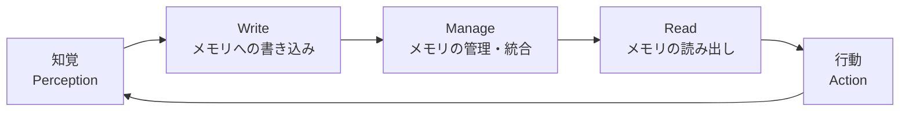
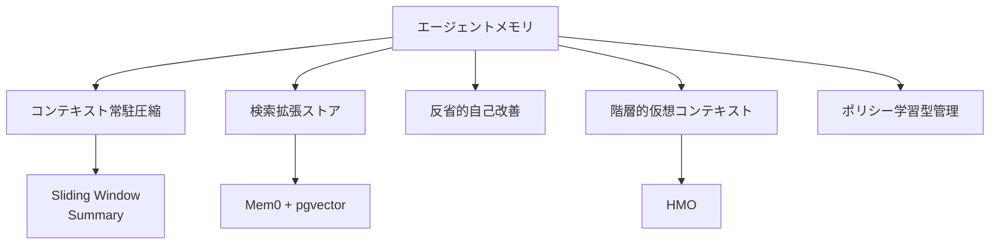

本記事は [arXiv:2603.07670](https://arxiv.org/abs/2603.07670) の解説記事です。

## 論文概要（Abstract）

本サーベイは、LLMベースエージェントのメモリ機構を2022年から2026年初頭までの研究を対象に体系的に整理したものである。著者は、エージェントメモリを**Write–Manage–Readループ**として定式化し、時間的スコープ・表現基盤・制御ポリシーの3次元で分類する体系を提案している。5つのメカニズムファミリーを特定し、4つの最新ベンチマークの分析を通じて、現在のシステムに残る「頑固なギャップ」を明らかにしている。

この記事は [Zenn記事: Mem0×pgvectorでセッション横断の長期記憶を持つCSエージェントを構築する](https://zenn.dev/0h_n0/articles/763bb6a7397e5c) の深掘りです。

## 情報源

- **arXiv ID**: 2603.07670
- **URL**: [https://arxiv.org/abs/2603.07670](https://arxiv.org/abs/2603.07670)
- **著者**: Pengfei Du
- **発表年**: 2026（3月公開）
- **分野**: cs.AI
- **ライセンス**: CC-BY-4.0

## 背景と動機（Background & Motivation）

LLMはテキスト生成において高い能力を持つが、本質的にはステートレスなシステムである。自律エージェントとして機能するためには、過去のインタラクションから学習し、文脈に応じた行動を取る能力が必要であり、これを実現するのがメモリ機構である。

しかし、メモリ研究は急速に進展しており、個別のシステム（Mem0、MemGPT、A-Mem等）を横断的に比較・評価する統一的な枠組みが不足していた。著者は、「ステートレスなテキスト生成器を真に適応的なエージェントに変換する」ためのメモリ機構を、メカニズム・評価・応用の3つの観点から整理している。

## 主要な貢献（Key Contributions）

- **貢献1**: エージェントメモリを**Write–Manage–Readループ**として定式化し、知覚と行動に密結合したシステムとして位置づける概念フレームワークの提案
- **貢献2**: 時間的スコープ・表現基盤・制御ポリシーの3次元分類体系と、5つのメカニズムファミリーの特定
- **貢献3**: 静的リコールベンチマークからマルチセッション型エージェントテストへの評価手法の進化の分析と、現在のシステムに残る未解決課題の体系化

## 技術的詳細（Technical Details）

### Write–Manage–Readループ

著者はエージェントメモリを以下のループとして定式化している:



このフレームワークの重要な指摘は、メモリが独立したモジュールではなく、エージェントの知覚・推論・行動と**密結合**しているという点である。Mem0のアーキテクチャも、このWrite（抽出→ADD/UPDATE）–Manage（DELETE/NOOP）–Read（セマンティック検索）ループに対応づけることができる。

### 3次元分類体系

著者はメモリ機構を以下の3つの次元で整理している:

| 次元 | 内容 | 具体例 |
|------|------|-------|
| **時間的スコープ** | 情報がどのくらい持続するか | 短期（セッション内）/ 長期（セッション横断） |
| **表現基盤** | 保存される情報の形式 | テキスト / ベクトル / グラフ / パラメータ |
| **制御ポリシー** | 検索と管理の決定方法 | ルールベース / ニューラル / ハイブリッド |

### 5つのメカニズムファミリー

サーベイは5つの主要アプローチを特定している。各ファミリーの特徴と、Mem0 + pgvectorの位置づけを示す:

#### 1. コンテキスト常駐圧縮（Context-Resident Compression）

コンテキストウィンドウ内で情報を圧縮する方式。会話サマリーやSliding Windowが該当する。

$$
\mathcal{M}_{\text{compressed}} = \text{summarize}(\mathcal{H}_{1:t-1})
$$

**長所**: 追加インフラ不要、レイテンシ最小
**短所**: コンテキスト長の制約、古い情報の喪失
**Mem0との関係**: Mem0はこの方式を採用**しない**。代わりに外部ストアを使用する

#### 2. 検索拡張ストア（Retrieval-Augmented Stores）

外部知識リポジトリにメモリを保存し、クエリに応じて検索する方式。Mem0のpgvectorバックエンドはこのファミリーに属する。

$$
\mathcal{M}_{\text{retrieved}} = \text{top-k}(\text{sim}(\mathbf{e}_q, \mathbf{E}_{\mathcal{M}}))
$$

ここで、
- $\mathbf{e}_q$: クエリのエンベディング
- $\mathbf{E}_{\mathcal{M}}$: メモリストア全体のエンベディング行列

**長所**: コンテキスト長の制約なし、スケーラブル
**短所**: 検索精度に依存、ノイジーな結果のリスク
**Mem0との関係**: Mem0のコアアーキテクチャはこのファミリー

#### 3. 反省的自己改善（Reflective Self-Improvement）

エージェントが過去の経験から学習し、行動を改善する方式。Reflexion（Shinn et al., 2023）が代表例。

**長所**: 自律的な品質向上
**短所**: 計算コスト大、反省プロセスの信頼性
**Mem0との関係**: Mem0のv2.0は部分的にこの要素を含む（NOOP/DELETE判断）

#### 4. 階層的仮想コンテキスト（Hierarchical Virtual Context）

メモリを構造化された層に整理する方式。前述のHMO（arXiv:2604.01670）やMemGPTが該当する。

**長所**: 検索空間の効率的な枝刈り
**短所**: 階層設計の複雑さ
**Mem0との関係**: Mem0のフラット構造の拡張として統合可能

#### 5. ポリシー学習型管理（Policy-Learned Management）

メモリ操作（書き込み・読み出し・削除）をニューラルネットワークで学習する方式。

$$
\pi_\theta(a_t | s_t) = \text{NN}(s_t; \theta)
$$

ここで、$a_t$はメモリ操作（write/read/forget）、$s_t$はエージェント状態

**長所**: データ駆動の最適化
**短所**: 訓練データの要件、解釈可能性
**Mem0との関係**: Mem0はLLMベースの管理判断を採用しており、ポリシー学習は未導入

### 5つのファミリーの比較



## 実装のポイント（Implementation）

### Write-Pathフィルタリング

サーベイが指摘するエンジニアリング課題の中で、最も実務的に重要なのは**Write-Pathフィルタリング**（何を保存するかの判断）である。

Mem0の抽出フェーズではLLMがキーファクトを選択するが、この判断の品質がメモリ全体の有用性を決定する。著者は以下の課題を指摘している:

1. **過剰保存**: 些末な情報を保存するとノイズが増大
2. **過少保存**: 重要な情報を見落とすと文脈が欠落
3. **矛盾処理**: 相反する情報の統合ロジック

```python
def write_path_filter(
    facts: list[str],
    existing_memories: list[str],
    importance_threshold: float = 0.5,
) -> list[dict]:
    """Write-Pathフィルタリングの実装例

    Args:
        facts: 抽出されたファクトのリスト
        existing_memories: 既存メモリのリスト
        importance_threshold: 保存閾値

    Returns:
        フィルタリング結果（操作とファクトのペア）
    """
    results = []
    for fact in facts:
        importance = estimate_importance(fact)
        if importance < importance_threshold:
            results.append({"op": "NOOP", "fact": fact, "reason": "low importance"})
            continue

        contradiction = find_contradiction(fact, existing_memories)
        if contradiction:
            results.append({"op": "UPDATE", "fact": fact, "old": contradiction})
        else:
            duplicate = find_duplicate(fact, existing_memories)
            if duplicate:
                results.append({"op": "NOOP", "fact": fact, "reason": "duplicate"})
            else:
                results.append({"op": "ADD", "fact": fact})

    return results
```

### レイテンシバジェット

サーベイは、メモリ検索のレイテンシバジェットについても議論している。CSエージェントのような対話型アプリケーションでは、ユーザーの体感として**応答全体が2秒以内**に返る必要がある。LLMの推論に1-1.5秒を要する場合、メモリ検索に許容されるレイテンシは**100-500ms**程度となる。

pgvectorのHNSWインデックスは、500万ベクトル以下であればこのバジェット内に収まる。しかし、グラフ拡張バリアント（Neo4jクエリ）やマルチシグナル検索を追加すると、レイテンシが増大するリスクがある。

## 実験結果（Results）

### 4つの評価ベンチマークの比較

著者は、メモリ評価が「静的リコールベンチマークからマルチセッション型エージェントテスト」に進化していると述べ、4つのベンチマークを分析している:

| ベンチマーク | 評価対象 | 特徴 | 規模 |
|------------|---------|------|------|
| **LoCoMo** | 長期会話の記憶 | 4タイプの質問（single-hop, temporal, multi-hop, open） | ~1000セッション |
| **LongMemEval** | 長期メモリの検索精度 | Recall@k, NDCG@kで評価 | 可変 |
| **BEAM** | 大規模メモリの品質維持 | 1M-10Mトークンスケーリング | 大規模 |
| **マルチセッション対話** | セッション横断の一貫性 | 実エージェント環境でのE2E評価 | 実環境 |

### 「頑固なギャップ」

サーベイは現在のシステムに共通する以下の未解決課題を特定している:

1. **スケーリング劣化**: BEAMベンチマークでは、1Mトークンから10Mトークンにスケールすると25%のスコア低下が観測される
2. **時間推論の弱さ**: 「先月の問い合わせ」のような時間的な限定をかけた検索の精度が低い
3. **マルチホップの困難**: 複数のメモリを組み合わせて推論する能力が不十分
4. **忘却の不在**: 不要になった情報を体系的に削除するメカニズムが未発達

## 実運用への応用（Practical Applications）

サーベイの分類は、Mem0 + pgvectorベースのCSエージェントを設計・改善する際の指針となる。

**現在のMem0の位置づけ**: 検索拡張ストア（ファミリー2）が主軸であり、LLMベースのWrite-Path管理を含む。グラフ拡張バリアントはファミリー4（階層的仮想コンテキスト）の要素を部分的に取り入れている。

**改善の方向性**:
- **階層化**: HMOのような3層構造を導入し、検索空間を枝刈り
- **適応的忘却**: 時間減衰と呼び出し頻度に基づく体系的なメモリ整理
- **ポリシー学習**: メモリ操作判断をLLM依存からデータ駆動に移行

## 関連研究（Related Work）

- **Mem0 (Chhikara et al., 2025)**: 本サーベイの分類ではファミリー2（検索拡張ストア）に位置づけられる
- **MemGPT (Packer et al., 2023)**: ファミリー4（階層的仮想コンテキスト）の代表的システム
- **Reflexion (Shinn et al., 2023)**: ファミリー3（反省的自己改善）の代表的手法

## まとめと今後の展望

本サーベイは、LLMエージェントのメモリ研究を体系的に整理し、5つのメカニズムファミリーとして分類することで、各アプローチの長所・短所と適用領域を明確にしている。Mem0のようなプロダクションシステムは現在ファミリー2を中心としているが、今後はファミリー4（階層化）やファミリー5（ポリシー学習）の要素を統合することで、スケーリング劣化や時間推論の弱さといった「頑固なギャップ」の解消が期待される。

著者が指摘する5つのオープンリサーチフロンティア（継続的統合、因果的検索、信頼性のある反省、学習可能な忘却、マルチモーダル身体化メモリ）は、メモリ研究の今後の方向性を示す重要なロードマップである。

## 参考文献

- **arXiv**: [https://arxiv.org/abs/2603.07670](https://arxiv.org/abs/2603.07670)
- **Related Zenn article**: [https://zenn.dev/0h_n0/articles/763bb6a7397e5c](https://zenn.dev/0h_n0/articles/763bb6a7397e5c)
