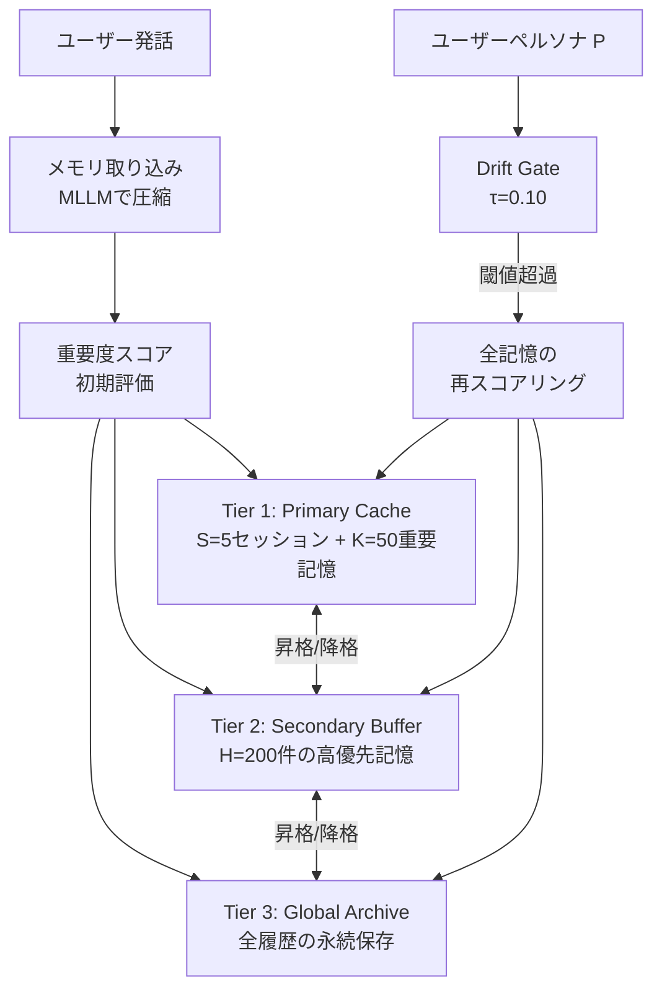

本記事は [arXiv:2604.01670](https://arxiv.org/abs/2604.01670) の解説記事です。

## 論文概要（Abstract）

LLMベースの永続エージェントでは、長期記憶の拡大に伴い検索ノイズと計算レイテンシが増大する問題がある。著者らは**Hierarchical Memory Orchestration（HMO）**を提案し、ユーザーペルソナに基づく3層メモリ階層と非線形スコアリング関数により、検索空間の枝刈りと記憶品質の維持を両立させている。LongMemEval-SベンチマークでRecall@5 81.1%を達成し、フルアーカイブ検索と比較して**推論時間を77%短縮**したと報告している。

この記事は [Zenn記事: Mem0×pgvectorでセッション横断の長期記憶を持つCSエージェントを構築する](https://zenn.dev/0h_n0/articles/763bb6a7397e5c) の深掘りです。

## 情報源

- **arXiv ID**: 2604.01670
- **URL**: [https://arxiv.org/abs/2604.01670](https://arxiv.org/abs/2604.01670)
- **著者**: Junming Liu, Yifei Sun, Weihua Cheng et al.
- **発表年**: 2026（4月公開）
- **分野**: cs.AI

## 背景と動機（Background & Motivation）

Mem0のようなメモリシステムは、会話からファクトを抽出してフラットなベクトルストアに保存する。この方式はメモリ数が数千件程度であれば実用的だが、長期運用で数十万件に成長すると、検索ノイズの増大と計算コストの上昇が問題となる。

著者らは、人間の記憶が海馬（短期）→新皮質（長期）の統合プロセスを経るように、AIエージェントのメモリにも階層構造が必要であると主張している。単純なストレージ拡張はノイズとレイテンシを増加させるだけであり、メモリの重要度と利用パターンに応じた動的な配置管理が不可欠である。

## 主要な貢献（Key Contributions）

- **貢献1**: Primary Cache / Secondary Buffer / Global Archiveの3層メモリ階層の設計と、ユーザーペルソナ駆動の動的な記憶再配置メカニズムの提案
- **貢献2**: ペルソナの微小変化に対する不要な再スコアリングを防ぐ**Drift Gate機構**の導入
- **貢献3**: LongMemEval-SおよびLoCoMoベンチマークでの定量評価と、OpenClawプラットフォームでの実環境デプロイ

## 技術的詳細（Technical Details）

### 3層メモリ階層アーキテクチャ

HMOは、メモリをアクセス頻度と重要度に基づいて3つの層に分類する。



| 層 | 容量 | 用途 | アクセスコスト |
|---|------|------|-------------|
| **Tier 1 (Primary Cache)** | 5セッション + 50記憶 | 直近＋最重要の記憶 | 低 |
| **Tier 2 (Secondary Buffer)** | 200件 | Tier 1に収まらない高優先記憶 | 中 |
| **Tier 3 (Global Archive)** | 無制限 | 全履歴の永続保存 | 高 |

### 非線形スコアリング関数

各メモリレコード$m$のスコアは以下の関数で計算される（論文Section 3.2より）:

$$
S_m = (\alpha \cdot I_m + \beta \cdot \text{Sim}(m, P)) \cdot \ln(1 + C_m) \cdot \exp\left(-\lambda \cdot \frac{t_{\text{now}} - t_{\text{last}}}{\ln(1 + C_m)}\right)
$$

ここで、
- $I_m$: 初期重要度スコア（1-10のスケール、MLLMが評価）
- $\text{Sim}(m, P)$: メモリ$m$とユーザーペルソナ$P$のコサイン類似度
- $C_m$: 累積呼び出し回数（頻繁に参照されるほど高スコア）
- $t_{\text{now}} - t_{\text{last}}$: 最終アクセスからの経過時間
- $\alpha, \beta$: 重み係数（論文では共に1.0に設定）
- $\lambda$: 時間減衰率

この関数の設計上の特徴は以下の通りである:

1. **対数的な頻度効果**: $\ln(1 + C_m)$により、呼び出し回数の増加が対数的にスコアを押し上げる。頻繁に参照されるメモリほどスコアが高くなるが、その効果は収穫逓減する
2. **適応的な時間減衰**: 分母に$\ln(1 + C_m)$が入ることで、頻繁に参照されるメモリは時間減衰の影響を受けにくくなる。これはEbbinghaus忘却曲線の「復習により忘却が遅くなる」性質をモデル化している
3. **ペルソナ整合性**: $\text{Sim}(m, P)$項により、ユーザーの関心が変化するとメモリの相対的なスコアも変動する

### Drift Gate機構

ペルソナ$P$はインタラクションごとに更新される可能性があるが、微小な変化のたびに全メモリの再スコアリングを実行すると計算コストが大きい。Drift Gate機構は、アンカーペルソナ$P_{\text{anchor}}$と現在のペルソナ$P_{\text{current}}$の乖離を監視し、閾値$\tau$を超えた場合にのみ再スコアリングをトリガーする。

$$
\text{drift} = 1 - \text{cos}(P_{\text{anchor}}, P_{\text{current}})
$$

$$
\text{rescore} = \begin{cases} \text{True} & \text{if drift} > \tau \\ \text{False} & \text{otherwise} \end{cases}
$$

論文では$\tau = 0.10$が使用されている。これにより、頻繁なペルソナ更新とコストの高い再スコアリングが分離される。

### メモリ取り込みプロセス

インタラクションはセグメント$m_r = (q, a)$として取り込まれ、MLLM $f_M$によって3種類の表現に圧縮される:

1. **意味記憶**: 時間非依存の知識（「契約プランはエンタープライズ」）
2. **エピソード記憶**: 時間軸付きのイベント（「7/15に返品申請」）
3. **コア記憶**: ユーザーの長期的な特性（「メール連絡を好む顧客」）

各レコードにはヘッダー$\mathcal{H}_m = \{I_m, \text{Sim}(m, P), C_m, t_{\text{last}}\}$が付与され、スコアリング関数への入力となる。

## 実装のポイント（Implementation）

### パラメータ設定

論文の実装では以下の設定が使用されている:

```python
# HMOパラメータ（論文の設定）
TIER1_SESSIONS = 5       # Tier 1に保持する直近セッション数
TIER1_PIVOTAL = 50       # Tier 1に保持する重要記憶数
TIER2_CAPACITY = 200     # Tier 2の容量
DRIFT_THRESHOLD = 0.10   # Drift Gate閾値
ALPHA = 1.0              # 初期重要度の重み
BETA = 1.0               # ペルソナ整合性の重み
```

### Mem0との比較と統合の可能性

HMOの3層構造はMem0のフラットなベクトルストアと相補的である。Mem0のpgvectorバックエンドに対して、以下のような統合が考えられる:

```python
import math
from datetime import datetime

def hmo_score(
    importance: float,
    persona_sim: float,
    recall_count: int,
    last_access: datetime,
    alpha: float = 1.0,
    beta: float = 1.0,
    decay_rate: float = 0.1,
) -> float:
    """HMOスコアリング関数のPython実装"""
    log_recall = math.log(1 + recall_count)
    elapsed = (datetime.now() - last_access).total_seconds() / 3600
    base = alpha * importance + beta * persona_sim
    frequency_boost = log_recall
    time_decay = math.exp(-decay_rate * elapsed / max(log_recall, 1e-6))
    return base * frequency_boost * time_decay
```

pgvectorのメタデータカラムに`recall_count`と`last_access`を追加し、検索結果のリランキングにHMOスコアを使用するアプローチが実現可能である。

## 実験結果（Results）

### LongMemEval-Sベンチマーク

論文Table 2より、主要な結果は以下の通りである:

| 構成 | Recall@5 | NDCG@5 | Accuracy | 推論時間 |
|------|---------|--------|----------|---------|
| Graph-based | 75.9% | 86.6% | 88.0% | 448.30分 |
| w/o Tier 1 | 80.4% | 85.8% | 83.1% | 21.53分 |
| w/o Tier 1,2 | 85.9% | 89.7% | 88.8% | 56.05分 |
| **Full HMO** | **81.1%** | **85.6%** | **86.4%** | **12.88分** |

Full HMO構成は、Graph-based構成と比較して推論時間を**97.1%短縮**（448.30分→12.88分）しながら、Accuracyの低下をわずか1.6ポイント（88.0%→86.4%）に抑えている。

### LoCoMoベンチマーク

| 手法 | Overall F1 | Single-Hop F1 | Open-Domain F1 |
|------|-----------|--------------|---------------|
| MemoryBank | 31.42 | — | — |
| MemVerse | 43.44 | — | — |
| **HMO** | **45.65** | **48.24** | **51.08** |

### アブレーション分析

Tier 1を除去すると推論時間が21.53分に増加し、Accuracyが3.3ポイント低下する。これは、Primary Cacheによる検索空間の枝刈りがレイテンシと精度の両方に寄与していることを示している。著者らは、フル構成が「検索空間の枝刈りにより77.0%の高速化を達成し、精度低下はわずか2.4%」と報告している。

## 実運用への応用（Practical Applications）

HMOの3層構造は、Mem0 + pgvectorによるCSエージェントの長期運用に直接適用できる。顧客数が増加し、メモリ総数が数十万件に達した場合、フラットなベクトル検索ではレイテンシとノイズが問題になる。HMOの階層構造を導入することで、頻繁に参照される顧客メモリをTier 1に昇格し、検索空間を大幅に削減できる。

Drift Gate機構は、顧客のペルソナ（契約プラン、問い合わせ傾向）が変化した場合にのみメモリの再評価を行うため、通常のインタラクションでは追加コストが発生しない。

## 関連研究（Related Work）

- **Mem0 (Chhikara et al., 2025)**: フラットなメモリストアに抽出→統合→検索パイプラインを実装。HMOの階層構造と相補的
- **MemGPT (Packer et al., 2023)**: OSの仮想メモリに着想を得た2層構造。HMOの3層構造はより細かい粒度の管理を可能にする
- **A-Mem (2024)**: Ebbinghaus忘却曲線に基づく減衰モデル。HMOは減衰を呼び出し頻度で適応的に制御する点が異なる

## まとめと今後の展望

HMOは、LLMエージェントの長期記憶管理における検索効率と記憶品質のトレードオフに対して、階層的メモリ構造とペルソナ駆動の動的配置という解決策を提示している。LongMemEval-Sで77%の推論時間短縮を実現しつつ精度低下を最小限に抑えた結果は、Mem0のようなメモリシステムの大規模運用に向けた重要な知見である。ただし、マルチエージェント環境でのメモリ共有やプライバシー制御については今後の課題として残されている。

## 参考文献

- **arXiv**: [https://arxiv.org/abs/2604.01670](https://arxiv.org/abs/2604.01670)
- **Related Zenn article**: [https://zenn.dev/0h_n0/articles/763bb6a7397e5c](https://zenn.dev/0h_n0/articles/763bb6a7397e5c)
