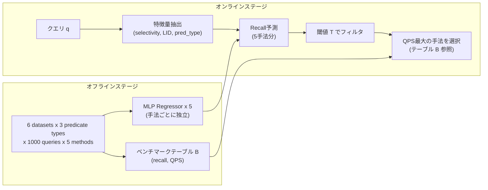

## 論文概要（Abstract）

フィルタ付き近似最近傍探索（Filtered ANN）において、単一の手法がすべてのデータセット・プレディケートタイプ・クエリの組み合わせで最適になることはない。著者らは、クエリごとに最適な検索手法を選択するMLベースのルーティングフレームワークを提案している。22候補から厳選した3特徴量で訓練した2層MLPリグレッサーにより、5つの未知データセットに対して平均Recall@10 = 0.986を達成し、ルーティングオーバーヘッドは中央値54マイクロ秒/クエリ（クエリレイテンシの0.2%）に収まると報告されている。

本記事は [https://arxiv.org/abs/2606.19898](https://arxiv.org/abs/2606.19898) の解説記事です。

この記事は [Zenn記事: ベクトルDB選定を自社データで検証する：5軸ベンチマーク設計と再現可能な評価手法](https://zenn.dev/0h_n0/articles/2cd2c26ec816f5) の深掘りです。

## 情報源

- **arXiv ID**: 2606.19898
- **URL**: [https://arxiv.org/abs/2606.19898](https://arxiv.org/abs/2606.19898)
- **著者**: Qianqian Xiong, Mengxuan Zhang
- **発表年**: 2026
- **分野**: cs.DB, cs.IR

## 背景と動機（Background & Motivation）

ベクトルデータベースの実運用では、ベクトル類似度検索に加えてメタデータによるフィルタリングが不可欠である。たとえば、ECサイトで「カテゴリ=電子機器」に限定して類似商品を検索する場合や、RAGパイプラインで「作成日 >= 2025年」のドキュメントのみを対象にする場合がこれに該当する。

従来のフィルタ付きANN手法には、Post-filter（全ベクトルからANN検索後にフィルタ適用）、Pre-filter（フィルタ後にANN検索）、インデックス統合型（ACORN、FilteredVamana等）など複数のアプローチが存在する。しかし、著者らの分析によれば、どの単一手法もすべてのデータセット・プレディケートタイプの組み合わせで支配的にはならない。さらに深刻なのは、同一データセット内であっても、クエリごとにフィルタの選択率（Selectivity）が異なるため、最適な手法がクエリ単位で変動する点である。

この「No Free Lunch」的な状況に対し、著者らは手動ルールベースのルーティング（RuleRouter）ではデータセットレベルの特徴量しか活用できず、クエリレベルの多様性に対応できないことを指摘している。そこで、クエリレベルの特徴量を用いたMLベースのルーティングにより、クエリごとに最適な検索手法を自動選択するフレームワークを提案している。

## 主要な貢献（Key Contributions）

- **クエリ粒度のMLルーティングフレームワーク**: 5つの候補手法に対して独立にRecallを予測し、QPS最大の手法を自動選択する2段階（オフライン訓練 + オンライン推論）アーキテクチャの提案
- **3特徴量への次元削減**: 22候補特徴量から、Selectivity（クエリレベル）、LID_mean（データセットレベル）、Predicate type（カテゴリカル）の3特徴量に削減し、解釈性と汎化性を両立
- **回帰 vs 分類の体系的比較**: Recallの連続値を直接予測する回帰アプローチが、最適手法をラベルとする分類アプローチを0.028上回ることを実証（Recall 0.986 vs 0.958）
- **未知データセットへの汎化の実証**: 6データセットで訓練したモデルが5つの未知データセット（合成3 + 実データ2）に対して高いRecallを維持

## 技術的詳細（Technical Details）

### ルーティングフレームワーク設計

フレームワークはオフラインステージとオンラインステージの2段階で構成される。



**オフラインステージ** では、6つの訓練データセットに対して5つの候補手法（UNG、SIEVE、Post-filter、ACORN-gamma、FilteredVamana）をパラメータ設定を変えながら実行し、ベンチマークルックアップテーブル $B$ を構築する。

$$
B: (\text{dataset}, \text{predicate\_type}, \text{method}, \text{param\_setting}) \rightarrow (\text{recall}, \text{QPS})
$$

同時に、手法ごとに独立したMLPリグレッサーを訓練する。各リグレッサーは、クエリの特徴量ベクトル $\mathbf{x}_q$ からその手法のRecall値 $\hat{r}_m$ を予測する。

$$
\hat{r}_m = f_m(\mathbf{x}_q; \theta_m), \quad m \in \{1, 2, 3, 4, 5\}
$$

ここで $f_m$ は手法 $m$ 専用のMLPリグレッサー、$\theta_m$ はそのパラメータである。

**オンラインステージ** では、受信クエリ $q$ から特徴量ベクトル $\mathbf{x}_q$ を抽出し、5つの訓練済みモデルでRecallを予測する。Recall閾値 $T$ を満たす手法の集合を

$$
\mathcal{M}_T = \{ m \mid \hat{r}_m \geq T \}
$$

として定義し、この集合の中からルックアップテーブル $B$ を参照してQPSが最大の手法を選択する。

$$
m^* = \arg\max_{m \in \mathcal{M}_T} \text{QPS}(m, B)
$$

### 特徴量選択プロセス

著者らは22の候補特徴量から体系的に3特徴量を選定している。選定の根拠と各特徴量の詳細は以下の通りである。

**Selectivity $s_q$（クエリレベル）**: フィルタ条件を満たすベクトルの割合。データセット全体の件数を $N$、クエリ $q$ のフィルタを通過する件数を $n_q$ として、

$$
s_q = \frac{n_q}{N}
$$

と定義される。$s_q$ が小さいほどフィルタが厳しく、Pre-filter型の手法が有利になる。$s_q$ が大きい場合はPost-filterでも十分な候補が残るため、インデックス走査の効率が支配的になる。この特徴量がクエリごとにルーティングを変える最大の要因である。

**LID_mean（データセットレベル）**: Local Intrinsic Dimensionality（LID）のデータセット全体の平均値。LIDはデータの局所的な次元の複雑さを表す指標であり、高次元空間でのベクトル分布の偏りを捉える。LIDが高いデータセットでは、近傍構造が複雑になり、グラフベースのインデックス手法（FilteredVamana等）の性能が相対的に低下する傾向がある。

**Predicate type（カテゴリカル）**: フィルタ条件の種類を3つに分類する。
- **Equality**: 単一ラベルとの一致（例: `category = "electronics"`）
- **Containment**: 集合の包含関係（例: `tags CONTAINS "python"`）
- **Overlap**: 集合の交差（例: `tags OVERLAPS {"python", "ml"}`）

Overlapプレディケートでは候補集合が大きくなりやすく、UNGのような等値プレディケート特化手法の優位性が失われる。

### MLモデル詳細

各候補手法に対して独立した2層MLPリグレッサーを訓練する。アーキテクチャは以下の通りである。

$$
\mathbf{h}_1 = \text{ReLU}(\mathbf{W}_1 \mathbf{x}_q + \mathbf{b}_1), \quad \mathbf{h}_1 \in \mathbb{R}^{64}
$$

$$
\mathbf{h}_2 = \text{ReLU}(\mathbf{W}_2 \mathbf{h}_1 + \mathbf{b}_2), \quad \mathbf{h}_2 \in \mathbb{R}^{32}
$$

$$
\hat{r} = \mathbf{w}_3^T \mathbf{h}_2 + b_3, \quad \hat{r} \in \mathbb{R}
$$

ここで $\mathbf{x}_q \in \mathbb{R}^{d}$ は特徴量ベクトル（$d=3$、Predicate typeはone-hot化）、$\hat{r}$ は予測Recall値である。

損失関数はMean Squared Error（MSE）を使用する。

$$
\mathcal{L}(\theta_m) = \frac{1}{|\mathcal{D}|} \sum_{(\mathbf{x}_q, r_q) \in \mathcal{D}} (\hat{r}_m(\mathbf{x}_q) - r_q)^2
$$

最適化にはAdamを使用する。著者らが回帰を分類より選好した理由は、MSE損失が予測の大きさのエラーを捕捉するためである。たとえば、Recall 0.95の手法をRecall 0.50と予測するエラーは、分類では単に「誤分類」として等しく扱われるが、回帰ではペナルティが0.2025（= $(0.95 - 0.50)^2$）と大きくなる。

訓練データは約90,000レコードで構成される。

$$
|\mathcal{D}| \approx 6 \times 3 \times 1000 \times 5 = 90{,}000
$$

6データセット、3プレディケートタイプ、1000クエリ/設定、5手法の組み合わせである。推論レイテンシは約0.5マイクロ秒/クエリであり、ベクトル検索のレイテンシ（通常ミリ秒オーダー）と比較して無視できるオーバーヘッドである。

```python
import torch
import torch.nn as nn
from dataclasses import dataclass
from enum import Enum


class PredicateType(Enum):
    """フィルタプレディケートの種類"""
    EQUALITY = 0
    CONTAINMENT = 1
    OVERLAP = 2


@dataclass
class QueryFeatures:
    """クエリから抽出する特徴量

    Attributes:
        selectivity: フィルタを満たすベクトルの割合 [0, 1]
        lid_mean: データセットのLocal Intrinsic Dimensionalityの平均値
        predicate_type: プレディケートの種類
    """
    selectivity: float
    lid_mean: float
    predicate_type: PredicateType

    def to_tensor(self) -> torch.Tensor:
        """特徴量をone-hot化してテンソルに変換"""
        one_hot = [0.0, 0.0, 0.0]
        one_hot[self.predicate_type.value] = 1.0
        return torch.tensor(
            [self.selectivity, self.lid_mean] + one_hot,
            dtype=torch.float32,
        )


class RecallPredictor(nn.Module):
    """手法ごとのRecall予測MLP

    Args:
        input_dim: 入力特徴量の次元数（デフォルト: 5 = 2数値 + 3 one-hot）
        hidden1: 第1隠れ層のユニット数
        hidden2: 第2隠れ層のユニット数
    """
    def __init__(
        self,
        input_dim: int = 5,
        hidden1: int = 64,
        hidden2: int = 32,
    ) -> None:
        super().__init__()
        self.network = nn.Sequential(
            nn.Linear(input_dim, hidden1),
            nn.ReLU(),
            nn.Linear(hidden1, hidden2),
            nn.ReLU(),
            nn.Linear(hidden2, 1),
        )

    def forward(self, x: torch.Tensor) -> torch.Tensor:
        """Recall値を予測

        Args:
            x: 特徴量テンソル (batch_size, input_dim)

        Returns:
            予測Recall値 (batch_size, 1)
        """
        return self.network(x)
```

## 実験結果（Results）

### 訓練データセット

著者らは6つのデータセットで訓練を行っている（論文Table相当）。

| Dataset | ドメイン | レコード数 | 次元数 | ラベル数 |
|---------|---------|-----------|--------|---------|
| arxiv | 学術論文 | 132K | 768 | 4,231 |
| yfcc | Flickr画像 | 1M | 192 | 181,931 |
| LAION-1M | 画像テキスト | 1M | 512 | 30 |
| tripclick | 旅行検索 | 1M | 768 | 29 |
| ytb_audio | YouTube音声 | 5M | 128 | 3,862 |
| ytb_video | YouTube映像 | 1M | 1024 | 3,862 |

次元数は128から1024まで、ラベル数は29から181,931まで幅広くカバーしており、汎化性能の検証に適した構成である。

### 検証データセットでの性能

5つの未知データセット（合成データ3つ + 実データ2つ：Yahoo Answers 800K/768d、DBpedia 560K/768d）に対する結果は以下の通りである。

| ルーティング手法 | 平均 Recall@10 | 備考 |
|-----------------|---------------|------|
| ML Router（MLP回帰） | **0.986** | 3特徴量、推論 ~0.5us |
| RuleRouter（手動ルール） | - | データセットレベルのみ |
| 最良単一手法（固定） | 手法依存 | クエリ依存で変動 |

著者らは、ML RouterがORプレディケートかつ高LIDデータセットにおいてRuleRouterの「1～2桁高いQPS」を達成したと報告している。これは、RuleRouterがデータセットレベルの特徴量のみで決定木を構成するため、クエリごとのSelectivityの変動に対応できないことに起因する。

### 分類 vs 回帰の比較

| モデル族 | 最良手法 | Recall@10 |
|---------|---------|-----------|
| 分類 | Random Forest | 0.958 |
| 回帰 | **MLP Regressor** | **0.986** |

Recallの差 0.028 は、実運用において1000件の検索クエリあたり28件の結果品質の差異に相当する。著者らは、回帰アプローチの優位性はMSE損失が予測値の大きさのエラーを捕捉する性質に由来すると分析している。

### ルーティングオーバーヘッド

ルーティング全体（特徴量抽出 + 推論 + テーブルルックアップ）のオーバーヘッドは中央値54マイクロ秒/クエリであり、著者らはこれを「クエリレイテンシの0.2%」と報告している。ベクトル検索の典型的なレイテンシ（数ミリ秒～数十ミリ秒）に対して十分に小さい値である。

## 実装のポイント（Implementation）

本論文の手法を実装する際の主要な注意点を以下に整理する。

**Selectivityの事前計算**: オンラインステージでSelectivity $s_q$ を計算するには、フィルタ条件を満たすベクトル数を高速に取得する必要がある。著者らの設計では、各プレディケートタイプ・ラベル組み合わせに対する件数を事前にテーブル化しておくことが想定される。Bloomフィルタや転置インデックスによる近似カウントも実用的な選択肢である。

**LID_meanの計算**: LIDはデータセット登録時に一度だけ計算すればよいため、オンラインオーバーヘッドは発生しない。ただし、データセットの更新が頻繁な場合は、バッチ処理でLIDを定期的に再計算する仕組みが必要になる。最大尤度推定（MLE-LID）やTwoNN推定量が一般的に使用される。

**モデルの更新戦略**: 新しいデータセットやプレディケートタイプが追加された場合、ベンチマークテーブル $B$ とMLPリグレッサーの再訓練が必要になる。訓練データが約90,000レコードと比較的小規模であるため、フルリトレーニングのコストは低い。ただし、オンライン学習による段階的な適応は論文では扱われていない。

**手法の追加**: 新しい候補手法を追加する場合、その手法専用のMLPリグレッサーを1つ追加訓練し、ベンチマークテーブルに新しいエントリを追加するだけでよい。既存の5つのリグレッサーの再訓練は不要であり、フレームワークの拡張性が確保されている。

**閾値 $T$ のチューニング**: Recall閾値 $T$ は検索品質とスループットのトレードオフを制御するハイパーパラメータである。$T$ を高く設定するとRecallは保証されるがQPSが低下し、低く設定するとQPSは向上するがRecallが劣化する可能性がある。本番環境ではSLOに基づいて $T$ を設定することが推奨される。

## Production Deployment Guide

### AWS実装パターン（コスト最適化重視）

本論文のMLルーターをAWS上でプロダクション環境として構築する場合の推奨構成を以下に示す。コスト試算は2026年7月時点のAWS ap-northeast-1（東京）リージョン料金に基づく概算値であり、実際のコストはトラフィックパターン、リージョン、バースト使用量により変動する。最新料金はAWS料金計算ツールで確認を推奨する。

**Small構成（~100 req/日）**: Serverless
- Lambda（MLPルーター推論 + ベクトル検索ディスパッチ）: 128MB、タイムアウト30秒
- DynamoDB（ベンチマークテーブル $B$ 格納）: On-Demandモード
- OpenSearch Serverless（ベクトルインデックス格納・検索）: 2 OCU最小
- S3（訓練データ・モデルアーティファクト保存）
- 月額: $80-150（OpenSearch Serverless最小構成がコストの大半）

**Medium構成（~1,000 req/日）**: Hybrid
- ECS Fargate（ルーターサービス）: 0.5 vCPU / 1GB RAM x 2タスク
- ElastiCache Redis（ベンチマークテーブル $B$ キャッシュ、Selectivityキャッシュ）
- OpenSearch（ベクトルインデックス）: r6g.large.search x 2ノード
- S3 + SageMaker（モデル再訓練パイプライン）
- 月額: $400-800

**Large構成（10,000+ req/日）**: Container
- EKS + Karpenter（ルーターPod + ベクトル検索Pod分離）
- Spot Instances優先（c6g.xlarge / r6g.xlarge）
- ElastiCache Redis Cluster（テーブル $B$ + クエリキャッシュ）
- OpenSearch（r6g.xlarge.search x 3ノード、3AZ）
- 月額: $2,000-5,000

**コスト削減テクニック**:
- Spot Instances活用: EKSワーカーノードでSpot優先（最大90%削減）。ルーター推論はステートレスのためSpot中断耐性が高い
- Reserved Instances: OpenSearchノードは1年RIで最大40%削減
- Selectivityキャッシュ: 同一フィルタ条件のSelectivity計算結果をRedisにキャッシュし、Lambda/ECS呼び出しを削減
- モデル推論の軽量性: MLP推論が0.5マイクロ秒であるため、GPUインスタンスは不要。CPU最適化インスタンス（c6g系）で十分

### Terraformインフラコード

**Small構成（Serverless）**:

```hcl
# --- VPC基盤（NAT Gateway不使用でコスト削減） ---
module "vpc" {
  source  = "terraform-aws-modules/vpc/aws"
  version = "~> 5.0"

  name = "query-router-vpc"
  cidr = "10.0.0.0/16"

  azs             = ["ap-northeast-1a", "ap-northeast-1c"]
  private_subnets = ["10.0.1.0/24", "10.0.2.0/24"]
  public_subnets  = ["10.0.101.0/24", "10.0.102.0/24"]

  # NAT Gateway不使用 — Lambda VPC不要構成でコスト削減
  enable_nat_gateway = false
}

# --- IAMロール（最小権限） ---
resource "aws_iam_role" "router_lambda" {
  name = "query-router-lambda-role"
  assume_role_policy = jsonencode({
    Version = "2012-10-17"
    Statement = [{
      Action    = "sts:AssumeRole"
      Effect    = "Allow"
      Principal = { Service = "lambda.amazonaws.com" }
    }]
  })
}

resource "aws_iam_role_policy" "router_lambda_policy" {
  name = "query-router-lambda-policy"
  role = aws_iam_role.router_lambda.id
  policy = jsonencode({
    Version = "2012-10-17"
    Statement = [
      {
        Effect   = "Allow"
        Action   = ["dynamodb:GetItem", "dynamodb:Query"]
        Resource = aws_dynamodb_table.benchmark_table.arn
      },
      {
        Effect   = "Allow"
        Action   = ["s3:GetObject"]
        Resource = "${aws_s3_bucket.model_artifacts.arn}/*"
      },
      {
        Effect = "Allow"
        Action = [
          "logs:CreateLogGroup",
          "logs:CreateLogStream",
          "logs:PutLogEvents"
        ]
        Resource = "arn:aws:logs:*:*:*"
      }
    ]
  })
}

# --- Lambda関数（MLPルーター） ---
resource "aws_lambda_function" "query_router" {
  function_name = "query-router"
  role          = aws_iam_role.router_lambda.arn
  handler       = "handler.route_query"
  runtime       = "python3.12"
  memory_size   = 128 # MLP推論は軽量、128MBで十分
  timeout       = 30
  filename      = "lambda_package.zip"

  environment {
    variables = {
      BENCHMARK_TABLE = aws_dynamodb_table.benchmark_table.name
      MODEL_BUCKET    = aws_s3_bucket.model_artifacts.id
      RECALL_THRESHOLD = "0.95"
    }
  }
}

# --- DynamoDB（ベンチマークテーブル B、On-Demand） ---
resource "aws_dynamodb_table" "benchmark_table" {
  name         = "query-router-benchmark"
  billing_mode = "PAY_PER_REQUEST" # On-Demand: 低トラフィックに最適
  hash_key     = "method_param"
  range_key    = "dataset_predicate"

  attribute {
    name = "method_param"
    type = "S"
  }
  attribute {
    name = "dataset_predicate"
    type = "S"
  }

  # KMS暗号化有効化
  server_side_encryption {
    enabled = true
  }

  point_in_time_recovery {
    enabled = true
  }
}

# --- S3（モデルアーティファクト保存） ---
resource "aws_s3_bucket" "model_artifacts" {
  bucket = "query-router-model-artifacts"
}

resource "aws_s3_bucket_server_side_encryption_configuration" "model_enc" {
  bucket = aws_s3_bucket.model_artifacts.id
  rule {
    apply_server_side_encryption_by_default {
      sse_algorithm = "aws:kms"
    }
  }
}

# --- CloudWatchアラーム（コスト監視） ---
resource "aws_cloudwatch_metric_alarm" "lambda_duration" {
  alarm_name          = "query-router-high-duration"
  comparison_operator = "GreaterThanThreshold"
  evaluation_periods  = 3
  metric_name         = "Duration"
  namespace           = "AWS/Lambda"
  period              = 300
  statistic           = "p95"
  threshold           = 5000 # 5秒超過で警告
  alarm_actions       = [aws_sns_topic.alerts.arn]

  dimensions = {
    FunctionName = aws_lambda_function.query_router.function_name
  }
}

resource "aws_sns_topic" "alerts" {
  name = "query-router-alerts"
}
```

**Large構成（Container）**:

```hcl
# --- EKSクラスタ ---
module "eks" {
  source  = "terraform-aws-modules/eks/aws"
  version = "~> 20.0"

  cluster_name    = "query-router-cluster"
  cluster_version = "1.31"

  vpc_id     = module.vpc.vpc_id
  subnet_ids = module.vpc.private_subnets

  # パブリックアクセス最小化
  cluster_endpoint_public_access  = true
  cluster_endpoint_private_access = true
}

# --- Karpenter Provisioner（Spot優先） ---
resource "kubectl_manifest" "karpenter_nodepool" {
  yaml_body = yamlencode({
    apiVersion = "karpenter.sh/v1"
    kind       = "NodePool"
    metadata   = { name = "query-router-pool" }
    spec = {
      template = {
        spec = {
          requirements = [
            {
              key      = "karpenter.sh/capacity-type"
              operator = "In"
              values   = ["spot", "on-demand"] # Spot優先
            },
            {
              key      = "node.kubernetes.io/instance-type"
              operator = "In"
              values   = ["c6g.xlarge", "c6g.2xlarge", "c7g.xlarge"]
            }
          ]
          nodeClassRef = {
            group = "karpenter.k8s.aws"
            kind  = "EC2NodeClass"
            name  = "default"
          }
        }
      }
      disruption = {
        consolidationPolicy = "WhenEmptyOrUnderutilized"
        consolidateAfter    = "30s"
      }
    }
  })
}

# --- Secrets Manager（設定管理） ---
resource "aws_secretsmanager_secret" "router_config" {
  name                    = "query-router/config"
  recovery_window_in_days = 7
}

# --- AWS Budgets（予算アラート） ---
resource "aws_budgets_budget" "monthly" {
  name         = "query-router-monthly"
  budget_type  = "COST"
  limit_amount = "5000"
  limit_unit   = "USD"
  time_unit    = "MONTHLY"

  notification {
    comparison_operator       = "GREATER_THAN"
    threshold                 = 80
    threshold_type            = "PERCENTAGE"
    notification_type         = "ACTUAL"
    subscriber_email_addresses = ["ops-team@example.com"]
  }
}
```

### 運用・監視設定

**CloudWatch Logs Insights クエリ**:

```
# ルーティング判定の分布分析（1時間あたり）
fields @timestamp, method_selected, recall_predicted, qps_selected
| stats count(*) as query_count by method_selected
| sort query_count desc

# レイテンシ分析（P95, P99）
fields @timestamp, routing_latency_us, total_latency_ms
| stats
    percentile(routing_latency_us, 95) as p95_routing_us,
    percentile(routing_latency_us, 99) as p99_routing_us,
    percentile(total_latency_ms, 95) as p95_total_ms,
    percentile(total_latency_ms, 99) as p99_total_ms
  by bin(1h)
```

**CloudWatch アラーム設定（Python）**:

```python
import boto3

cloudwatch = boto3.client("cloudwatch", region_name="ap-northeast-1")


def create_routing_alarms(function_name: str, sns_topic_arn: str) -> None:
    """ルーターのCloudWatchアラームを作成

    Args:
        function_name: Lambda関数名またはECSサービス名
        sns_topic_arn: 通知先SNSトピックARN
    """
    # Recall劣化検知（カスタムメトリクス）
    cloudwatch.put_metric_alarm(
        AlarmName=f"{function_name}-recall-degradation",
        MetricName="PredictedRecallMean",
        Namespace="QueryRouter",
        Statistic="Average",
        Period=300,
        EvaluationPeriods=3,
        Threshold=0.95,
        ComparisonOperator="LessThanThreshold",
        AlarmActions=[sns_topic_arn],
    )

    # ルーティングレイテンシ異常（54us中央値の10倍を閾値）
    cloudwatch.put_metric_alarm(
        AlarmName=f"{function_name}-routing-latency-spike",
        MetricName="RoutingLatencyMicroseconds",
        Namespace="QueryRouter",
        Statistic="p99",
        Period=300,
        EvaluationPeriods=2,
        Threshold=540,
        ComparisonOperator="GreaterThanThreshold",
        AlarmActions=[sns_topic_arn],
    )
```

**X-Ray トレーシング設定（Python）**:

```python
from aws_xray_sdk.core import xray_recorder, patch_all

# boto3を自動計装
patch_all()


@xray_recorder.capture("route_query")
def route_query(query_features: dict) -> dict:
    """クエリをルーティングし、X-Rayトレースを記録

    Args:
        query_features: selectivity, lid_mean, predicate_typeを含む辞書

    Returns:
        選択された手法とメタデータ
    """
    subsegment = xray_recorder.current_subsegment()
    subsegment.put_annotation("predicate_type", query_features["predicate_type"])
    subsegment.put_metadata("selectivity", query_features["selectivity"])
    subsegment.put_metadata("lid_mean", query_features["lid_mean"])

    # MLP推論
    predicted_recalls = predict_recalls(query_features)
    subsegment.put_metadata("predicted_recalls", predicted_recalls)

    # 手法選択
    selected_method = select_best_method(predicted_recalls)
    subsegment.put_annotation("selected_method", selected_method["name"])

    return selected_method
```

**Cost Explorer自動レポート（Python）**:

```python
import boto3
from datetime import datetime, timedelta


def generate_daily_cost_report(sns_topic_arn: str) -> dict:
    """日次コストレポートを生成し、閾値超過時にSNS通知

    Args:
        sns_topic_arn: 通知先SNSトピックARN

    Returns:
        サービス別コスト辞書
    """
    ce = boto3.client("ce", region_name="us-east-1")
    sns = boto3.client("sns", region_name="ap-northeast-1")

    today = datetime.utcnow().strftime("%Y-%m-%d")
    yesterday = (datetime.utcnow() - timedelta(days=1)).strftime("%Y-%m-%d")

    response = ce.get_cost_and_usage(
        TimePeriod={"Start": yesterday, "End": today},
        Granularity="DAILY",
        Metrics=["UnblendedCost"],
        GroupBy=[{"Type": "DIMENSION", "Key": "SERVICE"}],
        Filter={
            "Tags": {
                "Key": "Project",
                "Values": ["query-router"],
            }
        },
    )

    costs = {}
    total = 0.0
    for group in response["ResultsByTime"][0]["Groups"]:
        service = group["Keys"][0]
        amount = float(group["Metrics"]["UnblendedCost"]["Amount"])
        costs[service] = amount
        total += amount

    # $100/日超過でSNS通知
    if total > 100.0:
        sns.publish(
            TopicArn=sns_topic_arn,
            Subject="QueryRouter Daily Cost Alert",
            Message=f"Daily cost ${total:.2f} exceeds $100 threshold.\n{costs}",
        )

    return costs
```

### コスト最適化チェックリスト

**アーキテクチャ選択**:
- [ ] トラフィック100 req/日以下 → Serverless（Lambda + DynamoDB）
- [ ] トラフィック100-5,000 req/日 → Hybrid（ECS Fargate + Redis）
- [ ] トラフィック5,000+ req/日 → Container（EKS + Karpenter + Spot）

**リソース最適化**:
- [ ] EC2/EKS: Spot Instances優先（ルーターはステートレスのためSpot中断耐性が高い）
- [ ] OpenSearch: Reserved Instances 1年コミット（最大40%削減）
- [ ] Savings Plans: Compute Savings Plans検討（ECS/Lambda横断で適用）
- [ ] Lambda: メモリ128MBで十分（MLP推論は軽量、Power Tuningで検証）
- [ ] ECS/EKS: 夜間・休日のスケールダウン設定（Application Auto Scaling）
- [ ] DynamoDB: On-Demandモード（低トラフィック時のプロビジョンドキャパシティ無駄を排除）

**ベクトル検索コスト削減**:
- [ ] Selectivityキャッシュ: 頻出フィルタ条件のSelectivity計算結果をRedisにキャッシュ
- [ ] ベンチマークテーブル $B$ のインメモリ化: テーブルサイズが小さい（~数MB）ためアプリケーション内キャッシュで十分
- [ ] モデルアーティファクトのLambda Layer化: コールドスタート時のS3ダウンロードを排除
- [ ] OpenSearchリザーブドインスタンス: 長期運用ではRI購入で40%削減

**監視・アラート**:
- [ ] AWS Budgets: プロジェクト単位の月次予算アラート設定
- [ ] CloudWatch アラーム: Recall劣化（< 0.95）とレイテンシスパイク検知
- [ ] Cost Anomaly Detection: 日次コスト異常の自動検知有効化
- [ ] 日次コストレポート: Cost Explorer APIで自動集計、$100/日超過でSNS通知
- [ ] X-Ray: ルーティング判定のトレーシングで手法選択の偏りを監視

**リソース管理**:
- [ ] 未使用OpenSearchインデックスの定期削除（ISMポリシー設定）
- [ ] タグ戦略: `Project=query-router` タグでコスト配賦を明確化
- [ ] S3ライフサイクルポリシー: 古いモデルアーティファクトを90日後にGlacierへ移行
- [ ] 開発環境: 夜間停止（EventBridgeスケジュール + Lambda で ECS/EKS スケールイン）
- [ ] CloudWatch Logs: 保持期間を30日に制限（デフォルトの無期限保持を回避）

## 実運用への応用（Practical Applications）

本論文のMLルーティングフレームワークは、Zenn記事「ベクトルDB選定を自社データで検証する」で議論されているベクトルデータベース選定の課題に直接的な示唆を与える。

Zenn記事では、Qdrant・pgvector・Milvus等の5軸ベンチマーク設計が提案されているが、本論文の知見は「単一のベクトルDBを選定する」というアプローチ自体に疑問を投げかけている。フィルタ付き検索においては、同一データセット内でもクエリのSelectivityによって最適な手法が異なるため、複数の手法を並行運用してクエリごとにルーティングするアーキテクチャが、固定的なDB選定よりも高い性能を達成しうる。

**プロダクション適用の具体的シナリオ**:
- **RAGパイプライン**: ドキュメントのメタデータ（作成日、カテゴリ、権限レベル）でフィルタリングする際、フィルタの厳しさに応じて検索手法を動的に切り替える
- **ECサイト**: 商品カテゴリ・価格帯・在庫状況のフィルタ組み合わせが多様なため、クエリごとのルーティングが効果的
- **マルチテナントSaaS**: テナントごとにデータ量とフィルタパターンが異なるため、テナント単位でのルーティング最適化が有効

**運用上の課題**: ルーティングモデルの定期的な再訓練が必要であり、データ分布のドリフトを監視する仕組み（Selectivity分布の統計的変化検知等）を組み込む必要がある。

## 関連研究（Related Work）

- **ACORN (2024)**: メタデータ対応のグラフベースANNインデックス。プレディケートをインデックス構築時に組み込むが、クエリレベルのSelectivity変動には対応しない。本論文のACORN-gammaはACORNのパラメータ変種であり、候補手法の一つとして使用されている
- **FilteredVamana (DiskANN系)**: ラベルを考慮したプルーニング戦略によるグラフ構築。等値プレディケートでは高い性能を示すが、Overlapプレディケートでは性能が低下する傾向がある
- **UNG**: 等値プレディケートに特化したインデックス構造。単一ラベルマッチングでは最速だが、Containment/Overlapには対応が限定的
- **SIEVE**: Overlapクエリに強い手法。集合演算を効率的に処理するが、等値プレディケートではUNGに劣る

これらの手法はいずれも特定のデータセット・プレディケート条件で優位性を持つが、汎用的な最適解は存在しない。本論文はこの「No Free Lunch」的状況を、手法選択自体を学習問題として定式化することで解決を試みている。

## まとめと今後の展望

本論文は、フィルタ付きANN検索における「最適手法はクエリごとに異なる」という実証的知見に基づき、MLベースのルーティングフレームワークを提案している。3特徴量（Selectivity、LID_mean、Predicate type）のみで訓練した2層MLPリグレッサーが、未知データセットに対して平均Recall@10 = 0.986を達成し、ルーティングオーバーヘッドが0.2%に収まる点は、実運用への適用可能性を示唆している。

今後の研究方向として、著者らはオンライン学習による適応的なモデル更新、より多様なプレディケートタイプ（範囲クエリ、地理空間クエリ等）への拡張、およびインデックスパラメータの動的チューニングとの統合を挙げている。ベクトルデータベースの選定が「一つを選ぶ」から「クエリごとに最適な手法を選ぶ」へとパラダイムシフトする可能性を示す研究である。

## 参考文献

- **arXiv**: [https://arxiv.org/abs/2606.19898](https://arxiv.org/abs/2606.19898)
- **Related Zenn article**: [ベクトルDB選定を自社データで検証する：5軸ベンチマーク設計と再現可能な評価手法](https://zenn.dev/0h_n0/articles/2cd2c26ec816f5)
