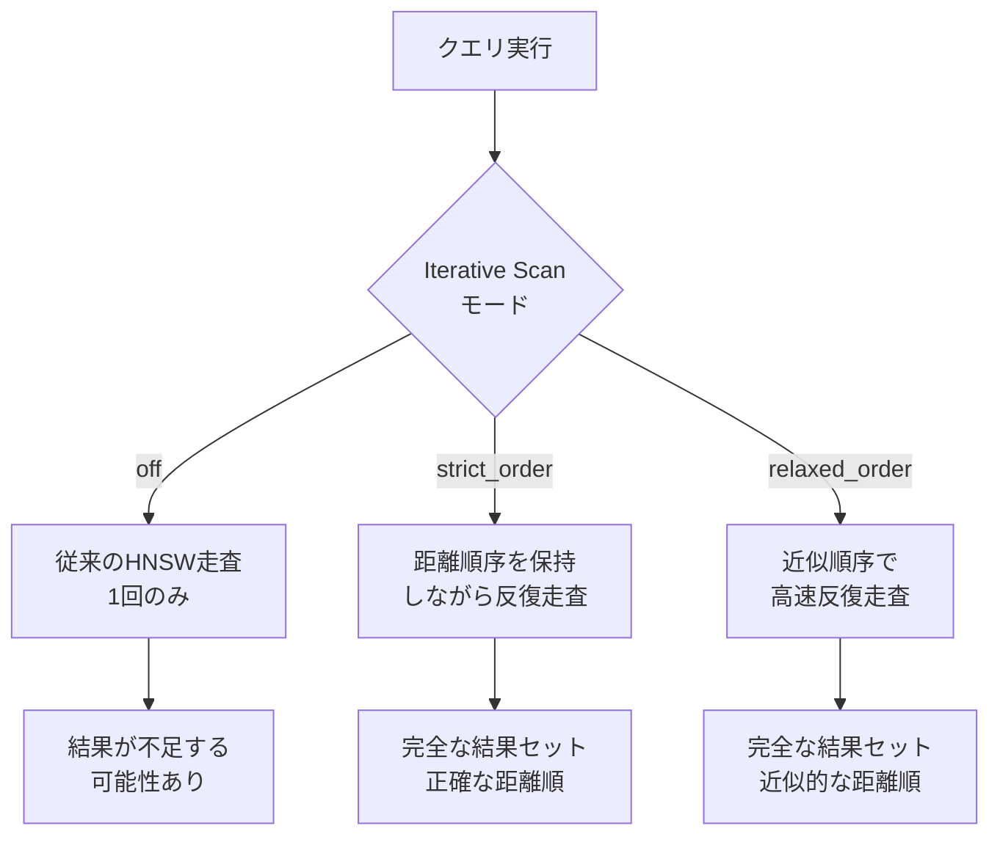

本記事は [AWS Database Blog: Supercharging vector search performance and relevance with pgvector 0.8.0 on Amazon Aurora PostgreSQL](https://aws.amazon.com/blogs/database/supercharging-vector-search-performance-and-relevance-with-pgvector-0-8-0-on-amazon-aurora-postgresql/) の解説記事です。

## ブログ概要（Summary）

AWSは2026年にpgvector 0.8.0をAurora PostgreSQLで提供開始した。このバージョンでは**Iterative Scan**機能が導入され、HNSWインデックスを使用したフィルタ付きベクトル検索の結果完全性（Recall）が最大100倍改善されている。10Mベクトル規模のベンチマークでは、特定クエリパターンでp99レイテンシが最大**9.4倍高速化**し、コスト推定の精度向上により実行計画の最適化も実現している。Mem0のようなメモリシステムがpgvectorをバックエンドとして使用する際、この改善は検索精度と性能に直結する。

この記事は [Zenn記事: Mem0×pgvectorでセッション横断の長期記憶を持つCSエージェントを構築する](https://zenn.dev/0h_n0/articles/763bb6a7397e5c) の深掘りです。

## 情報源

- **種別**: 企業テックブログ
- **URL**: [AWS Database Blog](https://aws.amazon.com/blogs/database/supercharging-vector-search-performance-and-relevance-with-pgvector-0-8-0-on-amazon-aurora-postgresql/)
- **組織**: Amazon Web Services
- **発表日**: 2026年

## 技術的背景（Technical Background）

pgvectorはPostgreSQLにベクトル類似度検索を追加するオープンソース拡張であり、HNSWインデックスによる近似最近傍探索（ANN）を実装している。バージョン0.7.x以前では、HNSWインデックスと`WHERE`句によるフィルタリングを組み合わせた場合、インデックスが返す候補セットがフィルタ条件で大幅に削減され、最終的な結果件数が要求より少なくなる問題があった。

この問題はMem0のようなメモリシステムでは致命的である。例えば、`user_id`でフィルタしてメモリを検索する際、HNSWが返す候補のうち該当ユーザーのメモリが少数の場合、関連するメモリが欠落する。Zenn記事で解説されている`memory.search(query, filters={"user_id": ...})`パターンは、まさにこのフィルタ付きANN検索に該当する。

## 実装アーキテクチャ（Architecture）

### Iterative Scan: フィルタ付きANN検索の根本解決

pgvector 0.8.0の最大の技術革新は**Iterative Scan**機能である。従来のHNSW検索が一度の走査で候補を返していたのに対し、Iterative Scanは要求された結果件数に達するまでインデックスの走査を繰り返す。



3つのモードが提供されている:

| モード | 動作 | 用途 |
|-------|------|------|
| `off` | 従来動作（デフォルト） | フィルタなしクエリ |
| `strict_order` | 距離順序を保持して反復 | 精度重視のフィルタ付き検索 |
| `relaxed_order` | 近似順序で高速反復 | 性能重視のフィルタ付き検索 |

### ベンチマーク結果の詳細分析

AWSは10M件の商品データセットで5種類のクエリパターンを評価している。

**p99レイテンシ比較** (ブログのベンチマーク表より):

| クエリタイプ | 0.7.4 baseline | 0.7.4 (ef=200) | 0.8.0最適構成 | 改善倍率 |
|------------|---------------|---------------|-------------|---------|
| A (top 10) | 123.3 ms | 394.1 ms | **13.1 ms** | 9.4x |
| B (top 1,000) | 104.2 ms | 341.4 ms | **83.5 ms** | 1.25x |
| C (フィルタ付き) | 128.5 ms | 333.4 ms | **85.7 ms** | 1.5x |
| D (複合フィルタ) | 127.4 ms | 318.6 ms | **70.7 ms** | 1.8x |
| E (10k結果) | 913.4 ms | 427.4 ms | **160.3 ms** | 5.7x |

**結果完全性（Recall）の改善** (ブログの表より):

| シナリオ | 0.7.4 baseline | 0.7.4 (ef=200) | 0.8.0 |
|---------|---------------|---------------|-------|
| カテゴリフィルタ | 10% | 0% | **100%** |
| 複合フィルタ | 1% | 0% | **100%** |
| 大規模結果セット | 5% | 5% | **100%** |

注目すべきは、0.7.4で`ef_search`を200に上げても結果完全性が改善しない（むしろ悪化する）ケースがある点である。これはHNSWの探索範囲を広げても、フィルタ条件に合致する候補が見つからないという構造的問題に起因しており、Iterative Scanによる根本解決が必要だったことを示している。

### コスト推定の改善

pgvector 0.8.0では、PostgreSQLクエリプランナーに渡すコスト推定値がより現実的になっている。ブログの例では、フィルタ付きクエリのコスト推定が以下のように変化している:

- **0.7.4**: 116.84 コスト単位（過小評価 → 非効率な実行計画）
- **0.8.0**: 7,224.63 コスト単位（適切な推定 → 最適な実行計画）

この改善により、プランナーがHNSWインデックスとシーケンシャルスキャンの使い分けをより適切に判断できるようになっている。

### HNSWインデックスの設定パラメータ

```sql
-- インデックス作成（構築時パラメータ）
CREATE INDEX idx_memories ON memories
USING hnsw (embedding vector_cosine_ops)
WITH (ef_construction = 128, m = 16);

-- 検索時パラメータ
SET hnsw.iterative_scan = 'relaxed_order';
SET hnsw.ef_search = 100;
SET hnsw.max_scan_tuples = 20000;
SET hnsw.scan_mem_multiplier = 1;
```

| パラメータ | デフォルト値 | 推奨値 | 効果 |
|-----------|-----------|-------|------|
| `ef_construction` | 64 | 128 | 構築精度↑、構築時間↑ |
| `m` | 16 | 16 | ノード接続数。メモリとのトレードオフ |
| `ef_search` | 40 | 100-200 | 検索精度↑、レイテンシ↑ |
| `max_scan_tuples` | 20,000 | 用途依存 | Iterative Scanの最大走査数 |
| `scan_mem_multiplier` | 1 | 1-2 | work_memに対するメモリ倍率 |

## Production Deployment Guide

### AWS実装パターン（コスト最適化重視）

**トラフィック量別の推奨構成**:

| 規模 | 月間リクエスト | 推奨構成 | 月額コスト | 主要サービス |
|------|--------------|---------|-----------|------------|
| **Small** | ~3,000 (100/日) | Serverless | $80-200 | Lambda + Aurora Serverless v2 (pgvector) |
| **Medium** | ~30,000 (1,000/日) | Hybrid | $400-1,000 | ECS Fargate + Aurora Provisioned |
| **Large** | 300,000+ (10,000/日) | Container | $2,500-6,000 | EKS + Aurora Multi-AZ + ElastiCache |

**Small構成の詳細** (月額$80-200):
- **Aurora Serverless v2**: 0.5-2 ACU, pgvector 0.8.0有効 ($50-100/月)
- **Lambda**: メモリ検索API ($20/月)
- **CloudWatch**: 基本監視 ($10/月)

**コスト試算の注意事項**: 上記は2026年7月時点のAWS ap-northeast-1（東京）リージョン料金に基づく概算値です。最新料金は [AWS料金計算ツール](https://calculator.aws/) で確認してください。

### Terraformインフラコード

```hcl
module "vpc" {
  source  = "terraform-aws-modules/vpc/aws"
  version = "~> 5.0"

  name = "pgvector-vpc"
  cidr = "10.0.0.0/16"
  azs  = ["ap-northeast-1a", "ap-northeast-1c"]
  private_subnets  = ["10.0.1.0/24", "10.0.2.0/24"]
  database_subnets = ["10.0.3.0/24", "10.0.4.0/24"]

  enable_nat_gateway   = false
  enable_dns_hostnames = true
  create_database_subnet_group = true
}

resource "aws_rds_cluster" "pgvector" {
  cluster_identifier = "mem0-pgvector-cluster"
  engine             = "aurora-postgresql"
  engine_version     = "16.4"
  engine_mode        = "provisioned"

  database_name   = "mem0_memories"
  master_username = "mem0user"
  master_password = var.db_password

  db_subnet_group_name   = module.vpc.database_subnet_group_name
  vpc_security_group_ids = [aws_security_group.aurora.id]

  storage_encrypted = true

  serverlessv2_scaling_configuration {
    min_capacity = 0.5
    max_capacity = 4.0
  }
}

resource "aws_rds_cluster_instance" "pgvector" {
  cluster_identifier = aws_rds_cluster.pgvector.id
  instance_class     = "db.serverless"
  engine             = aws_rds_cluster.pgvector.engine
  engine_version     = aws_rds_cluster.pgvector.engine_version
}
```

### 運用・監視設定

```sql
-- CloudWatch Logs Insights: HNSWインデックス性能監視
-- フィルタ付き検索のレイテンシ分布
SELECT query, calls, mean_exec_time, stddev_exec_time
FROM pg_stat_statements
WHERE query LIKE '%ORDER BY embedding%'
ORDER BY mean_exec_time DESC
LIMIT 20;
```

### コスト最適化チェックリスト

- [ ] Aurora Serverless v2: ACU自動スケーリングで夜間コスト削減
- [ ] pgvector 0.8.0: Iterative Scan有効化で検索品質確保
- [ ] HNSWパラメータ: ワークロードに応じた`ef_search`調整
- [ ] Reserved Instances: Aurora 1年コミットで最大40%削減
- [ ] Performance Insights: スロークエリの特定と最適化
- [ ] pg_stat_statements: クエリパフォーマンスの継続監視
- [ ] Graviton4インスタンス: R8g系でコスト効率20%向上
- [ ] バックアップ保持期間: 最小限に設定（開発環境は1日）
- [ ] CloudWatch アラーム: ACU使用率とレイテンシの監視
- [ ] AWS Budgets: データベースコストの月額上限設定

## パフォーマンス最適化（Performance）

### Mem0 + pgvector 0.8.0の実践的チューニング

Mem0のメモリ検索でpgvector 0.8.0の恩恵を最大化するには、以下の設定が重要である:

```sql
-- Mem0のフィルタ付き検索に最適な設定
SET hnsw.iterative_scan = 'relaxed_order';
SET hnsw.ef_search = 100;

-- user_idフィルタ付き検索の例
SELECT memory, 1 - (embedding <=> $1) AS similarity
FROM cs_agent_memories
WHERE user_id = $2
ORDER BY embedding <=> $1
LIMIT 6;
```

pgvector 0.8.0以前では、`user_id`フィルタによりHNSW候補が大幅に削減され、関連メモリが欠落するリスクがあった。Iterative Scanの導入により、フィルタ後の結果が要求件数に達するまで走査が継続されるため、この問題が解消される。

### スケーリングの閾値

ブログの実測値とZenn記事の知見を統合すると、以下のスケーリング指針が得られる:

- **~500万ベクトル**: pgvector HNSW（デフォルト設定で十分実用的）
- **500万-5000万ベクトル**: pgvectorscale StreamingDiskANN推奨
- **5000万超**: 分散アーキテクチャ（Qdrant, Milvus等）検討

## 運用での学び（Production Lessons）

### ef_searchの罠

Zenn記事でも指摘されているように、`ef_search`を400以上に設定すると、PostgreSQLオプティマイザがシーケンシャルスキャンに切り替え、レイテンシが2.5msから365msに跳ね上がるケースがある。pgvector 0.8.0のコスト推定改善により、この問題は軽減されているが、`EXPLAIN ANALYZE`による定期的な実行計画の検証が推奨される。

### 対応Auroraバージョン

pgvector 0.8.0はAurora PostgreSQL 17.4, 16.8, 15.12, 14.17, 13.20以上で利用可能である。テスト環境にはdb.r8g.4xlarge（Graviton4プロセッサ搭載）が使用されている。

## 学術研究との関連（Academic Connection）

pgvectorのHNSWインデックスは、Malkov & Yashunin (2016) の "Efficient and robust approximate nearest neighbor search using Hierarchical Navigable Small World graphs" に基づいている。Iterative Scanは、フィルタ付きANN検索の研究（Filtered-DiskANN等）から着想を得た実装であり、学術研究のプロダクション適用例として注目に値する。

## まとめと実践への示唆

pgvector 0.8.0のIterative Scanは、Mem0のようなフィルタ付きベクトル検索を多用するシステムにとって重要なアップグレードである。特に`user_id`ベースのメモリ検索において、結果完全性が10%→100%に改善される効果は大きい。Aurora PostgreSQLユーザーは、既存環境のpgvectorバージョンを確認し、0.8.0へのアップグレードを検討すべきである。

## 参考文献

- **Blog URL**: [AWS Database Blog - pgvector 0.8.0](https://aws.amazon.com/blogs/database/supercharging-vector-search-performance-and-relevance-with-pgvector-0-8-0-on-amazon-aurora-postgresql/)
- **Related Papers**: Malkov & Yashunin, "Efficient and Robust Approximate Nearest Neighbor Search Using Hierarchical Navigable Small World Graphs" (2016)
- **Related Zenn article**: [https://zenn.dev/0h_n0/articles/763bb6a7397e5c](https://zenn.dev/0h_n0/articles/763bb6a7397e5c)
