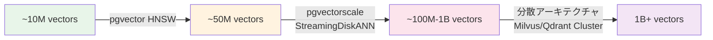

本記事は [EFFOMA Blog: Vector Databases in 2026: A Systematic Performance Analysis of Indexing Architectures, Quantization Methods, and Production-Scale Retrieval](https://effoma.com/blog/vector-database-performance-benchmark-comparison-2026/) の解説記事です。

## ブログ概要（Summary）

EFFOMAが2026年Q1-Q2に実施したベクトルデータベースの体系的性能比較レポートである。Qdrant、Redis、Milvus、Pinecone、ChromaDB、Weaviate、Elasticsearch、pgvector、Supabase (pgvector)、MongoDB Atlasの10系統を、1M/10M/100Mベクトル規模でレイテンシ・スループット・コスト・リコールの4軸で評価している。pgvector + pgvectorscaleの組み合わせは、50Mベクトル規模で**471 QPS・99%リコール**を達成し、Pinecone s1比で**28倍低レイテンシ・75%低コスト**と報告されている。

この記事は [Zenn記事: Mem0×pgvectorでセッション横断の長期記憶を持つCSエージェントを構築する](https://zenn.dev/0h_n0/articles/763bb6a7397e5c) の深掘りです。

## 情報源

- **種別**: テックブログ（ベンチマークレポート）
- **URL**: [EFFOMA Blog](https://effoma.com/blog/vector-database-performance-benchmark-comparison-2026/)
- **組織**: EFFOMA
- **発表日**: 2026年（Q1-Q2データ）

## 技術的背景（Technical Background）

ベクトルデータベースの選択は、Mem0のようなLLMメモリシステムの検索性能とコストに直結する。Zenn記事で解説されているpgvectorは「既存PostgreSQLインフラの流用」が利点だが、専用ベクトルDB（Qdrant、Pinecone等）と比較した際の性能差は実務上の重要な判断材料である。本ベンチマークは、実データに基づくファクトとして意思決定を支援する。

## 実装アーキテクチャ（Architecture）

### ベンチマーク環境

- **ベクトル次元**: 1536次元（OpenAI text-embedding-3-small相当）
- **データ規模**: 1M / 10M / 100Mベクトル
- **データセット**: Cohereエンベディング（50Mベクトルベンチマーク用）
- **インフラ**: AWS EC2（セルフホスト比較）
- **計測元**: Salt Technologies Q1 2026、Qdrantオープンソースベンチマーク、Timescale 2026年4月ベンチマーク

### 1Mベクトル規模のレイテンシ比較

ブログのベンチマーク表より、1Mベクトル・1536次元での結果は以下の通りである:

| システム | p50レイテンシ | p99レイテンシ | Recall@10 |
|---------|-------------|-------------|-----------|
| Qdrant OSS | 4ms | 25ms | 0.99 |
| Redis (vector) | 5ms | 20ms | 0.97 |
| Milvus OSS | 6ms | 35ms | 0.99 |
| Pinecone Serverless | 8ms | 45ms | 0.99 |
| ChromaDB | 12ms | 70ms | 0.98 |
| Weaviate OSS | 12ms | 65ms | 0.98 |
| Elasticsearch | 15ms | 75ms | 0.97 |
| **pgvector 0.8** | **18ms** | **90ms** | **0.99** |
| Supabase (pgvector) | 20ms | 95ms | 0.98 |
| MongoDB Atlas | 22ms | 110ms | 0.96 |

pgvector 0.8は1Mベクトル規模ではp99レイテンシ90msであり、Qdrant OSS（25ms）やPinecone Serverless（45ms）と比較して遅い。ただし、Recall@10は0.99と他の上位システムと同等であり、検索精度自体は遜色ない。

### pgvectorscale StreamingDiskANNの性能

pgvector単体の性能上限を拡張するのが、Timescaleが開発する**pgvectorscale**拡張である。StreamingDiskANNインデックスにより、インメモリHNSWの限界を超えた大規模ベクトル検索が可能になる。

ブログが引用するTimescale 2026年4月ベンチマーク（50M Cohereエンベディング、768次元）の結果:

| 指標 | pgvectorscale | Pinecone s1 |
|------|-------------|------------|
| QPS (99%リコール) | **471** | 471 |
| p95レイテンシ | **28ms** | 784ms |
| レイテンシ比 | 1x | **28x遅い** |
| スループット比 | **16x** | 1x |
| コスト（セルフホスト vs マネージド） | **75%安い** | baseline |

### スケーリングの閾値

ブログは3つのアーキテクチャ閾値を特定している:

| スケール | 推奨技術 | 備考 |
|---------|---------|------|
| ~10M | pgvector HNSW | シングルノードで十分 |
| 10M-50M | pgvectorscale StreamingDiskANN | p95 50ms以下を維持 |
| 100M-1B | 分散アーキテクチャ必須 | Qdrant/Milvusクラスタ |
| 1B+ | Milvus/Zillizのみ | アーキテクチャ的に対応 |

### コスト比較

ブログの2026年3-4月検証データに基づくコスト比較:

| ベクトル数 | pgvector (セルフホスト) | Qdrant OSS | Qdrant Cloud | Pinecone Serverless |
|-----------|----------------------|-----------|-------------|-------------------|
| 1M | ~$15/月 | ~$25/月 | ~$57/月 | ~$25/月 |
| 10M | ~$45/月 | ~$80/月 | ~$456/月 | ~$70-200/月 |
| 100M | ~$200/月 | ~$350/月 | ~$1,824/月 | ~$700+/月 |

ブログはLeanOps Researchの調査を引用し、「価格ページの見積もりと実際の月額請求のギャップは平均2.5〜4倍」と報告している。マネージドサービスでは、バースト使用量やネットワーク転送量により、公表料金を大幅に上回るコストが発生する可能性がある。

## パフォーマンス最適化（Performance）

### pgvector vs 専用ベクトルDBの選定基準

Mem0のバックエンドとしてpgvectorを採用する判断は、以下の条件で合理的である:

1. **ベクトル数が500万以下**: HNSWインデックスがシングルディジットmsのレイテンシを実現
2. **既存PostgreSQL環境がある**: 追加インフラコストゼロ
3. **リレーショナルデータとの結合が必要**: `user_id`フィルタやメタデータクエリをSQLで統合
4. **運用チームがPostgreSQLに精通**: 既存の監視・バックアップ・HA構成を流用

一方、以下の条件では専用ベクトルDBの検討が必要:

1. **ベクトル数が1000万を超える**: pgvectorscaleまたは分散DBへの移行
2. **p99レイテンシ20ms以下が必要**: Qdrant OSS（25ms）やRedis（20ms）を検討
3. **マルチテナントのスケーリング**: 専用DBのネームスペース機能が有利

### GPU加速の動向

ブログによると、Kioxiaが**NVIDIAHopper GPU**を使用してインデックス構築を20倍高速化する事例を報告している。48億ベクトルのインデックス構築が28.4日から1.4日に短縮されたとのことである。これは大規模コレクションの再構築が必要な場合（エンベディングモデルの変更時など）に有用である。

## 運用での学び（Production Lessons）

### コスト見積もりの落とし穴

ベンチマークレポートで最も実務的に重要な知見は、マネージドサービスの実コストが公表価格の2.5-4倍になりうるという点である。Mem0のようなメモリシステムでは、書き込み（メモリ追加）と読み取り（メモリ検索）が頻繁に発生するため、トランザクション課金やネットワーク転送量の影響が大きい。

セルフホストpgvectorは、PostgreSQLの運用コスト（EC2/RDS + ストレージ）のみで済むため、コスト予測が比較的容易である。

### 量子化による追加コスト削減

pgvectorscaleは**Statistical Binary Quantization (SBQ)**を実装しており、メモリ使用量を大幅に削減できる。ベクトルをバイナリ表現に圧縮することで、ストレージコストとメモリフットプリントの両方を最適化する。

## 学術研究との関連（Academic Connection）

pgvectorscaleのStreamingDiskANNは、Microsoft Researchが提案したDiskANNアルゴリズム（Subramanya et al., NeurIPS 2019）に基づいている。DiskANNはVamanaグラフをSSD上に構築し、インメモリインデックスの容量制限を克服する。pgvectorscaleはこれをPostgreSQL拡張として実装し、既存のpgvectorエコシステムとシームレスに統合している。

HNSWインデックスはMalkov & Yashunin (2016)の提案であり、pgvectorのデフォルトANNインデックスとして広く使用されている。1M-10Mベクトル規模ではHNSWが最適だが、それ以上のスケールではStreamingDiskANNの優位性が明確になる。

## まとめと実践への示唆

本ベンチマークレポートは、pgvectorがMem0のバックエンドとして「500万ベクトル以下・既存PostgreSQL環境あり」の条件下で最もコスト効率の高い選択肢であることを裏付けている。500万-5000万ベクトル規模ではpgvectorscale StreamingDiskANNへの移行により、Pinecone比28倍低レイテンシ・75%低コストが実現可能である。ベクトルDB選定は、ベクトル数・レイテンシ要件・既存インフラ・運用チームのスキルセットを総合的に判断すべきである。

## 参考文献

- **Blog URL**: [EFFOMA - Vector Databases in 2026](https://effoma.com/blog/vector-database-performance-benchmark-comparison-2026/)
- **Related Papers**: Subramanya et al., "DiskANN: Fast Accurate Billion-point Nearest Neighbor Search on a Single Node" (NeurIPS 2019)
- **Related Zenn article**: [https://zenn.dev/0h_n0/articles/763bb6a7397e5c](https://zenn.dev/0h_n0/articles/763bb6a7397e5c)
