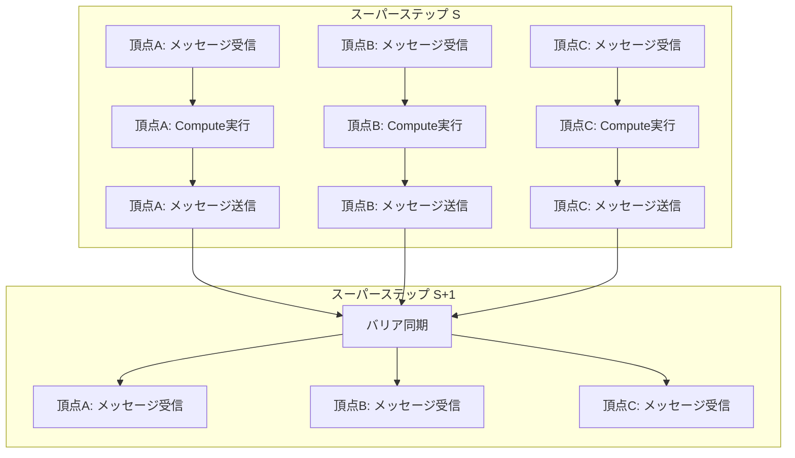

## 論文概要

本記事は、Googleが2010年にSIGMOD国際会議で発表した論文「Pregel: A System for Large-Scale Graph Processing」の解説記事です。Pregelは、Bulk Synchronous Parallel（BSP）モデルに基づく大規模グラフ処理システムであり、頂点中心（vertex-centric）のプログラミングモデルとメッセージパッシングによる通信を特徴とする。著者らは、10億頂点・1270億辺を超えるグラフに対して最短経路計算を約10分で完了できることを報告している。本システムの設計思想は、LLMエージェントフレームワークであるLangGraphの実行モデル（Pregelランタイム）に直接的な影響を与えている。

この記事は [Zenn記事: LangGraph Pregel実行モデルで理解するステートマシン設計原則](https://zenn.dev/0h_n0/articles/7cfcf58c6bcf9a) の深掘りです。

## 情報源

| 項目 | 内容 |
|------|------|
| **論文タイトル** | Pregel: A System for Large-Scale Graph Processing |
| **著者** | Grzegorz Malewicz, Matthew H. Austern, Aart J.C. Bik, James C. Dehnert, Ilan Horn, Naty Leiser, Grzegorz Czajkowski（Google） |
| **会議名** | ACM SIGMOD International Conference on Management of Data 2010 |
| **発表形式** | フルペーパー（査読付き） |
| **URL** | [https://dl.acm.org/doi/10.1145/1807167.1807184](https://dl.acm.org/doi/10.1145/1807167.1807184) |

## カンファレンス情報: SIGMOD

ACM SIGMOD（Special Interest Group on Management of Data）は、データベースおよびデータ管理分野における最高峰の国際会議の一つである。1975年の第1回開催以降、データベースシステム、クエリ処理、トランザクション管理、分散データ処理など幅広いテーマを扱ってきた。SIGMOD 2010はインディアナポリスで開催され、Pregel論文はこの会議で発表された。採択率は例年20%前後であり、厳格な査読プロセスを経て選出された論文が掲載される。Pregelの発表は、MapReduce以降のGoogleの大規模データ処理基盤に関する重要な公開情報として広く注目を集めた。

## 技術的詳細

### Bulk Synchronous Parallel（BSP）モデル

Pregelの計算モデルはLeslie Valiantが1990年に提唱したBSPモデルに基づいている。BSPモデルでは、計算が一連の**スーパーステップ（superstep）**として進行する。各スーパーステップは以下の3つのフェーズで構成される。

1. **ローカル計算フェーズ**: 各プロセッサが自身のローカルデータに対して計算を実行する
2. **通信フェーズ**: プロセッサ間でメッセージを交換する
3. **バリア同期フェーズ**: 全プロセッサが現在のスーパーステップを完了するまで待機する

Pregelでは、このBSPモデルをグラフ処理に特化させている。スーパーステップ $S$ において、各頂点 $v$ は以下の処理を行う。

- スーパーステップ $S-1$ で送信されたメッセージを受信する
- ユーザ定義の `Compute` 関数を実行する
- 他の頂点に向けてメッセージを送信する（送信されたメッセージはスーパーステップ $S+1$ で配信される）

この同期的な実行モデルにより、プログラマはデッドロックやデータ競合を意識する必要がなくなる。著者らは論文中で、BSPモデルの同期性が「計算の再現性（reproducibility）」を保証すると述べている。



### 頂点中心プログラミングモデル

Pregelの最大の特徴は、**頂点中心（vertex-centric）**のプログラミングモデルである。プログラマはグラフ全体のアルゴリズムではなく、「1つの頂点がどう振る舞うか」を記述する。著者らはこれを "Think like a vertex" と表現している。

各頂点は以下の4つの操作を実行できる。

1. 前のスーパーステップで受信したメッセージの読み取り
2. 自身の値および出辺の値の変更
3. 他の頂点へのメッセージ送信
4. グラフトポロジーの変更（頂点・辺の追加/削除）

### 投票による停止（Vote to Halt）

Pregelでは、各頂点は**アクティブ**または**非アクティブ**の状態を持つ。初期状態では全頂点がアクティブであり、頂点は自身の計算が完了したと判断した時点で `VoteToHalt()` を呼び出して非アクティブ状態に遷移する。非アクティブな頂点がメッセージを受信すると再びアクティブ化される。全頂点が非アクティブであり、かつ配信待ちのメッセージが存在しない場合、アルゴリズム全体が終了する。

この停止条件を形式的に表現すると、スーパーステップ $S$ の終了時に以下の条件を満たすとき計算が停止する。

$$
\forall v \in V: \text{state}(v) = \text{inactive} \quad \wedge \quad \sum_{v \in V} |\text{inbox}_{S+1}(v)| = 0
$$

ここで $V$ はグラフの全頂点集合、$\text{state}(v)$ は頂点 $v$ の状態、$\text{inbox}_{S+1}(v)$ はスーパーステップ $S+1$ で配信予定の頂点 $v$ 宛メッセージ集合である。

## アルゴリズム: 頂点中心計算の擬似コード

論文で示されている代表的なアルゴリズムとして、単一始点最短経路（Single Source Shortest Path: SSSP）がある。以下に著者らが示したCompute関数の構造をPythonで再現する。

```python
from typing import Any
from dataclasses import dataclass, field


@dataclass
class Vertex:
    """Pregelの頂点を表現するクラス。

    Attributes:
        vertex_id: 頂点の一意識別子
        value: 頂点に格納される値（SSSPでは始点からの最短距離）
        edges: 出辺のリスト（隣接頂点IDと辺の重み）
        active: 頂点がアクティブかどうか
        incoming_messages: 受信メッセージのリスト
    """

    vertex_id: int
    value: float = float("inf")
    edges: list[tuple[int, float]] = field(default_factory=list)
    active: bool = True
    incoming_messages: list[float] = field(default_factory=list)

    def get_value(self) -> float:
        """頂点の現在値を返す。"""
        return self.value

    def mutable_value(self, new_value: float) -> None:
        """頂点の値を更新する。"""
        self.value = new_value

    def vote_to_halt(self) -> None:
        """非アクティブ状態に遷移する。"""
        self.active = False

    def send_message_to(self, target_id: int, message: float) -> None:
        """指定した頂点にメッセージを送信する。

        Args:
            target_id: 送信先の頂点ID
            message: 送信するメッセージ（SSSPでは距離値）
        """
        # 実際のPregelでは分散メッセージキューに格納
        pass

    def get_out_edges(self) -> list[tuple[int, float]]:
        """出辺のリストを返す。"""
        return self.edges


def sssp_compute(vertex: Vertex, messages: list[float]) -> None:
    """単一始点最短経路のCompute関数。

    論文Section 3.2で示されたSSSPアルゴリズムに基づく。
    各スーパーステップで受信したメッセージの最小値が現在値より
    小さければ値を更新し、隣接頂点に新しい距離を伝播する。

    Args:
        vertex: 処理対象の頂点
        messages: 前のスーパーステップで受信したメッセージ群
    """
    min_dist: float = min(messages) if messages else float("inf")

    if min_dist < vertex.get_value():
        vertex.mutable_value(min_dist)
        for target_id, edge_weight in vertex.get_out_edges():
            vertex.send_message_to(target_id, min_dist + edge_weight)

    vertex.vote_to_halt()
```

このアルゴリズムの計算量を考える。グラフの頂点数を $|V|$、辺数を $|E|$ とすると、最悪ケースでのスーパーステップ数はグラフの直径 $D$ に依存する。各スーパーステップでは最大 $|E|$ 本のメッセージが送信されるため、全体の通信量は $O(D \cdot |E|)$ となる。ただし、実際のグラフでは早期に収束するケースが多く、論文の実験でもスケーラビリティが確認されている。

### PageRankの頂点中心実装

著者らは論文中でPageRankの頂点中心実装も示している。PageRankでは、各頂点のランク値 $R(v)$ を以下の式で更新する。

$$
R(v) = \frac{0.15}{|V|} + 0.85 \sum_{u \in \text{In}(v)} \frac{R(u)}{|\text{Out}(u)|}
$$

ここで $|V|$ は総頂点数、$\text{In}(v)$ は頂点 $v$ への入辺を持つ頂点集合、$\text{Out}(u)$ は頂点 $u$ からの出辺を持つ頂点集合である。Pregelでは、各頂点が自身のランク値を出辺の数で割った値をメッセージとして隣接頂点に送信し、受信側が上記の式に基づいて自身のランクを更新する。固定回数（論文では30回）のスーパーステップで収束させる方式を採用している。

## 実装のポイント

### メッセージパッシング

著者らは論文中で「message passing is sufficiently expressive that there is no need for remote reads」と明言しており、リモート読み取り（remote read）をサポートしない設計判断を下している。この設計により、以下のメリットが得られる。

- **非同期バッチ配信**: メッセージは非同期にバッチ配信され、個別のリモート読み取りに伴うレイテンシを償却できる
- **データ局所性**: 各頂点の状態はローカルに保持され、一貫性管理が単純化される
- **Combinerとの親和性**: メッセージの集約操作が自然に導入できる

### Combiner

実用的なグラフアルゴリズムでは、同一の宛先頂点に対して複数のメッセージが送信されることが頻繁に発生する。Combinerは、これらのメッセージをネットワーク転送前に1つの値にマージする機構である。著者らは、Combinerが有効なのは対象の集約操作が**可換律（commutativity）**と**結合律（associativity）**を満たす場合に限定されると述べている。

例えば、SSSPにおけるCombinerは `min` 操作であり、同一頂点宛の距離メッセージの最小値のみを転送すれば十分である。これにより、ネットワーク帯域の使用量を大幅に削減できる。

```python
from typing import Callable


def combine_messages(
    messages: list[float],
    combiner_fn: Callable[[float, float], float],
) -> float:
    """Combinerによるメッセージ集約を模倣する関数。

    Pregelでは、同一宛先への複数メッセージを転送前にマージする。
    combiner_fnは可換・結合を満たす二項演算でなければならない。

    Args:
        messages: 同一宛先への複数メッセージ
        combiner_fn: 集約関数（例: min, sum）

    Returns:
        集約後の単一値

    Raises:
        ValueError: メッセージリストが空の場合
    """
    if not messages:
        raise ValueError("メッセージリストが空です")

    result: float = messages[0]
    for msg in messages[1:]:
        result = combiner_fn(result, msg)
    return result


# SSSPのCombiner: min操作
sssp_combined: float = combine_messages([3.0, 1.5, 7.2], min)
# sssp_combined == 1.5

# PageRankのCombiner: sum操作
pagerank_combined: float = combine_messages([0.1, 0.25, 0.05], lambda a, b: a + b)
# pagerank_combined == 0.4
```

### Aggregator

AggregatorはPregelにおけるグローバル情報交換の機構である。通常のメッセージパッシングが頂点間の点対点通信であるのに対し、Aggregatorは全頂点にわたるグローバルな統計量の計算を可能にする。

動作の流れは以下の通りである。

1. スーパーステップ $S$ で各頂点がAggregatorに値を提供する
2. 提供された値がユーザ定義の削減関数（reduction function）で集約される
3. 集約結果がスーパーステップ $S+1$ で全頂点から参照可能になる

著者らは具体的なユースケースとして、全頂点のPageRank値の合計を監視して収束判定に利用する例を挙げている。Aggregatorにより、各頂点が「グラフ全体の状態」を参照した条件分岐が可能になる。

### トポロジー変更

Pregelではスーパーステップ中にグラフ構造自体の変更（頂点・辺の追加/削除）を要求できる。著者らは、変更要求間の競合を解決するため、以下の適用順序を定めている。

1. **辺の削除**
2. **頂点の削除**
3. **頂点の追加**
4. **辺の追加**

この順序により、削除対象の頂点に新たな辺が追加されるような矛盾を回避している。同一要素に対する競合する変更要求が発生した場合は、ユーザ定義のコンフリクトハンドラで解決する。

### フォールトトレランス

大規模クラスタでの長時間実行では、個々のマシンの障害が無視できない確率で発生する。Pregelのフォールトトレランスは**チェックポインティング**に基づいている。著者らは論文中で以下のように述べている。

> "At the beginning of a superstep, the master instructs the workers to save the state of their partitions to persistent storage."

チェックポインティングでは、スーパーステップの開始時にマスターがワーカーに指示し、各パーティションの状態（頂点値、辺、受信メッセージ）を永続ストレージに保存する。障害が検知された場合、最後のチェックポイントから計算を再開する。障害検知はマスターとワーカー間の**ハートビート**により行われ、応答が途絶えたワーカーは障害と判定される。

チェックポインティングの頻度はオーバーヘッドと復旧時間のトレードオフであり、著者らは「confined recovery」として障害の影響範囲を限定する最適化手法にも言及している。

## 実験結果

### 大規模グラフでのSSSP性能

著者らは、最大で**10億頂点・1270億辺**を超える二分木グラフに対して単一始点最短経路（SSSP）を実行した結果を報告している。実験環境は**300マシン・800ワーカータスク**のクラスタであり、最大規模のグラフでSSSPの計算が**約10分**で完了したとされている（論文Section 6, Figure 6より）。

### スケーラビリティ

論文のFigure 4では、ワーカー数を変化させた際のスケーラビリティが示されている。10億頂点のグラフに対して、ワーカー数を50から800まで増加させると、実行時間がほぼ線形に短縮されることが確認されている。著者らは、この線形スケーラビリティがBSPモデルの同期的な実行と適切なグラフ分割によるものであると分析している。

グラフの分割にはデフォルトで以下のハッシュベースの方式が使用される。

$$
\text{partition}(v) = \text{hash}(\text{id}(v)) \bmod N
$$

ここで $N$ はパーティション数である。このデフォルト方式はシンプルだが、グラフのトポロジーを考慮しないため、通信コストが高くなる場合がある。著者らはカスタム分割関数の利用も可能であると述べているが、具体的な代替手法の性能比較は本論文では行われていない。

### PageRankの実行性能

論文Section 6ではPageRankの実験結果も報告されている。10億頂点のグラフに対する30回のイテレーション（スーパーステップ）を複数のワーカー構成で実行し、ワーカー数の増加に伴う実行時間の短縮が確認されている。各スーパーステップの計算は独立性が高いため、BSPモデルのバリア同期によるオーバーヘッドは実行時間全体に対して小さいと報告されている。

## 実運用への応用: LangGraphのPregelランタイムとの接続

Pregelの設計思想は、LLMエージェントフレームワークであるLangGraphの実行モデルに直接的な影響を与えている。LangGraphのランタイムは「Pregel」と名付けられており、以下の対応関係がある。

| Pregelの概念 | LangGraphでの対応 |
|-------------|-------------------|
| 頂点（Vertex） | ノード（Node） |
| メッセージ | チャネル更新（Channel Update） |
| スーパーステップ | 実行ステップ |
| `Compute` 関数 | ノードの実行関数 |
| `VoteToHalt` | ノードの完了（出力辺なし） |
| チェックポイント | StateSnapshot |
| Aggregator | 共有State |

### スーパーステップ方式の継承

LangGraphでは、Pregelと同様にスーパーステップ単位でノードが実行される。各ステップで複数のノードが並列実行可能であり、ステップ間にはバリア同期が存在する。これにより、ステップ内のノード実行順序に依存しない決定論的な動作が保証される。

### チェックポインティングの継承

Pregelのチェックポインティング機構は、LangGraphの永続化機能に反映されている。LangGraphでは各スーパーステップ完了時にグラフの状態をチェックポインターに保存し、障害時や人間の介入（Human-in-the-Loop）時に任意の時点から実行を再開できる。これはPregelの「スーパーステップ開始時にワーカーが状態を永続ストレージに保存する」という設計を、シングルプロセスのエージェント実行環境に適応したものと解釈できる。

### メッセージパッシングからチャネルへ

Pregelの頂点間メッセージパッシングは、LangGraphではチャネル（Channel）という抽象化に置き換えられている。Pregelでは各メッセージが特定の宛先頂点に送信されるのに対し、LangGraphのチャネルは名前付きの共有状態として機能する。PregelのCombinerに相当するのがLangGraphのReducer関数であり、同一チャネルへの複数の書き込みをマージする。

```python
from typing import Annotated


def add_messages(
    existing: list[str],
    new: list[str],
) -> list[str]:
    """LangGraphにおけるReducer関数の例。

    PregelのCombinerに相当し、チャネルへの複数の書き込みを
    マージする。この例ではメッセージのリストを結合する。

    Args:
        existing: 既存のメッセージリスト
        new: 新たに追加されるメッセージリスト

    Returns:
        マージ後のメッセージリスト
    """
    return existing + new


# LangGraphの型アノテーションによるReducer定義
# Annotatedを使ってReducer関数を指定する
Messages = Annotated[list[str], add_messages]
```

### 設計思想の本質的な共通点

Pregelの設計思想とLangGraphの設計思想に共通する本質は、**状態の変更をメッセージ（またはチャネル更新）として明示的に表現し、バリア同期によって一貫性を保証する**という点にある。Pregelでは分散環境での一貫性保証としてこのモデルが採用されたが、LangGraphではエージェントの実行フローにおける再現性とデバッグ可能性のためにこのモデルが活用されている。目的は異なるが、同一の計算モデルが異なるドメインで有効であることを示す好例である。

## 関連研究

### MapReduce（Dean & Ghemawat, 2004）

MapReduceはGoogleが開発した大規模データ処理フレームワークであり、Pregelの前身とも言える存在である。しかし、著者らはMapReduceがグラフ処理には不向きであると指摘している。グラフアルゴリズムの多くは反復的な計算を必要とするが、MapReduceの各ジョブは独立したバッチ処理であり、イテレーション間の状態保持にはHDFSへの書き出しと読み込みが必要となる。Pregelはこの問題をインメモリでの状態保持とスーパーステップの連鎖によって解決している。

### Apache Giraph

Apache Giraphは、Pregelの設計思想をオープンソースとして実装したプロジェクトである。Hadoop上で動作し、PregelのBSPモデルと頂点中心プログラミングモデルを忠実に再現している。FacebookがソーシャルグラフのPageRank計算に使用したことで広く知られるようになった。Pregelとの主な違いは、GiraphがHadoopのインフラ（HDFS、YARN）上に構築されている点であり、Pregelの専用インフラとは異なるトレードオフを持つ。

### GraphX（Gonzalez et al., 2014）

GraphXはApache Spark上に構築されたグラフ処理フレームワークであり、OSDI 2014で発表された。PregelのBSPモデルを踏襲しつつ、SparkのRDD（Resilient Distributed Dataset）抽象化を活用してグラフ処理とデータ処理を統一的に扱える点が特徴である。GraphXは `Pregel` というAPIを直接提供しており、Pregelの頂点中心プログラミングモデルをSpark上で利用できる。Sparkのインメモリ処理基盤により、MapReduceベースのアプローチよりも高速な反復計算が可能である。

### GraphLab（Low et al., 2012）

GraphLabは非同期的なグラフ処理フレームワークであり、PregelのBSP（同期型）モデルとは対照的なアプローチを取る。GraphLabでは頂点の計算が非同期に実行され、バリア同期を排除することで収束速度の向上を目指している。ただし、非同期実行は決定論的な再現性を犠牲にする場合があり、この点でPregelの同期モデルとのトレードオフが存在する。

## まとめと今後の展望

Pregelは、大規模グラフ処理における頂点中心プログラミングモデルとBSPベースの実行モデルを確立した画期的なシステムである。著者らが示した設計原則、すなわちスーパーステップによる同期実行、メッセージパッシングによる通信、チェックポインティングによるフォールトトレランスは、発表から16年が経過した現在でも分散システム設計の基盤的な概念として参照されている。

特に注目すべきは、Pregelの設計思想がLLMエージェントフレームワークであるLangGraphに継承されている点である。分散グラフ処理のために設計された計算モデルが、エージェントのステートマシン実行という全く異なるドメインで有効に機能していることは、BSPモデルの抽象度の高さと汎用性を示している。

今後の展望として、LangGraphのようなエージェントフレームワークがさらに大規模化する中で、Pregelが解決した分散実行やフォールトトレランスの知見がより直接的に必要になる可能性がある。マルチエージェントシステムの実行基盤として、Pregelの知見を再訪する意義は大きいと考えられる。

## 参考文献

1. Malewicz, G., Austern, M.H., Bik, A.J.C., Dehnert, J.C., Horn, I., Leiser, N., & Czajkowski, G. (2010). Pregel: A System for Large-Scale Graph Processing. *Proceedings of the 2010 ACM SIGMOD International Conference on Management of Data*, 135-146. [https://dl.acm.org/doi/10.1145/1807167.1807184](https://dl.acm.org/doi/10.1145/1807167.1807184)
2. Valiant, L.G. (1990). A Bridging Model for Parallel Computation. *Communications of the ACM*, 33(8), 103-111.
3. Dean, J., & Ghemawat, S. (2004). MapReduce: Simplified Data Processing on Large Clusters. *OSDI 2004*, 137-150.
4. Gonzalez, J.E., Xin, R.S., Dave, A., Crankshaw, D., Franklin, M.J., & Stoica, I. (2014). GraphX: Graph Processing in a Distributed Dataflow Framework. *OSDI 2014*, 599-613.
5. Low, Y., Gonzalez, J., Kyrola, A., Bickson, D., Guestrin, C., & Hellerstein, J.M. (2012). Distributed GraphLab: A Framework for Machine Learning and Data Mining in the Cloud. *Proceedings of the VLDB Endowment*, 5(8), 716-727.
6. LangGraph Documentation. [https://langchain-ai.github.io/langgraph/](https://langchain-ai.github.io/langgraph/)
