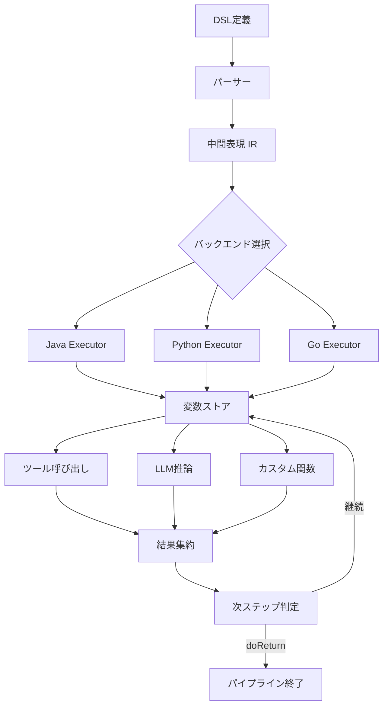

## 論文概要（Abstract）

本記事は、Ivan Daunisによる論文 "A Declarative Language for Building And Orchestrating LLM-Powered Agent Workflows"（arXiv:2512.19769, 2025年12月）の解説記事です。この論文は、LLMエージェントワークフローの仕様と実装を分離する宣言的DSL（Domain-Specific Language）を提案している。著者は、従来の命令型プログラミングで記述されるエージェントワークフローの共通パターンを抽出し、統一的なDSLで表現することで、開発時間の60%削減とデプロイ速度の3倍向上を達成したと報告している。同一のパイプライン定義からJava、Python、Goの複数バックエンドで実行可能な点が特徴であり、PayPalにおいて日次数百万件のeコマースインタラクション処理に実運用されている。

この記事は [Zenn記事: LangGraph Pregel実行モデルで理解するステートマシン設計原則](https://zenn.dev/0h_n0/articles/7cfcf58c6bcf9a) の深掘りです。

## 情報源

- **arXiv ID**: 2512.19769
- **URL**: [https://arxiv.org/abs/2512.19769](https://arxiv.org/abs/2512.19769)
- **著者**: Ivan Daunis
- **発表年**: 2025年12月
- **分野**: cs.SE, cs.AI, cs.PL

## 背景と動機（Background & Motivation）

LLMエージェントの実用化が進むにつれ、ワークフローの構築と運用における課題が顕在化している。現在主流のフレームワーク（LangGraph、DSPy、CrewAI等）は、Pythonを中心とした命令型プログラミングでエージェントの振る舞いを記述する。この方式には以下の問題がある。

第一に、ワークフローの仕様と実装が密結合している。LangGraphの場合、ステートマシンの状態遷移ロジック、データフロー定義、エラーハンドリングがすべてPythonコード内に混在する。Zenn記事で解説されているPregelモデルのReducerによる状態集約も、Pythonのアノテーション構文に依存しており、非エンジニアのドメインエキスパートがワークフローを理解・変更することは困難である。

第二に、マルチ言語・マルチ環境への対応が難しい。Pythonで記述されたLangGraphのグラフ定義をJavaやGoのバックエンドで実行するには、完全な書き直しが必要となる。企業のプロダクション環境では、チームごとに異なる言語スタックを使用することが一般的であり、この制約は重大な障壁となる。

第三に、デプロイと反復のオーバーヘッドが大きい。ツール追加やプロンプト変更のたびにコードの変更・テスト・デプロイが必要となり、特に大規模組織ではリリースサイクルが長期化する。

この論文は、これらの課題に対して「仕様と実装の完全な分離」という設計思想で解決を図っている。

## 主要な貢献（Key Contributions）

- **統一DSLの設計**: エージェントワークフローの共通パターン（データシリアライゼーション、フィルタリング、RAG検索、APIオーケストレーション）をドメイン固有言語で宣言的に表現する仕組みを確立した
- **マルチバックエンド実行基盤**: 同一のパイプライン定義からJava、Python、Goの各言語ランタイムでの実行を可能にし、クラウドネイティブ・オンプレミスの両環境に対応した
- **A/Bテスト機能の統合**: 複数パイプラインバリアントの自動メトリクス収集・比較機能をDSLレベルで組み込み、プロダクション環境でのワークフロー最適化を容易にした
- **非エンジニア向けアクセシビリティ**: ドメインエキスパートがコードのデプロイなしにエージェントの振る舞いを安全に変更できるインタフェースを実現した
- **実運用での検証**: PayPalのeコマース基盤で日次数百万件のインタラクションを処理し、100ms未満のオーケストレーションオーバーヘッドを維持したことを報告している

## 技術的詳細（Technical Details）

### DSL設計の原則

この論文のDSLは、エージェントワークフローを「パイプライン」として定義する。パイプラインは複数の「ステップ」から構成され、各ステップはツール呼び出し、LLM推論、カスタム関数の実行、条件分岐のいずれかを行う。

LangGraphがPythonのクラス定義とデコレータでステートマシンを構築するのに対し、このDSLでは以下のような宣言的な記法でワークフローを記述する。

```yaml
pipeline:
  name: product_search
  variables:
    query: "${input.user_query}"
    context: ""
    results: []
  steps:
    - name: retrieve_context
      type: rag_search
      config: { index: product_catalog, top_k: 10, query: "${query}" }
      output: context
    - name: generate_response
      type: llm_call
      config:
        model: gpt-4
        prompt: "Given context: ${context}\nAnswer: ${query}"
      output: response
    - name: filter_results
      type: filter
      config: { input: "${response.items}", condition: "score > 0.8" }
      output: results
    - name: check_results
      type: conditional
      condition: "${results.length > 0}"
      on_true: return_results
      on_false: fallback_search
```

この設計における重要なポイントは、変数バインディングが明示的であることだ。LangGraphでは、`Annotated[list, operator.add]`のようなPythonアノテーションでReducerを定義し、データフローはグラフ構造とReducerの組み合わせから推論する必要がある。一方、この論文のDSLでは`output: context`や`${context}`のような明示的な変数参照でデータフローを表現する。

### 実行モデル

論文が提案する実行モデルの中核は、エグゼキューターが管理する不変変数ストアと実行コンテキストである。



実行モデルの特徴は以下の通りである。

**不変変数ストア**: 各ステップの実行結果は変数ストアに書き込まれるが、既存の変数は上書きされない。新しい値は新しいバージョンとして追加される。これにより、ワークフローの任意の時点の状態を再現でき、デバッグとリトライが容易になる。LangGraphのチェックポイント機構と類似した概念だが、DSLレベルで言語設計に組み込まれている点が異なる。

**doReturn文による早期終了**: 条件分岐の結果、パイプラインの途中で処理を終了できる。これは、LangGraphの`END`ノードへの遷移に相当する。

**指数バックオフ付きリトライ**: 外部API呼び出しやLLM推論の失敗時に、指数バックオフとジッタを用いたリトライを自動的に行う。リトライ回数と待機時間はDSLで宣言的に設定可能である。

**ランタイム依存注入**: LangGraphの`context_schema`に相当する仕組みとして、実行時に外部サービスの参照（データベース接続、APIクライアント等）をエグゼキューターに注入できる。DSL自体にはサービスの具体的な実装が含まれず、バックエンドごとに異なる実装を差し替えられる。

### マルチバックエンドアーキテクチャ

DSLからバックエンド固有のコードへの変換は、中間表現（IR）を介して行われる。

$$
\text{DSL} \xrightarrow{\text{parse}} \text{IR} \xrightarrow{\text{codegen}_i} \text{Backend}_i \quad (i \in \{\text{Java}, \text{Python}, \text{Go}\})
$$

ここで、IRはバックエンド非依存のグラフ構造であり、各ノードがステップに対応する。コード生成フェーズ（$\text{codegen}_i$）では、IRの各ノードをターゲット言語の関数呼び出しに変換する。

## アルゴリズム（DSLのコンパイル例）

DSLからPythonへのコンパイル過程を具体的に示す。以下のDSL定義を考える。

```yaml
pipeline:
  name: cart_personalization
  variables: { user_id: "${input.user_id}", cart_items: [], recommendations: [] }
  steps:
    - name: fetch_cart
      type: api_call
      config:
        endpoint: "/api/cart/${user_id}"
        method: GET
        retry: { max_attempts: 3, backoff: exponential }
      output: cart_items
    - name: generate_recommendations
      type: llm_call
      config: { model: gpt-4, prompt: "User cart: ${cart_items}\nSuggest complementary products.", max_tokens: 500 }
      output: recommendations
    - name: check_empty
      type: conditional
      condition: "${recommendations.length == 0}"
      on_true: return_default
      on_false: return_personalized
```

このDSLは、以下のようなPythonコードにコンパイルされる。

```python
from dataclasses import dataclass, field
from typing import Any

import httpx
from tenacity import retry, stop_after_attempt, wait_exponential


@dataclass(frozen=True)
class VariableStore:
    """不変変数ストア。バージョニングにより任意時点の状態を再現可能。"""

    _store: dict[str, list[Any]] = field(default_factory=dict)

    def set(self, key: str, value: Any) -> "VariableStore":
        """新しい変数値を追加した新しいストアを返す。"""
        new_store = {k: list(v) for k, v in self._store.items()}
        new_store.setdefault(key, []).append(value)
        return VariableStore(_store=new_store)

    def get(self, key: str) -> Any:
        """最新の変数値を取得する。"""
        return self._store[key][-1]


class CartPersonalizationPipeline:
    """DSLから生成されたPython実行コード。"""

    def __init__(self, llm_client: Any, http_client: httpx.AsyncClient) -> None:
        self.llm_client = llm_client
        self.http_client = http_client

    @retry(stop=stop_after_attempt(3), wait=wait_exponential(min=1, max=10))
    async def _fetch_cart(self, user_id: str) -> list[dict[str, Any]]:
        """カート情報をAPIから取得する。指数バックオフ付きリトライ。"""
        resp = await self.http_client.get(f"/api/cart/{user_id}")
        resp.raise_for_status()
        return resp.json()

    async def execute(self, user_id: str) -> list[dict[str, Any]]:
        """パイプラインを実行する。"""
        store = VariableStore()
        store = store.set("user_id", user_id)

        cart_items = await self._fetch_cart(user_id)
        store = store.set("cart_items", cart_items)

        recommendations = await self._generate_recommendations(cart_items)
        store = store.set("recommendations", recommendations)

        # doReturn: 条件付き早期終了
        if len(recommendations) == 0:
            return [{"type": "default", "items": []}]
        return recommendations
```

このコンパイル結果から、DSLの50行未満の宣言的定義が約80行のPythonコードに展開されていることが分かる。論文では、より複雑な実運用パイプラインにおいて、50行未満のDSLが500行以上の命令型コードと同等の機能を実現すると報告されている。

## 実装のポイント（Implementation）

この論文のシステムを実際に構築・運用する際の重要なポイントを整理する。

**DSLパーサーの拡張性**: 新しいステップタイプ（例: ベクトル検索、ストリーミング出力）を追加する際、パーサーとコードジェネレータの両方を拡張する必要がある。論文ではプラグインアーキテクチャを採用し、ステップタイプごとに独立したモジュールとして追加できる設計にしていると述べられている。

**変数スコープの管理**: 不変変数ストアは実行のトレーサビリティを高めるが、長時間実行されるパイプラインではメモリ消費が増大する。論文では、ステップ完了後に不要なバージョンをガベージコレクションする戦略が示唆されている。

**エラー伝播とリトライ**: 指数バックオフ付きリトライはステップ単位で設定可能だが、パイプライン全体のタイムアウトとの整合性に注意が必要である。著者は、ステップレベルのリトライとパイプラインレベルのサーキットブレーカーを組み合わせることを推奨している。

**A/Bテストの統計的検証**: DSLレベルでA/Bテストを定義できるが、統計的有意性の判定（サンプルサイズ計算、多重比較補正等）はランタイム側で別途実装する必要がある。

## Production Deployment Guide

この論文の宣言的ワークフローエンジンをAWSにデプロイする構成を、トラフィック量別に整理する。以下のコスト試算は2026年7月時点のAWS東京リージョン（ap-northeast-1）料金に基づく概算値であり、実際のコストはトラフィックパターン、バースト使用量、リージョンにより変動する。最新料金はAWS料金計算ツール（AWS Pricing Calculator）で確認を推奨する。

### AWS実装パターン（コスト最適化重視）

| 構成 | トラフィック | 主要サービス | 月額概算 |
|------|-------------|-------------|---------|
| Small | ~100 req/日 | Lambda + Step Functions + DynamoDB | $50-150 |
| Medium | ~1,000 req/日 | ECS Fargate + SQS + ElastiCache | $300-800 |
| Large | 10,000+ req/日 | EKS + Kafka (MSK) + Aurora | $2,000-5,000 |

**Small構成（~100 req/日）**: Lambda関数でDSLエグゼキューターを実行し、Step Functionsでパイプラインのステップ間遷移を管理する。DynamoDBに変数ストアを保存し、不変性を担保する。LLM呼び出しはAmazon Bedrockを使用する。月額内訳の概算は、Lambda（128MB, 平均3秒）約$1、Step Functions（100遷移/日）約$3、DynamoDB（On-Demand）約$5、Bedrock（Claude Sonnet, 月3万トークン程度）約$10-50、CloudWatch約$5で、合計$50-150程度である。

**Medium構成（~1,000 req/日）**: ECS Fargateでエグゼキューターを常時起動し、SQSでパイプラインリクエストをバッファリングする。ElastiCache（Redis）で変数ストアのキャッシュレイヤーを設け、レイテンシを低減する。月額内訳の概算は、ECS Fargate（0.5 vCPU, 1GB RAM x 2タスク）約$60、SQS約$5、ElastiCache（cache.t3.micro）約$25、Bedrock約$100-400、ALB約$25、CloudWatch約$15で、合計$300-800程度である。

**Large構成（10,000+ req/日）**: EKSクラスタでエグゼキューターをPodとして水平スケールし、Amazon MSK（Managed Kafka）でイベント駆動のパイプライン実行を管理する。Aurora PostgreSQLで変数ストアの永続化と監査ログを保持する。月額内訳の概算は、EKS（コントロールプレーン）約$73、EC2ワーカー（m5.xlarge Spot x 3）約$150、MSK（kafka.m5.large x 3）約$500、Aurora（db.r5.large）約$200、Bedrock約$500-2,000、ALB + NAT Gateway約$100、CloudWatch + X-Ray約$50で、合計$2,000-5,000程度である。

**コスト削減テクニック**: Spot Instancesの活用でEC2コストを最大90%削減できる。1年コミットのReserved Instancesで最大72%削減が可能である。Bedrock Batch APIを非リアルタイム処理に使用することで50%削減、Prompt Cachingの有効化で30-90%の追加削減が見込める。

### Terraformインフラコード

**Small構成（Serverless）** の主要リソース:

```hcl
# Small構成: Lambda + Step Functions + DynamoDB

resource "aws_iam_role_policy" "lambda_permissions" {
  name = "workflow-engine-lambda-policy"
  role = aws_iam_role.workflow_lambda.id
  # 最小権限: DynamoDB, Bedrock, CloudWatch Logsのみ
  policy = jsonencode({
    Version = "2012-10-17"
    Statement = [
      {
        Effect = "Allow"
        Action = ["dynamodb:PutItem", "dynamodb:GetItem", "dynamodb:Query"]
        Resource = aws_dynamodb_table.variable_store.arn
      },
      {
        Effect = "Allow"
        Action = ["bedrock:InvokeModel"]
        Resource = "arn:aws:bedrock:ap-northeast-1::foundation-model/*"
      }
    ]
  })
}

# 不変変数ストア用DynamoDB
resource "aws_dynamodb_table" "variable_store" {
  name         = "workflow-variable-store"
  billing_mode = "PAY_PER_REQUEST"  # On-Demand: 低トラフィックでコスト最適
  hash_key     = "pipeline_execution_id"
  range_key    = "variable_version"
  server_side_encryption { enabled = true }  # KMS暗号化
  point_in_time_recovery { enabled = true }
  ttl { attribute_name = "expires_at"; enabled = true }
}

resource "aws_lambda_function" "workflow_executor" {
  function_name = "workflow-dsl-executor"
  runtime       = "python3.12"
  timeout       = 300  # LLM呼び出しを含むため5分
  memory_size   = 256
  tracing_config { mode = "Active" }  # X-Ray有効化
}
```

**Large構成（Container）** の主要リソース:

```hcl
# Large構成: EKS + Karpenter + Spot Instances

module "eks" {
  source          = "terraform-aws-modules/eks/aws"
  version         = "~> 20.24"
  cluster_name    = "workflow-engine-cluster"
  cluster_version = "1.31"
  cluster_endpoint_private_access = true
}

# Karpenter: Spot優先でコスト最大90%削減
resource "kubectl_manifest" "karpenter_nodepool" {
  yaml_body = yamlencode({
    apiVersion = "karpenter.sh/v1"
    kind       = "NodePool"
    metadata   = { name = "workflow-workers" }
    spec = {
      template.spec.requirements = [
        { key = "karpenter.sh/capacity-type", operator = "In",
          values = ["spot", "on-demand"] },
        { key = "node.kubernetes.io/instance-type", operator = "In",
          values = ["m5.xlarge", "m5a.xlarge", "m6i.xlarge"] },
      ]
      limits     = { cpu = "64", memory = "256Gi" }
      disruption = { consolidationPolicy = "WhenEmptyOrUnderutilized" }
    }
  })
}

# 予算アラート: 月額$5,000の80%到達で警告
resource "aws_budgets_budget" "workflow_monthly" {
  name         = "workflow-engine-monthly"
  budget_type  = "COST"
  limit_amount = "5000"
  limit_unit   = "USD"
  time_unit    = "MONTHLY"
}
```

### 運用・監視設定

**CloudWatch Logs Insights クエリ**（レイテンシ分析・トークン使用量監視）:

```
# パイプライン実行のP95/P99レイテンシ
fields @timestamp, pipeline_name, duration_ms
| stats count() as executions,
        percentile(duration_ms, 95) as p95_latency,
        percentile(duration_ms, 99) as p99_latency
  by bin(1h) as hour
| sort hour desc
```

**X-Ray トレーシング + CloudWatch アラーム**（Python）:

```python
import boto3
from aws_xray_sdk.core import xray_recorder, patch_all


def configure_observability(sns_topic_arn: str) -> None:
    """X-Rayトレーシングと監視アラームを設定する。

    Args:
        sns_topic_arn: 通知先のSNSトピックARN
    """
    # X-Ray: boto3自動計装
    xray_recorder.configure(service="workflow-dsl-engine")
    patch_all()

    # CloudWatch: Bedrockトークン使用量スパイク検知
    cw = boto3.client("cloudwatch", region_name="ap-northeast-1")
    cw.put_metric_alarm(
        AlarmName="workflow-bedrock-token-spike",
        MetricName="InputTokenCount",
        Namespace="AWS/Bedrock",
        Statistic="Sum",
        Period=3600,
        EvaluationPeriods=1,
        Threshold=100000,  # 1時間あたり10万トークン超過
        ComparisonOperator="GreaterThanThreshold",
        AlarmActions=[sns_topic_arn],
    )
```

**Cost Explorer 日次レポート**: `project`タグでフィルタし、日次$100超過でSNS通知する。Bedrock、Lambda、EKSの各サービス別コストを抽出し、異常値を早期検知する。

### コスト最適化チェックリスト

**アーキテクチャ選択** (3項目):
- [ ] トラフィック量に応じた構成選択（Serverless / Hybrid / Container）
- [ ] DSLエグゼキューターのステートレス設計確認
- [ ] 変数ストアのストレージ選択最適化（DynamoDB On-Demand vs Provisioned）

**リソース最適化** (5項目):
- [ ] Spot Instances優先適用（最大90%削減）
- [ ] Reserved Instances 1年コミット検討（最大72%削減）
- [ ] Savings Plans（Compute/EC2）評価
- [ ] Lambda Power Tuningでメモリサイズ最適化
- [ ] Karpenter consolidationでアイドル時スケールダウン

**LLMコスト削減** (4項目):
- [ ] Bedrock Batch API使用（非リアルタイム処理、50%削減）
- [ ] Prompt Caching有効化（30-90%削減）
- [ ] タスク複雑度に応じたモデル選択ロジック（Haiku/Sonnet/Opus）
- [ ] max_tokensパラメータでトークン数制限

**監視・アラート** (4項目):
- [ ] AWS Budgets月額予算アラート
- [ ] CloudWatchアラーム（Bedrock/Lambda異常検知）
- [ ] Cost Anomaly Detection有効化
- [ ] 日次コストレポートSNS配信

**リソース管理** (5項目):
- [ ] 未使用リソース削除
- [ ] タグ戦略統一（project, environment, team）
- [ ] DynamoDB TTLでライフサイクル管理
- [ ] 開発環境の夜間・休日停止
- [ ] CloudWatch Logs保持期間30日制限

## 実験結果（Results）

著者は、PayPalのeコマース基盤における実運用でシステムの有効性を評価したと報告している。

| 指標 | 命令型（ベースライン） | 宣言的DSL（提案手法） | 改善率 |
|------|----------------------|---------------------|--------|
| 開発時間 | 基準値 | 基準値の40% | 60%削減 |
| デプロイ速度 | 基準値 | 基準値の3倍 | 3x向上 |
| コード行数（典型的ワークフロー） | 500行以上 | 50行未満 | 90%以上削減 |
| オーケストレーションオーバーヘッド | - | 100ms未満 | - |

**開発時間の削減**: 著者は、宣言的DSLの導入により、命令型アプローチと比較して開発時間が60%削減されたと報告している。この削減は主に、ボイラープレートコード（エラーハンドリング、リトライロジック、データシリアライゼーション）の自動生成と、DSLレベルでの型安全な変数バインディングに起因するとされている。

**デプロイ速度の向上**: DSL定義の変更はコードの再ビルド・再デプロイを必要としないため、デプロイ速度が3倍向上したと報告されている。新しいツールの追加やプロンプトの変更がDSLファイルの更新のみで完了する点が貢献している。

**実運用スケール**: PayPalの商品検索、パーソナライゼーション、カート管理などのeコマースワークフローにおいて、日次数百万件のインタラクションを処理している。オーケストレーション層のオーバーヘッドは100ms未満に維持されているとのことである。

**A/Bテスト機能**: 複数のパイプラインバリアント（異なるプロンプト、モデル、RAG設定等）を同時に実行し、自動的にメトリクスを収集・比較する機能により、ワークフローの継続的な最適化が可能になったと報告されている。

ただし、論文の評価にはいくつかの留意点がある。開発時間の削減率はPayPalの特定のユースケースにおける計測であり、異なるドメインやワークフロー複雑度では結果が異なる可能性がある。また、DSL学習コストやDSLの制約による回避策の開発時間は考慮されていない可能性がある。

## 実運用への応用（LangGraphとの使い分け）

Zenn記事で解説されているLangGraphのPregelモデルとこの論文の宣言的DSLは、異なる設計思想に基づいており、適用シーンに応じた使い分けが重要である。

**LangGraphが適するケース**: Pythonエコシステムで完結するプロジェクト、複雑な条件分岐やサイクリックなグラフ構造が必要な場合、Reducerによる柔軟な状態集約ロジックが求められる場合、プロトタイピングや研究開発段階。

**宣言的DSLが適するケース**: マルチ言語チームでの開発（Java, Python, Go混在）、非エンジニアによるワークフロー変更が頻繁な場合、A/Bテストによるワークフロー最適化が重要な場合、大規模組織でのガバナンスと監査が必要な場合。

LangGraphの`StateGraph`は命令型で表現力が高い反面、ワークフローの全体像をコードから読み取るには実行フローを追う必要がある。一方、宣言的DSLではパイプライン全体が1つのYAMLファイルに収まり、可視性に優れる。実務的には、プロトタイプをLangGraphで構築し、プロダクション移行時にDSLベースへ変換するハイブリッドアプローチも有効であると筆者は考える。

## 関連研究（Related Work）

- **LangGraph（LangChain）**: Pythonベースの命令型ステートマシンフレームワーク。Pregelモデルに基づくメッセージパッシングで並行実行をサポートする。本論文のDSLと異なり、ワークフロー定義がPythonコードに密結合しており、非Pythonバックエンドへの移植やコード変更なしのデプロイには対応していない
- **DSPy（Stanford NLP Group）**: LLMパイプラインをPythonicなモジュールで構築し、プロンプトの自動最適化を行うフレームワーク。宣言的な側面を持つが、主にプロンプトエンジニアリングの最適化に焦点を当てており、マルチバックエンド実行やA/Bテスト機能は提供していない
- **CrewAI**: マルチエージェント協調のためのフレームワーク。エージェントの役割定義やタスク分配を高レベルAPIで記述できるが、ワークフローの仕様と実装の分離という観点では本論文のDSLほど徹底されていない
- **Apache Airflow / Prefect**: データパイプライン向けのワークフローオーケストレーションツール。DAG（有向非巡回グラフ）ベースのタスク管理に優れるが、LLMエージェント固有のパターン（プロンプトテンプレート、RAG検索、ストリーミング出力等）への対応は限定的である

## まとめと今後の展望

本論文は、LLMエージェントワークフローを宣言的DSLで記述することにより、仕様と実装の分離を実現するシステムを提案した。PayPalの実運用において開発時間60%削減、デプロイ速度3倍向上を達成したと報告されており、大規模組織でのエージェント運用における有効性が示唆されている。

実務への示唆として、命令型フレームワーク（LangGraph等）と宣言的DSLの選択は、チーム構成、デプロイ頻度、言語スタックの多様性に応じて判断すべきである。特に、非エンジニアがワークフロー変更に関与する組織や、マルチ言語チームでの開発においては、宣言的DSLのアプローチが有力な選択肢となる。

今後の研究方向としては、DSLの表現力の拡張（サイクリックグラフ、動的なステップ生成）、既存フレームワーク（LangGraph, DSPy等）からDSLへの自動変換、DSLレベルでの形式検証（デッドロック検出、到達不能状態の検出）などが考えられる。

## 参考文献

- **arXiv**: [https://arxiv.org/abs/2512.19769](https://arxiv.org/abs/2512.19769)
- **Related Zenn article**: [https://zenn.dev/0h_n0/articles/7cfcf58c6bcf9a](https://zenn.dev/0h_n0/articles/7cfcf58c6bcf9a)
- **LangGraph Documentation**: [https://langchain-ai.github.io/langgraph/](https://langchain-ai.github.io/langgraph/)
- **DSPy**: [https://github.com/stanfordnlp/dspy](https://github.com/stanfordnlp/dspy)
- **CrewAI**: [https://github.com/crewAIInc/crewAI](https://github.com/crewAIInc/crewAI)
