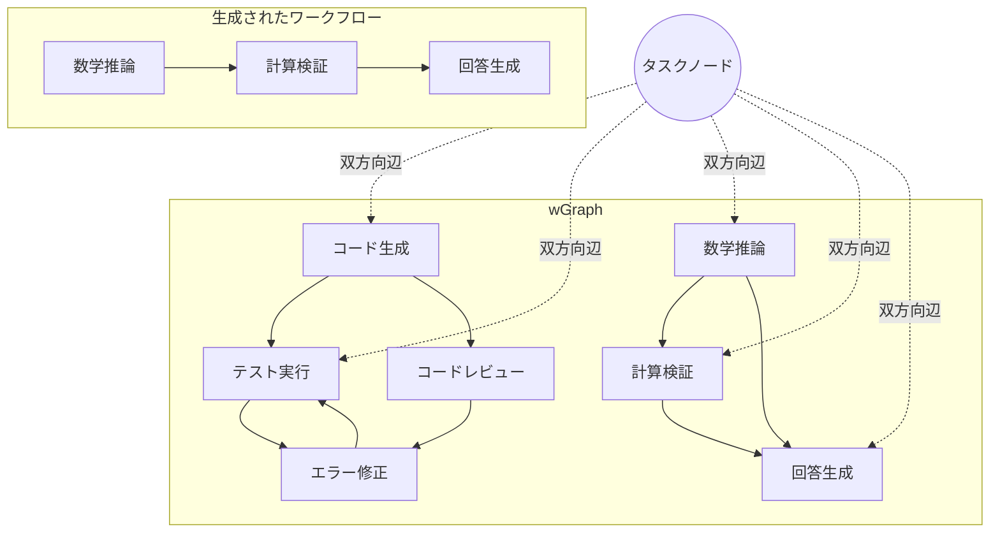
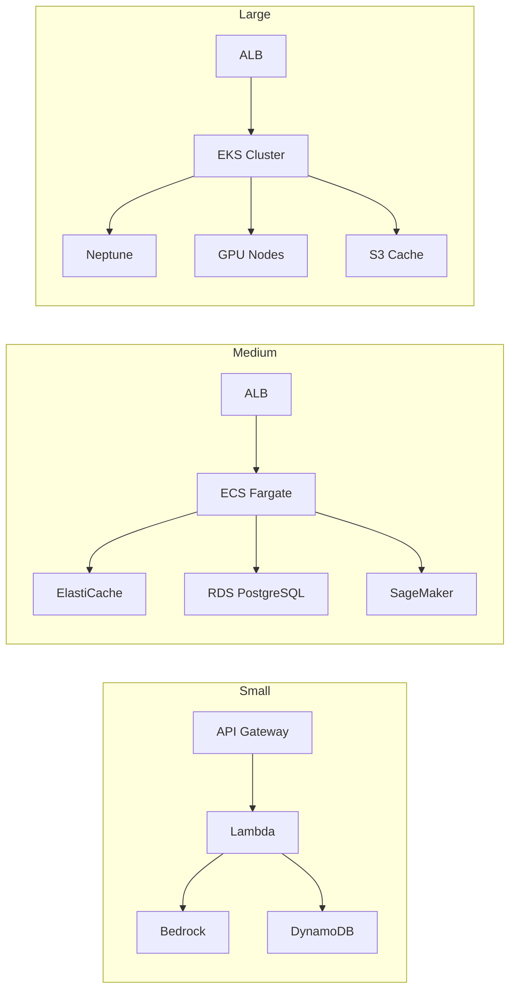

本記事は、ICML 2026に採択された論文「GraphFlow: A Graph-Based Workflow Management for Efficient LLM-Agent Serving」（Li et al., 2026）の解説記事です。LLMエージェントのワークフロー管理をグラフ構造で統一的に扱い、差分ベースKVキャッシュにより推論効率を改善する手法について、技術的詳細と実運用への応用を含めて解説します。

なお、本記事で扱うワークフロー管理の設計原則については、Zenn記事「[LangGraph Pregel実行モデルで理解するステートマシン設計原則](https://zenn.dev/0h_n0/articles/7cfcf58c6bcf9a)」で、LangGraphのPregelモデルを題材にしたステートマシン設計の観点から解説しています。GraphFlowの提案するグラフベースのワークフロー管理は、LangGraphが採用するステートグラフと問題意識を共有しており、併せて読むことで理解が深まります。

## 情報源

- **論文タイトル**: GraphFlow: A Graph-Based Workflow Management for Efficient LLM-Agent Serving
- **著者**: Ao Li, Shangpeng Yang, Fahao Chen, Tianheng Xu, Peng Li, Zhou Su
- **arXiv**: [2605.22566](https://arxiv.org/abs/2605.22566)（2026年5月21日公開）
- **採択**: ICML 2026
- **キーワード**: LLM agent serving, workflow graph, GNN, KV cache optimization

## 背景と動機

LLMエージェントは、ツール呼び出し、推論ステップ、検証モジュールなど複数の操作を組み合わせたワークフローとして動作する。ReAct、Chain-of-Thought、Tool-Augmented Generationといった手法が広く使われているが、これらのワークフローの管理と実行には次のような課題がある。

**ワークフロー構築の非効率性**: 既存手法の多くは、タスクごとにワークフローをゼロから構築する。MetaGPTやTaskWeaverはタスク分解に基づくが、過去のワークフロー知識を再利用する仕組みが限定的であると著者らは指摘している。AFlowのようにモンテカルロ木探索でワークフローを探索する手法もあるが、探索コストが大きい。

**メモリ消費の増大**: LLMエージェントのワークフローでは、各操作ステップでKVキャッシュが生成される。操作数が増えると、KVキャッシュのメモリ消費がGPUメモリの大部分を占有し、スケーラビリティの制約となる。著者らの報告によれば、GSM8Kデータセットにおいてバッチサイズ50ではステートフルなKVキャッシュが2.4GB以上に達する。

**統一的な表現の欠如**: ツール呼び出し、推論、検証といった異種の操作を統一的に扱う枠組みが不足しており、ワークフロー間での操作共有や最適化が困難である。

GraphFlowは、これらの課題に対して、統一操作グラフ（wGraph）による知識再利用と、差分ベースKVキャッシュによるメモリ効率化を組み合わせたシステムとして提案されている。

## 主要な貢献

著者らは以下の3点を主要な貢献として挙げている。

1. **wGraph（統一操作グラフ）の提案**: 多様なエージェント操作（ツール呼び出し、推論、検証）を単一のグラフ構造 $\mathcal{G}_{op} = (\mathcal{V}_{op}, \mathcal{E}_{op})$ で統一的に表現する枠組み。過去のワークフロー知識の蓄積と再利用を可能にする。

2. **GNNベースのワークフロー構築**: タスク入力に条件付けられたサブグラフ生成問題としてワークフロー構築を定式化し、Graph Convolutional Network（GCN）とMLPデコーダによる効率的な構築を実現する。

3. **差分ベースKVキャッシュ**: 操作ノード間で共通するKV状態をベースキャッシュとして共有し、操作固有の差分のみをスパース残差として保持する手法。メモリ消費を約4倍削減する。

## 技術的詳細

### wGraph: 統一操作グラフ

GraphFlowの中核となるwGraphは、有向グラフ $\mathcal{G}_{op} = (\mathcal{V}_{op}, \mathcal{E}_{op})$ として定義される。ここで $\mathcal{V}_{op}$ は操作ノードの集合、$\mathcal{E}_{op}$ は操作間の遷移辺の集合である。

各操作ノード $v_i \in \mathcal{V}_{op}$ は、D次元の特徴ベクトル $\mathbf{h}_i \in \mathbb{R}^D$ でエンコードされる。この特徴ベクトルは以下の3つのセマンティクスを捉える。

- **機能的セマンティクス**: その操作が何を行うか（例: コード生成、数学的推論、検索）
- **言語的トリガーパターン**: どのようなタスク記述がその操作を呼び出すか
- **内部実行スキーマ**: 操作の入出力形式や実行制約

辺 $e_{ij} \in \mathcal{E}_{op}$ は操作 $v_i$ から $v_j$ への遷移可能性を表し、過去のワークフロー実行から学習される。



### タスク条件付きグラフ構築

新しいタスクが入力されると、仮想タスクノード $v_{task}$ がwGraphに注入される。$v_{task}$ は各操作ノードと双方向辺で接続され、タスク情報がグラフ全体に伝播する。

この構成により、タスクの特徴とすべての操作ノードの特徴が相互に参照可能となり、タスクに適した操作の選択と順序付けが行われる。

### GNNエンコーダ

著者らは2層のGraph Convolutional Network（GCN）をエンコーダとして採用している。GCNの各層は以下のように定義される。

$$
\mathbf{H}^{(l+1)} = \sigma\left(\tilde{D}^{-\frac{1}{2}} \tilde{A} \tilde{D}^{-\frac{1}{2}} \mathbf{H}^{(l)} \mathbf{W}^{(l)}\right)
$$

ここで各変数は以下の通りである。

- $\mathbf{H}^{(l)} \in \mathbb{R}^{N \times D}$: 第 $l$ 層のノード特徴行列（$N$ はノード数、$D$ は特徴次元）
- $\tilde{A} = A + I_N$: 自己ループ付き隣接行列（$A$ は元の隣接行列、$I_N$ は単位行列）
- $\tilde{D}$: $\tilde{A}$ の次数行列（$\tilde{D}_{ii} = \sum_j \tilde{A}_{ij}$）
- $\mathbf{W}^{(l)} \in \mathbb{R}^{D \times D}$: 第 $l$ 層の学習可能な重み行列
- $\sigma$: 活性化関数（ReLU）

2層のGCNにより、各ノードは2ホップ先の近傍情報を集約する。著者らのアブレーション実験によれば、2層が最適であり、層数を増やすと過平滑化（over-smoothing）により性能が低下すると報告されている。

### MLPデコーダ

エンコーダの出力を受けて、MLPデコーダが候補辺ごとのスコアを計算する。操作ノード $v_i$ と $v_j$ の間の辺スコアは以下のように算出される。

$$
s_{ij} = \text{MLP}\left([\mathbf{h}_i^{(L)} \| \mathbf{h}_j^{(L)} \| \mathbf{h}_{task}^{(L)}]\right)
$$

ここで $\mathbf{h}_i^{(L)}$ は最終層のノード $i$ の特徴ベクトル、$\|$ はベクトルの連結、$\mathbf{h}_{task}^{(L)}$ はタスクノードの最終層特徴ベクトルである。

ワークフロー構築は「条件付きサブグラフ生成問題」として定式化される。すなわち、タスク $t$ が与えられたとき、wGraph $\mathcal{G}_{op}$ からタスクに最適なサブグラフ $\mathcal{G}_{sub}(t) \subseteq \mathcal{G}_{op}$ を生成する問題である。

### 訓練

モデルの訓練にはバイナリクロスエントロピー損失が用いられる。

$$
\mathcal{L} = -\sum_{(i,j)} \left[ y_{ij} \log(\hat{y}_{ij}) + (1 - y_{ij}) \log(1 - \hat{y}_{ij}) \right]
$$

ここで $y_{ij} \in \{0, 1\}$ は辺 $(i, j)$ の正解ラベル、$\hat{y}_{ij} = \sigma(s_{ij})$ は予測確率である。著者らはAdamWオプティマイザ、学習率 $1 \times 10^{-4}$、バッチサイズ64、20エポックの設定で訓練を行い、NVIDIA L20 GPUを使用したと報告している。

### 差分ベースKVキャッシュ

GraphFlowのもう一つの重要な技術が、差分ベースKVキャッシュである。従来のLLMサービングでは、各操作ステップのKVキャッシュを個別に保持するため、操作数に比例してメモリが増大する。

GraphFlowでは、各操作のKV状態を以下のように分解する。

$$
\mathbf{KV}_i = \mathbf{KV}_{base} + \Delta\mathbf{KV}_i
$$

ここで各変数は以下の通りである。

- $\mathbf{KV}_i$: 操作 $i$ の完全なKV状態
- $\mathbf{KV}_{base}$: 全操作で共有されるベースKVキャッシュ
- $\Delta\mathbf{KV}_i$: 操作 $i$ 固有のスパースな残差

著者らの分析によれば、キーエントリの75%以上およびバリューエントリの70%以上が小さい閾値以下であり、残差のスパース性が確認されている。この性質を利用して、残差をスパース表現で保持することで、メモリ消費を大幅に削減する。

### パス枝刈り

ワークフロー内の遷移パスに対して、頻度ベースの枝刈りが適用される。

- **高頻度パス**: 残差KV状態を事前に計算し実体化（materialize）しておく
- **低頻度パス**: 残差KV状態をオンザフライで計算する（メモリ節約を優先）

著者らの報告では、パス枝刈りによりGSM8Kデータセットにおいて約3.5GBのメモリ削減が達成されている。

## アルゴリズム: ワークフロー構築の実装例

以下に、GraphFlowのワークフロー構築の概念をPythonで示す。実際のGraphFlow実装の簡略化版であり、GCNによるノードエンコーディングとMLPによる辺スコア計算の流れを示している。

```python
from __future__ import annotations

from dataclasses import dataclass, field

import torch
import torch.nn as nn
import torch.nn.functional as F


@dataclass
class OperationNode:
    """wGraph内の操作ノードを表現するデータクラス。

    Attributes:
        node_id: ノードの一意識別子
        op_type: 操作の種類（例: "code_gen", "math_reasoning"）
        feature: D次元の特徴ベクトル
    """

    node_id: str
    op_type: str
    feature: torch.Tensor


@dataclass
class WGraph:
    """統一操作グラフ（wGraph）を表現するデータクラス。

    Attributes:
        nodes: 操作ノードのリスト
        adjacency: 隣接行列（N x N）
    """

    nodes: list[OperationNode] = field(default_factory=list)
    adjacency: torch.Tensor = field(default_factory=lambda: torch.empty(0))


class GCNLayer(nn.Module):
    """Graph Convolutional Networkの1層。

    GCNの伝播規則に基づき、隣接ノードの特徴を集約する。
    """

    def __init__(self, in_features: int, out_features: int) -> None:
        """GCN層を初期化する。

        Args:
            in_features: 入力特徴の次元数
            out_features: 出力特徴の次元数
        """
        super().__init__()
        self.weight = nn.Parameter(torch.empty(in_features, out_features))
        nn.init.xavier_uniform_(self.weight)

    def forward(
        self, node_features: torch.Tensor, adj_matrix: torch.Tensor
    ) -> torch.Tensor:
        """GCN層のフォワードパス。

        Args:
            node_features: ノード特徴行列 (N, D_in)
            adj_matrix: 正規化済み隣接行列 (N, N)

        Returns:
            更新されたノード特徴行列 (N, D_out)
        """
        support = node_features @ self.weight
        output = adj_matrix @ support
        return output


class WorkflowBuilder(nn.Module):
    """GCNエンコーダとMLPデコーダによるワークフロー構築モデル。

    タスク入力に条件付けられたサブグラフ生成を行う。
    """

    def __init__(self, feature_dim: int, hidden_dim: int) -> None:
        """ワークフロー構築モデルを初期化する。

        Args:
            feature_dim: ノード特徴の次元数（D）
            hidden_dim: 隠れ層の次元数
        """
        super().__init__()
        self.gcn1 = GCNLayer(feature_dim, hidden_dim)
        self.gcn2 = GCNLayer(hidden_dim, hidden_dim)
        self.edge_decoder = nn.Sequential(
            nn.Linear(hidden_dim * 3, hidden_dim),
            nn.ReLU(),
            nn.Linear(hidden_dim, 1),
        )

    def _normalize_adjacency(self, adj: torch.Tensor) -> torch.Tensor:
        """隣接行列を対称正規化する。

        A_tilde = D^{-1/2} (A + I) D^{-1/2} を計算する。

        Args:
            adj: 隣接行列 (N, N)

        Returns:
            正規化済み隣接行列 (N, N)
        """
        adj_with_self = adj + torch.eye(adj.size(0), device=adj.device)
        degree = adj_with_self.sum(dim=1)
        d_inv_sqrt = torch.diag(degree.pow(-0.5))
        d_inv_sqrt[torch.isinf(d_inv_sqrt)] = 0.0
        return d_inv_sqrt @ adj_with_self @ d_inv_sqrt

    def encode(
        self, node_features: torch.Tensor, adj_matrix: torch.Tensor
    ) -> torch.Tensor:
        """2層GCNによるノードエンコーディング。

        Args:
            node_features: ノード特徴行列 (N, D)
            adj_matrix: 隣接行列 (N, N)

        Returns:
            エンコード済みノード特徴 (N, hidden_dim)
        """
        adj_norm = self._normalize_adjacency(adj_matrix)
        h = F.relu(self.gcn1(node_features, adj_norm))
        h = self.gcn2(h, adj_norm)
        return h

    def decode_edges(
        self,
        encoded_features: torch.Tensor,
        task_feature: torch.Tensor,
        candidate_edges: list[tuple[int, int]],
    ) -> torch.Tensor:
        """候補辺のスコアを計算する。

        Args:
            encoded_features: エンコード済みノード特徴 (N, hidden_dim)
            task_feature: タスクノードの特徴 (hidden_dim,)
            candidate_edges: 候補辺のリスト [(i, j), ...]

        Returns:
            各候補辺のスコア (num_edges,)
        """
        scores = []
        for i, j in candidate_edges:
            edge_input = torch.cat(
                [encoded_features[i], encoded_features[j], task_feature]
            )
            score = self.edge_decoder(edge_input)
            scores.append(score)
        return torch.cat(scores)

    def build_workflow(
        self,
        wgraph: WGraph,
        task_feature: torch.Tensor,
        threshold: float = 0.5,
    ) -> list[tuple[str, str]]:
        """タスクに対するワークフローを構築する。

        wGraphからタスクに適したサブグラフを生成する。

        Args:
            wgraph: 統一操作グラフ
            task_feature: タスクの特徴ベクトル (D,)
            threshold: 辺選択の閾値

        Returns:
            選択された辺のリスト [(src_id, dst_id), ...]
        """
        node_features = torch.stack([n.feature for n in wgraph.nodes])
        encoded = self.encode(node_features, wgraph.adjacency)

        task_encoded = encoded.mean(dim=0)

        candidate_edges: list[tuple[int, int]] = []
        for i in range(len(wgraph.nodes)):
            for j in range(len(wgraph.nodes)):
                if wgraph.adjacency[i, j] > 0:
                    candidate_edges.append((i, j))

        if not candidate_edges:
            return []

        scores = self.decode_edges(encoded, task_encoded, candidate_edges)
        probs = torch.sigmoid(scores)

        selected_edges: list[tuple[str, str]] = []
        for idx, (i, j) in enumerate(candidate_edges):
            if probs[idx].item() > threshold:
                selected_edges.append(
                    (wgraph.nodes[i].node_id, wgraph.nodes[j].node_id)
                )

        return selected_edges
```

## 実装のポイント

GraphFlowを実装する際の重要なポイントを整理する。

**1. wGraphの漸進的構築**: wGraphは最初から完全なグラフを構築するのではなく、ワークフローの実行履歴から漸進的にノードと辺を追加する設計が望ましい。新しい操作パターンが観測されるたびにグラフが成長する。

**2. GCNの層数選択**: 著者らのアブレーション実験では2層GCNが最適とされている。GCNの層数はノードが参照する近傍の範囲（ホップ数）に対応するが、層数を増やすと過平滑化により全ノードの特徴が類似し、識別力が失われる。

**3. スパース残差の閾値設定**: 差分KVキャッシュの効果はスパース性の閾値に依存する。閾値が大きすぎると近似誤差が増大し、小さすぎるとメモリ削減効果が低下する。著者らの実験ではキーの75%以上、バリューの70%以上が閾値以下であることが確認されているが、モデルやタスクに応じた調整が必要である。

**4. パス枝刈りの頻度基準**: 高頻度パスと低頻度パスの判別基準は、実行ログの統計に基づいて設定する。実運用では、ウォームアップ期間を設けてパス頻度を計測し、上位パーセンタイルを高頻度として実体化する戦略が考えられる。

**5. 特徴ベクトルの初期化**: 操作ノードの特徴ベクトルは、操作の説明文をLLMでエンコードして初期化する方法が自然である。Sentence Transformerなどの文埋め込みモデルを用いることで、意味的に類似した操作が近い特徴ベクトルを持つようになる。

## Production Deployment Guide

本セクションでは、GraphFlowシステムをAWSにデプロイする際の構成パターンを示す。以下のコスト試算は2026年7月時点のAWS東京リージョン（ap-northeast-1）の料金に基づく概算値であり、実際の料金はワークロードや契約条件により変動する。

### デプロイメント規模別アーキテクチャ

#### Small（約100リクエスト/日）: Lambda + Bedrock構成

月額概算: $50-150

API Gatewayでリクエストを受け付け、Lambda関数がwGraphの構築とワークフロー実行を処理する。LLM推論はAmazon Bedrockに委任し、GPU管理を不要にする構成である。wGraphのデータはDynamoDBに永続化し、差分KVキャッシュはリクエスト単位で破棄する（ステートレス運用）。

#### Medium（約1,000リクエスト/日）: ECS Fargate + ElastiCache構成

月額概算: $300-800

ECS Fargateでワークフローエンジンを常時起動し、ElastiCache（Redis）で差分KVキャッシュを保持する。LLM推論はBedrockまたはSageMaker Endpointを利用する。wGraphはRDS PostgreSQLに格納し、GCN推論はCPUインスタンスで実行する（バッチサイズが小さいため十分な速度が得られる）。

#### Large（10,000リクエスト以上/日）: EKS + Spot Instances + GPU構成

月額概算: $2,000-5,000

EKSクラスタ上でワークフローエンジンとLLM推論を統合的に管理する。GCN推論とKVキャッシュ管理はGPUノード（g5.xlargeまたはg6.xlarge）で処理し、Spot Instancesによりコストを最適化する。wGraphはNeptune（グラフDB）に格納し、グラフクエリを効率化する。



### Terraformコード例

#### Small構成（Lambda + Bedrock）

```hcl
# GraphFlow Small Deployment - Lambda + Bedrock
# 2026年7月時点のAWS東京リージョン料金概算に基づく

terraform {
  required_version = ">= 1.5"
  required_providers {
    aws = {
      source  = "hashicorp/aws"
      version = "~> 5.0"
    }
  }
}

provider "aws" {
  region = "ap-northeast-1"
}

# wGraph永続化用DynamoDB
resource "aws_dynamodb_table" "wgraph" {
  name         = "graphflow-wgraph"
  billing_mode = "PAY_PER_REQUEST"
  hash_key     = "graph_id"
  range_key    = "node_id"

  attribute {
    name = "graph_id"
    type = "S"
  }

  attribute {
    name = "node_id"
    type = "S"
  }

  ttl {
    attribute_name = "expires_at"
    enabled        = true
  }

  tags = {
    Project = "graphflow"
    Tier    = "small"
  }
}

# ワークフローエンジン Lambda
resource "aws_lambda_function" "workflow_engine" {
  function_name = "graphflow-workflow-engine"
  runtime       = "python3.12"
  handler       = "handler.lambda_handler"
  timeout       = 300
  memory_size   = 1024

  filename         = "lambda_package.zip"
  source_code_hash = filebase64sha256("lambda_package.zip")

  role = aws_iam_role.lambda_role.arn

  environment {
    variables = {
      WGRAPH_TABLE     = aws_dynamodb_table.wgraph.name
      BEDROCK_MODEL_ID = "anthropic.claude-sonnet-4-20250514"
      GCN_LAYERS       = "2"
      EDGE_THRESHOLD   = "0.5"
    }
  }

  tags = {
    Project = "graphflow"
  }
}

# API Gateway
resource "aws_apigatewayv2_api" "graphflow" {
  name          = "graphflow-api"
  protocol_type = "HTTP"
}

resource "aws_apigatewayv2_integration" "lambda" {
  api_id             = aws_apigatewayv2_api.graphflow.id
  integration_type   = "AWS_PROXY"
  integration_uri    = aws_lambda_function.workflow_engine.invoke_arn
  payload_format_version = "2.0"
}

resource "aws_apigatewayv2_route" "workflow" {
  api_id    = aws_apigatewayv2_api.graphflow.id
  route_key = "POST /workflow"
  target    = "integrations/${aws_apigatewayv2_integration.lambda.id}"
}

resource "aws_apigatewayv2_stage" "prod" {
  api_id      = aws_apigatewayv2_api.graphflow.id
  name        = "prod"
  auto_deploy = true
}

# IAMロール
resource "aws_iam_role" "lambda_role" {
  name = "graphflow-lambda-role"

  assume_role_policy = jsonencode({
    Version = "2012-10-17"
    Statement = [{
      Action = "sts:AssumeRole"
      Effect = "Allow"
      Principal = { Service = "lambda.amazonaws.com" }
    }]
  })
}

resource "aws_iam_role_policy" "lambda_policy" {
  name = "graphflow-lambda-policy"
  role = aws_iam_role.lambda_role.id

  policy = jsonencode({
    Version = "2012-10-17"
    Statement = [
      {
        Effect   = "Allow"
        Action   = ["dynamodb:GetItem", "dynamodb:PutItem", "dynamodb:Query", "dynamodb:UpdateItem"]
        Resource = aws_dynamodb_table.wgraph.arn
      },
      {
        Effect   = "Allow"
        Action   = ["bedrock:InvokeModel"]
        Resource = "*"
      },
      {
        Effect   = "Allow"
        Action   = ["logs:CreateLogGroup", "logs:CreateLogStream", "logs:PutLogEvents"]
        Resource = "arn:aws:logs:*:*:*"
      }
    ]
  })
}
```

#### Large構成（EKS + GPU）

```hcl
# GraphFlow Large Deployment - EKS + GPU Nodes
# 2026年7月時点のAWS東京リージョン料金概算に基づく

module "eks" {
  source          = "terraform-aws-modules/eks/aws"
  version         = "~> 20.0"

  cluster_name    = "graphflow-cluster"
  cluster_version = "1.30"

  vpc_id     = module.vpc.vpc_id
  subnet_ids = module.vpc.private_subnets

  eks_managed_node_groups = {
    # ワークフローエンジン（CPU）
    workflow = {
      instance_types = ["m6i.xlarge"]
      min_size       = 2
      max_size       = 10
      desired_size   = 3

      labels = {
        role = "workflow-engine"
      }
    }

    # GCN推論 + KVキャッシュ管理（GPU）
    gpu_inference = {
      instance_types = ["g5.xlarge"]
      min_size       = 1
      max_size       = 5
      desired_size   = 2
      capacity_type  = "SPOT"

      labels = {
        role                             = "gpu-inference"
        "nvidia.com/gpu.present"         = "true"
      }

      taints = [{
        key    = "nvidia.com/gpu"
        value  = "true"
        effect = "NO_SCHEDULE"
      }]
    }

    # LLM推論（大型GPU）
    llm_serving = {
      instance_types = ["g5.2xlarge"]
      min_size       = 1
      max_size       = 8
      desired_size   = 2
      capacity_type  = "SPOT"

      labels = {
        role = "llm-serving"
      }

      taints = [{
        key    = "nvidia.com/gpu"
        value  = "true"
        effect = "NO_SCHEDULE"
      }]
    }
  }

  tags = {
    Project = "graphflow"
    Tier    = "large"
  }
}

# Neptune（wGraphストレージ）
resource "aws_neptune_cluster" "wgraph" {
  cluster_identifier  = "graphflow-wgraph"
  engine              = "neptune"
  instance_class      = "db.r6g.large"
  neptune_cluster_parameter_group_name = "default.neptune1.3"

  vpc_security_group_ids = [aws_security_group.neptune.id]
  neptune_subnet_group_name = aws_neptune_subnet_group.main.name

  tags = {
    Project = "graphflow"
  }
}

# ElastiCache（差分KVキャッシュ）
resource "aws_elasticache_replication_group" "kv_cache" {
  replication_group_id = "graphflow-kv-cache"
  description          = "Differential KV cache for GraphFlow"
  node_type            = "cache.r7g.xlarge"
  num_cache_clusters   = 2

  engine               = "redis"
  engine_version       = "7.1"
  parameter_group_name = "default.redis7"

  subnet_group_name    = aws_elasticache_subnet_group.main.name
  security_group_ids   = [aws_security_group.redis.id]

  tags = {
    Project = "graphflow"
  }
}
```

### CloudWatch / X-Ray 監視設定

```hcl
# CloudWatch ダッシュボード
resource "aws_cloudwatch_dashboard" "graphflow" {
  dashboard_name = "graphflow-monitoring"

  dashboard_body = jsonencode({
    widgets = [
      {
        type   = "metric"
        x      = 0
        y      = 0
        width  = 12
        height = 6
        properties = {
          title   = "Workflow Latency (p50/p95/p99)"
          metrics = [
            ["GraphFlow", "WorkflowLatency", "Stat", "p50"],
            ["GraphFlow", "WorkflowLatency", "Stat", "p95"],
            ["GraphFlow", "WorkflowLatency", "Stat", "p99"]
          ]
          period = 60
          region = "ap-northeast-1"
        }
      },
      {
        type   = "metric"
        x      = 12
        y      = 0
        width  = 12
        height = 6
        properties = {
          title   = "KV Cache Memory Usage"
          metrics = [
            ["GraphFlow", "KVCacheMemoryMB", "CacheType", "base"],
            ["GraphFlow", "KVCacheMemoryMB", "CacheType", "residual"],
            ["GraphFlow", "KVCacheMemoryMB", "CacheType", "total"]
          ]
          period = 60
        }
      },
      {
        type   = "metric"
        x      = 0
        y      = 6
        width  = 12
        height = 6
        properties = {
          title   = "GCN Inference Time"
          metrics = [
            ["GraphFlow", "GCNInferenceMs", "Stat", "Average"],
            ["GraphFlow", "GCNInferenceMs", "Stat", "p99"]
          ]
          period = 60
        }
      },
      {
        type   = "metric"
        x      = 12
        y      = 6
        width  = 12
        height = 6
        properties = {
          title   = "Workflow Success Rate"
          metrics = [
            ["GraphFlow", "WorkflowSuccess", "Stat", "Sum"],
            ["GraphFlow", "WorkflowFailure", "Stat", "Sum"]
          ]
          period  = 300
          stat    = "Sum"
        }
      }
    ]
  })
}

# X-Ray トレーシング
resource "aws_xray_sampling_rule" "graphflow" {
  rule_name      = "graphflow-sampling"
  priority       = 1000
  reservoir_size = 10
  fixed_rate     = 0.1
  url_path       = "/workflow*"
  host           = "*"
  http_method    = "*"
  service_type   = "*"
  service_name   = "graphflow*"
  resource_arn   = "*"
  version        = 1
}

# アラーム設定
resource "aws_cloudwatch_metric_alarm" "high_latency" {
  alarm_name          = "graphflow-high-latency"
  comparison_operator = "GreaterThanThreshold"
  evaluation_periods  = 3
  metric_name         = "WorkflowLatency"
  namespace           = "GraphFlow"
  period              = 60
  statistic           = "p95"
  threshold           = 5000
  alarm_description   = "Workflow latency p95 exceeds 5 seconds"

  alarm_actions = [aws_sns_topic.alerts.arn]
}

resource "aws_cloudwatch_metric_alarm" "kv_cache_memory" {
  alarm_name          = "graphflow-kv-cache-memory"
  comparison_operator = "GreaterThanThreshold"
  evaluation_periods  = 2
  metric_name         = "KVCacheMemoryMB"
  namespace           = "GraphFlow"
  period              = 300
  statistic           = "Maximum"
  threshold           = 8192
  alarm_description   = "KV cache memory exceeds 8GB"

  dimensions = {
    CacheType = "total"
  }

  alarm_actions = [aws_sns_topic.alerts.arn]
}

resource "aws_cloudwatch_metric_alarm" "error_rate" {
  alarm_name          = "graphflow-error-rate"
  comparison_operator = "GreaterThanThreshold"
  evaluation_periods  = 2

  metric_query {
    id          = "error_rate"
    expression  = "errors / (errors + successes) * 100"
    label       = "Error Rate %"
    return_data = true
  }

  metric_query {
    id = "errors"
    metric {
      metric_name = "WorkflowFailure"
      namespace   = "GraphFlow"
      period      = 300
      stat        = "Sum"
    }
  }

  metric_query {
    id = "successes"
    metric {
      metric_name = "WorkflowSuccess"
      namespace   = "GraphFlow"
      period      = 300
      stat        = "Sum"
    }
  }

  threshold           = 5
  alarm_description   = "Workflow error rate exceeds 5%"
  alarm_actions       = [aws_sns_topic.alerts.arn]
}

resource "aws_sns_topic" "alerts" {
  name = "graphflow-alerts"
}
```

### コスト最適化チェックリスト

以下は、GraphFlowシステムのAWSデプロイにおけるコスト最適化項目である。すべての料金は2026年7月時点のAWS東京リージョンにおける概算値である。

**コンピュート最適化**

1. GPU推論ノードにSpot Instancesを活用する（オンデマンド比最大70%削減）
2. GCN推論が軽量な場合はCPUインスタンス（m6i/m7i）で代替する
3. Graviton（ARM）インスタンスをワークフローエンジンに採用する（x86比約20%削減）
4. オートスケーリングのターゲット追跡ポリシーを設定する（CPU使用率70%目標）
5. Lambda関数のメモリサイズを実測に基づいて最適化する（過剰割当を回避）
6. 低負荷時間帯（深夜帯）のEKSノード最小数を削減するスケジュールスケーリングを設定する

**ストレージ・キャッシュ最適化**

7. DynamoDBのTTL設定で古いwGraphデータを自動削除する
8. ElastiCacheのノードタイプをメモリ使用実測値に合わせて選定する
9. S3 Intelligent-Tieringでモデルアーティファクトのストレージコストを最適化する
10. EBSボリュームのgp3タイプを使用する（gp2比約20%安価でIOPS指定可能）
11. Neptune のリードレプリカ数を読み取り負荷に応じて調整する

**ネットワーク最適化**

12. VPCエンドポイント（Gateway/Interface）でNATゲートウェイ経由のデータ転送料を削減する
13. 同一AZ内通信を優先するPod Topology設定をEKSに適用する
14. CloudFrontをAPI前段に配置してキャッシュ可能なレスポンスを配信する

**LLM推論コスト最適化**

15. Bedrockのプロビジョニングスループットを安定負荷に対して確保する（オンデマンド比最大50%削減）
16. プロンプトキャッシュを有効化し、共通のシステムプロンプト部分の再計算を回避する
17. ワークフロー結果のキャッシュ層を設け、同一タスクパターンの再計算を防止する

**運用コスト最適化**

18. CloudWatchログの保持期間を用途に応じて設定する（本番: 90日、開発: 14日）
19. X-Rayのサンプリングレートを本番環境では10%以下に抑える
20. AWS Cost Anomaly Detectionを有効化し、想定外のコスト増加を早期検知する
21. Reserved InstancesまたはSavings Plansを安定稼働分に適用する（1年/3年契約で最大60%削減）
22. タグベースのコスト配分でコンポーネント別コストを可視化する

## 実験結果

### ベンチマーク比較

著者らは5つのデータセットと3つのLLMで評価を実施している。以下の表は論文から報告された主要な結果である。

| データセット | メトリクス | Vanilla | MetaGPT | AFlow | **GraphFlow** |
|:---|:---|:---:|:---:|:---:|:---:|
| GSM8K | Accuracy (%) | 78.3 | 80.1 | 83.5 | **85.2** |
| MATH | Accuracy (%) | 42.1 | 44.8 | 49.3 | **52.1** |
| HumanEval | Pass@1 (%) | 72.0 | 75.4 | 78.1 | **86.2** |
| MBPP | Pass@1 (%) | 68.5 | 71.2 | 74.8 | **78.9** |
| HotpotQA | F1 (%) | 61.3 | 64.7 | 67.2 | **71.5** |

*上記はQwen-2.5-7Bモデルでの結果。GraphFlowの値は論文Table 1およびSection 5の報告値に基づく。*

GraphFlowは全データセットでベースラインを上回っており、特にHumanEvalでは AFlowに対して約8.1ポイントの改善（78.1% -> 86.2%）が報告されている。著者らはこの改善を、wGraphによるコード生成・テスト・修正の操作チェーン最適化に帰属させている。

### メモリ効率

| 構成 | GSM8K (バッチ50) | MATH (バッチ50) |
|:---|:---:|:---:|
| ステートフル KV キャッシュ | ~50 GB | ~48 GB |
| **GraphFlow 差分 KV キャッシュ** | **~11 GB** | **~12 GB** |
| 削減率 | **約4.5倍** | **約4.0倍** |

*論文Section 5.3の報告値に基づく。*

バッチサイズ10-50のスケーラビリティ実験では、GraphFlowのメモリ消費が0.5GB未満に抑えられる一方、ステートフルな手法では2.4GB以上に達すると報告されている。

### アブレーション実験

著者らは各コンポーネントの寄与を検証するアブレーション実験を実施している。

| 構成 | MATH Accuracy (%) | 変化 |
|:---|:---:|:---:|
| GraphFlow（フル） | 52.1 | - |
| GNNエンコーダ除去 | 46.6 | -5.5 |
| タスクノード ($v_{task}$) 除去 | 49.8 | -2.3 |
| 1層GCN | 50.3 | -1.8 |
| 3層GCN | 51.0 | -1.1 |

*論文Section 5.4の報告値に基づく。*

GNNエンコーダの除去が最も大きな性能低下（-5.5%）をもたらすことから、グラフ構造を活用したノード間の情報伝播がワークフロー構築に重要であることが示されている。また、2層GCNが最適であり、3層では過平滑化の影響が見られると著者らは分析している。

パス枝刈りについては、GSM8Kデータセットにおいて約3.5GBのメモリ削減が報告されている。

## 実運用への応用

GraphFlowの技術は以下のような実運用シナリオに応用可能である。

**マルチステップ推論エージェント**: カスタマーサポートや技術調査など、複数のツール呼び出しと推論ステップを組み合わせるエージェントにおいて、wGraphにより過去の成功パターンを蓄積・再利用できる。新しいタスクに対して、類似タスクで有効だったワークフローを基にサブグラフを生成することで、ワークフロー構築のコストと時間を削減できる。

**コード生成パイプライン**: HumanEvalでの高い改善率（+8.1ポイント）が示すように、コード生成 -> テスト実行 -> エラー修正のループをwGraphで管理することで、各ステップの連携を最適化できる。CI/CDパイプラインとの統合により、自動コードレビューや修正提案の精度向上が期待される。

**大規模バッチ処理**: 差分KVキャッシュにより、同一wGraph上の複数タスクを効率的にバッチ処理できる。ベースKVキャッシュを共有しつつタスク固有の残差のみを保持する設計は、同種のタスクを大量に処理するバッチ推論システムに適している。

**LangGraphとの統合**: Zenn記事で解説されているLangGraphのPregelモデルは、ステートグラフによるワークフロー定義を提供する。GraphFlowのwGraphをLangGraphのグラフ定義と対応付け、GNNベースのワークフロー選択をLangGraphの条件分岐として実装することで、動的なワークフロー構築が可能になる。ただし、GraphFlowは学習ベースのアプローチであり、LangGraphのルールベースのステートマシンとは設計思想が異なる点に留意が必要である。

## 関連研究

**AFlow**（Zheng et al., 2025）: モンテカルロ木探索（MCTS）を用いてLLMエージェントのワークフローを自動的に探索する手法である。GraphFlowはAFlowのワークフロー探索結果をwGraphに蓄積する形で発展させ、探索コストの削減と操作間の構造的関係の明示的モデリングを実現している。

**MetaGPT**（Hong et al., 2024）: マルチエージェントフレームワークにおいて、ソフトウェアエンジニアリングのメタファ（プロダクトマネージャ、アーキテクト、エンジニア等）を用いてエージェント間の役割分担を定義する。GraphFlowはエージェント間の関係を操作レベルのグラフとして明示的にモデル化する点で異なる。

**LLMCompiler**（Kim et al., 2024）: LLMの関数呼び出しを並列化するコンパイラ的アプローチである。依存関係を解析して独立した関数呼び出しを並列実行する。GraphFlowはワークフロー全体の構造最適化を行う点でスコープが広い。

**vLLM / PagedAttention**（Kwon et al., 2023）: KVキャッシュのメモリ管理をページング方式で効率化する手法である。GraphFlowの差分KVキャッシュは、操作間の共通性を利用した圧縮という異なるアプローチをとっており、PagedAttentionとは直交する技術として併用可能である。

## まとめ

GraphFlowは、LLMエージェントのワークフロー管理において、wGraph（統一操作グラフ）による知識蓄積・再利用と、差分ベースKVキャッシュによるメモリ効率化を組み合わせたシステムである。ICML 2026に採択された本論文の主要な成果は以下の通りである。

- wGraphにより異種操作を統一的にグラフ表現し、GCN + MLPによるタスク条件付きサブグラフ生成でワークフローを構築する
- 差分KVキャッシュにより、メモリ消費を約4倍削減（50GB -> 11GB, GSM8K）する
- 5つのベンチマークでベースラインを上回る性能を達成し、HumanEvalでは約8.1ポイントの改善を報告している
- 2層GCNが最適であり、GNNエンコーダの除去で5.5%の性能低下が確認されている

実運用においては、wGraphの漸進的構築、スパース閾値の調整、パス枝刈りの頻度基準設定が重要な設計判断となる。LangGraphのようなステートグラフベースのフレームワークとの概念的な対応関係も興味深く、両者の統合は今後の研究課題として有望である。

## 参考文献

1. Li, A., Yang, S., Chen, F., Xu, T., Li, P., & Su, Z. (2026). GraphFlow: A Graph-Based Workflow Management for Efficient LLM-Agent Serving. *Proceedings of the International Conference on Machine Learning (ICML 2026)*. arXiv:2605.22566.
2. Zheng, J., et al. (2025). AFlow: Automating Agentic Workflow Generation. arXiv:2410.10762.
3. Hong, S., et al. (2024). MetaGPT: Meta Programming for A Multi-Agent Collaborative Framework. *ICLR 2024*.
4. Kim, S., et al. (2024). An LLM Compiler for Parallel Function Calling. arXiv:2312.04511.
5. Kwon, W., et al. (2023). Efficient Memory Management for Large Language Model Serving with PagedAttention. *SOSP 2023*.
6. Kipf, T. N., & Welling, M. (2017). Semi-Supervised Classification with Graph Convolutional Networks. *ICLR 2017*.
