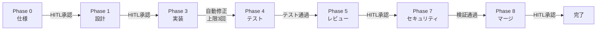

本記事は、Padmaraj Madatha氏が2026年6月に発表した論文 "A Deterministic Control Plane for LLM Coding Agents"（arXiv: 2606.26924）の解説記事です。10,008リポジトリの調査でLLMエージェント設定のガバナンスギャップを明らかにし、制御プレーンRel(AI)Buildを提案した研究を紹介します。

関連Zenn記事: [LangGraph Pregel実行モデルで理解するステートマシン設計原則](https://zenn.dev/0h_n0/articles/7cfcf58c6bcf9a)。本論文はガバナンス・セキュリティ層を扱い、ステートマシン設計原則と相互補完的です。

## 情報源

- **論文タイトル**: A Deterministic Control Plane for LLM Coding Agents
- **著者**: Padmaraj Madatha
- **arXiv ID**: [2606.26924](https://arxiv.org/abs/2606.26924)
- **発表日**: 2026年6月25日
- **ページ数**: 45ページ（図9点、表13点）
- **データセット**: Zenodo公開

## 背景と動機

2025年から2026年にかけて、Cursor、Claude Code、VS Code等のLLMコーディングエージェントIDEが急速に普及した。これらのエージェントはシステムレベルの実行権限を持ち、サードパーティのスキルで機能を拡張できる。

著者はこのエコシステムに重大なガバナンスギャップが存在すると指摘している。

1. **パーミッション宣言の欠如**: GitHub Actionsワークフローでは33%がパーミッション境界を宣言しているのに対し、エージェント設定ファイルでは1%未満にとどまる
2. **設定の無秩序な複製**: 組織境界を越えた設定ファイルのコピーが横行し、出所の追跡が困難
3. **メンテナンスの不在**: 設定ファイルの58%が単一コミット履歴（作成後一度も更新されていない）
4. **認証情報の露出**: 約3.18%のリポジトリでAPIキー等の認証情報が設定ファイル内に発見

こうした状況は、Codecov 2021、ua-parser-js 2021、xz-utils（CVE-2024-3094）、LiteLLM 2026等の実インシデントを考えると現実的な脅威である。OWASP Top 10 for Agentic Applications（2025年12月）でもASI04としてエージェントサプライチェーン脆弱性が挙げられている。

## 主要な貢献

著者は本論文で以下の4つの貢献を報告している。

1. **大規模実態調査**: 10,008リポジトリから6,145のエージェント設定ファイルを収集・分析し、エージェント設定のセキュリティ実態を定量的に示した
2. **Rel(AI)Buildフレームワーク**: コンテンツアドレッシング、段階的パーミッション、フェーズゲート型ライフサイクルを統合した決定論的制御プレーンの提案
3. **7 IDEターゲットへのコンパイル**: 単一のMarkdown+YAML定義から7つのIDEネイティブ形式への変換機構
4. **適合性テスト**: 237定義 x 7ターゲットの変換整合性、改竄検知、権限超過検知、ブロックリスト検知の検証

## 技術的詳細

### 3プレーンアーキテクチャ

Rel(AI)Buildは3つの独立したプレーン（層）で構成される。

**Authoring & Distribution Plane（著作・配信層）**では、エージェント設定を5つのリソースピラー（Agents、Skills、Knowledge shards、Profiles、Workflows）に分類し、SHA-256コンテンツハッシュによる正規レジストリで管理する。インストール時にハッシュを再計算し、不一致があれば処理を中止する。

**Compilation Plane（コンパイル層）**では、Markdown+YAMLの統一定義をCursor、Claude Code、VS Code、Codex、Windsurf、OpenCode、Kiroの7つのIDEネイティブ形式に変換する。

**Runtime-Governance Plane（実行時ガバナンス層）**では、IDEフック（pre-commit、pre-pushなど）を通じてパーミッション検証とブロックリスト照合を実施する。

### 5段階パーミッションモデル

著者は以下の5段階のパーミッションティアを定義している。

| ティア | 許可操作 | 用途例 |
|--------|----------|--------|
| `readonly` | read, glob, grep, search | コード探索 |
| `scribe` | readonlyに加え、パス制限付き書き込み | ドキュメント生成 |
| `operations` | scribeに加え、Git/CI/デプロイ | DevOps自動化 |
| `specialist` | operationsに加え、コーディング/分析 | 開発タスク |
| `orchestrator` | 制限なし | フルアクセス |

各ティアは包含関係にあり、上位ティアは下位ティアの権限を全て含む。エージェントの操作要求は実行前にティア照合され、権限外の操作は拒否される。

### フェーズゲート型ライフサイクル

著者はソフトウェア開発ライフサイクルを8フェーズに分割し、各フェーズ間にゲート条件を設定している。



HITL（Human-In-The-Loop）ゲートは仕様（Phase 0）、設計（Phase 1）、レビュー（Phase 5）、マージ（Phase 8）で必須とされている。Phase 3（実装）では自動修正の上限が3回に制限されており、3回を超えた場合はHITLへエスカレーションされる。

### Jaccard類似度によるプロンプトドリフト検知

エージェントが長い会話の中でタスクの範囲から逸脱する「プロンプトドリフト」を検知するために、著者はJaccard類似度を用いている。

元の仕様トークン集合を $A$、現在のプロンプトトークン集合を $B$ とすると、Jaccard類似度 $J(A, B)$ は以下で定義される。

$$
J(A, B) = \frac{|A \cap B|}{|A \cup B|}
$$

ここで $\|A \cap B\|$ は両集合の共通トークン数、$\|A \cup B\|$ は両集合の和集合のトークン数である。

ドリフトレベルの判定基準は以下の通りである。

| ドリフトレベル | Jaccard類似度 $J$ | アクション |
|---------------|-------------------|-----------|
| LOW | $J \geq 0.80$ | 続行 |
| MEDIUM | $0.60 \leq J < 0.80$ | 警告ログ出力 |
| HIGH | $J < 0.60$ | 実行停止・HITLエスカレーション |

### サプライチェーンセキュリティ機構

改竄検知は以下の3層で構成される。

1. **SHA-256コンテンツアドレッシング**: レジストリ上のハッシュとインストール時の再計算値を照合し、不一致で中止
2. **HMAC-SHA256ロックファイル**: マシンローカルキーによるロックファイル完全性検証
3. **追記専用監査ログ**: JSONL形式のSHA-256ハッシュチェーン。各エントリが前エントリのハッシュを含み途中改竄を検知

## アルゴリズム

### パーミッション検証

以下は、エージェントの操作要求に対するパーミッション検証の擬似実装である。

```python
from dataclasses import dataclass
from enum import IntEnum


class PermissionTier(IntEnum):
    """5段階パーミッションティア（包含関係）。

    上位ティアは下位ティアの全権限を含む。
    readonly < scribe < operations < specialist < orchestrator
    """

    READONLY = 0
    SCRIBE = 1
    OPERATIONS = 2
    SPECIALIST = 3
    ORCHESTRATOR = 4


# 各操作が必要とする最低ティア
OPERATION_TIER_MAP: dict[str, PermissionTier] = {
    "read": PermissionTier.READONLY,
    "glob": PermissionTier.READONLY,
    "grep": PermissionTier.READONLY,
    "search": PermissionTier.READONLY,
    "write": PermissionTier.SCRIBE,
    "git_commit": PermissionTier.OPERATIONS,
    "git_push": PermissionTier.OPERATIONS,
    "deploy": PermissionTier.OPERATIONS,
    "code_edit": PermissionTier.SPECIALIST,
    "analyze": PermissionTier.SPECIALIST,
    "execute_arbitrary": PermissionTier.ORCHESTRATOR,
}


@dataclass(frozen=True)
class PermissionCheckResult:
    """パーミッション検証結果。"""

    allowed: bool
    agent_tier: PermissionTier
    required_tier: PermissionTier
    operation: str


def check_permission(
    agent_tier: PermissionTier,
    operation: str,
) -> PermissionCheckResult:
    """エージェントの操作要求に対するパーミッション検証を行う。

    Args:
        agent_tier: エージェントに付与されたパーミッションティア。
        operation: 要求された操作名。

    Returns:
        PermissionCheckResult: 検証結果（許可/拒否と根拠）。

    Raises:
        ValueError: 未知の操作名が指定された場合。
    """
    if operation not in OPERATION_TIER_MAP:
        raise ValueError(f"Unknown operation: {operation}")

    required_tier = OPERATION_TIER_MAP[operation]
    allowed = agent_tier >= required_tier

    return PermissionCheckResult(
        allowed=allowed,
        agent_tier=agent_tier,
        required_tier=required_tier,
        operation=operation,
    )
```

### プロンプトドリフト検知

以下は、Jaccard類似度によるドリフト検知の実装例である。

```python
from enum import Enum


class DriftLevel(Enum):
    """プロンプトドリフトの深刻度レベル。

    Jaccard類似度の閾値に基づく3段階の分類。
    """

    LOW = "low"
    MEDIUM = "medium"
    HIGH = "high"


def compute_jaccard_similarity(tokens_a: set[str], tokens_b: set[str]) -> float:
    """2つのトークン集合のJaccard類似度を計算する。

    Args:
        tokens_a: 元の仕様から抽出したトークン集合。
        tokens_b: 現在のプロンプトから抽出したトークン集合。

    Returns:
        Jaccard類似度 J(A, B) = |A ∩ B| / |A ∪ B|。
        両集合が空の場合は1.0を返す。
    """
    if not tokens_a and not tokens_b:
        return 1.0

    intersection = tokens_a & tokens_b
    union = tokens_a | tokens_b
    return len(intersection) / len(union)


def detect_drift(
    spec_tokens: set[str],
    current_tokens: set[str],
    low_threshold: float = 0.80,
    medium_threshold: float = 0.60,
) -> tuple[DriftLevel, float]:
    """プロンプトドリフトを検知する。

    仕様トークン集合と現在のプロンプトトークン集合の
    Jaccard類似度を計算し、ドリフトレベルを判定する。

    Args:
        spec_tokens: 元の仕様から抽出したトークン集合。
        current_tokens: 現在のプロンプトから抽出したトークン集合。
        low_threshold: LOWドリフトの下限閾値（デフォルト: 0.80）。
        medium_threshold: MEDIUMドリフトの下限閾値（デフォルト: 0.60）。

    Returns:
        (DriftLevel, Jaccard類似度) のタプル。
    """
    similarity = compute_jaccard_similarity(spec_tokens, current_tokens)

    if similarity >= low_threshold:
        level = DriftLevel.LOW
    elif similarity >= medium_threshold:
        level = DriftLevel.MEDIUM
    else:
        level = DriftLevel.HIGH

    return level, similarity
```

## 実装のポイント

本論文のRel(AI)Buildを実装する際に考慮すべき技術的ポイントを整理する。

**コンテンツアドレッシングの粒度**: SHA-256ハッシュはファイル単位で計算される。設定ファイルの一部だけを変更した場合でもハッシュが完全に変わるため、差分管理にはロックファイル内のバージョン情報との併用が必要である。

**コンパイルターゲットの拡張性**: 7つのIDEターゲットへの変換は、各IDEの設定形式をテンプレートとして定義し、Markdown+YAMLの共通定義からフィールドマッピングで変換する方式をとっている。新しいIDEが登場した場合はテンプレートの追加のみで対応できる設計となっている。

**ブロックリスト管理**: 攻撃由来のブロックリストは正規表現パターンで定義されている。Codecov 2021（`CODECOV_TOKEN`の外部送信パターン）、ua-parser-js 2021（`preinstall`スクリプトによるバイナリ実行パターン）、xz-utils CVE-2024-3094（ビルドスクリプト改竄パターン）などの実インシデントから抽出されたパターンが含まれる。

**監査ログのハッシュチェーン**: JSONL形式の各行が前の行のSHA-256ハッシュを含む構造である。これによりログの途中挿入や削除が検知可能になるが、ログファイルの末尾追記は正規の操作として区別する必要がある。

## Production Deployment Guide

Rel(AI)Buildの制御プレーンをAWS上にデプロイする場合の構成を、チーム規模別に整理する。以下の料金概算は2026年7月時点のAWS東京リージョン（ap-northeast-1）の公開料金に基づく。

### Small構成: Lambda + DynamoDB + S3

10名以下のチームで、月間リクエスト数が10万件以下の場合に適している。

**アーキテクチャ**:
- **API Gateway + Lambda**: パーミッション検証、ハッシュ照合、ドリフト検知の各エンドポイントをLambda関数として実装
- **DynamoDB**: 設定メタデータ（ハッシュ、バージョン、パーミッションティア）の保存。オンデマンドキャパシティモード
- **S3**: 設定ファイル本体とコンパイル済みIDEターゲットの保存。レジストリのバックエンド

**Terraformリソース例（抜粋）**:

```hcl
resource "aws_dynamodb_table" "config_metadata" {
  name         = "relaibuild-config-metadata"
  billing_mode = "PAY_PER_REQUEST"
  hash_key     = "content_hash"
  range_key    = "version"

  attribute {
    name = "content_hash"
    type = "S"
  }
  attribute {
    name = "version"
    type = "N"
  }
  point_in_time_recovery { enabled = true }
}

resource "aws_lambda_function" "permission_check" {
  function_name = "relaibuild-permission-check"
  runtime       = "python3.13"
  handler       = "handler.check_permission"
  memory_size   = 256
  timeout       = 10
  environment {
    variables = {
      TABLE_NAME  = aws_dynamodb_table.config_metadata.name
    }
  }
  filename         = data.archive_file.lambda_zip.output_path
  source_code_hash = data.archive_file.lambda_zip.output_base64sha256
  role             = aws_iam_role.lambda_exec.arn
}
```

**月額コスト概算（東京リージョン）**:
- Lambda: 月100万リクエスト、平均200ms、256MB → 無料枠内で約$0（無料枠超過分: $0.20/100万リクエスト + $0.0000166667/GB-秒）
- DynamoDB: オンデマンド、100GB以下 → 約$28.50（ストレージ） + 読み書きリクエスト料金
- S3: 10GB保存 + 月10万リクエスト → 約$0.25 + リクエスト料金
- **合計: 月額約$30-50**

### Medium構成: ECS Fargate + ElastiCache

50名規模のチームで、月間リクエスト数が100万件程度の場合に適している。

**アーキテクチャ**:
- **ECS Fargate**: パーミッション検証・コンパイルサービスをコンテナとして稼働。ALBでロードバランシング
- **ElastiCache（Redis）**: ハッシュ照合結果のキャッシュ。頻繁に参照される設定のハッシュをキャッシュし、DynamoDBへのアクセスを削減
- **DynamoDB + S3**: Small構成と同様だが、DynamoDBはプロビジョンドキャパシティに変更

**追加コンポーネント**:
- CloudWatch Logs + CloudWatch Metrics: 監査ログの集約と可視化
- WAF: API Gatewayの前段に配置し、不正リクエストをフィルタリング

**月額コスト概算**:
- ECS Fargate: 2タスク x 0.5 vCPU x 1GB、常時稼働 → 約$50-70
- ElastiCache: cache.t3.micro x 1ノード → 約$15-20
- ALB: 1台 → 約$20 + LCU料金
- DynamoDB + S3: 約$50-80
- **合計: 月額約$150-250**

### Large構成: EKS + Karpenter

100名以上の組織で、月間リクエスト数が1,000万件以上、複数プロジェクトで共用する場合に適している。

**アーキテクチャ**:
- **EKS**: Kubernetesクラスタ上で制御プレーンの各コンポーネントをマイクロサービスとして運用
- **Karpenter**: ノードのオートスケーリング。コンパイルジョブの負荷に応じてノードを動的にプロビジョニング
- **Aurora DynamoDB互換 or Aurora PostgreSQL**: 大規模メタデータ管理
- **S3 + CloudFront**: レジストリのグローバル配信

**月額コスト概算**:
- EKS コントロールプレーン: $73（固定）
- EC2ノード（Karpenter管理）: m6i.xlarge x 3-10台 → 約$400-1,400
- Aurora: db.r6g.large x 2台（マルチAZ）→ 約$500-700
- その他（CloudFront、WAF、監視）→ 約$100-200
- **合計: 月額約$1,100-2,400**

### 監視設計

いずれの構成でも、以下のメトリクスを監視することが推奨される。

| メトリクス | 閾値 | アラート先 |
|-----------|------|-----------|
| パーミッション拒否率 | 5%超過 | PagerDuty/Slack |
| ハッシュ不一致件数 | 1件以上 | セキュリティチーム即時通知 |
| ドリフト HIGH発生数 | 日次3件以上 | チームリード |
| コンパイルエラー率 | 1%超過 | 開発チーム |
| API応答時間 P99 | 500ms超過 | SREチーム |

### コスト最適化チェックリスト

- [ ] Lambda関数のメモリサイズを実測に基づき調整（AWS Lambda Power Tuning利用）
- [ ] DynamoDBのキャパシティモードを利用パターンに応じて選択（オンデマンド vs プロビジョンド）
- [ ] S3のライフサイクルポリシーで古いコンパイル済みアーティファクトをGlacierに移行
- [ ] ElastiCacheのTTLを適切に設定し、キャッシュヒット率80%以上を維持
- [ ] Reserved InstancesまたはSavings Plansの適用（Medium/Large構成）
- [ ] CloudWatch Logsの保持期間を監査要件に応じて設定（デフォルト無期限から変更）
- [ ] Karpenter使用時はSpot Instanceの比率を非クリティカルワークロードで50%以上に設定

## 実験結果

著者は10,008の公開GitHubリポジトリから6,145のエージェント設定ファイルを収集し、以下の分析結果を報告している。

### リポジトリ調査の定量データ

| 指標 | 値 | 備考 |
|------|-----|------|
| 調査リポジトリ数 | 10,008 | 公開GitHubリポジトリ |
| エージェント設定ファイル数 | 6,145 | 7 IDE形式を対象 |
| SHA-256完全重複率 | 10.1% | フォーク調整後 |
| 組織境界を越える重複率 | 75.51% | クローンペア中 |
| 単一コミット履歴の割合 | 58.45% | 作成後更新なし |
| 月間平均コミット数 | 0.4-0.6 | 設定ファイル当たり |
| パーミッション宣言率（エージェント設定） | 1%未満 | 全設定ファイル中 |
| パーミッション宣言率（GitHub Actions） | 33% | 比較対象 |
| 認証情報露出率 | 約3.18% | 31リポジトリに1つ |

### 適合性テスト結果

適合性テストの結果は以下の通りである。

| テスト項目 | テスト数 | 検出率 |
|-----------|---------|--------|
| 定義変換整合性（237定義 x 7ターゲット） | 1,659 | 全件整合 |
| 整合性改竄検知 | 10 | 全件検出（100%） |
| 権限超過検知 | 15 | 全件検出（100%） |
| ブロックリスト文字列検知 | 20 | 全件検出（100%） |

全テストで不変条件が維持されたと報告されているが、テスト規模は限定的である。

### 要件追跡

仕様にコンテンツハッシュを付与し、ACからファイルへのマッピングを維持することで、スコープクリープを検知できるとしている。

## 実運用への応用

本論文の知見を実運用に適用する際のポイントを整理する。

**段階的導入**: まずパーミッションティアの宣言、次にコンテンツアドレッシング、最後にフェーズゲートの順で導入することが現実的である。パーミッション宣言だけでも「1%未満」の現状から大きな改善が見込める。

**既存CI/CDとの統合**: フェーズゲートはGitHub Actions等のステージとして実装可能で、HITLゲートはPRレビューフローに対応する。

**ドリフト検知の運用**: 閾値は組織特性に応じた調整が必要である。論文のデフォルト値は出発点であり、偽陽性・偽陰性率を見ながらチューニングが推奨される。

**マルチIDEチームでの活用**: 異なるIDEを使うメンバーがいる場合、単一定義からコンパイルすることで設定の一貫性を保てる。適合性テストのような検証の自動化が重要である。

## 関連研究

本論文と関連する研究を3件紹介する。

**Qu et al. (2025) "Supply-Chain Poisoning Attacks Against LLM Coding Agent Skill Ecosystems"**（[arXiv: 2604.03081](https://arxiv.org/abs/2604.03081)）は、スキルのドキュメント内コード例に有害命令を埋め込むDDIPE手法を提案し、4フレームワーク x 5モデルで11.6%-33.5%のバイパス率を報告している。Rel(AI)Buildのブロックリストとコンテンツアドレッシングはこの種の攻撃への防御策として位置づけられる。

**Wu et al. (2026) "Provably Secure Agent Guardrail"**（[arXiv: 2605.29251](https://arxiv.org/abs/2605.29251)）は、エージェントの操作意図を一階述語論理で形式化するePCAフレームワークを提案し、攻撃成功率ゼロ・偽陽性率ゼロを報告している。Rel(AI)Buildが実用的パーミッションモデルに基づくのに対し、ePCAは形式検証による理論的保証を追求しておりアプローチが異なる。

**Chen et al. (2025) "Clawed and Dangerous: Can We Trust Open Agentic Systems?"**（[arXiv: 2603.26221](https://arxiv.org/abs/2603.26221)）は、50本の論文をサーベイし、デプロイ制御・運用ガバナンス・権限剥奪の文献不足を報告している。Rel(AI)Buildはこの「運用ガバナンスの空白」を埋めることを目指した研究である。

## まとめ

本論文は、LLMコーディングエージェントの設定ファイルに関する初の大規模実態調査（10,008リポジトリ）を行い、パーミッション宣言の欠如（1%未満）、設定の無秩序な複製（75.51%が組織境界越え）、認証情報の露出（3.18%）といった深刻なガバナンスギャップを定量的に示した。

この問題に対し、コンテンツアドレッシング、5段階パーミッション、フェーズゲート、ドリフト検知を統合した制御プレーンRel(AI)Buildを提案し、7 IDEターゲットへのコンパイルで統一的ガバナンスを実現している。適合性テストでは全ての不変条件が維持されたと報告されている。

ただし、適合性テストの規模は限定的であり、大規模実運用環境での検証は今後の課題である。攻撃由来ブロックリストは既知インシデントに基づくため、未知の攻撃への対応力は未評価である。

エージェント設定をサプライチェーンの一部として管理する視点は、GitHub Actionsの成熟度と比較してエージェント設定が遅れている現状を考えると、実務的に重要な方向性である。

## 参考文献

1. Madatha, P. (2026). A Deterministic Control Plane for LLM Coding Agents. arXiv:2606.26924. [https://arxiv.org/abs/2606.26924](https://arxiv.org/abs/2606.26924)
2. Qu, Y., Liu, Y., Geng, T., Deng, G., Li, Y., Zhang, L. Y., Zhang, Y., & Ma, L. (2025). Supply-Chain Poisoning Attacks Against LLM Coding Agent Skill Ecosystems. arXiv:2604.03081. [https://arxiv.org/abs/2604.03081](https://arxiv.org/abs/2604.03081)
3. Wu, B., Zhang, W., Chen, K., Fang, H., & Yu, N. (2026). Provably Secure Agent Guardrail. arXiv:2605.29251. [https://arxiv.org/abs/2605.29251](https://arxiv.org/abs/2605.29251)
4. Chen, S., Wang, Q., Yu, G., Wang, X., & Zhu, L. (2025). Clawed and Dangerous: Can We Trust Open Agentic Systems? arXiv:2603.26221. [https://arxiv.org/abs/2603.26221](https://arxiv.org/abs/2603.26221)
5. OWASP. (2025). OWASP Top 10 for Agentic Applications. [https://owasp.org/www-project-top-10-for-large-language-model-applications/](https://owasp.org/www-project-top-10-for-large-language-model-applications/)
