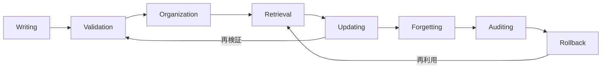

本記事は、Ding, Nannapaneni, Liu, Zhang (2026) による arXiv 論文 "Always-On Agents: A Survey of Persistent Memory, State, and Governance in LLM Agents" の解説記事です。LLMエージェントが単発の応答を超えて「常時稼働」するために必要な永続的状態管理を、435件の文献コーパスから体系的に整理したサーベイ論文の内容を紹介します。

この記事は [Zenn記事: LangGraph Pregel実行モデルで理解するステートマシン設計原則](https://zenn.dev/0h_n0/articles/7cfcf58c6bcf9a) の深掘りです。LangGraphにおけるState設計やチェックポインターの背景にある学術的フレームワークを理解することで、実装上の設計判断に理論的裏付けを持たせることを目指します。

## 情報源

| 項目 | 内容 |
|------|------|
| タイトル | Always-On Agents: A Survey of Persistent Memory, State, and Governance in LLM Agents |
| 著者 | Tianyu Ding, Aditya Nannapaneni, Bingfan Liu, Ling Zhang |
| arXiv ID | [2606.30306](https://arxiv.org/abs/2606.30306) |
| 発表年 | 2026年6月 |
| 分野 | cs.AI (Artificial Intelligence) |

## 背景と動機

LLMエージェントの研究は近年急速に進展しているが、その多くは単一セッション内でのタスク遂行に焦点を当てている。著者らは、現実世界のエージェントシステムが直面する根本的な課題として、**セッションをまたいで状態を維持し、その状態に基づいて将来の行動を適応させる能力**が十分に研究されていない点を指摘している。

具体的には、以下の問題意識が本サーベイの出発点となっている。

第一に、既存のエージェント研究は「記憶の蓄積と検索」に偏重しており、状態の検証・監査・回復・忘却といったライフサイクル全体をカバーする研究が不足している。著者らは435件のコーパスを分析した結果、文献の大部分が状態の書き込みと検索に集中していることを定量的に確認したと報告している。

第二に、LLMエージェントの状態管理は本質的に学際的な問題であるにもかかわらず、データベース理論、分散システム、形式手法、ケイパビリティセキュリティ、機械忘却といった隣接分野との接続が体系化されていない。著者らは、これらの分野で数十年にわたり蓄積された知見がエージェント設計に直接活用可能であると主張している。

第三に、エージェントの評価手法が「回答品質」に偏っており、状態変異の安全性や回復可能性といった運用上の観点を評価するベンチマークが存在しない。この空白を埋めるために、著者らは新たな評価プロトコルの提案も行っている。

## 主要な貢献

著者らは本サーベイにおいて以下の4つの貢献を報告している。

### 1. Always-Onエージェントの形式的定義

著者らは「Always-Onエージェント」を、**永続的な状態に基づいて将来の行動が変わるシステム**として定義している。この定義は、単に長時間稼働するエージェントではなく、過去の状態が現在および将来の振る舞いに因果的影響を与えるシステムを指す。これにより、単発のチャットボットとの明確な境界線が引かれている。

### 2. 6軸診断フレームワーク

エージェントが保持する状態項目を分析するための6つの独立した軸を提案している。この軸により、異なるエージェントシステム間の状態管理設計を統一的な語彙で比較可能にしている。詳細は後述の「技術的詳細」セクションで解説する。

### 3. 状態ライフサイクルモデル

状態の生成から廃棄までを8段階で記述するモデルを提案している。既存研究がライフサイクルの初期段階（書き込み・検索）に集中している一方で、後期段階（忘却・監査・ロールバック）に大きな研究ギャップが存在することを示している。

### 4. AOEP-v0評価プロトコル

回答品質ではなく、状態変異と回復義務をスコアリングする評価フレームワーク「AOEP-v0」を提案している。これは、エージェントが状態を正しく管理できているかを定量的に評価するための初めての体系的な試みとして位置づけられている。

## 技術的詳細

### 6軸診断フレームワーク

著者らが提案する6軸診断フレームワークは、エージェントの状態項目を以下の6つの独立した軸で分析するものである。

**Authority（権限）**: 誰がその状態を作成・変更できるかを規定する軸である。エージェント自身が自律的に変更できる状態、ユーザーの明示的な許可が必要な状態、システム管理者のみが変更可能な状態など、権限レベルを明確化する。著者らは、多くの既存システムがこの軸を暗黙的にしか定義しておらず、権限の曖昧さがセキュリティ上の問題を引き起こしうると指摘している。

**Scope（範囲）**: 状態の影響範囲を規定する軸である。セッション内（session-local）、クロスセッション（cross-session）、グローバル（global）の3段階が定義されている。セッション内の状態は1回の対話で消失するのに対し、クロスセッションの状態は同一ユーザーの複数セッションにわたって保持される。グローバルな状態は複数ユーザー・複数エージェント間で共有される。

**Mutability（可変性）**: 状態が変更可能か読み取り専用かを規定する軸である。不変（immutable）な状態は一度書き込まれると変更できず、監査ログのように履歴の完全性が求められる場面で使用される。可変（mutable）な状態はエージェントの学習や適応に使用されるが、変更の追跡が困難になるリスクがある。

**Provenance（来歴）**: 状態の出所を追跡可能にする軸である。ある状態項目がいつ、誰によって、どのような文脈で作成・変更されたかを記録する能力を指す。著者らは、来歴の追跡が不十分なシステムでは「幻覚記憶」（hallucinated memory）のリスクが高まると警告している。

**Recoverability（回復可能性）**: 障害時の状態復旧メカニズムを規定する軸である。チェックポイント、ジャーナリング、イベントソーシングなどの手法が含まれる。著者らは、分散システムにおけるACID特性やSagaパターンとの接続を示唆している。

**Actionability（実行可能性）**: 状態がエージェントの行動にどう影響するかを規定する軸である。状態が単なる参照情報にとどまるのか、エージェントの次の行動を直接トリガーするのか、あるいは行動の制約条件として機能するのかを分類する。

これら6軸は直交的に設計されており、任意の状態項目を6次元のベクトルとして表現できる。形式的には、状態項目 $s$ に対して以下のタプルで表現される:

$$
\text{Diag}(s) = \langle A(s), S(s), M(s), P(s), R(s), \text{Act}(s) \rangle
$$

ここで、$A$ は Authority、$S$ は Scope、$M$ は Mutability、$P$ は Provenance、$R$ は Recoverability、$\text{Act}$ は Actionability をそれぞれ表す。各軸は離散的なレベル（例: Scope であれば session-local / cross-session / global）で値を取る。

### 状態ライフサイクルモデル

著者らは状態の生成から廃棄までを以下の8段階で記述するモデルを提案している。



各段階の概要は以下のとおりである。

1. **Writing（書き込み）**: 状態項目の初期生成。エージェントの観測、ユーザー入力、外部APIの応答などが状態として記録される。

2. **Validation（検証）**: 書き込まれた状態の整合性・妥当性を検証する段階。スキーマ検証、型チェック、矛盾検出などが含まれる。

3. **Organization（整理）**: 検証済みの状態を検索可能な形式に整理する段階。インデックス構築、分類、関連付けなどが含まれる。

4. **Retrieval（検索）**: 必要な状態を効率的に取得する段階。ベクトル検索、キーワード検索、グラフ走査などの手法が用いられる。

5. **Updating（更新）**: 既存の状態を新しい情報に基づいて変更する段階。マージ戦略、競合解決、バージョン管理などが課題となる。

6. **Forgetting（忘却）**: 不要になった状態を明示的に削除または無効化する段階。機械忘却（machine unlearning）の手法や、プライバシー要件に基づく削除が含まれる。

7. **Auditing（監査）**: 状態の変更履歴を検証・追跡する段階。コンプライアンス要件への対応や、エージェントの振る舞いの説明可能性を担保する。

8. **Rollback（ロールバック）**: 障害時に状態を過去の安全な時点に戻す段階。チェックポイントからの復元やイベントの再生が含まれる。

著者らは435件のコーパスを分析した結果、研究の大部分がWriting段階とRetrieval段階に集中していることを報告している。一方で、Forgetting、Auditing、Rollbackの3段階については研究が著しく不足しており、特にForgettingについては機械忘却の分野との接続が未開拓であると指摘している。

### 永続状態の分類

著者らはエージェントが保持する永続状態を以下の9種類に分類している。

**1. Retrievable memories（検索可能な記憶）**: エージェントが過去の対話や観測から学習した知識。エピソード記憶（具体的な出来事の記録）とセマンティック記憶（一般化された知識）の両方が含まれる。著者らは、この種類の状態が最も研究の蓄積が多い領域であると報告している。

**2. Task ledgers（タスク台帳）**: 進行中のタスクの進捗、依存関係、完了状況を記録する状態。マルチステップのタスク遂行において、エージェントが「今どこまで完了しているか」を追跡するために使用される。

**3. Permissions（権限）**: エージェントがどのリソースにアクセスでき、どの操作を実行できるかを定義する状態。ケイパビリティセキュリティモデルとの接続が示唆されている。

**4. Credentials（認証情報）**: APIキー、トークン、証明書などの認証に関する状態。著者らは、認証情報の安全な管理がエージェントの実運用における重要な課題であると指摘している。

**5. Commitments（コミットメント）**: エージェントが外部に対して行った約束や契約。例えば「毎朝9時にレポートを送信する」といったスケジュール上の約束が含まれる。

**6. Provenance and audit records（来歴・監査記録）**: 状態変更の履歴を不変に記録したログ。説明可能性と規制遵守のために必要とされる。

**7. Shared state（共有状態）**: 複数のエージェント間で共有される状態。マルチエージェントシステムにおける協調のために使用されるが、一貫性の維持が課題となる。

**8. Trigger conditions（トリガー条件）**: 特定の条件が満たされた際にエージェントの行動を起動する状態。イベント駆動アーキテクチャにおけるルールベースに相当する。

**9. Externally committed effects（外部コミット効果）**: エージェントが外部システムに対して実行した副作用の記録。データベースへの書き込み、メール送信、API呼び出しなど、取り消し不可能な操作の追跡に使用される。

## 分類フロー

著者らが提案する状態分析の手順を以下に整理する。エージェントシステムの設計者は、まず保持する状態項目を列挙し、次に各項目を9種類の永続状態カテゴリに分類した上で、6軸診断を適用する。

```
procedure AnalyzeAgentState(agent):
    state_items = EnumerateStateItems(agent)
    for each item s in state_items:
        category = ClassifyState(s)  // 9種類のいずれかに分類
        diag = ComputeDiagnosis(s)   // 6軸診断の適用
            diag.authority   = DetermineAuthority(s)
            diag.scope       = DetermineScope(s)
            diag.mutability  = DetermineMutability(s)
            diag.provenance  = DetermineProvenance(s)
            diag.recoverability = DetermineRecoverability(s)
            diag.actionability  = DetermineActionability(s)
        lifecycle_coverage = MapToLifecycle(s)  // 8段階のどこまでカバーされているか
        gaps = IdentifyGaps(lifecycle_coverage)
    return AnalysisReport(state_items, categories, diagnoses, gaps)
```

この手順により、状態管理の設計において「何を保持し、誰が変更でき、どのように復旧するか」を体系的に検討できる。

## 実装のポイント: LangGraphのState設計との関連

本サーベイの6軸診断フレームワークは、LangGraphにおけるState設計の各要素と直接対応づけることができる。以下にその関連を整理する。

### State（唯一の真実）とScope軸

LangGraphでは、`TypedDict`や`Pydantic`モデルで定義される`State`がグラフ実行の「唯一の真実の源」（Single Source of Truth）として機能する。これは本サーベイにおけるScope軸の設計判断に直結する。LangGraphのStateはデフォルトではセッション内（session-local）の状態であるが、チェックポインターを導入することでクロスセッション（cross-session）の状態に昇格させることができる。

著者らの枠組みに沿えば、LangGraphの設計者はState内の各フィールドについてScopeを明示的に決定することが求められる。例えば、`messages`フィールドは通常セッション内で十分であるが、ユーザーの好み（preferences）はクロスセッションで保持する必要がある。

```python
from typing import Annotated
from typing_extensions import TypedDict
from langgraph.graph import add_messages

class AgentState(TypedDict):
    """エージェントの状態定義.

    6軸診断の観点:
    - messages: Scope=session-local, Mutability=append-only
    - user_preferences: Scope=cross-session, Mutability=mutable
    - audit_log: Scope=global, Mutability=immutable
    """

    messages: Annotated[list, add_messages]
    user_preferences: dict
    audit_log: list[dict]
```

### チェックポインターとRecoverability軸

LangGraphのチェックポインター（`MemorySaver`、`SqliteSaver`、`PostgresSaver`など）は、本サーベイのRecoverability軸に直接対応する。チェックポインターは各ノード実行後にStateのスナップショットを保存し、障害時のロールバックや対話履歴の再開を可能にする。

著者らは、Recoverability軸において以下の3段階を区別している:

- **No recovery**: チェックポイントなし。障害時に状態は完全に失われる。
- **Checkpoint-based**: 定期的なスナップショットからの復元。LangGraphの標準的なチェックポインターがこれに該当する。
- **Event-sourced**: すべての状態変更をイベントとして記録し、任意の時点の状態を再構成可能にする。

LangGraphのチェックポインターはCheckpoint-basedに分類されるが、`add_messages`のようなreducerを通じたイベントの蓄積はEvent-sourcedの要素も持つと解釈できる。

### context_schemaとScope軸

LangGraphの`context_schema`は、ランタイムに依存する情報（APIキー、ユーザーID、設定値など）をState定義から分離するための仕組みである。これは本サーベイのScope軸における「ランタイム依存の分離」に対応する。

著者らのフレームワークに基づけば、`context_schema`に格納される情報はScope=session-localかつAuthority=externalに分類される。すなわち、エージェント自身が変更する状態ではなく、外部から注入される状態であり、セッションごとに異なりうる。

### State MigrationとMutability軸

LangGraphではスキーマのバージョン管理が課題となる場合がある。Stateの定義を変更した際、既存のチェックポイントとの互換性を維持する必要がある。これは本サーベイのMutability軸に関連する。

著者らは、Mutability軸の検討において「スキーマ進化（schema evolution）」を重要な課題として挙げている。エージェントの長期稼働に伴い、状態のスキーマは必然的に変化するが、過去の状態との互換性を保ちつつ安全に移行する手法は十分に研究されていないと指摘している。

### エラー情報のState格納とActionability軸

LangGraphでは、ノード実行中に発生したエラー情報をStateに格納し、後続のノードがそのエラーに基づいて行動を分岐させることができる。これは本サーベイのActionability軸に対応する。

Actionability軸は、状態が「単なる参照情報」なのか「行動のトリガー」なのかを区別する。LangGraphにおいてStateに格納されたエラー情報は明確にActionability=highであり、条件分岐ノードがエラー状態を検出して再試行やフォールバック処理を行う設計パターンに直結する。

## 実験結果: 435件コーパスの分析

著者らは435件の文献コーパスを体系的に分析し、以下の知見を報告している。

### 研究分布の偏り

435件の文献を状態ライフサイクルの8段階にマッピングした結果、著者らは以下の偏りを報告している:

- **Writing（書き込み）** と **Retrieval（検索）** に研究が集中しており、コーパスの大部分がこの2段階に関連する内容を含んでいる
- **Forgetting（忘却）**、**Auditing（監査）**、**Rollback（ロールバック）** に関する研究は著しく不足している
- 特にForgettingについては、機械忘却（machine unlearning）の分野で蓄積された手法がエージェントの文脈ではほとんど適用されていない

### 永続状態カテゴリの研究蓄積

9種類の永続状態カテゴリについて、著者らは研究蓄積に大きな差異があることを報告している:

- **Retrievable memories** が最も研究蓄積が多く、RAG（Retrieval-Augmented Generation）やメモリ拡張型エージェントの文脈で多数の研究が存在する
- **Permissions**、**Credentials**、**Commitments** に関する研究は相対的に少なく、特にエージェントの権限管理に関する体系的な研究は限定的である
- **Externally committed effects** については、エージェントの副作用管理という観点からの研究がほぼ存在しない

### 学際的接続の不足

著者らは、エージェントの状態管理が本質的に学際的な問題であるにもかかわらず、以下の隣接分野との接続が不十分であることを指摘している:

- **データベース理論**: ACID特性、トランザクション管理、スキーマ進化などの概念がエージェント状態管理に直接適用可能であるが、明示的な接続を示す研究は少ない
- **分散システム**: CAP定理、Sagaパターン、最終的整合性などの概念がマルチエージェントの共有状態管理に関連するが、十分に活用されていない
- **形式手法**: 状態遷移の検証、不変条件の記述、モデル検査などがエージェントの安全性保証に有用であるが、適用例は限定的である
- **ケイパビリティセキュリティ**: 最小権限の原則に基づくアクセス制御がエージェントの権限管理に適用可能であるが、統合的な研究は少ない
- **機械忘却**: GDPRなどのプライバシー規制に対応するための選択的忘却がエージェントの文脈で研究されていない

### AOEP-v0プロトコル

著者らが提案するAOEP-v0（Always-On Evaluation Protocol version 0）は、従来のエージェント評価が回答品質に偏重していた問題に対処するものである。AOEP-v0では、以下の観点からエージェントの状態管理能力を評価する:

- **状態変異の安全性**: エージェントが状態を変更する際に、不整合や矛盾を引き起こさないか
- **回復義務の履行**: 障害発生時に、エージェントが適切にロールバックまたはリカバリを実行できるか
- **忘却義務の履行**: ユーザーからの削除要求に対して、エージェントが適切に状態を消去できるか

従来のベンチマーク（例: HotpotQA、ALFWorld等）が最終的な回答の正確性を評価するのに対し、AOEP-v0は**プロセスの安全性**を評価する点で一線を画している。

## 実運用への応用: 状態管理設計への示唆

本サーベイの知見は、LLMエージェントの状態管理を設計する際に以下の実践的な示唆を提供する。

### 設計時の6軸チェックリスト

エージェントシステムの設計者は、保持する各状態項目について6軸の値を明示的に決定すべきである。特に以下の観点が重要となる:

- **Authority**: ユーザーの明示的許可なしにエージェントが変更できる状態は最小限にとどめる
- **Scope**: セッション内で十分な状態をクロスセッションに昇格させると、プライバシーリスクとストレージコストが増大する
- **Recoverability**: 外部への副作用を伴う状態変更には、ロールバック戦略を事前に定義する

### ライフサイクル全体の設計

著者らの指摘に基づけば、WritingとRetrievalだけでなく、Forgetting、Auditing、Rollbackの設計も初期段階から考慮すべきである。特に以下の点が実運用で問題になりやすい:

- **Forgetting**: ユーザーが「この会話を忘れて」と要求した場合の処理パス
- **Auditing**: エージェントの意思決定過程を後から検証するための記録
- **Rollback**: ツール呼び出しが失敗した場合に、途中まで変更された状態を安全に戻す手順

### マルチエージェントシステムにおける共有状態

複数のエージェントが協調して動作するシステムでは、Shared stateの一貫性維持が課題となる。著者らは分散システムの知見を活用し、最終的整合性（eventual consistency）モデルの適用を示唆している。

## 関連研究

### MemGPT (Packer et al., 2023)

仮想コンテキスト管理を通じてLLMの有限コンテキスト窓を拡張するシステムである。ページングの概念をLLMのメモリ管理に適用し、コア記憶とアーカイブ記憶の階層構造を導入した。本サーベイの枠組みでは、MemGPTは主にRetrievable memoriesカテゴリのWritingとRetrieval段階に焦点を当てた研究に位置づけられる。著者らは、MemGPTがガバナンスや回復可能性については十分にカバーしていない点を指摘している。

### Voyager (Wang et al., 2023)

Minecraftを舞台にした自律的に学習するエージェントであり、スキルライブラリとして獲得した知識を永続化する仕組みを備えている。本サーベイの枠組みでは、スキルライブラリはMutability=mutableかつScope=cross-sessionの状態として分類される。著者らは、Voyagerのスキル管理がOrganizationとRetrievalの段階を実装している一方、忘却やロールバックのメカニズムは持たないと分析している。

### Generative Agents (Park et al., 2023)

25体のエージェントが仮想の町で生活するシミュレーションであり、各エージェントが記憶ストリームを保持し、反省（reflection）を通じて抽象的な知識を生成する。本サーベイの枠組みでは、記憶ストリームはProvenance軸が明確に定義された実装例として評価されている。各記憶項目にはタイムスタンプとアクセス記録が付与されており、来歴の追跡が可能となっている。

### A Survey on the Memory Mechanism of Large Language Model based Agents (Zhang et al., 2024)

LLMエージェントの記憶メカニズムに関するサーベイであり、短期記憶・長期記憶・ワーキングメモリの分類を提案している。本サーベイは、この研究を記憶に特化した前駆研究として位置づけつつ、記憶以外の永続状態（権限、認証情報、コミットメント等）を包括的にカバーすることで差別化を図っている。

## まとめと今後の展望

本サーベイは、LLMエージェントの永続状態管理を体系的に整理するための枠組みを提案した。6軸診断フレームワーク、8段階の状態ライフサイクルモデル、9種類の永続状態分類という3つの構造化ツールにより、エージェントの状態管理設計を統一的な語彙で議論する基盤を提供している。

435件のコーパス分析から明らかになった最大の研究ギャップは、状態のForgetting、Auditing、Rollbackに関する研究の不足である。著者らは、これらの段階が実運用においては不可避の要件であり、機械忘却、形式手法、分散システムといった隣接分野との接続によって研究が加速する可能性を示唆している。

LangGraphのようなステートマシンベースのエージェントフレームワークにとって、本サーベイの6軸診断フレームワークはState設計の理論的裏付けを提供するものである。特に、チェックポインターの設計をRecoverability軸の文脈で理解し、State Migrationの問題をMutability軸の観点から検討することで、より堅牢なエージェントシステムの設計が可能になると考えられる。

今後の研究課題として、著者らは以下を挙げている:
- AOEP-v0プロトコルに基づく実証的なベンチマークの構築
- マルチエージェントシステムにおける共有状態の一貫性モデルの確立
- プライバシー規制（GDPR等）に準拠した忘却メカニズムの開発
- 形式手法を用いた状態遷移の安全性検証

## 参考文献

1. Ding, T., Nannapaneni, A., Liu, B., & Zhang, L. (2026). Always-On Agents: A Survey of Persistent Memory, State, and Governance in LLM Agents. *arXiv preprint arXiv:2606.30306*. [https://arxiv.org/abs/2606.30306](https://arxiv.org/abs/2606.30306)

2. Packer, C., Wooders, S., Lin, K., Fang, V., Patil, S. G., Stoica, I., & Gonzalez, J. E. (2023). MemGPT: Towards LLMs as Operating Systems. *arXiv preprint arXiv:2310.08560*.

3. Wang, G., Xie, Y., Jiang, Y., Mandlekar, A., Xiao, C., Zhu, Y., Fan, L., & Anandkumar, A. (2023). Voyager: An Open-Ended Embodied Agent with Large Language Models. *arXiv preprint arXiv:2305.16291*.

4. Park, J. S., O'Brien, J. C., Cai, C. J., Morris, M. R., Liang, P., & Bernstein, M. S. (2023). Generative Agents: Interactive Simulacra of Human Behavior. *Proceedings of the 36th Annual ACM Symposium on User Interface Software and Technology (UIST '23)*.

5. Zhang, Z., et al. (2024). A Survey on the Memory Mechanism of Large Language Model based Agents. *arXiv preprint arXiv:2404.13501*.

6. LangGraph Documentation. [https://langchain-ai.github.io/langgraph/](https://langchain-ai.github.io/langgraph/)
