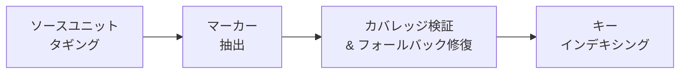

## 論文概要（Abstract）

本記事は [M-RAG: Semantic Key-Value Indexing for Retrieval-Augmented Generation](https://arxiv.org/abs/2603.26667)（arXiv:2603.26667, 2026年1月 v1 / 2026年7月 v2）の解説記事です。

M-RAGは、RAGシステムにおける検索（retrieval）と生成（generation）の要件の根本的な不一致を解決するセマンティックKey-Valueインデキシングフレームワークである。従来のチャンクベースRAGでは、同一のテキストチャンクが検索用インデックスエントリと生成用エビデンスペイロードの両方を担う。著者らは、この設計が検索精度とエビデンスの忠実性の間にトレードオフを生むと指摘し、「meta-marker」と呼ぶセマンティックKey-Valueレコードを導入することで両者を分離している。LongBench QAサブタスクでの評価において、特にトークン予算が制約された条件下で既存のチャンクベース手法に匹敵または優越するF1スコアを達成したと報告されている。

この記事は [Zenn記事: AWS Bedrock Knowledge Basesベクトルストア3択と本番RAG構成の設計指針](https://zenn.dev/0h_n0/articles/918cb94b30191e) の深掘りです。

## 情報源

- **arXiv ID**: 2603.26667
- **URL**: [https://arxiv.org/abs/2603.26667](https://arxiv.org/abs/2603.26667)
- **著者**: Xu Sun, Tongkai Xu, Baiheng Xie, Jun Zhang, Li Huang, Qiang Gao, Kunpeng Zhang
- **所属**: Southwestern University of Finance and Economics（中国）, University of Maryland（米国）
- **発表年**: 2026年（v1: 1月、v2: 7月）
- **分野**: cs.IR（情報検索）
- **コード**: [https://github.com/9sxx/M-RAG](https://github.com/9sxx/M-RAG)

## 背景と動機（Background & Motivation）

RAG（Retrieval-Augmented Generation）は、LLMに外部ドキュメントからのエビデンスを供給する標準的なアプローチとして広く普及している。しかし、著者らは現行のRAGシステムにおける根本的な設計上の緊張関係を指摘する。それは、**検索と生成が異なる種類のテキスト表現を必要とする**という点である。

検索フェーズでは、クエリと正確にマッチするコンパクトで弁別的なレコードが求められる。一方、生成フェーズでは、エンティティ、関係性、日付、談話構造などを保持する文脈的で忠実なエビデンスが必要となる。従来のチャンクベースRAGでは、同一のテキストチャンクが両方の役割を担っている。この設計には以下の問題がある。

- **小さなチャンク**: 検索精度は向上するが、回答に必要な情報が断片化される
- **大きなチャンク**: 文脈は保持されるが、ノイズが混入しトークン予算を浪費する
- **オーバーラップチャンク**: 境界エラーは軽減されるが、冗長性が増加し、検索用インデックスエントリと生成用ペイロードの結合は解消されない

Zenn記事で解説されているAWS Bedrock Knowledge Basesにおけるベクトルストア選定（OpenSearch Serverless、Aurora pgvector、Pinecone）の文脈でも、チャンクサイズの選択はRAG精度に直結する重要な設計判断である。M-RAGの提案は、この「チャンクサイズのジレンマ」をアーキテクチャレベルで解決しようとするものである。

## 主要な貢献（Key Contributions）

著者らは以下の4点を主要な貢献として報告している。

- **RAG検索のデータアクセス問題としての定式化**: インデックスエントリと生成ペイロードの結合をチャンクサイズトレードオフの根源として特定した
- **セマンティックKey-Valueマーカー表現の提案**: 検索キー（retrieval keys）、情報値（information values）、出自ポインタ（provenance pointers）の3フィールドを持つレコード構造を導入し、検索・生成・追跡可能性を異なるフィールドで扱えるようにした
- **オフライン構築+オンラインクエリ処理パイプラインの設計**: オフラインでのmeta-marker抽出・検証パイプラインと、予算制約下でのKey検索・Value組立のオンラインクエリ処理手続きを設計した
- **LongBench QAでの実験検証**: 3つのQAサブタスクにおいて、トークン予算が制約された条件下で既存手法に匹敵または優越する精度を達成し、高いドキュメントカバレッジと低い検索レイテンシを示した

## 技術的詳細（Technical Details）

### セマンティックKey-Valueレコードモデル

M-RAGの中核は、ドキュメントをセマンティックKey-Valueレコード（meta-marker）に変換する設計である。ドキュメントコレクション $\mathcal{D} = \{D_1, \ldots, D_N\}$ に対し、各ドキュメント $D_n$ はソースユニットの順序列として表現される。

$$
D_n = (s_{n,1}, \ldots, s_{n,L_n})
$$

ここで、$s_{n,j}$ は段落またはトークンベースのセグメントであり、$L_n$ はドキュメント $D_n$ のソースユニット数である。ソースユニット自体は検索の論理単位ではなく、出自追跡・カバレッジ検証・ソース順序再構成に使用される物理単位である。

M-RAGは各ドキュメントをmeta-markerの集合に変換する。

$$
\mathbf{M}_{D_n} = \{m_{n,1}, \ldots, m_{n,|\mathbf{M}_{D_n}|}\}
$$

各meta-markerは3つのフィールドを持つレコードである。

$$
m_{n,i} = \langle k_{n,i},\ v_{n,i},\ p_{n,i} \rangle
$$

ここで、
- $k_{n,i}$: **検索キー（Retrieval Key）** — クエリ向けのコンパクトな記述。密ベクトル検索またはBM25等のスパース語彙検索でマッチング可能
- $v_{n,i}$: **情報値（Information Value）** — 生成用の自己完結型エビデンスペイロード。エンティティ、属性、関係、日付等の回答に必要な詳細を保持
- $p_{n,i} \subseteq \{1, \ldots, L_n\}$: **出自ポインタ（Provenance Pointers）** — このレコードが由来するソースユニットのIDセット。カバレッジ検証とコンテキスト順序付けに使用

全マーカーコレクションは以下のように定義される。

$$
\mathcal{M} = \bigcup_{n=1}^{N} \mathbf{M}_{D_n}
$$

この設計の重要なポイントは、**キーは検索に最適化され、値は生成に最適化される**という役割の分離にある。論文のFigure 5（トークン長統計）によると、検索キーは全ベンチマーク・プロンプティング方式を通じて19-20トークン程度とコンパクトに保たれる一方、情報値は50-65トークンとキーの2.5-3倍の長さを持つ。

### meta-marker抽出アルゴリズム

オフラインインデックス構築パイプラインは4つのステップで構成される。



**ステップ1: ソースユニットタギング**

各ドキュメント $D_n$ のソースユニット $s_{n,j}$ に位置識別子を付与する。この識別子はLLM抽出器への入力に挿入され、生成されたレコードがどのソースユニットに由来するかを追跡可能にする。識別子自体は検索コンテンツとしては使用されず、出自検証とコンテキスト順序付けのために機能する。

**ステップ2: マーカー抽出**

タグ付きドキュメントと抽出指示 $\mathbb{P}$ を入力として、汎用LLM（実験ではDeepSeek-V3.2を使用）がmeta-markerの集合を生成する。

$$
\mathbf{M}_{D_n} = \text{LLM}_{\text{ext}}(D_n, \mathbb{P})
$$

抽出プロンプト（Table I）は以下の制約をLLMに課す。

| 要素 | 制約 |
|------|------|
| 出力形式 | JSON形式のレコードリスト（キー $k$、値 $v$、ポインタ $p$） |
| 粒度 | 細粒度を優先し、各レコードは少数のソースユニットに限定 |
| 値フィールド | エンティティ・属性・関係・日付等を保持する自己完結型エビデンス |
| キーフィールド | クエリ向けの要約記述。対応する値を検索可能にする |
| ポインタフィールド | 値の構築に使用したソースユニット識別子を返す |
| カバレッジ | 全ソースユニットをカバー。未カバー分はフォールバック修復で対応 |

**ステップ3: カバレッジ検証とフォールバック修復**

LLMによるレコード生成はソースユニットの漏れを引き起こす可能性がある。M-RAGは出自カバレッジを以下のように定義し、検証を行う。

$$
\text{cov}(D_n) = \frac{\left|\bigcup_{m \in \mathbf{M}_{D_n}} p(m)\right|}{L_n}
$$

$\text{cov}(D_n)$ が閾値 $\tau$ 未満の場合、抽出をリトライする。リトライ後もなお未カバーのソースユニットが残る場合、フォールバック修復を適用する。フォールバック修復では、未カバーのソースユニットをそのままキーと値の両方として使用し、当該ユニットを指すポインタを持つレコードを作成する。これにより、LLM抽出の失敗によってソースユニットが検索不可能になることを防止する。

論文のTable IIIによると、zero-shotおよびfew-shotの両設定で平均カバレッジは99.8%以上を達成しており、フォールバックレコードは全ユニットの1%未満にとどまると報告されている。

**ステップ4: キーインデキシング**

検証後、キーのみがインデキシングされる。値と出自ポインタはペイロードとして対応するレコードに付随して格納される。

密検索の実装では、キー集合 $K = \{k_i \mid m_i = (k_i, v_i, p_i) \in \mathcal{M}\}$ が文埋め込みモデル $\mathbb{E}(\cdot)$ でベクトル化される。

$$
\mathbf{e}_{k_i} = \mathbb{E}(k_i)
$$

スパース検索では、同じキー文字列がBM25等の語彙検索器でインデキシングされる。いずれの場合も、検索はキーに対して行われ、値に対しては行われない。

### 予算制約付きクエリ処理

オンラインクエリ処理は、Key-Valueインデックス上での「検索-選択-組立」手続きとして実行される。

クエリ $q$ とトークン予算 $B$ が与えられた場合、目的は $\mathcal{M}$ からマーカーの部分列を選択し、その値を外部コンテキストとして組み立てることである。

$$
\mathbf{M}^q = (m_{\pi_1}, \ldots, m_{\pi_t})
$$

$$
\text{s.t.} \quad \sum_{j=1}^{t} |v_{\pi_j}| \leq B
$$

キー $k_{\pi_j}$ のみが関連性推定に使用され、値 $v_{\pi_j}$ のみが生成コンテキストに配置される。

$$
G(q) = \text{LLM}_{\text{gen}}(q, v_{\pi_1} \oplus \cdots \oplus v_{\pi_t})
$$

ここで $\oplus$ はテキスト連結を表す。スコアリング関数は以下の通りである。

$$
\text{score}(q, m_i) = \phi(q, k_i)
$$

$\phi$ は密埋め込み類似度、BM25スコアリング、またはハイブリッド検索関数として実装可能である。

M-RAGは候補列をキースコアの降順でスキャンし、累積値長がトークン予算内に収まる限り値を追加する。

$$
\sum_{j=1}^{t} |v_{\pi_j}| \leq B \quad \text{かつ} \quad \sum_{j=1}^{t+1} |v_{\pi_j}| > B
$$

選択後の値の組立順序として、著者らは2つの戦略を評価している。

- **Position Sorting (PS)**: 出自ポインタを使用してソース文書の元の順序で値を並べる。文書構造に依存する回答に適する
- **Similarity Sorting (SS)**: 検索ランキングの順序を保持する。クエリとの関連性を優先する自由記述型の質問に適する

### アーキテクチャの全体像

```mermaid
graph TB
    subgraph Offline["オフラインインデックス構築"]
        D[ドキュメント<br>コレクション] --> SU[ソースユニット<br>タギング]
        SU --> ME[LLMによる<br>マーカー抽出]
        ME --> CV[カバレッジ<br>検証]
        CV --> FB[フォールバック<br>修復]
        FB --> KI[キー<br>インデキシング]
    end

    subgraph Online["オンラインクエリ処理"]
        Q[クエリ q] --> KM[キーマッチング<br>dense / sparse]
        KM --> BS[予算制約<br>選択]
        BS --> VA[値の組立<br>PS or SS]
        VA --> LLM[LLM生成<br>回答 G&#40;q&#41;]
    end

    KI --> |キーインデックス| KM
    FB --> |ペイロード格納<br>v, p| BS
```



この設計の重要な特徴は、**基盤となるretrieverやgeneratorを変更せずに動作する**点にある。密検索（BAAI/bge-m3）、スパース検索（BM25）、ハイブリッド検索のいずれのバックエンドでもキーフィールド上で動作可能であり、既存のRAGインフラとの広範な互換性を持つ。

## 実装のポイント（Implementation）

### LLMによるmeta-marker抽出の実装

実験ではDeepSeek-V3.2をマーカー抽出器として使用し、温度0で全ベンチマーク共通の1つのプロンプトテンプレートを適用している。zero-shotとfew-shot（ベンチマーク固有の1例を提供）の2つのバリアントが評価されている。

```python
from typing import TypedDict

class MetaMarker(TypedDict):
    """M-RAGのmeta-markerレコード"""
    key: str           # 検索キー（19-20トークン程度）
    value: str          # 情報値（50-65トークン程度）
    pointers: list[int] # 出自ポインタ（ソースユニットID）


def extract_markers(
    document: str,
    source_units: list[str],
    llm_client: object,
    extraction_prompt: str,
    coverage_threshold: float = 0.998,
    max_retries: int = 2,
) -> list[MetaMarker]:
    """ドキュメントからmeta-markerを抽出する

    Args:
        document: タグ付きドキュメント全文
        source_units: ソースユニット（段落）のリスト
        llm_client: LLMクライアント（DeepSeek-V3.2等）
        extraction_prompt: 抽出指示プロンプト
        coverage_threshold: カバレッジ閾値（デフォルト99.8%）
        max_retries: 最大リトライ回数

    Returns:
        meta-markerレコードのリスト
    """
    total_units = len(source_units)
    markers: list[MetaMarker] = []

    for attempt in range(max_retries + 1):
        # LLMによるマーカー抽出
        raw_output = llm_client.generate(
            prompt=extraction_prompt,
            input_text=document,
            temperature=0,
        )
        markers = parse_json_markers(raw_output)

        # カバレッジ検証
        covered = set()
        for m in markers:
            covered.update(m["pointers"])
        coverage = len(covered) / total_units

        if coverage >= coverage_threshold:
            break

    # フォールバック修復: 未カバーユニットをそのままレコード化
    covered = set()
    for m in markers:
        covered.update(m["pointers"])

    for uid in range(total_units):
        if uid not in covered:
            markers.append(MetaMarker(
                key=source_units[uid],
                value=source_units[uid],
                pointers=[uid],
            ))

    return markers
```

### 予算制約付き値選択の実装

```python
def budget_constrained_selection(
    query: str,
    markers: list[MetaMarker],
    retriever: object,
    token_budget: int,
    sorting: str = "position",
) -> list[str]:
    """トークン予算内でmeta-markerの値を選択・組立する

    Args:
        query: ユーザクエリ
        markers: meta-markerコレクション
        retriever: 検索バックエンド（dense or sparse）
        token_budget: トークン予算 B
        sorting: 組立順序（"position" or "similarity"）

    Returns:
        組み立てられた値テキストのリスト
    """
    # キーフィールドのみで検索（値は検索対象外）
    scored = retriever.search(
        query=query,
        keys=[m["key"] for m in markers],
    )

    # スコア降順でソート
    ranked = sorted(scored, key=lambda x: x.score, reverse=True)

    # トークン予算内で値を選択
    selected: list[tuple[MetaMarker, float]] = []
    cumulative_tokens = 0
    for item in ranked:
        value_tokens = count_tokens(item.marker["value"])
        if cumulative_tokens + value_tokens > token_budget:
            break
        selected.append((item.marker, item.score))
        cumulative_tokens += value_tokens

    # 組立順序の決定
    if sorting == "position":
        # 出自ポインタのソース順で並べる
        selected.sort(key=lambda x: min(x[0]["pointers"]))
    # sorting == "similarity" の場合はスコア順のまま

    return [m["value"] for m, _ in selected]
```

### マーカー粒度の特性

論文のTable IVによると、抽出されたマーカーの粒度は以下の分布を示す。

| ベンチマーク | 総マーカー数 | 単一段落 | 連続複数段落 | 非連続 |
|-------------|-----------|--------|------------|-------|
| NarrativeQA | 61,632 | 40,755 (66.1%) | 20,849 (33.8%) | 28 (0.05%) |
| 2WikiMultihopQA | 16,345 | 11,459 (70.1%) | 4,856 (29.7%) | 30 (0.18%) |
| Qasper | 9,370 | 5,888 (62.8%) | 3,422 (36.5%) | 60 (0.64%) |

大半のマーカーは単一段落に対応する局所的なエビデンスだが、29.7-36.5%は複数段落にまたがる集約的エビデンスを形成している。非連続マーカーはごく少数であり、M-RAGがソースドキュメントの局所構造を概ね保持しつつ、必要に応じて長距離の情報集約も行えることを示している。

## Production Deployment Guide

### AWS実装パターン（コスト最適化重視）

M-RAGをAWS上で本番運用する場合、オフラインインデックス構築とオンラインクエリ処理の2フェーズに分けてアーキテクチャを設計する。以下は2026年7月時点のAWS ap-northeast-1（東京）リージョン料金に基づく概算値であり、実際のコストはトラフィックパターン、リージョン、バースト使用量により変動する。最新料金はAWS料金計算ツールでの確認を推奨する。

**トラフィック量別の推奨構成**:

| 構成 | トラフィック | サービス | 月額概算 |
|------|-----------|---------|---------|
| Small | ~100 req/日 | Lambda + Bedrock + OpenSearch Serverless（0.5 OCU） | $80-180 |
| Medium | ~1,000 req/日 | ECS Fargate + Bedrock + OpenSearch Serverless（2 OCU） | $400-900 |
| Large | 10,000+ req/日 | EKS + Spot Instances + OpenSearch（専用） | $2,500-5,500 |

**Small構成の内訳**:
- Lambda（マーカー抽出 + クエリ処理）: $5-15/月
- Bedrock（Claude/DeepSeek呼び出し）: $30-80/月
- OpenSearch Serverless（0.5 OCU、キーインデックス格納）: $40-80/月
- S3（ペイロード格納）: $1-5/月

**コスト削減テクニック**:
- Spot Instances活用で最大90%削減（Large構成のマーカー抽出バッチ処理）
- Reserved Instances購入で最大72%削減（OpenSearch専用インスタンス）
- Bedrock Batch API使用で50%削減（オフラインマーカー抽出）
- Prompt Caching有効化で30-90%削減（同一ドキュメントのリトライ抽出）

M-RAGの論文ではDeepSeek-V3.2でのマーカー抽出がドキュメントあたり約190秒、API推定コストが$1.59（LightRAGの$7.39から4.65倍削減）と報告されている（論文Figure 10より）。AWS Bedrockで同等のLLMを使用する場合、Context Caching活用によりさらなるコスト削減が期待できる。

### Terraformインフラコード

**Small構成（Serverless）**:

```hcl
# M-RAG Serverless構成 - Lambda + Bedrock + OpenSearch Serverless
# 2026年7月時点のTerraform AWS Provider ~> 5.x

terraform {
  required_providers {
    aws = {
      source  = "hashicorp/aws"
      version = "~> 5.60"
    }
  }
}

provider "aws" {
  region = "ap-northeast-1"
}

# --- IAMロール（最小権限） ---
resource "aws_iam_role" "mrag_lambda" {
  name = "mrag-lambda-role"
  assume_role_policy = jsonencode({
    Version = "2012-10-17"
    Statement = [{
      Action = "sts:AssumeRole"
      Effect = "Allow"
      Principal = { Service = "lambda.amazonaws.com" }
    }]
  })
}

resource "aws_iam_role_policy" "mrag_lambda_policy" {
  name = "mrag-lambda-policy"
  role = aws_iam_role.mrag_lambda.id
  policy = jsonencode({
    Version = "2012-10-17"
    Statement = [
      {
        Effect   = "Allow"
        Action   = ["bedrock:InvokeModel", "bedrock:InvokeModelWithResponseStream"]
        Resource = "arn:aws:bedrock:ap-northeast-1::foundation-model/*"
      },
      {
        Effect   = "Allow"
        Action   = ["aoss:APIAccessAll"]
        Resource = aws_opensearchserverless_collection.mrag_keys.arn
      },
      {
        Effect   = "Allow"
        Action   = ["s3:GetObject", "s3:PutObject"]
        Resource = "${aws_s3_bucket.mrag_payloads.arn}/*"
      },
      {
        Effect   = "Allow"
        Action   = ["logs:CreateLogGroup", "logs:CreateLogStream", "logs:PutLogEvents"]
        Resource = "arn:aws:logs:*:*:*"
      }
    ]
  })
}

# --- OpenSearch Serverless（キーインデックス） ---
resource "aws_opensearchserverless_security_policy" "mrag_encryption" {
  name = "mrag-encryption"
  type = "encryption"
  policy = jsonencode({
    Rules = [{ ResourceType = "collection", Resource = ["collection/mrag-keys"] }]
    AWSOwnedKey = true  # KMS暗号化
  })
}

resource "aws_opensearchserverless_collection" "mrag_keys" {
  name = "mrag-keys"
  type = "VECTORSEARCH"
  depends_on = [aws_opensearchserverless_security_policy.mrag_encryption]
}

# --- S3（ペイロード格納: values + provenance pointers） ---
resource "aws_s3_bucket" "mrag_payloads" {
  bucket = "mrag-payloads-${data.aws_caller_identity.current.account_id}"
}

resource "aws_s3_bucket_server_side_encryption_configuration" "mrag_payloads" {
  bucket = aws_s3_bucket.mrag_payloads.id
  rule {
    apply_server_side_encryption_by_default {
      sse_algorithm = "aws:kms"
    }
  }
}

# --- Lambda（クエリ処理） ---
resource "aws_lambda_function" "mrag_query" {
  function_name = "mrag-query-processor"
  role          = aws_iam_role.mrag_lambda.arn
  handler       = "handler.lambda_handler"
  runtime       = "python3.12"
  timeout       = 60
  memory_size   = 512  # コスト最適化: 埋め込み計算に512MB推奨

  environment {
    variables = {
      OPENSEARCH_ENDPOINT = aws_opensearchserverless_collection.mrag_keys.collection_endpoint
      PAYLOAD_BUCKET      = aws_s3_bucket.mrag_payloads.id
      TOKEN_BUDGET        = "384"  # 128x3トークン（論文推奨）
      SORTING_STRATEGY    = "position"
    }
  }

  filename = "lambda_package.zip"
}

# --- CloudWatchアラーム（コスト監視） ---
resource "aws_cloudwatch_metric_alarm" "mrag_lambda_duration" {
  alarm_name          = "mrag-lambda-high-duration"
  comparison_operator = "GreaterThanThreshold"
  evaluation_periods  = 3
  metric_name         = "Duration"
  namespace           = "AWS/Lambda"
  period              = 300
  statistic           = "p95"
  threshold           = 30000  # 30秒
  alarm_description   = "M-RAG query処理のP95レイテンシが30秒超過"
  dimensions = {
    FunctionName = aws_lambda_function.mrag_query.function_name
  }
}

data "aws_caller_identity" "current" {}
```

**Large構成（Container）**:

```hcl
# M-RAG Container構成 - EKS + Karpenter + Spot Instances

module "eks" {
  source          = "terraform-aws-modules/eks/aws"
  version         = "~> 20.0"
  cluster_name    = "mrag-cluster"
  cluster_version = "1.31"

  vpc_id     = module.vpc.vpc_id
  subnet_ids = module.vpc.private_subnets

  # パブリックアクセス最小化
  cluster_endpoint_public_access  = false
  cluster_endpoint_private_access = true
}

# --- Karpenter Provisioner（Spot優先） ---
resource "kubectl_manifest" "karpenter_nodepool" {
  yaml_body = yamlencode({
    apiVersion = "karpenter.sh/v1"
    kind       = "NodePool"
    metadata   = { name = "mrag-workers" }
    spec = {
      template = {
        spec = {
          requirements = [
            { key = "karpenter.sh/capacity-type", operator = "In", values = ["spot", "on-demand"] },
            { key = "node.kubernetes.io/instance-type", operator = "In",
              values = ["m6i.xlarge", "m6i.2xlarge", "m7i.xlarge", "m7i.2xlarge"] }
          ]
        }
      }
      limits   = { cpu = "64", memory = "256Gi" }
      disruption = {
        consolidationPolicy = "WhenEmptyOrUnderutilized"
        consolidateAfter    = "30s"
      }
    }
  })
}

# --- Secrets Manager（Bedrock設定） ---
resource "aws_secretsmanager_secret" "mrag_config" {
  name       = "mrag/bedrock-config"
  kms_key_id = aws_kms_key.mrag.arn
}

# --- AWS Budgets（予算アラート） ---
resource "aws_budgets_budget" "mrag_monthly" {
  name         = "mrag-monthly-budget"
  budget_type  = "COST"
  limit_amount = "5000"
  limit_unit   = "USD"
  time_unit    = "MONTHLY"

  notification {
    comparison_operator       = "GREATER_THAN"
    threshold                 = 80
    threshold_type            = "PERCENTAGE"
    notification_type         = "ACTUAL"
    subscriber_email_addresses = ["ops-team@example.com"]
  }
}
```

### 運用・監視設定

**CloudWatch Logs Insights クエリ**:

```
# コスト異常検知: 1時間あたりのBedrock呼び出し回数とトークン使用量
fields @timestamp, @message
| filter @message like /bedrock/
| stats count() as invocations,
        sum(input_tokens) as total_input_tokens,
        sum(output_tokens) as total_output_tokens
  by bin(1h)
| sort @timestamp desc

# レイテンシ分析: M-RAGクエリ処理のP95/P99
fields @timestamp, duration_ms, phase
| filter phase = "query_processing"
| stats percentile(duration_ms, 95) as p95,
        percentile(duration_ms, 99) as p99,
        avg(duration_ms) as avg_latency
  by bin(5m)
```

**CloudWatch アラーム設定コード（Python）**:

```python
import boto3

cloudwatch = boto3.client("cloudwatch", region_name="ap-northeast-1")

def create_mrag_alarms() -> None:
    """M-RAG用のCloudWatchアラームを作成する"""
    # Bedrockトークン使用量スパイク検知
    cloudwatch.put_metric_alarm(
        AlarmName="mrag-bedrock-token-spike",
        MetricName="InputTokenCount",
        Namespace="AWS/Bedrock",
        Statistic="Sum",
        Period=3600,
        EvaluationPeriods=2,
        Threshold=500000,
        ComparisonOperator="GreaterThanThreshold",
        AlarmActions=["arn:aws:sns:ap-northeast-1:ACCOUNT:mrag-alerts"],
    )

    # Lambda実行時間異常検知
    cloudwatch.put_metric_alarm(
        AlarmName="mrag-lambda-timeout-risk",
        MetricName="Duration",
        Namespace="AWS/Lambda",
        Statistic="p99",
        Period=300,
        EvaluationPeriods=3,
        Threshold=45000,
        ComparisonOperator="GreaterThanThreshold",
        Dimensions=[{"Name": "FunctionName", "Value": "mrag-query-processor"}],
        AlarmActions=["arn:aws:sns:ap-northeast-1:ACCOUNT:mrag-alerts"],
    )
```

**X-Ray トレーシング設定コード（Python）**:

```python
from aws_xray_sdk.core import xray_recorder, patch_all

# boto3自動計装
patch_all()

@xray_recorder.capture("mrag_query_processing")
def process_query(query: str, token_budget: int) -> str:
    """M-RAGクエリ処理にX-Rayトレーシングを適用する"""
    subsegment = xray_recorder.current_subsegment()
    subsegment.put_annotation("token_budget", token_budget)
    subsegment.put_annotation("sorting_strategy", "position")

    # キーマッチング
    with xray_recorder.in_subsegment("key_matching"):
        candidates = search_keys(query)

    # 予算制約選択
    with xray_recorder.in_subsegment("budget_selection"):
        selected = budget_constrained_selection(query, candidates, token_budget)
        subsegment.put_metadata("selected_markers", len(selected))

    # LLM生成
    with xray_recorder.in_subsegment("llm_generation"):
        answer = generate_answer(query, selected)

    return answer
```

**Cost Explorer自動レポート（Python）**:

```python
import boto3
from datetime import date, timedelta

ce = boto3.client("ce", region_name="us-east-1")
sns = boto3.client("sns", region_name="ap-northeast-1")

def daily_cost_report() -> None:
    """M-RAG関連の日次コストレポートを生成しSNS通知する"""
    today = date.today()
    yesterday = today - timedelta(days=1)

    response = ce.get_cost_and_usage(
        TimePeriod={"Start": str(yesterday), "End": str(today)},
        Granularity="DAILY",
        Metrics=["UnblendedCost"],
        Filter={"Tags": {"Key": "Project", "Values": ["mrag"]}},
        GroupBy=[{"Type": "DIMENSION", "Key": "SERVICE"}],
    )

    total = sum(
        float(g["Metrics"]["UnblendedCost"]["Amount"])
        for r in response["ResultsByTime"]
        for g in r["Groups"]
    )

    if total > 100:
        sns.publish(
            TopicArn="arn:aws:sns:ap-northeast-1:ACCOUNT:mrag-cost-alert",
            Subject=f"M-RAG日次コスト警告: ${total:.2f}",
            Message=f"M-RAGの日次コストが$100を超過しました: ${total:.2f}\n"
                    f"詳細: {response['ResultsByTime']}",
        )
```

### コスト最適化チェックリスト

**アーキテクチャ選択**:
- [ ] トラフィック量で判断: ~100 req/日 → Serverless、~1,000 → Hybrid、10,000+ → Container
- [ ] オフラインマーカー抽出はバッチ処理（Lambda or Batch）で実行

**リソース最適化**:
- [ ] EC2/EKS: Spot Instances優先（マーカー抽出バッチ処理で最大90%削減）
- [ ] Reserved Instances: OpenSearch専用インスタンス1年コミット
- [ ] Savings Plans: Fargate/Lambda使用量に対して検討
- [ ] Lambda: メモリサイズ512MB-1024MBで最適化（CPU性能とコストのバランス）
- [ ] EKS: Karpenter + WhenEmptyOrUnderutilized でアイドル時自動スケールダウン

**LLMコスト削減**:
- [ ] Bedrock Batch API: オフラインマーカー抽出に使用（50%削減）
- [ ] Prompt Caching: 抽出プロンプトの共通部分をキャッシュ（30-90%削減）
- [ ] モデル選択ロジック: マーカー抽出は高性能モデル、クエリ処理は軽量モデル
- [ ] トークン数制限: 予算 $B$ を128x3=384トークンに設定（論文推奨バランス）
- [ ] M-RAGのインデックス構築コスト: LightRAG比4.65倍削減（論文Figure 10より）

**監視・アラート**:
- [ ] AWS Budgets: プロジェクト全体の月次予算設定
- [ ] CloudWatch アラーム: Bedrockトークン使用量、Lambda実行時間
- [ ] Cost Anomaly Detection: Bedrock/OpenSearch/Lambdaサービス別異常検知
- [ ] 日次コストレポート: Cost Explorer API + SNS通知

**リソース管理**:
- [ ] 未使用OpenSearchインデックスの削除
- [ ] タグ戦略: `Project=mrag`, `Environment=prod/dev`, `CostCenter=xxx`
- [ ] S3ライフサイクルポリシー: 古いペイロードのGlacier移行
- [ ] 開発環境: OpenSearch OCUの夜間停止（Serverlessは自動）
- [ ] M-RAGのインクリメンタル更新: 新規ドキュメントのみ $O(\Delta N)$ で処理

## 実験結果（Results）

### ベンチマーク設定

著者らはLongBenchの3つのQAサブタスクで評価を行っている。

- **NarrativeQA**: 物語文の読解QA（単一ホップ）
- **Qasper**: 科学論文のQA（単一ホップ）
- **2WikiMultihopQA**: 複数文書にまたがるマルチホップQA

各サブタスクは200サンプルを含み、平均コンテキスト長は3Kトークン以上である。検索バックエンドとしてBAAI/bge-m3（密検索）とBM25（スパース検索）の2種類、エビデンス予算として128x1、128x3、128x5の3段階を評価している。生成にはQwen3-30B-A3B-Instruct-2507を使用し、全手法で統一のプロンプトを適用している。

### 主要な実験結果（論文Table IIより）

**BAAI/bge-m3（密検索）でのF1スコア**:

| 手法 | NarrativeQA 128x1 | Qasper 128x1 | 2WikiMH 128x1 |
|------|-------------------|--------------|----------------|
| Fixed-Size | 0.0660 | 0.1316 | 0.2220 |
| Semantic | 0.0617 | 0.1654 | 0.1875 |
| PIC | 0.0618 | 0.1581 | 0.2066 |
| DOS | **0.0843** | 0.1643 | **0.3255** |
| M-RAG-P | 0.0684 | **0.1436** | 0.2134 |
| M-RAG-S | 0.0657 | 0.1390 | 0.2170 |

**BM25（スパース検索）でのF1スコア**:

| 手法 | NarrativeQA 128x1 | Qasper 128x1 | 2WikiMH 128x1 |
|------|-------------------|--------------|----------------|
| Fixed-Size | 0.0568 | 0.1043 | **0.2008** |
| Semantic | 0.0574 | 0.1297 | 0.1693 |
| DOS | 0.0434 | 0.1142 | 0.1908 |
| M-RAG-P | 0.0572 | **0.1364** | 0.1657 |
| M-RAG-S | 0.0585 | 0.1159 | 0.1680 |

論文Table IIに基づくと、全18のデータセット-検索器-予算設定のうち、少なくとも1つのM-RAGバリアントが16設定で1位または2位にランクされたと著者らは報告している。特にトークン予算が制約された128x1の条件で顕著な優位性を示し、検索ユニットが回答含有エビデンスを直接受け取るかどうかが精度に直結することを示唆している。

### カバレッジと検索ロバスト性

**カバレッジ（論文Table IIIより）**:

| ベンチマーク | プロンプティング | 平均カバレッジ | フォールバック率 |
|-------------|--------------|------------|-------------|
| NarrativeQA | Zero-shot | 99.80% | 0.7% |
| NarrativeQA | Few-shot | 99.87% | 0.2% |
| Qasper | Zero-shot | 99.93% | 0.9% |
| 2WikiMultihopQA | Zero-shot | 99.80% | 0.0% |

**検索ロバスト性（論文Figure 7より）**: コーパスサイズを1文書から全コーパスまで拡大した場合、NarrativeQAにおいてM-RAGのF1は0.1511から0.1341に低下（保持率88.8%）したのに対し、Fixed-Sizeベースラインは0.1311から0.0717に低下（保持率54.7%）と報告されている。コンパクトなセマンティックキーが、コーパス拡大時により選択的なアクセスパスを提供することを示唆している。

### 効率性（論文Figure 9, 10より）

- **オンライン検索レイテンシ**: M-RAGは全ベンチマークで最低のマッチング時間を達成。5x128トークン予算でも検索レイテンシは0.2秒未満
- **インデックス構築**: M-RAGはドキュメントあたり約190秒（LightRAGは約460秒）
- **LLM呼び出し回数**: M-RAGは525回（LightRAGは5,507回、10.5倍削減）
- **I/Oトークン消費**: M-RAGは7.77M（LightRAGは42.42M）
- **API推定コスト**: M-RAGは$1.59（LightRAGは$7.39、4.65倍削減）

## 実運用への応用（Practical Applications）

### AWS Bedrock Knowledge Basesとの関連

Zenn記事で解説されているAWS Bedrock Knowledge Basesのベクトルストア選定（OpenSearch Serverless、Aurora pgvector、Pinecone）の文脈で、M-RAGの設計原理は以下の示唆を提供する。

**チャンクサイズ問題の解消**: Bedrock Knowledge Basesの標準チャンキング（固定サイズ、セマンティック、階層的）では、チャンクサイズの選択が検索精度と生成品質のトレードオフに直結する。M-RAGのKey-Value分離により、検索インデックスにはコンパクトなキーのみを格納し、生成にはリッチな値を供給するアプローチが可能になる。

**OpenSearch Serverlessとの親和性**: M-RAGのキーインデックスはOpenSearch Serverlessのベクトル検索機能と直接統合可能である。キーフィールドの埋め込みベクトルをk-NNインデックスに格納し、値とポインタをペイロードフィールドとして保持する構成が考えられる。

**コスト効率**: M-RAGはキーが19-20トークンとコンパクトなため、インデックスサイズが縮小し、OpenSearch ServerlessのOCU（OpenSearch Compute Unit）コストの最適化に寄与する。

### スケーリング戦略

M-RAGの増分更新特性（論文式(15): $C_{\text{update}}^{\text{inc}} = O(\Delta N)$）により、動的なナレッジベースでは新規ドキュメントのみを処理すればよい。既存のマーカーとペイロードはそのまま保持され、新しいエントリをKey-Valueインデックスに追加するだけで更新が完了する。これは、全インデックスの再構築を要する手法と比較して、運用コストを大幅に削減する。

## 関連研究（Related Work）

- **チャンクフリー検索**: CFIC（Chunk-Free In-Context retrieval）はエンコードされたドキュメント隠れ状態とデコード戦略を用いてチャンクなしの検索を試みている。M-RAGは永続的なKey-Valueレコードを実体化する点で異なる
- **HeteRAG**: 短いチャンクを生成用、文脈強化された多粒度ビューを検索用に分離する研究。M-RAGと同様に検索と生成の表現を分離するが、M-RAGはデータベースアクセス手法の観点から設計している
- **PIC / MoC / DOS RAG**: チャンキング品質の改善を目指す手法群。PICは文書サマリーを擬似指示として使用し、MoCはチャンキング学習器の混合を学習し、DOS RAGは原文書構造を保持する。これらはチャンクの境界や粒度の最適化に焦点を当てるが、検索用エントリと生成用ペイロードの結合は維持している
- **LightRAG**: グラフ拡張RAGとして、エンティティ関係やコミュニティ構造を構築する手法。M-RAGとは相補的であり、M-RAGはグラフバックエンドを含む任意の検索バックエンド上で動作可能

## まとめと今後の展望

M-RAGは、RAGにおけるチャンクサイズのジレンマを「検索用インデックスエントリと生成用エビデンスペイロードの分離」というデータアクセス手法の観点から解決するフレームワークである。LLMベースのmeta-marker抽出により、コンパクトなキーとリッチな値、そして追跡可能性を保証するポインタの3フィールドを持つセマンティックレコードを構築する。

LongBench QAでの評価では、特にトークン予算が制約された条件下で既存手法に匹敵または優越する精度を達成し、88.8%の検索ロバスト性、LightRAG比4.65倍のインデックス構築コスト削減を示している。一方で、著者ら自身が論文Table VIで示しているように、細粒度の関係属性を問うクエリでは、生成されたキーが意味的粒度の不一致を起こし検索に失敗するケースがある。この制約は、キー生成プロンプトの改良や、複数粒度のキーを生成するアプローチにより改善の余地がある。

AWS Bedrock Knowledge Basesを用いた本番RAG構成においては、M-RAGのKey-Value分離原理をOpenSearch Serverlessのベクトル検索と組み合わせることで、チャンクサイズの選択に依存しない高精度・低レイテンシなRAGシステムの構築が期待される。

## 参考文献

- **arXiv**: [https://arxiv.org/abs/2603.26667](https://arxiv.org/abs/2603.26667)
- **Code**: [https://github.com/9sxx/M-RAG](https://github.com/9sxx/M-RAG)
- **Related Zenn article**: [https://zenn.dev/0h_n0/articles/918cb94b30191e](https://zenn.dev/0h_n0/articles/918cb94b30191e)
