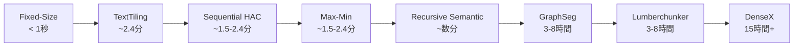

本記事は、ヴロツワフ工科大学人工知能学科の研究者ら (2026) による arXiv 論文 [Chunking Methods on Retrieval-Augmented Generation -- Effectiveness Evaluation Against Computational Cost and Limitations](https://arxiv.org/abs/2606.00881) の解説記事です。RAGパイプラインにおけるチャンキング手法を初めて体系的に評価し、8種の手法を10データセット・複数評価指標で比較した研究の内容を紹介します。

この記事は [Zenn記事: AWS Bedrock Knowledge Basesベクトルストア3択と本番RAG構成の設計指針](https://zenn.dev/0h_n0/articles/918cb94b30191e) の深掘りです。Bedrock Knowledge Basesでベクトルストアを選定する際、上流のチャンキング戦略が検索精度とコストに与える影響を理解することで、本番RAG構成の設計判断に定量的根拠を持たせることを目指します。

## 情報源

| 項目 | 内容 |
|------|------|
| タイトル | Chunking Methods on Retrieval-Augmented Generation -- Effectiveness Evaluation Against Computational Cost and Limitations |
| 著者 | ヴロツワフ工科大学 人工知能学科（8名） |
| arXiv ID | [2606.00881](https://arxiv.org/abs/2606.00881) |
| 提出日 | 2026年5月30日 |
| 分野 | cs.IR (Information Retrieval), cs.CL (Computation and Language) |

## 背景と動機

RAG (Retrieval-Augmented Generation) パイプラインにおいて、ドキュメントをチャンクに分割する「チャンキング」は、検索精度と最終的な回答品質を左右する前処理ステップとして広く認識されている。しかし著者らは、チャンキング手法の選択がRAGの性能に与える影響を体系的に評価した研究がこれまで存在しなかった点を問題視している。

実務上、チャンキング手法の選択は往々にして経験則やツールのデフォルト設定に依存しがちである。Fixed-Size（固定長）チャンキングが依然として広く使われる一方で、セマンティックチャンキングやLLMベースの手法がより高い精度をもたらすという主張も多い。しかし、こうした主張の多くは限定的なデータセットや定性的な比較に基づいており、計算コストとのトレードオフを定量的に示した研究は著者らの知る限り存在しなかった。

著者らはこの空白を埋めるために、古典的手法からLLMベースの最新手法までを網羅する8種のチャンキング手法を選定し、10の公開データセットで統一的な実験条件のもと比較評価を行っている。特に、精度だけでなく計算コスト（処理時間）を同時に測定することで、本番環境でのチャンキング戦略の選定に実用的な知見を提供することを目的としている。

## 主要な貢献

著者らは本論文において以下の3つの貢献を報告している。

- **初の体系的ベンチマーク**: 8種のチャンキング手法を統一された実験条件下（同一検索モデル・生成モデル・評価指標）で比較した初の研究である。既存研究が個別の手法を提案・評価するにとどまっていたのに対し、横断的な比較を実現している。
- **計算コスト vs 精度のトレードオフ定量化**: 各手法の処理時間を1秒未満から15時間超まで6桁にわたるスケールで測定し、精度改善が計算コストの増加に見合うかどうかを定量的に示している。
- **安定性・信頼性の実証的評価**: 10データセット80構成（8手法 x 10データセット）のうち、16構成がタイムアウト、6構成がメモリエラーでクラッシュしたことを報告し、高コストな手法が本番運用に耐えない場合があることを実証している。

## 技術的詳細: 8種のチャンキング手法

著者らが評価した8種の手法を、古典的手法・セマンティック/類似度ベース手法・グラフベース手法・LLMベース手法の4カテゴリに分けて解説する。

### 古典的手法

#### 1. Fixed-Size Chunking

最も単純な手法であり、ドキュメントを固定長のトークン数で機械的に分割する。著者らの実験では512トークン単位、50トークンのオーバーラップを設定している。

$$
\text{chunk}_i = \text{tokens}[i \cdot (w - o) : i \cdot (w - o) + w]
$$

ここで、$w = 512$（チャンク幅）、$o = 50$（オーバーラップ）である。

この手法はテキストの意味的構造を一切考慮しないため、文の途中でチャンクが切れる問題がある。一方で、処理時間は全手法中最短（平均1秒未満）であり、実装の容易さと再現性の高さが利点である。AWS Bedrock Knowledge Basesのデフォルトチャンキングもこの方式に基づいている。

#### 2. TextTiling

Hearst (1997) が提案した手法で、語彙的結束性（lexical cohesion）の変化を検出してトピック境界を特定する。隣接するテキストブロック間のコサイン類似度を計算し、類似度が急激に低下する箇所をトピックの転換点とみなす。

具体的には、テキストをトークン列として扱い、スライディングウィンドウを移動させながら隣接ブロックの語彙重複度をスコア化する。スコアの谷（valley）をセグメント境界として検出し、文境界にアラインメントする。

$$
\text{score}(i) = \cos(\mathbf{b}_i, \mathbf{b}_{i+1})
$$

ここで、$\mathbf{b}_i$ はウィンドウ $i$ のBag-of-Words表現である。

TextTilingは埋め込みモデルやLLMを必要としないため計算コストが低い（平均2.4分）が、語彙レベルの分析のみに依存するため、同義語や言い換えによるトピック変化を検出できない制約がある。

### セマンティック/類似度ベース手法

#### 3. Recursive Semantic Chunking

LangChainなどのフレームワークで広く使われている手法である。セパレータの階層リスト（例: `["\n\n", "\n", ". ", " "]`）を用いて段階的にテキストを分割する。まず最も優先度の高いセパレータ（段落区切り）で分割を試み、結果のチャンクが所定のサイズを超える場合、次のセパレータ（改行、文末）で再帰的に分割する。

```python
def recursive_split(
    text: str,
    separators: list[str],
    chunk_size: int,
) -> list[str]:
    """セパレータ階層で再帰的にテキストを分割する。

    Args:
        text: 分割対象テキスト
        separators: 優先度順のセパレータリスト
        chunk_size: 最大チャンクサイズ（トークン数）

    Returns:
        チャンクのリスト
    """
    if len(text) <= chunk_size or not separators:
        return [text]

    sep = separators[0]
    parts = text.split(sep)
    chunks: list[str] = []
    current = ""

    for part in parts:
        candidate = f"{current}{sep}{part}" if current else part
        if len(candidate) <= chunk_size:
            current = candidate
        else:
            if current:
                chunks.append(current)
            # 単一パートがchunk_sizeを超える場合、次のセパレータで再帰分割
            if len(part) > chunk_size:
                chunks.extend(
                    recursive_split(part, separators[1:], chunk_size)
                )
                current = ""
            else:
                current = part

    if current:
        chunks.append(current)
    return chunks
```

この手法はドキュメントの構造的境界（段落、文）を尊重するため意味的一貫性が高く、かつ埋め込みモデルを必要としないため計算コストが比較的低い。著者らの実験では、Evidence Retrieval性能（Accuracy@5）で全手法中最高の89.36%を記録している。

#### 4. Sequential HAC（階層的凝集クラスタリング）

隣接する文の埋め込みベクトル間のセマンティック類似度に基づいて、ボトムアップにクラスタリングを行う手法である。HAC (Hierarchical Agglomerative Clustering) のアルゴリズムを適用するが、通常のHACとは異なり、**テキスト上で隣接するクラスタのみをマージ対象とする**厳密な空間的制約を課している。

処理の流れは以下の通りである。

1. 各文の埋め込みベクトルを計算する
2. 隣接する文ペアの類似度を算出する
3. 類似度が最も高い隣接ペアをマージする
4. マージ後のクラスタサイズが閾値を超えるか、類似度が閾値を下回るまで繰り返す

$$
\text{sim}(c_i, c_{i+1}) = \cos(\bar{\mathbf{e}}_{c_i}, \bar{\mathbf{e}}_{c_{i+1}})
$$

ここで、$\bar{\mathbf{e}}_{c_i}$ はクラスタ $c_i$ に属する文の埋め込みの平均ベクトルである。

隣接制約により、テキストの線形構造を保持しつつ意味的に類似した連続文をグループ化できる。処理時間は平均1.5-2.4分であるが、Accuracy@5は80.09%と他の手法に比べてやや低い結果となっている。

#### 5. Max-Min Semantic Chunking

貪欲法に基づくチャンキング手法で、新しい文を既存チャンクに追加するかどうかを適応的な閾値で判断する。現在のチャンク内の文と候補文との最大類似度が閾値を超える場合のみ追加し、超えない場合は新しいチャンクを開始する。

$$
\text{add to chunk if } \max_{s_j \in \text{chunk}} \cos(\mathbf{e}_{s_j}, \mathbf{e}_{s_{\text{new}}}) > \tau_{\text{adaptive}}
$$

ここで、$\mathbf{e}_{s_j}$ は文 $s_j$ の埋め込みベクトル、$\tau_{\text{adaptive}}$ はデータ分布に基づいて適応的に決定される閾値である。

閾値はドキュメント全体の文間類似度分布から計算されるため、テキストの特性に応じた分割が可能である。一方で、文ごとに埋め込みを計算し、チャンク内全文との類似度を評価するため、長いドキュメントでは計算コストが増大する。

### グラフベース手法

#### 6. GraphSeg

空間的近接性とセマンティック類似度を組み合わせた重み付きグラフを構築し、スペクトラルクラスタリングでセグメンテーションを行う手法である。

まず、文をノード、文間の関係をエッジとするグラフを構築する。エッジの重みは、テキスト上の距離（近接性）とセマンティック類似度の積で決定される。

$$
w_{ij} = \text{sim}(\mathbf{e}_i, \mathbf{e}_j) \cdot \exp\left(-\frac{|i - j|}{\sigma}\right)
$$

ここで、$\text{sim}(\mathbf{e}_i, \mathbf{e}_j)$ は文 $i$ と文 $j$ の埋め込み間のコサイン類似度、$|i - j|$ はテキスト上の文の距離、$\sigma$ は距離の減衰パラメータである。

構築されたグラフに対してラプラシアン行列 $\mathbf{L} = \mathbf{D} - \mathbf{W}$ を計算し（$\mathbf{D}$ は次数行列、$\mathbf{W}$ は重み行列）、固有値分解によってクラスタ数を自動決定する。その後、スペクトラルクラスタリングで各文をチャンクに割り当てる。

この手法は空間的な制約と意味的な類似度を同時に考慮できる点が優れているが、グラフ構築と固有値分解に多大な計算コストを要し、処理時間は平均3-8時間に達している。

### LLMベース手法

#### 7. Lumberchunker

テキストの段落をLLMに渡し、セマンティックな転換点を特定させる手法である。LLMにプロンプトを与え、「この段落列の中で意味的な区切りとなる段落はどれか」を判断させる。

LLMの言語理解能力を活用するため、ナラティブテキスト（物語、エッセイなど）において他の手法より高い品質のチャンクを生成できる可能性がある。著者らの実験では、End-to-End RAG品質（LLM-as-judge評価）で完了したデータセットにおいて平均4.35と最高スコアを記録している。

ただし、LLMの推論を各段落に対して呼び出すため、処理時間は平均3-8時間と非常に長い。また、LLM呼び出しのコスト（APIトークン消費）も無視できない。さらに、LLMの出力が非決定的であるため、同じ入力に対して毎回異なるチャンク分割が生成される再現性の問題がある。

#### 8. DenseX

テキストから「命題」（proposition）を抽出する手法で、各文の意味を独立した命題単位に分解する。LLMに対して「この文から独立した事実命題を抽出せよ」と指示し、得られた命題をチャンクとして使用する。

この手法は最もきめ細かいチャンキングを可能にする理論的利点があるが、著者らの実験では**15時間以上の処理時間**を要し、複数のデータセットでタイムアウトが発生している。著者らは、DenseXが10データセット中過半数で正常に完了しなかったと報告しており、大規模な本番環境での実用性に深刻な疑問を呈している。

## 実験設定

著者らの実験条件を整理する。

### インフラストラクチャ

| 項目 | 設定値 |
|------|--------|
| GPU | NVIDIA H100 |
| 並列ノード数 | 20ノード |
| タイムアウト | 48時間/手法・データセット構成 |

### 検索・生成パイプライン

| 項目 | 設定値 |
|------|--------|
| 埋め込みモデル | BGE-M3 |
| リランカー | BGE-reranker-v2-m3 |
| 生成モデル | GPT-OSS-20B |
| コンテキスト制限 | 4,000トークン |
| 取得チャンク数 | top-5 |

### 評価指標

著者らは3種類の評価指標を使用している。

- **Accuracy@5**: 上位5件のチャンクに正解エビデンスが含まれる割合（検索性能）
- **Recall@10**: 上位10件のチャンクによる正解エビデンスの網羅率（検索性能）
- **LLM-as-judge**: 生成された回答を5段階リッカートスケールで評価（End-to-End品質）

### データセット

10のデータセットが使用されており、長文書（GutenQA, LiteraryQA, NovelQA）、学術論文（Qasper）、一般知識QA（TriviaQA, SQuAD, Natural Questions）、多言語（PoQuAD）など多様なドメインをカバーしている。

## 実験結果

### Evidence Retrieval性能

著者らが報告している各手法のAccuracy@5（上位5チャンクに正解エビデンスが含まれる割合）を以下に示す。

| 手法 | カテゴリ | Accuracy@5 | 完了率 |
|------|---------|-----------|--------|
| Recursive Semantic | セマンティック | **89.36%** | 10/10 |
| Fixed-Size | 古典的 | 87.71% | 10/10 |
| GraphSeg | グラフ | 86.85% | 部分的 |
| Max-Min | セマンティック | 85.75% | 10/10 |
| TextTiling | 古典的 | -- | 10/10 |
| Sequential HAC | セマンティック | 80.09% | 10/10 |
| Lumberchunker | LLM | -- | 部分的 |
| DenseX | LLM | -- | 低い |

（数値は論文の実験結果より。GraphSeg, Lumberchunker, DenseXはタイムアウトにより一部データセットで結果が欠落している。TextTilingの平均Accuracy@5は論文中で一部データセットの個別値として報告されている）

注目すべきは、最もシンプルなFixed-Size Chunkingが87.71%と高い性能を維持し、最も複雑なRecursive Semantic Chunkingとの差が**わずか1.65ポイント**にとどまっている点である。著者らは、この差がチャンキングの計算コストの差（数桁）と比較して極めて小さいと指摘している。

### 計算コスト

各手法の処理時間は以下の通りである。



処理時間の差は6桁以上に及ぶ。Fixed-Sizeが1秒未満で完了するのに対し、DenseXは15時間以上を要している。著者らは、この計算コストの差が本番環境でのチャンキング戦略選定において決定的な要因となりうると報告している。

### End-to-End RAG品質

LLM-as-judge（5段階リッカートスケール）による回答品質評価の結果は以下の通りである。

| 手法 | LLM-as-judge平均 | 備考 |
|------|-----------------|------|
| Lumberchunker | **4.35** | 完了したデータセットのみ |
| GraphSeg | 4.13 | 完了したデータセットのみ |
| Recursive Semantic | 3.86 | 全データセット完了 |
| Fixed-Size | 3.76 | 全データセット完了 |

End-to-End品質ではLumberchunkerが最高スコアを記録しているが、著者らは2つの重要な注意点を指摘している。第一に、Lumberchunkerのスコアは完了したデータセットのみに基づいており、タイムアウトしたデータセットを含めた場合のスコアは不明である。第二に、Recursive Semanticとの差は0.49ポイント（3.86 vs 4.35）であり、処理時間の差（数分 vs 数時間）を考慮すると、コスト対効果の観点ではRecursive SemanticやFixed-Sizeが優位となる。

### 安定性と信頼性

著者らの実験で明らかになった安定性の問題は深刻である。80構成（8手法 x 10データセット）のうち、以下の障害が報告されている。

- **16構成がタイムアウト**（48時間の制限を超過）
- **6構成がspaCyのメモリエラーでクラッシュ**
- **安定して全データセットで完了した手法は5つのみ**（Recursive Semantic, Fixed-Size, Sequential HAC, Max-Min, TextTiling）

この結果は、高コストなチャンキング手法を本番環境に導入する際のリスクを明確に示している。GraphSeg、Lumberchunker、DenseXはいずれも一部のデータセットで正常に完了できておらず、データの特性によって予測不能な障害が発生する可能性がある。

## 重要な発見のまとめ

著者らが本論文で導いた主要な知見を整理する。

**1. 高コストな手法は精度を大幅に改善しない**

著者らは「より高コストなチャンキング手法は、大幅に高い計算オーバーヘッドを導入する一方で、有意な精度改善をもたらさない」と結論している。Fixed-Size（1秒未満）とRecursive Semantic（数分）の精度差はわずか1.65ポイントであり、GraphSeg（3-8時間）やDenseX（15時間超）に至っては安定性の問題からそもそも比較が困難である。

**2. チャンクの一貫性が過剰分割より重要**

著者らは、より少ないが一貫性のあるチャンクを生成する手法が、過剰分割する手法よりも優位であったと報告している。DenseXのように文を命題単位まで分解する手法は、チャンク数の増加によるノイズ混入のリスクがあり、検索精度の低下を招く可能性がある。

**3. チャンキングは前処理ではなくコア研究問題**

著者らは、チャンキングがRAGパイプラインにおける「前処理ステップ」としてではなく、「コア研究問題」として扱われるべきだと主張している。チャンキング手法の選択がEnd-to-End品質に直接影響を与えること、手法間の性能差がデータセットの特性に強く依存すること、そして計算コストが数桁にわたって異なることから、チャンキングは軽視できない設計決定であるとしている。

## 実運用への応用

### AWS Bedrock Knowledge Basesとの関連

本論文の知見は、AWS Bedrock Knowledge Basesでのチャンキング戦略選定に直接的な示唆を与える。Bedrock Knowledge Basesは以下のチャンキングオプションを提供している。

- **Fixed-size chunking**: 本論文のFixed-Size Chunkingに相当
- **Default chunking**: 300トークン固定のFixed-Sizeバリアント
- **Semantic chunking**: 本論文のセマンティック手法に類似
- **No chunking**: ドキュメントをそのまま使用

本論文の結果に基づけば、以下の戦略が合理的である。

**初期導入時**: Fixed-size chunkingで十分な検索精度（87.71%）が得られるため、まずこの手法でベースラインを構築する。処理時間が極めて短いため、大量のドキュメントを短時間でインデックスできる。

**精度の追加改善が必要な場合**: Semantic chunkingへの移行を検討する。ただし、本論文の結果ではRecursive Semanticとの精度差は約1.65ポイントであり、改善効果は限定的である可能性がある。チャンキング手法の変更よりも、リランカーの導入やプロンプトエンジニアリングの最適化に投資するほうが費用対効果が高い場合がある。

**ベクトルストア選定への影響**: チャンキング手法の選択はベクトルストアの負荷特性にも影響する。Fixed-Sizeは均一なチャンクサイズを生成するためインデックスの性能予測が容易であり、Aurora PostgreSQL (pgvector) のようなRDBベースのベクトルストアとの相性がよい。一方、セマンティックチャンキングはチャンクサイズのばらつきが大きくなるため、OpenSearch Serverlessのような分散検索エンジンの方がスケーリング面で有利となる可能性がある。

### 本番RAGシステムにおけるチャンキング戦略

本論文の知見から、本番環境でのチャンキング戦略を選定する際の判断基準を整理する。

**スループット重視の場合**: Fixed-Sizeを採用し、オーバーラップ幅（50-100トークン）を調整することで、チャンク境界でのコンテキスト断裂を緩和する。処理時間が1秒未満であるため、リアルタイムでのドキュメント追加にも対応できる。

**品質重視かつバッチ処理が許容される場合**: Recursive Semanticを採用する。精度は最高（89.36%）であり、全データセットで安定して完了している。処理時間は数分程度であるため、夜間バッチでのインデックス更新に適している。

**GraphSegやLLMベース手法の採用は慎重に**: 本論文の結果では、これらの手法は安定性に問題があり、本番運用のSLAを満たせないリスクがある。特にDenseXは15時間超の処理時間と頻繁なタイムアウトが報告されており、プロダクション利用は推奨されない。

## 本論文の制約と限界

著者ら自身が認めている制約、および本解説において留意すべき限界を整理する。

**埋め込みモデルの固定**: 実験ではBGE-M3を唯一の埋め込みモデルとして使用している。OpenAI Ada、Cohere Embed、Amazon Titan Embeddingsなど他のモデルを使用した場合、各手法の相対的な性能順位が変わる可能性がある。

**生成モデルの固定**: GPT-OSS-20Bのみが使用されている。生成モデルのコンテキスト長やロバスト性が異なれば、チャンクの質の差が最終回答品質に与える影響も変化しうる。

**チャンクサイズの固定**: Fixed-Sizeチャンキングで512トークンが使用されているが、最適なチャンクサイズはドメインやユースケースに依存する。著者らは複数のチャンクサイズにおける感度分析を行っていない。

**データセットの言語**: 使用されたデータセットの大半は英語であり、日本語テキストにおけるチャンキング性能は検証されていない。日本語は語境界の曖昧性が高いため、TextTilingやRecursive Semanticのセパレータベースの手法は追加の調整が必要となる可能性がある。

## 関連研究

- **Lewis et al. (2020) "Retrieval-Augmented Generation for Knowledge-Intensive NLP Tasks"**: RAGの原論文であり、チャンキングを含む検索パイプライン全体のフレームワークを提案している。本論文はRAGパイプラインの中でもチャンキングステップに特化した評価を行っている点で相補的な位置づけにある。
- **Kamradt (2023) "5 Levels of Text Splitting"**: チャンキング手法を難易度別に整理した実践的ガイドであり、Fixed-Sizeからセマンティックチャンキングまでの段階的な複雑化を提案している。本論文は、この段階的な複雑化が必ずしも性能向上につながらないことを実証的に示している。
- **Gao et al. (2024) "Retrieval-Augmented Generation for Large Language Models: A Survey"**: RAGのサーベイ論文であり、チャンキングを含む各ステージの手法を概観している。本論文はチャンキングステージに焦点を絞り、計算コストを含む定量的比較を提供することで、サーベイの知見を補完している。

## まとめと今後の展望

本論文は、RAGにおけるチャンキング手法の選択が性能とコストの双方に与える影響を初めて体系的に定量化した研究である。最も重要な知見は、シンプルなFixed-Sizeチャンキングが、計算コストが数桁高い高度な手法と比較して、わずか数ポイントの精度差に収まるという事実である。

本番RAGシステムの設計においては、チャンキング手法の高度化に投資する前に、まずFixed-SizeまたはRecursive Semanticでベースラインを構築し、リランカーやプロンプト最適化など他のコンポーネントの改善効果と比較することが合理的な戦略といえる。

今後の研究方向として、著者らはドメイン固有のチャンキング戦略（法律文書、医療文書など構造化された文書に特化した手法）、マルチモーダルチャンキング（テキストと画像・表を含むドキュメントの分割）、および適応的チャンキング（クエリの特性に応じて動的にチャンキング手法を切り替える）を示唆している。

## 参考文献

- **arXiv**: [https://arxiv.org/abs/2606.00881](https://arxiv.org/abs/2606.00881)
- **Related Zenn article**: [https://zenn.dev/0h_n0/articles/918cb94b30191e](https://zenn.dev/0h_n0/articles/918cb94b30191e)
