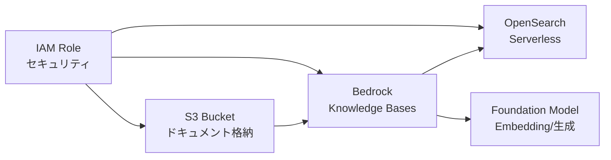
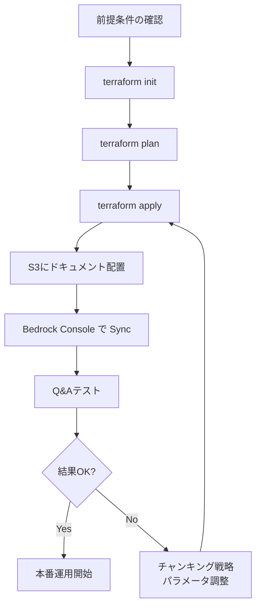

## ブログ概要

本記事は [Deploy Amazon Bedrock Knowledge Bases using Terraform for RAG-based generative AI applications](https://aws.amazon.com/blogs/machine-learning/deploy-amazon-bedrock-knowledge-bases-using-terraform-for-rag-based-generative-ai-applications/) の解説記事です。

AWS Generative AI Innovation CenterのAndrew Ang氏とAkhil Nooney氏が2025年9月に公開したこの記事は、Amazon Bedrock Knowledge Basesを**Terraform**でデプロイするための実践手順を解説しています。AWSはCDK（Cloud Development Kit）向けのサンプルを先行公開していたものの、Terraform利用者からの需要が高かったためこのギャップを埋める形でリリースされました。

3つのコアコンポーネント（IAMロール、OpenSearch Serverless、Bedrock Knowledge Bases）をTerraformモジュールとして統合し、`terraform apply`一発でRAG基盤を構築できる点が特徴です。

この記事は [Zenn記事: AWS Bedrock Knowledge Basesベクトルストア3択と本番RAG構成の設計指針](https://zenn.dev/0h_n0/articles/918cb94b30191e) の深掘りです。

## 情報源

- **種別**: 企業テックブログ（AWS Machine Learning Blog）
- **URL**: [Deploy Amazon Bedrock Knowledge Bases using Terraform](https://aws.amazon.com/blogs/machine-learning/deploy-amazon-bedrock-knowledge-bases-using-terraform-for-rag-based-generative-ai-applications/)
- **著者**: Andrew Ang（Senior ML Engineer）、Akhil Nooney（Deep Learning Architect） -- AWS Generative AI Innovation Center
- **発表日**: 2025年9月2日
- **GitHub**: [aws-samples/sample-bedrock-knowledge-base-terraform](https://github.com/aws-samples/sample-bedrock-knowledge-base-terraform)

## 技術的背景

### IaCによるRAG基盤構築の必要性

RAG（Retrieval Augmented Generation）は、Foundation Modelに外部知識を付与して回答精度を高めるアーキテクチャです。Amazon Bedrock Knowledge Basesはこのパターンをマネージドサービスとして提供しており、S3上のドキュメントを自動的にチャンク分割・ベクトル化し、OpenSearch Serverlessに格納します。

しかし、Bedrock Knowledge Basesの構築にはIAMロール、OpenSearch Serverlessコレクション、暗号化ポリシー、ネットワークポリシー、データアクセスポリシーなど多数のリソースを正しい依存関係で作成する必要があります。コンソール操作では再現性がなく、環境間の差異も生じやすいため、IaC（Infrastructure as Code）による管理が求められます。

著者らは、CDKのサンプルは既に存在していたがTerraformでの構築手順が欠けていたと述べており、エンタープライズ環境でTerraformを標準IaCツールとしている組織が多いことから、このブログが公開されたとしています。

### Bedrock Knowledge Basesの3コンポーネント

著者らのアーキテクチャは以下の3つのAWSサービスを統合しています。



1. **AWS IAMロール**: Bedrock、S3、OpenSearchへのアクセスを管理する層構造のポリシー
2. **Amazon OpenSearch Serverless**: ベクトルインデックスの格納・検索を担うサーバーレスコレクション
3. **Amazon Bedrock Knowledge Bases**: ドキュメントのチャンク分割、Embedding生成、検索・応答生成を統括

## 実装アーキテクチャ

### IAMポリシーの6層構造

著者らは、セキュリティの核となるIAMポリシーを6つのレイヤーに分割しています。最小権限の原則に基づき、各サービスが必要な操作だけを実行できるよう設計されています。

| ポリシー | 対象サービス | 許可する操作 |
|---------|------------|------------|
| Bedrock呼び出しポリシー | Bedrock | Knowledge Base操作の実行 |
| S3アクセスポリシー | S3 | ドキュメントバケットの読み取り |
| OpenSearchアクセスポリシー | OpenSearch | コレクションへのデータ操作 |
| コレクション暗号化ポリシー | OpenSearch | 保存データの暗号化制御 |
| コレクションネットワークポリシー | OpenSearch | ネットワークレベルのアクセス制御 |
| データアクセスポリシー | OpenSearch | インデックスの作成・読み取り・書き込み |

この分離により、IAMロールが侵害された場合でも影響範囲を限定できます。

### Terraformモジュール構成

著者らが公開しているGitHubリポジトリ `sample-bedrock-knowledge-base-terraform` のモジュール構成は以下の通りです。

```hcl
# main.tf - ルートモジュール
module "knowledge_base" {
  source                   = "./modules"
  kb_s3_bucket_name_prefix = "your-s3-bucket-name"
  chunking_strategy        = "FIXED_SIZE"
  kb_model_id              = "amazon.titan-embed-text-v2:0"
  kb_name                  = "myKnowledgeBase"
}
```

主要な変数として以下が定義されています。

- **`kb_s3_bucket_name_prefix`**: ドキュメント格納先のS3バケット名プレフィックス
- **`chunking_strategy`**: チャンキング戦略（後述の4種から選択）
- **`kb_model_id`**: Embeddingモデル（デフォルト: `amazon.titan-embed-text-v2:0`）
- **`kb_name`**: Knowledge Baseの名前
- **`vector_dimension`**: ベクトル次元数（デフォルト: 1024）

### OpenSearch Serverless の設定

OpenSearch Serverlessはコレクションタイプとして**VECTORSEARCH**を使用し、以下の3つのポリシーで保護されています。

**暗号化ポリシー**: コレクション内の全データをAWS管理キーで暗号化します。Terraformでは `aws_opensearchserverless_security_policy` リソースで定義し、`type = "encryption"` を指定します。

**ネットワークポリシー**: どのサービスやIPからコレクションへアクセスを許可するかを制御します。著者らの構成ではBedrock Serviceからのアクセスのみを許可し、パブリックアクセスを制限しています。

**データアクセスポリシー**: コレクション内のインデックスに対するCRUD操作の権限を定義します。BedrockサービスロールがインデックスのCreate/Read/Write/Deleteを実行できるように設定されています。

### チャンキング戦略の選定

著者らは4種のチャンキング戦略を紹介しており、ユースケースに応じて選択できます。

| 戦略 | パラメータ | 特徴 | 適するケース |
|------|-----------|------|-------------|
| `DEFAULT` | なし | Bedrockのデフォルト分割 | 初期検証、手軽に始めたい場合 |
| `FIXED_SIZE` | `max_tokens=512`, `overlap=20%` | 固定トークン数で分割 | 均質なドキュメント（FAQ、マニュアル等） |
| `HIERARCHICAL` | `parent=1000`, `child=500`, `overlap=70` | 親子関係のあるチャンク構造 | 長文ドキュメント（論文、レポート等） |
| `SEMANTIC` | `max_tokens=512`, `buffer=1`, `threshold=75` | 意味的な区切りで分割 | 構造が不規則なドキュメント |

`FIXED_SIZE`では`fixed_size_max_tokens`（デフォルト512）と`fixed_size_overlap_percentage`（デフォルト20%）を指定します。オーバーラップにより、チャンク境界で文脈が失われることを防止します。

`HIERARCHICAL`は親チャンク（`hierarchical_parent_max_tokens`=1000）と子チャンク（`hierarchical_child_max_tokens`=500）の2層構造を構成し、検索時には子チャンクでマッチング、回答生成時には親チャンクのコンテキストを利用します。

`SEMANTIC`は`semantic_breakpoint_percentile_threshold`（デフォルト75）を閾値とし、文章間の意味的な距離が閾値を超えた箇所でチャンクを分割します。

### ベクトル次元数の設定

`vector_dimension`はデフォルト1024に設定されており、これはTitan Text Embeddings V2の出力次元に合致しています。著者らは、次元数を増やすと検索精度が向上する一方、ストレージとクエリコストが増加するトレードオフがあると述べています。

$$
\text{Storage Cost} \propto N \times d
$$

$$
\text{Query Latency} \propto N \times d \times \text{(distance computation)}
$$

ここで、$N$はベクトル数、$d$は次元数です。Embeddingモデルを変更する場合（例: Cohere Embed v3の1024次元、Amazon Titan v1の1536次元）、この値をモデルに合わせて調整する必要があります。

### デプロイワークフロー

著者らが示すデプロイ手順は以下の通りです。



**前提条件**:
1. AWSアカウントと適切なIAM権限
2. Terraform CLI のインストール
3. AWS CLI の設定（認証情報）
4. S3バケットの作成とドキュメントのアップロード（TXT, MD, HTML, DOC, DOCX, CSV, XLS, XLSX, PDF形式）
5. Bedrock Foundation Modelのアクセス有効化

**初期化・計画・適用**:

```bash
# プロバイダプラグインのダウンロード
terraform init

# 作成されるリソースの確認（+ = 作成, ~ = 変更, - = 削除）
terraform plan

# リソースの作成（確認プロンプトに "yes" と入力）
terraform apply
```

**テスト手順**:
1. Amazon Bedrockコンソール -> Knowledge Basesを開く
2. 作成されたKnowledge Baseを選択
3. 「Sync」でS3のデータを同期
4. Foundation Modelを選択し、Q&Aクエリでテスト

**クリーンアップ**:

```bash
# 全リソースの削除
terraform destroy

# S3バケットの中身も手動で削除（課金防止）
aws s3 rm s3://your-bucket --recursive
```

## Production Deployment Guide

### AWS実装パターン（コスト最適化重視）

著者らのブログはOpenSearch Serverlessを使用していますが、本番環境ではトラフィック量に応じて構成を選定する必要があります。以下は、Bedrock Knowledge Basesを中心としたRAG基盤のトラフィック別推奨構成です。

**コスト試算の前提**: 2026年7月時点のAWS ap-northeast-1（東京）リージョン料金に基づく概算値です。実際のコストはトラフィックパターン、リージョン、バースト使用量により変動します。最新料金はAWS料金計算ツールで確認してください。

| 構成 | トラフィック | 主要サービス | 月額概算 |
|------|-----------|------------|---------|
| Small | ~100 req/日 | Lambda + Bedrock KB + OpenSearch Serverless | $150-350 |
| Medium | ~1,000 req/日 | ECS Fargate + Bedrock KB + OpenSearch Serverless | $500-1,200 |
| Large | 10,000+ req/日 | EKS + Bedrock KB + OpenSearch Provisioned | $2,500-6,000 |

**Small構成の内訳**:
- OpenSearch Serverless（2 OCU最小）: ~$175/月
- Bedrock Embedding（Titan v2, 100 req/日 x 30日 x ~2000トークン）: ~$5/月
- Bedrock FM呼び出し（Claude 3 Haiku等）: ~$10-50/月
- Lambda: ~$1/月
- S3: ~$1/月

OpenSearch Serverlessの最小コストが2 OCU分（約$175/月）発生する点に注意が必要です。低トラフィック環境ではpgvectorなどのRDS PostgreSQLベースの選択肢がコスト面で有利になる可能性があり、Zenn記事でも指摘されている3択（OpenSearch Serverless / Aurora PostgreSQL pgvector / Pinecone）の選定が重要です。

**コスト削減テクニック**:
- **Bedrock Batch API**: 非同期処理が可能な場合、Batch APIで最大50%削減
- **Prompt Caching**: 反復的なシステムプロンプトをキャッシュし30-90%削減
- **Embedding モデル選択**: Titan v2（$0.00002/1Kトークン）はCohereより安価
- **OpenSearch OCU最適化**: トラフィックパターンに応じてOCU数を調整

### Terraformインフラコード

#### Small構成（Serverless: Lambda + Bedrock KB）

```hcl
# small_rag_stack.tf
# VPC設定（NAT Gateway不使用でコスト削減）
resource "aws_vpc" "rag_vpc" {
  cidr_block           = "10.0.0.0/16"
  enable_dns_support   = true
  enable_dns_hostnames = true

  tags = {
    Name        = "rag-vpc"
    Environment = "production"
    CostCenter  = "rag-small"
  }
}

resource "aws_subnet" "private" {
  count             = 2
  vpc_id            = aws_vpc.rag_vpc.id
  cidr_block        = cidrsubnet("10.0.0.0/16", 8, count.index)
  availability_zone = data.aws_availability_zones.available.names[count.index]

  tags = {
    Name = "rag-private-${count.index}"
  }
}

# VPCエンドポイント（NAT Gateway代替でコスト削減）
resource "aws_vpc_endpoint" "bedrock" {
  vpc_id              = aws_vpc.rag_vpc.id
  service_name        = "com.amazonaws.${var.region}.bedrock-runtime"
  vpc_endpoint_type   = "Interface"
  private_dns_enabled = true
  subnet_ids          = aws_subnet.private[*].id
  security_group_ids  = [aws_security_group.vpce.id]
}

# IAMロール（最小権限）
resource "aws_iam_role" "lambda_rag" {
  name = "rag-lambda-role"

  assume_role_policy = jsonencode({
    Version = "2012-10-17"
    Statement = [{
      Action = "sts:AssumeRole"
      Effect = "Allow"
      Principal = { Service = "lambda.amazonaws.com" }
    }]
  })
}

resource "aws_iam_role_policy" "bedrock_invoke" {
  name = "bedrock-invoke"
  role = aws_iam_role.lambda_rag.id

  policy = jsonencode({
    Version = "2012-10-17"
    Statement = [{
      Effect = "Allow"
      Action = [
        "bedrock:RetrieveAndGenerate",
        "bedrock:Retrieve"
      ]
      Resource = "arn:aws:bedrock:${var.region}:${data.aws_caller_identity.current.account_id}:knowledge-base/*"
    }]
  })
}

# Lambda関数
resource "aws_lambda_function" "rag_handler" {
  function_name = "rag-query-handler"
  role          = aws_iam_role.lambda_rag.arn
  handler       = "index.handler"
  runtime       = "python3.12"
  timeout       = 30
  memory_size   = 256

  environment {
    variables = {
      KNOWLEDGE_BASE_ID = var.knowledge_base_id
      MODEL_ARN         = "arn:aws:bedrock:${var.region}::foundation-model/anthropic.claude-3-haiku-20240307-v1:0"
    }
  }

  vpc_config {
    subnet_ids         = aws_subnet.private[*].id
    security_group_ids = [aws_security_group.lambda.id]
  }

  tags = {
    CostCenter = "rag-small"
  }
}

# CloudWatchアラーム（コスト監視）
resource "aws_cloudwatch_metric_alarm" "lambda_duration" {
  alarm_name          = "rag-lambda-high-duration"
  comparison_operator = "GreaterThanThreshold"
  evaluation_periods  = 3
  metric_name         = "Duration"
  namespace           = "AWS/Lambda"
  period              = 300
  statistic           = "Average"
  threshold           = 25000 # 25秒
  alarm_actions       = [var.sns_topic_arn]

  dimensions = {
    FunctionName = aws_lambda_function.rag_handler.function_name
  }
}
```

#### Large構成（Container: EKS + Spot Instances）

```hcl
# large_rag_stack.tf
# EKSクラスタ
module "eks" {
  source  = "terraform-aws-modules/eks/aws"
  version = "~> 20.0"

  cluster_name    = "rag-production"
  cluster_version = "1.31"
  vpc_id          = aws_vpc.rag_vpc.id
  subnet_ids      = aws_subnet.private[*].id

  # コントロールプレーンのみ（ノードはKarpenterで管理）
  cluster_endpoint_public_access = false

  tags = {
    Environment = "production"
    CostCenter  = "rag-large"
  }
}

# Karpenter Provisioner（Spot優先で最大90%コスト削減）
resource "kubectl_manifest" "karpenter_provisioner" {
  yaml_body = yamlencode({
    apiVersion = "karpenter.sh/v1"
    kind       = "NodePool"
    metadata   = { name = "rag-workers" }
    spec = {
      template = {
        spec = {
          requirements = [
            { key = "karpenter.sh/capacity-type", operator = "In", values = ["spot", "on-demand"] },
            { key = "node.kubernetes.io/instance-type", operator = "In",
              values = ["m6i.xlarge", "m6a.xlarge", "m5.xlarge", "m5a.xlarge"] }
          ]
        }
      }
      limits   = { cpu = "100", memory = "400Gi" }
      disruption = {
        consolidationPolicy = "WhenEmptyOrUnderutilized"
        consolidateAfter    = "30s"
      }
    }
  })
}

# Secrets Manager（Bedrock設定の安全な管理）
resource "aws_secretsmanager_secret" "bedrock_config" {
  name                    = "rag/bedrock-config"
  recovery_window_in_days = 7

  tags = {
    CostCenter = "rag-large"
  }
}

# AWS Budgets（予算アラート）
resource "aws_budgets_budget" "rag_monthly" {
  name         = "rag-monthly-budget"
  budget_type  = "COST"
  limit_amount = "6000"
  limit_unit   = "USD"
  time_unit    = "MONTHLY"

  notification {
    comparison_operator       = "GREATER_THAN"
    threshold                 = 80
    threshold_type            = "PERCENTAGE"
    notification_type         = "FORECASTED"
    subscriber_email_addresses = [var.alert_email]
  }

  cost_filter {
    name   = "TagKeyValue"
    values = ["user:CostCenter$rag-large"]
  }
}
```

### 運用・監視設定

**CloudWatch Logs Insights クエリ**（Bedrock KB利用状況の分析）:

```
# 1時間あたりのKB呼び出し回数とレイテンシ
fields @timestamp, @message
| filter @message like /RetrieveAndGenerate/
| stats count() as invocations,
        avg(duration) as avg_latency_ms,
        pct(duration, 95) as p95_latency_ms,
        pct(duration, 99) as p99_latency_ms
  by bin(1h)
| sort @timestamp desc
```

**CloudWatch アラーム設定（Python boto3）**:

```python
import boto3

cloudwatch = boto3.client("cloudwatch")

def create_bedrock_alarms(knowledge_base_id: str, sns_topic_arn: str) -> None:
    """Bedrock KB利用量の異常検知アラームを作成する

    Args:
        knowledge_base_id: 監視対象のKnowledge Base ID
        sns_topic_arn: 通知先のSNSトピックARN
    """
    # Bedrock呼び出しエラー率アラーム
    cloudwatch.put_metric_alarm(
        AlarmName=f"bedrock-kb-{knowledge_base_id}-error-rate",
        MetricName="Invocations",
        Namespace="AWS/Bedrock",
        Statistic="Sum",
        Period=300,
        EvaluationPeriods=3,
        Threshold=10,
        ComparisonOperator="GreaterThanThreshold",
        AlarmActions=[sns_topic_arn],
        Dimensions=[
            {"Name": "KnowledgeBaseId", "Value": knowledge_base_id}
        ],
    )
```

**X-Ray トレーシング設定（Python）**:

```python
from aws_xray_sdk.core import xray_recorder, patch_all

# boto3の自動計装
patch_all()

def query_knowledge_base(query: str, kb_id: str) -> dict:
    """Knowledge Baseにクエリを送信する（X-Rayトレース付き）

    Args:
        query: ユーザーのクエリ文字列
        kb_id: Knowledge Base ID

    Returns:
        Bedrock KBからの応答
    """
    subsegment = xray_recorder.begin_subsegment("bedrock-kb-query")
    subsegment.put_annotation("kb_id", kb_id)
    subsegment.put_metadata("query_length", len(query))

    try:
        client = boto3.client("bedrock-agent-runtime")
        response = client.retrieve_and_generate(
            input={"text": query},
            retrieveAndGenerateConfiguration={
                "type": "KNOWLEDGE_BASE",
                "knowledgeBaseConfiguration": {
                    "knowledgeBaseId": kb_id,
                    "modelArn": "arn:aws:bedrock:ap-northeast-1::foundation-model/anthropic.claude-3-haiku-20240307-v1:0",
                },
            },
        )
        subsegment.put_metadata("citations_count", len(response.get("citations", [])))
        return response
    finally:
        xray_recorder.end_subsegment()
```

**Cost Explorer自動レポート（Python）**:

```python
import boto3
from datetime import datetime, timedelta

def generate_daily_cost_report(sns_topic_arn: str) -> None:
    """日次コストレポートを生成してSNS通知する

    Args:
        sns_topic_arn: 通知先のSNSトピックARN
    """
    ce = boto3.client("ce")
    sns = boto3.client("sns")
    today = datetime.utcnow().strftime("%Y-%m-%d")
    yesterday = (datetime.utcnow() - timedelta(days=1)).strftime("%Y-%m-%d")

    response = ce.get_cost_and_usage(
        TimePeriod={"Start": yesterday, "End": today},
        Granularity="DAILY",
        Metrics=["UnblendedCost"],
        Filter={
            "Tags": {
                "Key": "CostCenter",
                "Values": ["rag-small", "rag-large"],
            }
        },
        GroupBy=[{"Type": "DIMENSION", "Key": "SERVICE"}],
    )

    total = sum(
        float(g["Metrics"]["UnblendedCost"]["Amount"])
        for result in response["ResultsByTime"]
        for g in result["Groups"]
    )

    # $100/日超過で警告
    if total > 100:
        sns.publish(
            TopicArn=sns_topic_arn,
            Subject="RAG Cost Alert: Daily cost exceeded $100",
            Message=f"Daily RAG cost: ${total:.2f}\nBreakdown: {response}",
        )
```

### コスト最適化チェックリスト

**アーキテクチャ選択**:
- [ ] トラフィック~100 req/日 -> Small（Serverless）構成を選択
- [ ] トラフィック~1,000 req/日 -> Medium（Hybrid）構成を選択
- [ ] トラフィック10,000+ req/日 -> Large（Container）構成を選択
- [ ] ベクトルストア選定: OpenSearch Serverless vs pgvector vs Pineconeを評価済み

**リソース最適化**:
- [ ] EC2/EKS: Spot Instances優先（最大90%削減）
- [ ] Reserved Instances: 1年コミットで最大72%削減
- [ ] Savings Plans: Compute Savings Plansの検討
- [ ] Lambda: メモリサイズを256MB-512MBに最適化（Power Tuning実施）
- [ ] OpenSearch Serverless: OCU数の最適化（最小2 OCU = ~$175/月に注意）
- [ ] EKS: Karpenterによるアイドル時自動スケールダウン

**LLMコスト削減**:
- [ ] Bedrock Batch API: 非同期可能な処理は50%削減
- [ ] Prompt Caching: システムプロンプトのキャッシュで30-90%削減
- [ ] モデル選択: 軽量クエリはClaude 3 Haiku、複雑な推論のみSonnet/Opus
- [ ] トークン数制限: `max_tokens`を必要最小限に設定
- [ ] Embedding: Titan v2（$0.00002/1Kトークン）のコスト効率を確認

**監視・アラート**:
- [ ] AWS Budgets: 月額予算とフォーキャストアラート設定
- [ ] CloudWatch: Bedrock呼び出しエラー率、Lambda Duration監視
- [ ] Cost Anomaly Detection: 自動異常検知の有効化
- [ ] 日次コストレポート: Cost Explorer API + SNS通知
- [ ] X-Ray: エンドツーエンドのレイテンシ可視化

**リソース管理**:
- [ ] 未使用Knowledge Baseの削除（OpenSearch OCU課金の停止）
- [ ] タグ戦略: `CostCenter`, `Environment`, `Project`タグの徹底
- [ ] S3ライフサイクルポリシー: 古いドキュメントバージョンの自動削除
- [ ] 開発環境: 業務時間外のOpenSearch Serverless停止検討
- [ ] terraform destroyの手順書整備（検証環境の確実なクリーンアップ）

## パフォーマンス最適化

### チャンキング戦略のチューニング

チャンキング戦略の選択はRAGの回答品質に直結します。著者らが示す4戦略のうち、以下のパラメータ調整が品質に影響を与えます。

**FIXED_SIZE の調整**:

$$
\text{Overlap Tokens} = \left\lfloor \frac{\text{max\_tokens} \times \text{overlap\_percentage}}{100} \right\rfloor
$$

デフォルト設定（`max_tokens=512`, `overlap=20%`）の場合、オーバーラップは約102トークンです。文脈の連続性が重要なドキュメントでは、`overlap`を30-40%に引き上げることで検索精度が向上する可能性がありますが、インデックスサイズも増加します。

**HIERARCHICAL の調整**:

親チャンク（1000トークン）→子チャンク（500トークン）の比率はデフォルトで2:1です。長い技術文書では親を1500、子を300にすることで、より広い文脈を保持しつつ、精密な検索が可能になります。

**SEMANTIC の調整**:

`breakpoint_percentile_threshold=75`は、文間のEmbedding距離の上位25%を分割点とする設定です。この値を下げると小さなチャンクが多数生成され、上げると大きなチャンクが少数生成されます。文書の構造に応じて60-90の範囲で調整します。

### ベクトル検索の最適化

OpenSearch Serverlessの検索性能は、ベクトル次元数とインデックスサイズに依存します。

| パラメータ | 低コスト設定 | バランス設定 | 高精度設定 |
|-----------|------------|------------|-----------|
| `vector_dimension` | 256 | 1024 | 1536 |
| OCU数 | 2（最小） | 4 | 8+ |
| 近似最近傍アルゴリズム | HNSW（デフォルト） | HNSW | HNSW |
| `ef_search` | 100 | 256 | 512 |

Embeddingモデルの出力次元を変更する場合、Terraform変数の`vector_dimension`とOpenSearchインデックスのマッピングの両方を更新する必要があります。

## 運用での学び

### 学び1: OpenSearch Serverlessの最小コスト

OpenSearch Serverlessは最低2 OCU（OpenSearch Compute Unit）の課金が発生します。これは低トラフィック環境では月額約$175の固定費となり、Small構成の大部分を占めます。Zenn記事で指摘されている通り、低トラフィックの場合はAurora PostgreSQL pgvectorやPineconeも含めたベクトルストア比較が必要です。

### 学び2: Foundation Modelアクセスの事前有効化

著者らが前提条件として挙げているように、Bedrock Foundation Modelは明示的にアクセスを有効化する必要があります。`terraform apply`の前にBedrock ConsoleでEmbeddingモデル（Titan v2等）と生成モデル（Claude等）のアクセスをリクエストし、承認を待つ必要があります。これをIaCに組み込めない点は運用上の制約です。

### 学び3: データ同期のタイミング

Bedrock Knowledge BaseのSync操作はTerraformの管理外です。Terraformでインフラを構築した後、S3にドキュメントをアップロードし、コンソールまたはAPIで手動Syncを実行する必要があります。定期的な自動同期が必要な場合は、EventBridge + Lambda等で`StartIngestionJob` APIを呼び出すスケジューラーを別途構築する必要があります。

### 学び4: terraform destroyの注意点

著者らは`terraform destroy`で全リソースを削除できると述べていますが、S3バケット内のドキュメントは手動削除が必要です。また、OpenSearch Serverlessのコレクション削除後もセキュリティポリシーが残る場合があるため、確実なクリーンアップにはAWSコンソールでの確認を推奨します。

## 学術研究との関連

### RAGの原論文

RAGアーキテクチャは Lewis et al. (2020) "Retrieval-Augmented Generation for Knowledge-Intensive NLP Tasks" で提案されました。Amazon Bedrock Knowledge Basesは、この論文のRetrieve-then-Generateパターンをマネージドサービスとして実装したものです。

### チャンキング戦略の学術的根拠

Semantic Chunkingは、テキスト分割が下流タスクの性能に与える影響に関する研究に基づいています。Kamradt (2023) らは、意味的な区切りによるチャンキングが固定長分割に比べて検索精度で優位であることを示しています。著者らのブログで提供される`SEMANTIC`戦略はこのアプローチを実装しています。

### ベクトル検索とHNSW

OpenSearch Serverlessが内部で使用するHNSW（Hierarchical Navigable Small World）アルゴリズムは、Malkov & Yashunin (2020) で提案された近似最近傍探索手法です。高次元ベクトル空間での効率的な検索を可能にし、インデックス構築時間と検索精度のトレードオフを`ef_construction`と`ef_search`パラメータで制御できます。

## まとめと実践への示唆

### まとめ

著者らのブログは、Bedrock Knowledge BasesのTerraformデプロイにおける以下の実践知を提供しています。

- **IAMの6層構造**: 最小権限の原則に基づくサービス間アクセス制御
- **4種のチャンキング戦略**: ユースケースに応じたDEFAULT/FIXED_SIZE/HIERARCHICAL/SEMANTICの選定
- **OpenSearch Serverlessの3ポリシー**: 暗号化・ネットワーク・データアクセスによる多層防御
- **ベクトル次元のトレードオフ**: 精度とコストのバランスを`vector_dimension`で制御

### 実践への示唆

Zenn記事で解説されているベクトルストア3択（OpenSearch Serverless / Aurora PostgreSQL pgvector / Pinecone）の選定において、本ブログのTerraformモジュールはOpenSearch Serverless選択時のリファレンス実装として活用できます。ただし、OpenSearch Serverlessの最小2 OCU課金を考慮すると、低トラフィック環境ではpgvectorが適切な場合もあります。

IaC化の観点では、Bedrock Knowledge Basesのリソース作成はTerraformで自動化できるものの、Foundation Modelのアクセス有効化とデータ同期は手動またはAPI経由で別途対応が必要という制約があります。本番環境ではこれらの運用手順をRunbookとして整備することを推奨します。

## 参考文献

- **Blog URL**: [Deploy Amazon Bedrock Knowledge Bases using Terraform for RAG-based generative AI applications - AWS ML Blog](https://aws.amazon.com/blogs/machine-learning/deploy-amazon-bedrock-knowledge-bases-using-terraform-for-rag-based-generative-ai-applications/)
- **GitHub**: [aws-samples/sample-bedrock-knowledge-base-terraform](https://github.com/aws-samples/sample-bedrock-knowledge-base-terraform)
- **Related Zenn article**: [AWS Bedrock Knowledge Basesベクトルストア3択と本番RAG構成の設計指針](https://zenn.dev/0h_n0/articles/918cb94b30191e)
- **RAG原論文**: Lewis et al. (2020) "Retrieval-Augmented Generation for Knowledge-Intensive NLP Tasks" [arXiv:2005.11401](https://arxiv.org/abs/2005.11401)
- **HNSW**: Malkov & Yashunin (2020) "Efficient and robust approximate nearest neighbor search using Hierarchical Navigable Small World graphs" [arXiv:1603.09320](https://arxiv.org/abs/1603.09320)
- **Amazon Bedrock**: [Amazon Bedrock - AWS](https://aws.amazon.com/bedrock/)
- **Terraform AWS Provider**: [Terraform AWS Provider Documentation](https://registry.terraform.io/providers/hashicorp/aws/latest/)
