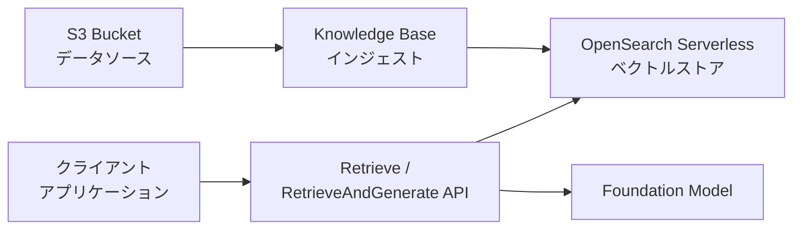
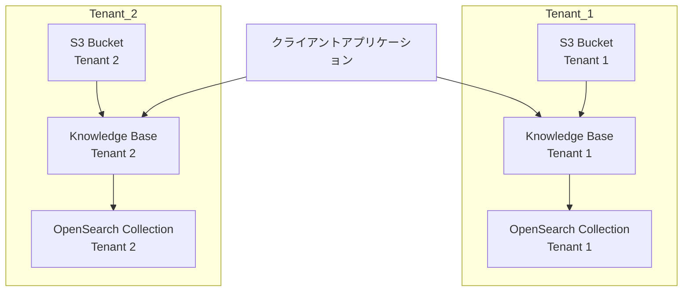
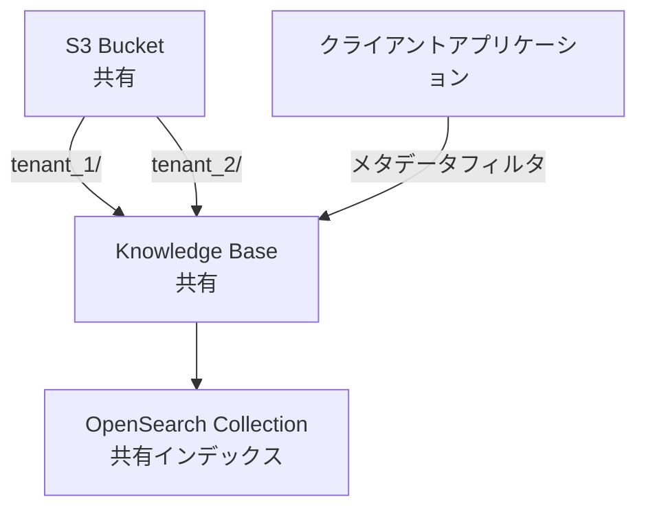
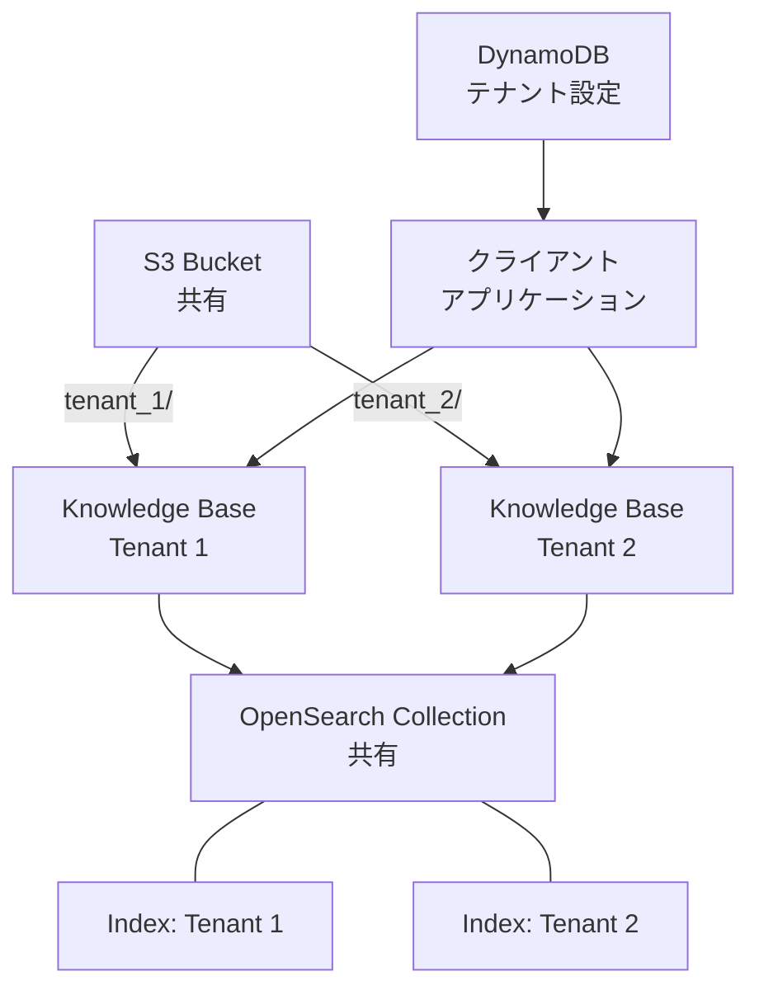
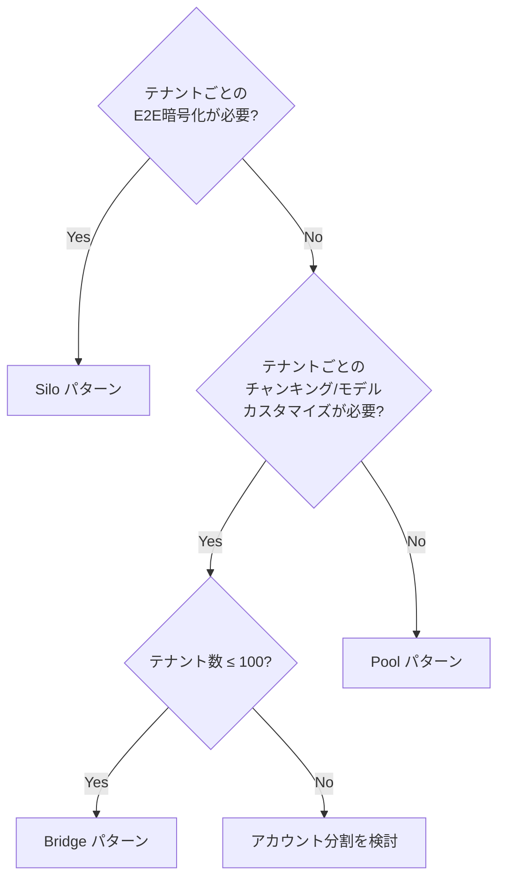

本記事は、AWS公式ブログ [Multi-tenant RAG with Amazon Bedrock Knowledge Bases](https://aws.amazon.com/blogs/machine-learning/multi-tenant-rag-with-amazon-bedrock-knowledge-bases/)（Emanuele Levi, Dani Mitchell, Mehran Nikoo、2024年12月16日公開）の解説記事です。Amazon Bedrock Knowledge Basesを用いたマルチテナントRAGシステムの設計パターンについて、原文の技術的詳細を整理して紹介します。

この記事は [Zenn記事: AWS Bedrock Knowledge Basesベクトルストア3択と本番RAG構成の設計指針](https://zenn.dev/0h_n0/articles/918cb94b30191e) の深掘りです。Zenn記事ではベクトルストアの選定に焦点を当てていますが、本記事ではマルチテナント環境におけるアーキテクチャ設計の具体的なパターンと実装上のトレードオフを詳しく解説します。

## 情報源

| 項目 | 内容 |
|------|------|
| タイトル | Multi-tenant RAG with Amazon Bedrock Knowledge Bases |
| 著者 | Emanuele Levi, Dani Mitchell, Mehran Nikoo |
| URL | [aws.amazon.com](https://aws.amazon.com/blogs/machine-learning/multi-tenant-rag-with-amazon-bedrock-knowledge-bases/) |
| 公開日 | 2024年12月16日 |
| 発行元 | AWS Machine Learning Blog |

## 技術的背景

### マルチテナントRAGの課題

SaaS（Software as a Service）アプリケーションにおいてRAG（Retrieval-Augmented Generation）を導入する際、単一テナントの構成をそのまま複数テナントに拡張することは容易ではない。著者らは、マルチテナントRAGを設計する際に考慮すべき4つの軸を提示している。

**1. テナント分離（Tenant Isolation）**: セキュリティおよび規制要件に基づいて、テナント間のデータアクセスをどの程度厳密に分離するかを決定する必要がある。業界によっては、テナントごとに異なる暗号化キーを使用することが法規制上求められる場合がある。

**2. テナント可変性（Tenant Variability）**: テナントごとにデータのインジェスト頻度、チャンキング戦略、埋め込みモデルの選択などが異なる可能性がある。SaaSプロバイダーは、テナント固有の要件にどこまで対応するかを設計段階で決定する必要がある。

**3. テナント管理の簡素化（Simplified Tenant Management）**: テナントのオンボーディング（新規追加）とオフボーディング（削除）のプロセスをいかに効率化するかは、運用コストに直結する問題である。テナント数が増加するにつれて、自動化の重要性は増す。

**4. コスト効率（Cost Efficiency）**: インフラリソースの共有度合いはコストに大きく影響する。テナントごとに独立したリソースを割り当てれば分離性は高まるが、アイドル時間のコストが無視できなくなる。

### Amazon Bedrock Knowledge Basesの基本構成

マルチテナントパターンの理解に先立ち、Amazon Bedrock Knowledge Basesの基本的なRAG構成を整理しておく。著者らが示す標準的な構成は以下の通りである。



S3バケットにドキュメントを配置し、Knowledge Base（KB）のインジェストジョブがドキュメントをチャンク分割してベクトル化し、OpenSearch Serverlessコレクションに格納する。クエリ時にはRetrieve APIまたはRetrieveAndGenerate APIを通じてベクトル検索を行い、取得したコンテキストとともにFoundation Model（FM）が応答を生成する。

## 実装アーキテクチャ: 3つのパターン

著者らは、マルチテナントRAGのアーキテクチャを3つのパターンに分類している。以下に各パターンの構成、利点、制約を詳述する。

### パターン1: Silo（テナント完全分離）

Siloパターンは、テナントごとに完全に独立したインフラスタックを構築するアプローチである。



**構成要素**:
- テナントごとのS3バケット
- テナントごとのKnowledge Base
- テナントごとのOpenSearch Serverlessコレクション

**利点**:

著者らは、Siloパターンが提供する主な利点として以下を挙げている。

- **テナントごとのKMS暗号化キー**: データソース、Knowledge Base、OpenSearchコレクションの各レイヤーで個別の暗号化キーを設定できる。著者らは「per-tenant end-to-end encryption」と表現している。
- **テナントごとのカスタマイズ**: チャンキング戦略、埋め込みモデル（ベクトル次元数を含む）、HNSWアルゴリズムの設定、距離メトリクス（ユークリッド距離またはドット積）、データ削除ポリシー、インジェストスケジュールをテナント単位で変更できる。
- **性能分離**: テナントごとにOpenSearchコレクションが独立しているため、あるテナントの負荷が他のテナントに影響を与えない。ノイジーネイバー問題が構造的に発生しない。
- **シンプルなクエリ**: テナント識別はインフラレベルで完結するため、クエリ時にメタデータフィルタリングなどの追加ロジックが不要である。

**制約**:

一方で、著者らは以下の制約を指摘している。

- **AWSアカウントあたり最大100 KB**という上限がある。Siloパターンではテナント数がKB数に直結するため、1アカウントで100テナントが上限となる。
- **コストが最も高い**: OpenSearch Serverlessは冗長性有効時にコレクションあたり最低2 OCU（OpenSearch Compute Unit）を消費する。冗長性を無効化しても最低1 OCUが必要である。テナント数に比例してOCUコストが増加する。
- **オンボーディング・オフボーディングが最も複雑**: テナントの追加・削除時にS3バケット、KB、OpenSearchコレクションのフルスタックをプロビジョニング・破棄する必要がある。著者らはInfrastructure as Code（IaC）の使用を推奨している。

**オフボーディング時の注意点**: 著者らは、KB削除時のデータ削除ポリシーを`RETAIN`に設定することを推奨している。これにより、KB削除プロセスがOpenSearchインデックスのデータを自動削除しないため、削除操作の制御が容易になる。

### パターン2: Pool（リソース完全共有）

Poolパターンは、すべてのテナントが同一のインフラを共有するアプローチである。



**構成要素**:
- 単一の共有S3バケット（テナントごとのプレフィックスで論理分離）
- 単一のKnowledge Base
- 単一のOpenSearch Serverlessコレクションおよびインデックス

**利点**:

- **コストが最も低い**: OCUをテナント間で共有するため、アイドル時間のコストが最小化される。著者らは「Sharing OCUs across tenants maximizes the use of each OCU and minimizes the tenants' idle time」と述べている。
- **オンボーディングが最もシンプル**: 新規テナントの追加はS3プレフィックスの作成とメタデータファイルの配置のみで完了する。AWS APIの呼び出しやインフラのプロビジョニングは不要である。
- **運用が簡素**: モニタリングシステムやロギング機能を共有するため、運用の複雑性が低い。

**メタデータファイルの仕組み**:

Poolパターンでのテナント分離は、S3オブジェクトに付随するメタデータファイルによって実現される。著者らは、メタデータファイルの命名規則について「must use the same name as its associated source document file, with `.metadata.json` appended」と規定している。

例えば、`tenant_1/document.pdf` に対応するメタデータファイルは `tenant_1/document.pdf.metadata.json` であり、その内容は以下の通りである。

```json
{
  "metadataAttributes": {
    "tenantId": "tenant_1"
  }
}
```

著者らは、メタデータキー `tenantId` は便宜的に選択されたものであり、任意のキー名に変更可能であると説明している。重要な点として、このメタデータファイルが存在しない場合、クエリ時にそのドキュメントをメタデータフィルタリングで検出できなくなる。

**クエリ時のテナントフィルタリング**:

クエリ時には、`RetrieveAndGenerate` APIの `vectorSearchConfiguration` パラメータでテナントフィルタを指定する。

```python
import boto3

bedrock_agent_runtime = boto3.client(
    service_name="bedrock-agent-runtime"
)

tenant_filter = {
    "equals": {
        "key": "tenantId",
        "value": "tenant_1"
    }
}

retrievalConfiguration = {
    "vectorSearchConfiguration": {
        "filter": tenant_filter
    }
}

bedrock_agent_runtime.retrieve_and_generate(
    input={
        'text': 'ユーザーのクエリ'
    },
    retrieveAndGenerateConfiguration={
        'type': 'KNOWLEDGE_BASE',
        'knowledgeBaseConfiguration': {
            'knowledgeBaseId': '<YOUR_KNOWLEDGEBASE_ID>',
            'modelArn': '<FM_ARN>',
            'retrievalConfiguration': retrievalConfiguration
        }
    }
)
```

**制約**:

- **テナントごとの暗号化キーが設定できない**: データソース、KB、OpenSearchコレクションのすべてで共有の暗号化キーが使用される。
- **テナントごとのカスタマイズが不可**: チャンキング戦略、埋め込みモデル、HNSWパラメータなどはすべてのテナントで共通となる。
- **性能分離がない**: 著者らは「does not offer performance isolation at the vector store level」と述べており、ノイジーネイバー問題が発生しうる。
- **テナント固有のデータ削除が煩雑**: テナント単位でのデータ削除を行うAWS APIが存在しないため、S3オブジェクトの手動削除が必要となる。
- **サービスクォータの共有**: 単一のインジェストジョブあたり最大100 GB、データソースあたり最大500万ドキュメントという制限をすべてのテナントで共有する。

### パターン3: Bridge（バランス型）

Bridgeパターンは、SiloとPoolの中間に位置するアプローチであり、コスト効率とテナントカスタマイズのバランスを取る設計である。



**構成要素**:
- 共有S3バケット（テナントごとのプレフィックスで論理分離）
- テナントごとのKnowledge Base
- 共有OpenSearch Serverlessコレクション（テナントごとのインデックス）
- DynamoDBによるテナント-KB設定マッピングテーブル

**利点**:

著者らは、Bridgeパターンが「Offers the same level of tenant customization offered by the silo pattern while optimizing costs」と述べている。具体的には以下の利点がある。

- **テナントごとのカスタマイズ**: Siloパターンと同等のカスタマイズ性を備える。チャンキング戦略、埋め込みモデル、HNSWパラメータ、距離メトリクス、データ削除ポリシーをテナント単位で設定可能である。
- **OCU共有によるコスト最適化**: OpenSearchコレクションを共有するため、OCUのアイドルコストを削減できる。
- **テナントごとのベクトルインデックス**: 各テナントが独立したインデックスを持つため、インデックスレベルでのメタデータマッピングやベクトル次元数をテナントごとに変更できる。

**DynamoDBによるテナント設定管理**:

Bridgeパターンでは、テナントIDからKB IDおよびモデルARNへのマッピングを外部データストアで管理する必要がある。著者らはDynamoDBテーブルの使用例を示している。

```python
import boto3

dynamodb = boto3.resource('dynamodb')

table_name = 'tenantKbConfig'
attribute_definitions = [
    {'AttributeName': 'tenantId', 'AttributeType': 'S'}
]

key_schema = [
    {'AttributeName': 'tenantId', 'KeyType': 'HASH'}
]

tenant_kb_config_table = dynamodb.create_table(
    TableName=table_name,
    AttributeDefinitions=attribute_definitions,
    KeySchema=key_schema,
    BillingMode='PAY_PER_REQUEST'
)

tenant_kb_config_table.put_item(
    Item={
        'tenantId': 'tenant_1',
        'knowledgebaseId': '<YOUR_KNOWLEDGEBASE_ID>',
        'modelArn': '<FM_ARN>'
    }
)
```

テーブルスキーマは以下の通りである。

| カラム | 型 | 用途 |
|--------|------|------|
| `tenantId` | String（パーティションキー） | テナント識別子 |
| `knowledgebaseId` | String | テナントに紐づくKB ID |
| `modelArn` | String | クエリ時に使用するFMのARN |

クエリ時には、まずDynamoDBからテナント設定を取得し、その設定でBedrock APIを呼び出す。

```python
import json
import boto3

dynamodb = boto3.resource('dynamodb')
bedrock_runtime = boto3.client('bedrock-agent-runtime')
table_name = 'tenantKbConfig'

def get_tenant_config(tenant_id: str) -> dict | None:
    """DynamoDBからテナント固有のKB設定を取得する。"""
    table = dynamodb.Table(table_name)
    response = table.get_item(
        Key={'tenantId': tenant_id}
    )
    if 'Item' in response:
        return {
            'knowledgebaseId': response['Item'].get('knowledgebaseId'),
            'modelArn': response['Item'].get('modelArn')
        }
    else:
        return None

tenant_config = get_tenant_config('tenant_1')

bedrock_runtime.retrieve_and_generate(
    input={'text': 'ユーザーのクエリ'},
    retrieveAndGenerateConfiguration={
        'type': 'KNOWLEDGE_BASE',
        'knowledgeBaseConfiguration': {
            'knowledgeBaseId': tenant_config['knowledgebaseId'],
            'modelArn': tenant_config['modelArn']
        }
    }
)
```

著者らは、テナント設定の保存先について「Depending on your application architecture, you might choose to store `knowledgebaseId` and `modelARN` alongside the other tenant-specific parameters, or create a separate data store」と述べており、既存のテナント管理システムに統合することも選択肢である。

**制約**:

- **テナントごとのKMS暗号化キーには対応しない**: S3バケットとOpenSearchコレクションは共有されるため、暗号化キーも共有となる。著者らは「Does not allow for per-tenant end-to-end encryption」と明記している。ただし、KBレベルではテナントごとのKMSキーを設定可能である。
- **性能分離は限定的**: OpenSearchコレクションを共有するため、OCUの争奪が発生しうる。Siloパターンほどの完全な性能分離は提供されない。
- **クエリクライアントの複雑性が最も高い**: DynamoDBからのテナント設定取得ロジックをクライアント側に実装する必要がある。
- **テナント数上限は100**: SiloパターンとBridgeパターンの双方で、AWSアカウントあたり最大100 KBの制限が適用される。

## 3パターンの比較表

著者らが提示する比較表を以下に整理する。

| 特性 | Pool | Bridge | Silo |
|------|------|--------|------|
| テナントごとのチャンキング戦略 | 不可 | 可 | 可 |
| テナントごとのKMS暗号化（E2E） | 不可 | 不可 | 可 |
| テナントごとの距離メトリクス | 不可 | 可 | 可 |
| テナントごとのANN設定 | 不可 | 可 | 可 |
| テナントごとのデータ削除ポリシー | 不可 | 可 | 可 |
| テナントごとのベクトル次元数 | 不可 | 可 | 可 |
| テナントごとの埋め込みモデル | 不可 | 可 | 可 |
| 性能分離 | なし | なし | あり |
| オンボーディング複雑性 | 低 | 中 | 高 |
| クエリクライアント複雑性 | 中 | 高 | 低 |
| S3テナント管理 | 高（メタデータ） | 中（プレフィックス） | 低（バケット） |
| コスト | 低 | 中 | 高 |

## Production Deployment Guide

原文の技術的詳細と制約から導出される、本番環境へのデプロイに際して考慮すべき事項を整理する。

### パターン選定フローチャート



### サービスクォータの事前確認

本番デプロイ前に、以下のサービスクォータを確認しておく必要がある。著者らが言及しているクォータを整理する。

| リソース | 上限 | 影響するパターン |
|----------|------|------------------|
| AWSアカウントあたりのKB数 | 100 | Silo, Bridge |
| KBあたりの同時インジェストジョブ数 | 1 | 全パターン |
| アカウントあたりの同時インジェストジョブ数 | 5 | 全パターン |
| インジェストジョブあたりの最大データ量 | 100 GB | 全パターン |
| データソースあたりの最大ドキュメント数 | 500万 | Pool（共有のため影響大） |
| OpenSearch Serverless最小OCU（冗長性有効） | 2 per collection | Silo（テナント数比例） |
| OpenSearch Serverless最小OCU（冗長性無効） | 1 per collection | Silo |

Poolパターンでは全テナントがクォータを共有するため、テナント数やデータ量の増加に伴い制約に到達しやすい。一方、SiloパターンではKBあたりのクォータがテナント単位で独立するため、個々のテナントに対する制約は緩和されるが、KB総数の上限に注意が必要である。

### セキュリティ設計

暗号化の観点から、各パターンのKMS設定を以下にまとめる。

| パターン | データソースKMS | KB KMS | コレクションKMS |
|----------|-----------------|--------|-----------------|
| Silo | テナント個別 | テナント個別 | テナント個別 |
| Pool | 共有 | 共有 | 共有 |
| Bridge | 共有 | テナント個別 | 共有 |

規制要件が厳格な業界（金融、医療など）では、テナントごとのE2E暗号化が必要となる場合があり、その場合はSiloパターンが唯一の選択肢となる。Bridgeパターンは、KB層でのテナント個別暗号化は可能だが、S3およびOpenSearchでは共有暗号化となるため、完全なE2E暗号化は実現できない。

### テナントオンボーディング・オフボーディングの自動化

著者らは、テナント管理のためのIaC（Infrastructure as Code）の使用を推奨している。各パターンにおけるオンボーディング・オフボーディングの作業内容は以下の通りである。

**Siloパターン**: テナントのフルスタック（S3バケット、KB、OpenSearchコレクション）のプロビジョニングと破棄が必要。オフボーディング時には、KB削除時のデータ削除ポリシーを`RETAIN`に設定することで、OpenSearchインデックスのデータ削除プロセスを制御することが推奨される。また、ログシンクやモニタリングシステムもテナントごとに更新が必要となりうる。

**Poolパターン**: S3プレフィックスの作成とメタデータファイルの配置のみで完了する。ただし、オフボーディング時にはテナント固有のS3オブジェクトの手動削除が必要であり、テナント単位での一括削除APIは提供されていない。

**Bridgeパターン**: KB、OpenSearchインデックス、DynamoDBエントリの作成が必要。Siloほどの複雑性はないが、Poolよりは手順が多い。DynamoDBのテナント設定エントリの管理も含まれる。

### 本番環境向けの実装上の注意

著者らは本番デプロイにあたり、以下の実装をクライアントアプリケーションに組み込むことを推奨している。

- **セッション管理とエラーハンドリング**: Bedrock APIの呼び出しに対する適切なリトライロジックの実装
- **ロギング**: テナント単位のメトリクス取得。特にPoolパターンでは、テナント固有のメトリクスをクライアント側で収集する必要がある
- **テナントフィルタリングロジックの分離**: テナント識別ロジックをクライアント呼び出しから分離し、保守性を確保する
- **外部テナント管理**: テナントの一覧と状態（アクティブ・非アクティブ）を管理する外部アプリケーションの構築。オンボーディング・オフボーディングプロセスの自動化に寄与する

## パフォーマンス最適化

### インジェスト性能の見積もり

著者らは、インジェスト性能を見積もるための具体的な計算例を示している。以下のパラメータを前提とした計算である。

| パラメータ | 値 |
|-----------|-----|
| 同期対象テナント数 | 10 |
| テナントあたりのドキュメント数 | 100 |
| ドキュメントあたりの平均サイズ | 2 MB（約200,000トークン） |
| チャンクサイズ | 1,000トークン（オーバーラップあり） |
| ドキュメントあたりのチャンク数 | 220 |
| 埋め込みモデル | Amazon Titan Embeddings v2 |
| RPM（Requests Per Minute）制限 | 2,000 |
| TPM（Tokens Per Minute）制限 | 300,000 |

**計算結果**:

$$
\text{総埋め込みリクエスト数} = 10 \times 100 \times 220 = 220{,}000
$$

$$
\text{総トークン数} = 10 \times 100 \times 1{,}000 = 1{,}000{,}000
$$

$$
\text{所要時間（RPMボトルネック）} = \frac{220{,}000}{2{,}000} = 110 \text{ 分} \approx 1\text{時間}50\text{分}
$$

著者らは、この計算が「best-case scenario」であり、FMがベクトルを生成する際のレイテンシは含まれていないと注記している。また、1日あたり約12回のインジェストジョブを実行できる計算となる。

### スケーラビリティに関する考慮

大規模なデータ同期が必要な場合、著者らはプロビジョンドスループットの使用を推奨している。プロビジョンドスループットを利用することで、埋め込みモデルの負荷を分散し、スロットリングを抑制できると述べている。

OpenSearch Serverlessのスケーリング特性として、OCUは6 GBメモリの増分でスケールする。Siloパターンではテナントごとにスケーリングが独立するが、Pool・BridgeパターンではOCUの争奪（ノイジーネイバー問題）が発生しうる。Scale-to-zero機能を活用することで、アイドル時のコストを削減できる。

### KBあたりの同時ジョブ制限への対処

KBあたりの同時インジェストジョブ数は1に制限されている。Poolパターンでは全テナントが単一のKBを共有するため、この制限の影響を受けやすい。SiloおよびBridgeパターンではテナントごとにKBが存在するため、テナント間でインジェストジョブの並列実行が可能である。ただし、アカウントあたりの同時インジェストジョブ数は5に制限されているため、大量のテナントを持つ場合はジョブのスケジューリングが必要となる。

## 運用での学び

### メタデータファイル管理の実装パターン

Poolパターンにおけるメタデータファイルの生成について、著者らは重要な実装上のヒントを提供している。

メタデータファイルの生成プロセスは非同期またはバッチ処理で実行可能である。これは、Amazon Bedrock Knowledge Basesがインジェストジョブの明示的なトリガーを要求するためである。つまり、ドキュメントとメタデータファイルをS3にアップロードした後、インジェストジョブを手動で（またはスケジューラ経由で）開始するまで、インデックスは更新されない。この特性を活かし、メタデータファイルの生成をドキュメントアップロードと非同期に行うことが可能である。

### モニタリング戦略の違い

各パターンによってモニタリング戦略が異なる。

**Siloパターン**: テナントごとにログシンクとモニタリングシステムの更新が必要になりうる。テナントの増加に伴い、ダッシュボードやアラートの管理コストが増大する。

**Poolパターン**: モニタリングシステムとロギング機能を共有するため運用は簡素である。ただし、著者らは「collecting the tenant-specific metrics from the client side to perform specific tenant attribution」が必要であると述べている。つまり、テナント単位の利用状況を把握するためには、クライアントサイドでのメトリクス収集ロジックの実装が不可欠である。

**Bridgeパターン**: DynamoDBのマッピングテーブルを含むシステム全体のヘルスチェックが必要となる。テナント設定の不整合（DynamoDBエントリとKBの不一致など）を検知するための監視機構が求められる。

### パターンの混在と進化

著者らは明示的には述べていないが、実運用では単一パターンの適用が最適でない場合がある。例えば、大口テナント（enterprise tier）にはSiloパターンを適用し、小口テナント（standard tier）にはPoolパターンを適用するハイブリッドアプローチが考えられる。このようなティア別のアーキテクチャ分離により、コスト効率と分離要件のバランスを最適化できる可能性がある。ただし、これは本ブログの範囲外の考察であり、運用の複雑性が増す点には留意が必要である。

## 学術研究との関連

### マルチテナントアーキテクチャの系譜

マルチテナントSaaSアーキテクチャにおけるSilo・Pool・Bridgeの3分類は、AWS SaaSアーキテクチャの文脈で広く参照されるパターンである。このフレームワークは、データベース層のマルチテナンシー（shared schema / shared database / dedicated database）の研究に端を発し、クラウドネイティブアーキテクチャの発展とともに一般化されてきた。

本ブログが扱うRAGシステムへのマルチテナンシーの適用は、ベクトルデータベースの分離戦略という新たな設計空間を提示している。従来のRDBMSベースのマルチテナンシーでは行レベルセキュリティ（Row-Level Security, RLS）やスキーマ分離が主要な分離手法であったが、ベクトルストアではメタデータフィルタリング、インデックス分離、コレクション分離という異なる抽象レベルでの分離が必要となる。

### ノイジーネイバー問題

著者らが指摘するノイジーネイバー問題は、マルチテナントシステムにおける古典的な課題である。あるテナントの負荷が他のテナントの性能に影響を与える現象であり、共有リソースモデルに内在する問題である。本ブログのSiloパターンはこの問題を構造的に排除するが、PoolおよびBridgeパターンでは依然としてリスクが存在する。

### RAGパイプラインにおけるセキュリティ

マルチテナントRAGにおけるデータ漏洩リスクは、従来のマルチテナントシステムとは異なる側面を持つ。ベクトル空間における近傍検索では、メタデータフィルタリングの不備がテナント間のデータ漏洩に直結する。Poolパターンにおけるメタデータフィルタリングの信頼性は、クエリ時のフィルタ適用漏れがないことを前提としており、アプリケーションレベルでの一貫したフィルタリング実装が求められる。

## まとめ

本記事では、AWS公式ブログに基づき、Amazon Bedrock Knowledge Basesを用いたマルチテナントRAGの3つのアーキテクチャパターンを解説した。

**Siloパターン**は、テナントごとの完全分離によりセキュリティと性能の保証を提供するが、コストとオンボーディング複雑性が最も高い。規制要件が厳格な大口テナントに適している。

**Poolパターン**は、リソース共有による最低コストとシンプルな運用を実現するが、テナントカスタマイズ性と性能分離を犠牲にする。多数の小規模テナントを効率的に収容する場合に適している。

**Bridgeパターン**は、テナントごとのKBによるカスタマイズ性とOCU共有によるコスト最適化のバランスを提供する。クエリクライアントの複雑性が最も高い点が実装上の考慮点である。

いずれのパターンにおいても、AWSアカウントあたりのKB上限（100）、インジェストジョブの同時実行制限、メタデータ管理の設計などが本番運用の制約となりうる。パターン選定にあたっては、テナントの分離要件、コスト感度、カスタマイズ要件、テナント数の成長見込みを総合的に評価することが重要である。

## 参考文献

- Emanuele Levi, Dani Mitchell, Mehran Nikoo. "Multi-tenant RAG with Amazon Bedrock Knowledge Bases." AWS Machine Learning Blog, 2024年12月16日. [https://aws.amazon.com/blogs/machine-learning/multi-tenant-rag-with-amazon-bedrock-knowledge-bases/](https://aws.amazon.com/blogs/machine-learning/multi-tenant-rag-with-amazon-bedrock-knowledge-bases/)
- Amazon Bedrock Knowledge Bases Developer Guide. [https://docs.aws.amazon.com/bedrock/latest/userguide/knowledge-base.html](https://docs.aws.amazon.com/bedrock/latest/userguide/knowledge-base.html)
- Amazon OpenSearch Serverless Developer Guide. [https://docs.aws.amazon.com/opensearch-service/latest/developerguide/serverless.html](https://docs.aws.amazon.com/opensearch-service/latest/developerguide/serverless.html)
