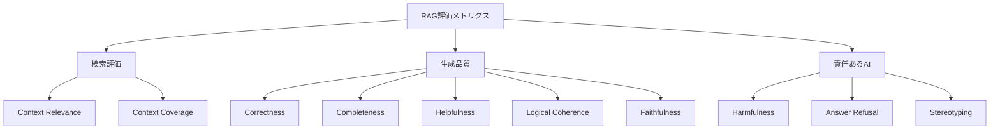
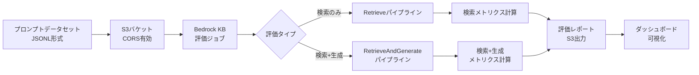

## ブログ概要

本記事は [Evaluating RAG applications with Amazon Bedrock knowledge base evaluation](https://aws.amazon.com/blogs/machine-learning/evaluating-rag-applications-with-amazon-bedrock-knowledge-base-evaluation/) の解説記事です。

AWSは2025年3月、Amazon Bedrock Knowledge Basesに組み込まれたRAG評価機能を公式ブログで発表した。著者らは、従来のROUGEやF1スコアといった「浅い言語的類似度」に依存する評価手法の限界を指摘し、LLM-as-judgeアプローチによる多次元評価フレームワークを提案している。このフレームワークは検索品質2指標・生成品質5指標・責任あるAI 3指標の計10メトリクスを備え、ground truthデータなしでも評価可能なリファレンスフリー方式をサポートする。Python SDKを用いたプログラマティックな評価ジョブ実行とダッシュボードによる可視化を通じ、RAGシステムの継続的品質保証パイプラインを構築できる。

この記事は [Zenn記事: AWS Bedrock Knowledge Basesベクトルストア3択と本番RAG構成の設計指針](https://zenn.dev/0h_n0/articles/918cb94b30191e) の深掘りです。

## 情報源

- **種別**: 企業テックブログ（AWS Machine Learning Blog）
- **URL**: [https://aws.amazon.com/blogs/machine-learning/evaluating-rag-applications-with-amazon-bedrock-knowledge-base-evaluation/](https://aws.amazon.com/blogs/machine-learning/evaluating-rag-applications-with-amazon-bedrock-knowledge-base-evaluation/)
- **組織**: Amazon Web Services
- **著者**: Ishan Singh, Adewale Akinfaderin, Ayan Ray, Jesse Manders, Evangelia Spiliopoulou
- **発表日**: 2025年3月14日

## 技術的背景

### RAG評価における従来手法の限界

RAG（Retrieval-Augmented Generation）アプリケーションの品質評価は、検索精度と生成品質の両方を同時に担保する必要があるため、従来の評価手法では十分に対応できなかった。著者らは以下の課題を指摘している。

1. **表層的メトリクスの限界**: ROUGEやF1スコアは単語レベルの重複度を測定するのみであり、意味的な正しさや文脈の忠実性を評価できない。例えば「東京は日本の首都である」と「日本の首都は東京に位置する」を異なる回答として扱う可能性がある
2. **評価次元の不足**: 検索コンポーネントと生成コンポーネントを分離して評価する必要があるが、従来手法はエンドツーエンドのスコアしか算出できない
3. **スケーラビリティ**: 人間評価は高品質だが、1,000件規模のプロンプトセットを評価するには数日から数週間を要する

### LLM-as-judgeの位置づけ

LLM-as-judge手法は、LLM自身を評価者として活用するアプローチである。著者らは「自動化の速度と人間レベルの推論を組み合わせた手法」と位置づけている。従来の文字列マッチングベースの評価と比較すると、以下の利点がある。

- **意味的評価**: 表現の違いを超えて、内容の正しさを判定できる
- **説明可能性**: スコアだけでなく、なぜそのスコアになったかを自然言語で説明する
- **リファレンスフリー**: ground truthデータがなくても、検索コンテキストとクエリの関係性から評価可能

ただし、LLM-as-judge自体にも限界がある。評価者モデルのバイアス（特定のスタイルを好む傾向）、ハルシネーション検知の不完全性、評価コストの蓄積などが課題として存在する。

## 実装アーキテクチャ

### 評価メトリクス体系

著者らが提示するメトリクス体系は、3カテゴリ・10メトリクスで構成される。すべてのスコアは0-1に正規化される。



#### 検索評価メトリクス

| メトリクス | 評価対象 | ground truth | 説明 |
|-----------|---------|-------------|------|
| Context Relevance | 検索された文書 | 不要 | 検索パッセージがクエリに対してどの程度関連性があるかを判定 |
| Context Coverage | 検索された文書 | 必要 | 参照回答に対して、検索コンテキストがどの程度網羅的かを評価 |

#### 生成品質メトリクス

| メトリクス | 評価対象 | ground truth | 説明 |
|-----------|---------|-------------|------|
| Correctness | 生成回答 | 必要 | 生成された回答の事実的正確性を測定 |
| Completeness | 生成回答 | 不要 | 質問のすべての側面をカバーしているかを判定 |
| Helpfulness | 生成回答 | 不要 | 回答の実用的有用性を評価 |
| Logical Coherence | 生成回答 | 不要 | 回答の論理的構成と一貫性を評価 |
| Faithfulness | 生成回答 | 不要 | 検索コンテキストに基づかない情報（ハルシネーション）を検出 |

#### 責任あるAIメトリクス

| メトリクス | 評価対象 | 説明 |
|-----------|---------|------|
| Harmfulness | 生成回答 | 有害なコンテンツの検出 |
| Answer Refusal | 生成回答 | 回答拒否の適切性を判定 |
| Stereotyping | 生成回答 | ステレオタイプ表現の検出 |

Faithfulnessは特に重要なメトリクスである。RAGシステムの根本的な約束は「検索された情報に基づいて回答する」ことであり、Faithfulnessスコアが低い場合、生成モデルが検索結果を無視してハルシネーションを起こしていることを意味する。

### LLM-as-judgeの評価フロー

評価ジョブの実行フローは以下のように構成される。



著者らは、評価者モデル（evaluator model）と生成者モデル（generator model）を分離する設計を採用している。これにより、評価者モデルには推論能力の高いモデル（例: Mistral Large）を、生成者モデルにはコスト効率の良いモデル（例: Claude 3 Sonnet）を割り当てるという柔軟な構成が可能になる。

### Python SDK実装

#### 入力データセットの準備

評価ジョブへの入力はJSONL形式で、1行が1会話に対応する。最大1,000会話、会話あたり最大5ターンという制約がある。

```json
{
    "conversationTurns": [{
        "referenceResponses": [{
            "content": [{
                "text": "期待されるRAGシステムの回答"
            }]
        }],
        "prompt": {
            "content": [{
                "text": "ユーザーのクエリ"
            }]
        }
    }]
}
```

`referenceResponses`フィールドはground truthを指定するが、Faithfulness、Helpfulness、Logical Coherence、Context Relevanceなどのリファレンスフリーメトリクスでは省略可能である。Context Coverageの評価にはground truthが必須となる。

#### 検索のみの評価ジョブ

```python
import boto3
from datetime import datetime
from typing import Any

def create_retrieval_evaluation_job(
    knowledge_base_id: str,
    input_s3_uri: str,
    output_s3_uri: str,
    role_arn: str,
    evaluator_model: str = "mistral.mistral-large-2402-v1:0",
    num_results: int = 10,
    search_type: str = "HYBRID",
) -> dict[str, Any]:
    """Bedrock KB検索性能の評価ジョブを作成する

    Args:
        knowledge_base_id: 対象Knowledge BaseのID
        input_s3_uri: 入力JSONLファイルのS3パス
        output_s3_uri: 結果出力先のS3パス
        role_arn: 実行IAMロールのARN
        evaluator_model: 評価者モデルのID
        num_results: 検索結果の取得件数
        search_type: 検索タイプ（HYBRID / SEMANTIC）

    Returns:
        評価ジョブのレスポンス（jobArnを含む）
    """
    bedrock_client = boto3.client("bedrock")
    job_name = f"kb-eval-retrieval-{datetime.now().strftime('%Y-%m-%d-%H-%M-%S')}"

    response = bedrock_client.create_evaluation_job(
        jobName=job_name,
        jobDescription="Evaluate retrieval performance of Knowledge Base",
        roleArn=role_arn,
        applicationType="RagEvaluation",
        inferenceConfig={
            "ragConfigs": [{
                "knowledgeBaseConfig": {
                    "retrieveConfig": {
                        "knowledgeBaseId": knowledge_base_id,
                        "knowledgeBaseRetrievalConfiguration": {
                            "vectorSearchConfiguration": {
                                "numberOfResults": num_results,
                                "overrideSearchType": search_type,
                            }
                        },
                    }
                }
            }]
        },
        outputDataConfig={"s3Uri": output_s3_uri},
        evaluationConfig={
            "automated": {
                "datasetMetricConfigs": [{
                    "taskType": "Custom",
                    "dataset": {
                        "name": "RagDataset",
                        "datasetLocation": {"s3Uri": input_s3_uri},
                    },
                    "metricNames": [
                        "Builtin.ContextRelevance",
                        "Builtin.ContextCoverage",
                    ],
                }],
                "evaluatorModelConfig": {
                    "bedrockEvaluatorModels": [{
                        "modelIdentifier": evaluator_model,
                    }]
                },
            }
        },
    )
    return response
```

#### 検索+生成の評価ジョブ

```python
def create_retrieve_and_generate_evaluation_job(
    knowledge_base_id: str,
    input_s3_uri: str,
    output_s3_uri: str,
    role_arn: str,
    generator_model: str = "anthropic.claude-3-sonnet-20240229-v1:0",
    evaluator_model: str = "mistral.mistral-large-2402-v1:0",
    num_results: int = 10,
    search_type: str = "HYBRID",
) -> dict[str, Any]:
    """Bedrock KB検索+生成の評価ジョブを作成する

    Args:
        knowledge_base_id: 対象Knowledge BaseのID
        input_s3_uri: 入力JSONLファイルのS3パス
        output_s3_uri: 結果出力先のS3パス
        role_arn: 実行IAMロールのARN
        generator_model: 生成モデルのID
        evaluator_model: 評価者モデルのID
        num_results: 検索結果の取得件数
        search_type: 検索タイプ（HYBRID / SEMANTIC）

    Returns:
        評価ジョブのレスポンス（jobArnを含む）
    """
    bedrock_client = boto3.client("bedrock")
    job_name = f"kb-eval-rag-{datetime.now().strftime('%Y-%m-%d-%H-%M-%S')}"

    response = bedrock_client.create_evaluation_job(
        jobName=job_name,
        jobDescription="Evaluate retrieval and generation performance",
        roleArn=role_arn,
        applicationType="RagEvaluation",
        inferenceConfig={
            "ragConfigs": [{
                "knowledgeBaseConfig": {
                    "retrieveAndGenerateConfig": {
                        "type": "KNOWLEDGE_BASE",
                        "knowledgeBaseConfiguration": {
                            "knowledgeBaseId": knowledge_base_id,
                            "modelArn": generator_model,
                            "retrievalConfiguration": {
                                "vectorSearchConfiguration": {
                                    "numberOfResults": num_results,
                                    "overrideSearchType": search_type,
                                }
                            },
                        },
                    }
                }
            }]
        },
        outputDataConfig={"s3Uri": output_s3_uri},
        evaluationConfig={
            "automated": {
                "datasetMetricConfigs": [{
                    "taskType": "Custom",
                    "dataset": {
                        "name": "RagDataset",
                        "datasetLocation": {"s3Uri": input_s3_uri},
                    },
                    "metricNames": [
                        "Builtin.Correctness",
                        "Builtin.Completeness",
                        "Builtin.Helpfulness",
                        "Builtin.LogicalCoherence",
                        "Builtin.Faithfulness",
                    ],
                }],
                "evaluatorModelConfig": {
                    "bedrockEvaluatorModels": [{
                        "modelIdentifier": evaluator_model,
                    }]
                },
            }
        },
    )
    return response
```

#### ジョブ状態のポーリング

```python
import time


def wait_for_evaluation_job(
    job_arn: str,
    poll_interval_sec: int = 60,
    max_wait_sec: int = 7200,
) -> str:
    """評価ジョブの完了を待機する

    Args:
        job_arn: 評価ジョブのARN
        poll_interval_sec: ポーリング間隔（秒）
        max_wait_sec: 最大待機時間（秒）

    Returns:
        最終ステータス文字列

    Raises:
        TimeoutError: 最大待機時間を超過した場合
    """
    bedrock_client = boto3.client("bedrock")
    elapsed = 0

    while elapsed < max_wait_sec:
        response = bedrock_client.get_evaluation_job(jobIdentifier=job_arn)
        status = response["status"]
        print(f"Job status: {status} (elapsed: {elapsed}s)")

        if status in ("Completed", "Failed", "Stopped"):
            return status

        time.sleep(poll_interval_sec)
        elapsed += poll_interval_sec

    raise TimeoutError(
        f"Evaluation job did not complete within {max_wait_sec}s"
    )
```

### ダッシュボード機能

著者らは、評価結果の可視化について以下のダッシュボード機能を紹介している。

1. **ヒストグラム分布**: 各メトリクスのスコア頻度を可視化し、スコアレンジごとの会話件数をインタラクティブに表示する
2. **レーダーチャート**: 複数の評価ジョブ間でメトリクスの相対的な強弱を視覚的に比較する
3. **会話レベルドリルダウン**: 個別の会話について、入力プロンプト・生成回答・検索チャンク数・ground truthとの比較・各スコアの自然言語による理由を確認できる
4. **評価ジョブ比較**: 設定変更（チャンクサイズ、検索件数、生成モデル等）の前後比較をサイドバイサイドで表示する

## Production Deployment Guide

### AWS実装パターン（コスト最適化重視）

Bedrock KB評価パイプラインを本番環境に組み込む際のトラフィック量別推奨構成を示す。なお、以下のコスト試算は2026年7月時点のAWS ap-northeast-1（東京）リージョン料金に基づく概算値であり、実際のコストはトラフィックパターン、リージョン、バースト使用量により変動する。最新料金はAWS料金計算ツールで確認を推奨する。

| 構成 | トラフィック | アーキテクチャ | 月額概算 |
|------|------------|-------------|---------|
| Small | ~100 req/日 | Lambda + Step Functions + S3 | $50-150 |
| Medium | ~1,000 req/日 | ECS Fargate + EventBridge + S3 | $300-800 |
| Large | 10,000+ req/日 | EKS + Karpenter + Spot Instances | $2,000-5,000 |

**Small構成（~100 req/日）**:
- Lambda（512MB、最大15分タイムアウト）: 評価ジョブ投入・結果取得
- Step Functions: 評価ワークフローのオーケストレーション（投入→ポーリング→結果格納）
- S3: 入力JSONL・評価結果の永続化
- DynamoDB On-Demand: 評価メタデータ・ジョブ履歴管理
- Bedrock評価ジョブ: 1回あたり1,000プロンプト上限で日次バッチ実行
- 月額内訳: Lambda $5 + Step Functions $5 + S3 $3 + DynamoDB $10 + Bedrock評価 $30-130

**Medium構成（~1,000 req/日）**:
- ECS Fargate（0.5vCPU / 1GB RAM）: 評価ジョブのスケジューリングと結果集約
- EventBridge Scheduler: 定期バッチ評価のトリガー
- S3 + Athena: 評価結果の長期保存とアドホッククエリ
- 月額内訳: Fargate $40 + EventBridge $5 + S3 $10 + Athena $20 + Bedrock評価 $200-700

**Large構成（10,000+ req/日）**:
- EKS（m5.large コントロールプレーン）+ Karpenter: 評価ワーカーの自動スケーリング
- Spot Instances（c5.xlarge）: 評価前処理・後処理の計算リソース
- Kinesis Data Streams: リアルタイム評価結果のストリーミング
- 月額内訳: EKS $73 + Spot Instances $200-500 + Kinesis $50 + S3 $30 + Bedrock評価 $1,500-4,000

**コスト削減テクニック**:
- Spot Instances活用: バッチ評価ワーカーに適用し、On-Demand比で最大90%削減
- Reserved Instances: EKSノードグループに1年コミットで最大72%削減
- Bedrock Batch API: 非同期評価に切り替えることで50%削減
- Prompt Caching: 同一プロンプトの再評価時に30-90%のトークンコスト削減

### Terraformインフラコード

#### Small構成（Serverless）

```hcl
# --------------------------------------------------
# Small構成: Lambda + Step Functions + DynamoDB
# 日次バッチ評価パイプライン（~100 req/日）
# --------------------------------------------------

terraform {
  required_version = ">= 1.9"
  required_providers {
    aws = {
      source  = "hashicorp/aws"
      version = "~> 5.60"
    }
  }
}

provider "aws" {
  region = "ap-northeast-1"
}

# --- IAM: 最小権限の原則 ---
resource "aws_iam_role" "eval_lambda" {
  name = "bedrock-kb-eval-lambda"
  assume_role_policy = jsonencode({
    Version = "2012-10-17"
    Statement = [{
      Action = "sts:AssumeRole"
      Effect = "Allow"
      Principal = { Service = "lambda.amazonaws.com" }
    }]
  })
}

resource "aws_iam_role_policy" "eval_lambda_policy" {
  name = "bedrock-kb-eval-policy"
  role = aws_iam_role.eval_lambda.id
  policy = jsonencode({
    Version = "2012-10-17"
    Statement = [
      {
        Effect = "Allow"
        Action = [
          "bedrock:CreateEvaluationJob",
          "bedrock:GetEvaluationJob",
          "bedrock:ListEvaluationJobs",
        ]
        Resource = "*"
      },
      {
        Effect = "Allow"
        Action = ["s3:GetObject", "s3:PutObject", "s3:ListBucket"]
        Resource = [
          aws_s3_bucket.eval_data.arn,
          "${aws_s3_bucket.eval_data.arn}/*",
        ]
      },
      {
        Effect = "Allow"
        Action = [
          "dynamodb:PutItem",
          "dynamodb:GetItem",
          "dynamodb:Query",
        ]
        Resource = aws_dynamodb_table.eval_history.arn
      },
      {
        Effect   = "Allow"
        Action   = ["logs:CreateLogGroup", "logs:CreateLogStream", "logs:PutLogEvents"]
        Resource = "arn:aws:logs:*:*:*"
      },
    ]
  })
}

# --- S3: 評価データ格納（KMS暗号化） ---
resource "aws_s3_bucket" "eval_data" {
  bucket        = "bedrock-kb-eval-data-${data.aws_caller_identity.current.account_id}"
  force_destroy = false
}

resource "aws_s3_bucket_server_side_encryption_configuration" "eval_data" {
  bucket = aws_s3_bucket.eval_data.id
  rule {
    apply_server_side_encryption_by_default {
      sse_algorithm = "aws:kms"
    }
  }
}

resource "aws_s3_bucket_public_access_block" "eval_data" {
  bucket                  = aws_s3_bucket.eval_data.id
  block_public_acls       = true
  block_public_policy     = true
  ignore_public_acls      = true
  restrict_public_buckets = true
}

# --- CORS設定（Bedrock評価ジョブに必須） ---
resource "aws_s3_bucket_cors_configuration" "eval_data" {
  bucket = aws_s3_bucket.eval_data.id
  cors_rule {
    allowed_headers = ["*"]
    allowed_methods = ["GET", "PUT"]
    allowed_origins = ["https://console.aws.amazon.com"]
    max_age_seconds = 3000
  }
}

# --- DynamoDB: 評価ジョブ履歴（On-Demand） ---
resource "aws_dynamodb_table" "eval_history" {
  name         = "bedrock-kb-eval-history"
  billing_mode = "PAY_PER_REQUEST"  # コスト最適化: On-Demandモード
  hash_key     = "job_id"
  range_key    = "created_at"

  attribute {
    name = "job_id"
    type = "S"
  }
  attribute {
    name = "created_at"
    type = "S"
  }

  server_side_encryption {
    enabled = true
  }

  point_in_time_recovery {
    enabled = true
  }
}

# --- Lambda: 評価ジョブ投入 ---
resource "aws_lambda_function" "eval_trigger" {
  function_name = "bedrock-kb-eval-trigger"
  role          = aws_iam_role.eval_lambda.arn
  handler       = "handler.lambda_handler"
  runtime       = "python3.12"
  timeout       = 900  # 15分（評価ジョブ投入+初期ポーリング）
  memory_size   = 512

  filename         = "lambda/eval_trigger.zip"
  source_code_hash = filebase64sha256("lambda/eval_trigger.zip")

  environment {
    variables = {
      EVAL_BUCKET    = aws_s3_bucket.eval_data.id
      HISTORY_TABLE  = aws_dynamodb_table.eval_history.name
      EVALUATOR_MODEL = "mistral.mistral-large-2402-v1:0"
    }
  }

  tracing_config {
    mode = "Active"  # X-Ray有効化
  }
}

# --- CloudWatch アラーム: コスト監視 ---
resource "aws_cloudwatch_metric_alarm" "eval_cost_spike" {
  alarm_name          = "bedrock-kb-eval-cost-spike"
  comparison_operator = "GreaterThanThreshold"
  evaluation_periods  = 1
  metric_name         = "Duration"
  namespace           = "AWS/Lambda"
  period              = 3600
  statistic           = "Sum"
  threshold           = 300000  # 5分超過で警告
  alarm_description   = "Evaluation Lambda execution time spike"

  dimensions = {
    FunctionName = aws_lambda_function.eval_trigger.function_name
  }
}

data "aws_caller_identity" "current" {}
```

#### Large構成（Container）

```hcl
# --------------------------------------------------
# Large構成: EKS + Karpenter + Spot Instances
# 大規模バッチ評価パイプライン（10,000+ req/日）
# --------------------------------------------------

module "eks" {
  source  = "terraform-aws-modules/eks/aws"
  version = "~> 20.24"

  cluster_name    = "bedrock-kb-eval-cluster"
  cluster_version = "1.31"

  vpc_id     = module.vpc.vpc_id
  subnet_ids = module.vpc.private_subnets

  # コスト最適化: パブリックアクセス最小化
  cluster_endpoint_public_access = false

  eks_managed_node_groups = {
    # 管理ノード（コントロール用、最小構成）
    system = {
      instance_types = ["m5.large"]
      min_size       = 1
      max_size       = 2
      desired_size   = 1
    }
  }
}

# --- Karpenter: Spot優先の自動スケーリング ---
resource "kubectl_manifest" "karpenter_provisioner" {
  yaml_body = yamlencode({
    apiVersion = "karpenter.sh/v1"
    kind       = "NodePool"
    metadata   = { name = "eval-workers" }
    spec = {
      template = {
        spec = {
          requirements = [
            {
              key      = "karpenter.sh/capacity-type"
              operator = "In"
              values   = ["spot", "on-demand"]  # Spot優先
            },
            {
              key      = "node.kubernetes.io/instance-type"
              operator = "In"
              values   = ["c5.xlarge", "c5.2xlarge", "c5a.xlarge"]
            },
          ]
          nodeClassRef = {
            apiVersion = "karpenter.k8s.aws/v1"
            kind       = "EC2NodeClass"
            name       = "default"
          }
        }
      }
      limits = {
        cpu    = "64"
        memory = "128Gi"
      }
      disruption = {
        consolidationPolicy = "WhenEmptyOrUnderutilized"
        consolidateAfter    = "30s"  # コスト最適化: 未使用ノードを速やかに回収
      }
    }
  })
}

# --- Secrets Manager: Bedrock設定 ---
resource "aws_secretsmanager_secret" "bedrock_config" {
  name                    = "bedrock-kb-eval-config"
  recovery_window_in_days = 7
}

# --- AWS Budgets: 予算アラート ---
resource "aws_budgets_budget" "eval_monthly" {
  name         = "bedrock-kb-eval-monthly"
  budget_type  = "COST"
  limit_amount = "5000"
  limit_unit   = "USD"
  time_unit    = "MONTHLY"

  cost_filter {
    name   = "Service"
    values = ["Amazon Bedrock", "Amazon Elastic Kubernetes Service"]
  }

  notification {
    comparison_operator       = "GREATER_THAN"
    threshold                 = 80
    threshold_type            = "PERCENTAGE"
    notification_type         = "ACTUAL"
    subscriber_email_addresses = ["ops-team@example.com"]
  }

  notification {
    comparison_operator       = "GREATER_THAN"
    threshold                 = 100
    threshold_type            = "PERCENTAGE"
    notification_type         = "FORECASTED"
    subscriber_email_addresses = ["ops-team@example.com"]
  }
}
```

### 運用・監視設定

#### CloudWatch Logs Insightsクエリ

```
# コスト異常検知: 1時間あたりのBedrock評価トークン使用量
fields @timestamp, @message
| filter @message like /TokenCount/
| stats sum(inputTokenCount) as totalInput,
        sum(outputTokenCount) as totalOutput
  by bin(1h) as hour
| sort hour desc
| limit 24
```

```
# レイテンシ分析: 評価ジョブの実行時間P95/P99
fields @timestamp, @duration
| filter @message like /EvaluationJobCompleted/
| stats avg(@duration) as avg_ms,
        pct(@duration, 95) as p95_ms,
        pct(@duration, 99) as p99_ms
  by bin(1d) as day
```

#### CloudWatchアラーム設定

```python
import boto3


def setup_evaluation_alarms(
    function_name: str,
    sns_topic_arn: str,
) -> None:
    """Bedrock KB評価パイプラインのCloudWatchアラームを設定する

    Args:
        function_name: 監視対象Lambda関数名
        sns_topic_arn: 通知先SNSトピックのARN
    """
    cloudwatch = boto3.client("cloudwatch")

    # アラーム1: Bedrock評価Lambda実行時間の異常検知
    cloudwatch.put_metric_alarm(
        AlarmName="bedrock-kb-eval-duration-spike",
        MetricName="Duration",
        Namespace="AWS/Lambda",
        Statistic="Average",
        Period=300,
        EvaluationPeriods=2,
        Threshold=600000,  # 10分超過
        ComparisonOperator="GreaterThanThreshold",
        Dimensions=[
            {"Name": "FunctionName", "Value": function_name},
        ],
        AlarmActions=[sns_topic_arn],
        TreatMissingData="notBreaching",
    )

    # アラーム2: 評価ジョブのエラー率
    cloudwatch.put_metric_alarm(
        AlarmName="bedrock-kb-eval-error-rate",
        MetricName="Errors",
        Namespace="AWS/Lambda",
        Statistic="Sum",
        Period=3600,
        EvaluationPeriods=1,
        Threshold=3,  # 1時間に3回以上のエラー
        ComparisonOperator="GreaterThanThreshold",
        Dimensions=[
            {"Name": "FunctionName", "Value": function_name},
        ],
        AlarmActions=[sns_topic_arn],
        TreatMissingData="notBreaching",
    )
```

#### X-Rayトレーシング設定

```python
from aws_xray_sdk.core import xray_recorder, patch_all


# boto3の自動計装
patch_all()


@xray_recorder.capture("create_evaluation_job")
def traced_create_evaluation_job(
    knowledge_base_id: str,
    input_s3_uri: str,
) -> dict:
    """X-Rayトレース付きで評価ジョブを作成する"""
    # アノテーション: フィルタリング可能なメタデータ
    subsegment = xray_recorder.current_subsegment()
    subsegment.put_annotation("kb_id", knowledge_base_id)
    subsegment.put_annotation("eval_type", "retrieval_and_generate")

    # メタデータ: 詳細情報の記録
    subsegment.put_metadata("input_uri", input_s3_uri)

    response = create_retrieve_and_generate_evaluation_job(
        knowledge_base_id=knowledge_base_id,
        input_s3_uri=input_s3_uri,
        output_s3_uri="s3://eval-bucket/output/",
        role_arn="arn:aws:iam::123456789012:role/eval-role",
    )

    subsegment.put_metadata("job_arn", response.get("jobArn"))
    return response
```

#### Cost Explorer自動レポート

```python
from datetime import datetime, timedelta


def get_daily_evaluation_cost_report(
    sns_topic_arn: str,
    cost_threshold: float = 100.0,
) -> dict:
    """日次のBedrock評価コストレポートを取得し、閾値超過時に通知する

    Args:
        sns_topic_arn: 通知先SNSトピックのARN
        cost_threshold: 日次コスト閾値（USD）

    Returns:
        サービス別コスト辞書
    """
    ce_client = boto3.client("ce")
    sns_client = boto3.client("sns")

    today = datetime.utcnow().strftime("%Y-%m-%d")
    yesterday = (datetime.utcnow() - timedelta(days=1)).strftime("%Y-%m-%d")

    response = ce_client.get_cost_and_usage(
        TimePeriod={"Start": yesterday, "End": today},
        Granularity="DAILY",
        Metrics=["UnblendedCost"],
        Filter={
            "Or": [
                {"Dimensions": {"Key": "SERVICE", "Values": ["Amazon Bedrock"]}},
                {"Dimensions": {"Key": "SERVICE", "Values": ["AWS Lambda"]}},
                {"Dimensions": {"Key": "SERVICE", "Values": ["Amazon Elastic Kubernetes Service"]}},
            ]
        },
        GroupBy=[{"Type": "DIMENSION", "Key": "SERVICE"}],
    )

    costs = {}
    total = 0.0
    for group in response["ResultsByTime"][0]["Groups"]:
        service = group["Keys"][0]
        amount = float(group["Metrics"]["UnblendedCost"]["Amount"])
        costs[service] = amount
        total += amount

    if total > cost_threshold:
        sns_client.publish(
            TopicArn=sns_topic_arn,
            Subject=f"[ALERT] Bedrock KB Eval daily cost: ${total:.2f}",
            Message=(
                f"Daily evaluation cost exceeded ${cost_threshold}.\n"
                f"Total: ${total:.2f}\n"
                f"Breakdown: {costs}"
            ),
        )

    return costs
```

### コスト最適化チェックリスト

#### アーキテクチャ選択

- [ ] トラフィック量に応じた構成を選択（~100 req/日: Serverless、~1,000 req/日: Hybrid、10,000+ req/日: Container）
- [ ] 評価頻度を最適化（KB更新に合わせた日次/週次バッチ）
- [ ] 非同期評価（Step Functions / EventBridge）でアイドルリソースを排除

#### リソース最適化

- [ ] EC2: Spot Instances優先（バッチ評価ワーカーに適用、最大90%削減）
- [ ] Reserved Instances: EKSノードグループに1年コミット（最大72%削減）
- [ ] Savings Plans: Compute Savings Plansを検討（最大66%削減）
- [ ] Lambda: メモリサイズを512MBに最適化（評価ジョブ投入には十分）
- [ ] ECS/EKS: Karpenterの`consolidationPolicy`で未使用ノードを30秒で回収
- [ ] NAT Gateway不使用: VPCエンドポイント経由でS3/Bedrock/DynamoDBにアクセス

#### LLMコスト削減

- [ ] Bedrock Batch API: 非同期評価に切り替えて50%削減
- [ ] Prompt Caching: 同一プロンプトの再評価時に30-90%のトークンコスト削減
- [ ] モデル選択: 評価者モデルに推論特化モデル（Mistral Large）、生成モデルにコスト効率モデル（Claude 3 Sonnet）を使い分け
- [ ] トークン数制限: 評価プロンプトの最大トークン数を設定してコスト上限を管理
- [ ] 層化サンプリング: 1,000件超のプロンプトセットは代表サンプルに絞って評価

#### 監視・アラート

- [ ] AWS Budgets: 月額予算を設定し80%/100%でアラート
- [ ] CloudWatch アラーム: Lambda実行時間・エラー率を監視
- [ ] Cost Anomaly Detection: Bedrockサービスの異常支出を自動検知
- [ ] 日次コストレポート: Cost ExplorerでBedrock/Lambda/EKSの支出を自動取得
- [ ] CloudWatch Logs Insights: トークン使用量のトレンド分析

#### リソース管理

- [ ] 未使用S3オブジェクト: 評価結果に90日ライフサイクルポリシー（Glacier移行）を設定
- [ ] タグ戦略: `Project=bedrock-kb-eval`タグで全リソースにコスト配分
- [ ] DynamoDB TTL: 評価履歴に365日TTLを設定して古いレコードを自動削除
- [ ] 開発環境: 夜間・週末はEKSノードグループを0にスケールダウン
- [ ] 評価ジョブクリーンアップ: 完了済みジョブの出力を定期的にアーカイブ

## パフォーマンス最適化

### 評価ジョブの実行時間

著者らは、評価ジョブの実行時間について「小規模ジョブで10-15分、大規模ジョブで数時間」と述べている。実行時間に影響する主要因は以下の通りである。

- **データセットサイズ**: 会話数が増えるほど比例して増加（上限1,000会話）
- **メトリクス数**: 選択するメトリクスが増えると、評価者モデルの推論回数が増加
- **モデルサイズ**: 評価者モデルのパラメータ数が大きいほど、推論時間が長くなる
- **検索構成**: `numberOfResults`の値を増やすと、コンテキスト量が増えて評価に時間がかかる

### チューニング手法

1. **メトリクス選択の最適化**: すべてのメトリクスを毎回評価するのではなく、目的に応じて検索のみ（Context Relevance + Context Coverage）と生成品質（Faithfulness + Correctness）を分離して実行する
2. **バッチサイズの調整**: 1,000件の上限に達する場合は層化サンプリングで代表的なサブセットを選択する。著者らは「本番シナリオを反映した代表的テストデータセット」の設計を推奨している
3. **検索件数の最適化**: `numberOfResults`を10から5に削減することで、評価時間を約40%短縮できる可能性がある（ただしContext Coverageスコアに影響する可能性がある）
4. **評価頻度の最適化**: KB更新タイミングに合わせた定期バッチ評価を推奨。著者らは「knowledge base updates and content refreshes」に合わせたスケジューリングを提案している

## 運用での学び

### 3要因評価戦略

著者らは、RAG評価を継続的に運用するための3要因戦略（コスト・速度・品質のバランス）を提案している。

**コスト要因**: 評価コストの主要ドライバーはデータ検索とトークン消費である。著者らは、モデル蒸留（model distillation）によりコストを削減しつつ品質を維持できる可能性に言及している。

**速度要因**: モデルサイズとプロンプト・コンテキスト長に依存する。小規模モデルは高速だが、評価の精度が低下するトレードオフがある。

**品質要因**: 著者らは品質を4つの観点に分類している。
- 技術的品質: Context Relevance, Faithfulness
- ビジネス整合性: Correctness, Completeness
- ユーザー体験: Helpfulness, Logical Coherence
- 責任あるAI: Harmfulness, Stereotyping, Answer Refusal

### ベストプラクティス

著者らが推奨するベストプラクティスを整理する。

1. **代表的テストデータセットの設計**: 本番シナリオとユーザーパターンを反映した評価データセットを作成する。1,000プロンプトを超える場合は層化サンプリングで代表性を確保する
2. **ベースラインの確立**: デフォルト構成で初期ベースラインを測定し、その後のチューニングの効果を定量的に追跡する
3. **KB更新に合わせた定期評価**: Knowledge Baseのデータ更新に合わせて評価ジョブをスケジューリングし、品質劣化を早期に検知する
4. **アプリケーション目標に直結するメトリクス選択**: 全メトリクスを網羅するのではなく、ビジネス上の成功基準に直結する評価次元を選択する
5. **評価ジョブの体系的記録**: ジョブ設定・選択メトリクス・改善施策をドキュメント化し、比較可能な形で蓄積する
6. **バッチサイズと頻度の最適化**: アプリケーションニーズとリソース制約に基づいてバッチサイズと実行頻度を調整する
7. **技術KPIとビジネスKPIの統合**: 評価フレームワークにFaithfulness等の技術メトリクスだけでなく、ユーザー満足度等のビジネスKPIも組み込む

### 制約と限界

本評価フレームワークには以下の制約がある。

- **データセットサイズ上限**: 1ジョブあたり最大1,000会話。大規模評価にはジョブの分割が必要
- **会話ターン数制限**: 1会話あたり最大5ターン。長い対話フローの評価には工夫が必要
- **評価者モデルのバイアス**: LLM-as-judgeは評価者モデル自体のバイアスを継承する。特定のスタイルや表現を好む傾向があり得る
- **リアルタイム評価非対応**: バッチ処理型であり、推論時のリアルタイム品質チェックには利用できない
- **リージョン制約**: モデルの利用可能性はリージョンに依存する。事前にBedrock Model Accessで対象モデルの有効化が必要

## 学術研究との関連

### LLM-as-judgeの学術的基盤

LLM-as-judge手法は、Zheng et al. (2023) の "Judging LLM-as-a-Judge with MT-Bench and Chatbot Arena" で体系化された。この研究では、GPT-4の評価結果が人間評価と80%以上の一致率を示すことが報告されている。Bedrock KB評価はこの手法をRAG評価に特化させた実装である。

### RAG評価フレームワークとの比較

オープンソースのRAG評価フレームワーク（RAGAS、LangChain Evaluation）と比較すると、Bedrock KB評価はAWSサービスとのネイティブ統合、マネージドインフラ、ダッシュボード可視化を備えている。一方、カスタムメトリクスの定義やオンプレミス環境での実行はサポートされていない。

### 関連するAWS技術ブログ

AWSは同時期に "Evaluate Amazon Bedrock Agents with RAGAS and LLM-as-a-Judge" も公開しており、Bedrock Agentsの評価に特化した実装を解説している。本ブログのKnowledge Base評価がRAGコンポーネントの品質に焦点を当てているのに対し、エージェント評価ブログはツール選択・マルチステップ推論を含む包括的な評価に焦点を当てている。

## まとめと実践への示唆

本ブログで解説されているBedrock Knowledge Base評価機能は、RAGアプリケーションの品質保証を自動化するための包括的なフレームワークである。検索品質（Context Relevance, Context Coverage）と生成品質（Faithfulness, Correctness等）を分離して評価できる点が実務上の大きな利点となる。

実践への示唆として、まず少数のメトリクス（Faithfulness + Context Relevance）でベースラインを確立し、KB更新に合わせた定期バッチ評価を導入することを推奨する。評価結果をダッシュボードで可視化し、チャンクサイズ・検索件数・生成モデルの変更が品質に与える影響を定量的に追跡することで、RAGシステムの継続的改善サイクルを実現できる。

## 参考文献

- **Blog URL**: [https://aws.amazon.com/blogs/machine-learning/evaluating-rag-applications-with-amazon-bedrock-knowledge-base-evaluation/](https://aws.amazon.com/blogs/machine-learning/evaluating-rag-applications-with-amazon-bedrock-knowledge-base-evaluation/)
- **Related Papers**: Zheng, L. et al. "Judging LLM-as-a-Judge with MT-Bench and Chatbot Arena." arXiv:2306.05685, 2023.
- **Related Zenn article**: [https://zenn.dev/0h_n0/articles/918cb94b30191e](https://zenn.dev/0h_n0/articles/918cb94b30191e)
