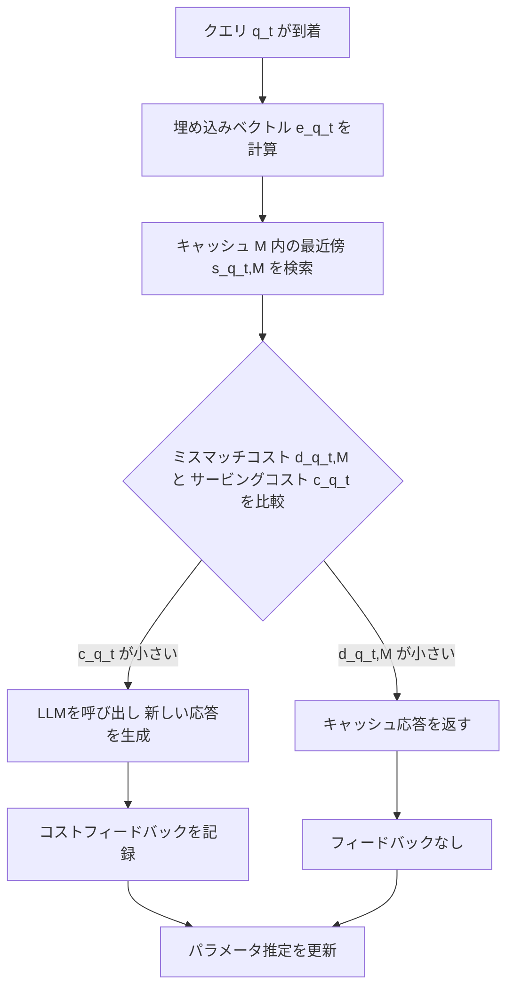

## 論文概要

本記事は [Semantic Caching for Low-Cost LLM Serving: From Offline Learning to Online Adaptation](https://arxiv.org/abs/2508.07675) の解説記事です。LLMの高い推論コストを削減する手段としてセマンティックキャッシュが注目されているが、既存のキャッシュ退去ポリシーは理論的基盤を欠いている。著者らは、クエリ到着確率とサービングコストが未知の状況下で、ミスマッチコストを考慮した統一的な損失関数を定式化し、オフライン・オンライン両方の学習設定に対して理論的保証を持つアルゴリズムを提案している。提案手法CLCB-SC-LSは、Epsilon-Greedyに対して少なくとも11.75%のリグレット改善を達成し、キャッシュ切り替え回数を最大90.91%削減したと報告されている。

この記事は [Zenn記事: セマンティックキャッシュの類似度閾値チューニングとベクトルDB別性能比較](https://zenn.dev/0h_n0/articles/1707bd6149514c) の深掘りです。

## 情報源

| 項目 | 内容 |
|------|------|
| **論文タイトル** | Semantic Caching for Low-Cost LLM Serving: From Offline Learning to Online Adaptation |
| **著者** | Xutong Liu, Baran Atalar, Xiangxiang Dai, Jinhang Zuo, Siwei Wang, John C.S. Lui, Wei Chen, Carlee Joe-Wong |
| **所属** | Univ. of Washington, CMU, CUHK, CityU HK, Microsoft Research |
| **会議名** | IEEE INFOCOM 2026 |
| **arXiv ID** | [2508.07675](https://arxiv.org/abs/2508.07675) |
| **発表年** | 2026 |

## カンファレンス情報: IEEE INFOCOM

IEEE INFOCOM（International Conference on Computer Communications）は、コンピュータネットワーキング分野における最高峰の国際会議の一つである。ネットワークプロトコル、分散システム、機械学習とネットワークの融合など幅広いテーマを扱い、過去24年間の平均採択率は約21.5%である。INFOCOM 2026は東京のヒルトン東京にて2026年5月18-21日に開催された。

## 背景と動機

GPT-4やGeminiに代表されるLLMは、1クエリあたり数十億回の浮動小数点演算を必要とし、従来のウェブクエリと比較して桁違いのコストが発生する。著者らは論文中で、LLMクエリの30%以上が意味的に類似していると報告された先行研究を引用している（論文Section I, [4]）。

既存のセマンティックキャッシュには2つの根本的な課題がある。第一に、クエリ到着分布やサービングコストが既知であることを仮定している点である。実運用ではこれらは時間とともに変動し事前把握が困難である。第二に、LFU（Least Frequently Used）やLRU（Least Recently Used）といった既存のキャッシュ退去ポリシーは直感的なヒューリスティクスに基づき理論的保証がない。著者らはこれらの課題に対し、「未知のパラメータ下で証明可能な性能保証を持つ原理的なセマンティックキャッシュフレームワークを構築できるか」という問いを提起している。

## 主要な貢献

著者らの貢献は以下の4点である。

- **統一的なセマンティックキャッシュモデル**: ミスマッチコストとサービングコストのトレードオフを損失関数として定式化し、任意の距離関数に対応する汎用フレームワークを構築した。完全一致キャッシュは距離関数の閾値を0に設定した特殊ケースとして包含される。
- **NP困難性の証明と近似アルゴリズム**: 最適キャッシュ選択問題がNP困難であることを証明し、損失関数のスーパーモジュラー性を活用したReverse Greedyアルゴリズムにより、証明可能な近似比を達成した。
- **オフライン・オンライン学習アルゴリズム**: オフライン設定ではCUCB-SCアルゴリズムにより $\tilde{O}(\sqrt{m/n})$ のサブ最適性ギャップを、オンライン設定ではCLCB-SC-LSアルゴリズムにより $\tilde{O}(\sqrt{mT} \cdot \log\log T)$ のリグレット上界を達成した。
- **実験的検証**: 合成データセットにおいて、Reverse Greedyがブルートフォース最適解とほぼ一致し、CLCB-SC-LSがベースラインに対して少なくとも11.75%の改善を達成したことを実験的に示した。

## 技術的詳細

### 損失関数の定式化

セマンティックキャッシュの核となるのは、キャッシュ応答のミスマッチコストとLLM呼び出しのサービングコストのトレードオフを表現する損失関数である。クエリ集合 $\mathcal{Q} = \{q_1, \ldots, q_m\}$ に対し、キャッシュセット $\mathcal{M}$ の期待損失は以下で定義される。

$$
\ell(\mathcal{M}; \mathbf{p}, \mathbf{c}, d) = \sum_{q \in \mathcal{Q}} p(q) \cdot \min\{c(q), d(q, \mathcal{M})\}
$$

ここで各変数の意味は以下の通りである。

- $\mathcal{Q}$: $m$ 個の異なるクエリからなる集合。各クエリ $q_i \in \mathcal{X}$ は自然言語プロンプト
- $p(q) \in (0, 1]$: クエリ $q$ の到着確率。$\sum_{q \in \mathcal{Q}} p(q) = 1$
- $c(q) \in (0, 1]$: クエリ $q$ のサービングコスト（LLM呼び出しコスト）
- $d(q, \mathcal{M}) = \min_{u \in \mathcal{M}} d(q, u)$: クエリ $q$ からキャッシュセット $\mathcal{M}$ への最小距離（ミスマッチコスト）
- $d: \mathcal{Q} \times \mathcal{Q} \to \mathbb{R}_+$: 類似度距離関数。著者らはユークリッド距離 $d(q_1, q_2) = \|e(q_1) - e(q_2)\|_2$ をデフォルトとして採用

各クエリが到着した際、エージェントは以下の最適決定ルールに従う。

$$
a_t = \begin{cases} \text{LLM}(q_t) & \text{if } c(q_t) \leq d(q_t, \mathcal{M}) \\ a(s(q_t, \mathcal{M})) & \text{otherwise} \end{cases}
$$

ここで $s(q_t, \mathcal{M}) = \arg\min_{u \in \mathcal{M}} d(q_t, u)$ は $\mathcal{M}$ 内でクエリ $q_t$ に最も近いキャッシュエントリである。この決定ルールは、ミスマッチコストがサービングコストを超える場合にのみLLMを呼び出すという直感的な戦略に対応する。



### NP困難性とスーパーモジュラー性

著者らはまず、最適キャッシュの計算がNP困難であることを証明している（Lemma 1）。証明は、閾値ベースの距離関数を用いた特殊ケースが二部グラフ上の最大頂点被覆問題に帰着されることに基づく。具体的には、距離関数を以下のように定義したとき、

$$
d(q_1, q_2) = \begin{cases} 0 & \text{if } \|e(q_1) - e(q_2)\|_2 \leq \epsilon \\ 1 & \text{otherwise} \end{cases}
$$

損失関数は $\ell(\mathcal{M}; \mathbf{p}, \mathbf{c}, d) = \sum_{v \notin N(\mathcal{M})} p(v) c(v)$ に簡約化される。ここで $N(\mathcal{M})$ はキャッシュ $\mathcal{M}$ によってカバーされるクエリ集合であり、この最適化は最大頂点被覆問題と等価であり、NP困難であることが知られている（論文Appendix, [37]）。

NP困難であるにもかかわらず、効率的な近似が可能なのは、損失関数が以下の2つの性質を持つためである（Lemma 2）。

1. **非増加性（Non-increasing）**: $\mathcal{A} \subseteq \mathcal{B}$ ならば $\ell(\mathcal{B}; \mathbf{p}, \mathbf{c}, d) \leq \ell(\mathcal{A}; \mathbf{p}, \mathbf{c}, d)$。キャッシュにエントリを追加すれば損失は減少する。
2. **スーパーモジュラー性（Supermodularity）**: $\ell(\mathcal{A} \cup \{q\}; \mathbf{p}, \mathbf{c}, d) - \ell(\mathcal{A}; \mathbf{p}, \mathbf{c}, d) \leq \ell(\mathcal{B} \cup \{q\}; \mathbf{p}, \mathbf{c}, d) - \ell(\mathcal{B}; \mathbf{p}, \mathbf{c}, d)$。キャッシュが大きくなるほど、追加エントリによる限界的な損失削減は小さくなる（収穫逓減）。

この性質により、貪欲アルゴリズムによる近似が理論的に保証される。曲率パラメータ $c$ は、損失関数が加法的関数（モジュラー関数）からどれだけ逸脱しているかを測る指標であり、近似比 $\beta = c/(1-c)$ を通じてアルゴリズムの性能保証に関与する。

### Reverse Greedyアルゴリズム

通常の貪欲アルゴリズムは空集合から出発してアイテムを順次追加するが、Reverse Greedyは全クエリをキャッシュした状態から開始し、最も影響の少ないアイテムを反復的に除去する。著者らはこのアプローチにより、以下の近似保証を達成している（Theorem 1）。

$$
\ell(\mathcal{M}; \mathbf{p}, \mathbf{c}, d) \leq \frac{e^{\beta} - 1}{\beta} \cdot \ell(\mathcal{M}^*; \mathbf{p}, \mathbf{c}, d)
$$

ここで $\beta = c/(1-c)$、$c \in [0, 1]$ は損失関数の曲率である。

### CLCB-SC-LS: オンライン学習アルゴリズム

実運用で最も重要なのは、クエリ到着分布もサービングコストも未知の状況下で、ユーザとの逐次的なインタラクションを通じて適応的にキャッシュを最適化するオンライン設定である。著者らはCLCB-SC-LS（Combinatorial Lower Confidence Bound for Semantic Caching with Low Switching）を提案している。このアルゴリズムは3つの核心的なメカニズムから構成される。

**ステージベースのキャッシュ切り替え**: キャッシュの頻繁な更新はスイッチングコスト（新しいキャッシュエントリに対するLLM応答の取得コスト）を発生させる。CLCB-SC-LSは、十分な観測が蓄積された場合にのみキャッシュを更新する。クエリ $q$ に対して、以下の条件が満たされると新しいステージが開始される。

$$
|\mathcal{T}(q, \tau_q)| \geq 1 + \sqrt{\frac{T \cdot \sum_{\tau'=1}^{\tau_q - 1} |\mathcal{T}(q, \tau')|}{m}}
$$

ここで $\mathcal{T}(q, \tau)$ はステージ $\tau$ でクエリ $q$ がLLMに送信されたラウンドの集合、$T$ は全ラウンド数、$m$ はクエリの種類数である。

**楽観的探索（LCBによる探索促進）**: サービングコストの推定には下側信頼限界（Lower Confidence Bound）を使用する。

$$
c_t(q) = \hat{c}_t(q) - \sqrt{\frac{\log(4mT^3)}{2N_{c,t}(q)}}
$$

ここで $\hat{c}_t(q)$ はラウンド $t$ 時点でのコストの経験的平均、$N_{c,t}(q)$ はクエリ $q$ のコスト観測回数である。信頼区間を下方にシフトすることで、不確実なクエリのコストを実際より低く見積もり、LLM呼び出しを促進する。これにより探索が進み、コスト推定の精度が向上する。

**リグレット上界**: 著者らはCLCB-SC-LSのリグレットが以下の上界を持つことを証明している（Theorem 3）。

$$
\text{Reg}(T) \leq O\left(\sqrt{mT \log(mT)} \cdot \log\log T \right)
$$

リグレットは $T$ に対して劣線形に増大し、1ラウンドあたりの平均リグレットは $T \to \infty$ で0に収束する。キャッシュ切り替え回数は $O(m \log\log T)$ に抑えられ、$O(T)$ 回の切り替えを要するベースラインと比較して大幅に効率的である。

## アルゴリズム: Pythonによる実装例

### Reverse Greedyアルゴリズム

```python
import numpy as np
from typing import Callable


def reverse_greedy(
    embeddings: np.ndarray,
    probs: np.ndarray,
    costs: np.ndarray,
    cache_size: int,
    distance_fn: Callable[[np.ndarray, np.ndarray], float] | None = None,
) -> list[int]:
    """Reverse Greedyによるキャッシュ選択（論文Algorithm 1に基づく）。

    全クエリをキャッシュした状態から開始し、除去による損失増加が
    最も小さいアイテムを反復的に除去してキャッシュサイズkまで縮小する。

    Args:
        embeddings: 各クエリの埋め込みベクトル。形状 (m, d_e)
        probs: クエリ到着確率ベクトル。形状 (m,)
        costs: サービングコストベクトル。形状 (m,)
        cache_size: キャッシュサイズ k
        distance_fn: 距離関数。Noneの場合ユークリッド距離

    Returns:
        キャッシュに残すクエリのインデックスリスト（長さ k）
    """
    m: int = len(probs)
    if distance_fn is None:
        distance_fn = lambda a, b: float(np.linalg.norm(a - b))

    # 距離行列の事前計算
    dist_matrix: np.ndarray = np.zeros((m, m))
    for i in range(m):
        for j in range(i + 1, m):
            d = distance_fn(embeddings[i], embeddings[j])
            dist_matrix[i, j] = d
            dist_matrix[j, i] = d

    cache: set[int] = set(range(m))  # 全クエリでキャッシュ初期化

    for _ in range(m - cache_size):
        best_remove: int = min(
            cache,
            key=lambda idx: _compute_loss(
                cache - {idx}, dist_matrix, probs, costs, m
            ),
        )
        cache.remove(best_remove)

    return sorted(cache)


def _compute_loss(
    cache: set[int],
    dist_matrix: np.ndarray,
    probs: np.ndarray,
    costs: np.ndarray,
    m: int,
) -> float:
    """キャッシュセットに対する期待損失を計算する。

    Args:
        cache: キャッシュに含まれるクエリのインデックス集合
        dist_matrix: 距離行列。形状 (m, m)
        probs: 到着確率ベクトル
        costs: サービングコストベクトル
        m: 全クエリ数

    Returns:
        期待損失値
    """
    cache_list: list[int] = list(cache)
    total: float = 0.0
    for q in range(m):
        if not cache_list:
            total += probs[q] * costs[q]
        else:
            min_dist = min(dist_matrix[q, u] for u in cache_list)
            total += probs[q] * min(costs[q], min_dist)
    return total
```

### ステージベースキャッシュ切り替え

```python
import math
from dataclasses import dataclass, field


@dataclass
class OnlineCacheAgent:
    """CLCB-SC-LSのオンライン学習エージェント（論文Algorithm 3に基づく）。

    ステージベースの切り替え機構とLCBによる楽観的探索を組み合わせ、
    未知のクエリ分布とサービングコストを逐次的に学習する。

    Attributes:
        num_queries: クエリの種類数 m
        cache_size: キャッシュサイズ k
        total_rounds: 全ラウンド数 T
        delta: 信頼度パラメータ
    """

    num_queries: int
    cache_size: int
    total_rounds: int
    delta: float = 0.01

    # 内部状態
    cost_counts: dict[int, int] = field(default_factory=dict)
    cumulative_costs: dict[int, float] = field(default_factory=dict)
    stage_indices: dict[int, int] = field(default_factory=dict)
    stage_obs_counts: dict[int, list[int]] = field(default_factory=dict)

    def should_switch_stage(self, query_id: int) -> bool:
        """ステージ切り替え条件を判定する（論文Algorithm 3, Line 5）。

        現在のステージでの観測数が閾値を超えた場合にTrueを返す。

        Args:
            query_id: クエリのID

        Returns:
            ステージを切り替えるべきかどうか
        """
        tau: int = self.stage_indices.get(query_id, 1)
        obs_list: list[int] = self.stage_obs_counts.get(query_id, [0])
        current_obs: int = obs_list[-1] if obs_list else 0
        past_obs: int = sum(obs_list[:-1]) if len(obs_list) > 1 else 0

        threshold: float = 1.0 + math.sqrt(
            self.total_rounds * past_obs / self.num_queries
        )
        return current_obs >= threshold

    def compute_lcb_cost(self, query_id: int) -> float:
        """下側信頼限界（LCB）によるコスト推定（論文Algorithm 4, Line 3）。

        経験的平均からの信頼区間を下方にシフトすることで、
        不確実なクエリのコストを楽観的に低く見積もり探索を促進する。

        Args:
            query_id: クエリのID

        Returns:
            LCBによるコスト推定値（非負にクリップ）
        """
        n_obs: int = self.cost_counts.get(query_id, 0)
        if n_obs == 0:
            return 0.0  # 観測なしの場合、楽観的に0

        empirical_mean: float = (
            self.cumulative_costs.get(query_id, 0.0) / n_obs
        )
        confidence_radius: float = math.sqrt(
            math.log(4 * self.num_queries * self.total_rounds**3)
            / (2 * n_obs)
        )

        return max(0.0, empirical_mean - confidence_radius)
```

## 実装のポイント

### コストモデルの設計

論文のフレームワークでは、サービングコスト $c(q)$ はLLM呼び出しのレイテンシまたは計算コストに対応し、ミスマッチコスト $d(q, \mathcal{M})$ は埋め込みベクトル間のユークリッド距離として定義される。実装時には、これらのコストを $[0, 1]$ の範囲に正規化する必要がある。著者らは実験でmin-max正規化を採用し、ガウスノイズ（標準偏差0.05）を加えてコストの変動をモデル化している（論文Section VI）。

### 探索と活用のトレードオフ

CLCB-SC-LSでは、通常のバンディット問題のUCB（上側信頼限界）ではなくLCB（下側信頼限界）を使用する。コストが低いと推定されたクエリに対してLLMを呼び出すことで実際のコストフィードバックを得る仕組みである。キャッシュ応答を返した場合にはフィードバックが得られないため、探索的なLLM呼び出しが情報獲得に不可欠である。

### 距離関数の選択

著者らはユークリッド距離をデフォルトとしているが、コサイン距離やドット積など任意の距離関数に対応可能である。距離関数の閾値を $\epsilon = 0$ に設定すると完全一致キャッシュに退化し、既存研究 [2], [3] と同等の保証が得られる（論文Remark 1）。

## 実験結果

著者らは合成データセットを用いて3つの設定（Oracle、Offline、Online）すべてでアルゴリズムの性能を評価している。実験ではクエリ数 $m = 20$、キャッシュサイズ $k = 5$ を基本構成とし、ChatGPTで生成した自然言語クエリをsentence-transformerモデルで384次元の埋め込みベクトルに変換している（論文Section VI）。

### Oracle設定（パラメータ既知）

論文Figure 2(a)より、Reverse GreedyはすべてのキャッシュサイズにおいてBrute Force最適解と一致する損失を達成している。一方、LFUは最適解から大きく乖離しており、頻度ベースのポリシーがミスマッチコストを考慮できない限界を示している。

### Online設定

| アルゴリズム | 平均切り替え回数 | 平均実行時間 (秒) |
|-------------|-----------------|-----------------|
| CLCB-SC | 29.2 | 0.0222 |
| CUCB-SC | 41.1 | 0.0224 |
| CLCB-SC-LS | 15.5 | 0.0033 |
| Epsilon-Greedy | 170.1 | 0.0226 |

*出典: 論文 Figure 2(f)*

論文Figure 2(c)より、CLCB-SC-LSとCLCB-SCはラウンド数の増加とともに平均リグレットが0に収束する劣線形リグレットを示している。著者らは、CLCB-SC-LSがEpsilon-Greedyに対して少なくとも11.75%の改善を達成したと報告している。キャッシュサイズ $k$ を増加させた実験（Figure 2(d)）では、CLCB-SC-LSとCLCB-SCは $k$ の増加に伴いリグレットが減少する一方、LFUやCUCB-SCはリグレットが増加する傾向を示しており、改善幅は11.75%から54.04%に拡大している。

切り替え効率に関しては、CLCB-SC-LSの平均切り替え回数は15.5回であり、Epsilon-Greedyの170.1回と比較して90.91%の削減を達成している。実行時間も0.0033秒と、他のアルゴリズム（約0.022秒）に対して最大85.40%の削減となっている。

## 実運用への応用

本論文のフレームワークは、Zenn記事で解説されている3層キャッシュアーキテクチャ（完全一致キャッシュ、セマンティックキャッシュ、LLM呼び出し）と直接的に関連する。Zenn記事では静的な類似度閾値の設定と、vCacheの動的閾値推定アプローチが紹介されているが、本論文はキャッシュの「何を保持するか」という退去ポリシーの最適化に焦点を当てている。

CLCB-SC-LSのステージベース切り替えはキャッシュ更新に伴うLLM呼び出しコストを抑制するため、APIコスト最適化の観点で有利である。Zenn記事で報告されているベクトルDB別性能比較（pgvector、Qdrant、Redis VSS）の知見と組み合わせれば、距離関数 $d$ の選択とベクトルDB固有の最適化を考慮した実装が可能になる。ただし本論文の実験は $m = 20$ の合成データセットに限定されており、実運用規模への拡張性は著者ら自身も今後の課題として挙げている。

## 関連研究

**LFU / LRU**: 到着頻度（LFU）や最終アクセス時刻（LRU）に基づく従来の退去ポリシー。著者らはこれらがミスマッチコストを考慮できず、セマンティックキャッシュには不適切であることを実験的に示している。

**Epsilon-Greedy**: 確率 $\epsilon$ でランダムに探索し、$1 - \epsilon$ で最良推定に基づいて活用する標準ベースライン（実験では $\epsilon = 0.2$）。理論的最適性保証がなく、切り替え回数が $O(T)$ に達する。

**vCache（ICLR 2026）**: Zenn記事で紹介されている動的閾値推定アプローチ。本論文はキャッシュ内容の選択（退去ポリシー）を最適化する点で相補的である。

## まとめと今後の展望

本論文は、セマンティックキャッシュの退去ポリシーに初めて理論的基盤を与えた研究である。Reverse GreedyとCLCB-SC-LSはいずれも証明可能な性能保証を持つ。著者らは今後の方向性として、オフライン学習とオンライン適応を統合するハイブリッドアプローチの開発を挙げている（論文Section VII）。本論文の退去ポリシー最適化と、Zenn記事の類似度閾値チューニングを組み合わせることで、セマンティックキャッシュの性能をさらに向上させる可能性がある。

## 参考文献

1. Liu, X., Atalar, B., Dai, X., Zuo, J., Wang, S., Lui, J.C.S., Chen, W., & Joe-Wong, C. (2026). Semantic Caching for Low-Cost LLM Serving: From Offline Learning to Online Adaptation. *IEEE INFOCOM 2026*. [https://arxiv.org/abs/2508.07675](https://arxiv.org/abs/2508.07675)
2. Zhu, B., Sheng, L., Zheng, C., Barrett, M., Jordan, M., & Jiao, J. (2023). Towards optimal caching and model selection for large model inference. *arXiv preprint*.
3. Liu, X., Dai, X., Zuo, J., Wang, S., Joe-Wong, C., Lui, J., & Chen, W. (2025). Offline learning for combinatorial multi-armed bandits. *arXiv preprint arXiv:2501.19300*.
4. Gill, W., Elidrisi, P., Kalapatapu, A., Ahmed, A., Anwar, M., & Gulzar, M.A. (2024). Meancache: User-centric semantic cache for large language model based web services. *arXiv preprint arXiv:2403.02694*.
5. Iv, V.P. (2001). An approximation guarantee of the greedy descent algorithm for minimizing a supermodular set function. *Discrete Applied Mathematics*, 114, 131-146.
6. **Related Zenn article**: [セマンティックキャッシュの類似度閾値チューニングとベクトルDB別性能比較](https://zenn.dev/0h_n0/articles/1707bd6149514c)
