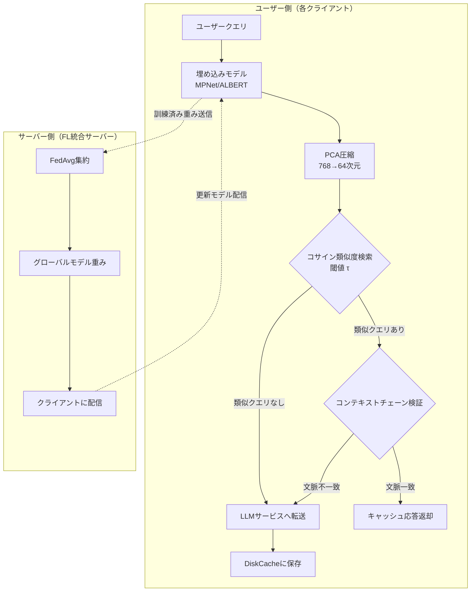
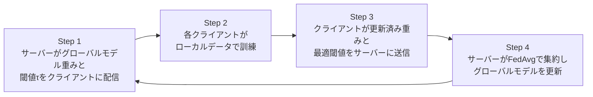

## 論文概要

本記事は [MeanCache: User-Centric Semantic Caching for LLM Web Services](https://arxiv.org/abs/2403.02694) の解説記事です。

MeanCacheは、LLM Webサービスにおけるユーザー中心のセマンティックキャッシュシステムである。従来のサーバー側セマンティックキャッシュ（GPTCache等）では、(1) ユーザークエリが集中ストレージに蓄積されプライバシーが侵害される、(2) キャッシュヒット時もユーザーが課金される、(3) 単一の埋め込みモデルが個別の使用パターンに適応できない、という3つの問題があった。著者らはこれらを解決するため、各ユーザーのデバイスにローカルキャッシュを配置し、連合学習（Federated Learning）でクエリ類似度モデルを協調訓練するアーキテクチャを提案している。論文Table Iによると、スタンドアロンクエリでF-scoreが0.73（GPTCacheの0.56に対して約17%向上）、コンテキストクエリでPrecisionが0.98（GPTCacheの0.66に対して約20%向上）を達成したと報告されている。

この記事は [Zenn記事: セマンティックキャッシュの類似度閾値チューニングとベクトルDB別性能比較](https://zenn.dev/0h_n0/articles/1707bd6149514c) の深掘りです。

## 情報源

| 項目 | 内容 |
|------|------|
| **論文タイトル** | MeanCache: User-Centric Semantic Caching for LLM Web Services |
| **著者** | Waris Gill (Virginia Tech), Mohamed Elidrisi (Cisco), Pallavi Kalapatapu (Cisco), Ammar Ahmed (Univ. of Minnesota), Ali Anwar (Univ. of Minnesota), Muhammad Ali Gulzar (Virginia Tech) |
| **会議名** | IEEE IPDPS 2025 (39th International Parallel and Distributed Processing Symposium) |
| **発表年** | 2025年 |
| **arXiv ID** | 2403.02694 (初版 2024年3月、最終版 v4 2025年3月) |
| **URL** | [https://arxiv.org/abs/2403.02694](https://arxiv.org/abs/2403.02694) |
| **DOI** | [10.1109/IPDPS64566.2025.00117](https://doi.org/10.1109/IPDPS64566.2025.00117) |
| **採択率** | 24.7%（425件中105件採択） |
| **ライセンス** | CC BY 4.0 |
| **コード** | [https://github.com/SEED-VT/MeanCache](https://github.com/SEED-VT/MeanCache) |

## カンファレンス情報: IEEE IPDPS

IEEE IPDPS（International Parallel and Distributed Processing Symposium）は、並列・分散処理分野における主要な国際会議の一つである。1987年の前身会議（IPPS）以降、高性能計算、分散システム、並列アルゴリズムなど幅広いテーマを扱ってきた。IPDPS 2025はイタリア・ミラノで2025年6月3-7日に開催された。過去25年間の平均採択率は28.3%であり、2025年は24.7%とやや厳選された年であった。MeanCacheがこの会議に採択されたことは、セマンティックキャッシュの問題を分散処理の観点から定式化した点が評価されたことを示唆している。

## 背景と動機

LLMの推論コストは依然として高い。GPT-3は175Bパラメータ・326GBのモデルサイズを持ち、1回の推論にも相応の計算資源を要する。一方、著者らが20名のChatGPTユーザーの27,000件以上のクエリを分析した結果、約31%が意味的に類似したクエリであったと報告している。また先行研究では検索クエリの約33%が再送信されるとされている。これらの重複クエリに対して毎回LLMを呼び出すのは計算資源の浪費である。

GPTCacheに代表されるサーバー側セマンティックキャッシュは、この問題に対する既存のアプローチであるが、著者らは以下の3点を課題として指摘している。

1. **プライバシー侵害**: ユーザーのクエリがサーバーの集中ストレージに蓄積され、個人の利用パターンが漏洩するリスクがある
2. **課金問題**: キャッシュヒット時もサービスプロバイダが課金する構造であり、ユーザーにコスト削減のメリットが還元されない
3. **適応性の欠如**: 単一の埋め込みモデルと静的な閾値（GPTCacheではコサイン類似度0.7固定）では、個々のユーザーの使用パターンに適応できない

MeanCacheはこれらの課題をユーザー側にキャッシュを配置する分散アーキテクチャで解決しようとする研究である。

## 主要な貢献

著者らは以下の4点を主要な貢献として挙げている。

- **ユーザー中心アーキテクチャ**: 各ユーザーのデバイスにローカルキャッシュ（DiskCache）とコンパクトな埋め込みモデル（MPNet約420MB、ALBERT約45MB）を配置し、クエリがサーバーに送信される前にキャッシュ判定を完結させる設計
- **連合学習によるプライバシー保護型モデル訓練**: FedAvgプロトコルにより、生のクエリデータを共有することなく埋め込みモデルの重みとコサイン類似度閾値をクライアント間で協調的に改善する仕組み
- **コンテキストチェーンエンコーディング**: 会話型クエリにおいて、単なる意味的類似度だけでなく会話履歴（親クエリの連鎖）を検証することで、文脈の異なるクエリへの誤ヒットを防止する機構
- **PCA次元圧縮**: 埋め込みベクトルを768次元から64次元にPCA圧縮することで、ストレージを83%削減しつつ、マッチング速度を11%向上させる効率化手法

## 技術的詳細

### 全体アーキテクチャ

MeanCacheのアーキテクチャは、ユーザー側コンポーネントとサーバー側コンポーネントに分離されている。



ユーザーがクエリを送信すると、まずローカルの埋め込みモデルでクエリをベクトル化し、PCA圧縮を適用してからローカルキャッシュ内の既存クエリとコサイン類似度を計算する。類似度が閾値 $\tau$ を超えるクエリが見つかった場合、コンテキストチェーンの一致を検証し、両方の条件を満たした場合のみキャッシュ応答を返す。条件を満たさない場合はLLMサービスに転送され、応答をローカルキャッシュに保存する。

### 連合学習による協調訓練

MeanCacheの訓練には連合学習（Federated Learning）のFedAvgプロトコルを採用している。各クライアントはローカルデータでモデルを訓練し、モデルの重みのみをサーバーに送信する。生のクエリデータはデバイスから外に出ない。

グローバルモデルの集約は以下の式で行われる。

$$
\mathbf{W}_{\text{global}}^{(t+1)} = \sum_{k=1}^{K} \frac{n_k}{n} \mathbf{w}_{k,t}
$$

ここで、
- $\mathbf{W}_{\text{global}}^{(t+1)}$: ラウンド $t+1$ のグローバルモデル重み
- $\mathbf{w}_{k,t}$: ラウンド $t$ におけるクライアント $k$ のローカルモデル重み
- $n_k$: クライアント $k$ のサンプル数
- $n = \sum_{k=1}^{K} n_k$: 全クライアントの総サンプル数
- $K$: 参加クライアント数

各クライアントのローカル訓練ではマルチタスク学習を採用し、2つの損失関数を組み合わせている。

1. **対照損失（Contrastive Loss）**: 意味的に異なるクエリ（非重複ペア）を埋め込み空間内で遠ざける。非類似クエリの埋め込みベクトル間の距離を最大化することで、キャッシュの偽ヒットを抑制する
2. **多重否定ランキング損失（Multiple Negatives Ranking Loss）**: 大量の候補の中から意味的に同一のクエリ（重複ペア）を近づける。正例ペアの埋め込み間距離を最小化しつつ、負例との距離を相対的に最大化する

この2つの損失の組み合わせにより、埋め込み空間内で類似クエリは密集し、非類似クエリは離散する構造が学習される。

連合学習の訓練プロセスは4ステップで構成される。



著者らは20クライアント（各ラウンドで4クライアントをサンプリング）で50ラウンドの訓練を実施し、MPNetベースのモデルでF-scoreが0.82から0.88に向上（約11%の精度改善）したと報告している。

### コサイン類似度と閾値最適化

キャッシュヒット判定にはコサイン類似度を使用する。新規クエリの埋め込み $\mathbf{E}_1$ とキャッシュ済みクエリの埋め込み $\mathbf{E}_2$ に対し、類似度は以下で計算される。

$$
\text{sim}(\mathbf{E}_1, \mathbf{E}_2) = \frac{\mathbf{E}_1 \cdot \mathbf{E}_2}{\|\mathbf{E}_1\| \cdot \|\mathbf{E}_2\|}
$$

ここで、
- $\mathbf{E}_1, \mathbf{E}_2$: PCA圧縮済みの埋め込みベクトル（64次元）
- $\cdot$: 内積
- $\|\cdot\|$: L2ノルム

閾値 $\tau$ の最適化は、各クライアントのローカル訓練中に $\tau$ を0から1の範囲で変化させ、F-scoreを最大化する値を探索する方式をとっている。ユーザーがキャッシュ応答を拒否してLLMへの再問い合わせを要求した場合を偽陽性としてフィードバックに利用する。著者らの実験では、最適閾値はMPNetで $\tau = 0.83$、ALBERTで $\tau = 0.78$ であったと報告されている。GPTCacheの静的閾値0.7と比較して、MPNetでPrecisionが16%向上、F-scoreが4%向上したとされている。

さらに、新規ユーザー（訓練データがないユーザー）にはグローバル閾値平均 $\tau_{\text{global}}$ を適用することで、初期状態でも合理的なキャッシュ判定が可能となる。

### コンテキストチェーンエンコーディング

MeanCacheの技術的に独自性の高い貢献がコンテキストチェーンエンコーディングである。会話型LLMサービスでは、ユーザーのクエリは前のやり取りに依存することが多い。たとえば「色を赤に変更して」というクエリは、直前に「Pythonで線グラフを描いて」と言った文脈と「HTMLでボタンを作って」と言った文脈では、期待される応答が異なる。

MeanCacheでは、キャッシュされた各クエリに対して、その会話履歴（親クエリの連鎖）を記録する。新規クエリのマッチング時には以下の手順で検証を行う。

1. 新規クエリの埋め込みを計算する
2. コサイン類似度が閾値 $\tau$ を超えるキャッシュ済みクエリを検索する
3. 見つかった類似クエリのコンテキストチェーン（親クエリの系列）と、新規クエリの会話履歴を比較する
4. 意味的類似度とコンテキストチェーンの**両方が一致**した場合のみ、キャッシュ応答を返す

この仕組みにより、表面的に類似していても文脈が異なるクエリへの誤ヒットが防止される。著者らの実験（論文Table I）では、コンテキストクエリ（450件、GPT-4で生成）に対してMeanCacheの偽ヒットは3件のみであったのに対し、GPTCacheは54件の偽ヒットを記録したと報告されている。

## アルゴリズム: コンテキストチェーン検証ロジック

以下は、論文のAlgorithm 1に基づくコンテキストチェーン検証の実装イメージである。

```python
from dataclasses import dataclass, field
import numpy as np


@dataclass
class CachedEntry:
    """キャッシュされたクエリとその応答およびコンテキスト情報を保持する。

    Attributes:
        query: キャッシュされたクエリ文字列
        embedding: PCA圧縮済み埋め込みベクトル（64次元）
        response: LLMからの応答文字列
        context_chain: 会話履歴における親クエリIDの系列
    """
    query: str
    embedding: np.ndarray
    response: str
    context_chain: list[str] = field(default_factory=list)


def cosine_similarity(vec_a: np.ndarray, vec_b: np.ndarray) -> float:
    """2つのベクトル間のコサイン類似度を計算する。

    Args:
        vec_a: ベクトルA（PCA圧縮済み、64次元）
        vec_b: ベクトルB（PCA圧縮済み、64次元）

    Returns:
        コサイン類似度（-1.0から1.0の範囲）
    """
    dot_product = np.dot(vec_a, vec_b)
    norm_a = np.linalg.norm(vec_a)
    norm_b = np.linalg.norm(vec_b)
    if norm_a == 0.0 or norm_b == 0.0:
        return 0.0
    return float(dot_product / (norm_a * norm_b))


def verify_context_chain(
    query_context: list[str],
    cached_context: list[str],
    cache_store: dict[str, CachedEntry],
    embedding_model,
    threshold: float,
) -> bool:
    """新規クエリとキャッシュ済みクエリのコンテキストチェーンを検証する。

    会話履歴の各段階で親クエリ同士の意味的類似度を確認し、
    全ての段階で閾値を超えている場合のみTrueを返す。

    Args:
        query_context: 新規クエリの会話履歴（親クエリIDの系列）
        cached_context: キャッシュ済みクエリの会話履歴
        cache_store: クエリIDからCachedEntryへのマッピング
        embedding_model: 埋め込み計算用モデル
        threshold: コサイン類似度の閾値（例: 0.83）

    Returns:
        コンテキストチェーンが一致する場合True
    """
    # コンテキストチェーンの長さが異なる場合は不一致
    if len(query_context) != len(cached_context):
        return False

    # スタンドアロンクエリ（コンテキストなし）は常に一致
    if len(query_context) == 0:
        return True

    # 各段階の親クエリ同士の類似度を検証
    for q_parent_id, c_parent_id in zip(query_context, cached_context):
        if q_parent_id not in cache_store or c_parent_id not in cache_store:
            return False

        q_parent_emb = cache_store[q_parent_id].embedding
        c_parent_emb = cache_store[c_parent_id].embedding

        similarity = cosine_similarity(q_parent_emb, c_parent_emb)
        if similarity < threshold:
            return False

    return True


def meancache_lookup(
    query: str,
    query_context: list[str],
    cache_entries: list[CachedEntry],
    cache_store: dict[str, CachedEntry],
    embedding_model,
    pca_model,
    threshold: float = 0.83,
) -> str | None:
    """MeanCacheのキャッシュルックアップを実行する。

    新規クエリに対して、(1) 埋め込み計算、(2) PCA圧縮、
    (3) 類似キャッシュ検索、(4) コンテキストチェーン検証の
    順に処理し、条件を満たすキャッシュ応答を返す。

    Args:
        query: ユーザーの新規クエリ文字列
        query_context: 新規クエリの会話履歴（親クエリIDの系列）
        cache_entries: キャッシュ済みエントリのリスト
        cache_store: クエリIDからCachedEntryへのマッピング
        embedding_model: 埋め込み計算用モデル（MPNet等）
        pca_model: PCA圧縮モデル（768→64次元）
        threshold: コサイン類似度の閾値（デフォルト: 0.83）

    Returns:
        キャッシュヒット時はキャッシュ応答文字列、ミス時はNone
    """
    # Step 1: クエリの埋め込みを計算
    raw_embedding = embedding_model.encode(query)  # 768次元

    # Step 2: PCA圧縮を適用
    compressed_embedding = pca_model.transform(
        raw_embedding.reshape(1, -1)
    )[0]  # 64次元

    # Step 3: キャッシュ内の類似クエリを検索
    for entry in cache_entries:
        similarity = cosine_similarity(compressed_embedding, entry.embedding)

        if similarity >= threshold:
            # Step 4: コンテキストチェーンの一致を検証
            if verify_context_chain(
                query_context=query_context,
                cached_context=entry.context_chain,
                cache_store=cache_store,
                embedding_model=embedding_model,
                threshold=threshold,
            ):
                return entry.response

    # キャッシュミス: LLMサービスへ転送が必要
    return None
```

このコードでは、`meancache_lookup`関数が論文のAlgorithm 1に対応する。注目すべきは`verify_context_chain`関数で、会話履歴の各段階で親クエリ同士の意味的類似度を検証することで、文脈の異なるクエリへの誤ヒットを構造的に防止している。

## 実装のポイント

### PCA次元圧縮の適用

著者らはPCA圧縮を2段階で適用している。まず全クエリの埋め込みから主成分を学習し、次に学習済みの主成分を埋め込みモデルの追加層として統合する。これにより768次元のベクトルを64次元に圧縮し、ストレージ要件を83%削減している。論文の実験では、この圧縮によるキャッシュ判定精度の低下は軽微であったと報告されている。

圧縮率の選択（768→64）は、ストレージ効率とキャッシュ判定精度のトレードオフに基づいている。1クエリあたりのストレージはLlama 2の埋め込み（4096次元）では約32KB、MPNet/ALBERT（768次元）では約6KB、PCA圧縮後（64次元）では約0.5KBとなる。端末ストレージが限られるモバイルデバイスでの運用を想定すると、この圧縮は実用上の重要な要素である。

### 閾値最適化の実践的意義

GPTCacheの静的閾値（$\tau = 0.7$）に対し、MeanCacheは各クライアントが自身のデータでF-scoreを最大化する閾値を動的に探索する。最適閾値がMPNetで $\tau = 0.83$、ALBERTで $\tau = 0.78$ であったという結果は、関連するZenn記事で紹介されているvCacheの動的閾値推定アプローチと方向性が一致しており、静的閾値の限界を実証的に示している。

### 埋め込みモデルの選択

著者らはMPNet（約420MB）とALBERT（約45MB）の2種類のモデルを評価している。MPNetはF-score 0.73で精度が高いが、ALBERTはモデルサイズが約10分の1でF-score 0.68と、精度と効率のトレードオフがある。クエリあたりの埋め込み計算時間はMPNetが0.009秒、ALBERTが0.005秒であり、いずれもLlama 2（0.04秒）より高速である。端末のリソース制約に応じた選択が求められる。

## 実験結果

### スタンドアロンクエリの評価

著者らは1,000件のクエリ（700件のユニーククエリ+300件の重複クエリ）でスタンドアロン（単発）クエリの評価を実施した。結果は論文Table Iに報告されている。

| 指標 | GPTCache | MeanCache (MPNet) | MeanCache (ALBERT) |
|------|----------|-------------------|---------------------|
| F-score | 0.56 | **0.73** | 0.68 |
| Precision | 0.52 | **0.72** | 0.66 |
| Recall | **0.85** | 0.78 | 0.77 |
| Accuracy | 0.72 | **0.85** | 0.81 |

700件のユニーククエリに対する偽ヒット（False Hit）数は、MeanCache（MPNet）が89件、GPTCacheが233件であった。GPTCacheはRecallでは0.85と高いが、Precisionが0.52と低く、実質的に半数近くが誤った応答を返していることになる。MeanCacheはPrecisionとRecallのバランスが取れており、F-scoreで約17ポイントの改善を達成している。

### コンテキストクエリの評価

GPT-4で生成した450件の会話型クエリ（コンテキスト付き）での評価結果も論文Table Iに報告されている。

| 指標 | GPTCache | MeanCache |
|------|----------|-----------|
| F-score | 0.67 | **0.93** |
| Precision | 0.66 | **0.98** |
| Recall | 0.71 | 0.79 |
| Accuracy | 0.61 | **0.86** |

100件の検証クエリに対する偽ヒット数は、MeanCacheが3件に対しGPTCacheが54件であった。コンテキストチェーン検証の効果が顕著に表れており、Precisionが0.98と偽ヒットをほぼ完全に排除している。

### 連合学習の訓練効果

20クライアント（各ラウンドで4クライアントをサンプリング）での50ラウンドの連合学習訓練において、MPNetベースのモデルはF-scoreが0.82から0.88に向上した（約11%の精度改善）。ALBERTでもF-scoreが0.88に到達したと報告されている。

### ストレージと応答時間

| 指標 | 値 | 備考 |
|------|-----|------|
| PCA圧縮率 | 83%削減 | 768次元→64次元 |
| マッチング速度向上 | 11%高速化 | PCA圧縮による効果 |
| キャッシュなし応答時間 | 約0.9秒 | LLMサービス直接呼び出し |
| キャッシュあり応答時間 | 約0.1秒 | ローカルキャッシュからの応答 |
| 閾値最適化による精度向上 | MPNet: Precision +16%, F-score +4% | GPTCacheの静的閾値0.7との比較 |

## 実運用への応用

MeanCacheの知見は、Zenn記事「[セマンティックキャッシュの類似度閾値チューニングとベクトルDB別性能比較](https://zenn.dev/0h_n0/articles/1707bd6149514c)」で解説されている閾値チューニングの実践に直接関連する。

Zenn記事では、静的閾値の限界とvCacheの動的閾値推定アプローチが紹介されているが、MeanCacheは連合学習で各ユーザーに最適な閾値を学習するという別のアプローチでこの問題に取り組んでいる。Zenn記事で推奨されている用途別閾値（顧客向け0.92-0.95、FAQ系0.80-0.85）と比較すると、MeanCacheの最適閾値（MPNet: 0.83、ALBERT: 0.78）はFAQ系に近い値であり、汎用的なキャッシュ用途を想定した設定であることが読み取れる。

また、MeanCacheのコンテキストチェーン検証は、Zenn記事の3層キャッシュアーキテクチャ（完全一致→セマンティック→プロバイダキャッシュ）のLayer 2に組み込むことで、会話型アプリケーションでの偽ヒット率を大幅に低減できる可能性がある。サーバー側のセマンティックキャッシュにコンテキストチェーン検証を追加する実装は、プライバシーの観点ではMeanCacheの本来の設計とは異なるが、精度改善の手法としては応用可能である。

ただし、MeanCacheのユーザー側キャッシュは端末に約420MB（MPNet）のモデルを配置する必要があり、Webブラウザベースのアプリケーションでは導入のハードルが高い。デスクトップアプリケーションやCLIツールなど、ローカルリソースが利用可能な環境が適した展開先と考えられる。

## 関連研究

- **GPTCache** (Bang et al., 2023): Zillizが開発したオープンソースのサーバー側セマンティックキャッシュ。モジュール化された設計（埋め込みモデル、ベクトルストア、類似度評価、キャッシュストレージ）が特徴であるが、MeanCacheの論文ではプライバシー保護と閾値最適化の欠如が指摘されている。GPTCacheはNLP-OSS 2023（ACL 2023併催ワークショップ）で発表された
- **vCache** (arXiv 2502.03771): ユーザー定義のエラー率保証を持つ検証済みセマンティックキャッシュ。オンライン学習アルゴリズムでキャッシュ済みプロンプトごとに最適閾値を推定する。MeanCacheとは異なりサーバー側で動作するが、静的閾値の問題を動的に解決するという方向性は共通している
- **ContextCache** (arXiv 2506.22791): マルチターンクエリにおけるコンテキスト認識型セマンティックキャッシュ。MeanCacheのコンテキストチェーンと類似の問題意識を持つが、連合学習やプライバシー保護は扱っていない

## まとめ

MeanCacheは、セマンティックキャッシュの3つの根本的課題（プライバシー、課金構造、適応性）に対して、ユーザー側キャッシュ配置・連合学習・コンテキストチェーン検証という統合的なソリューションを提示した研究である。著者らの実験によると、スタンドアロンクエリでF-score 0.73、コンテキストクエリでPrecision 0.98を達成し、GPTCacheに対して偽ヒット数を大幅に削減したと報告されている。PCA圧縮による83%のストレージ削減と11%の速度向上も実用上の重要な成果である。連合学習による協調的な閾値最適化は、Zenn記事で議論されている静的閾値の限界に対する一つの回答を提供している。ただし、端末側に埋め込みモデルを配置するアーキテクチャはWebアプリケーションへの適用に制約があり、適用シナリオの選定が重要となる。

## 参考文献

- **arXiv**: [https://arxiv.org/abs/2403.02694](https://arxiv.org/abs/2403.02694)
- **DOI (IEEE)**: [https://doi.org/10.1109/IPDPS64566.2025.00117](https://doi.org/10.1109/IPDPS64566.2025.00117)
- **Code**: [https://github.com/SEED-VT/MeanCache](https://github.com/SEED-VT/MeanCache)
- **GPTCache**: [https://aclanthology.org/2023.nlposs-1.24/](https://aclanthology.org/2023.nlposs-1.24/)
- **vCache**: [https://arxiv.org/abs/2502.03771](https://arxiv.org/abs/2502.03771)
- **Related Zenn article**: [https://zenn.dev/0h_n0/articles/1707bd6149514c](https://zenn.dev/0h_n0/articles/1707bd6149514c)
