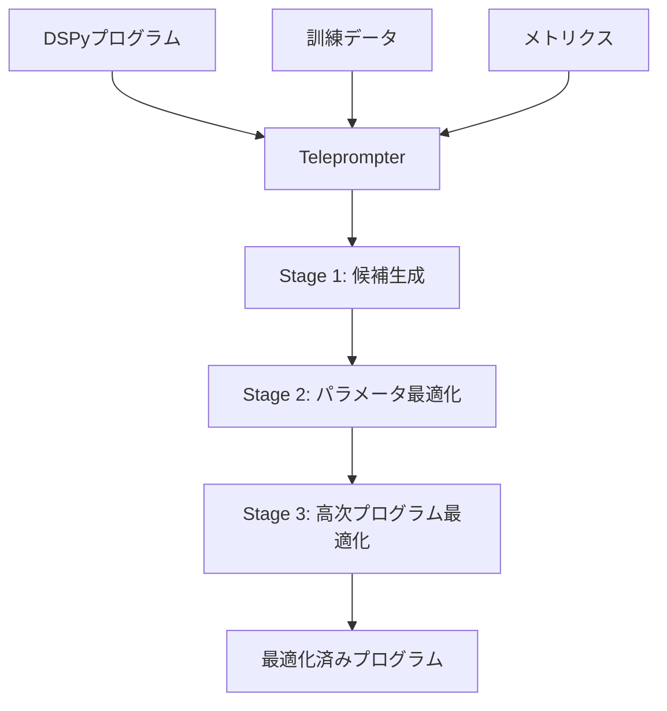

本記事は [https://arxiv.org/abs/2310.03714](https://arxiv.org/abs/2310.03714) の解説記事です。

## 論文概要（Abstract）

DSPyは、LMパイプラインを**テキスト変換グラフ**として抽象化するプログラミングモデルである。著者らは、既存のLMパイプラインがハードコードされた「プロンプトテンプレート」（試行錯誤で発見された長い文字列）に依存している問題を指摘し、宣言的モジュールによるパイプライン構築とコンパイラによる自動最適化を提案している。コンパイラは、自己ブートストラップによるデモンストレーション生成とプロンプティング・ファインチューニング・拡張・推論手法の合成を通じてパイプラインを最適化する。

この記事は [Zenn記事: DSPy v3.2 Metric設計とOptimizer選定で実現するプロンプト自動最適化](https://zenn.dev/0h_n0/articles/1b83773e95e02c) の深掘りです。

## 情報源

- **arXiv ID**: 2310.03714
- **URL**: [arXiv:2310.03714](https://arxiv.org/abs/2310.03714)
- **著者**: Omar Khattab, Arnav Singhvi, Paridhi Maheshwari, Zhiyuan Zhang, Keshav Santhanam, Sri Vardhamanan, Saiful Haq, Ashutosh Sharma, Thomas T. Joshi, Hanna Moazam, Heather Miller, Matei Zaharia, Christopher Potts
- **所属**: Stanford University, UC Berkeley, Carnegie Mellon University他
- **発表**: 2023年10月（ICLR 2024 採択）
- **分野**: cs.CL, cs.AI, cs.IR, cs.LG
- **GitHub**: [stanfordnlp/dspy](https://github.com/stanfordnlp/dspy)

## 背景と動機（Background）

LMを活用したNLPシステム構築において、**プロンプトエンジニアリング**が大きなボトルネックとなっている。既存の開発者フレームワーク（LangChain、LlamaIndex等）は、プレパッケージされたチェーンやエージェントを提供するが、内部的にはハードコードされたプロンプトテンプレートに依存している。著者らは、LangChainのコードベースに1000文字を超えるプロンプト文字列が50以上含まれ、12の`prompts.py`ファイルと42の`prompt.py`ファイルがタスク固有のテンプレート記述に費やされていることを指摘している（論文Appendix Bより）。

この問題は、パイプラインが複数のLM呼び出しを含む場合に特に深刻となる。プロンプトの変更が下流のモジュールに予期せぬ影響を与え、LMやデータドメインを変更するたびに再調整が必要になる。DSPyは、ニューラルネットワーク開発でPyTorchが果たした役割をLMパイプラインに対して実現することを目指している。すなわち、(1) 汎用的なモジュールを任意のアーキテクチャに組み合わせ可能にし、(2) パラメータをオプティマイザで自動学習する設計である。

## 主要な貢献（Key Contributions）

著者らは以下の3点を主要な貢献として報告している。

- **Signatures（シグネチャ）**: 自由形式のプロンプト文字列を、自然言語の型付き宣言に置き換える抽象化。入出力フィールドのセマンティックな役割を明示する
- **Modules（モジュール）**: Chain of Thought、ReAct等のプロンプティング技法を、タスク非依存なパラメタライズドモジュールとして抽象化。デモンストレーションの自動学習が可能
- **Teleprompters（テレプロンプター/オプティマイザ）**: パイプライン全体を指定メトリクスに対して自動最適化する汎用コンパイラ戦略。ブートストラップ、ファインチューニング、アンサンブル等を統一的に扱う
- **プログラミングモデル全体**: 手書きプロンプトなしで、簡潔なDSPyプログラムからGPT-3.5やllama2-13b-chatの品質を33%から82%（GSM8K）、32%から46%（HotPotQA）に向上させることを実証

## 技術的詳細（Technical Details）

### Signatures: 自然言語型付きインターフェース

DSPy Signatureは、LM呼び出しの入出力を宣言する**自然言語型の関数シグネチャ**である。プロンプトの「何を（what）」を指定し、「どうやって（how）」はコンパイラに委ねる。

```
question -> answer                    # 基本QA
context, question -> answer           # RAG
english_document -> french_translation # 翻訳
context, question -> search_query     # 検索クエリ生成
```

形式的には、Signatureは**入力フィールド**と**出力フィールド**のタプルであり、オプションで命令（instruction）を含む。各フィールド名はセマンティックな役割を示し、DSPyコンパイラがin-context learningを通じて`question`と`answer`の役割を異なる方法で解釈・最適化する。

より詳細な制御が必要な場合、Pythonクラスとして記述できる。

```python
class GenerateSearchQuery(dspy.Signature):
    """Write a simple search query that will help answer a complex question."""

    context: str = dspy.InputField(desc="may contain relevant facts")
    question: str = dspy.InputField()
    query: str = dspy.OutputField(dtype=dspy.SearchQuery)
```

### Modules: パラメタライズドLM操作

DSPyモジュールは、Signatureを受け取り、特定のプロンプティング戦略を適用するパラメタライズドコンポーネントである。PyTorchのレイヤー（`nn.Linear`、`nn.Transformer`等）に相当する。

| モジュール | 説明 | 参考手法 |
|-----------|------|---------|
| `Predict` | 基本的なLM呼び出し。Signatureに基づきプロンプトを構築し、デモンストレーションを含める | - |
| `ChainOfThought` | Signatureに`rationale`フィールドを自動追加し、段階的推論を促す | Wei et al., 2022 |
| `ProgramOfThought` | 推論と計算を分離し、コード生成による数値推論を行う | Chen et al., 2022 |
| `MultiChainComparison` | 複数の推論チェーンを並列生成し、パターンを比較して最終回答を導出 | Yoran et al., 2023 |
| `ReAct` | 推論とツール利用（検索等）を交互に実行するエージェント型モジュール | Yao et al., 2022 |

各モジュールは内部的にSignatureを拡張する形で実装される。例えば`ChainOfThought`の簡略化された実装は以下の通りである。

```python
class ChainOfThought(dspy.Module):
    def __init__(self, signature: str) -> None:
        """ChainOfThought: Signatureにrationale出力を追加する。

        Args:
            signature: 入出力を定義するDSPy Signature文字列
        """
        # Signatureを '*inputs -> rationale, *outputs' に変換
        rationale_field = dspy.OutputField(
            prefix="Reasoning: Let's think step by step."
        )
        signature = dspy.Signature(signature).prepend_output_field(rationale_field)

        # サブモジュールとしてPredictを宣言
        self.predict = dspy.Predict(signature)

    def forward(self, **kwargs: str) -> dspy.Prediction:
        """入力をサブモジュールに転送する。"""
        return self.predict(**kwargs)
```

### Programs: define-by-runによるパイプライン構築

DSPyプログラムは、PyTorchと同様の**define-by-run**パラダイムで構築される。`__init__`でモジュールを宣言し、`forward`で計算フローを定義する。

```python
class RAG(dspy.Module):
    def __init__(self, num_passages: int = 3) -> None:
        """RAG: 検索拡張生成パイプライン。

        Args:
            num_passages: 検索するパッセージ数
        """
        self.retrieve = dspy.Retrieve(k=num_passages)
        self.generate_answer = dspy.ChainOfThought("context, question -> answer")

    def forward(self, question: str) -> dspy.Prediction:
        """質問に対して検索を行い、回答を生成する。"""
        context = self.retrieve(question).passages
        return self.generate_answer(context=context, question=question)
```

マルチホップ推論では、検索と推論を反復的に実行するプログラムも構築できる。論文のHotPotQA実験で使用された`BasicMultiHop`は、`ChainOfThought`による検索クエリ生成と`Retrieve`を2ホップ繰り返し、最終回答を生成する構成である（わずか16行のコードで定義）。

### Teleprompters: パイプライン最適化戦略

Teleprompterは、DSPyプログラム・訓練データ・メトリクスを受け取り、最適化されたプログラムを返すオプティマイザである。



| Teleprompter | 戦略 | 説明 |
|-------------|------|------|
| `LabeledFewShot` | ラベル付きサンプリング | 訓練セットからk個のランダムデモを選択。最もシンプルなベースライン |
| `BootstrapFewShot` | 自己ブートストラップ | ゼロショットでプログラムを実行し、メトリクスを通過したトレースをデモとして収集 |
| `BootstrapFewShotWithRandomSearch` | ブートストラップ+探索 | BootstrapFewShotにランダムサーチを追加し、デモ選択を最適化 |
| `BootstrapFinetune` | ブートストラップ+微調整 | ブートストラップしたデモを使い、LMの重みを直接ファインチューニング |

### DSPyコンパイラ: 3段階の最適化

コンパイラの動作は以下の3段階で構成される。

**Stage 1: 候補生成（Candidate Generation）**

プログラム内の全`Predict`モジュールを再帰的に検出し、各モジュールのパラメータ（命令、フィールド記述、デモンストレーション）の候補値を生成する。`BootstrapFewShot`の場合、ゼロショットでプログラムを高温度で実行し、メトリクスを通過するマルチステージトレースをフィルタリングして、有効なデモンストレーションを収集する。

**Stage 2: パラメータ最適化（Parameter Optimization）**

各パラメータの候補から最適な組み合わせを選択する。ランダムサーチ、Tree-structured Parzen Estimator（HyperOpt）、Optuna等のハイパーパラメータチューニング手法が適用可能である。`BootstrapFinetune`の場合は、デモンストレーションを訓練データとしてLMの重みを直接更新する。

**Stage 3: 高次プログラム最適化（Higher-Order Program Optimization）**

プログラムの制御フロー自体を変更する。代表的な手法はアンサンブルで、ブートストラップした複数のプログラムを並列実行し、多数決等のカスタム関数で結果を集約する。

## 実装のポイント（Implementation）

### 最小限の訓練データで動作

DSPyの訓練データは**少量かつ不完全で構わない**。入力値のみ（ラベルなし）でも最適化が可能であり、中間ステップのラベルは不要である。論文の実験では、GSM8Kで200例、HotPotQAで200例の訓練データが使用されている。コンパイル自体は数分から十数分で完了し、150-300例の検証セットに対してプログラムを数回実行するだけで済むと著者らは報告している。

### メトリクス定義の柔軟性

メトリクスは単純なExact Match（EM）やF1から、DSPyプログラム自体を評価器として使うことまで可能である。例えば、回答の正確性とコンテキストの根拠付けを同時に検証するカスタムメトリクスを定義し、ブートストラップ時にこの複合条件を満たすトレースのみをデモンストレーションとして採用できる。

### Teacher-Studentコンパイル

大規模LMで最適化したプログラムを教師（teacher）として、小規模LMを生徒（student）として蒸留できる。`BootstrapFinetune`に`teacher`パラメータとして渡すことで、教師プログラムのデモンストレーションを使い、T5-Large等の小規模LMをファインチューニングする。

## Production Deployment Guide

### AWS実装パターン（DSPyパイプラインサービス）

DSPyで最適化したLMパイプラインを本番サービスとしてデプロイするための推奨構成である。コンパイル済みプログラムの推論サービングと、定期的な再コンパイル（メトリクスドリフト対応）を分離する設計が有効である。

**トラフィック量別の推奨構成**:

| 規模 | リクエスト/日 | 推奨構成 | 月額コスト | 主要サービス |
|------|-----------|---------|-----------|------------|
| **Small** | ~1,000 | Serverless | $50-150 | Lambda + Bedrock + S3 |
| **Medium** | ~10,000 | Container | $400-900 | ECS Fargate + Bedrock + ElastiCache |
| **Large** | ~100,000 | GPU推論 | $2,000-5,000 | ECS + SageMaker Endpoint + ElastiCache |

**Small構成の詳細** (月額$50-150):
- **Lambda**: DSPyコンパイル済みプログラムの推論実行 ($15/月, 128MB, 平均2秒/リクエスト)
- **Bedrock**: Claude 3.5 Haiku呼び出し ($80/月, 1000リクエスト/日想定)
- **S3**: コンパイル済みプログラム・デモンストレーションキャッシュ保存 ($5/月)
- **EventBridge + Step Functions**: 週次再コンパイルジョブ ($5/月)

**Medium構成のポイント**:
- ECS Fargateでコンテナ化したDSPyサービスを常時稼働 ($150/月, 0.5vCPU/1GB)
- ElastiCacheでBootstrap済みデモンストレーションをキャッシュし、コールドスタートを回避 ($50/月, cache.t4g.micro)
- Bedrock Batch APIを再コンパイル時に使用し、APIコストを50%削減

**Large構成の場合**:
- T5-LargeやLlama2-13bをファインチューニングした場合、SageMaker Endpointで自前モデルをホスト ($800/月, ml.g5.xlarge)
- Bedrock呼び出しが不要になるため、推論コストが大幅に低下
- 論文Table 2よりllama2-13b-chatのmultihopプログラムはGPT-3.5と同等の精度を達成しており、コスト効率が高い

**コスト削減テクニック**:
- Bedrock Prompt Caching: 同一Signatureのデモンストレーションプレフィックスを再利用し、トークンコスト30-90%削減
- BootstrapFinetuneでT5-Large（770Mパラメータ）にコンパイルすれば、SageMaker ml.g5.xlargeで月額$800程度（GPT-3.5 APIと同等精度、論文Section 7より）
- Lambda Provisioned Concurrencyでコールドスタート回避（$10-30/月追加）

**コスト試算の注意事項**:
- 上記は2026年7月時点のAWS ap-northeast-1料金に基づく概算値です
- Bedrockモデル呼び出し回数とトークン量でAPIコストが線形増加します
- 最新料金は [AWS料金計算ツール](https://calculator.aws/) で確認してください

### Terraformインフラコード

```hcl
# --- S3: コンパイル済みプログラム保存 ---
resource "aws_s3_bucket" "dspy_artifacts" {
  bucket = "dspy-compiled-programs-${data.aws_caller_identity.current.account_id}"
}

# --- Lambda: DSPy推論サービス ---
resource "aws_lambda_function" "dspy_inference" {
  function_name = "dspy-pipeline-inference"
  role          = aws_iam_role.dspy_role.arn
  handler       = "dspy_inference.handler"
  runtime       = "python3.12"
  timeout       = 120
  memory_size   = 1024
  environment {
    variables = {
      BEDROCK_MODEL_ID   = "anthropic.claude-3-5-haiku-20241022-v1:0"
      S3_ARTIFACT_BUCKET = aws_s3_bucket.dspy_artifacts.id
      PROGRAM_KEY        = "compiled/multihop_rag_v1.json"
    }
  }
}

# IAMロール・ポリシー: bedrock:InvokeModel + s3:GetObject を許可
resource "aws_iam_role" "dspy_role" {
  name               = "dspy-inference-role"
  assume_role_policy = jsonencode({
    Version   = "2012-10-17"
    Statement = [{
      Action    = "sts:AssumeRole"
      Effect    = "Allow"
      Principal = { Service = "lambda.amazonaws.com" }
    }]
  })
}

# --- EventBridge: 週次再コンパイル ---
resource "aws_cloudwatch_event_rule" "weekly_recompile" {
  name                = "dspy-weekly-recompile"
  schedule_expression = "cron(0 18 ? * SUN *)"  # 毎週日曜 03:00 JST
}
```

### 監視のポイント

- **PipelineAccuracy**: 日次でメトリクスを計測し、閾値（例: 75%）を下回った場合に再コンパイルを検討する
- **Bedrock InvocationLatency**: p99レイテンシを監視し、5秒超過でアラート発報
- **再コンパイル頻度**: 週次の定期実行に加え、メトリクスドリフト検知時のオンデマンド再コンパイルを推奨

## 実験結果（Experimental Results）

### Case Study 1: GSM8K（数学問題）

著者らは、GSM8Kデータセット（小学校レベルの数学文章題）で3つのDSPyプログラム（`vanilla`、`CoT`、`reflection`）を評価している。

**Table 1（論文Table 1より）: GSM8K In-Context Learning結果**

| Program | Compilation | Training | GPT-3.5 Dev | GPT-3.5 Test | Llama2-13b Test |
|---------|------------|----------|-------------|-------------|----------------|
| vanilla | none | n/a | 24.0 | 25.2 | 9.4 |
| vanilla | fewshot | trainset | 33.1 | - | - |
| vanilla | bootstrap | trainset | 44.0 | - | - |
| vanilla | bootstrap x2 | trainset | 64.7 | 61.7 | 36.5 |
| vanilla | +ensemble | trainset | 62.7 | 61.9 | 34.6 |
| CoT | none | n/a | 50.0 | - | - |
| CoT | fewshot | +human_CoT | 78.6 | 72.4 | 33.7 |
| CoT | bootstrap | trainset | 80.3 | 72.9 | - |
| CoT | +ensemble | trainset | **88.3** | 81.6 | - |
| reflection | none | n/a | 65.0 | - | - |
| reflection | bootstrap | trainset | 83.0 | 76.0 | 40.2 |
| reflection | +ensemble | trainset | 86.7 | - | **46.9** |

著者らは、`vanilla`プログラム（1行のPredict呼び出し）でも`bootstrap x2`コンパイルにより、GPT-3.5のテスト精度が25.2%から61.7%へ向上したと報告している。`CoT`+`ensemble`では88.3%（Dev）に達し、手書きの推論チェーン（+human_CoT: 78.6%）を上回っている。

### Case Study 2: HotPotQA（マルチホップQA）

HotPotQAデータセット（fullwiki設定）での結果である。ColBERTv2を検索エンジンとして使用している。

**Table 2（論文Table 2より）: HotPotQA結果（Answer EM / Passage Accuracy）**

| Program | Compiler | GPT-3.5 Dev Ans | GPT-3.5 Test Ans | Llama2-13b Dev Ans | Llama2-13b Test Ans |
|---------|---------|-----------------|------------------|-------------------|-------------------|
| vanilla | fewshot | 34.3 | 31.5 | 27.5 | 21.8 |
| CoT_RAG | fewshot | 36.4 | 29.8 | 34.5 | 28.0 |
| CoT_RAG | bootstrap | 42.3 | - | 36.0 | 34.4 |
| react | bootstrap x2 | 39.0 | - | 40.0 | - |
| multihop | fewshot | 36.9 | 31.2 | 34.7 | 30.8 |
| multihop | bootstrap | **47.0** | 39.6 | **42.0** | **43.5** |
| multihop | ensemble | 54.7 | **45.6** | **50.0** | - |

`multihop`プログラムの`bootstrap`コンパイルにより、llama2-13b-chatのAnswer EMが21.8%（vanilla fewshot）から43.5%へ向上している。著者らは、llama2-13b-chatがGPT-3.5と同等水準に達している点を強調している。

さらに、`BootstrapFinetune`でT5-Large（770Mパラメータ）にコンパイルした`multihop_t5`プログラムは、Dev Answer EM 39.3%、Passage Accuracy 46.0%を達成しており、200ラベル付き入力と800ラベルなし入力のみで訓練されている（論文Section 7より）。

## 実運用への応用（Practical Applications）

DSPyの設計は、以下の実運用シナリオに適している。

**LMの差し替え・移行**: Signatureとモジュールがプロンプト詳細から分離されているため、GPT-3.5からClaude、あるいはオープンソースLMへの移行が再コンパイルのみで完了する。プロンプトテンプレートの書き直しが不要である。

**コスト最適化**: Teacher-Studentコンパイルにより、大規模LMの精度を小規模LMに蒸留できる。論文の結果では、770MパラメータのT5-LargeがGPT-3.5のプロンプティングベースシステムと同等の性能を示しており、推論コストの大幅削減が可能である。

**品質保証パイプライン**: メトリクスをDSPyプログラムとして定義できるため、回答の正確性だけでなく、コンテキストの根拠付けや出力形式の検証を最適化ループに組み込める。

**反復的改善**: パイプラインの改善が「プログラムの構造変更」と「再コンパイル」に分解されるため、実験の再現性が高い。手書きプロンプトの試行錯誤に比べて体系的なA/Bテストが可能である。

## 関連研究（Related Work）

著者らは、DSPyの位置付けをニューラルネットワーク開発の歴史的発展と対比している。Torch (Collobert et al., 2002)、Theano (Bergstra et al., 2010)、PyTorch (Paszke et al., 2019) がDL開発の抽象化を進めたように、DSPyはLMパイプラインに対して同様の抽象化を提供することを目指している。

プロンプト最適化の先行研究（Guo et al., 2023; Pryzant et al., 2023）は主に単一のLM呼び出しを対象としているが、DSPyは任意のマルチステージパイプライン全体を最適化する。LangChainやLlamaIndexとの比較では、これらがハードコードプロンプトに依存するのに対し、DSPyはコンポーザブルなモジュールと自動コンパイルによる品質向上を志向している点が異なると著者らは述べている。

## まとめと今後の展望

DSPyは、LMパイプラインの構築を「プロンプト文字列の手動最適化」から「宣言的プログラムの自動コンパイル」へと転換するフレームワークである。著者らは、2-4個のモジュール合成で表現されるプログラムが、ハードコードされたプロンプトに依存するシステムを上回ることを2つのケーススタディで実証している。

特に注目すべきは、770MパラメータのT5-Largeやllama2-13b-chatといった比較的小規模なLMが、DSPyコンパイルによってGPT-3.5の手書きプロンプトベースシステムと同等の性能を達成している点である。これは、LMの能力を引き出す鍵がモデルサイズだけでなく、体系的な最適化にあることを示唆している。

今後の研究方向として、著者らはテスト時のダイナミックブートストラッピング、自動バックトラッキング、より高度なプログラム構造の最適化を挙げている。

## 参考文献

1. Khattab, O., et al. (2023). DSPy: Compiling Declarative Language Model Calls into Self-Improving Pipelines. arXiv:2310.03714. ICLR 2024.
2. Wei, J., et al. (2022). Chain of thought prompting elicits reasoning in large language models. arXiv:2201.11903.
3. Yao, S., et al. (2022). React: Synergizing reasoning and acting in language models. arXiv:2210.03629.
4. Paszke, A., et al. (2019). PyTorch: An imperative style, high-performance deep learning library. NeurIPS 2019.
5. Khattab, O., et al. (2022). Demonstrate-Search-Predict: Composing retrieval and language models for knowledge-intensive NLP. arXiv:2212.14024.
6. Cobbe, K., et al. (2021). Training verifiers to solve math word problems. arXiv:2110.14168.
7. Yang, Z., et al. (2018). HotpotQA. arXiv:1809.09600.
8. Chen, W., et al. (2022). Program of thoughts prompting. arXiv:2211.12588.
