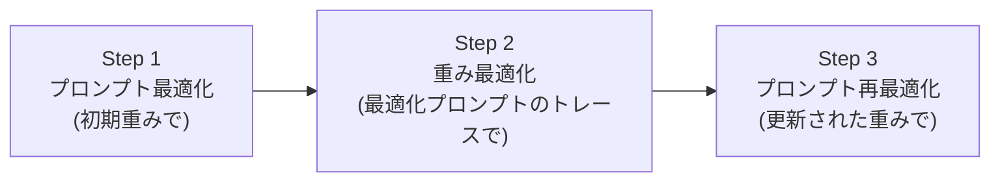
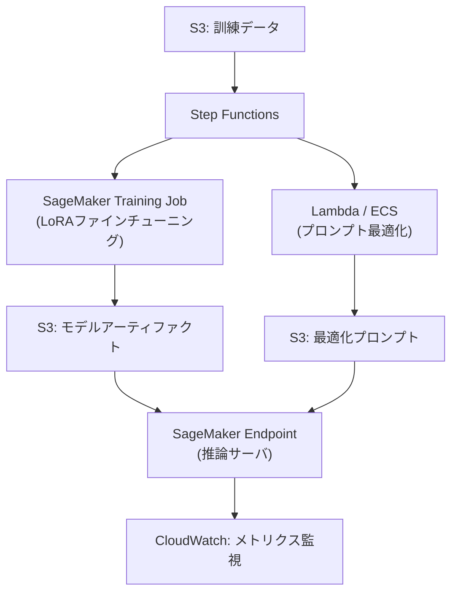

本記事は、Stanford大学のSoylu, Potts, Khattab (2024) による arXiv 論文 [Fine-Tuning and Prompt Optimization: Two Great Steps that Work Better Together](https://arxiv.org/abs/2407.10930) の解説記事です。モジュラーLMパイプラインにおけるファインチューニング（重み最適化）とプロンプト最適化を交互に適用する「BetterTogether」戦略を提案し、それぞれ単独で適用するよりも高い性能を達成することを示した研究の内容を紹介します。

この記事は [Zenn記事: DSPy v3.2 Metric設計とOptimizer選定で実現するプロンプト自動最適化](https://zenn.dev/0h_n0/articles/1b83773e95e02c) の深掘りです。DSPyのOptimizer選定を理解する上で、プロンプト最適化とファインチューニングをどのように組み合わせるべきかという設計判断の根拠を、本論文の実験結果から得ることを目指します。

## 情報源

| 項目 | 内容 |
|------|------|
| タイトル | Fine-Tuning and Prompt Optimization: Two Great Steps that Work Better Together |
| 著者 | Dilara Soylu, Christopher Potts, Omar Khattab (Stanford University) |
| arXiv ID | [2407.10930](https://arxiv.org/abs/2407.10930) |
| 提出日 | 2024年7月15日（改訂: 2024年10月7日） |
| 会議 | EMNLP 2024 |
| 分野 | cs.CL, cs.AI, cs.LG |
| 実装 | [DSPy](https://github.com/stanfordnlp/dspy) に統合 |

## 背景と動機

近年のNLPシステムは、RAG（Retrieval-Augmented Generation）に代表されるように、複数のモジュールを連結した高度なパイプラインとして構成されることが増えている。こうしたモジュラーパイプラインでは、各モジュールが個別のLM（言語モデル）とプロンプトテンプレートを持ち、全体のタスク性能を最大化するためにはモジュール間の協調的な最適化が求められる。

しかし著者らは、こうしたパイプラインの最適化において2つの根本的な課題があると指摘している。

第一に、**中間ラベルの欠如**である。エンドツーエンドの正解データ（最終出力に対するラベル）は存在しても、パイプライン内の各モジュールの中間出力に対するラベルは通常存在しない。これにより、各モジュールを個別に教師あり学習で最適化することが困難になる。

第二に、**勾配の不通過**である。モジュール間の通信が自然言語テキストで行われるため、勾配がモジュール間を伝搬しない。したがって、従来のニューラルネットワークのようにバックプロパゲーションで全体を同時に最適化することができない。

これらの制約のもとで、従来の研究はプロンプト最適化（プロンプトテンプレートやfew-shot例の選択）か、ファインチューニング（モデルの重み更新）のいずれか一方に注力してきた。著者らは「この2つのアプローチは互いに排他的ではなく、交互に適用することで相乗効果が得られるのではないか」という仮説のもと、BetterTogether戦略を提案している。

## 主要な貢献

著者らは本論文において以下の貢献を報告している。

- **BetterTogether戦略の提案**: プロンプト最適化と重み最適化を交互に適用する体系的な手法を提案。同一のLMが自身の出力を教師データとして活用し、反復的に改善する「自己教示（self-teaching）」の枠組みを実現している。
- **網羅的な戦略比較**: 単一最適化（プロンプトのみ、重みのみ）、繰り返し最適化（同じ手法を2回適用）、交互最適化（BetterTogether）の8つの戦略を、3つのLM x 3つのタスクの全9構成で比較評価している。
- **DSPyへの統合**: BetterTogetherオプティマイザをDSPyフレームワークに実装し、既存のDSPyプログラムに対して透過的に適用可能にしている。

## 技術的詳細

### 問題設定

著者らは、モジュラーLMパイプラインを以下のように形式化している。

プログラム $\Phi$ は、$N$ 個のモジュール $M_1, M_2, \ldots, M_N$ の合成として定義される。各モジュール $M_i$ はプロンプトテンプレート $\pi_i$ と重み $\theta_i$ を持ち、自然言語の入出力を行うファジーな変換として機能する。プログラム全体のパラメータは、重みの集合 $\Theta = \{\theta_1, \ldots, \theta_N\}$ とプロンプトの集合 $\Pi = \{\pi_1, \ldots, \pi_N\}$ で構成される。

最適化目標は以下のように定式化される。

$$
\underset{\Theta, \Pi}{\arg\max} \frac{1}{|X|} \sum_{(x, m) \in X} \mu\left(\Phi_{\langle \Theta, \Pi \rangle}(x),\ m\right)
$$

ここで、$X$ は訓練データ（入力 $x$ と正解メタデータ $m$ のペア）、$\mu$ は評価メトリック、$\Phi_{\langle \Theta, \Pi \rangle}(x)$ はパラメータ $\Theta, \Pi$ でパラメタライズされたプログラムの出力である。

### 2つの最適化手法

#### プロンプト最適化: BootstrapFewShotRS

プロンプト最適化には、DSPyのBootstrapFewShotRS（ランダムサーチ付きブートストラップfew-shot）が使用される。この手法は以下の手順で動作する。

1. 訓練データに対してプログラムを実行し、正解を出力したモジュールトレース（入出力ペア）を収集する
2. 収集したトレースからfew-shot例のサブセットを複数回サンプリングする
3. 各サブセットを検証データで評価し、最高性能のサブセットをプロンプトとして採用する

著者らの実験では、6つの候補プログラムを生成し、各モジュールに最大3つのfew-shot例を設定している。

#### 重み最適化: BootstrapFinetune

重み最適化には、DSPyのBootstrapFinetuneが使用される。この手法はプロンプト最適化で収集したトレースデータを活用し、以下の手順で動作する。

1. プログラムを訓練データに対して実行し、正解を出力したモジュールトレースを収集する
2. 各モジュールのプロンプト-補完ペア（prompt-completion pairs）をファインチューニング用データとして抽出する
3. 全モジュールのデータを統合し、LoRA（Low-Rank Adaptation）でLMの重みを更新する

著者らは以下のLoRA設定を報告している。

```python
from dataclasses import dataclass


@dataclass
class LoRAConfig:
    """BootstrapFinetuneのLoRA設定。

    Attributes:
        rank: LoRAのランク（低ランク行列の次元）
        alpha: LoRAのスケーリング係数
        epochs: ファインチューニングのエポック数
        learning_rate: 学習率
        batch_size: 実効バッチサイズ
        precision: 演算精度
        dropout: ドロップアウト率
        target_modules: 適用対象のアテンション層
    """

    rank: int = 32
    alpha: int = 64
    epochs: int = 5
    learning_rate: float = 1e-5
    batch_size: int = 8
    precision: str = "bfloat16"
    dropout: float = 0.0
    target_modules: tuple[str, ...] = ("q_proj", "k_proj")
```

### BetterTogetherアルゴリズム

BetterTogetherの核心は、プロンプト最適化と重み最適化を交互に適用し、各ステップの出力を次のステップの入力として活用する点にある。著者らは以下の3ステップからなるアルゴリズムを提案している。



**Step 1: 初期プロンプト最適化** ($\Pi^{(0)} \rightarrow \Pi^{(1)}$)

初期重み $\Theta^{(0)}$（事前学習済みモデル）のもとで、BootstrapFewShotRSによりプロンプトを最適化する。

$$
\Pi^{(1)} = \underset{\Pi}{\arg\max} \frac{1}{|X|} \sum_{(x,m) \in X} \mu\left(\Phi_{\langle \Theta^{(0)}, \Pi \rangle}(x),\ m\right)
$$

**Step 2: 重み最適化** ($\Theta^{(0)} \rightarrow \Theta^{(1)}$)

Step 1で最適化されたプロンプト $\Pi^{(1)}$ を用いてプログラムを実行し、得られた正解トレースを教師データとしてLoRAファインチューニングを行う。ここで重要なのは、最適化されたプロンプトによって生成されるトレースは、初期プロンプトによるトレースよりも質が高い点である。著者らはこれを「同一のLMが自身を教える」自己教示プロセスと位置づけている。

$$
\Theta^{(1)} = \underset{\Theta}{\arg\max} \frac{1}{|X|} \sum_{(x,m) \in X} \mu\left(\Phi_{\langle \Theta, \Pi^{(1)} \rangle}(x),\ m\right)
$$

**Step 3: プロンプト再最適化** ($\Pi^{(1)} \rightarrow \Pi^{(2)}$)

Step 2で更新された重み $\Theta^{(1)}$ のもとで、再度BootstrapFewShotRSによりプロンプトを最適化する。重みが更新されたことで、最適なプロンプトも変化するため、この再最適化が性能向上に寄与する。

$$
\Pi^{(2)} = \underset{\Pi}{\arg\max} \frac{1}{|X|} \sum_{(x,m) \in X} \mu\left(\Phi_{\langle \Theta^{(1)}, \Pi \rangle}(x),\ m\right)
$$

最終的なプログラムは $\Phi_{\langle \Theta^{(1)}, \Pi^{(2)} \rangle}$ として得られる。

### BetterTogetherの変種

著者らは、BetterTogetherの3ステップ版（$\Pi \rightarrow \Theta \rightarrow \Pi$）に加え、以下の変種も評価している。

| 戦略 | 表記 | 最適化ステップ |
|------|------|---------------|
| プロンプトのみ | $\Pi$ | プロンプト最適化を1回 |
| 重みのみ | $\Theta$ | 重み最適化を1回 |
| プロンプト2回 | $\Pi \rightarrow \Pi$ | プロンプト最適化を2回反復 |
| 重み2回 | $\Theta \rightarrow \Theta$ | 重み最適化を2回反復 |
| プロンプト→重み | $\Pi \rightarrow \Theta$ | プロンプトを最適化してから重みを更新 |
| 重み→プロンプト | $\Theta \rightarrow \Pi$ | 重みを更新してからプロンプトを最適化 |
| BetterTogether | $\Pi \rightarrow \Theta \rightarrow \Pi$ | 3ステップ交互最適化 |

## 実装のポイント

### DSPyにおけるBetterTogetherの利用

BetterTogetherはDSPyフレームワークに統合されており、既存のDSPyプログラムに対して以下のように適用できる。DSPyのプログラミングモデルでは、各モジュール（`dspy.ChainOfThought`など）が自動的にプロンプトテンプレートを管理し、BootstrapFewShotRSとBootstrapFinetuneの両方に対応している。

```python
import dspy
from dspy.teleprompt import BootstrapFewShotRS, BootstrapFinetune


def run_better_together(
    program: dspy.Module,
    trainset: list[dspy.Example],
    valset: list[dspy.Example],
    model_name: str = "mistralai/Mistral-7B-Instruct-v0.2",
) -> dspy.Module:
    """BetterTogetherの3ステップ最適化を実行する。

    Args:
        program: 最適化対象のDSPyプログラム
        trainset: 訓練データ
        valset: 検証データ
        model_name: ベースモデル名

    Returns:
        最適化済みのDSPyプログラム
    """
    lm = dspy.LM(model_name)
    dspy.configure(lm=lm)

    # Step 1: プロンプト最適化（初期重み）
    prompt_optimizer = BootstrapFewShotRS(
        max_bootstrapped_demos=3,
        num_candidate_programs=6,
    )
    step1_program = prompt_optimizer.compile(
        program,
        trainset=trainset,
        valset=valset,
    )

    # Step 2: 重み最適化（最適化プロンプトのトレースで）
    weight_optimizer = BootstrapFinetune(
        max_bootstrapped_demos=3,
    )
    step2_program = weight_optimizer.compile(
        step1_program,
        trainset=trainset,
    )

    # Step 3: プロンプト再最適化（更新された重みで）
    step3_program = prompt_optimizer.compile(
        step2_program,
        trainset=trainset,
        valset=valset,
    )

    return step3_program
```

### 推論設定

著者らは、HuggingFace text-generation-inference (TGI) をDockerで起動して推論サーバとして使用している。主要なパラメータは以下の通りである。

- Temperature: 0.1
- Top-p: 0.97
- 最大トークン数: 1024

これらの設定はfew-shot例を含むプロンプトの長さとのバランスを考慮して選択されている。

## Production Deployment Guide: AWSにおけるBetterTogetherパイプラインの構成

BetterTogetherをプロダクション環境で運用する場合、ファインチューニングとプロンプト最適化を交互に実行するパイプラインの自動化が必要となる。以下にAWS上での構成パターンを示す。

### アーキテクチャ概要



### Step Functionsによる3ステップオーケストレーション

BetterTogetherの3ステップ（$\Pi \rightarrow \Theta \rightarrow \Pi$）をAWS Step Functionsでオーケストレーションする構成が自然である。各ステップの依存関係が明確であり、リトライやエラーハンドリングをステートマシンとして宣言的に管理できる。

主要な構成要素は以下の通りである。

- **Step 1, 3（プロンプト最適化）**: SageMaker Endpointへの推論リクエストを繰り返すECSタスクとして実装。候補プログラムの生成と検証は独立に実行可能であるため、並列化により実行時間を短縮できる。
- **Step 2（LoRAファインチューニング）**: SageMaker Training Job（ml.g5.2xlarge, A10G 24GB）として実行。Step FunctionsのcreateTrainingJob.sync統合により、ジョブ完了を自動待機する。
- **アーティファクト管理**: ファインチューニング済みモデルの重みはS3にバージョニングされたアーティファクトとして保存し、最適化されたプロンプト（few-shot例のセット）はDynamoDBまたはS3にJSON形式で管理する。

### コスト見積もり

著者らは全実験（9構成 x 8戦略）で約75 GPU時間（A100）を報告している。本番環境でml.g5.2xlargeを使用した場合、1回のBetterTogetherパイプライン（3ステップ）の実行に約8-12 GPU時間を見込むことが妥当である。オンデマンド料金（us-east-1）で$1.515/hのml.g5.2xlargeを使用する場合、1回あたり約$12-18となる。

## 実験結果

### 評価タスクとデータセット

著者らは3つのタスクで実験を行っている。

| タスク | データセット | プログラム構成 | 訓練/検証/テスト | メトリック |
|--------|-------------|---------------|-----------------|-----------|
| マルチホップQA | HotPotQA | 3モジュール（検索クエリ生成x2 + 回答生成） | 1000/500/1500 | 正規化完全一致 |
| 算術推論 | GSM8K | 1モジュール（Chain-of-Thought） | 1000/500/1319 | 最終数値一致 |
| 特徴ベース分類 | Iris | 1モジュール（CoT分類） | 50/50/50 | 正規化完全一致 |

HotPotQAは3つのモジュールから構成されるパイプラインであり、モジュール間の協調最適化の効果を検証するのに適している。GSM8KとIrisは単一モジュールのプログラムであり、単一モジュール内での重みとプロンプトの相互作用を検証する。

### 主要結果

著者らが報告しているTable 1の結果を以下に示す（各値は3回の平均、テストセットでの精度%）。

| 戦略 | HotPotQA ||| GSM8K ||| Iris |||
| | Mistral-7b | Llama-2-7b | Llama-3-8b | Mistral-7b | Llama-2-7b | Llama-3-8b | Mistral-7b | Llama-2-7b | Llama-3-8b |
|------|-----------|-----------|-----------|-----------|-----------|-----------|-----------|-----------|-----------|
| Vanilla | 17.2 | 13.2 | 31.6 | 40.3 | 24.0 | 72.7 | 26.0 | 0.0 | 48.0 |
| $\Pi$ | 33.8 | 33.3 | 46.9 | 46.4 | 26.0 | 77.9 | 57.3 | 56.7 | 79.3 |
| $\Theta$ | 22.9 | 12.2 | 34.8 | 40.7 | 24.0 | 75.1 | 29.3 | -- | 37.3 |
| $\Pi \rightarrow \Pi$ | 33.8 | 32.6 | 46.5 | 47.7 | 24.7 | 77.6 | 59.3 | 64.0 | 82.0 |
| $\Theta \rightarrow \Theta$ | 24.0 | 13.0 | 34.4 | 42.8 | 24.1 | 44.1 | 38.0 | -- | 39.3 |
| $\Pi \rightarrow \Theta$ | 36.3 | 32.7 | 42.8 | 47.3 | 27.3 | 77.6 | 30.7 | 26.7 | 44.0 |
| $\Theta \rightarrow \Pi$ | 33.0 | 34.2 | 43.6 | 48.3 | 26.6 | 78.9 | 66.7 | -- | 78.7 |
| $\Pi \rightarrow \Theta \rightarrow \Pi$ | **37.6** | **34.8** | 46.7 | 46.8 | 26.3 | 77.0 | 52.7 | **65.3** | 79.3 |

### 結果の分析

著者らは以下の知見を報告している。

**1. BetterTogether戦略の優位性**: 9つのデータセット x LMの組み合わせのうち7つにおいて、プロンプト最適化と重み最適化を組み合わせた戦略（$\Pi \rightarrow \Theta$, $\Theta \rightarrow \Pi$, $\Pi \rightarrow \Theta \rightarrow \Pi$のいずれか）が最高性能を達成している。

**2. 重み最適化のみの限界**: 重みのみの最適化（$\Theta$）は、多くの場合でVanillaからの改善幅が小さく、特にLlama-2-7bのIrisタスクではファインチューニング自体が収束しないケースも報告されている（表中の「--」）。著者らはこれについて、中間ラベルが存在しない状況でのファインチューニングデータの品質が低いことが原因と分析している。

**3. プロンプト最適化の安定性**: プロンプトのみの最適化（$\Pi$）は全構成で安定した改善を示しており、特にIrisタスクでは26.0% → 57.3%（Mistral-7b）のように大幅な改善を達成している。

**4. 自己教示の効果**: BetterTogetherの$\Pi \rightarrow \Theta$戦略では、Step 1で最適化されたプロンプトによって質の高いトレースが生成され、それがStep 2のファインチューニングデータとして使用される。これにより、重みのみの最適化で観察された低品質データの問題が緩和されている。HotPotQAにおいてMistral-7bでは$\Theta$単体の22.9%に対し、$\Pi \rightarrow \Theta$は36.3%と約60%の改善を示している。

**5. 繰り返し最適化の非効率性**: 同じ手法を2回適用する$\Pi \rightarrow \Pi$や$\Theta \rightarrow \Theta$は、1回の適用からの改善が限定的であるか、むしろ性能が低下するケースも見られる。特に$\Theta \rightarrow \Theta$はGSM8K/Llama-3-8bで75.1% → 44.1%と大幅に低下しており、過学習の問題を示唆している。

## 実運用への応用

### BetterTogetherが有効なユースケース

本論文の結果を踏まえると、BetterTogetherは以下のようなシナリオで特に有効であると考えられる。

**マルチモジュールパイプライン**: HotPotQAの結果が示すように、複数のモジュールが連携するRAGパイプラインでは、各モジュールのプロンプトと全体の重みを協調的に最適化することで、単独最適化を上回る性能が期待できる。

**小規模データでの最適化**: Irisタスク（訓練50件）の結果は、少量のデータでもBetterTogetherが有効であることを示している。企業内の専門ドメインタスクのように大規模な教師データが得られない状況で、自己教示による効率的な最適化が可能となる。

**7Bクラスモデルの性能向上**: 著者らの実験は全て7-8Bパラメータのモデルで行われており、API経由の大規模モデル（GPT-4等）に依存しないオンプレミスまたはVPC内での運用を前提としている。コスト制約やデータプライバシーの観点から小規模モデルを使用せざるを得ない場合に、BetterTogetherはモデルサイズを増やさずに性能を改善する手段を提供する。

### 適用時の注意点

一方で、以下の点に留意する必要がある。

- **計算コスト**: 3ステップの逐次実行が必要であり、著者らは全実験（9構成 x 8戦略）で約75 GPU時間（A100）を報告している。1構成あたりの3ステップパイプラインに換算すると数時間のGPU時間が必要となる。
- **タスク依存性**: GSM8K/Llama-3-8bのように、既にプロンプトのみで高い性能（77.9%）が出ている場合、BetterTogetherによる追加改善は限定的（77.0%とむしろ微減）である。
- **ファインチューニングの不安定性**: Llama-2-7bのIrisタスクのように、ファインチューニング自体が失敗する場合がある。LoRAのハイパーパラメータ調整や訓練データの品質管理が前提となる。

## 関連研究

著者らは以下の研究領域との関連を議論している。

**DSPyフレームワーク**: Khattab et al. (2023, 2024) が提案したモジュラーLMプログラミングフレームワークであり、BetterTogetherはDSPyの最適化パイプラインの一部として実装されている。DSPyは宣言的なモジュール定義とコンパイラベースの最適化を特徴とし、プロンプトエンジニアリングの手動作業を自動化する。

**プロンプト最適化**: APE (Zhou et al., 2022)、OPRO (Yang et al., 2023)、MIPRO (Opsahl-Ong et al., 2024) など、プロンプトテンプレートの自動探索手法が多数提案されている。これらはプロンプトのみを最適化対象とし、モデルの重みは固定する点でBetterTogetherと異なる。

**ファインチューニング**: LoRA (Hu et al., 2021) やQLoRA (Dettmers et al., 2023) などのパラメータ効率的ファインチューニング（PEFT）手法は、少数のパラメータのみを更新することでメモリ効率を高めている。BetterTogetherはLoRAを重み最適化の実装として採用している。

**自己教示学習**: Self-Play Fine-Tuning (Chen et al., 2024) やSTaR (Zelikman et al., 2022) は、モデル自身の出力を教師データとして活用する手法を提案している。BetterTogetherの自己教示プロセスはこれらと類似しているが、プロンプト最適化を組み合わせることでトレースの品質を明示的に高めている点が特徴である。

## まとめ

BetterTogetherは、モジュラーLMパイプラインにおいてプロンプト最適化と重み最適化を交互に適用する戦略であり、EMNLP 2024で発表された。9つのデータセット x LMの構成のうち7つにおいて、いずれかのBetterTogether変種が最高性能を達成し、重み最適化のみに対して最大60%の改善を報告している。

本手法の設計思想は、プロンプト最適化が生成する高品質なトレースがファインチューニングデータの品質を向上させ、ファインチューニングされたモデルに対するプロンプト再最適化がさらなる性能向上をもたらすという正のフィードバックループにある。DSPyフレームワークに統合されているため、既存のDSPyプログラムに対して比較的低い導入コストで適用可能である。

一方で、ファインチューニングステップの不安定性やタスク依存的な効果の差異は、本番適用に際して十分な検証を要する点である。特にファインチューニングが失敗するケース（Llama-2-7b/Iris）や、プロンプト最適化のみで十分な性能が得られるケース（Llama-3-8b/GSM8K）では、BetterTogetherの3ステップ全てを実行する必要性を慎重に評価すべきである。

## 参考文献

- Soylu, D., Potts, C., & Khattab, O. (2024). Fine-Tuning and Prompt Optimization: Two Great Steps that Work Better Together. *EMNLP 2024*. [arXiv:2407.10930](https://arxiv.org/abs/2407.10930)
- Khattab, O., et al. (2024). DSPy: Compiling Declarative Language Model Calls into Self-Improving Pipelines. *ICLR 2024*. [arXiv:2310.03714](https://arxiv.org/abs/2310.03714)
- Hu, E. J., et al. (2021). LoRA: Low-Rank Adaptation of Large Language Models. *ICLR 2022*. [arXiv:2106.09685](https://arxiv.org/abs/2106.09685)
- Opsahl-Ong, K., et al. (2024). Optimizing Instructions and Demonstrations for Multi-Stage Language Model Programs. [arXiv:2406.11695](https://arxiv.org/abs/2406.11695)
- Yang, C., et al. (2023). Large Language Models as Optimizers. [arXiv:2309.03409](https://arxiv.org/abs/2309.03409)
- Zelikman, E., et al. (2022). STaR: Bootstrapping Reasoning with Reasoning. *NeurIPS 2022*. [arXiv:2203.14465](https://arxiv.org/abs/2203.14465)
- DSPy Framework: [https://github.com/stanfordnlp/dspy](https://github.com/stanfordnlp/dspy)
