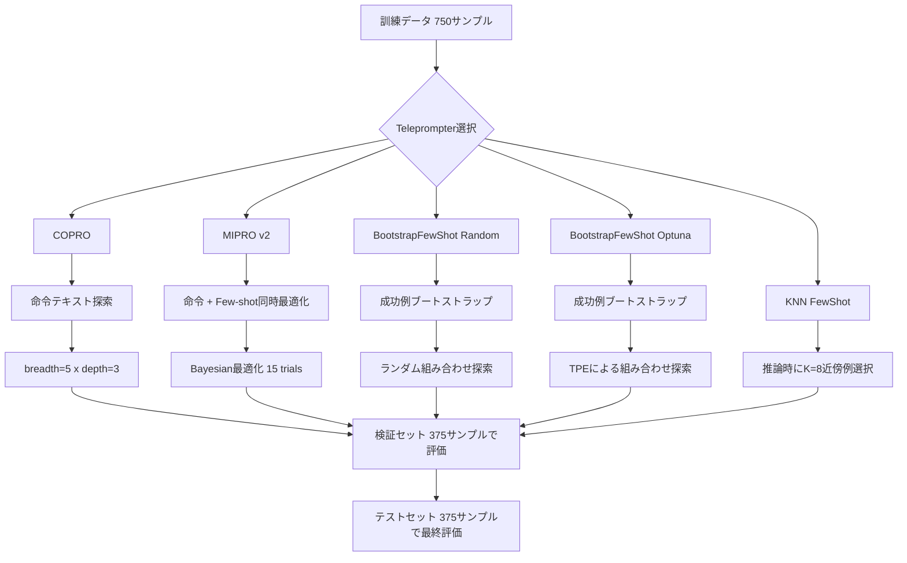
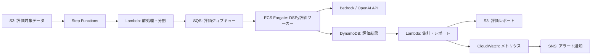
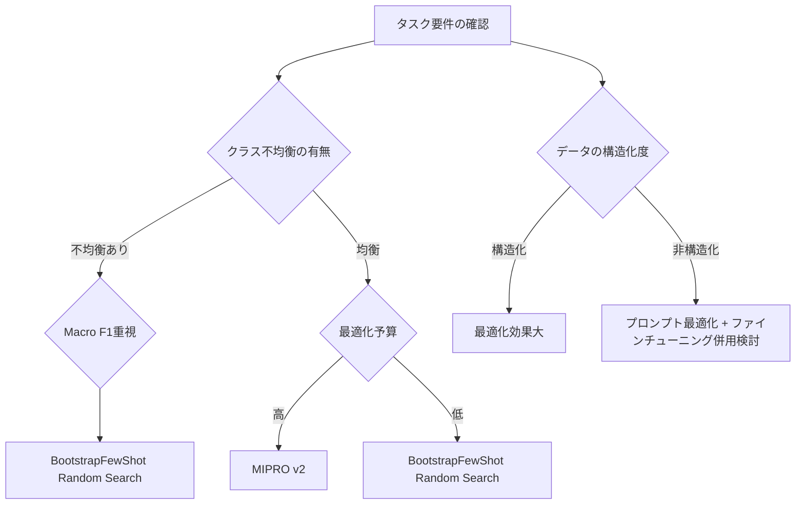

## 論文概要（Abstract）

本記事は [A Comparative Study of DSPy Teleprompter Algorithms for Aligning Large Language Models Evaluation Metrics to Human Evaluation](https://arxiv.org/abs/2412.15298) の解説記事です。

DSPyフレームワークにおけるTeleprompter（Optimizer）は、LLMプロンプトの自動最適化手法として注目されているが、各アルゴリズムの比較検証は十分に行われていない。著者らは、5種のTeleprompterアルゴリズム（COPRO、MIPRO v2、BootstrapFewShot Random Search、BootstrapFewShot with Optuna、KNN FewShot）を用い、幻覚検出（Hallucination Detection）タスクにおいてLLM評価と人間アノテーションの整合度を体系的に比較した。HaluBenchデータセット（1,500サンプル）とGPT-4oを評価モデルとして使用し、最適化後のプロンプトがベースラインを最大約5ポイント上回る精度を達成したと報告している。一方で、クラス不均衡やデータソース間の性能差異が最適化結果に大きく影響する点を指摘し、層化サンプリングの導入を提案している。

この記事は [Zenn記事: DSPy v3.2 Metric設計とOptimizer選定で実現するプロンプト自動最適化](https://zenn.dev/0h_n0/articles/1b83773e95e02c) の深掘りです。

## 情報源

- **arXiv ID**: 2412.15298
- **URL**: [https://arxiv.org/abs/2412.15298](https://arxiv.org/abs/2412.15298)
- **著者**: Bhaskarjit Sarmah, Kriti Dutta, Anna Grigoryan, Sachin Tiwari, Stefano Pasquali, Dhagash Mehta
- **発表年**: 2024年12月
- **分野**: cs.CL（計算言語学）, cs.AI（人工知能）
- **ページ数**: 7ページ、テーブル10点

## 背景と動機（Background & Motivation）

LLMの生成物を自動評価する「LLM-as-a-Judge」アプローチは、人間アノテーションのコストを削減する手段として広く採用されている。しかし、LLM評価と人間評価の整合性は、プロンプトの記述方法に大きく依存する。特に幻覚検出タスクでは、文脈に対する回答の忠実性（faithfulness）を判定するため、プロンプト内の指示精度が評価品質を左右する。

DSPyは、プロンプトエンジニアリングをプログラム最適化問題として定式化するフレームワークである。Zenn記事で解説されているように、DSPyのTeleprompter（現在はOptimizerと呼称）はメトリクスに基づいてプロンプトを自動最適化する。しかし、どのOptimizerがどのようなタスクに適しているかの体系的な比較は限られていた。

著者らは、この比較評価の欠如が実務上の障壁になっていると指摘している。幻覚検出における各Optimizerの特性を明らかにすることで、実務者がタスクに応じて適切なOptimizerを選択できるようにすることが本研究の動機である。

## 主要な貢献（Key Contributions）

著者らは以下の3点を主要な貢献として報告している。

- **5種のTeleprompterアルゴリズムの体系的比較**: COPRO、MIPRO v2、BootstrapFewShot Random Search、BootstrapFewShot with Optuna、KNN FewShotを統一条件下で評価し、各アルゴリズムの強みと弱みを定量的に示した
- **データソース別の性能分析**: HaluBenchの6つのサブデータセット（CovidQA、FinanceBench、HaluEval、PubMedQA、DROP、RAGTruth）ごとに評価を行い、データの構造化度合いが最適化効果に影響することを示した
- **最適化バイアスの発見と対策の提案**: グローバルメトリクスに最適化するTeleprompterが高性能データソースに過適合し、低性能データソースを無視する傾向を発見し、層化サンプリングによる対策を提案した

## 技術的詳細（Technical Details）

### 実験設定

**データセット**: HaluBenchから1,500サンプルを使用している。HaluBenchは文脈（DOCUMENT）・質問・回答の三つ組で構成され、回答が文脈に忠実かどうかの人間アノテーションが付与されている。著者らは1,500サンプルを以下のように分割している。

- 訓練セット: 750サンプル
- 検証セット: 375サンプル
- テストセット: 375サンプル

6つのサブデータセット（CovidQA、FinanceBench、HaluEval、PubMedQA、DROP、RAGTruth）から均等にサンプリングされている。

**評価モデル**: OpenAI GPT-4o（temperature=0.0）を使用し、決定論的な出力を確保している。

**評価指標**: Accuracy、Micro F1、Macro F1、Weighted F1の4指標を使用している。Macro F1はクラスごとのF1を単純平均するため、少数クラスの性能を反映しやすい。Weighted F1はクラスのサンプル数で重み付けするため、多数クラスの影響が大きい。

**ベースラインプロンプト**: 「与えられたDOCUMENTとANSWERに基づき、ANSWERがDOCUMENTの内容に忠実かどうかを判定せよ」という直接的な指示をJSON出力形式で使用している。

### 5種のTeleprompterアルゴリズム

以下、各アルゴリズムの概要と本研究で使用されたハイパーパラメータを記述する。

#### 1. COPRO（Cooperative Prompt Optimization）

COPROは命令（instruction）テキストの最適化に特化したアルゴリズムである。breadth（探索幅）とdepth（探索深さ）のパラメータで探索空間を制御する。各反復で複数の候補命令を生成し、検証セットのメトリクスに基づいて最良の候補を選択する。

本研究でのハイパーパラメータは以下の通りである。

- breadth: 5（各ステップで生成する候補数）
- depth: 3（反復回数）
- init_temperature: 0（初期生成の温度）

COPROは命令部分のみを最適化し、Few-shot例の選択は行わない。

#### 2. MIPRO v2（Multi-Stage Instruction Prompt Optimization）

MIPRO v2は命令最適化とFew-shot例の選択を同時に行う多段階最適化アルゴリズムである。Bayesian最適化を用いて、命令テキストとデモンストレーション例の組み合わせを探索する。

$$
\theta^* = \underset{\theta}{\arg\max} \; \mathbb{E}_{(x_i, y_i) \sim \mathcal{D}_{\text{val}}} \left[ M(f_\theta(x_i), y_i) \right]
$$

ここで $\theta$ は命令テキストとFew-shot例の組み合わせ、$M$ は評価メトリクス、$f_\theta$ は最適化対象のDSPyプログラムである。

本研究でのハイパーパラメータは以下の通りである。

- num_candidates: 3（命令候補数）
- init_temperature: 0
- max_bootstrapped_demos: 8（自動生成されるデモ例の最大数）
- num_trials: 15（Bayesian最適化の試行回数）

#### 3. BootstrapFewShot Random Search

BootstrapFewShotは、訓練セットから成功例を自動生成（ブートストラップ）し、Few-shot例としてプロンプトに挿入するアルゴリズムである。Random Search変種では、ブートストラップされた例の組み合わせをランダムに探索し、検証セットのメトリクスが最良となる組み合わせを選択する。

本研究でのハイパーパラメータは以下の通りである。

- max_bootstrapped_demos: 8
- max_labeled_demos: 16（ラベル付き訓練例の最大数）

#### 4. BootstrapFewShot with Optuna

BootstrapFewShotのランダム探索をOptuna（ハイパーパラメータ最適化フレームワーク）に置き換えた変種である。Tree-structured Parzen Estimator（TPE）を用いてFew-shot例の組み合わせを効率的に探索する。

$$
\text{TPE}: p(\theta | y < y^*) / p(\theta | y \geq y^*)
$$

ここで $y$ は目的関数の値、$y^*$ は分位点である。TPEはランダム探索よりも少ない試行回数で良好な組み合わせを発見できる場合がある。

本研究でのハイパーパラメータはBootstrapFewShot Random Searchと同一である。

#### 5. KNN FewShot

KNN FewShotは、推論時に入力クエリに最も近い $K$ 個の訓練例をFew-shot例として動的に選択するアルゴリズムである。埋め込みベクトル空間におけるK近傍法を用いる。

$$
\mathcal{N}_K(x) = \underset{S \subset \mathcal{D}_{\text{train}}, |S|=K}{\arg\min} \sum_{x_i \in S} d(\phi(x), \phi(x_i))
$$

ここで $\phi$ は埋め込み関数、$d$ は距離関数（コサイン距離等）である。

本研究では $K = 8$ で設定されている。

### アルゴリズム比較のフロー

以下に5種のTeleprompterアルゴリズムの最適化フローの違いを示す。



## 実装のポイント

DSPyでの幻覚検出パイプラインは、`dspy.Signature` と `dspy.Module` で構成される。以下に本研究のベースライン構成に基づく実装例を示す。

```python
"""DSPy Teleprompterを用いた幻覚検出パイプライン."""

import dspy
from dspy.teleprompt import (
    BootstrapFewShot,
    BootstrapFewShotWithOptuna,
    COPRO,
    KNNFewShot,
    MIPROv2,
)


class HallucinationDetection(dspy.Signature):
    """文脈に対する回答の忠実性を判定する.

    与えられたDOCUMENTとANSWERに基づき、
    ANSWERがDOCUMENTの内容に忠実かどうかを判定する。
    """

    document: str = dspy.InputField(desc="参照文脈")
    answer: str = dspy.InputField(desc="判定対象の回答")
    is_faithful: bool = dspy.OutputField(desc="忠実であればTrue")


class HallucinationJudge(dspy.Module):
    """幻覚検出モジュール."""

    def __init__(self) -> None:
        super().__init__()
        self.judge = dspy.ChainOfThought(HallucinationDetection)

    def forward(self, document: str, answer: str) -> dspy.Prediction:
        """文脈と回答から忠実性を判定する.

        Args:
            document: 参照文脈テキスト.
            answer: 判定対象の回答テキスト.

        Returns:
            忠実性判定結果を含むPrediction.
        """
        return self.judge(document=document, answer=answer)


def faithfulness_metric(
    example: dspy.Example,
    prediction: dspy.Prediction,
) -> bool:
    """忠実性判定の正解一致メトリクス.

    Args:
        example: 正解ラベルを含む訓練例.
        prediction: モデルの予測結果.

    Returns:
        正解と予測が一致すればTrue.
    """
    return example.is_faithful == prediction.is_faithful


def optimize_with_miprov2(
    trainset: list[dspy.Example],
    valset: list[dspy.Example],
) -> dspy.Module:
    """MIPRO v2による最適化.

    Args:
        trainset: 訓練データセット.
        valset: 検証データセット.

    Returns:
        最適化済みモジュール.
    """
    optimizer = MIPROv2(
        metric=faithfulness_metric,
        num_candidates=3,
        init_temperature=0.0,
        max_bootstrapped_demos=8,
        num_trials=15,
    )
    return optimizer.compile(
        HallucinationJudge(),
        trainset=trainset,
        valset=valset,
    )


def optimize_with_bootstrap_optuna(
    trainset: list[dspy.Example],
    valset: list[dspy.Example],
) -> dspy.Module:
    """BootstrapFewShot with Optunaによる最適化.

    Args:
        trainset: 訓練データセット.
        valset: 検証データセット.

    Returns:
        最適化済みモジュール.
    """
    optimizer = BootstrapFewShotWithOptuna(
        metric=faithfulness_metric,
        max_bootstrapped_demos=8,
        max_labeled_demos=16,
    )
    return optimizer.compile(
        HallucinationJudge(),
        trainset=trainset,
        valset=valset,
    )
```

上記のコードで注意すべき点は以下の通りである。

- `dspy.Signature` のフィールド定義は型アノテーション必須であり、`desc` で自然言語の説明を付与する
- `dspy.ChainOfThought` は思考過程を含む推論を行うため、単純な `dspy.Predict` よりも判定理由の透明性が高い
- メトリクス関数は `(example, prediction) -> bool | float` のシグネチャに従う必要がある
- MIPRO v2の `num_trials` はBayesian最適化の試行回数であり、API呼び出しコストに直結する

## Production Deployment Guide: AWSでのLLM評価パイプライン

DSPy Teleprompterで最適化したプロンプトを本番環境で運用するには、評価パイプラインの信頼性・スケーラビリティ・コスト効率を設計に組み込む必要がある。以下にAWSを用いた幻覚検出パイプラインの構成パターンを示す。

### アーキテクチャ概要



### Step Functionsによるオーケストレーション

評価パイプラインの全体制御にはAWS Step Functionsを用いる。DSPy Optimizerのオフライン最適化（プロンプトコンパイル）と、最適化済みプロンプトによるオンライン評価を分離する設計が重要である。

**オフラインフェーズ（プロンプト最適化）**: EC2またはSageMaker Processing Jobで実行する。本研究の結果に基づけば、MIPRO v2は15 trialsの探索でGPT-4o APIを750回以上呼び出すため、コスト見積もりが必要である。最適化済みプロンプトはS3にJSON形式で保存し、バージョニングを有効にする。

**オンラインフェーズ（評価実行）**: ECS FargateタスクでDSPyプログラムをロードし、最適化済みプロンプトを適用して評価を実行する。SQSキューでバックプレッシャーを制御し、LLM APIのレートリミットに合わせてコンカレンシーを調整する。

### ECS Fargateワーカーの設計

```python
"""ECS Fargate上で動作するDSPy評価ワーカー."""

import json
from typing import Any

import boto3
import dspy


def load_optimized_program(
    s3_bucket: str,
    s3_key: str,
) -> dspy.Module:
    """S3から最適化済みDSPyプログラムをロードする.

    Args:
        s3_bucket: S3バケット名.
        s3_key: 最適化済みプログラムのS3キー.

    Returns:
        最適化済みDSPyモジュール.
    """
    s3 = boto3.client("s3")
    response = s3.get_object(Bucket=s3_bucket, Key=s3_key)
    program_state = json.loads(response["Body"].read())

    program = HallucinationJudge()
    program.load_state(program_state)
    return program


def process_batch(
    program: dspy.Module,
    batch: list[dict[str, Any]],
    dynamodb_table: str,
) -> dict[str, int]:
    """バッチ単位で評価を実行しDynamoDBに結果を書き込む.

    Args:
        program: 最適化済みDSPyモジュール.
        batch: 評価対象のドキュメント・回答ペアのリスト.
        dynamodb_table: 結果書き込み先のDynamoDBテーブル名.

    Returns:
        処理結果のサマリー（成功数、失敗数）.
    """
    dynamodb = boto3.resource("dynamodb")
    table = dynamodb.Table(dynamodb_table)
    results = {"success": 0, "failure": 0}

    with table.batch_writer() as writer:
        for item in batch:
            try:
                prediction = program(
                    document=item["document"],
                    answer=item["answer"],
                )
                writer.put_item(
                    Item={
                        "evaluation_id": item["id"],
                        "is_faithful": prediction.is_faithful,
                        "reasoning": getattr(prediction, "reasoning", ""),
                    },
                )
                results["success"] += 1
            except Exception:
                results["failure"] += 1

    return results
```

### コスト最適化のポイント

本研究の結果を踏まえたコスト最適化の指針を以下に示す。

**Optimizer選択とコストのトレードオフ**: MIPRO v2は精度が最も高い（Accuracy 85.87%）が、num_trials=15のBayesian最適化で多数のAPI呼び出しが必要である。BootstrapFewShot Random Searchは精度（Accuracy 84.00%）とMacro F1（0.8115）のバランスが良く、最適化コストも低い。本番環境では、最適化頻度（週次・月次等）とAPI呼び出しコストを勘案してOptimizerを選択すべきである。

**Amazon Bedrock活用**: GPT-4o以外にAmazon Bedrockの Claude 3.5 Sonnet や Llama 3.1 を評価モデルとして使用すれば、VPCエンドポイント経由のプライベート通信でセキュリティを確保しつつ、従量課金でコストを最適化できる。DSPyは `dspy.Bedrock` アダプタでAmazon Bedrockに対応している。

**スケーリング設計**: ECS FargateのAuto Scalingポリシーを SQSキューの `ApproximateNumberOfMessagesVisible` メトリクスに連動させ、評価対象データの増減に応じてワーカー数を自動調整する。ターゲット値は、LLM APIのレートリミット（例: GPT-4oで500 RPM）をワーカー数で割った値を基準にする。

**監視とアラート**: CloudWatch Metricsで以下の指標を監視する。
- 評価スループット（evaluations/min）
- API呼び出しエラー率
- 評価結果のクラス分布（幻覚検出率の急変はモデルやデータの変質を示唆）
- Macro F1の定期計算（人間アノテーションのサンプルとの照合）

閾値超過時にSNS経由でSlack/PagerDutyにアラートを送信する設計とする。

## 実験結果（Experimental Results）

### 集約結果

以下に各Teleprompterアルゴリズムのテストセットにおける集約結果を示す（Table 3, 4より引用）。

| アルゴリズム | Accuracy | Weighted F1 | Macro F1 |
|:---|:---:|:---:|:---:|
| Baseline GPT-4o | 80.91% | 0.8125 | 0.8019 |
| MIPRO v2 | **85.87%** | **0.8248** | 0.4082 |
| BootstrapFewShot Optuna | 85.60% | 0.8092 | 0.8006 |
| BootstrapFewShot Random | 84.00% | 0.8197 | **0.8115** |
| KNN FewShot | 83.47% | 0.7844 | 0.3883 |
| COPRO | 82.13% | 0.8008 | 0.2267 |

著者らは、MIPRO v2がAccuracyとWeighted F1で最高性能を示した一方、Macro F1が0.4082と大幅に低下している点を報告している。これは少数クラス（Non-Hallucination等）の検出性能が犠牲になっていることを示す。BootstrapFewShot Random SearchはMacro F1で0.8115を達成しており、クラス間のバランスが最も良好である。

### データソース別の性能差異

著者らは6つのサブデータセットごとの性能を詳細に分析し、以下の傾向を報告している。

| データソース | 特徴 | ベースライン Micro F1 | 最良Optimizer | 最良 Micro F1 |
|:---|:---|:---:|:---|:---:|
| PubMedQA | 医学系・構造化 | 高 | BootstrapFewShot Random | 0.9231 |
| CovidQA | 医学系・構造化 | 0.9677 | Baseline GPT-4o | 0.9677 |
| HaluEval | 汎用・構造化 | 中 | MIPRO v2 | 向上 |
| RAGTruth | RAG系 | 中 | 各Optimizer | 改善 |
| FinanceBench | 金融・非構造化 | 低 | MIPRO v2 / Optuna | 0.8333 |
| DROP | 数値推論・非構造化 | 0.2500 | 各Optimizer | 限定的改善 |

注目すべき点は以下の通りである。

- **構造化データでの有効性**: PubMedQAやCovidQAのように回答パターンが明確なデータでは、最適化の効果が顕著に表れている。BootstrapFewShot Random SearchのPubMedQAにおけるMicro F1は0.9231と高い値を示した
- **非構造化データの限界**: DROPデータセットではベースラインのMicro F1が0.2500と低く、最適化後も大幅な改善は見られなかった。著者らはDROPの数値推論タスクがプロンプト最適化だけでは解決困難な課題を含むと分析している
- **ベースラインの強さ**: CovidQAではベースラインGPT-4oが0.9677のMicro F1を達成しており、最適化による追加的な改善が困難であった。著者らはGPT-4oの事前学習データにCovidQA関連の情報が含まれている可能性を指摘している

### 最適化バイアスの問題

著者らが発見した重要な知見は、グローバルメトリクス（全データソースの集約精度）に最適化するTeleprompterが、高性能データソースの例をFew-shotに偏って選択し、低性能データソースのパフォーマンスを犠牲にする傾向があるという点である。

MIPRO v2とKNN FewShotのMacro F1が大幅に低下した原因は、このバイアスにあると著者らは分析している。全体のAccuracyを最大化するために、すでに高い精度を持つデータソース（PubMedQA、CovidQA等）の例が優先的に選択され、FinanceBenchやDROPの性能改善が後回しにされた結果である。

著者らは対策として、訓練データの層化サンプリング（各データソースから均等に例を抽出）を推奨している。

## 実運用への応用

本研究の知見を実運用に適用する際の指針を以下にまとめる。

### Optimizer選択基準



- **クラス不均衡がある場合**: BootstrapFewShot Random Searchを第一選択とする。Macro F1 0.8115は5種の中で最高であり、少数クラスの検出性能を維持できる
- **全体精度を最大化する場合**: MIPRO v2が最高Accuracy（85.87%）を示したが、Macro F1の低下に注意が必要である
- **コスト制約がある場合**: COPROは命令最適化のみでFew-shot例の生成を行わないため、API呼び出し回数が少ない。ただし本研究ではMacro F1が0.2267と低く、単独使用は推奨しにくい
- **推論時の動的適応が必要な場合**: KNN FewShotは入力に応じてFew-shot例を動的に選択するが、Macro F1が0.3883と低い結果を示しており、追加の工夫が必要である

### 層化サンプリングの実装

著者らの提案に基づき、データソース間のバランスを維持するサンプリング戦略を以下に示す。

```python
"""層化サンプリングによるバランス調整."""

from collections import defaultdict

import dspy


def stratified_sample(
    trainset: list[dspy.Example],
    source_field: str = "source",
    samples_per_source: int = 50,
) -> list[dspy.Example]:
    """データソースごとに均等にサンプリングする.

    Args:
        trainset: 全訓練データ.
        source_field: データソースを示すフィールド名.
        samples_per_source: 各ソースからの抽出数.

    Returns:
        層化サンプリング済みの訓練データ.
    """
    groups: dict[str, list[dspy.Example]] = defaultdict(list)
    for example in trainset:
        source = getattr(example, source_field, "unknown")
        groups[source].append(example)

    balanced: list[dspy.Example] = []
    for source, examples in groups.items():
        n = min(len(examples), samples_per_source)
        balanced.extend(examples[:n])

    return balanced
```

## 関連研究

本研究は以下の研究分野と関連している。

- **DSPyフレームワーク**: Khattab et al. (2023) が提唱したDSPyは、プロンプトエンジニアリングを宣言的プログラミングとして定式化する。本研究はDSPyの5種のOptimizerを幻覚検出タスクで比較した点に新規性がある
- **LLM-as-a-Judge**: Zheng et al. (2023) のMT-Benchに代表される、LLMを評価者として用いるアプローチ。本研究はLLM評価と人間評価の整合性をOptimizer選択の観点から分析した
- **幻覚検出**: Ravi et al. (2024) のHaluBenchは、複数ドメインの幻覚検出ベンチマークである。本研究はHaluBenchの6サブデータセットを用いてOptimizer間の性能差を検証した
- **プロンプト最適化**: Zhou et al. (2023) のAutomatic Prompt Engineer（APE）やYang et al. (2024) のLarge Language Models as Optimizers（OPRO）が関連する。DSPyのTeleprompterはこれらの手法を統一的なフレームワーク内で提供している

## まとめ

本研究は、DSPyの5種のTeleprompterアルゴリズムを幻覚検出タスクで体系的に比較し、以下の知見を明らかにした。

- **MIPRO v2**がAccuracy（85.87%）とWeighted F1（0.8248）で最高性能を達成したが、Macro F1は0.4082と低下し、少数クラスの検出に課題がある
- **BootstrapFewShot Random Search**はMacro F1（0.8115）で最良であり、クラス間バランスの維持に優れる。コストパフォーマンスの観点からも実用的な選択肢である
- **最適化バイアス**（高性能データソースへの過適合）が全Optimizerに共通する課題であり、層化サンプリングによる対策が推奨される
- 構造化されたデータソース（PubMedQA、CovidQA等）ではプロンプト最適化が有効である一方、非構造化データ（DROP、FinanceBench等）ではプロンプト最適化単独での改善に限界がある

Zenn記事「[DSPy v3.2 Metric設計とOptimizer選定で実現するプロンプト自動最適化](https://zenn.dev/0h_n0/articles/1b83773e95e02c)」で解説されているOptimizer選定のガイドラインと合わせて読むことで、DSPy Optimizerの実務的な選択基準をより深く理解できる。

## 参考文献

- Sarmah, B., Dutta, K., Grigoryan, A., Tiwari, S., Pasquali, S., & Mehta, D. (2024). A Comparative Study of DSPy Teleprompter Algorithms for Aligning Large Language Models Evaluation Metrics to Human Evaluation. arXiv:2412.15298.
- Khattab, O., Singhvi, A., Maheshwari, P., Zhang, Z., Santhanam, K., Vardhamanan, S., ... & Potts, C. (2023). DSPy: Compiling Declarative Language Model Calls into Self-Improving Pipelines. arXiv:2310.03714.
- Zheng, L., Chiang, W.-L., Sheng, Y., Zhuang, S., Wu, Z., Zhuang, Y., ... & Stoica, I. (2023). Judging LLM-as-a-Judge with MT-Bench and Chatbot Arena. arXiv:2306.05685.
- Ravi, S., Mielke, S. J., Kocielnik, R., Pietraszek, T., & Taly, A. (2024). HaluBench: A Large-Scale Hallucination Benchmark for Large Language Models.
- Zhou, Y., Muresanu, A. I., Han, Z., Paster, K., Pitis, S., Chan, H., & Ba, J. (2023). Large Language Models Are Human-Level Prompt Engineers. ICLR 2023.
- Yang, C., Wang, X., Lu, Y., Liu, H., Le, Q. V., Zhou, D., & Chen, X. (2024). Large Language Models as Optimizers. ICLR 2024.
