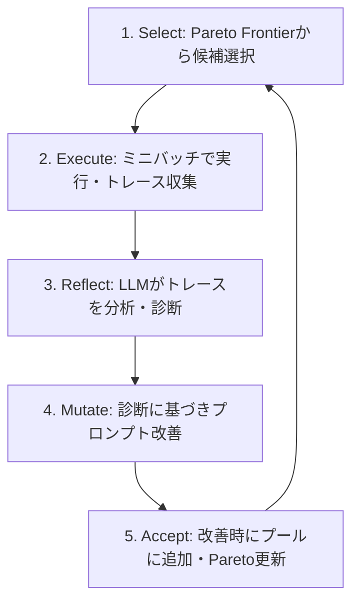

本記事は [GEPA: Reflective Prompt Evolution Can Outperform Reinforcement Learning](https://arxiv.org/abs/2507.19457)（arXiv:2507.19457、ICLR 2026 Oral採択）の解説記事です。

## 論文概要（Abstract）

GEPAは、LLMのプロンプト最適化において自然言語による反射（reflection）を導入したオプティマイザである。従来の強化学習（RL）ベースの手法がスカラー報酬からのポリシー勾配に依存するのに対し、GEPAはシステムの実行トレース（推論過程、ツール呼び出し、出力）をサンプリングし、自然言語で問題を診断・分析する。著者らは、言語の解釈可能な性質がスパースなスカラー報酬よりもはるかにリッチな学習媒体をLLMに提供すると主張している。実験結果では、GRPOを平均6%（最大20%）上回り、MIPROv2を10%以上上回る性能を示したと報告されている。

この記事は [Zenn記事: DSPy v3.2 Metric設計とOptimizer選定で実現するプロンプト自動最適化](https://zenn.dev/0h_n0/articles/1b83773e95e02c) の深掘りです。

## 情報源

- **arXiv ID**: 2507.19457
- **URL**: [https://arxiv.org/abs/2507.19457](https://arxiv.org/abs/2507.19457)
- **著者**: Lakshya A Agrawal, Shangyin Tan, Dilara Soylu, Noah Ziems, Rishi Khare, Krista Opsahl-Ong, Arnav Singhvi, Herumb Shandilya, Michael J Ryan, Meng Jiang, Christopher Potts, Koushik Sen, Alexandros G. Dimakis, Ion Stoica, Dan Klein, Matei Zaharia, Omar Khattab
- **所属**: Stanford University, UC Berkeley, University of Notre Dame, UT Austin 他
- **発表年**: 2025年7月（2026年2月改訂）
- **採択会議**: ICLR 2026（Oral発表）
- **カテゴリ**: cs.CL, cs.AI, cs.LG, cs.SE

## 背景と動機（Background & Motivation）

LLMのプロンプト最適化は、モデルの性能を引き出す上で重要な技術である。従来のアプローチは大きく2つに分類される。第一に、MIPROv2やDSPyのBootstrapFewShotWithRandomSearchなどのプロンプトチューニング手法は、few-shotの選択やプロンプト文面の組み合わせを探索する。第二に、GRPOやPPOなどのRL手法は、モデルの重み自体を報酬信号で更新する。

しかし、RL手法にはいくつかの本質的な制約がある。スカラー報酬はタスクの成否を0/1で表すに過ぎず、「なぜ失敗したか」の情報が失われる。また、安定した学習には大量のロールアウト（典型的には5,000〜25,000回以上）が必要であり、計算コストが高い。さらに、学習された改善がモデル重みに暗黙的にエンコードされるため、解釈可能性が低い。

GEPAは、この問題に対して言語空間での最適化という発想で取り組んでいる。「テキストはスカラーよりもリッチな勾配を提供できる」という仮説に基づき、実行トレースの自然言語分析を通じてプロンプトを進化させる。

## 主要な貢献（Key Contributions）

論文が示す主要な貢献は以下の4点である。

- **自然言語反射によるプロンプト進化**: 実行トレースをLLMが自然言語で分析し、失敗原因の診断と改善案の提案を行うメカニズムを提案
- **Pareto Frontier管理**: 異なるタスクサブセットで優れた候補を保持するPareto Frontier を維持し、多様な解の探索と早期収束の防止を実現
- **System-Aware Merge**: 異なる強みを持つPareto最適な候補を組み合わせ、相補的な知見を統合する手法を導入
- **Actionable Side Information (ASI)**: 評価関数からのスカラーではなく、エラーメッセージやプロファイリング情報などのテキスト診断情報を反射LLMに渡す仕組みを設計

## 技術的詳細（Technical Details）

### GEPAアルゴリズム

GEPAは5ステップの反復ループで動作する。



**Step 1: Select**

Pareto Frontierから候補 $c_i$ を選択する。Pareto Frontierとは、あるタスクサブセット $T_j \subseteq T$ において他のいかなる候補にも支配されない候補の集合である。候補 $c_a$ が候補 $c_b$ を支配する条件は以下のように定義される。

$$
c_a \succ c_b \iff \forall j: f(c_a, T_j) \geq f(c_b, T_j) \wedge \exists j: f(c_a, T_j) > f(c_b, T_j)
$$

ここで $f(c, T_j)$ は候補 $c$ のタスクサブセット $T_j$ における評価スコアである。

**Step 2: Execute**

選択された候補をミニバッチ $B \subset T$ 上で実行し、各サンプルについて完全な実行トレース $\tau = (r, t, o)$ を収集する。ここで $r$ は推論過程、$t$ はツール呼び出し、$o$ は出力である。

**Step 3: Reflect**

反射LLM $M_{\text{reflect}}$ が実行トレースとActionable Side Information（ASI）を読み取り、自然言語で失敗の診断レポート $d$ を生成する。

$$
d = M_{\text{reflect}}(\tau, \text{ASI}, c_i)
$$

ASIにはエラーメッセージ、実行時間、パース失敗箇所などの構造化された診断情報が含まれる。

**Step 4: Mutate**

診断レポート $d$ と蓄積された知見（過去のすべての反射結果）に基づき、改善された候補 $c_{i+1}$ を生成する。

**Step 5: Accept**

改善された候補がバリデーションセット上で既存候補を上回る場合、候補プールに追加し、Pareto Frontierを更新する。

### System-Aware Merge

GEPAの特徴的な機能として、Pareto Frontier上の2つの候補 $c_a$, $c_b$ を統合するSystem-Aware Mergeがある。$c_a$ がタスクサブセット $T_1$ で優れ、$c_b$ が $T_2$ で優れている場合、両者の強みを組み合わせた新たな候補 $c_{\text{merged}}$ を生成する。

### Actionable Side Information (ASI)

ASIは、従来のRL手法がスカラー報酬に情報を圧縮していたのに対し、テキスト空間での診断情報を反射LLMに提供する仕組みである。

```python
import gepa
from gepa import optimize_anything, GEPAConfig, EngineConfig

def evaluate(candidate: str) -> float:
    """候補プロンプトを評価し、ASIをログに記録する。

    Args:
        candidate: 評価対象のプロンプト文字列

    Returns:
        float: 0.0-1.0の評価スコア
    """
    result = run_my_system(candidate)
    # ASI: スカラーではなくテキスト診断情報を記録
    oa.log(f"パース失敗箇所: {result.parse_error}")
    oa.log(f"推論時間: {result.elapsed_ms}ms")
    oa.log(f"出力トークン数: {result.output_tokens}")
    return result.score
```

この仕組みにより、反射LLMは「何が失敗したか」だけでなく「なぜ失敗したか」を理解し、的を絞った改善を提案できる。

## 実装のポイント（Implementation Notes）

### DSPy統合

GEPAはDSPy v3.2以降のオプティマイザとして統合されている。既存のDSPyプログラムに対して、`dspy.GEPA` を使用することで透過的にプロンプト最適化を適用できる。

```python
import dspy
from dspy import GEPA

class QAModule(dspy.Module):
    """質問応答モジュール。"""

    def __init__(self) -> None:
        super().__init__()
        self.generate = dspy.ChainOfThought("question -> answer")

    def forward(self, question: str) -> dspy.Prediction:
        """質問に対する回答を生成する。

        Args:
            question: 入力質問文字列

        Returns:
            dspy.Prediction: 回答を含むPredictionオブジェクト
        """
        return self.generate(question=question)

# GEPAオプティマイザの設定
optimizer: GEPA = dspy.GEPA(
    metric=exact_match_metric,
    max_metric_calls=150,
    reflection_lm="openai/gpt-5",
)

# プログラム全体の最適化
optimized_program: dspy.Module = optimizer.compile(
    student=QAModule(),
    trainset=trainset,
    valset=valset,
)
```

### アダプタシステム

GEPAは汎用的なアダプタインターフェースを提供しており、DSPy以外のフレームワークでも利用可能である。

- **DefaultAdapter**: 単一ターンのLLMシステムプロンプト最適化
- **DSPyFullProgramAdapter**: DSPyプログラム全体（シグネチャ、モジュール、制御フロー）の進化
- **GenericRAGAdapter**: ベクトルストアに依存しないRAG最適化
- **MCPAdapter**: Model Context Protocol のツール記述最適化
- **LangChainAdapter**: LangChainパイプラインの最適化

### optimize_anything API

プロンプト以外のテキストアーティファクト（コード、設定ファイル、SVGなど）も最適化可能な`optimize_anything` APIが提供されている。評価関数と目的を指定するだけで、GEPAの反射ループが任意のテキストアーティファクトを進化させる。

## Production Deployment Guide

### AWS実装パターン（コスト最適化重視）

GEPAベースのプロンプト最適化サービスをAWSにデプロイする構成を示す。GEPAの特性として、反射ループの反復実行と複数候補の並列評価が計算の中心となるため、バッチ処理に適した構成が有利である。

| 規模 | 月間最適化ジョブ | 推奨構成 | 月額コスト | 主要サービス |
|------|--------------|---------|-----------|------------|
| **Small** | ~100 | Serverless | $80-250 | Lambda + Step Functions + Bedrock |
| **Medium** | ~1,000 | Hybrid | $500-1,500 | ECS Fargate + SQS + Bedrock |
| **Large** | 10,000+ | Container | $3,000-8,000 | EKS + Karpenter + Bedrock Batch |

**Small構成の詳細** (月額$80-250):
- **Step Functions**: GEPAの5ステップ反復ループの制御（Express Workflow） ($15/月)
- **Lambda**: 候補評価の並列実行（最大10並列） ($30/月)
- **Bedrock**: Claude 3.5 Haiku（タスク実行）+ Claude Sonnet 4（反射LLM） ($150/月)
- **DynamoDB**: Pareto Frontier候補管理・ASIログ保存 ($15/月)
- **S3**: 実行トレース・最適化結果の永続化 ($5/月)

**コスト試算の注意事項**: 上記は2026年7月時点のAWS ap-northeast-1料金に基づく概算値です。最新料金は[AWS料金計算ツール](https://calculator.aws/)で確認してください。

### Terraformインフラコード（Small Serverless構成）

```hcl
# --- Small Serverless: Step Functions + Lambda + Bedrock ---

resource "aws_sfn_state_machine" "gepa_optimizer" {
  name     = "gepa-prompt-optimizer"
  role_arn = aws_iam_role.sfn_role.arn
  type     = "EXPRESS"

  definition = jsonencode({
    StartAt = "InitializePool"
    States = {
      InitializePool = {
        Type     = "Task"
        Resource = aws_lambda_function.gepa_init.arn
        Next     = "OptimizationLoop"
      }
      OptimizationLoop = {
        Type = "Map"
        ItemsPath = "$.iterations"
        MaxConcurrency = 5
        Iterator = {
          StartAt = "SelectCandidate"
          States = {
            SelectCandidate = {
              Type     = "Task"
              Resource = aws_lambda_function.gepa_select.arn
              Next     = "EvaluateCandidate"
            }
            EvaluateCandidate = {
              Type     = "Task"
              Resource = aws_lambda_function.gepa_evaluate.arn
              Next     = "ReflectOnTrace"
            }
            ReflectOnTrace = {
              Type     = "Task"
              Resource = aws_lambda_function.gepa_reflect.arn
              Next     = "MutateAndAccept"
            }
            MutateAndAccept = {
              Type     = "Task"
              Resource = aws_lambda_function.gepa_mutate.arn
              End      = true
            }
          }
        }
        Next = "SelectBestCandidate"
      }
      SelectBestCandidate = {
        Type     = "Task"
        Resource = aws_lambda_function.gepa_select_best.arn
        End      = true
      }
    }
  })
}

resource "aws_lambda_function" "gepa_reflect" {
  filename      = "gepa_reflect.zip"
  function_name = "gepa-reflect"
  role          = aws_iam_role.lambda_role.arn
  handler       = "index.handler"
  runtime       = "python3.12"
  timeout       = 120
  memory_size   = 1024

  environment {
    variables = {
      REFLECTION_MODEL_ID = "anthropic.claude-sonnet-4-20250514-v1:0"
      TASK_MODEL_ID       = "anthropic.claude-3-5-haiku-20241022-v1:0"
      DYNAMODB_TABLE      = aws_dynamodb_table.gepa_candidates.name
    }
  }
}

resource "aws_dynamodb_table" "gepa_candidates" {
  name         = "gepa-pareto-candidates"
  billing_mode = "PAY_PER_REQUEST"
  hash_key     = "job_id"
  range_key    = "candidate_id"

  attribute {
    name = "job_id"
    type = "S"
  }

  attribute {
    name = "candidate_id"
    type = "S"
  }

  ttl {
    attribute_name = "expires_at"
    enabled        = true
  }
}
```

### 運用・監視設定

```python
import boto3

cloudwatch = boto3.client("cloudwatch", region_name="ap-northeast-1")

# GEPAの反射ループ所要時間の監視
cloudwatch.put_metric_alarm(
    AlarmName="gepa-reflection-latency-p99",
    ComparisonOperator="GreaterThanThreshold",
    EvaluationPeriods=2,
    MetricName="ReflectionLatency",
    Namespace="GEPA/Optimizer",
    Period=300,
    Statistic="p99",
    Threshold=60000,
    AlarmDescription="反射ループレイテンシP99が60秒超過",
    AlarmActions=["arn:aws:sns:ap-northeast-1:ACCOUNT:gepa-alerts"],
)

# Pareto Frontier候補数の監視
cloudwatch.put_metric_alarm(
    AlarmName="gepa-pareto-frontier-size",
    ComparisonOperator="GreaterThanThreshold",
    EvaluationPeriods=1,
    MetricName="ParetoFrontierSize",
    Namespace="GEPA/Optimizer",
    Period=3600,
    Statistic="Maximum",
    Threshold=50,
    AlarmDescription="Pareto Frontier候補数が50を超過（メモリ圧迫の可能性）",
)

# Bedrock APIコストの監視
cloudwatch.put_metric_alarm(
    AlarmName="gepa-bedrock-cost-anomaly",
    ComparisonOperator="GreaterThanThreshold",
    EvaluationPeriods=1,
    MetricName="EstimatedCharges",
    Namespace="AWS/Billing",
    Period=86400,
    Statistic="Maximum",
    Threshold=500,
    AlarmDescription="Bedrock日次コストが$500超過",
    Dimensions=[{"Name": "ServiceName", "Value": "AmazonBedrock"}],
)

```

### コスト最適化チェックリスト

- [ ] Step Functions: Standard → Express Workflow切替で低レイテンシ・低コスト
- [ ] Lambda: 反射ループのReserved Concurrencyを制限（Bedrock TPM超過防止）
- [ ] Lambda: ARM64（Graviton3）ランタイムで20%コスト削減
- [ ] Bedrock: 反射LLMにPrompt Caching適用（同一プレフィックスの再利用）
- [ ] Bedrock: タスク実行にClaude 3.5 Haiku（低コストモデル）を使用
- [ ] Bedrock Batch API: 非リアルタイムの大量候補評価で50%割引
- [ ] Bedrock: Cross-Region Inferenceでスループット向上
- [ ] DynamoDB: TTLでPareto候補の自動期限切れ
- [ ] DynamoDB: PAY_PER_REQUESTモードでアイドル時コストゼロ
- [ ] S3: 実行トレースにIntelligent-Tieringで自動階層化
- [ ] S3: 30日後にGlacier Instant Retrievalへ移行
- [ ] CloudWatch: ログ保持期間を30日に制限
- [ ] CloudWatch: Embedded Metricsでカスタムメトリクスコスト削減
- [ ] ECR: ライフサイクルポリシーで古いイメージ自動削除
- [ ] EKS: Karpenterでスポットインスタンス活用（最大70%削減）
- [ ] EKS: Pod Disruption Budgetでスポット中断時の安定性確保
- [ ] AWS Budgets: 月額予算設定とアラート通知
- [ ] Cost Anomaly Detection: 自動異常検知の有効化
- [ ] Savings Plans: Compute Savings Plans（1年）でFargate/Lambda 20-30%割引
- [ ] VPCエンドポイント: Bedrock/DynamoDB/S3へのPrivateLink（NAT Gateway料金削減）
- [ ] max_metric_calls: 過剰な評価回数を制限（100-500が推奨）

## 実験結果（Experimental Results）

### ベースラインとの比較

論文の実験結果から、GEPAと主要ベースラインの比較を示す。

| タスク | GEPA | GRPO | MIPROv2 | 改善幅 |
|--------|------|------|---------|--------|
| AIME 2025 (GPT-4.1 Mini) | 56.6% | 50.6% | 44.6% | +6.0% vs GRPO, +12.0% vs MIPROv2 |
| MATH (DSPy Full Program) | 93% | - | 67% | +26% vs MIPROv2 |
| ARC-AGI (Agent) | 89% | - | 32% | +57% vs baseline |
| Cloud Scheduling | 40.2%削減 | - | - | エキスパートヒューリスティクス超過 |
| Coding (Jinja) | 82% | - | 55% | +27% vs baseline |

著者らは、GEPAがGRPOに対して平均6%（最大20%）の精度向上を達成し、必要なロールアウト数は最大35分の1であったと報告している。具体的には、GEPAは100〜500回の評価で収束するのに対し、GRPOは5,000〜25,000回以上の評価を要する。

### 効率性の比較

| 指標 | GEPA | GRPO | 比率 |
|------|------|------|------|
| 必要評価回数 | 100-500 | 5,000-25,000+ | 最大35x効率的 |
| コスト（同等性能） | 1x | 最大90x | 最大90x安価 |

著者らは、オープンソースモデル + GEPAの組み合わせがClaude Opus単体の性能を上回るケースがあることを報告しており、モデルコストの90倍削減が可能であると述べている。

### DSPyプログラム全体の最適化

GEPAの特筆すべき結果として、DSPyプログラム全体（シグネチャ、モジュール構成、制御フロー）の進化がある。従来のDSPyオプティマイザがプロンプトテキストのみを最適化していたのに対し、GEPAはプログラムの構造自体を進化させることが可能である。MATHベンチマークにおいて、67%から93%への精度向上が報告されている。

## 実運用への応用（Practical Applications）

GEPAの実運用における主要な適用領域は以下の通りである。

**プロンプトエンジニアリングの自動化**: 手動でのプロンプト調整を自動化し、100-500回の評価で高品質なプロンプトを生成できる。Zenn記事で解説されているDSPy v3.2のMetric設計と組み合わせることで、メトリクス定義から最適プロンプト生成までの一貫したパイプラインが構築可能である。

**RAGシステムの最適化**: GenericRAGAdapterを通じて、検索クエリ生成プロンプト、リランキング基準、回答生成プロンプトを一括で最適化できる。

**エージェントアーキテクチャの探索**: ARC-AGIでの32%から89%への精度向上が示すように、GEPAはエージェントの行動パターン、ツール選択戦略、推論構造の最適化にも有効である。

**MCPツール記述の最適化**: MCPAdapterにより、Model Context Protocolのツール記述文をGEPAで最適化し、LLMのツール選択精度を向上させることが可能である。

運用上の注意点として、反射LLMには高い言語理解能力が求められるため、タスク実行LLMよりも高性能なモデル（例: タスクにClaude 3.5 Haiku、反射にClaude Sonnet 4）を使用することが推奨される。

## 関連研究（Related Work）

- **MIPROv2** (Opsahl-Ong et al., 2024): DSPyのプロンプト最適化手法。ベイズ最適化によるfew-shot選択とプロンプト生成を行う。GEPAはMIPROv2を10%以上上回る性能を示している
- **GRPO** (Shao et al., 2024): Group Relative Policy Optimizationによる強化学習ベースの最適化。DeepSeek-R1の訓練にも使用された手法であり、GEPAはGRPOの35分の1のロールアウトで同等以上の性能を達成している
- **TextGrad** (Yuksekgonul et al., 2024): テキスト空間での勾配を用いたプロンプト最適化。GEPAと同様にテキストベースの最適化を行うが、GEPAはPareto Frontierの管理とSystem-Aware Mergeにより多目的最適化に対応している点が異なる
- **DSPy** (Khattab et al., 2023): 宣言的なLLMプログラミングフレームワーク。GEPAはDSPyのオプティマイザとして統合されており、DSPyプログラム全体の構造進化を可能にしている

## まとめと今後の展望

GEPAは、自然言語による反射をプロンプト最適化に導入し、RL手法と比較して高い性能と効率性を両立させた手法である。スカラー報酬に依存しないテキスト空間での最適化アプローチは、LLMの言語理解能力を最大限に活用するものであり、ICLR 2026でのOral採択はその新規性と有効性を裏付けている。Zenn記事で解説されているDSPy v3.2のオプティマイザ選定において、GEPAはMIPROv2の上位互換として位置づけられ、特にエージェントやRAGなどの複雑なシステムの最適化に適している。

## 参考文献

- **arXiv**: [https://arxiv.org/abs/2507.19457](https://arxiv.org/abs/2507.19457)
- **Code**: [https://github.com/gepa-ai/gepa](https://github.com/gepa-ai/gepa)
- **Related Zenn article**: [https://zenn.dev/0h_n0/articles/1b83773e95e02c](https://zenn.dev/0h_n0/articles/1b83773e95e02c)
- **ICLR 2026**: Oral presentation
