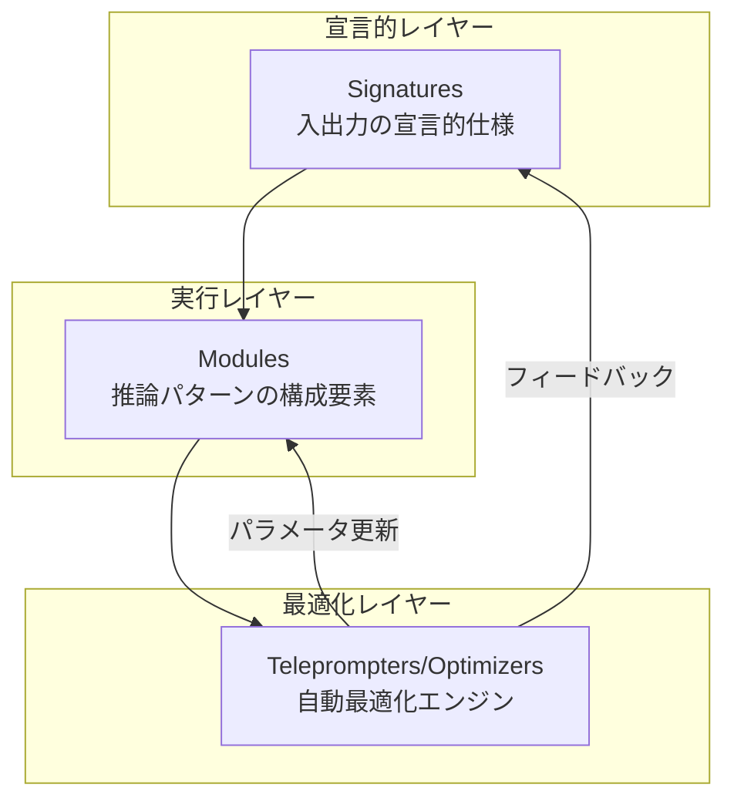
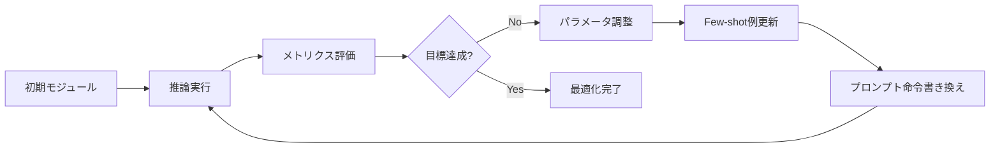

本記事は [Optimizing LLM Prompt Engineering with DSPy Based Declarative Learning](https://arxiv.org/abs/2604.04869) (Ruksana et al., 2026) の解説記事です。手動プロンプトエンジニアリングの限界を克服するために、DSPyフレームワークを用いた宣言的学習アプローチを提案し、記号的計画・勾配フリー最適化・自動モジュール書き換えの統合によって事実精度30-45%向上とハルシネーション率約25%削減を報告した研究を紹介します。

この記事は [Zenn記事: DSPy v3.2 Metric設計とOptimizer選定で実現するプロンプト自動最適化](https://zenn.dev/0h_n0/articles/1b83773e95e02c) の深掘りです。Zenn記事ではDSPy v3.2のMetric設計とOptimizer選定の実装面を扱いましたが、本記事ではDSPyの宣言的学習が従来のプロンプトエンジニアリングに対してなぜ有効なのかという理論的・実験的根拠を、この論文を通して掘り下げます。

## 情報源

| 項目 | 内容 |
|------|------|
| タイトル | Optimizing LLM Prompt Engineering with DSPy Based Declarative Learning |
| 著者 | Shiek Ruksana, Sailesh Kiran Kurra, Thipparthi Sanjay Baradwaj |
| arXiv ID | [2604.04869](https://arxiv.org/abs/2604.04869) |
| 提出日 | 2026年4月6日 |
| 発表会議 | IEEE International Conference on Emerging Smart Computing and Informatics (ESCI) 2026, Pune, India |
| 受賞 | **Best Paper Award** |
| 分野 | cs.CL (Computation and Language), cs.AI (Artificial Intelligence) |

## 背景と動機

LLMの実用化が進む中、プロンプトエンジニアリングは依然として大きな課題を抱えている。従来のプロンプト設計は試行錯誤の手動プロセスに依存しており、以下の問題が指摘されている。

**手動プロンプト設計の限界**として、著者らは3点を挙げている。第一に、モデルやタスクが変わるたびにプロンプトを一から調整する必要があり、スケーラビリティに欠ける。第二に、Few-shotの例示選択やChain-of-Thought（CoT）のステップ設計が人間の直感に依存しており、再現性が低い。第三に、プロンプトの微小な変更がモデル出力に予測困難な影響を与える脆弱性がある。

これらの問題に対し、著者らはDSPyの宣言的学習パラダイムに着目している。DSPyはStanford NLPグループが開発したフレームワークであり、プロンプトの構築を「何を達成したいか」（宣言的仕様）と「どう達成するか」（最適化プロセス）に分離する。この分離により、プロンプトの構造を自動的に最適化でき、人手によるチューニングを大幅に削減できると著者らは主張している。

## 主要な貢献

著者らは本論文において以下の貢献を報告している。

- **記号的計画・勾配フリー最適化・自動モジュール書き換えの統合アーキテクチャの提案**: DSPyの3つの中核要素を統一的な枠組みとして分析し、それぞれがプロンプト最適化においてどのような役割を果たすかを体系化した
- **事実精度30-45%向上の実証**: MMLU、DROP、HotpotQA、GSM8K等の複数ベンチマークにおいて、手動プロンプトエンジニアリングと比較して大幅な精度向上を確認した
- **ハルシネーション率約25%削減**: RAGタスクおよびCoTベンチマークにおいて、事実に基づかない生成の頻度を定量的に低減させた
- **クロスモデル汎化性の検証**: GPT-3.5-turbo、GPT-4等の異なるLLMに対してDSPyの最適化効果が一貫して得られることを示した

## 技術的詳細

### DSPyアーキテクチャ概要

DSPyの宣言的学習アーキテクチャは、3つの抽象化レイヤーで構成される。



**Signatures（署名）** は、タスクの入出力を型付きの宣言として定義する。従来のプロンプトテンプレートと異なり、Signatureは「何を入力し、何を出力するか」のみを記述し、具体的なプロンプト文面は最適化プロセスに委ねる。

```python
import dspy

class FactualQA(dspy.Signature):
    """Answer questions with factual accuracy, citing sources."""
    context: str = dspy.InputField(desc="Retrieved documents for grounding")
    question: str = dspy.InputField(desc="User question to answer")
    reasoning: str = dspy.OutputField(desc="Step-by-step reasoning process")
    answer: str = dspy.OutputField(desc="Factual answer with citations")
```

**Modules（モジュール）** は、Signatureを実行する推論パターンの構成要素である。DSPyは `ChainOfThought`、`MultiChainComparison`、`ProgramOfThought` 等の標準モジュールを提供している。各モジュールは合成可能（composable）であり、複雑なパイプラインを構築できる。

**Teleprompters/Optimizers** は、Signatureとモジュールのパラメータを自動調整する最適化エンジンである。著者らは特にMIPROとBootstrapFewShotに焦点を当てて分析している。

### 記号的計画（Symbolic Planning）

記号的計画は、LLMの推論プロセスを構造化された計画として表現する手法である。著者らは、DSPyにおける記号的計画の役割を以下のように整理している。

DSPyのモジュール合成では、複数の推論ステップを明示的なデータフローグラフとして定義する。例えば、RAGパイプラインは「検索→文脈選択→推論→回答生成」という記号的な計画として表現される。

```python
class RAGPipeline(dspy.Module):
    """Retrieval-Augmented Generation with symbolic planning."""

    def __init__(self, num_passages: int = 3):
        super().__init__()
        self.retrieve = dspy.Retrieve(k=num_passages)
        self.generate = dspy.ChainOfThought(FactualQA)

    def forward(self, question: str) -> dspy.Prediction:
        # Step 1: Retrieve relevant passages
        passages = self.retrieve(question).passages
        context = "\n".join(passages)
        # Step 2: Generate answer with chain-of-thought
        prediction = self.generate(context=context, question=question)
        return prediction
```

この構造化により、各ステップの入出力が型安全に管理され、最適化対象のパラメータ（Few-shot例、プロンプト命令文等）が明確に分離される。著者らは、この記号的計画がハルシネーション削減に寄与する理由として、中間推論ステップの明示化により事実に基づかない飛躍を検出・制御しやすくなる点を挙げている。

### 勾配フリー最適化（Gradient-Free Optimization）

DSPyの最適化は、LLMに対する勾配計算を必要としない。これはLLMがブラックボックスAPIとして提供されることが多い実用環境において重要な特性である。

著者らが分析した主要な最適化手法は以下の通りである。

**MIPRO（Multi-prompt Instruction Proposal Optimizer）** は、候補プロンプトを生成し、検証メトリクスに基づいて高性能な変種を選択する探索戦略を用いる。最適化の目的関数は以下のように定式化される。

$$
\theta^* = \arg\max_{\theta \in \Theta} \frac{1}{|D_{\text{val}}|} \sum_{(x, y) \in D_{\text{val}}} M(f_\theta(x), y)
$$

ここで、
- $\theta$: プロンプトパラメータ（命令文、Few-shot例の集合）
- $\Theta$: 探索空間
- $D_{\text{val}}$: 検証データセット
- $M$: タスク固有のメトリクス（精度、F1等）
- $f_\theta(x)$: パラメータ $\theta$ によるLLMの出力

MIPROは勾配を使わず、候補生成→評価→選択のサイクルを反復することで $\theta^*$ を近似する。著者らによると、50-200件程度の検証データで効果的な最適化が可能であると報告されている。

**BootstrapFewShot** は、LLMの成功した出力を自動収集し、Few-shot例として再利用する手法である。訓練時にLLMが正解を出力したケースを蓄積し、後続の推論における文脈例として注入する。これにより、人手でFew-shot例を選定する必要がなくなる。

### 自動モジュール書き換え（Automated Module Rewriting）

自動モジュール書き換えは、DSPyの最も特徴的な機能の一つである。最適化ループの中で、モジュールの実装自体が性能フィードバックに基づいて自動的に調整される。



具体的な書き換え対象は以下の3つである。

1. **プロンプト命令文**: タスク記述や制約条件の文面を、検証性能に基づいて自動更新する
2. **Few-shot例**: BootstrapFewShotで収集した成功例から、最も効果的な組み合わせを選択する
3. **モジュール構造**: ChainOfThoughtのステップ数やRetrieveのパラメータ $k$ 等を調整する

著者らは、この自動書き換え機構により、従来の手動プロンプトエンジニアリングの試行錯誤サイクルを体系的な最適化プロセスに置き換えられると述べている。

## 実装のポイント

DSPyを用いた宣言的プロンプト最適化を実装する際の要点を、著者らの知見と一般的なベストプラクティスに基づいて整理する。

**検証データセットの設計**: 最適化の品質は検証データセットに大きく依存する。著者らの実験では50-200件程度の検証データで効果的な最適化が得られているが、タスクの多様性をカバーすることが重要である。エッジケースやドメイン固有の入力を含めることで、過学習を防止できる。

**メトリクスの選択**: DSPyのOptimizerはメトリクス関数を入力として受け取る。タスクの目的に直結するメトリクスを定義することが不可欠である。例えば、RAGタスクでは単純な文字列一致ではなく、事実の包含関係を評価するメトリクスが推奨される。

```python
def factual_accuracy_metric(
    example: dspy.Example,
    prediction: dspy.Prediction,
    trace: list | None = None,
) -> float:
    """Evaluate factual accuracy with source grounding.

    Args:
        example: Ground truth example with expected answer
        prediction: Model prediction to evaluate
        trace: Optional execution trace for debugging

    Returns:
        Score between 0.0 and 1.0
    """
    # Check answer correctness
    correct = dspy.evaluate.answer_exact_match(example, prediction)
    # Check if reasoning references source material
    grounded = any(
        source in prediction.reasoning
        for source in example.sources
    )
    return 0.7 * float(correct) + 0.3 * float(grounded)
```

**Optimizer選択の指針**: 著者らの分析に基づくと、MIPROは大規模な探索空間と十分な検証データがある場合に適しており、BootstrapFewShotは検証データが限られている場合や迅速な最適化が求められる場合に有効である。

**ハルシネーション対策**: 著者らが報告した約25%のハルシネーション削減は、ChainOfThoughtモジュールによる中間推論の明示化と、検証メトリクスにおける事実性チェックの組み合わせによるものである。実装時には、Retrieverから取得した文脈と推論ステップの整合性を検証するメトリクスを組み込むことが推奨される。

## Production Deployment Guide

### AWS実装パターン（コスト最適化重視）

DSPyの宣言的最適化サービスをAWS上にデプロイする場合の推奨構成を、トラフィック量別に示す。以下のコスト試算は2026年7月時点のAWS ap-northeast-1（東京）リージョン料金に基づく概算値であり、実際のコストはトラフィックパターン、リージョン、バースト使用量により変動する。

| 構成 | トラフィック | AWSサービス | 月額概算 |
|------|-------------|------------|---------|
| Small | ~100 req/日 | Lambda + Bedrock + DynamoDB | $50-150 |
| Medium | ~1,000 req/日 | ECS Fargate + Bedrock + ElastiCache | $300-800 |
| Large | 10,000+ req/日 | EKS + Karpenter + Spot Instances | $2,000-5,000 |

**Small構成の内訳**: Lambda (128MB, ~3000 invocations/月: ~$1) + Bedrock Claude Sonnet (~3000 calls: $30-80) + DynamoDB On-Demand (最適化結果キャッシュ: $5-15) + S3 (ログ: $1-3) + CloudWatch ($5-10)。DSPyの最適化済みプロンプトをDynamoDBにキャッシュし、推論時はキャッシュされたパラメータを使ってBedrockを呼び出す。

**Large構成の内訳**: EKS Control Plane ($73) + EC2 Spot (c5.2xlarge x 2-4: $200-600) + Bedrock ($1,500-3,500) + ElastiCache Redis (cache.r6g.large: $150-200) + ALB ($50-80)。Karpenterによる自動スケーリングでSpot Instancesを優先利用する。

**コスト削減テクニック**:
- Spot Instances活用でEC2コストを最大90%削減
- Reserved Instances（1年コミット）でベースライン分を最大72%削減
- Bedrock Batch API使用でLLM推論コストを50%削減
- DSPy最適化結果のキャッシュで同一パイプラインの再最適化コストを削減
- Prompt Caching有効化で30-90%のトークンコスト削減

### Terraformインフラコード

**Small構成（Serverless）** -- Lambda + Bedrock + DynamoDB:

```hcl
# DynamoDB for caching optimized prompts
resource "aws_dynamodb_table" "dspy_cache" {
  name         = "dspy-optimized-prompts"
  billing_mode = "PAY_PER_REQUEST"
  hash_key     = "pipeline_id"
  range_key    = "version"
  attribute { name = "pipeline_id"; type = "S" }
  attribute { name = "version";     type = "N" }
  ttl { attribute_name = "expires_at"; enabled = true }
  server_side_encryption { enabled = true }
}

# Lambda (least privilege IAM: bedrock:InvokeModel, dynamodb:GetItem/PutItem/Query)
resource "aws_lambda_function" "dspy_inference" {
  function_name = "dspy-inference"
  runtime       = "python3.12"
  handler       = "handler.lambda_handler"
  role          = aws_iam_role.lambda_role.arn
  timeout       = 120
  memory_size   = 512
  filename      = "lambda_package.zip"
  environment {
    variables = {
      CACHE_TABLE      = aws_dynamodb_table.dspy_cache.name
      BEDROCK_MODEL_ID = "anthropic.claude-3-5-sonnet-20241022-v2:0"
    }
  }
  tracing_config { mode = "Active" }
}
```

**Large構成（Container）** -- EKS + Spot Instances:

```hcl
module "eks" {
  source  = "terraform-aws-modules/eks/aws"
  version = "~> 20.24"
  cluster_name    = "dspy-optimization"
  cluster_version = "1.31"
  vpc_id     = module.vpc.vpc_id
  subnet_ids = module.vpc.private_subnets
  cluster_endpoint_public_access = false
  eks_managed_node_groups = {
    spot = {
      instance_types = ["c5.2xlarge", "c5a.2xlarge", "c6i.2xlarge"]
      capacity_type  = "SPOT"
      min_size = 1; max_size = 8; desired_size = 2
    }
  }
}

resource "aws_budgets_budget" "dspy_monthly" {
  name         = "dspy-monthly-budget"
  budget_type  = "COST"
  limit_amount = "5000"
  limit_unit   = "USD"
  time_unit    = "MONTHLY"
  notification {
    comparison_operator        = "GREATER_THAN"
    threshold                  = 80
    threshold_type             = "PERCENTAGE"
    notification_type          = "ACTUAL"
    subscriber_email_addresses = ["alert@example.com"]
  }
}
```

### 運用・監視設定

**CloudWatch Logs Insights クエリ**（DSPy最適化パイプライン監視）:

```
# コスト異常検知: 1時間あたりのトークン使用量
fields @timestamp, @message
| filter @message like /token_count/
| stats sum(input_tokens) as total_input, sum(output_tokens) as total_output by bin(1h)
| filter total_input > 100000

# レイテンシ分析: DSPy推論のP95/P99
fields @timestamp, duration_ms
| filter event = "dspy_inference"
| stats percentile(duration_ms, 95) as p95, percentile(duration_ms, 99) as p99 by bin(5m)
```

**CloudWatch アラーム**: Bedrockトークン使用量スパイク検知（InputTokenCount > 100,000/h）、Lambda実行時間異常（Duration > 60s）をSNSで通知。

**X-Ray トレーシング**: `aws_xray_sdk` の `patch_all()` でboto3を自動計装し、`pipeline_id` をアノテーション、`validation_size` をメタデータとして記録。

**Cost Explorer自動レポート**: 日次でBedrock/Lambda/EKSコストを取得し、$100/日超過でSNS通知。Projectタグでフィルタリングする。

### コスト最適化チェックリスト

**アーキテクチャ選択**:
- [ ] トラフィック量に応じた構成選択（~100 req/日: Serverless、~1000: Hybrid、10000+: Container）
- [ ] DSPy最適化はバッチ処理（Lambda/Batch）、推論はオンライン処理として分離

**リソース最適化**:
- [ ] EC2: Spot Instances優先（c5/c6iファミリー）
- [ ] Reserved Instances: ベースライン分を1年コミット
- [ ] Savings Plans: Compute Savings Plans検討
- [ ] Lambda: メモリサイズをPower Tuningで最適化（512MB推奨）
- [ ] ECS/EKS: 夜間・休日のスケールダウン設定

**LLMコスト削減**:
- [ ] Bedrock Batch API: 非リアルタイム最適化ジョブに使用（50%削減）
- [ ] Prompt Caching有効化: 同一コンテキストの再利用（30-90%削減）
- [ ] モデル選択ロジック: 簡易タスクにはHaiku、複雑タスクにはSonnetを動的選択
- [ ] トークン数制限: max_tokensを用途に応じて設定
- [ ] DSPy最適化結果キャッシュ: DynamoDBに保存し再最適化頻度を削減

**監視・アラート**:
- [ ] AWS Budgets: 月額上限設定（80%/100%で通知）
- [ ] CloudWatch アラーム: トークン使用量スパイク検知
- [ ] Cost Anomaly Detection: 有効化
- [ ] 日次コストレポート: Cost Explorer APIで自動取得

**リソース管理**:
- [ ] 未使用リソース削除: 不要なLambdaバージョン/ECSタスク定義
- [ ] タグ戦略: Project/Environment/Owner必須
- [ ] ライフサイクルポリシー: S3ログの自動アーカイブ（30日→Glacier）
- [ ] 開発環境: 夜間自動停止（EventBridge Scheduler）

## 実験結果

著者らは、MMLU、DROP、HotpotQA、GSM8K、IIRC等の複数ベンチマークにおいてDSPyベースの最適化を評価している。

**事実精度の向上**: 著者らは、手動プロンプトエンジニアリングのベースラインと比較して30-45%の事実精度向上を報告している。この改善は、推論タスク（GSM8K等）、検索拡張生成（RAG）タスク（HotpotQA、IIRC等）、およびCoTベンチマーク（DROP等）にわたって一貫して観測されている。

**ハルシネーション率の削減**: RAGおよびCoTベンチマークにおいて、約25%のハルシネーション率削減が報告されている。著者らは、この削減がChainOfThoughtモジュールによる中間推論の明示化と、最適化メトリクスにおける事実性チェックの組み合わせによるものであると分析している。

**教師あり微調整との比較**: 著者らによると、DSPyの勾配フリー最適化は教師あり微調整（Supervised Fine-Tuning）と同等またはそれ以上の性能を、大幅に少ないデータとコストで達成している。特に、50-200件程度の検証データで効果的な最適化が可能である点が強調されている。

**クロスモデル汎化**: GPT-3.5-turbo、GPT-4等の異なるLLMに対して最適化効果が一貫して得られることが確認されている。これは、DSPyの宣言的仕様がモデル固有のプロンプト形式から独立しているためであると著者らは説明している。

## 実運用への応用

DSPyの宣言的学習アプローチは、以下の実運用シナリオにおいて特に有効であると考えられる。

**RAGパイプラインの品質向上**: 検索結果の品質にばらつきがある環境では、DSPyのBootstrapFewShotにより成功パターンを自動蓄積し、推論の安定性を向上させることが期待される。著者らが報告した約25%のハルシネーション削減は、事実に基づく回答が求められるカスタマーサポートやFAQシステムにおいて実用的な改善幅である。

**マルチタスク最適化**: 同一のLLMを複数のタスク（分類、要約、質問応答等）に使用するプロダクション環境では、タスクごとに個別のSignatureとModuleを定義し、共通のOptimizerで最適化することで、プロンプト管理の複雑さを大幅に削減できる。

**コスト効率の改善**: DSPyの最適化により、より少ないトークン数でより高い精度を達成できるため、LLM APIの呼び出しコスト削減につながる。特に、大規模なバッチ処理やリアルタイム推論において、プロンプトの効率化は直接的なコスト削減に寄与する。

**モデル移行の容易化**: 宣言的仕様がモデル固有のプロンプト形式から独立しているため、基盤モデルの変更時にプロンプトの全面書き換えが不要となる。新しいモデルに対して再最適化を実行するだけで、性能を維持できる可能性がある。

## 関連研究

- **DSPy (Khattab et al., 2023)**: 本論文が基盤とするフレームワーク。宣言的なプログラミングモデルでLLMパイプラインを構築し、自動最適化を可能にした。本論文は、DSPyの最適化効果を体系的に評価し、特にハルシネーション削減の観点から分析を加えている。
- **APE (Zhou et al., 2023)**: Automatic Prompt Engineer。LLMを使ってプロンプト候補を自動生成し、評価するアプローチ。DSPyはAPEの発想をモジュール合成と勾配フリー最適化に拡張した位置づけにある。
- **OPRO (Yang et al., 2024)**: Optimization by PROmpting。LLM自体を最適化器として使用し、プロンプトを反復改善するメタ最適化手法。DSPyのMIPROは類似のアイデアをより構造化された形で実装している。

## まとめと今後の展望

本論文は、DSPyの宣言的学習アプローチが手動プロンプトエンジニアリングに対して体系的な優位性を持つことを実験的に示した。事実精度30-45%向上、ハルシネーション率約25%削減という結果は、LLMの実用化におけるプロンプト最適化の重要性を裏付けている。IEEE ESCI 2026 Best Paper Awardの受賞は、この研究の貢献が学術コミュニティにおいても高く評価されていることを示している。

今後の課題として、著者らはタスク固有の検証データセットへの依存、限られた訓練データでの性能安定化、大規模探索空間における計算コスト、およびLLMバージョン間の汎化性を挙げている。DSPyの宣言的パラダイムが今後さらに発展し、プロンプトエンジニアリングの自動化が標準的なプラクティスとなることが期待される。

## 参考文献

- **arXiv**: [https://arxiv.org/abs/2604.04869](https://arxiv.org/abs/2604.04869)
- **Conference**: IEEE ESCI 2026, Pune, India (March 11-13, 2026) - Best Paper Award
- **DSPy Framework**: [https://github.com/stanfordnlp/dspy](https://github.com/stanfordnlp/dspy)
- **Related Zenn article**: [https://zenn.dev/0h_n0/articles/1b83773e95e02c](https://zenn.dev/0h_n0/articles/1b83773e95e02c)
