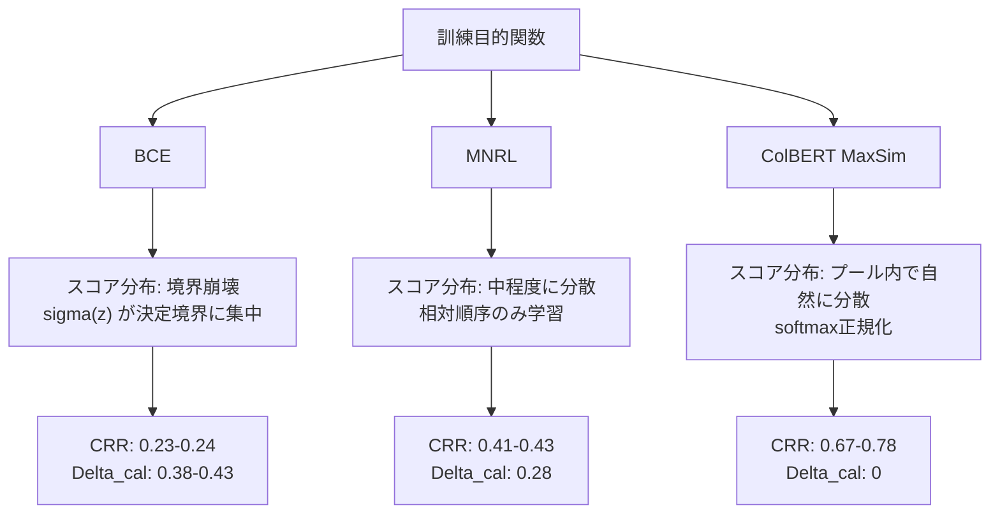

本記事は [Closing the Calibration Gap in Semantic Caching](https://arxiv.org/abs/2606.19719) (Baral et al., 2026) の解説記事です。セマンティックキャッシュにおいてオフライン評価指標（PR-AUC）が高いモデルが実運用で最悪の性能を示す現象を定量化し、その原因が訓練目的関数にあることを実験的に示した研究の内容を紹介します。

この記事は [Zenn記事: セマンティックキャッシュの類似度閾値チューニングとベクトルDB別性能比較](https://zenn.dev/0h_n0/articles/1707bd6149514c) の深掘りです。Zenn記事で扱った類似度閾値の設定指針に対して、閾値ベースの二値判定がそもそもなぜ難しいのかという根本的な問題を、キャリブレーションの観点から明らかにした研究を紹介します。

## 情報源

| 項目 | 内容 |
|------|------|
| タイトル | Closing the Calibration Gap in Semantic Caching |
| 著者 | Aditeya Baral, Radoslav Ralev, Iliya Sotirov Zhechev, Srijith Rajamohan, Jen Agarwal |
| arXiv ID | [2606.19719](https://arxiv.org/abs/2606.19719) |
| 提出日 | 2026年6月18日 |
| 分野 | cs.IR (Information Retrieval), cs.CL (Computation and Language), cs.LG (Machine Learning) |
| ライセンス | CC BY 4.0 |

## 背景と動機

セマンティックキャッシュは、LLMの推論コストを削減する手法として注目されている。ユーザクエリを密なエンベディングに変換し、キャッシュ済みのクエリとのコサイン類似度が閾値 $\tau$ を超えた場合に、LLMを呼び出さずにキャッシュされた応答を返す仕組みである。

この分野では、モデルの評価にPR-AUC（Precision-Recall Area Under Curve）が標準的に使われてきた。PR-AUCはスコアのランキング品質を測定する指標であり、閾値に依存しない。しかし著者らは、実際のデプロイメントでは「スコアが閾値 $\tau$ を超えるかどうか」という二値判定が必要になる点に着目している。

この乖離が引き起こす実害は深刻である。著者らは、PR-AUCが最も高いモデルが実運用時に最悪のパフォーマンスを示すケースを報告している。具体的には、BCE（Binary Cross-Entropy）で訓練されたリランカーはPR-AUCで0.816を記録しながら、デプロイメント指標であるP-CHR AUCでは0.199にとどまり、オフライン品質の24%しか保持できないことが示されている。

この問題は、モデルのスコアが「キャリブレーション」されていないことに起因する。スコアが真のマッチ確率を反映していなければ、どの閾値を選んでも精度と利用率のトレードオフが崩壊する。著者らはこのギャップを定量化する新しい指標を提案し、原因を訓練目的関数に帰着させている。

## 主要な貢献

著者らは本論文において以下の3つの貢献を報告している。

- **P-CHR AUCとCRRの提案**: キャッシュの利用率（Cache Hit Ratio）に沿って精度を測定するP-CHR AUCと、オフライン品質のうちデプロイメントで保持される割合を示すCRR（Calibration Retention Rate）を導入した。これにより、閾値ベースの運用における性能を直接評価できる。
- **Operational Gapの分解**: オフライン評価とデプロイメント性能の差を、データセットの正例率で決まる不可避な構造的ギャップ（Structural Gap）と、キャリブレーションにより回復可能なギャップ（Calibration Gap）に分解する理論的枠組みを提示した。
- **訓練目的関数がキャリブレーションを支配するという実証**: 9つのbi-encoderリトリーバーと10のクロスエンコーダリランカーを用いた大規模実験により、データ規模の38倍増加がキャリブレーションを改善しない一方、訓練目的関数（BCE vs MNRL vs ColBERT）がキャリブレーションギャップを決定的に左右することを示した。

## 技術的詳細

### Cache Hit Ratio (CHR)

まず、キャッシュの利用率を定義する。閾値 $\tau$ を設定したとき、全 $N$ クエリのうちキャッシュヒットとなるクエリの割合が CHR である。

$$
\text{CHR}(\tau) = \frac{|\{q : \hat{s}(q) \geq \tau\}|}{N}
$$

ここで $\hat{s}(q)$ はクエリ $q$ に対するモデルの最大類似度スコアである。$\tau$ を下げれば多くのクエリがキャッシュヒットするが、誤った応答を返すリスクが増加する。$\tau$ を上げれば精度は高まるが、キャッシュの利用率は下がる。

### P-CHR AUC

著者らが提案する P-CHR AUC は、PR-AUC がリコールに沿って精度を積分するのと同様に、CHR に沿って精度を積分する指標である。

$$
\text{P-CHR AUC} = \int_0^1 \text{Precision}(\text{CHR}^{-1}(c)) \, dc
$$

ここで $\text{CHR}^{-1}(c)$ は CHR が $c$ となる閾値 $\tau$ を返す逆関数である。この指標は、デプロイメント時の「精度 vs 利用率」トレードオフを直接捕捉する。PR-AUC がランキングの品質を測定するのに対し、P-CHR AUC は閾値ベースの二値判定における品質を測定する。

### Calibration Retention Rate (CRR)

CRR は、オフラインのランキング品質（PR-AUC）のうち、デプロイメントで実際に保持される割合を定量化する。

$$
\text{CRR} = \frac{\text{P-CHR AUC}}{\text{PR-AUC}} \in (0, 1]
$$

CRR = 1.0 はオフライン品質が完全に保持されることを意味し、低い CRR は閾値ベースの運用でランキング品質が大幅に損なわれることを示す。

### Operational Gap の分解

オフライン評価とデプロイメント性能の総合的な差を Operational Gap $\Delta_{op}$ と定義する。

$$
\Delta_{op} = \text{PR-AUC} - \text{P-CHR AUC}
$$

著者らはこのギャップを2つの成分に分解している。

**Structural Gap（構造的ギャップ）**: データセットの正例率 $p$ のみで決まる不可避な成分である。

$$
\Delta_{str} = 1 - p(1 - \ln p)
$$

LangCache SentencePairs v3 の正例率 $p = 0.45$ の場合、$\Delta_{str} \approx 0.191$ となる。これは完全にキャリブレーションされたモデルであっても存在するギャップであり、PR-AUC と P-CHR AUC の定義の違いから生じる構造的な差である。

**Calibration Gap（キャリブレーションギャップ）**: モデルのスコアが真のマッチ確率を反映していないことに起因する回復可能な成分である。

$$
\Delta_{cal} = \max(0, \Delta_{op} - \Delta_{str})
$$

$\Delta_{cal} = 0$ は、モデルが完全にキャリブレーションされており、Operational Gap が構造的成分のみで説明できることを意味する。$\Delta_{cal}$ が大きいほど、モデルのスコア分布がデプロイメントに適していないことを示す。

## アルゴリズムと実装

以下は、P-CHR AUC と CRR を計算するPython実装例である。

```python
import numpy as np
from sklearn.metrics import precision_recall_curve, auc


def compute_chr(
    scores: np.ndarray,
    thresholds: np.ndarray,
) -> np.ndarray:
    """閾値ごとのCache Hit Ratio (CHR)を計算する.

    Args:
        scores: 各クエリの最大類似度スコア. shape: (N,)
        thresholds: 評価する閾値の配列. shape: (T,)

    Returns:
        各閾値に対するCHR値. shape: (T,)
    """
    n = len(scores)
    return np.array([np.sum(scores >= tau) / n for tau in thresholds])


def compute_precision_at_threshold(
    scores: np.ndarray,
    labels: np.ndarray,
    tau: float,
) -> float:
    """指定閾値でのPrecisionを計算する.

    Args:
        scores: 各クエリの最大類似度スコア. shape: (N,)
        labels: 正解ラベル (1=正例, 0=負例). shape: (N,)
        tau: 判定閾値.

    Returns:
        閾値tau以上のスコアに対するPrecision.
    """
    mask = scores >= tau
    if mask.sum() == 0:
        return 1.0  # ヒットなしの場合、慣例的に1.0
    return labels[mask].sum() / mask.sum()


def compute_pchr_auc(
    scores: np.ndarray,
    labels: np.ndarray,
    n_thresholds: int = 101,
) -> float:
    """P-CHR AUCを計算する.

    CHR(Cache Hit Ratio)に沿ってPrecisionを積分し、
    デプロイメント時の精度-利用率トレードオフを定量化する.

    Args:
        scores: 各クエリの最大類似度スコア. shape: (N,)
        labels: 正解ラベル (1=正例, 0=負例). shape: (N,)
        n_thresholds: 閾値の分割数.

    Returns:
        P-CHR AUC値.
    """
    thresholds = np.linspace(0.0, 1.0, n_thresholds)
    chr_values = compute_chr(scores, thresholds)
    precision_values = np.array([
        compute_precision_at_threshold(scores, labels, tau)
        for tau in thresholds
    ])

    # CHRの降順でソート（閾値0.0がCHR=1.0、閾値1.0がCHR=0.0）
    sorted_indices = np.argsort(chr_values)
    chr_sorted = chr_values[sorted_indices]
    precision_sorted = precision_values[sorted_indices]

    return float(auc(chr_sorted, precision_sorted))


def compute_crr(
    scores: np.ndarray,
    labels: np.ndarray,
) -> float:
    """Calibration Retention Rate (CRR)を計算する.

    オフラインランキング品質(PR-AUC)のうち
    デプロイメントで保持される割合を返す.

    Args:
        scores: 各クエリの最大類似度スコア. shape: (N,)
        labels: 正解ラベル (1=正例, 0=負例). shape: (N,)

    Returns:
        CRR値 (0, 1].
    """
    # PR-AUC
    precision_vals, recall_vals, _ = precision_recall_curve(labels, scores)
    pr_auc = auc(recall_vals, precision_vals)

    # P-CHR AUC
    pchr_auc = compute_pchr_auc(scores, labels)

    return pchr_auc / pr_auc if pr_auc > 0 else 0.0


def compute_operational_gap(
    pr_auc: float,
    pchr_auc: float,
    positive_rate: float,
) -> dict[str, float]:
    """Operational Gapを構造的成分とキャリブレーション成分に分解する.

    Args:
        pr_auc: PR-AUC値.
        pchr_auc: P-CHR AUC値.
        positive_rate: データセットの正例率 p.

    Returns:
        total, structural, calibrationの各ギャップ値.
    """
    total = pr_auc - pchr_auc
    structural = 1.0 - positive_rate * (1.0 - np.log(positive_rate))
    calibration = max(0.0, total - structural)

    return {
        "total": total,
        "structural": structural,
        "calibration": calibration,
        "crr": pchr_auc / pr_auc if pr_auc > 0 else 0.0,
    }
```

## 実装のポイント

論文の実験パイプラインから読み取れる実装上の要点をまとめる。

**スコア正規化の違いが根本原因**: 訓練目的関数によってモデルが出力するスコアの分布が大きく異なる。BCEはシグモイド $\sigma(z)$ を通じて直接確率を出力するが、スコアが決定境界付近に集中する「境界崩壊（boundary collapse）」を引き起こす。MNRLはシグモイドで $[0, 1]$ に正規化するが、相対的な順序のみを学習するためスコアの絶対値が真の確率と乖離する。ColBERTはトークンレベルのMaxSimスコアをK候補にわたってsoftmax正規化するため、各クエリプール内でスコアが自然に広がるが、異なるクエリ間でのスコア比較には適さない。

**K-NN検索の設定**: 著者らはK=50の近傍探索を使用し、再現性のためにコサイン類似度の厳密検索（exact search）を採用している。本番環境ではHNSW等のANNインデックスを使用するが、近似検索によるスコアの変動は追加的なキャリブレーション誤差の要因となり得る。

**閾値のスイープ**: $\tau \in [0.00, 1.00]$ を0.01刻みで101点評価している。本番環境では、検証データ上でP-CHR曲線を描き、目標CHR（例: 30%のクエリをキャッシュでさばきたい）に対応する $\tau$ を選択する運用が現実的である。

**未マッチ正例の扱い**: K-NN検索で正例ペアの相手が上位K件に含まれない場合、そのスコアを $s(q, c^*) = 0.0$ として扱い、リトリーバーのリコール上限を課している。これにより、P-CHR AUCはリトリーバーとリランカーの両方の性能を反映する指標となっている。

## 実験結果

### リトリーバー評価（Table 1）

著者らは9つのbi-encoderリトリーバーをLangCache SentencePairs v3テストセット（74,265ペア、正例率45%）で評価している。以下は論文Table 1より抜粋した結果である。

| リトリーバー | PR-AUC | P-CHR AUC | $\Delta_{cal}$ | CRR |
|:---|:---:|:---:|:---:|:---:|
| LangCache-Embed-v3 | 0.833 | 0.437 | 0.205 | 0.525 |
| LangCache-Embed-v2 | 0.754 | 0.403 | 0.160 | 0.535 |
| LangCache-Embed-v1 | 0.738 | 0.416 | 0.131 | 0.564 |
| BGE-base-en-v1.5 | 0.660 | 0.373 | 0.096 | 0.565 |
| GTE-ModernBERT-base | 0.649 | 0.389 | 0.069 | 0.599 |
| Jina-Embeddings-v2-base-en | 0.646 | 0.365 | 0.090 | 0.565 |
| Nomic-embed-text-v1.5 | 0.633 | 0.369 | 0.073 | 0.583 |
| E5-base-v2 | 0.632 | 0.359 | 0.082 | 0.568 |
| Snowflake-Arctic-Embed-m-v2.0 | 0.620 | 0.355 | 0.074 | 0.573 |

論文Table 1より。LangCache-Embed-v3はPR-AUCで最高（0.833）だが、オフライン品質の52.5%しかデプロイメントで保持できない。一方、GTE-ModernBERT-baseはPR-AUCでは0.649にとどまるが、CRRは0.599と全リトリーバー中最高であり、$\Delta_{cal}$ も0.069と最小である。ドメイン特化の訓練がランキング品質を高める一方、キャリブレーションを悪化させるトレードオフが存在する。

### リランカー評価（Table 2）

10のクロスエンコーダリランカーを9リトリーバーの平均で評価した結果を以下に示す。

| リランカー | PR-AUC | P-CHR AUC | $\Delta_{cal}$ | CRR |
|:---|:---:|:---:|:---:|:---:|
| ColBERTv2.0 | 0.515 | 0.402 | 0 | 0.781 |
| Reason-ModernColBERT | 0.520 | 0.376 | 0 | 0.723 |
| ColBERT-Zero | 0.518 | 0.375 | 0 | 0.724 |
| GTE-ModernColBERT-v1 | 0.517 | 0.347 | 0 | 0.671 |
| GTE-Reranker-ModernBERT | 0.712 | 0.375 | 0.147 | 0.527 |
| ms-marco-MiniLM-L12-v2 | 0.565 | 0.241 | 0.134 | 0.427 |
| LangCache-Reranker-v1-MNRL | 0.824 | 0.353 | 0.280 | 0.428 |
| LangCache-Reranker-v2-MNRL | 0.804 | 0.330 | 0.283 | 0.410 |
| LangCache-Reranker-v1-BCE | 0.816 | 0.199 | 0.427 | 0.244 |
| LangCache-Reranker-v2-BCE | 0.748 | 0.173 | 0.385 | 0.231 |

論文Table 2より。この結果は3つの重要な知見を含んでいる。

**第一に、PR-AUCとP-CHR AUCの逆転現象**。ColBERTv2.0はPR-AUCで最低（0.515）にもかかわらず、P-CHR AUCでは最高（0.402）を記録し、$\Delta_{cal} = 0$ である。これはColBERTのsoftmax正規化によりスコアが各クエリプール内で自然に分散するためであると著者らは分析している。逆に、BCE訓練のLangCache-Reranker-v1-BCEはPR-AUC 0.816と高いランキング能力を示す一方、P-CHR AUCは0.199にとどまり、CRRは0.244と全モデル中最低水準にある。

**第二に、リランキングがデプロイメント性能を悪化させる場合がある**。リトリーバーの平均P-CHR AUCは0.385であるのに対し、リランカー10モデル中、これを上回ったのはColBERTv2.0（0.402）のみである。残り9モデルはリランキングにより実運用性能を悪化させている。

**第三に、データスケールの増加はキャリブレーションを改善しない**。v1（約100万ペア）からv2（約4,000万ペア、38倍増）への訓練データ拡大で、MNRLのP-CHR AUCは0.353から0.330に、BCEは0.199から0.173にむしろ低下している。著者らは「キャリブレーションギャップは訓練目的関数によって決まるのであり、データ規模によってではない」と結論づけている。

### Post-hocキャリブレーション

著者らはtemperature scalingとPlatt scalingによる事後的なキャリブレーション修正も検証している。

**Temperature scaling**: BCEモデルのキャリブレーションを部分的に回復するが、MNRLモデルの性能には到達しない。BCEの境界崩壊によるスコア圧縮を温度パラメータで広げようとしても、情報が失われた後では限界がある。

**Platt scaling**: 圧縮されたスコア分布に対して不安定な挙動を示す。特にBCEモデルのように正例・負例のスコアが決定境界付近に密集している場合、ロジスティック回帰によるフィッティングが収束しにくい。

著者らはこれらの結果から、「キャリブレーションは訓練時の問題であり、後処理では十分に回復できない」と述べている。

## 訓練目的関数とキャリブレーションの関係



上の図は訓練目的関数がスコア分布とキャリブレーション性能に与える影響を示している。

**BCE（Binary Cross-Entropy）**: 二値分類として訓練し、$\sigma(z)$ を通じて直接確率を出力する。しかし、訓練が進むにつれて正例と負例のスコアが決定境界（0.5付近）に集中する「境界崩壊」が発生する。この結果、閾値の微小な変化で精度が急変し、安定した運用閾値を設定できない。

**MNRL（Multiple Negatives Ranking Loss）**: コントラスティブ学習により相対的な順序関係を学習する。スコアの絶対値ではなく正例が負例より高スコアになることを目的とするため、BCEほど深刻なスコア圧縮は起きないが、スコアが真のマッチ確率を反映する保証はない。

**ColBERT（MaxSim + softmax）**: トークンレベルのMaxSimスコアをK候補にわたってsoftmax正規化する。各クエリの候補プール内でスコアが $[0, 1]$ に分散するため、プール内での閾値判定が安定する。ただし、異なるクエリ間でのスコア比較はsoftmaxの性質上適切ではなく、これがPR-AUCの低さの原因となっている。

## 実運用への応用

本論文の知見は、セマンティックキャッシュの設計と運用に以下の実践的な示唆を与える。

**モデル選定基準の見直し**: PR-AUCだけでモデルを選定するのは危険である。P-CHR AUCとCRRを併用し、デプロイメント時の性能を直接評価すべきである。関連するZenn記事では類似度閾値の設定に0.80-0.95の範囲が推奨されているが、この閾値設定が有効に機能するには、モデルのスコアが適切にキャリブレーションされていることが前提条件となる。CRRが低いモデルでは、どの閾値を選んでも精度と利用率のバランスが崩れる。

**リランカーの導入判断**: 論文の結果は、セマンティックキャッシュにおいてリランキングが必ずしも性能を改善しないことを示している。Zenn記事で紹介した3層アーキテクチャ（エンベディング → ベクトル検索 → リランキング）に対して、リランカーのCRRが低い場合は、リランキングステージを省略した方がデプロイメント性能が向上する可能性がある。

**訓練戦略の選択**: キャリブレーションの改善にはデータ量の増加よりも訓練目的関数の変更が効果的である。セマンティックキャッシュ向けのモデルをfine-tuningする場合、BCEよりもMNRLやColBERTベースの目的関数を検討する価値がある。

**検証パイプラインへの組み込み**: 本論文で提案された `compute_operational_gap` のような関数を検証パイプラインに組み込むことで、モデル更新時にキャリブレーションの劣化を継続的に監視できる。$\Delta_{cal}$ が増加した場合にアラートを発する仕組みを構築することが望ましい。

## 関連研究

セマンティックキャッシュに関する先行研究として、著者らは以下の研究を位置づけている。

**GPTCache** (Bang, 2023): エンベディングベースのセマンティックキャッシュの初期実装であり、PR-AUCや固定閾値での精度で評価されていた。本論文はこれらの評価指標がデプロイメント性能を適切に反映しないことを示した点で、GPTCacheの評価手法に対する根本的な問題提起となっている。

**vCache** (Schroeder et al., 2026): 検証済みセマンティックプロンプトキャッシングを提案した研究である。vCacheは動的な閾値推定アプローチを採用しており、Zenn記事で紹介した静的閾値の限界に対する解決策の一つである。本論文のキャリブレーション分析は、vCacheのような動的閾値手法がなぜ有効なのかを理論的に裏付ける位置づけにある。

**MeanCache** (Gill et al., 2025): ユーザ中心のセマンティックキャッシュを提案した研究であり、キャッシュの利用パターンに着目している。本論文のCHR軸での評価はMeanCacheのユーザ中心の視点と整合するが、本論文はモデルのスコアキャリブレーションという、より根本的な問題に焦点を当てている。

## まとめと今後の展望

本論文は、セマンティックキャッシュにおけるモデル選定が「ランキング問題ではなくキャリブレーション問題である」という主張を、P-CHR AUCとCRRという新しい指標と大規模実験で実証した研究である。PR-AUCが高いモデルがデプロイメントで最悪の性能を示す逆転現象を定量化し、その原因が訓練目的関数にあること、データスケールでは解決できないこと、post-hocキャリブレーションでは部分的にしか回復できないことを示した。

今後の方向性として、著者らが示唆する課題には以下がある。キャリブレーションを明示的に最適化する訓練目的関数の設計、ANN（近似最近傍）インデックスが導入するスコア近似誤差のキャリブレーションへの影響分析、そしてクエリの分布シフトに対するキャリブレーションの安定性の検証である。セマンティックキャッシュを本番環境で運用する際には、PR-AUCに加えてP-CHR AUCとCRRを評価指標に含め、キャリブレーション品質を継続的にモニタリングすることが推奨される。

## 参考文献

- Baral, A., Ralev, R., Zhechev, I. S., Rajamohan, S., & Agarwal, J. (2026). Closing the Calibration Gap in Semantic Caching. arXiv:2606.19719. [https://arxiv.org/abs/2606.19719](https://arxiv.org/abs/2606.19719)
- Bang, J. (2023). GPTCache: An Open-Source Semantic Cache for LLM Applications. arXiv:2308.07138. [https://arxiv.org/abs/2308.07138](https://arxiv.org/abs/2308.07138)
- Schroeder, A., et al. (2026). vCache: Verified Semantic Prompt Caching.
- Gill, S. S., et al. (2025). MeanCache: User-Centric Semantic Cache for Large Language Model Web Services.

---

*本記事はAIによって生成されました。論文の解釈に誤りがある可能性があります。正確な内容については[原論文](https://arxiv.org/abs/2606.19719)をご参照ください。*
