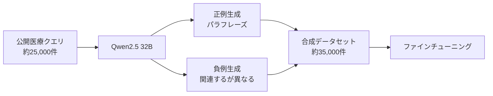

## 論文概要（Abstract）

本記事は [Advancing Semantic Caching for LLMs with Domain-Specific Embeddings and Synthetic Data](https://arxiv.org/abs/2504.02268) の解説記事です。

セマンティックキャッシュにおけるクエリ類似度判定の精度は、埋め込みモデルの品質に直結する。しかし汎用の埋め込みモデルは、医療・法律・金融といったドメイン固有の用語や表現を十分に捉えられないという課題がある。著者らは、149Mパラメータの軽量エンコーダModernBERTをOnline Contrastive Lossでわずか1エポックだけファインチューニングすることで、OpenAI text-embedding-3-largeやCohere embed-english-v3といったプロプライエタリモデルを精度で上回る「LangCache-Embed」を構築した。さらに、アノテーション済みデータが不足するドメインに対し、Qwen2.5（32B）を用いた合成データ生成パイプラインを提案し、合成データのみの訓練でも競争力のある性能を達成したと報告している。

この記事は [Zenn記事: セマンティックキャッシュの類似度閾値チューニングとベクトルDB別性能比較](https://zenn.dev/0h_n0/articles/1707bd6149514c) の深掘りです。

## 情報源

- **arXiv ID**: 2504.02268
- **URL**: [https://arxiv.org/abs/2504.02268](https://arxiv.org/abs/2504.02268)
- **著者**: Waris Gill, Justin Cechmanek, Tyler Hutcherson, Srijith Rajamohan, Jen Agarwal, Muhammad Ali Gulzar, Manvinder Singh, Benoit Dion
- **所属**: Redis, Virginia Tech
- **発表年**: 2025年
- **分野**: cs.LG（機械学習）, cs.CL（計算言語学）
- **モデル公開**: [redis/langcache-embed-v1](https://huggingface.co/redis/langcache-embed-v1)（HuggingFace）

## 背景と動機（Background & Motivation）

セマンティックキャッシュは、LLMアプリケーションのレイテンシ削減とコスト最適化の手段として注目されている。Zenn記事で解説されているように、ユーザークエリを埋め込みベクトルに変換し、過去のクエリとの類似度が閾値を超えた場合にキャッシュ済み応答を返す仕組みである。この閾値設定にはPrecision（誤ったキャッシュヒットの抑制）とRecall（正しいキャッシュヒットの最大化）のトレードオフが存在し、埋め込みモデルの品質がトレードオフの質そのものを決定する。

著者らは、汎用埋め込みモデルのドメイン固有タスクにおける限界を具体例で示している。医療分野では「myocardial infarction treatment」（心筋梗塞の治療）と「how to treat a heart attack」（心臓発作の治療法）は同一の意味であるにもかかわらず、汎用モデルではこれらが類似クエリとして認識されない場合がある。この問題は閾値チューニングだけでは解決できず、埋め込みモデル自体のドメイン適応が必要となる。

一方で、gte-Qwen2-7B-instructのような大規模モデル（7B以上のパラメータ）はドメイン適応力が高いものの、計算コストが高くリアルタイムのキャッシュ判定には不向きである。プロプライエタリAPI（OpenAI, Cohere等）はレイテンシとプライバシーの懸念がある。著者らは、この「精度 vs 効率」のジレンマに対する解として、軽量モデルのドメイン特化ファインチューニングを提案している。

## 主要な貢献（Key Contributions）

著者らは以下の4点を主要な貢献として報告している。

- **ドメイン特化埋め込みモデル LangCache-Embed の構築**: ModernBERT（149Mパラメータ）をベースに、Online Contrastive Lossによる1エポックのファインチューニングで、OpenAI text-embedding-3-largeを精度で上回るモデルを実現した
- **合成データ生成パイプラインの提案**: Qwen2.5（32B）を用いて、約25,000件の公開医療クエリから約35,000件の正例・負例ペアを自動生成するパイプラインを設計し、アノテーション済みデータが不足するドメインでの訓練を可能にした
- **Catastrophic Forgettingの制御手法の発見**: 1エポック訓練と勾配ノルム0.5の制約により、ドメイン特化の精度向上とクロスドメイン性能の維持を両立できることを実験的に示した
- **効率と精度のトレードオフの包括的評価**: 10種類以上のオープンソース・プロプライエタリモデルとのレイテンシ・精度の比較分析を行い、LangCache-EmbedがCPU上で最低の埋め込み生成時間と高い精度を同時に達成することを示した

## 技術的詳細（Technical Details）

### ModernBERTアーキテクチャ

LangCache-Embedのベースモデルは、ModernBERT（answerdotai/ModernBERT-base）である。ModernBERTは約149Mパラメータのエンコーダ専用Transformerであり、BERT、NomicBERT、RoBERTaと比較して効率と性能のバランスに優れると報告されている。最大シーケンス長は8192トークンに対応し、768次元の埋め込みベクトルを出力する。

著者らがModernBERTを選択した理由は、セマンティックキャッシュの要件に合致するためである。キャッシュの類似度判定はLLM推論の前段で実行されるため、埋め込み生成のレイテンシが全体のスループットに直結する。7Bパラメータ級のモデル（gte-Qwen2-7B-instruct等）は精度が高いものの、CPU上での推論時間が長く、キャッシュの高速応答という利点を損なう。ModernBERTは149Mパラメータという小ささでありながら、ファインチューニング後にこれらの大規模モデルを上回る精度を達成している。

### Online Contrastive Loss

ファインチューニングにはOnline Contrastive Lossが使用されている。この損失関数は、バッチ内の全ペアを走査し、モデルにとって最も判別が困難なサンプルに集中して学習を行う。

具体的には、以下の2種類の「難しい」ペアに焦点を当てる。

- **Hard Positives**: 意味的に同一であるにもかかわらず、モデルが埋め込み空間上で遠くに配置しているペア
- **Hard Negatives**: 意味的に異なるにもかかわらず、モデルが埋め込み空間上で近くに配置しているペア

Online Contrastive Lossの基本的な定式化は以下の通りである。

$$
\mathcal{L} = \frac{1}{|\mathcal{P}|} \sum_{(i,j) \in \mathcal{P}} y_{ij} \cdot \max(0, d(\mathbf{e}_i, \mathbf{e}_j) - m_p)^2 + (1 - y_{ij}) \cdot \max(0, m_n - d(\mathbf{e}_i, \mathbf{e}_j))^2
$$

ここで、
- $\mathcal{P}$: バッチ内から選択された難しいペアの集合
- $\mathbf{e}_i, \mathbf{e}_j$: クエリ $i$, $j$ の埋め込みベクトル
- $d(\cdot, \cdot)$: 埋め込みベクトル間の距離関数
- $y_{ij}$: ペアのラベル（1: 意味的に同一、0: 意味的に異なる）
- $m_p$: 正例ペアのマージン（同一クエリ間の距離の上限）
- $m_n$: 負例ペアのマージン（異なるクエリ間の距離の下限）

この損失関数の特徴は「online」の部分にある。従来のContrastive Lossが事前に定義されたペアに対して計算されるのに対し、Online Contrastive Lossはバッチ内で動的に最も困難なペアを選択する。これにより、学習の初期段階では容易なペアに時間を浪費せず、モデルの判別境界が曖昧な領域に効率的にリソースを集中させる。

### 合成データ生成パイプライン

アノテーション済みのドメイン固有データセットは一般に入手困難である。著者らは、この課題に対処するためにLLMベースの合成データ生成パイプラインを設計している。



パイプラインの構成要素は以下の通りである。

**正例（is_duplicate=1）の生成**: 元のクエリと意味的に同一だが表現が異なるパラフレーズを生成する。例として、「What is the treatment for myocardial infarction?」に対して「How do doctors treat a heart attack?」を生成する。これにより、モデルは表層的な単語の一致ではなく意味的同一性を学習する。

**負例（is_duplicate=0）の生成**: 元のクエリとトピックは関連するが焦点が異なるクエリを生成する。例として、「Can doxycycline treat an ear infection?」に対して「What are the side effects of doxycycline?」を生成する。同じ薬剤名を含むが質問の意図が異なるペアにより、モデルは明確な意味的境界を学習する。

この「dual-labeling」アプローチにより、1つのパイプラインで正例と負例の両方を同時に生成できる。約25,000件の公開医療クエリ（Chen et al., 2024）から約35,000件の合成訓練サンプルが生成されたと報告されている。

## アルゴリズム（Algorithm）

### Online Contrastive Lossの実装

以下はOnline Contrastive Lossの概念的な実装例である。実際のLangCache-EmbedではSentence Transformers（SBERT）ライブラリの実装が使用されている。

```python
import torch
import torch.nn as nn
from typing import Optional


class OnlineContrastiveLoss(nn.Module):
    """Online Contrastive Loss for embedding fine-tuning.

    バッチ内から動的に最も困難なペアを選択し、
    埋め込み空間の判別境界を効率的に学習する。
    Sentence Transformers (SBERT) ライブラリに基づく実装。

    Args:
        distance_metric: 埋め込みベクトル間の距離関数
        margin: 負例ペアの最小距離マージン
    """

    def __init__(
        self,
        distance_metric: nn.Module = nn.CosineSimilarity(dim=-1),
        margin: float = 0.5,
    ) -> None:
        super().__init__()
        self.distance_metric = distance_metric
        self.margin = margin

    def forward(
        self,
        embeddings_a: torch.Tensor,
        embeddings_b: torch.Tensor,
        labels: torch.Tensor,
    ) -> torch.Tensor:
        """損失を計算する

        Args:
            embeddings_a: 1つ目のクエリの埋め込み (batch_size, dim)
            embeddings_b: 2つ目のクエリの埋め込み (batch_size, dim)
            labels: ペアのラベル 1=同一, 0=異なる (batch_size,)

        Returns:
            スカラーの損失値
        """
        similarities = self.distance_metric(embeddings_a, embeddings_b)
        # Hard Positives: 同一ラベルだが類似度が低いペア
        positive_mask = labels == 1
        positive_sims = similarities[positive_mask]
        # Hard Negatives: 異なるラベルだが類似度が高いペア
        negative_mask = labels == 0
        negative_sims = similarities[negative_mask]

        loss = torch.tensor(0.0, device=embeddings_a.device)
        if positive_sims.numel() > 0:
            # 最も困難な正例（最も類似度が低い）に集中
            hard_positive_loss = (1.0 - positive_sims).mean()
            loss = loss + hard_positive_loss
        if negative_sims.numel() > 0:
            # マージン以内の負例（最も類似度が高い）にペナルティ
            hard_negative_loss = torch.clamp(
                negative_sims - self.margin, min=0.0
            ).mean()
            loss = loss + hard_negative_loss

        return loss
```

### 合成データ生成の実装

```python
from dataclasses import dataclass


@dataclass
class SyntheticPair:
    """合成データのクエリペア

    Attributes:
        original: 元のクエリ
        generated: 生成されたクエリ
        is_duplicate: 1=パラフレーズ（正例）, 0=関連するが異なる（負例）
    """

    original: str
    generated: str
    is_duplicate: int


PARAPHRASE_PROMPT = """Given the following medical query, generate a paraphrase
that preserves the exact same intent but uses different wording and syntax.

Original query: {query}

Requirements:
- Maintain identical semantic meaning
- Use different vocabulary and sentence structure
- Keep medical accuracy
- Output only the paraphrased query, nothing else."""

NEGATIVE_PROMPT = """Given the following medical query, generate a query that is
topically related but asks about a distinctly different aspect or focus.

Original query: {query}

Requirements:
- Share the same medical topic or entity
- Differ clearly in intent or focus
- Be a realistic medical question
- Output only the generated query, nothing else."""


def generate_synthetic_pairs(
    queries: list[str],
    llm_client: object,
    model_name: str = "Qwen2.5-32B",
) -> list[SyntheticPair]:
    """公開クエリから正例・負例ペアを合成生成する

    Qwen2.5 (32B) を用いて、各クエリに対し
    パラフレーズ（正例）と関連するが異なるクエリ（負例）を生成する。

    Args:
        queries: 元のクエリのリスト（約25,000件）
        llm_client: LLMクライアント（Qwen2.5-32B等）
        model_name: 使用するモデル名

    Returns:
        合成ペアのリスト（約35,000件: 正例 + 負例）
    """
    pairs: list[SyntheticPair] = []
    for query in queries:
        # 正例（パラフレーズ）の生成
        paraphrase = llm_client.generate(
            PARAPHRASE_PROMPT.format(query=query),
            model=model_name,
            temperature=0.7,
        )
        pairs.append(SyntheticPair(
            original=query,
            generated=paraphrase,
            is_duplicate=1,
        ))
        # 負例（関連するが異なる）の生成
        negative = llm_client.generate(
            NEGATIVE_PROMPT.format(query=query),
            model=model_name,
            temperature=0.7,
        )
        pairs.append(SyntheticPair(
            original=query,
            generated=negative,
            is_duplicate=0,
        ))
    return pairs
```

## 実装のポイント（Implementation）

### 1エポック訓練の重要性

著者らの実験で最も注目すべき発見は、**1エポックの訓練が最適である**という結果である。直感に反するが、過剰な訓練はcatastrophic forgetting（破滅的忘却）を引き起こし、特にクロスドメインの性能が劣化する。

論文のFigure 3の分析によると、6エポックの訓練ではQuoraデータセットでのPrecisionが+22ppと大幅に向上する一方、医療ドメインでのPrecisionが-8ppと低下する。つまり、訓練ドメインに過剰適合し、他ドメインでの判別能力が失われる。

1エポック訓練と勾配ノルム0.5の制約を組み合わせることで、以下のバランスが達成される。

- **ターゲットドメイン（Quora）**: Precisionが64%から84%へ+20pp改善
- **クロスドメイン（医療）**: Precisionが+4pp改善（悪化ではなく改善）

### 訓練ハイパーパラメータ

論文で報告されている訓練設定は以下の通りである。

| パラメータ | 値 | 理由 |
|:---:|:---:|:---|
| エポック数 | 1 | Catastrophic forgetting防止 |
| 学習率 | $6.54 \times 10^{-5}$ | Adam optimizer |
| バッチサイズ | 16 | メモリ効率と学習安定性のバランス |
| 勾配ノルム | 0.5 | 重みの急激な変化を抑制 |
| 損失関数 | Online Contrastive Loss | Hard example mining |
| ライブラリ | Sentence Transformers (SBERT) | 実装基盤 |

### ハードウェア構成

訓練にはAmazon EC2 G6eインスタンス（NVIDIA L40S GPU 4基）が使用されているが、149Mパラメータという小ささにより単一GPUでも訓練可能と考えられる。推論はCPU上で行われており、GPU不要でデプロイできる点が実用上の大きな利点である。

## 実験結果（Results）

### 合成データのみでの訓練結果（医療データセット）

論文のTable 1より、合成データのみで訓練したLangCache-Embed-Syntheticと各モデルの比較を以下に示す。評価は医療データセット（610件の評価サンプル）で行われている。

| モデル | Source | Precision | Recall | F1 | Accuracy | Avg. Precision |
|:---|:---:|:---:|:---:|:---:|:---:|:---:|
| OpenAI text-embedding-3-large | Closed | 0.85 | 0.87 | 0.86 | 0.85 | 0.94 |
| OpenAI text-embedding-3-small | Closed | 0.83 | 0.89 | 0.86 | 0.85 | 0.94 |
| OpenAI text-embedding-ada-002 | Closed | 0.77 | 0.90 | 0.83 | 0.81 | 0.91 |
| Amazon Titan v2 (1024d) | Closed | 0.80 | 0.89 | 0.84 | 0.83 | 0.92 |
| Amazon Titan v2 (512d) | Closed | 0.84 | 0.86 | 0.85 | 0.84 | 0.92 |
| Cohere embed-english-v3 | Closed | 0.78 | 0.83 | 0.81 | 0.80 | 0.88 |
| Linq-Embed-Mistral | Open | 0.84 | 0.93 | 0.88 | 0.87 | 0.96 |
| multilingual-e5-large-instruct | Open | 0.87 | 0.82 | 0.84 | 0.84 | 0.92 |
| gte-modernbert-base（ベース） | Open | 0.78 | 0.89 | 0.84 | 0.83 | 0.92 |
| **LangCache-Embed-Synthetic** | **Open** | **0.87** | **0.90** | **0.89** | **0.88** | **0.95** |

（出典: 論文 Table 1）

合成データのみの訓練でも、LangCache-Embed-SyntheticはPrecision 87%を達成し、OpenAI text-embedding-3-large（85%）を2pp上回っている。Cohere embed-english-v3（78%）に対しては9ppの改善である。

### Quoraデータセットでの結果

Quoraデータセット（53,486件の評価サンプル）でのファインチューニング効果は以下の通り報告されている。

| 指標 | ベースModernBERT | LangCache-Embed | 改善幅 |
|:---:|:---:|:---:|:---:|
| Precision | 64% | 84% | +20pp |
| Average Precision | 76% | 92% | +16pp |

（出典: 論文 Section 4）

### 医療データセットでの結果（実データ訓練）

実際の医療アノテーション済みデータ（2,438件）で訓練した場合の結果は以下の通りである。

| 指標 | ベースModernBERT | LangCache-Embed | 改善幅 |
|:---:|:---:|:---:|:---:|
| Average Precision | 78% | 92% | +14pp |

（出典: 論文 Section 4）

さらに、合成データのみの訓練でもAverage Precision 87%（ベースから+9pp）を達成しており、アノテーション済みデータの92%には及ばないものの、実用上十分な精度であると著者らは報告している。

### Catastrophic Forgettingの分析

| 訓練設定 | Quora Precision改善 | 医療Precision変化 | 評価 |
|:---|:---:|:---:|:---|
| 6エポック | +22pp | -8pp | ドメイン特化に偏り、汎化能力が低下 |
| 1エポック + 勾配ノルム0.5 | +20pp | +4pp | 両ドメインで改善を維持 |

（出典: 論文 Figure 3）

6エポック訓練ではターゲットドメインの精度向上は最大だが、クロスドメインでの劣化が深刻である。1エポック訓練では精度向上幅は若干小さいものの、クロスドメインの性能が維持されるだけでなくむしろ改善されている。

### レイテンシ評価

論文のFigure 4では、埋め込み生成時間（X軸）とQuoraデータセットでのAverage Precision（Y軸）のトレードオフが分析されている。測定はGPUではなくCPU上で行われており、セマンティックキャッシュの実環境を反映している。

著者らによると、LangCache-Embedは比較対象モデルの中で**最低の埋め込み生成時間**を達成しながら、**最高水準のAverage Precision**を維持している。Figure 4のグラフにおいて、LangCache-Embedは「高精度・低レイテンシ」の左上象限に位置し、セマンティックキャッシュにとって最も望ましい領域にあると報告されている。

## 実運用への応用（Practical Applications）

### Zenn記事との関連

Zenn記事「セマンティックキャッシュの類似度閾値チューニングとベクトルDB別性能比較」では、閾値設定がキャッシュの有効性を大きく左右することが解説されている。本論文の成果は、この閾値チューニングの前提となる埋め込みモデルの品質を改善するものであり、両者は相補的な関係にある。

具体的には、以下の点でZenn記事の内容と関連する。

- **閾値の緩和**: 埋め込みモデルの精度が向上すれば、同一の閾値でもPrecisionが改善される。Zenn記事で推奨されている0.92-0.95の閾値を、LangCache-Embedではより低い値（0.88-0.92程度）に設定しても誤ヒットを抑制できる可能性がある。これによりキャッシュヒット率の向上が期待される
- **ドメイン別の埋め込みモデル選択**: Zenn記事ではベクトルDB別の性能比較が行われているが、本論文はその前段の埋め込みモデル選択に関する知見を提供する。特に医療・金融等の専門ドメインでは、汎用モデルからドメイン特化モデルへの切り替えが閾値チューニング以上の効果をもたらす可能性がある
- **コスト効率**: 149Mパラメータの軽量モデルはCPU上で推論可能であり、GPU不要のデプロイが可能である。Zenn記事で解説されている3層キャッシュアーキテクチャのLayer 2（セマンティックキャッシュ）に組み込む場合、推論コストの観点でプロプライエタリAPIよりも有利である

### 実運用での活用シナリオ

1. **社内カスタマーサポート**: 企業固有の製品名・サービス名を含むクエリの類似度判定を改善するため、社内FAQデータでファインチューニングする
2. **医療チャットボット**: 医学用語の言い換えを正確に捉えるため、本論文の合成データパイプラインで訓練データを生成する
3. **マルチテナントキャッシュ**: テナントごとにドメインが異なる場合、ベースモデルから各ドメイン向けにファインチューニングした複数モデルを用意する

## 関連研究（Related Work）

- **GPTCache**: セマンティックキャッシュの実装フレームワークとして広く使用されている。本論文のLangCache-Embedは、GPTCacheの埋め込みモデルとして組み込むことで精度向上が期待される
- **vCache（ICLR 2026採択）**: 静的な閾値ではなく動的な閾値推定を行うアプローチ。Zenn記事でも紹介されている。本論文の埋め込みモデル改善とvCacheの動的閾値推定は直交する改善軸であり、組み合わせにより更なる精度向上が見込まれる
- **Matryoshka Representation Learning**: 埋め込み次元を可変にする手法。LangCache-Embedの後継版（v2）ではMatryoshkaLossが採用されており、768/512/256/128/64次元での利用が可能になっている
- **Sentence Transformers**: 本論文の訓練基盤として使用されているライブラリ。Online Contrastive Lossの実装もこのライブラリに含まれている

## まとめと今後の展望

本論文は、セマンティックキャッシュの精度向上において、大規模モデルやプロプライエタリAPIに頼らず、軽量モデルのドメイン特化ファインチューニングと合成データ生成が有効な手段であることを示した。149Mパラメータという小さなモデルが、1エポックの訓練で数十億パラメータモデルやOpenAI等のプロプライエタリモデルを上回る精度を達成した点は、実運用のコスト効率を考える上で重要な知見である。

今後の展望として、著者らのアプローチは他のドメイン（法律、金融、製造業等）への展開が期待される。また、合成データの品質と量の最適なバランス、多言語対応、そして後継のLangCache-Embed-v2で導入されたMatryoshka表現学習との組み合わせが研究の方向性として考えられる。

## 参考文献

- **arXiv**: [https://arxiv.org/abs/2504.02268](https://arxiv.org/abs/2504.02268)
- **Model (v1)**: [https://huggingface.co/redis/langcache-embed-v1](https://huggingface.co/redis/langcache-embed-v1)
- **Model (v2)**: [https://huggingface.co/redis/langcache-embed-v2](https://huggingface.co/redis/langcache-embed-v2)
- **Related Zenn article**: [https://zenn.dev/0h_n0/articles/1707bd6149514c](https://zenn.dev/0h_n0/articles/1707bd6149514c)
