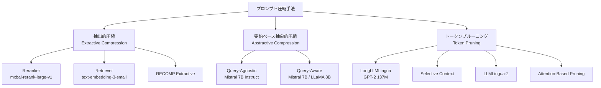
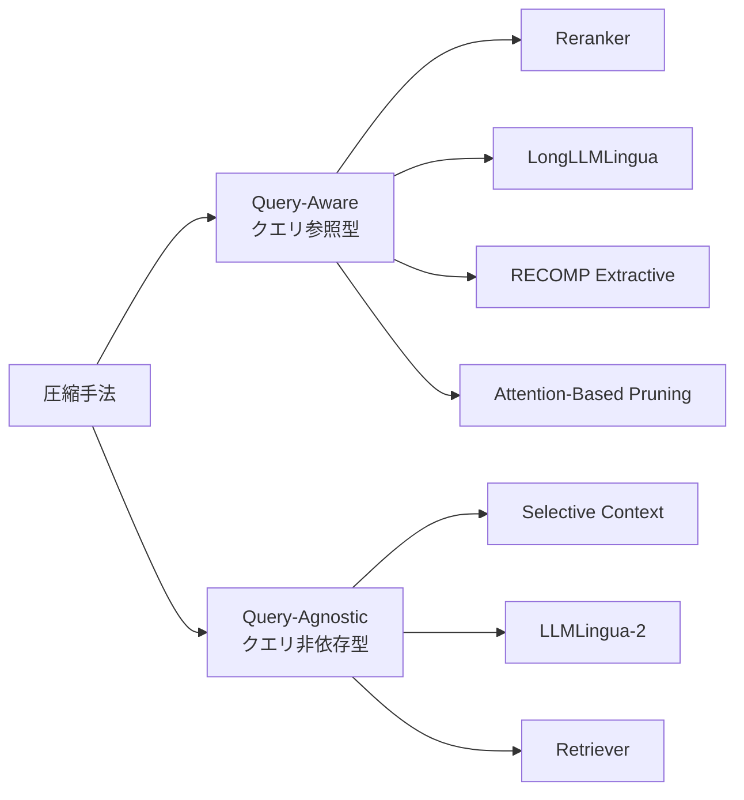

## 論文概要

本記事は [Characterizing Prompt Compression Methods for Long Context Inference](https://arxiv.org/abs/2407.08892) の解説記事です。

ロングコンテキスト推論は、システムレベルでの計算・メモリ要件の増大と、長い文脈に対する推論精度の低下という二重の課題を抱えている。著者らは、プロンプト圧縮の3つの主要アプローチ（抽出的圧縮・要約ベース抽象的圧縮・トークンプルーニング）を、LongBenchベンチマークの9データセットを用いて標準化された条件のもとで体系的に比較評価した。その結果、抽出的圧縮（特にRerankerベース手法）が最大10倍の圧縮率において精度劣化を最小限に抑えることを示したと報告している。また、近年注目されているトークンプルーニング手法が抽出的圧縮に対して劣後するという、従来の主張と矛盾する結果を明らかにしている。

この記事は [Zenn記事: LLMコンテキストエンジニアリング実践：圧縮・ルーティングで1Mトークンを制御](https://zenn.dev/0h_n0/articles/cfc6a5ad9e22fd) の深掘りです。

## 情報源

- **会議名**: ES-FoMo II: 2nd Workshop on Efficient Systems for Foundation Models（ICML 2024併設ワークショップ）
- **arXiv ID**: 2407.08892
- **URL**: [https://arxiv.org/abs/2407.08892](https://arxiv.org/abs/2407.08892)
- **著者**: Siddharth Jha, Lutfi Eren Erdogan, Sehoon Kim, Kurt Keutzer, Amir Gholami
- **発表年**: 2024
- **発表形式**: Oral Presentation

## カンファレンス情報

ICML（International Conference on Machine Learning）は機械学習分野における最高峰の国際会議の1つである。ES-FoMo II（Efficient Systems for Foundation Models）はICML 2024に併設されたワークショップであり、基盤モデルの効率的なシステム実装に焦点を当てている。プロンプト圧縮、推論最適化、モデル量子化、効率的な学習手法など、LLMのプロダクション運用に直結するテーマを扱う。本論文はOral Presentationとして採択されており、ワークショップにおいて高い評価を受けた研究である。著者らはUC Berkeleyの研究グループに所属している。

## 背景と動機

LLMのコンテキストウィンドウは急速に拡大しており、GPT-4 Turboで128Kトークン、Gemini 1.5 Proで1Mトークンに達している。しかし、コンテキスト長の拡大は計算コストの増大（Self-Attentionの$O(n^2)$計算量）と、長い文脈中の情報を正確に参照する能力の低下（"Lost in the Middle"問題）の2つの課題をもたらす。

Retrieval-Augmented Generation（RAG）の普及により、検索結果を含む数万トークン規模のプロンプトが一般的になっている。このような長大なプロンプトの効率的な処理にはプロンプト圧縮が有効だが、先行研究には以下の問題があった。

1. **評価条件の不統一**: 各手法が異なるデータセット・モデル・圧縮率で評価されており、公正な比較ができなかった
2. **矛盾する結果**: ある研究ではトークンプルーニングが優位とされ、別の研究では抽出的圧縮が優位とされるなど、結論が一致しなかった
3. **実運用への示唆の不足**: どの圧縮手法をどの場面で選択すべきかの指針が不明確であった

著者らはこれらの問題を解決するため、統一的なフレームワークのもとで3つの圧縮パラダイムを網羅的に比較する研究を行っている。

## 主要な貢献

著者らは以下の4点を本研究の貢献として報告している。

- **3つの圧縮パラダイムの体系的分類と標準化比較**: 抽出的圧縮・要約ベース抽象的圧縮・トークンプルーニングを統一条件（同一データセット、同一LLM、同一チャンキング戦略）で比較した初めての包括的評価を実施した。

- **抽出的圧縮の優位性の実証**: Rerankerベースの抽出的圧縮が、9データセット中の多くのタスクで他の手法を上回り、最大10倍の圧縮率で精度劣化が最小であることを示した。2WikiMultihopQAでは7.75倍圧縮しつつ精度を7.89ポイント向上させた結果も報告している（GPT-3.5-Turbo使用時）。

- **トークンプルーニングの過大評価の指摘**: LongLLMLinguaやSelective Contextなどのトークンプルーニング手法が、抽出的圧縮に対して劣後することを標準化された条件で示し、先行研究の楽観的な結論に疑問を呈している。

- **Query-Aware vs Query-Agnosticの分析軸の導入**: 圧縮時にクエリを参照するか否かという分析軸を導入し、Query-Aware手法が特にMulti-document QAタスクで優位であることを示した。

## 技術的詳細

### 3つの圧縮アプローチの分類

著者らは、プロンプト圧縮手法を以下の3つのパラダイムに分類している。



さらに、各手法はクエリ情報を利用するか否かで分類される。



Query-Aware手法はクエリごとに圧縮結果が変わるため精度が高い傾向があるが、クエリのたびに圧縮処理を実行する必要がある。一方、Query-Agnostic手法は一度圧縮すればどのクエリにも再利用できるため、同一文書に対して多数のクエリが発行される場面で有利となる。

### 抽出的圧縮の手法

抽出的圧縮は、元のテキストをチャンクに分割し、各チャンクの関連度スコアに基づいて上位チャンクを選択する手法である。元テキストの改変が一切発生しないため、情報の忠実性が保たれる。

**Reranker（mxbai-rerank-large-v1）**: DeBERTaベースの435Mパラメータモデルであり、クエリとチャンクの両方を入力として関連度スコアを出力するクロスエンコーダである。関連度スコアは以下のように定義される。

$$
s_i = f_{\text{rerank}}(q, c_i)
$$

ここで、$q$はクエリ、$c_i$は$i$番目のチャンク、$f_{\text{rerank}}$はRerankerモデルである。スコア$s_i$の上位$k$個のチャンクを選択し、元の順序を保持して連結する。

**Retriever（text-embedding-3-small）**: 各チャンクとクエリを独立にエンベディングし、コサイン類似度で関連度を計算する。

$$
s_i = \frac{\mathbf{e}_q \cdot \mathbf{e}_{c_i}}{|\mathbf{e}_q| \cdot |\mathbf{e}_{c_i}|}
$$

ここで、$\mathbf{e}_q$と$\mathbf{e}_{c_i}$はそれぞれクエリとチャンクのエンベディングベクトルである。Rerankerと比較して計算コストが低い一方、クエリとチャンクの相互作用を明示的にモデル化できないため精度で劣る傾向がある。

### 要約ベース抽象的圧縮の手法

要約ベース圧縮は、小型のLLM（Mistral 7B InstructやLLaMA 3 8B）を用いて元テキストを要約する手法である。著者らはMap-Reduceアプローチを採用し、各チャンクを個別に要約してから連結する。

$$
c'_i = g_{\text{summarize}}(c_i, q)
$$

ここで、$g_{\text{summarize}}$は要約モデル、$c'_i$はチャンク$c_i$の要約結果である。Query-Aware版ではクエリ$q$を要約の条件として与え、Query-Agnostic版ではクエリなしで汎用的な要約を生成する。

著者らの報告によると、Query-Aware要約はQuery-Agnosticに対して多くのデータセットで3-6ポイントの精度向上を示した。しかし、要約モデル自体が重要情報を欠落させたりハルシネーションを導入するリスクがあり、特に事実に基づく正確な回答が求められるQAタスクでは抽出的圧縮に劣後する傾向がある。

### トークンプルーニングの手法

トークンプルーニングは、チャンク内の個別トークンの重要度を判定し、重要度の低いトークンを除去する手法である。

**LongLLMLingua**: GPT-2（137Mパラメータ）をコンプレッサーとして使用し、各トークンのperplexityに基づいて重要度を判定する。

$$
I(t_j) = -\log p(t_j \mid t_{<j})
$$

ここで、$I(t_j)$はトークン$t_j$の情報量（surprisal）、$p(t_j \mid t_{<j})$はGPT-2による条件付き確率である。情報量が低い（予測しやすい）トークンを除去対象とする。著者らの実験では、dynamic context compression ratioを0.3、context budgetを+100に設定している。

**Selective Context**: LongLLMLinguaと同様にperplexityベースの手法だが、Query-Agnosticであり、クエリ情報を使用しない点が異なる。

**Attention-Based Pruning**: DeBERTaモデルの最後の10層のAttentionスコアを集約し、各トークンの重要度を判定する手法である。

著者らは、トークンプルーニングの割合についても分析を行っている。20%のプルーニングでは比較的性能が維持されるが、50%の積極的なプルーニングでは「文法的構造を尊重しない非構造化テキスト」が生成され、性能が大幅に劣化すると報告している。

## 実装のポイント

### チャンキング戦略

著者らは約128トークン単位のチャンキングを採用し、文境界を尊重するようにしている。チャンクサイズの影響分析では、64/128/256/512トークンの4条件を比較し、128トークンが高圧縮率でのカバレッジと精度のバランスに優れることを確認している。512トークンの大きなチャンクでは、高い圧縮率においてソースドキュメントのカバレッジが低下し、精度が劣化する傾向が観察されている。

### Rerankerを用いた抽出的圧縮の実装例

```python
from dataclasses import dataclass
from typing import Optional

import numpy as np


@dataclass(frozen=True)
class CompressedResult:
    """圧縮結果を保持するデータクラス

    Attributes:
        text: 圧縮後のテキスト
        compression_ratio: 圧縮率（元テキスト長 / 圧縮後テキスト長）
        selected_indices: 選択されたチャンクのインデックス
    """

    text: str
    compression_ratio: float
    selected_indices: list[int]


def chunk_text(
    text: str,
    chunk_size: int = 128,
    overlap: int = 0,
) -> list[str]:
    """テキストを文境界を尊重してチャンクに分割する

    Args:
        text: 入力テキスト
        chunk_size: チャンクあたりの目標トークン数
        overlap: チャンク間のオーバーラップトークン数

    Returns:
        チャンクのリスト
    """
    sentences = text.split(". ")
    chunks: list[str] = []
    current_chunk: list[str] = []
    current_length = 0

    for sentence in sentences:
        sentence_length = len(sentence.split())
        if current_length + sentence_length > chunk_size and current_chunk:
            chunks.append(". ".join(current_chunk) + ".")
            current_chunk = []
            current_length = 0
        current_chunk.append(sentence)
        current_length += sentence_length

    if current_chunk:
        chunks.append(". ".join(current_chunk))

    return chunks


def extractive_compress(
    chunks: list[str],
    query: str,
    reranker_scores: list[float],
    target_ratio: float = 5.0,
    original_length: Optional[int] = None,
) -> CompressedResult:
    """Rerankerスコアに基づく抽出的圧縮

    Args:
        chunks: テキストチャンクのリスト
        query: 検索クエリ
        reranker_scores: 各チャンクのRerankerスコア
        target_ratio: 目標圧縮率
        original_length: 元テキストの長さ（Noneの場合は全チャンクから計算）

    Returns:
        圧縮結果
    """
    if original_length is None:
        original_length = sum(len(c.split()) for c in chunks)

    target_length = original_length / target_ratio

    # スコア順にソートしインデックスを保持
    ranked_indices = np.argsort(reranker_scores)[::-1].tolist()

    selected_indices: list[int] = []
    current_length = 0

    for idx in ranked_indices:
        chunk_length = len(chunks[idx].split())
        if current_length + chunk_length > target_length:
            break
        selected_indices.append(idx)
        current_length += chunk_length

    # 元の順序を復元（文脈の一貫性を維持）
    selected_indices.sort()

    compressed_text = " ".join(chunks[i] for i in selected_indices)
    actual_ratio = original_length / max(current_length, 1)

    return CompressedResult(
        text=compressed_text,
        compression_ratio=actual_ratio,
        selected_indices=selected_indices,
    )
```

### トークンプルーニングの実装例

```python
import math
from dataclasses import dataclass

import torch
import torch.nn.functional as F


@dataclass(frozen=True)
class PrunedResult:
    """トークンプルーニング結果

    Attributes:
        text: プルーニング後のテキスト
        kept_ratio: 保持されたトークンの割合
        importance_scores: 各トークンの重要度スコア
    """

    text: str
    kept_ratio: float
    importance_scores: list[float]


def compute_token_importance(
    logits: torch.Tensor,
    input_ids: torch.Tensor,
) -> torch.Tensor:
    """因果言語モデルのlogitsからトークンの情報量（surprisal）を計算

    LongLLMLinguaのアプローチに基づき、各トークンの
    負の対数尤度をinformation contentとして使用する。

    Args:
        logits: モデル出力のlogits (seq_len, vocab_size)
        input_ids: 入力トークンID (seq_len,)

    Returns:
        各トークンの情報量スコア (seq_len - 1,)
    """
    # logits[i] は token[i+1] の予測に使用される
    shifted_logits = logits[:-1, :]
    shifted_labels = input_ids[1:]

    log_probs = F.log_softmax(shifted_logits, dim=-1)
    token_log_probs = log_probs.gather(
        dim=-1,
        index=shifted_labels.unsqueeze(-1),
    ).squeeze(-1)

    # surprisal = -log p(t_j | t_{<j})
    importance = -token_log_probs

    return importance


def prune_tokens(
    tokens: list[str],
    importance_scores: list[float],
    prune_ratio: float = 0.2,
) -> PrunedResult:
    """重要度スコアに基づくトークンプルーニング

    Args:
        tokens: トークンのリスト
        importance_scores: 各トークンの重要度スコア
        prune_ratio: 除去するトークンの割合（0.0-1.0）

    Returns:
        プルーニング結果

    Raises:
        ValueError: prune_ratioが0.0未満または1.0以上の場合
    """
    if not 0.0 <= prune_ratio < 1.0:
        msg = f"prune_ratio must be in [0.0, 1.0), got {prune_ratio}"
        raise ValueError(msg)

    n_tokens = len(tokens)
    n_prune = math.floor(n_tokens * prune_ratio)

    # 重要度が低いトークンのインデックスを取得
    sorted_indices = sorted(
        range(len(importance_scores)),
        key=lambda i: importance_scores[i],
    )
    prune_indices = set(sorted_indices[:n_prune])

    kept_tokens = [t for i, t in enumerate(tokens) if i not in prune_indices]
    kept_ratio = len(kept_tokens) / n_tokens

    return PrunedResult(
        text=" ".join(kept_tokens),
        kept_ratio=kept_ratio,
        importance_scores=importance_scores,
    )
```

## Production Deployment Guide

本論文の知見を活かしたプロンプト圧縮パイプラインのAWSデプロイ構成を示す。RAGシステムにおける圧縮前処理として、Rerankerベースの抽出的圧縮を中心に設計する。

### AWS実装パターン（コスト最適化重視）

| 構成 | トラフィック | 主要サービス | 月額概算 |
|------|-------------|-------------|---------|
| Small | ~100 req/日 | Lambda + Bedrock + DynamoDB | $50-150 |
| Medium | ~1,000 req/日 | ECS Fargate + ElastiCache + Bedrock | $300-800 |
| Large | 10,000+ req/日 | EKS + Spot + Karpenter + Bedrock | $2,000-5,000 |

**Small構成（~100 req/日）**:
- Lambda（ARM64, 1024MB, 30秒タイムアウト）でRerankerモデル（ONNX変換済み）を実行
- Bedrock（Claude 3.5 Haiku）で圧縮済みプロンプトの推論
- DynamoDB（On-Demand）で圧縮結果のキャッシュ
- S3でRerankerモデルアーティファクト保存
- 月額概算: Lambda $5 + Bedrock $30-100 + DynamoDB $5 + S3 $1 = $41-111

**Medium構成（~1,000 req/日）**:
- ECS Fargate（2vCPU, 4GB RAM）でRerankerモデルをホスティング
- ElastiCache（Redis, cache.t3.micro）で圧縮結果キャッシュ
- ALB + Auto Scalingでリクエスト分散
- 月額概算: Fargate $60 + ElastiCache $15 + Bedrock $200-600 + ALB $20 = $295-695

**Large構成（10,000+ req/日）**:
- EKS + Karpenter（Spot優先、g5.xlarge GPU）でRerankerモデルの高速推論
- Bedrock Batch APIで非同期バッチ処理（50%コスト削減）
- Prompt Caching有効化で同一ドキュメントへの繰り返しクエリを最適化（30-90%削減）
- 月額概算: EKS $70 + Spot GPU $800-1,500 + Bedrock $1,000-3,000 = $1,870-4,570

**コスト削減テクニック**:
- Spot Instances活用: g5.xlargeでオンデマンド比最大70%削減
- Reserved Instances: 1年コミットで最大40%削減
- Bedrock Batch API: 非同期処理で50%削減
- Prompt Caching: 同一ドキュメントの再圧縮を回避し30-90%削減

**コスト試算の注意事項**: 上記は2026年7月時点のAWS ap-northeast-1（東京）リージョン料金に基づく概算値であり、実際のコストはトラフィックパターン、リージョン、バースト使用量により変動する。最新料金はAWS料金計算ツールで確認を推奨する。

### Terraformインフラコード

**Small構成（Serverless）**:

```hcl
# --- Small構成: Lambda + Bedrock + DynamoDB ---

# IAMロール（最小権限原則）
resource "aws_iam_role" "compressor_lambda" {
  name = "prompt-compressor-lambda-role"
  assume_role_policy = jsonencode({
    Version = "2012-10-17"
    Statement = [{
      Action = "sts:AssumeRole"
      Effect = "Allow"
      Principal = { Service = "lambda.amazonaws.com" }
    }]
  })
}

resource "aws_iam_role_policy" "compressor_lambda" {
  name = "prompt-compressor-lambda-policy"
  role = aws_iam_role.compressor_lambda.id
  policy = jsonencode({
    Version = "2012-10-17"
    Statement = [
      {
        Effect   = "Allow"
        Action   = ["bedrock:InvokeModel"]
        Resource = "arn:aws:bedrock:ap-northeast-1::foundation-model/anthropic.claude-3-5-haiku-*"
      },
      {
        Effect   = "Allow"
        Action   = ["dynamodb:GetItem", "dynamodb:PutItem", "dynamodb:Query"]
        Resource = aws_dynamodb_table.compression_cache.arn
      },
      {
        Effect   = "Allow"
        Action   = ["s3:GetObject"]
        Resource = "${aws_s3_bucket.model_artifacts.arn}/*"
      },
      {
        Effect   = "Allow"
        Action   = ["logs:CreateLogGroup", "logs:CreateLogStream", "logs:PutLogEvents"]
        Resource = "arn:aws:logs:*:*:*"
      }
    ]
  })
}

# Lambda関数（Reranker圧縮処理）
resource "aws_lambda_function" "prompt_compressor" {
  function_name = "prompt-compressor"
  runtime       = "python3.12"
  handler       = "handler.lambda_handler"
  role          = aws_iam_role.compressor_lambda.arn
  architectures = ["arm64"] # Graviton2でコスト20%削減
  memory_size   = 1024
  timeout       = 30

  environment {
    variables = {
      CACHE_TABLE     = aws_dynamodb_table.compression_cache.name
      MODEL_BUCKET    = aws_s3_bucket.model_artifacts.bucket
      RERANKER_MODEL  = "mxbai-rerank-large-v1-onnx"
      CHUNK_SIZE      = "128"
      DEFAULT_RATIO   = "5.0"
    }
  }
}

# DynamoDB（圧縮結果キャッシュ、On-Demandでコスト最適化）
resource "aws_dynamodb_table" "compression_cache" {
  name         = "prompt-compression-cache"
  billing_mode = "PAY_PER_REQUEST"
  hash_key     = "document_hash"
  range_key    = "query_hash"

  attribute {
    name = "document_hash"
    type = "S"
  }

  attribute {
    name = "query_hash"
    type = "S"
  }

  ttl {
    attribute_name = "expires_at"
    enabled        = true
  }

  server_side_encryption {
    enabled = true # KMS暗号化
  }
}

# S3バケット（モデルアーティファクト保存）
resource "aws_s3_bucket" "model_artifacts" {
  bucket = "prompt-compressor-models-${data.aws_caller_identity.current.account_id}"
}

resource "aws_s3_bucket_server_side_encryption_configuration" "model_artifacts" {
  bucket = aws_s3_bucket.model_artifacts.id
  rule {
    apply_server_side_encryption_by_default {
      sse_algorithm = "aws:kms"
    }
  }
}

data "aws_caller_identity" "current" {}
```

**Large構成（Container）**:

```hcl
# --- Large構成: EKS + Karpenter + Spot Instances ---

module "eks" {
  source          = "terraform-aws-modules/eks/aws"
  version         = "~> 20.0"
  cluster_name    = "prompt-compressor-cluster"
  cluster_version = "1.31"

  vpc_id     = module.vpc.vpc_id
  subnet_ids = module.vpc.private_subnets

  # Karpenter用のIAMロール
  enable_cluster_creator_admin_permissions = true
}

# Karpenter NodePool（Spot優先で最大70%コスト削減）
resource "kubectl_manifest" "karpenter_nodepool" {
  yaml_body = yamlencode({
    apiVersion = "karpenter.sh/v1"
    kind       = "NodePool"
    metadata   = { name = "gpu-reranker" }
    spec = {
      template = {
        spec = {
          requirements = [
            { key = "karpenter.sh/capacity-type", operator = "In", values = ["spot", "on-demand"] },
            { key = "node.kubernetes.io/instance-type", operator = "In", values = ["g5.xlarge", "g5.2xlarge"] },
          ]
          nodeClassRef = { name = "default" }
        }
      }
      limits   = { cpu = "64", memory = "256Gi" }
      disruption = {
        consolidationPolicy = "WhenEmptyOrUnderutilized"
        consolidateAfter    = "30s"
      }
    }
  })
}

# AWS Budgets（予算アラート）
resource "aws_budgets_budget" "monthly" {
  name         = "prompt-compressor-monthly"
  budget_type  = "COST"
  limit_amount = "5000"
  limit_unit   = "USD"
  time_unit    = "MONTHLY"

  notification {
    comparison_operator       = "GREATER_THAN"
    threshold                 = 80
    threshold_type            = "PERCENTAGE"
    notification_type         = "ACTUAL"
    subscriber_email_addresses = ["ops-team@example.com"]
  }
}
```

### 運用・監視設定

**CloudWatch Logs Insights クエリ**:

```
# コスト異常検知: 1時間あたりのトークン使用量
fields @timestamp, @message
| filter event = "compression_complete"
| stats sum(input_tokens) as total_input, sum(output_tokens) as total_output,
        avg(compression_ratio) as avg_ratio by bin(1h)
| sort @timestamp desc

# レイテンシ分析: P95, P99
fields @timestamp, duration_ms, compression_method
| filter event = "compression_complete"
| stats percentile(duration_ms, 95) as p95,
        percentile(duration_ms, 99) as p99,
        avg(duration_ms) as avg_ms by compression_method
```

**CloudWatch アラーム設定（Python）**:

```python
import boto3

cloudwatch = boto3.client("cloudwatch", region_name="ap-northeast-1")

# Bedrockトークン使用量スパイク検知
cloudwatch.put_metric_alarm(
    AlarmName="bedrock-token-spike",
    MetricName="InputTokenCount",
    Namespace="AWS/Bedrock",
    Statistic="Sum",
    Period=3600,
    EvaluationPeriods=1,
    Threshold=500000,
    ComparisonOperator="GreaterThanThreshold",
    AlarmActions=["arn:aws:sns:ap-northeast-1:ACCOUNT:ops-alerts"],
)
```

**X-Ray トレーシング設定（Python）**:

```python
from aws_xray_sdk.core import xray_recorder, patch_all

patch_all()  # boto3自動計装

@xray_recorder.capture("compress_prompt")
def compress_prompt(document: str, query: str) -> str:
    """圧縮パイプラインのトレーシング"""
    subsegment = xray_recorder.current_subsegment()
    subsegment.put_annotation("compression_method", "extractive_reranker")
    subsegment.put_metadata("input_length", len(document.split()))
    # ... 圧縮処理 ...
    return compressed
```

**Cost Explorer日次レポート（Python）**:

```python
import datetime

import boto3

ce = boto3.client("ce", region_name="ap-northeast-1")

def get_daily_cost() -> dict:
    """日次コストレポート取得"""
    today = datetime.date.today()
    yesterday = today - datetime.timedelta(days=1)
    response = ce.get_cost_and_usage(
        TimePeriod={"Start": str(yesterday), "End": str(today)},
        Granularity="DAILY",
        Metrics=["UnblendedCost"],
        GroupBy=[{"Type": "DIMENSION", "Key": "SERVICE"}],
    )
    return response["ResultsByTime"][0]
```

### コスト最適化チェックリスト

**アーキテクチャ選択**:
- [ ] トラフィック量で構成を判断（~100 req/日: Serverless、~1,000: Hybrid、10,000+: Container）
- [ ] 圧縮処理とLLM推論を分離して個別にスケーリング

**リソース最適化**:
- [ ] EC2/EKS: Spot Instances優先（g5.xlarge、最大70%削減）
- [ ] Reserved Instances: 1年コミットで40%削減
- [ ] Savings Plans: コンピュート使用量のコミット
- [ ] Lambda: ARM64アーキテクチャで20%削減、メモリサイズ最適化
- [ ] ECS/EKS: Karpenterでアイドル時スケールダウン

**LLMコスト削減**:
- [ ] Bedrock Batch API: 非同期処理で50%削減
- [ ] Prompt Caching: 同一ドキュメント再利用で30-90%削減
- [ ] モデル選択ロジック: 短いプロンプトはHaiku、長いプロンプトはSonnet
- [ ] トークン数制限: 圧縮により入力トークンを5-10倍削減
- [ ] 圧縮結果キャッシュ: DynamoDB TTL付きで重複圧縮を回避

**監視・アラート**:
- [ ] AWS Budgets: 月次予算上限設定
- [ ] CloudWatch アラーム: トークン使用量スパイク検知
- [ ] Cost Anomaly Detection: ML検知で異常コスト自動通知
- [ ] 日次コストレポート: Cost Explorer APIで自動集計

**リソース管理**:
- [ ] 未使用リソース削除: 未使用EBSボリューム、古いスナップショット
- [ ] タグ戦略: project/environment/ownerタグで全リソース管理
- [ ] ライフサイクルポリシー: S3/ECR/CloudWatch Logsの自動削除
- [ ] 開発環境夜間停止: EventBridge + Lambdaで自動停止・起動
- [ ] DynamoDBキャッシュTTL: 不要な圧縮結果の自動期限切れ

## 実験結果

### 評価条件

著者らはLongBenchベンチマークから9データセットを使用し、3つのLLM（GPT-3.5-Turbo 16K、Mixtral 8x7B 32K、DBRX Instruct 32K）で評価を行っている。QAタスクにはF1スコア、要約タスクにはROUGE-Lを使用している。チャンクサイズは約128トークン、文境界を尊重する設定としている。GPT-3.5-Turboでは3回の試行の平均を報告している。

### 主要結果: 3手法の比較

以下は、GPT-3.5-Turboにおける各手法の代表的な結果である（論文Figure 4、Table 2より）。

| データセット | タスク | 圧縮なし | Reranker（抽出的） | LongLLMLingua（トークンプルーニング） | 要約ベース（Query-Aware） |
|------------|--------|---------|------------------|-----------------------------------|-----------------------|
| 2WikiMultihopQA | Multi-doc QA | 40.72 (1.0x) | 48.61 (7.75x) | 40.72以下 | 47.63 (25.31x) |
| HotpotQA | Multi-doc QA | 53.50 (1.0x) | 53.50+ (3.55x) | 53.50以下 | 52.23 (44.36x) |
| MuSiQue | Multi-doc QA | 26.73 (1.0x) | 26.73+ (4.14x) | 26.73以下 | 33.75 (58.28x) |
| NarrativeQA | Single-doc QA | 24.87 (1.0x) | 24.87+ | 24.87以下 | 25.56 (86.12x) |
| Qasper | Single-doc QA | 44.48 (1.0x) | 44.48+ | 44.48以下 | 36.27 (19.96x) |

著者らの報告によると、Rerankerベースの抽出的圧縮は2WikiMultihopQAにおいて7.75倍の圧縮を行いながら精度を7.89ポイント向上させている。これは、長い文脈から関連チャンクのみを選択することで"Lost in the Middle"問題を回避し、LLMが必要な情報に集中できるようになるためと著者らは分析している。

### Retriever vs Rerankerの比較

著者らはRetriever（text-embedding-3-small、エンベディングベース）とReranker（mxbai-rerank-large-v1、クロスエンコーダ）の比較も行っている（論文Figure 5より）。Rerankerは全データセットにおいてRetrieverを上回る性能を示した。これは、Rerankerがクエリとチャンクの両方を同時に入力として受け取り、クロスアテンションによる相互作用を明示的にモデル化できるためである。ただし、Rerankerはチャンクごとに個別の推論が必要であり、Retrieverと比較して計算コストが高い点がトレードオフとなる。

### トークンプルーニングの詳細分析

著者らは20%と50%の2つのプルーニング率を比較している（論文Figure 6より）。50%のプルーニングでは文法的構造が崩壊し、性能が大幅に劣化するとの結果を報告している。さらに、Text-to-SQLの事例研究（論文Figure 8より）では、テーブル定義からトークンを除去するとJOINクエリの精度が1.62倍圧縮時の0.63から4.29倍圧縮時の0.37まで低下することが示されている。これは、構造化データにおけるトークンプルーニングの適用限界を示す結果である。

### Query-Aware要約の分析

要約ベース手法については、Query-AwareがQuery-Agnosticに対して3-6ポイントの精度向上を示した（論文Table 2より）。ただし、要約タスク自体（GovReport, QMSum, MultiNews）では抽出的圧縮との差が縮まる傾向があり、要約ベース手法の有効範囲は限定的であると著者らは述べている。

## 実運用への応用

本論文の知見は、RAGパイプラインにおけるプロンプト圧縮の設計に直接的な示唆を与える。

**Rerankerベースの抽出的圧縮の採用**: Zenn記事「LLMコンテキストエンジニアリング実践」ではLLMLingua-2（トークンプルーニング）を中心に解説しているが、本論文の結果はRerankerベースの抽出的圧縮がより堅牢な選択肢であることを示している。特に、RAGの検索結果から上位チャンクを選択するReranking処理は、多くのRAGフレームワーク（LlamaIndex, LangChain）で既にサポートされており、追加実装のコストが低い。

**タスク特性に応じた手法選択**: Multi-document QAタスクでは抽出的圧縮が圧倒的に優位であるが、要約タスクではQuery-Aware要約が競合する場面がある。実運用では、タスクの種類を判別するルーティング機構を設け、タスクに応じて圧縮手法を切り替える戦略が有効である。

**トークンプルーニングの適用範囲**: 構造化データ（SQL定義、JSON、YAML等）を含むプロンプトではトークンプルーニングの適用を避けるべきである。一方、自然言語テキストの冗長部分の除去には20%程度の控えめなプルーニングが補助的に有効となる可能性がある。

**コスト効率**: 抽出的圧縮による5-10倍の入力トークン削減は、LLMのAPI利用料金を直接的に80-90%削減する効果がある。Rerankerモデル（435Mパラメータ）の推論コストはLLMの推論コストに比べて無視できるレベルであり、投資対効果が高い。

## 関連研究

- **LLMLingua-2**（Pan et al., 2024, ACL 2024）: プロンプト圧縮をトークン分類問題として再定式化し、GPT-4からのデータ蒸留でXLM-RoBERTa-largeを訓練する手法。本論文ではトークンプルーニングの一種として比較対象に含まれている。

- **LongLLMLingua**（Jiang et al., 2023）: RAGシナリオに特化したプロンプト圧縮手法であり、クエリを考慮したperplexityベースのトークンプルーニングを行う。本論文の主要な比較対象の1つ。

- **RECOMP**（Xu et al., 2023）: 抽出的・要約的の両方のアプローチを提案した先行研究であり、コンパクトな表現への圧縮を目指す。著者らはRECOMPの抽出的バリアントを比較対象として使用している。

- **Selective Context**（Li et al., 2023）: 因果言語モデルのperplexityに基づくQuery-Agnosticなトークンプルーニング手法。LLaMA-7Bを要する計算コストの高さが課題として知られている。

- **Lost in the Middle**（Liu et al., 2024）: 長いコンテキストにおいて、中央部分の情報がLLMに無視されやすいという現象を報告した研究。本論文における抽出的圧縮の優位性の理論的背景の1つとなっている。

## まとめと今後の展望

本論文は、プロンプト圧縮の3つの主要パラダイムを統一条件で比較評価し、抽出的圧縮（特にRerankerベース手法）が最大10倍の圧縮率で精度劣化を最小限に抑えられることを示した。トークンプルーニングが抽出的圧縮に劣後するという結果は、実務におけるプロンプト圧縮の設計指針として価値がある。

著者らは今後の研究方向として、以下の4点を挙げている。

1. **複数手法の組み合わせ**: 抽出的圧縮とトークンプルーニングを段階的に適用するオーケストレーション
2. **ドメイン特化型トークンプルーニング**: SQLやコード等の構造化テキストの文法を考慮した圧縮
3. **多言語評価**: 本論文は英語のみの評価であり、日本語等への適用検証が必要
4. **Few-shot prompting等への拡張**: 知識集約型タスク以外のプロンプトパターンへの適用

## 参考文献

- **arXiv**: [https://arxiv.org/abs/2407.08892](https://arxiv.org/abs/2407.08892)
- **ICML 2024 Workshop**: [https://icml.cc/virtual/2024/39599](https://icml.cc/virtual/2024/39599)
- **LLMLingua-2 (Pan et al., 2024)**: [https://arxiv.org/abs/2403.12968](https://arxiv.org/abs/2403.12968)
- **LongLLMLingua (Jiang et al., 2023)**: [https://arxiv.org/abs/2310.06839](https://arxiv.org/abs/2310.06839)
- **LongBench (Bai et al., 2023)**: [https://arxiv.org/abs/2308.14508](https://arxiv.org/abs/2308.14508)
- **Related Zenn article**: [https://zenn.dev/0h_n0/articles/cfc6a5ad9e22fd](https://zenn.dev/0h_n0/articles/cfc6a5ad9e22fd)
