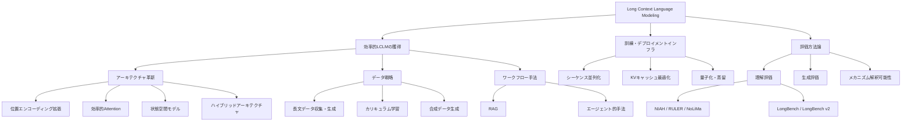

## 論文概要

本記事は [A Comprehensive Survey on Long Context Language Modeling](https://arxiv.org/abs/2503.17407) の解説記事です。

本サーベイは、大規模言語モデル（LLM）のロングコンテキスト処理に関する研究を包括的に整理した論文である。著者らは、効率的なロングコンテキストモデルの獲得方法、訓練・推論インフラストラクチャ、評価方法論の3つのコア次元を軸に、データ戦略、アーキテクチャ設計、ワークフロー手法から、理解・生成タスクの評価パラダイム、メカニズム解釈可能性に至るまで、ロングコンテキスト言語モデリングの全体像を体系化している。37名の研究者による大規模な共著であり、関連する論文・リポジトリを集約したGitHubリポジトリ「LCLM-Horizon」も公開されている。

この記事は [Zenn記事: LLMコンテキストエンジニアリング実践：圧縮・ルーティングで1Mトークンを制御](https://zenn.dev/0h_n0/articles/cfc6a5ad9e22fd) の深掘りです。

## 情報源

- **arXiv ID**: 2503.17407
- **URL**: [https://arxiv.org/abs/2503.17407](https://arxiv.org/abs/2503.17407)
- **著者**: Jiaheng Liu, Dawei Zhu, Zhiqi Bai et al.（37名）
- **初版投稿日**: 2025年3月20日（v1）
- **最新改訂日**: 2025年11月24日（v2）
- **分野**: cs.CL, cs.LG
- **GitHub**: [LCLM-Horizon/A-Comprehensive-Survey-For-Long-Context-Language-Modeling](https://github.com/LCLM-Horizon/A-Comprehensive-Survey-For-Long-Context-Language-Modeling)

## 背景と動機

LLMのコンテキストウィンドウは急速に拡大してきた。GPT-3の2048トークンから、GPT-4の128Kトークン、Gemini 1.5 Proの1Mトークン、そしてClaude 3.5の200Kトークンに至るまで、わずか数年でコンテキスト長は数桁の規模で拡張された。この拡張により、長大な文書の要約、リポジトリ全体のコード理解、マルチターン対話の文脈維持など、従来は不可能だったタスクが実現可能になっている。

しかし、コンテキストウィンドウの拡張は単純なスケーリングでは達成できない。標準的なSelf-Attentionは系列長$n$に対して$O(n^2)$の計算量と$O(n)$のメモリを消費するため、長系列への直接適用は計算コストの壁にぶつかる。さらに、位置エンコーディングの外挿性能、長文訓練データの不足、評価方法の未成熟といった複合的な課題が存在する。

著者らは、これらの課題に対する研究がアーキテクチャ、データ、インフラ、評価の各領域で個別に進展しており、分野横断的な整理が必要であると述べている。本サーベイは、ロングコンテキスト言語モデリングの全体像を俯瞰し、研究者・エンジニアの双方に体系的な知見を提供する目的で執筆されている。

## サーベイの全体構造

著者らが提示するサーベイの分類体系を以下に示す。3つのコア次元を中心に、各次元がさらに複数のサブカテゴリに分岐する構造となっている。

## 効率的ロングコンテキストモデルの獲得

### 位置エンコーディング拡張

ロングコンテキストモデルにおいて、位置エンコーディングは系列内のトークン順序を表現する基盤的な役割を担う。訓練時のコンテキスト長を超える系列への汎化（外挿）能力は、位置エンコーディングの設計に大きく依存する。

#### RoPE（Rotary Position Embedding）

RoPE（Su et al., 2024）は、位置情報を複素平面上の回転として符号化する手法である。位置$m$のトークンに対し、次元$i$での回転角は以下で定義される。

$$
\theta_i = \text{base}^{-2i/d}
$$

ここで、$\text{base}$は通常10,000、$d$はモデルの次元数である。Query $\mathbf{q}$ と Key $\mathbf{k}$ に対する回転操作は次のように表される。

$$
f(\mathbf{q}, m) = \mathbf{q} \odot \cos(m\boldsymbol{\theta}) + \text{rotate}(\mathbf{q}) \odot \sin(m\boldsymbol{\theta})
$$

この定式化により、相対位置情報が内積に自然に反映される。すなわち、$\langle f(\mathbf{q}, m), f(\mathbf{k}, n) \rangle$は相対位置$m - n$のみに依存する。

RoPEの制約は、訓練時のコンテキスト長を大きく超える系列に対して外挿性能が劣化する点にある。この問題に対処するために、以下の拡張手法が提案されている。

#### Position Interpolation（PI）

Position Interpolation（Chen et al., 2023）は、位置インデックスを目標コンテキスト長に対して線形補間する手法である。拡張比率$s$に対し、位置$m$を$m/s$に圧縮することで、訓練済みの位置範囲内にマッピングする。著者らは、この手法がすべての次元を均等に伸張するため、高周波成分の情報損失が生じると指摘している。

#### NTK-Aware Interpolation

NTK-Aware Interpolation（2023）は、PIの高周波情報損失を改善するため、次元ごとに異なるスケーリング係数を適用する手法である。低周波次元（大きな$i$）は周期を伸張し、高周波次元（小さな$i$）は元の解像度を維持する。これにより、fine-tuningなしでのコンテキスト拡張が可能になると報告されている。

#### YaRN（Yet Another RoPE extensioN）

YaRN（Peng et al., 2024）は、NTK-by-partsとAttention softmaxの温度パラメータ調整を組み合わせた手法である。著者らは、YaRNが従来の手法と比較して10倍少ないトークン数と2.5倍少ない訓練ステップで128Kトークンまでのコンテキスト拡張を達成したと報告している。現在のQwen、DeepSeek、LLaMAなどの主要モデルの多くが、コンテキスト拡張にYaRNを採用している。

#### ALiBi（Attention with Linear Biases）

ALiBi（Press et al., 2022）は、位置情報を埋め込みではなくAttentionスコアへの線形バイアスとして直接付加するアプローチである。位置$i$と$j$のトークン間のバイアスは次のように定義される。

$$
\text{bias}(i, j) = -m \cdot |i - j|
$$

ここで、$m$はヘッドごとに設定される勾配パラメータである。距離に対してバイアスが線形に減少するため、修正なしでの長系列への適用が可能とされている。

### 効率的Attention

標準的なSelf-Attentionの$O(n^2)$計算量を削減するための手法が多数提案されている。

#### FlashAttention

FlashAttention（Dao et al., 2022）は、Attentionのアルゴリズム自体を変更するのではなく、GPU上のメモリアクセスパターンを最適化するカーネルレベルの手法である。ブロック単位の行列乗算と再計算戦略を用いて、HBM（High Bandwidth Memory）へのアクセスを$O(n^2)$から$O(n)$に削減する。

具体的には、Query、Key、Valueの行列をSRAM（on-chip memory）に収まるブロックに分割し、各ブロック内でsoftmaxの正規化を段階的に計算する。この手法により、中間のAttention行列を完全に展開することなく計算が完了する。FlashAttention-2（Dao, 2023）では、GPUスレッドブロックとワープの分割を最適化し、初代FlashAttentionに対して約2倍の高速化を達成したと報告されている。

#### Ring Attention

Ring Attention（Liu et al., 2023）は、系列トークンを複数のGPUに分散配置し、リング状の通信パターンでKVサブブロックを交換しながらAttentionを計算する手法である。各プロセッサは自身の担当トークンに対するローカルAttentionを計算し、前後のプロセッサとのみKVブロックを交換する。

この設計により、単一デバイスのメモリ容量を超える系列長の処理が可能になる。著者らは、Ring Attentionがシーケンス並列化の基盤技術として、100万トークン超の系列処理を実現すると述べている。

#### 線形Attention

線形Attention変種は、softmax Attentionを線形複雑度の近似で置き換える手法群である。カーネルベースの手法では、softmax関数を特徴マップ$\phi$で近似する。

$$
\text{Attention}(Q, K, V) \approx \frac{\phi(Q)(\phi(K)^T V)}{\phi(Q) \phi(K)^T \mathbf{1}}
$$

結合律を利用して$\phi(K)^T V$を先に計算することで、計算量を$O(n^2 d)$から$O(n d^2)$に削減する。ここで$d$はヘッド次元であり、$d \ll n$の場合に大きな削減効果がある。ただし、著者らは精度とのトレードオフが存在することを指摘しており、特に長距離依存関係を必要とするタスクでは標準Attentionとの性能差が生じ得ると述べている。

#### スパースAttention

全トークンペア間の相互作用を計算する代わりに、一部のパターンのみを計算するスパースAttention手法も重要なカテゴリである。ローカルウィンドウAttention、ストライドAttention、ブロックスパースAttentionなど、事前定義されたパターンに基づく手法と、トークンの重要度に基づいて動的にスパースパターンを決定する手法が存在する。著者らは、スパースAttentionがFlashAttentionと組み合わせることで実用的な性能を発揮すると述べている。

### 状態空間モデル（SSM）

Attention機構とは根本的に異なるアプローチとして、状態空間モデル（State Space Model; SSM）が注目されている。SSMは制御理論に起源を持ち、連続時間のダイナミクスを離散系列に適用する。

#### Mamba

Mamba（Gu & Dao, 2023）は、選択的SSMを導入した代表的な手法である。標準的なSSMが固定のパラメータ行列で状態遷移を行うのに対し、Mambaは入力に依存してパラメータ$B$、$C$、$\Delta$を動的に決定する選択機構を持つ。

基本的なSSMの状態遷移は以下の式で記述される。

$$
h_t = \bar{A} h_{t-1} + \bar{B} x_t
$$

$$
y_t = C h_t
$$

ここで、$h_t$は隠れ状態、$x_t$は入力、$y_t$は出力、$\bar{A}$と$\bar{B}$は離散化されたパラメータである。Mambaでは$B = B(x_t)$、$C = C(x_t)$、$\Delta = \Delta(x_t)$として入力依存にすることで、トークンごとに情報の取捨選択を行う。

著者らは、Mambaがハードウェアに最適化された並列アルゴリズムにより、系列長に対して線形の計算量を達成すると報告している。SSMスキャン操作は素朴な実装と比較して20-40倍の高速化を実現し、長系列では最適化されたAttentionカーネルを上回る速度を示すとされている。

Mamba-2（Dao & Gu, 2024）では、State Space Duality（SSD）の概念が導入された。SSDにより、SSMとAttentionの両方のモードで動作可能になり、行列乗算を活用した訓練効率の向上と、より大きな状態次元のサポートが実現されている。

#### RWKV

RWKV（Peng et al., 2023）は、Receptance Weighted Key Valueの略称であり、TransformerをRNNとして再定式化する手法である。線形Attention機構を活用し、訓練時にはTransformerのように並列化、推論時にはRNNのように定数メモリで逐次処理する二面性を持つ。

後続のEagle（RWKV-5）とFinch（RWKV-6）では、マルチヘッドの行列値状態と動的再帰機構が導入され、RNNの推論効率を維持しながら表現力が強化されている。ただし、著者らは長距離依存関係を必要とするタスクでは、Attentionベースのアーキテクチャと比較して精度の劣位が見られる傾向があると述べている。

### ハイブリッドアーキテクチャ

Attentionの表現力とSSMの効率性を兼ね備えるため、両者を組み合わせたハイブリッドアーキテクチャが提案されている。

#### Jamba

Jamba（AI21 Labs, 2024）は、TransformerレイヤーとMambaレイヤーを交互に積層し、さらにMixture-of-Experts（MoE）レイヤーを組み込んだハイブリッドモデルである。著者らは、Jambaが256Kトークンの系列を処理可能であり、純粋なTransformerと比較してメモリ使用量を大幅に削減しつつ、スループットと推論効率で優位性を示すと報告している。

#### その他のハイブリッド手法

サーベイでは、Zamba（MambaバックボーンにTransformer Attentionモジュールを共有する構成）、Samba（選択的SSMとSliding Window Attentionの融合）、Hymba（Attentionヘッドとs SSMヘッドを並列に配置する構成）なども整理されている。著者らは、深いネットワークにおいて少数のAttentionブロックを周期的に配置することが、グローバルな文脈的相互作用の維持に重要であると指摘している。

## データ戦略

### 長文データの収集・生成

ロングコンテキストモデルの訓練には、実際に長い系列を持つ訓練データが不可欠である。著者らは、データ戦略を以下の3つのカテゴリに整理している。

**自然長文データの活用**: 書籍、コードリポジトリ、学術論文、法律文書など、自然に長い文書を訓練データとして使用するアプローチである。著者らは、自然長文データが合成データと比較して下流タスクでの評価性能が高いと報告している。

**合成長文データの生成**: 複数の短い文書を連結して長系列を構成する手法である。関連する文書を意味的に近い順に連結するバリエーションや、質問応答ペアを長文内に埋め込むことで長距離依存を明示的に学習させる手法が存在する。ただし、単純な連結では文書境界をまたぐ依存関係の学習が不十分になるリスクがある。

**フィルタリングと品質管理**: 長文データの品質がモデル性能に直接影響するため、重複排除、言語検出、毒性フィルタリングなどの品質管理パイプラインが重要とされている。

### カリキュラム学習

著者らは、コンテキスト長を段階的に拡張するカリキュラム学習戦略が効果的であると述べている。典型的なアプローチでは、まず短い系列（4K-8Kトークン）で事前訓練を行い、次に中程度の系列（32K-64Kトークン）で継続事前訓練を行い、最終的に目標のコンテキスト長（128K-1Mトークン）でfine-tuningを行う。

この段階的拡張により、各段階で必要な計算量を抑えつつ、長系列への汎化能力を獲得できる。著者らは、各段階でのデータ混合比率（短文・中文・長文の比率）が最終性能に大きく影響することを指摘している。

### 合成データ生成

LLMを用いて長文の訓練データを自動生成する手法も整理されている。既存の短い文書をLLMで拡張する手法や、長距離の質問応答ペアを自動生成する手法が含まれる。著者らは、合成データの品質管理が特に重要であり、生成されたデータの事実正確性と文脈的一貫性を検証するフィルタリングパイプラインの必要性を強調している。

## 評価方法論

### 理解評価

ロングコンテキストモデルの理解能力を評価するベンチマークは、合成タスクと自然言語タスクの2つに大別される。

#### NIAH（Needle in a Haystack）

NIAH（Kamradt, 2023）は、長いテキスト（haystack）の中に短い情報（needle）を埋め込み、モデルがそれを検索・抽出できるかを評価する合成ベンチマークである。needleの挿入位置とコンテキスト長を系統的に変化させることで、位置バイアスと検索精度を測定する。NIAHは直感的で解釈しやすい評価手法として広く採用されているが、著者らは字面の一致のみで正解を判定するため、真の理解能力の評価には限界があると指摘している。

#### RULER

RULER（Hsieh et al., 2024）は、NIAHを拡張し、異なる種類のタスクをさまざまな入力長で体系的に評価するベンチマークである。13の合成タスクで構成され、以下の4カテゴリを含む。

- **検索**: Single-Needle（S-NIAH）、Multi-Key（MK-NIAH）、Multi-Query（MQ-NIAH）、Multi-Value（MV-NIAH）の4つのNIAH変種
- **変数追跡**: 入力全体に散在する推移的な変数参照の解決（Variable Tracking）
- **集約**: Common Word Extraction（CWE）、Frequent Word Extraction（FWE）

著者らは、RULERが検索だけでなく、マルチホップ推論や情報集約の能力も評価できる点で、NIAHよりも包括的であると述べている。

#### NoLiMa

NoLiMa（Modarressi et al., 2025; ICML 2025）は、字面の一致に頼らない長コンテキスト評価ベンチマークである。質問とneedleの間の語彙的重複を意図的に排除し、モデルが潜在的な意味的関連性を推論する能力を評価する。

著者らは、128Kトークンをサポートすると主張する13のLLMを評価した結果を引用し、短いコンテキスト（1K未満）では高い性能を示すモデルも、32Kトークンでは11モデルが短コンテキスト時のベースライン性能の50%以下に低下したと報告している。この結果は、字面の手がかりがない場合、現行モデルのロングコンテキスト能力が大幅に制限されることを示唆している。

#### LongBench / LongBench v2

LongBench（Bai et al., 2024）は、初の二言語（英語・中国語）マルチタスクベンチマークであり、多文書QA、単一文書QA、要約、Few-shot学習、コード補完、合成タスクの6カテゴリ・21タスクで構成される。4,750のテストインスタンスを含み、英語で平均6,711語、中国語で平均13,386文字のコンテキスト長を持つ。

LongBench v2（Bai et al., 2024）は、8Kから2M語のコンテキスト長にわたる503の挑戦的な多肢選択問題で構成される。著者らは、人間の専門家が15分の制限時間で53.7%の正答率、最高性能のモデルが直接回答で50.1%の正答率を達成したと報告しており、このベンチマークの難易度の高さを示している。

### 生成評価

ロングコンテキストモデルの生成能力の評価は、理解評価と比較して方法論的な課題が多い。著者らは、長文生成の品質を測定するために、一貫性（coherence）、事実正確性（factual accuracy）、構造的組織化（structural organization）の3つの軸を提示している。LongGenBenchなどのベンチマークが提案されているが、生成品質の自動評価は依然として未解決の課題であると述べている。

### メカニズム解釈可能性

著者らは、ロングコンテキスト処理のメカニズムを理解するための研究も整理している。

**Attention分析**: ロングコンテキストにおけるAttentionパターンの可視化と分析。特に、長系列でのAttentionの分散化（attention sink現象を含む）、位置バイアス（先頭・末尾のトークンへの偏り）、レイヤー間の情報フロー追跡が研究されている。

**情報フロー追跡**: 入力トークンの情報がモデル内部をどのように伝播し、出力に影響するかを追跡する研究。著者らは、この研究方向がモデルの弱点の特定やアーキテクチャ改善の指針として重要であると述べている。

## 訓練・デプロイメントインフラ

### シーケンス並列化

ロングコンテキストモデルの訓練において、単一GPUのメモリに収まらない系列を処理するためのシーケンス並列化技術が不可欠である。

**Tensor Parallelism + Sequence Parallelism**: 系列次元をデバイス間で分割し、各デバイスが系列の一部分を全レイヤーにわたって処理する。勾配の蓄積と通信パターンの設計が性能に大きく影響する。

**Ring Attention**: 前述のRing Attentionは、シーケンス並列化の実現手法としても機能する。各デバイスが系列の一部を担当し、KVブロックをリング状に交換しながらAttentionを計算する。著者らは、100万トークン超の系列訓練がRing Attentionベースのシーケンス並列化により実現可能であると述べている。

**マルチノード構成**: 大規模なシーケンス並列化には、ノード間の高帯域幅通信が必要である。InfiniBand NDR 400GbpsやNVLink 5.0 Switchが推奨され、1ステップあたりのKV転送量をバイセクション帯域幅で割った値が10ms未満であることが、計算利用率80%以上を維持するための目安とされている。

### KVキャッシュ最適化

推論時のKVキャッシュは、コンテキスト長の増加に伴い線形にメモリを消費する。著者らは、以下の最適化手法を整理している。

**量子化**: KVテンソルをFP16からFP8やINT8に量子化することで、メモリフットプリントを50%以上削減する。著者らは、適切なキャリブレーションにより精度劣化を最小限に抑えられると述べている。

**スパースKVキャッシュ**: Attentionパターンに基づいてトークンを選択的に保持する手法である。重要度の低いトークンのKVをevictし、重要なトークンのみをキャッシュに残す。H2O（Heavy-Hitter Oracle）やScissorHandsなどの手法が代表例である。

**マルチティアキャッシング**: GPU VRAM、CPU RAM、ディスクストレージを階層的に活用し、アクセス頻度に応じてKVキャッシュを配置する戦略である。GPU上には直近および高頻度アクセスのトークン、CPU上には中頻度のトークン、ディスク上には低頻度のトークンを保持する。

**コンテキスト並列化**: 1Mトークンのリクエストに対して、KVキャッシュを複数のGPUに分散配置することで、単一デバイスのメモリ制約を回避する。

### 量子化・蒸留

モデル全体の量子化（GPTQ、AWQ等）と知識蒸留は、デプロイメントコストの削減に有効であるが、著者らはロングコンテキスト性能への影響を慎重に評価する必要があると述べている。特に、量子化がAttentionの精度に与える影響は短いコンテキストと比較してロングコンテキストでより顕著に現れる傾向がある。

勾配チェックポインティングも訓練時のメモリ最適化手法として重要であり、中間活性値を選択的に再計算することで、メモリ消費を約50%削減できるが、20-30%の計算オーバーヘッドが発生すると報告されている。

## 実運用への応用

本サーベイの各トピックは、関連するZenn記事「[LLMコンテキストエンジニアリング実践：圧縮・ルーティングで1Mトークンを制御](https://zenn.dev/0h_n0/articles/cfc6a5ad9e22fd)」で議論されている実践的なコンテキストエンジニアリング技術と密接に関連している。以下に対応関係を整理する。

| サーベイのトピック | Zenn記事との対応 |
|---|---|
| 位置エンコーディング拡張（RoPE, YaRN） | コンテキストウィンドウの拡張と制約の理解 |
| 効率的Attention（FlashAttention, スパースAttention） | 1Mトークン処理時の計算効率確保 |
| KVキャッシュ最適化 | コンテキスト圧縮戦略の基盤技術 |
| ワークフロー手法（RAG, エージェント） | コンテキストルーティングによるトークン制御 |
| 評価方法論 | ロングコンテキスト活用時の品質検証 |

Zenn記事が実践的な圧縮・ルーティング手法に焦点を当てているのに対し、本サーベイはそれらの技術の学術的基盤と理論的背景を提供する位置付けにある。例えば、Zenn記事で言及されるコンテキスト圧縮技術は、本サーベイのKVキャッシュ最適化やスパースAttentionの研究に直接的な根拠を持つ。同様に、Zenn記事のルーティング戦略は、サーベイが整理するRAGやエージェント的手法の実務的な応用例として理解できる。

## 今後の研究方向

著者らは、本サーベイの総括として以下の研究方向を提示している。

**統一的なアーキテクチャの探索**: Attention、SSM、ハイブリッドの各アプローチにはそれぞれ強みと弱みがあり、すべてのシナリオで優位な単一のアプローチは存在しない。ハードウェア制約、タスク要件、許容可能な精度-効率トレードオフに応じた最適な組み合わせの体系的な探索が必要であると述べている。

**評価方法の高度化**: NIAHやRULERなどの合成ベンチマークは有用であるが、実世界のタスクとの乖離が指摘されている。NoLiMaの結果が示すように、字面の一致に頼らない、より本質的な理解能力の評価が求められる。また、長文生成の品質評価は依然として方法論的課題が大きい。

**効率的な訓練手法**: 100万トークン超の系列で効率的に訓練を行うためのインフラ・アルゴリズムの両面での進展が期待される。特に、シーケンス並列化と通信最適化の共同設計、段階的コンテキスト拡張の最適スケジュールの解明が挙げられている。

**マルチモーダルロングコンテキスト**: テキストだけでなく、画像、動画、音声を含むマルチモーダルな長コンテキスト処理は未開拓の領域が大きい。各モダリティの系列長の違いを統一的に扱うアーキテクチャ設計が課題とされている。

**メカニズム理解の深化**: ロングコンテキスト処理時のモデル内部メカニズム（Attention sink現象、位置バイアス、情報伝播パターン）の理解を深めることが、アーキテクチャ改善の指針になると述べている。

## まとめ

本サーベイは、ロングコンテキスト言語モデリングの全体像を3つのコア次元（効率的LCLMの獲得、訓練・デプロイメントインフラ、評価方法論）で体系的に整理した包括的な論文である。アーキテクチャ革新（RoPE拡張、FlashAttention、Mamba、ハイブリッドモデル）、データ戦略（自然長文データ、カリキュラム学習、合成データ）、評価ベンチマーク（NIAH、RULER、NoLiMa、LongBench）、インフラ技術（シーケンス並列化、KVキャッシュ最適化）の各領域について、現状の到達点と課題が明確に示されている。

著者らの結論として、ロングコンテキスト処理には単一の支配的手法が存在せず、ハードウェア制約・タスク要件・精度-効率トレードオフに応じた複数手法の組み合わせが最適であるとされている。この知見は、実務においてロングコンテキストLLMを活用する際の設計判断の基盤となる。

## 参考文献

- **arXiv**: [https://arxiv.org/abs/2503.17407](https://arxiv.org/abs/2503.17407)
- **GitHub**: [LCLM-Horizon/A-Comprehensive-Survey-For-Long-Context-Language-Modeling](https://github.com/LCLM-Horizon/A-Comprehensive-Survey-For-Long-Context-Language-Modeling)
- **Related Zenn article**: [https://zenn.dev/0h_n0/articles/cfc6a5ad9e22fd](https://zenn.dev/0h_n0/articles/cfc6a5ad9e22fd)
- Su, J. et al. (2024). RoFormer: Enhanced Transformer with Rotary Position Embedding. Neurocomputing.
- Press, O. et al. (2022). Train Short, Test Long: Attention with Linear Biases Enables Input Length Generalization. ICLR 2022.
- Peng, B. et al. (2024). YaRN: Efficient Context Window Extension of Large Language Models. ICLR 2024.
- Dao, T. (2022). FlashAttention: Fast and Memory-Efficient Exact Attention with IO-Awareness. NeurIPS 2022.
- Dao, T. (2023). FlashAttention-2: Faster Attention with Better Parallelism and Work Partitioning.
- Gu, A. & Dao, T. (2023). Mamba: Linear-Time Sequence Modeling with Selective State Spaces.
- Dao, T. & Gu, A. (2024). Transformers are SSMs: Generalized Models and Efficient Algorithms Through Structured State Space Duality.
- Peng, B. et al. (2023). RWKV: Reinventing RNNs for the Transformer Era. EMNLP 2023 Findings.
- Lieber, O. et al. (2024). Jamba: A Hybrid Transformer-Mamba Language Model. ICLR 2025.
- Hsieh, C.-P. et al. (2024). RULER: What's the Real Context Size of Your Long-Context Language Models?
- Modarressi, A. et al. (2025). NoLiMa: Long-Context Evaluation Beyond Literal Matching. ICML 2025.
- Bai, Y. et al. (2024). LongBench: A Bilingual, Multitask Benchmark for Long Context Understanding.
- Bai, Y. et al. (2024). LongBench v2: Towards Deeper Understanding and Reasoning on Realistic Long-context Multitasks.
