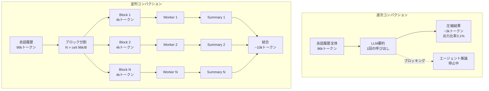

## 論文概要

本記事は [Parallel Context Compaction for Long-Horizon LLM Agent Serving](https://arxiv.org/abs/2605.23296) の解説記事です。

長時間にわたるLLMエージェントの対話では、会話履歴が蓄積されモデルのコンテキストウィンドウを超過するという問題が生じる。従来の対処法であるLLMベースの逐次要約（Sequential Compaction）は、入力長に対して出力長がほぼ一定となる「入力不変性」を持ち、長い会話では情報の大幅な損失を招く。加えて、要約処理中にエージェントの推論がブロックされ、数十秒の遅延が発生する。著者らは、会話履歴をブロック単位に分割し並列に要約する「Parallel Compaction」を提案している。4つのバックボーンアーキテクチャ（8B-120Bパラメータ、Dense/MoE、推論/非推論モデル）を用いて、HotpotQA（マルチホップQA）とLoCoMo（長文脈対話）で評価を行い、エンドツーエンド処理時間の削減とスループット向上を報告している。

この記事は [Zenn記事: LLMコンテキストエンジニアリング実践：圧縮・ルーティングで1Mトークンを制御](https://zenn.dev/0h_n0/articles/cfc6a5ad9e22fd) の深掘りです。

## 情報源

- **arXiv ID**: 2605.23296
- **URL**: [https://arxiv.org/abs/2605.23296](https://arxiv.org/abs/2605.23296)
- **著者**: Musa Cim, Burak Topcu, Chita Das, Mahmut Taylan Kandemir（Pennsylvania State University）
- **発表年**: 2026
- **分野**: cs.AI

## 背景と動機

### 逐次コンパクションの限界

LLMベースの対話エージェント（Claude Code、OpenAI Codex等）は、長時間の対話を通じてタスクを遂行する。対話が進むにつれ会話履歴は増大し、最終的にモデルのコンテキストウィンドウを超過する。この問題に対する標準的な解決策は、LLM自身に会話履歴を要約させるコンテキストコンパクションである。

しかし、著者らは逐次コンパクションに3つの構造的問題があることを指摘している。

**第一に、出力長の入力不変性である。** 著者らの実験（論文Table 1）によると、入力が2kトークンから96kトークンへ48倍に増加しても、出力は981トークンから3,015トークンへ約3倍にしか増加しない。出力/入力比は47.9%から3.1%へ急落する。これは、LLMが訓練データ中の文書-要約ペア（平均500トークン程度）から学習した長さの事前分布を再現するためだと著者らは分析している。プロンプトで「詳細に」と指示しても、この学習済みの長さバイアスを安定的に制御することは困難である。

**第二に、ブロッキング遅延である。** 逐次コンパクションは同期的に実行されるため、要約処理中はエージェントの推論が停止する。論文Table 2によると、コンパクション閾値16kトークンの場合、エンドツーエンド処理時間の51.3-62.4%がコンパクション処理に費やされる。閾値を96kに上げても8.6-14.5%を占める。

**第三に、実行ごとの不安定性である。** 同一入力に対して複数回コンパクションを実行すると、出力長と内容の両面で大きなばらつきが生じる。論文Table 5によると、Llama-3.1-8Bで96kトークン入力時の変動係数（CV）は84.5%、コサイン類似度は0.472まで低下する。入力が長くなるほど、モデルがどの情報を保持するかの選択が不安定になる。

### Anthropic Compaction APIとの関連

Zenn記事で解説したAnthropicのCompaction API（beta: `compact-2026-01-12`）は、閾値ベースのトリガーで自動的にコンテキストを圧縮するプロダクション向け機能である。本論文はこのコンパクションのメカニズム自体を改善する研究であり、逐次処理の限界を並列化で克服するアプローチを提案している。

## 主要な貢献

著者らは以下の貢献を報告している。

- **並列コンパクションフレームワークの提案**: 会話履歴をブロック単位に分割し、プレフィックスキャッシュを活用して並列に要約する手法を導入した。逐次処理のブロッキング遅延を解消し、ブロックサイズとプロンプト指示の2軸で出力ボリュームを制御可能にした。

- **逐次コンパクションの体系的な問題分析**: 出力長の入力不変性、ブロッキング遅延、実行ごとの不安定性という3つの構造的問題を、4つのバックボーンモデルで定量的に検証した。

- **プレフィックスキャッシュ対応のレイアウト設計**: 各ワーカーのプレフィックスが前のワーカーのプレフィックスを厳密に拡張する「Prefix-Aware Target-at-End Layout」を設計し、vLLMのプレフィックスキャッシュを最大限に活用できるようにした。

- **2軸制御メカニズムの実証**: ブロックサイズの調整のみで元のコンテキストの最大50%まで出力ボリュームをスケーリングできることを示した（論文Table 10）。

## 技術的詳細

### 逐次 vs 並列コンパクションの比較

逐次コンパクションでは、会話履歴全体を1回のLLM呼び出しで要約する。入力が長くなるほど出力比率が低下し、情報損失が増大する。



並列コンパクションでは、履歴をブロックに分割し、各ブロックを独立したワーカーで並列に要約する。各ワーカーが短い入力に対して要約を生成するため、入力不変性の影響を受けにくく、合計出力ボリュームを予測的に制御できる。

### 並列分割戦略

並列コンパクションは3つのフェーズで構成される。

**Phase 1: Snapshot & Partition**

会話履歴 $X$ をトークン単位でブロックサイズ $B$ ごとに分割する。ブロック数は以下の式で決まる。

$$
N = \left\lceil \frac{|X|}{B} \right\rceil
$$

ここで、$|X|$ は会話履歴のトークン数、$B$ はブロックサイズ（2k, 4k, 8k, 16kトークンなど）である。

**Phase 2: Dispatch（プレフィックス対応レイアウト）**

各ワーカー $k$ （$k = 1, 2, \ldots, N$）に対して、ブロック1からブロック $k$ までを入力として渡す。ただし、要約対象はブロック $k$ のみであり、`<TARGET_BLOCK>...</TARGET_BLOCK>` マーカーで囲んで明示する。

$$
\text{Input}_k = [B_1, B_2, \ldots, B_{k-1}, \texttt{<TARGET>} B_k \texttt{</TARGET>}] \oplus p^c
$$

ここで $p^c$ はコンパクションプロンプトである。この設計により、ワーカー $k$ のプレフィックスはワーカー $k-1$ のプレフィックスを厳密に拡張する形となり、vLLMのプレフィックスキャッシュが有効に機能する。ワーカー $k$ は先行ブロックの文脈を保持した上でブロック $k$ のみを要約するため、ブロック間の文脈依存関係が維持される。

**Phase 3: Merge**

各ワーカーの出力を順序通りに結合し、圧縮済み会話履歴を構成する。

$$
\hat{H}_t = \bigoplus_{k=1}^{N} \text{Summary}_k
$$

### 要約ボリューム制御メカニズム

著者らは、逐次コンパクションで出力長の制御が困難な原因を「学習済み長さ事前分布」に帰している。LLMは訓練時に文書-要約ペアから「要約は概ね500トークン程度」という分布を内在化しており、推論時にプロンプト指示よりもこの事前分布を優先する傾向がある。

並列コンパクションでは、ブロックサイズ $B$ を小さくすることでワーカー数 $N$ が増加し、各ワーカーが独立に要約を生成するため、合計出力ボリュームは概ね $N$ に比例してスケーリングする。

$$
V_{\text{total}} \approx N \times V_{\text{per-worker}} = \left\lceil \frac{|X|}{B} \right\rceil \times V_{\text{per-worker}}
$$

ここで $V_{\text{per-worker}}$ は各ワーカーの平均出力トークン数である。

論文Table 10（gpt-oss-120B）によると、96kトークン入力に対する出力比率は以下の通りである。

| 設定 | HotpotQA出力比率 | LoCoMo出力比率 |
|------|:---:|:---:|
| 逐次 + Concise | 0.79% | 0.92% |
| 逐次 + Very Detailed | 4.16% | 4.05% |
| 4k + Concise | 12.37% | 16.02% |
| 4k + Very Detailed | 34.13% | 26.57% |
| 2k + Very Detailed | 50.98% | 47.34% |

ブロックサイズとプロンプト指示を組み合わせることで、出力比率を0.79%から50.98%まで広範囲に制御できることが確認されている。

### ターゲットプロンプトエンジニアリング

並列コンパクションの利点の一つは、各ブロックに対して異なるプロンプトを適用できる点である。逐次コンパクションでは会話履歴全体に対して1つのプロンプトしか使えないが、並列コンパクションではブロックの内容種別（ツール出力、推論ステップ、ユーザー対話等）に応じてプロンプトを最適化できる。

例えば、ツール出力が含まれるブロックには「構造化データの要点のみ抽出」、推論ステップが含まれるブロックには「推論の論理構造を保持」といった指示を与えることで、コンテンツタイプに応じた情報保持が可能になる。

### 安定性の定量評価

著者らは安定性を2つの指標で評価している。

**変動係数（CV）**: 出力長の一貫性を測定する。

$$
\text{CV} = \frac{\sigma}{\mu}
$$

ここで $\sigma$ は出力長の標準偏差、$\mu$ は平均値である。CVが小さいほど出力長が安定している。

**コサイン類似度**: 文埋め込みによる意味的一貫性を測定する。値が1.0に近いほど、実行ごとに同じ事実が保持されていることを示す。

論文Table 5によると、並列コンパクション（小さいブロックサイズ）では各ワーカーが短いセグメントを処理するため、モデルの自由度が制約され、実行ごとのばらつきが低減する。

## アルゴリズム

以下は並列コンパクションパイプラインの実装例である。

```python
from __future__ import annotations

import asyncio
from dataclasses import dataclass

import aiohttp


@dataclass(frozen=True)
class CompactionConfig:
    """並列コンパクションの設定パラメータ

    Attributes:
        block_size: ブロックサイズ（トークン数）
        threshold: コンパクション発火閾値（トークン数）
        target_marker_start: ターゲットブロック開始マーカー
        target_marker_end: ターゲットブロック終了マーカー
        compaction_prompt: コンパクションプロンプト
    """

    block_size: int = 4096
    threshold: int = 96_000
    target_marker_start: str = "<TARGET_BLOCK>"
    target_marker_end: str = "</TARGET_BLOCK>"
    compaction_prompt: str = (
        "Summarize only the content within <TARGET_BLOCK> tags. "
        "Preserve key facts, decisions, and context dependencies."
    )


@dataclass(frozen=True)
class CompactionResult:
    """コンパクション結果

    Attributes:
        compacted_history: 圧縮済み会話履歴
        total_input_tokens: 入力トークン数
        total_output_tokens: 出力トークン数
        num_workers: 使用ワーカー数
        compression_ratio: 圧縮率（出力/入力）
    """

    compacted_history: str
    total_input_tokens: int
    total_output_tokens: int
    num_workers: int
    compression_ratio: float


def partition_into_blocks(
    history_tokens: list[int],
    block_size: int,
) -> list[list[int]]:
    """会話履歴をブロックに分割する（Phase 1: Snapshot & Partition）

    Args:
        history_tokens: 会話履歴のトークンID列
        block_size: ブロックサイズ（トークン数）

    Returns:
        ブロックのリスト。各ブロックはトークンID列。
    """
    blocks: list[list[int]] = []
    for i in range(0, len(history_tokens), block_size):
        blocks.append(history_tokens[i : i + block_size])
    return blocks


def build_worker_prompt(
    blocks: list[list[int]],
    worker_index: int,
    tokenizer,
    config: CompactionConfig,
) -> str:
    """Prefix-Aware Target-at-End レイアウトでワーカープロンプトを構築する

    Worker k は Block 1..k-1 をプレフィックスとして受け取り、
    Block k を TARGET_BLOCK マーカーで囲んで要約対象として指示する。
    この設計により vLLM のプレフィックスキャッシュが有効に機能する。

    Args:
        blocks: 全ブロックのリスト
        worker_index: ワーカーインデックス（0-based）
        tokenizer: トークナイザー
        config: コンパクション設定

    Returns:
        ワーカーに渡すプロンプト文字列
    """
    # プレフィックス: Block 0 .. worker_index-1
    prefix_tokens: list[int] = []
    for i in range(worker_index):
        prefix_tokens.extend(blocks[i])
    prefix_text = tokenizer.decode(prefix_tokens)

    # ターゲット: Block worker_index
    target_text = tokenizer.decode(blocks[worker_index])

    return (
        f"{prefix_text}\n\n"
        f"{config.target_marker_start}\n"
        f"{target_text}\n"
        f"{config.target_marker_end}\n\n"
        f"{config.compaction_prompt}"
    )


async def dispatch_worker(
    session: aiohttp.ClientSession,
    vllm_url: str,
    prompt: str,
    model: str,
) -> str:
    """単一ワーカーの要約リクエストを vLLM に送信する

    Args:
        session: aiohttp セッション
        vllm_url: vLLM サーバーの URL
        prompt: ワーカープロンプト
        model: モデル名

    Returns:
        要約テキスト
    """
    payload = {
        "model": model,
        "prompt": prompt,
        "max_tokens": 2048,
        "temperature": 0.0,
    }
    async with session.post(
        f"{vllm_url}/v1/completions",
        json=payload,
        timeout=aiohttp.ClientTimeout(total=120),
    ) as resp:
        resp.raise_for_status()
        data = await resp.json()
        return data["choices"][0]["text"]


async def parallel_compact(
    history_tokens: list[int],
    tokenizer,
    vllm_url: str,
    model: str,
    config: CompactionConfig | None = None,
) -> CompactionResult:
    """並列コンパクションを実行する

    Phase 1: 会話履歴をブロックに分割
    Phase 2: 各ワーカーにプレフィックス対応プロンプトを並列送信
    Phase 3: 要約を結合して圧縮済み履歴を構成

    Args:
        history_tokens: 会話履歴のトークンID列
        tokenizer: トークナイザー
        vllm_url: vLLM サーバーの URL
        model: モデル名
        config: コンパクション設定（省略時はデフォルト値）

    Returns:
        コンパクション結果
    """
    if config is None:
        config = CompactionConfig()

    # Phase 1: Partition
    blocks = partition_into_blocks(history_tokens, config.block_size)
    num_workers = len(blocks)

    # Phase 2: Dispatch（並列実行）
    prompts = [
        build_worker_prompt(blocks, k, tokenizer, config)
        for k in range(num_workers)
    ]

    async with aiohttp.ClientSession() as session:
        tasks = [
            dispatch_worker(session, vllm_url, prompt, model)
            for prompt in prompts
        ]
        summaries = await asyncio.gather(*tasks)

    # Phase 3: Merge
    compacted = "\n\n".join(summaries)

    total_input = len(history_tokens)
    total_output = sum(
        len(tokenizer.encode(s)) for s in summaries
    )

    return CompactionResult(
        compacted_history=compacted,
        total_input_tokens=total_input,
        total_output_tokens=total_output,
        num_workers=num_workers,
        compression_ratio=total_output / total_input if total_input > 0 else 0.0,
    )
```

## 実装のポイント

**ブロックサイズの選定**: 著者らの分析によると、4kトークンが安定性と性能のバランスが最も良い。ブロックサイズが小さすぎる（2k）とワーカー数が増えてオーバーヘッドが増大し、大きすぎる（16k）とプレフィックスキャッシュの未キャッシュ部分が大きくなり、プリフィル処理のオーバーヘッドが並列化の利得を相殺する。

**プレフィックスキャッシュの活用**: vLLMのプレフィックスキャッシュ機能（chunked prefill対応）を前提とした設計であり、ワーカー $k$ のプレフィックスがワーカー $k-1$ を厳密に拡張するレイアウトにすることで、KVキャッシュの再利用率を最大化する。キャッシュが効かない環境ではプリフィルコストが顕著に増加するため注意が必要である。

**評価モデルの選定**: 著者らはQwen3-30Bを独立したLLM-as-judgeとして使用し、モデルファミリーバイアスを回避している。自社モデルで自社の出力を評価する循環を避ける設計は、実運用でのA/Bテスト設計にも参考になる。

**コンパクション閾値の設計**: 閾値が低すぎると頻繁にコンパクションが発生しオーバーヘッドが増大する（16k閾値で15回のコンパクション、論文Table 2）。閾値が高すぎると1回のコンパクションで処理する入力が大きくなり、逐次方式の出力不変性問題がより深刻になる。著者らは96kトークンの閾値を主な評価条件としている。

## Production Deployment Guide

### AWS実装パターン（コスト最適化重視）

並列コンパクションをプロダクション環境にデプロイする場合、vLLMサーバーのGPUクラスタとエージェントサービスを分離する構成が基本となる。

**トラフィック量別の推奨構成**:

| 構成 | 想定規模 | 主要サービス | 月額概算 |
|------|---------|------------|---------|
| Small | ~100セッション/日 | Lambda + Bedrock | $200-500 |
| Medium | ~1,000セッション/日 | ECS Fargate + vLLM on g5.xlarge | $2,000-5,000 |
| Large | 10,000+セッション/日 | EKS + Karpenter + g5.48xlarge Spot | $8,000-20,000 |

**Small構成**: エージェントロジックをLambdaで実行し、コンパクション処理はAmazon BedrockのClaude APIを利用する。Bedrockの`compact-2026-01-12` betaを活用すれば、並列コンパクションロジックを自前実装せずに閾値ベースの自動圧縮が利用可能である。月額の主要コストはBedrockのトークン消費量（入出力合計）。

**Medium構成**: ECS Fargateでエージェントサービスを稼働させ、g5.xlargeインスタンス（NVIDIA A10G 24GB）でvLLMサーバーを運用する。8B-20Bモデルであれば単一GPUでサービング可能。プレフィックスキャッシュを有効化し、並列ワーカーを同一vLLMインスタンスにディスパッチすることでキャッシュヒット率を最大化する。

**Large構成**: EKS上でKarpenterを使用してGPUノードを自動スケーリングする。70B以上のモデルではg5.48xlarge（8x A10G）またはp4d.24xlarge（8x A100 40GB）が必要。Spot Instancesを活用することで最大70%のコスト削減が見込める。

**コスト削減テクニック**:
- Spot Instances活用: g5系インスタンスで最大70%削減（中断リスクがあるため、コンパクション処理にリトライ機構を実装）
- Reserved Instances: 1年コミットで最大40%削減（ベースライン負荷分に適用）
- Bedrock Batch API: 非リアルタイムの事前コンパクション処理で50%削減
- Prompt Caching: Bedrockのプロンプトキャッシュで反復プレフィックスのコストを最大90%削減

**コスト試算の注意事項**: 上記は2026年7月時点のAWS ap-northeast-1（東京）リージョン料金に基づく概算値である。実際のコストはトラフィックパターン、モデルサイズ、コンパクション頻度により変動する。最新料金はAWS料金計算ツールで確認を推奨する。

### Terraformインフラコード

**Small構成（Serverless）**: Lambda + Bedrock

```hcl
# --- Small構成: Lambda + Bedrock ---
# コンパクション処理をBedrockに委譲するサーバーレス構成

terraform {
  required_version = ">= 1.9"
  required_providers {
    aws = { source = "hashicorp/aws", version = "~> 5.60" }
  }
}

provider "aws" {
  region = "ap-northeast-1"
}

# IAMロール（最小権限）
resource "aws_iam_role" "agent_lambda" {
  name = "parallel-compaction-agent-role"
  assume_role_policy = jsonencode({
    Version = "2012-10-17"
    Statement = [{
      Action    = "sts:AssumeRole"
      Effect    = "Allow"
      Principal = { Service = "lambda.amazonaws.com" }
    }]
  })
}

resource "aws_iam_role_policy" "bedrock_invoke" {
  name = "bedrock-invoke"
  role = aws_iam_role.agent_lambda.id
  policy = jsonencode({
    Version = "2012-10-17"
    Statement = [
      {
        Effect   = "Allow"
        Action   = ["bedrock:InvokeModel", "bedrock:InvokeModelWithResponseStream"]
        Resource = "arn:aws:bedrock:ap-northeast-1::foundation-model/anthropic.claude-*"
      },
      {
        Effect   = "Allow"
        Action   = ["logs:CreateLogGroup", "logs:CreateLogStream", "logs:PutLogEvents"]
        Resource = "arn:aws:logs:ap-northeast-1:*:*"
      },
      {
        Effect   = "Allow"
        Action   = ["dynamodb:GetItem", "dynamodb:PutItem", "dynamodb:UpdateItem", "dynamodb:Query"]
        Resource = aws_dynamodb_table.sessions.arn
      }
    ]
  })
}

# セッション管理用DynamoDB（On-Demand）
resource "aws_dynamodb_table" "sessions" {
  name         = "compaction-sessions"
  billing_mode = "PAY_PER_REQUEST"
  hash_key     = "session_id"

  attribute {
    name = "session_id"
    type = "S"
  }

  # KMS暗号化
  server_side_encryption {
    enabled = true
  }

  point_in_time_recovery {
    enabled = true
  }
}

# Lambda関数
resource "aws_lambda_function" "agent" {
  function_name = "parallel-compaction-agent"
  role          = aws_iam_role.agent_lambda.arn
  runtime       = "python3.12"
  handler       = "handler.lambda_handler"
  filename      = "lambda.zip"
  memory_size   = 512
  timeout       = 300 # コンパクション処理のため5分

  environment {
    variables = {
      COMPACTION_BLOCK_SIZE = "4096"
      COMPACTION_THRESHOLD  = "96000"
      SESSION_TABLE         = aws_dynamodb_table.sessions.name
    }
  }

  tracing_config {
    mode = "Active" # X-Ray有効化
  }
}

# CloudWatchアラーム（コスト監視）
resource "aws_cloudwatch_metric_alarm" "lambda_duration" {
  alarm_name          = "compaction-lambda-high-duration"
  comparison_operator = "GreaterThanThreshold"
  evaluation_periods  = 3
  metric_name         = "Duration"
  namespace           = "AWS/Lambda"
  period              = 300
  statistic           = "p95"
  threshold           = 120000 # 120秒
  alarm_description   = "Compaction Lambda p95 latency exceeds 120s"

  dimensions = {
    FunctionName = aws_lambda_function.agent.function_name
  }
}
```

**Large構成（Container）**: EKS + Karpenter + vLLM

```hcl
# --- Large構成: EKS + vLLM GPU Serving ---

module "eks" {
  source          = "terraform-aws-modules/eks/aws"
  version         = "~> 20.24"
  cluster_name    = "compaction-cluster"
  cluster_version = "1.31"

  vpc_id     = module.vpc.vpc_id
  subnet_ids = module.vpc.private_subnets

  # Karpenterノード用
  eks_managed_node_groups = {
    system = {
      instance_types = ["m7i.large"]
      min_size       = 2
      max_size       = 4
      desired_size   = 2
    }
  }
}

# Karpenter Provisioner（GPU Spot優先）
resource "kubectl_manifest" "gpu_nodepool" {
  yaml_body = <<-YAML
    apiVersion: karpenter.sh/v1
    kind: NodePool
    metadata:
      name: gpu-compaction
    spec:
      template:
        spec:
          nodeClassRef:
            group: karpenter.k8s.aws
            kind: EC2NodeClass
            name: gpu
          requirements:
            - key: node.kubernetes.io/instance-type
              operator: In
              values: ["g5.xlarge", "g5.2xlarge", "g5.4xlarge"]
            - key: karpenter.sh/capacity-type
              operator: In
              values: ["spot", "on-demand"]  # Spot優先
            - key: topology.kubernetes.io/zone
              operator: In
              values: ["ap-northeast-1a", "ap-northeast-1c"]
          taints:
            - key: nvidia.com/gpu
              effect: NoSchedule
      limits:
        cpu: "128"
        memory: "512Gi"
        nvidia.com/gpu: "16"
      disruption:
        consolidationPolicy: WhenEmptyOrUnderutilized
        consolidateAfter: 60s
  YAML
}

# Secrets Manager（モデル設定）
resource "aws_secretsmanager_secret" "vllm_config" {
  name = "compaction/vllm-config"
}

# AWS Budgets（月次予算アラート）
resource "aws_budgets_budget" "gpu_monthly" {
  name         = "compaction-gpu-budget"
  budget_type  = "COST"
  limit_amount = "10000"
  limit_unit   = "USD"
  time_unit    = "MONTHLY"

  notification {
    comparison_operator       = "GREATER_THAN"
    threshold                 = 80
    threshold_type            = "PERCENTAGE"
    notification_type         = "ACTUAL"
    subscriber_email_addresses = ["ops-team@example.com"]
  }
}
```

### 運用・監視設定

**CloudWatch Logs Insights クエリ**（コンパクションのレイテンシ分析）:

```
fields @timestamp, @message
| filter @message like /compaction/
| stats avg(duration_ms) as avg_latency,
        pct(duration_ms, 95) as p95_latency,
        pct(duration_ms, 99) as p99_latency,
        avg(num_workers) as avg_workers,
        avg(compression_ratio) as avg_ratio
  by bin(1h) as time_bucket
| sort time_bucket desc
```

**CloudWatch アラーム設定コード（Python）**:

```python
import boto3


def create_compaction_alarms(function_name: str, sns_topic_arn: str) -> None:
    """コンパクション処理の異常検知アラームを設定する

    Args:
        function_name: Lambda関数名またはECSサービス名
        sns_topic_arn: 通知先SNSトピックのARN
    """
    cw = boto3.client("cloudwatch", region_name="ap-northeast-1")

    # トークン使用量スパイク検知
    cw.put_metric_alarm(
        AlarmName=f"{function_name}-token-spike",
        MetricName="CompactionOutputTokens",
        Namespace="CustomMetrics/Compaction",
        Statistic="Sum",
        Period=3600,
        EvaluationPeriods=1,
        Threshold=500_000,
        ComparisonOperator="GreaterThanThreshold",
        AlarmActions=[sns_topic_arn],
        AlarmDescription="1時間あたりのコンパクション出力トークンが50万を超過",
    )
```

**Cost Explorer自動レポート（Python）**:

```python
import datetime

import boto3


def get_daily_compaction_cost(days_back: int = 7) -> list[dict]:
    """過去N日間のコンパクション関連コストを取得する

    Args:
        days_back: 遡る日数

    Returns:
        日次コストのリスト
    """
    ce = boto3.client("ce", region_name="us-east-1")

    end = datetime.date.today()
    start = end - datetime.timedelta(days=days_back)

    response = ce.get_cost_and_usage(
        TimePeriod={"Start": start.isoformat(), "End": end.isoformat()},
        Granularity="DAILY",
        Metrics=["UnblendedCost"],
        Filter={
            "Tags": {
                "Key": "Project",
                "Values": ["parallel-compaction"],
            }
        },
        GroupBy=[{"Type": "DIMENSION", "Key": "SERVICE"}],
    )

    return [
        {
            "date": period["TimePeriod"]["Start"],
            "service": group["Keys"][0],
            "cost_usd": float(group["Metrics"]["UnblendedCost"]["Amount"]),
        }
        for period in response["ResultsByTime"]
        for group in period["Groups"]
    ]
```

### コスト最適化チェックリスト

**アーキテクチャ選択**:
- [ ] トラフィック量に応じた構成を選択（Small: Serverless / Medium: Hybrid / Large: Container）
- [ ] GPU要件の確認（8Bモデル: 単一A10G / 70B+: マルチGPU）

**リソース最適化**:
- [ ] EC2/EKS: GPU Spot Instancesを優先（g5系で最大70%削減）
- [ ] Reserved Instances: ベースライン負荷分に1年コミット（最大40%削減）
- [ ] Savings Plans: コンピュートプラン検討
- [ ] Lambda: メモリサイズ最適化（512MB推奨、Power Tuningで検証）
- [ ] EKS: Karpenterでアイドル時のノード自動縮退（consolidateAfter: 60s）

**LLMコスト削減**:
- [ ] Bedrock Batch API: 非リアルタイム処理で50%削減
- [ ] Prompt Caching有効化: プレフィックス共有で30-90%削減
- [ ] モデル選択ロジック: コンパクション用に小型モデル（8B）を使い分け
- [ ] ブロックサイズ最適化: 4kトークンをデフォルトとし、精度要件に応じて調整
- [ ] トークン数制限: `max_tokens`でワーカー出力長を制約

**監視・アラート**:
- [ ] AWS Budgets: 月次GPU予算アラート設定
- [ ] CloudWatchアラーム: コンパクションレイテンシP95監視
- [ ] Cost Anomaly Detection有効化
- [ ] 日次コストレポート: Cost Explorer APIで自動取得
- [ ] トークン使用量ダッシュボード: 入出力トークン比率を可視化

**リソース管理**:
- [ ] 未使用GPUインスタンス自動停止
- [ ] タグ戦略: `Project=parallel-compaction` で全リソースにタグ付け
- [ ] EBSボリュームのライフサイクルポリシー設定
- [ ] 開発環境の夜間・休日自動停止
- [ ] vLLMモデルキャッシュのS3退避（停止時）

## 実験結果

### 評価モデルとベンチマーク

著者らは以下の4モデルで評価を行っている。

| モデル | パラメータ数 | アーキテクチャ | コンテキスト長 | 推論モデル |
|--------|:---:|:---:|:---:|:---:|
| Llama-3.1-8B | 8B | Dense | 128k | No |
| gpt-oss-20B | 20B | MoE | 128k | Yes |
| Llama-3.3-70B | 70B | Dense | 128k | No |
| gpt-oss-120B | 120B | MoE | 128k | Yes |

ベンチマークはHotpotQA（マルチホップQA、~1.2kトークン/文書、1問/文書）とLoCoMo（長文脈対話、~0.7kトークン/文書、6問/文書）を使用し、Qwen3-30Bを独立したLLM-as-judgeとしている。

### HotpotQAでの性能比較

論文Table 7（gpt-oss-20B、閾値96k）のエンドツーエンド結果:

| ブロックサイズ | E2E処理時間 | 速度比 | E2Eスループット | コンパクション出力 |
|:---:|:---:|:---:|:---:|:---:|
| 逐次 | 214.5s | 1.00x | 51.0 tok/s | 1,462 tok |
| 16k | 276.0s | 0.78x | 49.8 tok/s | 4,116 tok |
| 8k | 270.3s | 0.79x | 59.7 tok/s | 6,994 tok |
| 4k | 217.7s | 0.99x | 90.0 tok/s | 9,894 tok |
| 2k | 233.1s | 0.92x | 109.0 tok/s | 16,486 tok |

論文Table 7（Llama-3.3-70B、閾値96k）のエンドツーエンド結果:

| ブロックサイズ | E2E処理時間 | 速度比 | E2Eスループット | コンパクション出力 |
|:---:|:---:|:---:|:---:|:---:|
| 逐次 | 373.5s | 1.00x | 39.0 tok/s | 8,582 tok |
| 16k | 289.7s | 1.29x | 39.6 tok/s | 5,317 tok |
| 8k | 268.5s | 1.39x | 46.4 tok/s | 6,823 tok |
| 4k | 266.6s | 1.40x | 52.5 tok/s | 8,360 tok |
| 2k | 292.4s | 1.28x | 64.1 tok/s | 12,303 tok |

Llama-3.3-70Bでは、4kブロックサイズで逐次方式に対して1.40倍のE2E処理時間削減を達成している。

### LoCoMoでの性能比較

論文Table 8（gpt-oss-120B、閾値96k）の結果:

| ブロックサイズ | E2E処理時間 | 速度比 | E2Eスループット |
|:---:|:---:|:---:|:---:|
| 逐次 | 4905.0s | 1.00x | 19.9 tok/s |
| 16k | 3297.0s | 1.49x | 30.2 tok/s |
| 8k | 3065.3s | 1.60x | 34.4 tok/s |
| 4k | 3601.6s | 1.36x | 30.7 tok/s |
| 2k | 3851.9s | 1.27x | 32.1 tok/s |

gpt-oss-120Bでは8kブロックサイズが最適となり、1.60倍の速度向上を達成している。最適ブロックサイズがモデルとベンチマークによって異なることから、実運用ではプロファイリングに基づく選定が必要である。

### マッチドデコードボリュームでの比較

公平な比較のため、著者らは逐次方式とほぼ同じトークン数を出力するブロックサイズでの性能を比較している（論文Table 9）。

| モデル | ベンチマーク | 逐次出力 | 並列出力 | スループット向上 |
|--------|:---:|:---:|:---:|:---:|
| Llama-3.3-70B | HotpotQA | 8,582 tok | 8,360 tok | 2.13x |
| Llama-3.3-70B | HotpotQA | 8,582 tok | 6,823 tok | 1.70x |
| gpt-oss-20B | LoCoMo | 6,344 tok | 5,860 tok | 1.49x |

同等のデコードボリュームにおいて、並列方式はTPOT（Time Per Output Token）で最大2.13倍のスループット向上を達成している。

### 精度への影響

著者らは、ブロックサイズが小さくなるにつれて精度が向上する傾向を報告している（論文Figure 4）。合計コンパクション出力トークン数と精度の間にほぼ線形の関係が確認されており、ワーカー数の増加により情報保持量が増えることが精度向上に寄与していると著者らは分析している。

## 実運用への応用

### Anthropic Compaction APIとの関連付け

Zenn記事で解説したAnthropicのCompaction API（`compact-2026-01-12`）は、逐次方式のコンパクションを閾値ベースで自動実行する。本論文の知見を踏まえると、プロダクション環境では以下の戦略が考えられる。

**短期（現在利用可能）**: Anthropic Compaction APIを閾値70%（コンテキストウィンドウの70%到達時）に設定し、自動コンパクションを適用する。単一セッションの対話であればこの構成で十分である。

**中期（自前vLLM環境構築時）**: vLLMのプレフィックスキャッシュを有効化し、本論文の並列コンパクションを4kブロックサイズで実装する。長時間のコーディングエージェントやリサーチエージェントなど、数百ターンの対話が発生するユースケースで有効である。

**長期（フレームワーク統合）**: LangGraph/LlamaIndexなどのエージェントフレームワークに並列コンパクションを組み込み、コンテンツタイプ（ツール出力、推論ログ、ユーザーメッセージ）ごとに異なる圧縮プロンプトを適用する。著者らが将来方向として言及している動的ブロックサイズの導入も検討に値する。

### エージェントフレームワークへの適用

Claude Code、OpenAI Codex、Google ADKなどの長時間エージェントでは、コンテキスト管理は既に必須機能となっている。ADK Python v1.16.0+ではコンテキストコンパクションがビルトインで提供されているが、現時点では逐次方式である。本論文の並列コンパクションをフレームワークレベルで統合することで、エージェントの長時間稼働性能をさらに向上させる余地がある。

## 関連研究

- **CompactionRL**（Li et al., 2026, arXiv: 2607.05378）: コンテキストコンパクションを強化学習のロールアウト中に組み込み、タスク実行と要約生成を同時に最適化する手法。GLM-4.5-Air（106B-A30B）でSWE-bench Verified 66.8%を達成したと報告されている。本論文がコンパクションの「推論時」の効率化に焦点を当てるのに対し、CompactionRLは「訓練時」にコンパクションを学習する点で相補的である。

- **IterResearch**（Chen et al., ICLR 2026, arXiv: 2511.07327）: 長ホライズンリサーチエージェントをマルコフ決定過程として定式化し、ワークスペースの再構成により40kコンテキストで2048+ツール呼び出しを実現する。コンパクションではなく「状態再構成」というアプローチをとり、6ベンチマークで平均14.5ポイントの改善を報告している。

- **ReSum**（Wu et al., ICLR 2026, arXiv: 2509.13313）: 長ホライズン検索エージェントにおいて、要約ツールを周期的に呼び出して会話履歴を圧縮し、無限の探索深度を可能にする手法。ReSum-GRPOにより要約の活用を強化学習で最適化している。コンパクションの実行方式ではなく、エージェントがコンパクション結果をどう活用するかに焦点を当てている。

- **MemGPT**（Packer et al., 2023）: OSの仮想メモリに着想を得た階層的メモリ管理を提案し、LLMが自らメイン/アーカイバルメモリ間のページングを管理する。再帰的要約方式を採用しており、本論文が指摘する逐次コンパクションの不安定性が該当する可能性がある。

- **CWL: Beyond Compaction**（Semenov & Dorofeev, 2026, arXiv: 2606.11213）: 要約に代わり、完了したエピソードの構造化された削除（Eviction）を行うContext Window Lifecycle管理を提案する。80Mトークンにわたる89タスクを精度劣化なく処理したと報告されている。コンパクション（情報の圧縮）ではなくEviction（情報の構造化削除）という対照的なアプローチである。

- **LLMLingua / LLMLingua-2**（Jiang et al., 2023; Pan et al., ACL 2024）: トークンレベルの圧縮によりプロンプト長を削減する手法。LLMLinguaはperplexityベース、LLMLingua-2はトークン分類ベースで20倍の圧縮を達成する。本論文のLLMベースの要約圧縮とは異なり、小型モデルによるトークン除去アプローチである。

## まとめと今後の展望

本論文は、長時間LLMエージェントにおける逐次コンテキストコンパクションの3つの構造的問題（出力長の入力不変性、ブロッキング遅延、実行ごとの不安定性）を定量的に明らかにし、ブロックベースの並列コンパクションによる解決策を提示した。プレフィックスキャッシュ対応のレイアウト設計により、並列化のオーバーヘッドを抑えつつ、ブロックサイズとプロンプト指示の2軸で出力ボリュームを0.79%-50.98%の範囲で制御可能であることを示している。

今後の研究方向として、著者らはコンテンツタイプに応じた動的ブロックサイズの適用（ツール出力と推論ステップで異なるブロックサイズを使用）、ターゲットブロックマーカーの認識を改善するモデルファインチューニング、およびツール実行やAPI呼び出しの待機中にGPUアイドル時間を活用した非同期コンパクションを挙げている。

LLMエージェントの長時間稼働が一般化する中で、コンテキスト管理は推論性能と直結する基盤技術となりつつある。本論文の並列コンパクションは、既存のvLLMインフラ上で実装可能な実用的な手法であり、エージェントフレームワークへの統合が期待される。

## 参考文献

- **arXiv**: [https://arxiv.org/abs/2605.23296](https://arxiv.org/abs/2605.23296)
- **CompactionRL**: [https://arxiv.org/abs/2607.05378](https://arxiv.org/abs/2607.05378)
- **IterResearch**: [https://arxiv.org/abs/2511.07327](https://arxiv.org/abs/2511.07327)
- **ReSum**: [https://arxiv.org/abs/2509.13313](https://arxiv.org/abs/2509.13313)
- **CWL (Beyond Compaction)**: [https://arxiv.org/abs/2606.11213](https://arxiv.org/abs/2606.11213)
- **Anthropic Compaction API**: [https://platform.claude.com/docs/en/build-with-claude/compaction](https://platform.claude.com/docs/en/build-with-claude/compaction)
- **Related Zenn article**: [https://zenn.dev/0h_n0/articles/cfc6a5ad9e22fd](https://zenn.dev/0h_n0/articles/cfc6a5ad9e22fd)
