## 論文概要

本記事は [Less Context, Better Agents: Efficient Context Engineering for Long-Horizon Tool-Using LLM Agents](https://arxiv.org/abs/2606.10209) の解説記事です。

本論文は、エンタープライズ環境でのツール使用LLMエージェントのコンテキスト管理に焦点を当てた実証研究である。Microsoft Dynamics 365 F&OのMCPツールを用いたホテル経費自動仕分けタスクにおいて、4つのコンテキスト管理戦略をGPT-5で比較評価している。著者らは、全履歴保持（完了率71.0%、約148万トークン）に対し、直近5回のツール応答保持+自動要約が完了率91.6%を約55万トークンで達成したと報告している。コンテキストを減らすことで信頼性と効率の双方が向上するという結果を体系的に実証した研究である。

この記事は [Zenn記事: LLMコンテキストエンジニアリング実践：圧縮・ルーティングで1Mトークンを制御](https://zenn.dev/0h_n0/articles/cfc6a5ad9e22fd) の深掘りです。

## 情報源

- **arXiv ID**: 2606.10209
- **URL**: [https://arxiv.org/abs/2606.10209](https://arxiv.org/abs/2606.10209)
- **著者**: Abhilasha Lodha, Mahsa Pahlavikhah Varnosfaderani, Abir Chakraborty, Abhinav Mithal
- **所属**: Microsoft
- **投稿日**: 2026年6月8日
- **分野**: cs.AI, cs.LG, cs.SE
- **ページ数**: 17ページ、3図、8表

## 背景と動機

### エンタープライズエージェントのコンテキスト課題

エンタープライズ業務を自動化するLLMエージェントは、ERPシステムやCRMなどの業務アプリケーションと多数回のツール呼び出しを介して対話する。たとえばホテルの経費精算を自動化する場合、1つの領収書に対して宿泊費・税金・駐車場代・インターネット利用料など4〜23の個別項目を正確に仕分ける必要があり、15〜30回のツール呼び出しが発生する。

ここで問題となるのがツール応答の冗長性である。著者らによれば、D365 F&Oの単一のツール応答は500〜3,000トークンを含み、フォームの全フィールド状態を返す。複雑な仕分けタスクでは会話履歴全体が50,000〜150,000トークン以上に膨張し、入力トークンが全トークン使用量の99.75%〜99.87%を占める（論文Section 5より）。

### Context Rot（コンテキスト腐敗）

著者らは「Context Rot」と呼ばれる現象を論文の中心的な問題として位置付けている。これは、コンテキストウィンドウのハードリミットに達する前に、トークン数の増加に伴ってモデルの実効的な情報回想能力が低下する現象である。

ERPシステムでは状態が頻繁に更新されるため、古いツール応答に含まれるフォーム状態はすでに過去のものとなっている。にもかかわらず全履歴を保持すると、エージェントが古い状態を参照して誤ったフィールドに値を入力する「stale-state reference」エラーが発生する。著者らの失敗分析によれば、全履歴保持（C2）での失敗73件中34件（47%）がstale-state referenceに起因している（論文Table 5より）。

従来のトークンレベル圧縮（LLMLingua等）はERPフォーム状態のフィールド名と値の対応を破壊するリスクがある。著者らはツール呼び出し/応答ペアを「意味的単位」として扱う手法を提案し、この問題を回避している。

## 主要な貢献

著者らは以下の4点を主要な貢献として挙げている。

- **コンテキスト管理戦略の体系的比較**: ユーザーモデルなし（C1）、全履歴保持（C2）、直近Nツール呼び出し保持によるプルーニング（C3）、プルーニング+自動要約（C4）の4構成を50タスクベンチマークで5回ずつ評価し、信頼区間付きの定量比較を行っている。

- **Context Rotの実証的確認と対処**: 全履歴保持がむしろ性能を低下させることを実証し、選択的なコンテキスト保持がContext Rotへの有効な対策であることを示している。

- **意味的単位でのコンテキスト工学**: トークンレベルではなくツール呼び出し/応答ペア単位で操作する決定論的アルゴリズム（Algorithm 1: ConstructContext）を提案し、ERPフォーム状態の構造を保持しつつコンテキストを削減している。

- **クロスモデル汎化性の検証**: GPT-5での結果がClaude Sonnet 4.5でも再現されることを確認し、手法のモデル非依存性を示している。さらに、ホテル以外の経費カテゴリ（旅費、食費・贈答品）でも同様のパターンが保たれることを報告している。

## 技術的詳細

### 4つのコンテキスト管理戦略

著者らが比較した4つの構成は、コンテキストウィンドウに含める情報量が段階的に異なる。以下のダイアグラムは各戦略のデータフローを示している。

```mermaid
graph TD
    A[タスク入力] --> B{コンテキスト戦略}
    B -->|C1| C1[システムプロンプトのみ]
    B -->|C2| C2[全履歴保持]
    B -->|C3| C3[直近N回保持]
    B -->|C4| C4[直近N回+要約]
    C1 & C2 & C3 & C4 --> D[LLMエージェント]
    D --> E[MCPツール 21種]
    E --> F[D365 F&O]
    F -->|500-3000 tok/回| B
```



**C1: ユーザーモデルなし** -- システムプロンプトとタスク指示のみ。ユーザーモデル（GPT-4.1）が存在せず、GPT-5は多くのタスクで応答停止し完了率8.0%にとどまった。

**C2: 全会話履歴保持** -- 全ツール呼び出し/応答を保持。完了率71.0%だが約148万トークンを消費する。

**C3: プルーニング** -- 直近N回（デフォルトN=5）のペアのみ保持。完了率79.0%でトークン数63.9%削減。

**C4: プルーニング+要約** -- C3に加え退避ペアの直近W個（デフォルトW=3）を要約挿入。完了率91.6%。

### プルーニング手法の設計

プルーニングの核心は「意味的単位」の定義にある。著者らは、ツール呼び出しメッセージ（assistant role, tool_call）とそれに対するツール応答メッセージ（tool role）のペアを1つの意味的単位として扱う。

退避の判定基準は純粋に時系列順序であり、最も古いツール呼び出し/応答ペアから順に退避される。退避数$d$は以下の式で決定される。

$$
d = \max(0, \, c - N)
$$

ここで、
- $c$: 現在の会話履歴中のツールメッセージ数
- $N$: 保持するツール呼び出し/応答ペア数（デフォルト5）
- $d$: 退避するペア数

$d = 0$のとき、すなわちツールメッセージ数がN以下の場合は会話履歴をそのまま返す。

### 自動要約の仕組み

プルーニングで退避されたペアのうち、直近$W$個（デフォルト$W=3$）が要約対象となる。$W = -1$の場合は退避された全ペアが要約対象となる。

要約はLLMで生成され、タスクレベルの状況認識を保持する設計である。退避されたツール操作の「何をどこまでやったか」を簡潔に記録し、フォームの現在状態ではなく操作履歴を保存する点が特徴的である。退避位置に要約テキストが挿入される。

### MCPツール統合

実験環境は4コンポーネント構成である。GPT-5エージェント（メインLLM）、ユーザーモデル（GPT-4.1、エージェントの質問に応答）、D365 F&O MCPサーバー（21ツール: フォーム操作13、データ取得6、API 2）、評価ハーネス（ループ管理・コンテキスト工学適用・メトリクス収集）。MCPツール応答はフィールド名と値の構造化データを含むため、トークンレベル圧縮ではフィールド対応が破壊されるリスクがあり、意味的単位での操作が必要となる。

### コスト・性能のトレードオフ分析

著者らは入力トークンが全トークン使用量の99.75%〜99.87%を占めると報告しており、コンテキスト管理戦略の効果はほぼ入力トークンの削減量で決まる。

トークン効率を指標$\eta$として以下のように定義できる。

$$
\eta = \frac{\text{Complete Itemization Rate}}{\text{Total Tokens (K)}}
$$

各構成の$\eta$を計算すると、

$$
\eta_{C2} = \frac{71.0}{1481.0} = 0.0479 \, \%/\text{Ktoken}
$$

$$
\eta_{C3} = \frac{79.0}{535.3} = 0.1476 \, \%/\text{Ktoken}
$$

$$
\eta_{C4} = \frac{91.6}{553.4} = 0.1656 \, \%/\text{Ktoken}
$$

C4のトークン効率はC2の約3.5倍であり、少ないトークンで高い完了率を達成していることが定量的に確認できる。

時間効率についても同様のパターンが見られる。C2が14.56時間を要するのに対し、C4は5.79時間で処理を完了しており、60.2%の時間削減を実現している（論文Table 2より）。

## アルゴリズム

著者らが提案するAlgorithm 1: ConstructContextをPythonで実装すると以下のようになる。

```python
from dataclasses import dataclass
from enum import Enum


class Role(Enum):
    SYSTEM = "system"
    USER = "user"
    ASSISTANT = "assistant"
    TOOL = "tool"


@dataclass
class Message:
    """会話メッセージの表現"""
    role: Role
    content: str
    has_tool_call: bool = False


def construct_context(
    history: list[Message],
    keep_window: int = 5,
    summary_window: int = 3,
    summarize_fn: callable = None,
) -> list[Message]:
    """Algorithm 1 (ConstructContext) の実装。
    ツール呼び出し/応答ペアを意味的単位として扱い、
    古いペアを退避・要約する。
    """
    tool_count = sum(1 for m in history if m.role == Role.TOOL)
    evict_count = max(0, tool_count - keep_window)  # d = max(0, c - N)
    if evict_count == 0:
        return list(history)

    kept, evicted = [], []
    evicted_tool_seen = 0
    earliest_evict_idx: int | None = None

    for msg in history:
        if msg.role == Role.TOOL and evicted_tool_seen < evict_count:
            evicted.append(msg)
            evicted_tool_seen += 1
            if earliest_evict_idx is None:
                earliest_evict_idx = len(kept)
        elif (msg.role == Role.ASSISTANT and msg.has_tool_call
              and evicted_tool_seen < evict_count):
            evicted.append(msg)
            if earliest_evict_idx is None:
                earliest_evict_idx = len(kept)
        else:
            kept.append(msg)

    # 退避分の直近W個を要約し、退避位置に挿入
    if summary_window != 0 and evicted and summarize_fn is not None:
        target = evicted if summary_window == -1 else evicted[-summary_window:]
        summary = Message(Role.SYSTEM, f"Summary: {summarize_fn(target)}")
        if earliest_evict_idx is not None:
            kept.insert(earliest_evict_idx, summary)

    return kept
```

計算量は$O(n)$であり実用上のオーバーヘッドは無視できる。要約生成のLLM呼び出しによる追加トークンコストは全体の3.4%（18Kトークン、論文Table 2より）に収まっている。

## 実装のポイント

### 意味的単位の境界判定

プルーニングの実装で最も注意が必要なのは、assistantのツール呼び出しメッセージとtoolの応答メッセージを正確にペアリングすることである。OpenAIのChat Completions APIでは`tool_call_id`でペアリングが可能だが、MCPプロトコルではリクエストIDの管理が必要となる。ペアリングの誤りはフォーム状態の部分的な欠損を招き、エージェントの推論を破壊する。

### プルーニングウィンドウNの選定

著者らの感度分析（論文Table 7より）では以下の結果が報告されている。

- $N = 3$: 完了率74.0%、425Kトークン
- $N = 5$: 完了率79.0%、535Kトークン
- $N = 10$: 完了率80.0%、820Kトークン
- $N = \infty$（全保持）: 完了率71.0%、1,481Kトークン

$N = 5$と$N = 10$の差は1ポイントに過ぎない一方、トークン数は53%増加する。$N = 3$では性能低下が顕著になる。著者らは$N = 5$を推奨値としている。

### 要約ウィンドウWの選定

同じく感度分析では以下の結果が得られている（論文Table 7より）。

- $W = 1$: 完了率86.4%、540Kトークン
- $W = 3$: 完了率91.6%、553Kトークン
- $W = 5$: 完了率92.0%、575Kトークン
- $W = -1$（全退避分）: 完了率92.0%、615Kトークン

$W = 3$から$W = 5$への改善は0.4ポイントに過ぎず、$W = 3$がコストと性能のバランスが取れた選択であると著者らは述べている。

### ユーザーモデルの重要性

C1（ユーザーモデルなし）の完了率が8.0%と極端に低い点は注目に値する。著者らは、GPT-5がインタラクティブな対話なしの環境ではタスクの途中で停止する傾向があると報告している。一方、Claude Sonnet 4.5ではユーザーモデルなしでも88.0%の完了率を達成しており（論文Table 8より）、この挙動はモデル固有の特性であることが示唆されている。

## Production Deployment Guide

### AWS実装パターン（コスト最適化重視）

本論文の知見をAWS上でMCPエージェント基盤として実装する場合の構成を示す。コンテキストプルーニング+要約パイプラインを組み込んだエージェントループの構築が主要な設計課題となる。

**注意**: 以下のコスト試算は2026年7月時点のAWS ap-northeast-1（東京）リージョンの料金に基づく概算値である。実際のコストはトラフィックパターン、リージョン、バースト使用量により変動する。最新料金はAWS料金計算ツールで確認を推奨する。

| 構成 | 想定規模 | 主要サービス | 月額概算 |
|------|----------|-------------|---------|
| Small | ~100タスク/日 | Lambda + Bedrock + DynamoDB | $80-200 |
| Medium | ~1,000タスク/日 | ECS Fargate + Bedrock + ElastiCache | $400-900 |
| Large | 10,000+タスク/日 | EKS + Karpenter + Spot + Bedrock Batch | $2,500-6,000 |

**Small構成**: Lambda(1024MB, 300秒) + Bedrock + DynamoDB(On-Demand) + Step Functions。月額内訳: Lambda $15 + Bedrock $50-150 + DynamoDB $5 + Step Functions $10。

**Large構成**: EKS + Karpenter(Spot優先) + Bedrock Batch API(50%削減) + ElastiCache(Redis) + S3。月額内訳: EKS $200 + EC2 Spot $800-2,000 + Bedrock $1,000-3,000 + ElastiCache $200 + S3 $50。

**コスト削減**: Bedrock Batch APIで50%、Prompt Cachingで30-90%、Spot Instancesで最大90%削減。加えてプルーニング自体がトークン数62.7%を削減する（論文の知見を直接活用）。

### Terraformインフラコード

**Small構成（Serverless: Lambda + Bedrock + DynamoDB）**

```hcl
# --- Small構成: MCPエージェント基盤 (Serverless) ---
terraform {
  required_version = ">= 1.9"
  required_providers {
    aws = { source = "hashicorp/aws", version = "~> 5.80" }
  }
}

provider "aws" { region = "ap-northeast-1" }

# DynamoDB: 会話履歴・要約キャッシュ (On-Demand + TTL)
resource "aws_dynamodb_table" "context_store" {
  name         = "agent-context-store"
  billing_mode = "PAY_PER_REQUEST"
  hash_key     = "task_id"
  range_key    = "message_seq"
  attribute { name = "task_id"     type = "S" }
  attribute { name = "message_seq" type = "N" }
  ttl { attribute_name = "expires_at" enabled = true }
  server_side_encryption { enabled = true }
}

# Lambda: エージェントループ (最小権限IAM省略)
resource "aws_lambda_function" "agent_runner" {
  function_name = "mcp-agent-runner"
  runtime       = "python3.13"
  handler       = "agent.handler"
  role          = aws_iam_role.agent_lambda.arn
  timeout       = 300
  memory_size   = 1024
  environment {
    variables = {
      CONTEXT_TABLE    = aws_dynamodb_table.context_store.name
      KEEP_WINDOW      = "5"   # 直近5ツール応答保持
      SUMMARY_WINDOW   = "3"   # 退避分の直近3ペアを要約
      BEDROCK_MODEL_ID = "anthropic.claude-sonnet-4-5-20260514-v1:0"
    }
  }
}
```

**Large構成**: `terraform-aws-modules/eks/aws` v20.31でEKSクラスタ(v1.32)を構築し、Karpenter NodePoolでSpot優先(`m7i.xlarge`/`c7i.xlarge`)の自動スケーリングを設定する。`consolidationPolicy: WhenEmptyOrUnderutilized`でアイドルノードを自動回収する。

### 運用・監視設定

**CloudWatch Logs Insights: コンテキスト管理メトリクス**

```
fields @timestamp, task_id, input_tokens, evicted_pairs, summary_tokens
| filter event = "agent_step_complete"
| stats avg(input_tokens) as avg_input, max(input_tokens) as max_input,
        avg(evicted_pairs) as avg_evicted by bin(1h)
| sort @timestamp desc
```

**X-Ray / Cost Explorer**: `aws_xray_sdk`でコンテキストプルーニング処理をトレースし、`keep_window`・`evicted_count`をアノテーションに記録する。Cost ExplorerではProjectタグでフィルタしたBedrock/Lambda/EKSの日次コストを追跡し、$100超過でSNS通知を発行する。

### コスト最適化チェックリスト

**アーキテクチャ選択**: トラフィック量に応じたServerless/Hybrid/Container構成の選定。プルーニングN=5、要約W=3をデフォルトとし、タスク複雑度・コスト制約に応じて調整する。

**リソース最適化**: Spot Instances優先（最大90%削減）、Reserved Instances 1年コミット（最大72%削減）、Savings Plans検討、Lambda Power Tuningでメモリ最適化、Karpenterでアイドル時自動スケールダウン。

**LLMコスト削減**: Bedrock Batch APIで50%削減、Prompt Cachingで30-90%削減、コンテキストプルーニングで入力トークン62.7%削減（論文知見の直接活用）、要約には軽量モデル（Claude Haiku等）を使用。

**監視・アラート**: AWS Budgets月額上限、CloudWatchトークン使用量スパイク検知、Cost Anomaly Detection、Cost Explorer日次レポート+SNS通知。

**リソース管理**: Lambda未使用バージョン削除、Project/CostCenterタグ戦略、DynamoDB TTLで会話履歴7日自動削除、開発環境の夜間・週末自動停止。

## 実験結果

### 4戦略の比較（GPT-5、50タスクホテル経費ベンチマーク）

論文Table 2より、5回実行の結果を以下に示す。

| 構成 | 完了率 | <10%残額率 | 金額正確度 | 総トークン(K) | 実行時間(h) |
|------|--------|-----------|-----------|-------------|------------|
| C1: ユーザーモデルなし | 8.0% | 37.2% | 58.89% | 532.6 | 3.08 |
| C2: 全履歴保持 | 71.0% | 74.0% | 92.03% | 1,481.0 | 14.56 |
| C3: 直近5TC保持 | 79.0% | 87.0% | 96.92% | 535.3 | 5.39 |
| C4: 直近5TC+要約 | 91.6% | 99.6% | 99.64% | 553.4 | 5.79 |

C4はC2に対して完了率を20.6ポイント改善しつつ、トークン数を62.7%、実行時間を60.2%削減している。金額正確度（正しく仕分けられた金額の割合）も92.03%から99.64%へ向上している。

### 統計的信頼性

論文Table 3より、5回実行のWilson 95%信頼区間は以下の通りである。

| 構成 | 平均±SD | Wilson 95% CI |
|------|---------|---------------|
| C2 | 71.0±4.4 | [65.1, 76.3] |
| C3 | 79.0±8.2 | [73.5, 83.6] |
| C4 | 91.6±1.7 | [87.5, 94.4] |

C4の信頼区間下限（87.5%）がC3の上限（83.6%）を上回り、統計的に有意な差が確認されている。C4の標準偏差1.7は最小であり、安定性の面でも実運用に適している。

### 失敗分析

論文Table 5より、50タスク5回実行の失敗モード分布を示す。

| 失敗モード | C2 | C3 | C4 |
|-----------|-----|-----|-----|
| Stale-state reference | 34 | 6 | 4 |
| Wrong subcategory mapping | 8 | 9 | 6 |
| Duplicate/skipped repeat | 12 | 11 | 5 |
| Premature termination | 9 | 18 | 3 |
| Tool/form navigation error | 6 | 5 | 2 |
| Residual amount mismatch | 4 | 4 | 1 |
| **合計** | **73** | **53** | **21** |

プルーニング（C3）によりstale-state referenceが34件から6件に激減する一方、premature terminationが9件から18件に倍増している。操作履歴の喪失によりエージェントが進捗を見失うためと著者らは分析している。要約（C4）はこのpremature terminationを18件から3件に抑制し、タスクレベルの状況認識維持に有効であることが実証されている。

### マルチカテゴリ検証

論文Table 4より、ホテル以外の経費カテゴリでも同様のパターンが確認されている。

| カテゴリ | タスク数 | C2完了率 | C4完了率 | 改善幅 |
|---------|---------|---------|---------|--------|
| ホテル | 50 | 71.0% | 91.6% | +20.6 |
| 旅費 | 30 | 76.0% | 95.0% | +19.0 |
| 食費・贈答品 | 32 | 75.6% | 96.1% | +20.5 |

全カテゴリでC1→C2→C3→C4の順序が保たれており、手法のタスク種別非依存性が示されている。

### クロスモデル検証（Claude Sonnet 4.5）

論文Table 8より、Claude Sonnet 4.5での結果を示す。

| 構成 | 完了率 | 総トークン(K) | 実行時間(h) |
|------|--------|-------------|------------|
| コンテキスト工学なし（全保持） | 88.0% | 3,562 | 6.20 |
| プルーニング（直近5TC） | 92.0% | 2,161 | 10.70 |
| プルーニング+要約 | 94.5% | 2,235 | 11.30 |

Claude Sonnet 4.5では全保持でも88.0%を達成しており、GPT-5のC1（8.0%）と対照的である。著者らはClaude Sonnet 4.5が非インタラクティブ環境でもstallしない特性を持つためと述べている。プルーニング+要約で94.5%まで向上し、GPT-5と同様の傾向が確認されている。ただし実行時間は6.20時間から11.30時間に増加しており、モデルごとの挙動差に注意が必要である。

## 実運用への応用

### Zenn記事との関連

[Zenn記事: LLMコンテキストエンジニアリング実践：圧縮・ルーティングで1Mトークンを制御](https://zenn.dev/0h_n0/articles/cfc6a5ad9e22fd) で解説されているコンテキストエンジニアリング手法との対応を以下に整理する。

**スライディングウィンドウとの関連**: Zenn記事のスライディングウィンドウ方式は本論文のプルーニング（C3）に対応する。本論文は単純なスライディングウィンドウだけではpremature terminationが増加し、要約追加で解決されることを実証しており、具体的な改善方向を示している。

**Sub-Agent分離との関連**: Zenn記事ではサブエージェントパターンによるコンテキスト分離が紹介されている。本論文のアプローチはサブエージェントを使わず、単一エージェント内でコンテキストを管理する手法であり、アーキテクチャの複雑さを増やすことなく同等以上の効果を得られる可能性を示している。

### エンタープライズ適用の考慮点

**タスク複雑度に応じたN調整**: 論文のベンチマークは15〜30回のツール呼び出しを伴う。より複雑なタスクではNの増加が必要になる場合がある。**要約品質のモニタリング**: 要約品質がタスク成功率に直結するため、ログ記録と品質メトリクスの定義が運用上不可欠である。コスト削減のために要約専用に軽量モデルを使用することも検討に値する。**フォーム状態の非互換性検知**: ERPでは同時並行ユーザーによる状態変更が発生するため、プルーニング後の不整合検知の仕組みが必要である。

## 関連研究

著者らは論文Table 1で関連研究との位置付けを整理している。**LLMLingua / LongLLMLingua**はトークンレベル圧縮であり、ERPフォーム状態の構造を破壊するリスクがある。**MemoryBank**は対話の回想を目的とし、stale tool stateとはスコープが異なる。**ACON**は学習済み圧縮器を用いるが追加訓練が必要である。本論文は固定的な直近性ルール+LLM要約で追加訓練なしに適用可能な点が差別化ポイントである。**ReAct / Toolformer**はコンテキスト管理を明示的に扱っておらず、本論文はこれらの上に適用可能なコンテキスト管理レイヤーを提供している。

## まとめと今後の展望

本論文は「コンテキストを減らすことでエージェントの信頼性が向上する」という知見を体系的に実証した研究である。直近5回のツール応答保持+退避分3ペア要約が、全履歴保持と比較して完了率を20.6ポイント改善しつつトークン数を62.7%削減するという結果は、LLMエージェント設計において重要な指針を提供している。

今後の課題として、動的なNの調整、要約品質の自動評価、他のエンタープライズシステム（Salesforce、SAP等）での汎化性検証が挙げられている。

## 参考文献

- **arXiv**: [https://arxiv.org/abs/2606.10209](https://arxiv.org/abs/2606.10209)
- **Related Zenn article**: [LLMコンテキストエンジニアリング実践：圧縮・ルーティングで1Mトークンを制御](https://zenn.dev/0h_n0/articles/cfc6a5ad9e22fd)
