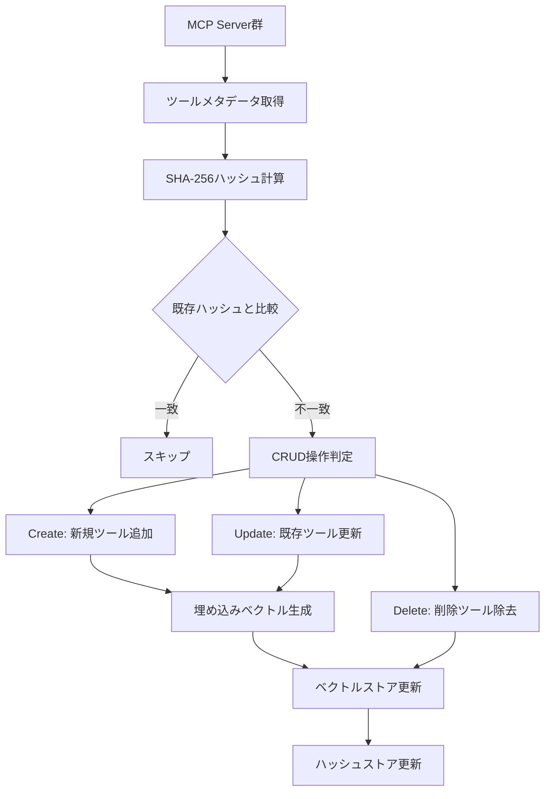
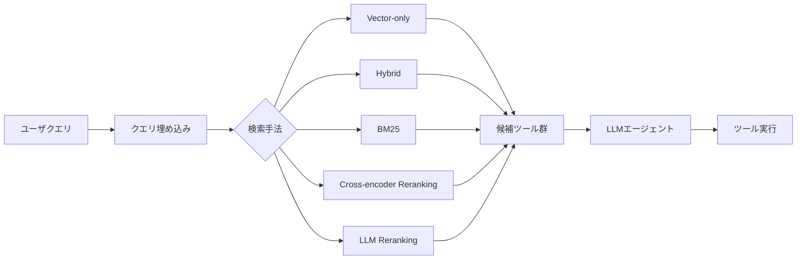

## 論文概要

本記事は [ScaleMCP: Dynamic and Auto-Synchronizing Model Context Protocol Tools for LLM Agents](https://arxiv.org/abs/2505.06416) の解説記事です。

ScaleMCPは、LLMエージェントが大量のMCPサーバからツールを動的に検索・選択するためのフレームワークである。著者らは、既存のツール選択手法がMCPとの統合を欠き、手動更新に依存するモノリシックなローカルツールリポジトリに依存している問題を指摘している。本論文では、SHA-256ハッシュによるツールメタデータの自動同期パイプラインと、ツールドキュメントの各構成要素に重みを付けた埋め込み平均（TDWA: Tool Document Weighted Average）を提案し、5,000のMCPサーバ・140,000のクエリ・10のLLMモデル・5つの埋め込みモデルで検証を行っている。

この記事は [Zenn記事: AIエージェントのツール設計8原則：Function Callingを本番で安定稼働させる](https://zenn.dev/0h_n0/articles/cbb9a0aa58e88c) の深掘りです。

## 情報源

- **arXiv ID**: 2505.06416
- **URL**: [https://arxiv.org/abs/2505.06416](https://arxiv.org/abs/2505.06416)
- **著者**: Elias Lumer, Anmol Gulati, Vamse Kumar Subbiah et al.
- **所属**: PricewaterhouseCoopers
- **発表日**: 2025年5月9日
- **分野**: cs.AI, cs.CL

## 背景と動機

Model Context Protocol（MCP）は、LLMエージェントが外部ツールにアクセスするための標準化されたプロトコルとして注目を集めている。しかし、MCPサーバの数が増加するにつれ、適切なツールを選択する問題が深刻化している。

著者らは、既存のツール選択フレームワークにおける3つの課題を指摘している。

1. **MCP統合の欠如**: 既存手法の多くはOpenAI Function Callingなど特定のAPIフォーマットに依存しており、MCPサーバとの直接的な統合を考慮していない
2. **手動更新によるスケーラビリティ限界**: ツールの追加・変更・削除がMCPサーバ側で行われた際に、ローカルのツールインデックスを手動で更新する必要があり、数千のMCPサーバを運用する環境ではエラーの温床となる
3. **単純な埋め込み手法の限界**: ツールの名前・説明文・パラメータを単純に結合して埋め込む従来手法では、各構成要素の重要度の差異を捕捉できない

これらの課題に対し、ScaleMCPは自動同期パイプラインとTDWA埋め込み戦略という2つのコア技術で解決を図っている。

## 主要な貢献

- **自動同期インデキシングパイプライン**: MCPサーバをsingle source of truthとし、SHA-256ハッシュを用いた差分検出でツールメタデータのCRUD操作を自動化
- **TDWA（Tool Document Weighted Average）**: ツールドキュメントの各構成要素（名前、説明、パラメータ、合成質問）に異なる重みを付与した埋め込み平均化手法を提案
- **大規模実証実験**: 5,000 MCPサーバ（Fortune 1000企業 x 5ツール/サーバ）、140,000クエリ、10 LLMモデル、5埋め込みモデル、5検索手法による包括的な評価

## 技術的詳細

### 自動同期インデキシングパイプライン

ScaleMCPの自動同期パイプラインは、MCPサーバのツールメタデータ変更を自動検出し、ベクトルストアを最新状態に保つ仕組みである。



パイプラインの動作は以下の通りである。

1. **メタデータ取得**: 各MCPサーバからツールの名前、説明文、パラメータスキーマを取得
2. **ハッシュ計算**: ツールメタデータを正規化し、SHA-256ハッシュを計算
3. **差分検出**: 新しいハッシュを既存のハッシュストアと比較し、変更の有無を判定
4. **CRUD操作**: 新規ツールはCreate、変更ツールはUpdate、削除ツールはDeleteを実行
5. **ベクトル再生成**: 変更のあったツールのみ埋め込みベクトルを再計算

この設計により、数千のMCPサーバが動的にツールを追加・変更しても、インデックスが自動的に最新状態を維持する。著者らは、SHA-256ハッシュによる差分検出がO(1)の計算量であり、全ツールの再埋め込みと比較してコスト効率が高いと述べている。

```python
import hashlib
import json
from typing import Any


def compute_tool_hash(tool_metadata: dict[str, Any]) -> str:
    """MCPツールメタデータのSHA-256ハッシュを計算する。

    Args:
        tool_metadata: ツールの名前・説明・パラメータを含む辞書

    Returns:
        SHA-256ハッシュ文字列
    """
    # メタデータを正規化してJSON文字列に変換
    normalized = json.dumps(
        {
            "name": tool_metadata["name"],
            "description": tool_metadata["description"],
            "parameters": tool_metadata.get("parameters", {}),
        },
        sort_keys=True,
        ensure_ascii=False,
    )
    return hashlib.sha256(normalized.encode("utf-8")).hexdigest()


def sync_tool_index(
    mcp_servers: list[dict[str, Any]],
    existing_hashes: dict[str, str],
) -> dict[str, list[str]]:
    """MCPサーバ群とベクトルストアの同期を実行する。

    Args:
        mcp_servers: MCPサーバから取得したツールメタデータのリスト
        existing_hashes: tool_id -> SHA-256ハッシュの既存マッピング

    Returns:
        CRUD操作の結果（create, update, deleteのIDリスト）
    """
    operations: dict[str, list[str]] = {
        "create": [],
        "update": [],
        "delete": [],
    }
    new_hashes: dict[str, str] = {}

    for server in mcp_servers:
        for tool in server.get("tools", []):
            tool_id = f"{server['server_id']}:{tool['name']}"
            new_hash = compute_tool_hash(tool)
            new_hashes[tool_id] = new_hash

            if tool_id not in existing_hashes:
                operations["create"].append(tool_id)
            elif existing_hashes[tool_id] != new_hash:
                operations["update"].append(tool_id)

    # 削除検出: 既存にあるが新規にないツール
    for tool_id in existing_hashes:
        if tool_id not in new_hashes:
            operations["delete"].append(tool_id)

    return operations
```

### TDWA（Tool Document Weighted Average）

TDWAは、ツールドキュメントの各構成要素に異なる重みを付与して埋め込みベクトルを生成する手法である。従来手法では、ツールの名前・説明文・パラメータを単純に結合（concatenation）して1つのテキストとして埋め込むか、各構成要素の埋め込みを均一に平均化していた。TDWAはこれに対し、各構成要素の検索への貢献度に応じた重み付き平均を導入する。

$$
\mathbf{z}_{\text{TDWA}} = \frac{\sum_{i} w_i \cdot \text{Embed}(c_i)}{\left\| \sum_{i} w_i \cdot \text{Embed}(c_i) \right\|_2}
$$

ここで、

- $w_i$: 構成要素$c_i$の重み（$\sum_i w_i = 1.0$の制約）
- $c_i$: ツールドキュメントの構成要素（名前、説明文、パラメータ、合成質問）
- $\text{Embed}(\cdot)$: 埋め込みモデル（例: OpenAI text-embedding-3-small）
- $\|\cdot\|_2$: L2ノルム（正規化）

著者らは以下の構成要素を使用している。

| 構成要素 $c_i$ | 説明 |
|:--|:--|
| name | ツール名（例: `get_revenue`） |
| description | ツールの説明文 |
| parameters | パラメータスキーマ（JSON Schema形式） |
| synthetic questions (SQ) | ツールに対する合成ユーザクエリ |

合成質問（Synthetic Questions, SQ）は、各ツールに対してLLMで自動生成されたユーザクエリである。著者らは、SQ=0（合成質問なし）、SQ=5（5件）、SQ=10（10件）の3条件で実験を行い、SQ=10が一貫して検索精度を向上させたと報告している。

```python
import numpy as np
from numpy.typing import NDArray


def compute_tdwa_embedding(
    components: dict[str, str],
    weights: dict[str, float],
    embed_fn: callable,
) -> NDArray[np.float64]:
    """TDWAによるツール埋め込みベクトルを計算する。

    Args:
        components: 構成要素名 -> テキストの辞書
            例: {"name": "get_revenue", "description": "...", ...}
        weights: 構成要素名 -> 重みの辞書
            例: {"name": 0.1, "description": 0.4, "parameters": 0.2, "sq": 0.3}
        embed_fn: テキストを埋め込みベクトルに変換する関数

    Returns:
        L2正規化されたTDWA埋め込みベクトル
    """
    weighted_sum = None
    for key, text in components.items():
        w = weights[key]
        embedding = embed_fn(text)
        contribution = w * np.array(embedding)
        if weighted_sum is None:
            weighted_sum = contribution
        else:
            weighted_sum += contribution

    # L2正規化
    norm = np.linalg.norm(weighted_sum)
    if norm > 0:
        weighted_sum /= norm

    return weighted_sum
```

著者らは複数の重み配分（TDWA variants）を実験しており、var-2（description重視）がリランキングとの組み合わせで競争力のある結果を示したと報告している。

### 検索アーキテクチャ

ScaleMCPの検索パイプラインは、以下の5つの検索手法を比較している。



| 検索手法 | 説明 |
|:--|:--|
| Vector-only | 埋め込みベクトルのコサイン類似度による検索 |
| Hybrid | ベクトル検索とBM25のスコア統合 |
| BM25 | 語彙ベースの検索（TF-IDF系） |
| Cross-encoder Reranking | Cohere Rerankモデルによるリランキング |
| LLM Reranking | LLM（GPT-4o, Claude Sonnet等）によるリランキング |

## 実装のポイント

ScaleMCPを実装する際の注意点を以下にまとめる。

### ハッシュ計算の正規化

ツールメタデータのハッシュ計算では、JSONのキー順序やフォーマットの違いが異なるハッシュを生成しうる。`sort_keys=True`を使用し、メタデータの正規化を厳密に行う必要がある。

### 合成質問の生成コスト

SQ=10（10件の合成質問）が検索精度を向上させることが示されているが、5,000サーバ x 5ツール = 25,000ツール x 10 SQ = 250,000件のクエリ生成が必要となる。LLMのAPI呼び出しコストとのトレードオフを考慮する必要がある。

### 埋め込みモデルの選択

著者らの実験では、VertexAI（Googleのテキスト埋め込みモデル）がリランキングとの組み合わせで高い精度を示している。一方、OpenAI text-embedding-3-smallはコスト効率に優れる。プロダクション環境では、精度要件とコストのバランスで選択する。

### MCPサーバのステートフル性

著者らは、MCPのステートフルなアーキテクチャがサーバレス環境でのスケーラビリティを制限すると指摘している。Lambda等のサーバレス環境では、MCPサーバの接続管理（初期化、セッション維持、切断処理）に追加の設計が必要となる。

## Production Deployment Guide

### AWS実装パターン（コスト最適化重視）

ScaleMCPのようなツール検索システムをAWSにデプロイする際の構成パターンを、トラフィック量別に示す。

**トラフィック量別の推奨構成**:

| 構成 | トラフィック | 主要サービス | 月額概算 |
|:--|:--|:--|:--|
| Small | ~100 req/日 | Lambda + OpenSearch Serverless + DynamoDB | $80-180 |
| Medium | ~1,000 req/日 | ECS Fargate + OpenSearch + ElastiCache | $400-900 |
| Large | 10,000+ req/日 | EKS + OpenSearch + ElastiCache + Karpenter | $2,500-6,000 |

**Small構成（Serverless）の詳細**:
- Lambda: ツール検索API（メモリ512MB、タイムアウト30秒）、MCP同期バッチ（メモリ1024MB）
- OpenSearch Serverless: ベクトルストア（2 OCU最小構成）
- DynamoDB: ハッシュストア（On-Demandモード、月額$5未満）
- EventBridge: 同期スケジューラ（1時間ごと）

**Large構成（Container）の詳細**:
- EKS: ツール検索サービス（Spot Instance優先、c6i.xlarge）
- OpenSearch: 3ノードクラスタ（r6g.large.search、ベクトルエンジン有効）
- ElastiCache Redis: 埋め込みキャッシュ（cache.r6g.large）
- Karpenter: Spot Instance自動プロビジョニング

**コスト削減テクニック**:
- Spot Instancesの活用でEKSワーカーノードのコストを最大90%削減
- 埋め込みキャッシュの導入で埋め込みAPI呼び出しを80%削減
- SHA-256差分検出により変更のあったツールのみ再埋め込み（全体の5-10%程度が典型値）
- OpenSearch Serverless使用時はOCU自動スケーリングでアイドル時コストを最小化

**コスト試算の注意事項**: 上記はAWS ap-northeast-1（東京）リージョンの2026年8月時点の概算値である。実際のコストはトラフィックパターン、リージョン、バースト使用量により変動する。最新料金はAWS料金計算ツールで確認を推奨する。

### Terraformインフラコード

**Small構成（Serverless）**:

```hcl
# ScaleMCP Tool Retrieval - Small構成（Serverless）
# Lambda + OpenSearch Serverless + DynamoDB

terraform {
  required_version = ">= 1.9"
  required_providers {
    aws = {
      source  = "hashicorp/aws"
      version = "~> 5.60"
    }
  }
}

provider "aws" {
  region = "ap-northeast-1"
}

# DynamoDB: ハッシュストア（On-Demand、コスト最小）
resource "aws_dynamodb_table" "tool_hashes" {
  name         = "scalemcp-tool-hashes"
  billing_mode = "PAY_PER_REQUEST"
  hash_key     = "tool_id"

  attribute {
    name = "tool_id"
    type = "S"
  }

  server_side_encryption {
    enabled = true
  }

  tags = {
    Project = "scalemcp"
    Env     = "production"
  }
}

# IAMロール: Lambda実行用（最小権限）
resource "aws_iam_role" "lambda_exec" {
  name = "scalemcp-lambda-exec"
  assume_role_policy = jsonencode({
    Version = "2012-10-17"
    Statement = [{
      Action = "sts:AssumeRole"
      Effect = "Allow"
      Principal = { Service = "lambda.amazonaws.com" }
    }]
  })
}

resource "aws_iam_role_policy" "lambda_policy" {
  name = "scalemcp-lambda-policy"
  role = aws_iam_role.lambda_exec.id
  policy = jsonencode({
    Version = "2012-10-17"
    Statement = [
      {
        Effect = "Allow"
        Action = [
          "dynamodb:GetItem",
          "dynamodb:PutItem",
          "dynamodb:DeleteItem",
          "dynamodb:Query",
        ]
        Resource = aws_dynamodb_table.tool_hashes.arn
      },
      {
        Effect = "Allow"
        Action = [
          "aoss:APIAccessAll",
        ]
        Resource = "*"
      },
      {
        Effect = "Allow"
        Action = [
          "logs:CreateLogGroup",
          "logs:CreateLogStream",
          "logs:PutLogEvents",
        ]
        Resource = "arn:aws:logs:*:*:*"
      },
    ]
  })
}

# Lambda: ツール検索API
resource "aws_lambda_function" "tool_search" {
  function_name = "scalemcp-tool-search"
  role          = aws_iam_role.lambda_exec.arn
  handler       = "handler.search"
  runtime       = "python3.12"
  memory_size   = 512
  timeout       = 30
  filename      = "lambda_package.zip"

  environment {
    variables = {
      OPENSEARCH_ENDPOINT = "https://collection-endpoint.aoss.amazonaws.com"
      HASH_TABLE_NAME     = aws_dynamodb_table.tool_hashes.name
      EMBEDDING_MODEL     = "text-embedding-3-small"
    }
  }

  tags = {
    Project = "scalemcp"
  }
}

# CloudWatch アラーム: Lambda実行時間監視
resource "aws_cloudwatch_metric_alarm" "lambda_duration" {
  alarm_name          = "scalemcp-lambda-high-duration"
  comparison_operator = "GreaterThanThreshold"
  evaluation_periods  = 3
  metric_name         = "Duration"
  namespace           = "AWS/Lambda"
  period              = 300
  statistic           = "p95"
  threshold           = 10000
  alarm_description   = "Lambda p95 latency > 10s"

  dimensions = {
    FunctionName = aws_lambda_function.tool_search.function_name
  }
}
```

**Large構成（Container）**:

```hcl
# ScaleMCP Tool Retrieval - Large構成（EKS + Karpenter）

module "eks" {
  source  = "terraform-aws-modules/eks/aws"
  version = "~> 20.24"

  cluster_name    = "scalemcp-cluster"
  cluster_version = "1.31"

  vpc_id     = module.vpc.vpc_id
  subnet_ids = module.vpc.private_subnets

  cluster_endpoint_public_access = false

  eks_managed_node_groups = {
    system = {
      instance_types = ["m6i.large"]
      min_size       = 2
      max_size       = 3
      desired_size   = 2
    }
  }
}

# Karpenter: Spot Instance自動プロビジョニング
resource "helm_release" "karpenter" {
  name       = "karpenter"
  repository = "oci://public.ecr.aws/karpenter"
  chart      = "karpenter"
  version    = "1.1.1"
  namespace  = "karpenter"

  set {
    name  = "settings.clusterName"
    value = module.eks.cluster_name
  }
}

# Karpenter NodePool: Spot優先でコスト最適化
resource "kubectl_manifest" "karpenter_nodepool" {
  yaml_body = yamlencode({
    apiVersion = "karpenter.sh/v1"
    kind       = "NodePool"
    metadata   = { name = "scalemcp-workers" }
    spec = {
      template = {
        spec = {
          requirements = [
            { key = "karpenter.sh/capacity-type", operator = "In", values = ["spot", "on-demand"] },
            { key = "node.kubernetes.io/instance-type", operator = "In", values = ["c6i.xlarge", "c6i.2xlarge", "c7i.xlarge"] },
          ]
          nodeClassRef = { name = "default" }
        }
      }
      limits   = { cpu = "100", memory = "400Gi" }
      disruption = { consolidationPolicy = "WhenEmptyOrUnderutilized" }
    }
  })
}

# Secrets Manager: 埋め込みAPIキー
resource "aws_secretsmanager_secret" "embedding_api_key" {
  name                    = "scalemcp/embedding-api-key"
  recovery_window_in_days = 7
}

# AWS Budgets: 月額コストアラート
resource "aws_budgets_budget" "scalemcp" {
  name         = "scalemcp-monthly"
  budget_type  = "COST"
  limit_amount = "5000"
  limit_unit   = "USD"
  time_unit    = "MONTHLY"

  notification {
    comparison_operator       = "GREATER_THAN"
    threshold                 = 80
    threshold_type            = "PERCENTAGE"
    notification_type         = "ACTUAL"
    subscriber_email_addresses = ["ops@example.com"]
  }
}
```

### 運用・監視設定

**CloudWatch Logs Insights クエリ**:

```
# 1時間あたりの埋め込みAPI呼び出し回数（コスト異常検知）
fields @timestamp, @message
| filter @message like /embedding_api_call/
| stats count() as api_calls by bin(1h)
| sort @timestamp desc

# ツール検索レイテンシ分析（P95, P99）
fields @timestamp, duration_ms
| filter event = "tool_search"
| stats percentile(duration_ms, 95) as p95,
        percentile(duration_ms, 99) as p99,
        avg(duration_ms) as avg_ms
  by bin(5m)
```

**CloudWatch アラーム設定**:

```python
import boto3


def create_search_latency_alarm(function_name: str) -> None:
    """ツール検索のレイテンシ異常を検知するCloudWatchアラームを作成する。

    Args:
        function_name: Lambda関数名
    """
    client = boto3.client("cloudwatch")
    client.put_metric_alarm(
        AlarmName=f"scalemcp-{function_name}-high-latency",
        MetricName="Duration",
        Namespace="AWS/Lambda",
        Statistic="p95",
        Period=300,
        EvaluationPeriods=3,
        Threshold=10000,
        ComparisonOperator="GreaterThanThreshold",
        Dimensions=[
            {"Name": "FunctionName", "Value": function_name},
        ],
        AlarmActions=["arn:aws:sns:ap-northeast-1:123456789012:scalemcp-alerts"],
    )
```

**X-Ray トレーシング設定**:

```python
from aws_xray_sdk.core import xray_recorder, patch_all

# boto3自動計装
patch_all()


@xray_recorder.capture("tool_search")
def search_tools(query: str, top_k: int = 10) -> list[dict]:
    """ツール検索をX-Rayトレース付きで実行する。

    Args:
        query: ユーザクエリ
        top_k: 返却するツール数

    Returns:
        検索結果のツールリスト
    """
    subsegment = xray_recorder.current_subsegment()
    subsegment.put_annotation("query_length", len(query))
    subsegment.put_annotation("top_k", top_k)

    # 埋め込み生成 + ベクトル検索
    results = vector_store.search(query, top_k=top_k)

    subsegment.put_metadata("result_count", len(results))
    return results
```

**Cost Explorer 日次レポート**:

```python
import boto3
from datetime import datetime, timedelta


def get_daily_cost_report() -> dict[str, float]:
    """ScaleMCP関連のAWS日次コストレポートを取得する。

    Returns:
        サービス別コストの辞書
    """
    client = boto3.client("ce")
    today = datetime.utcnow().strftime("%Y-%m-%d")
    yesterday = (datetime.utcnow() - timedelta(days=1)).strftime("%Y-%m-%d")

    response = client.get_cost_and_usage(
        TimePeriod={"Start": yesterday, "End": today},
        Granularity="DAILY",
        Metrics=["UnblendedCost"],
        Filter={
            "Tags": {
                "Key": "Project",
                "Values": ["scalemcp"],
            }
        },
        GroupBy=[{"Type": "DIMENSION", "Key": "SERVICE"}],
    )

    costs: dict[str, float] = {}
    for group in response["ResultsByTime"][0]["Groups"]:
        service = group["Keys"][0]
        amount = float(group["Metrics"]["UnblendedCost"]["Amount"])
        costs[service] = amount

    return costs
```

### コスト最適化チェックリスト

**アーキテクチャ選択**:
- [ ] トラフィック量に応じた構成を選択（Small: Serverless / Medium: Hybrid / Large: Container）
- [ ] MCPサーバのステートフル性を考慮し、ECS/EKSでの常駐プロセスも検討

**リソース最適化**:
- [ ] EKS/ECSワーカーノード: Spot Instances優先（最大90%削減）
- [ ] Reserved Instances: 安定稼働部分に1年コミット（最大72%削減）
- [ ] Savings Plans: Compute Savings Plansで柔軟にコスト削減
- [ ] Lambda: メモリサイズ最適化（Power Tuningツール使用）
- [ ] OpenSearch: Reserved Instancesまたはアイドル時のスケールダウン
- [ ] ElastiCache: Reserved Nodesの活用

**LLM/埋め込みコスト削減**:
- [ ] 埋め込みキャッシュ（ElastiCache Redis）で重複API呼び出し削減
- [ ] SHA-256差分検出で変更ツールのみ再埋め込み
- [ ] バッチ埋め込みAPI使用でスループット向上・コスト削減
- [ ] LLMリランキングはtop-k候補のみに適用（全ツールには適用しない）
- [ ] 合成質問の生成は初回のみ、更新時は差分生成

**監視・アラート**:
- [ ] AWS Budgets: 月額上限アラート設定
- [ ] CloudWatch Alarms: Lambda実行時間、OpenSearch CPU使用率
- [ ] Cost Anomaly Detection: 異常コスト自動検知
- [ ] 日次コストレポート: Cost Explorer APIで自動取得・SNS通知
- [ ] 埋め込みAPI呼び出し回数のメトリクス監視

**リソース管理**:
- [ ] 未使用OpenSearchインデックスの定期削除
- [ ] タグ戦略: 全リソースにProject/Envタグを付与
- [ ] DynamoDB TTL: 古いハッシュレコードの自動削除
- [ ] CloudWatch Logs: 保持期間の設定（14日/30日）
- [ ] 開発環境の夜間・週末自動停止

## 実験結果

著者らは3つの実験を通じてScaleMCPの性能を評価している。

### 実験1: ツール検索精度

5つの埋め込みモデルと5つの検索手法の組み合わせで、MAP@5、MAP@10、Recall@10を評価している（SQ=10、Concat埋め込み使用時）。

| 埋め込みモデル | 検索手法 | MAP@5 | MAP@10 | Recall@10 |
|:--|:--|:--|:--|:--|
| OpenAI text-embedding-3-small | Vector-only | 0.50 | -- | -- |
| VertexAI | GPT-4o Reranking | -- | -- | **0.94** |
| VertexAI | Claude Sonnet Reranking | -- | **0.59** | -- |
| BM25（全モデル共通） | Lexical | 0.39-0.42 | -- | -- |

著者らの実験から得られた主要な知見は以下の通りである。

- **LLMリランキングが検索精度を大幅に改善**: Vector-onlyのMAP@5が約0.50であるのに対し、LLMリランキングを追加することでRecall@10が0.94に達する
- **BM25は最も弱い**: MAP@5が0.39-0.42にとどまり、ベクトル検索に劣る。ツール名・説明文は自然言語であるため語彙ベースの手法は不向きである
- **SQ=10が一貫して優位**: SQ=0やSQ=5と比較して、SQ=10が全検索手法で精度を向上させている

### 実験2: エージェントタスク実行

検索されたツールをLLMエージェントが実際に使用した際のTool Correctness（正確なツール呼び出し率）とTask Completion（タスク完了率）を評価している。

| LLMモデル | Tool Correctness | Task Completion |
|:--|:--|:--|
| GPT-4o-mini | **54.0%** | 86.7% |
| GPT-o3 | 36.1% | **94.4%** |
| Claude 3.7 Sonnet | 23.1% | 69.4% |

著者らはこの結果から興味深い知見を報告している。GPT-o3はTool Correctnessが36.1%と低いにもかかわらず、Task Completionは94.4%に達している。これは、LLMが正確なツール呼び出しを行わなくても、もっともらしい出力を生成することでタスクを「完了」させる傾向があることを示唆している。著者らは、この振る舞いがツール選択システムの評価において、Task Completionだけでなく Tool Correctnessを併用する必要性を強調するものだと述べている。

### 実験3: TDWA vs Concatenation

TDWAの各バリアントと単純結合（Concatenation）の検索精度を比較している。

| 埋め込み手法 | NDCG（Vector-only） | MAP（Reranked） |
|:--|:--|:--|
| Concatenation | **0.634** | 0.510-0.545 |
| TDWA var-2 | 0.620-0.631 | 0.528 |

著者らは、純粋なベクトル検索ではConcatenationがNDCG 0.634で優位であるが、リランキングを組み合わせた場合にTDWA var-2がMAP 0.528と競争力のある結果を示すと報告している。この結果は、TDWA単体では単純結合を上回らないものの、リランキングパイプラインとの組み合わせで有効性を発揮する可能性を示唆している。

## 実運用への応用

ScaleMCPの研究成果は、Zenn記事「AIエージェントのツール設計8原則」で論じられているFunction Callingの安定運用と深く関連する。

### ツール数のスケーリング

Zenn記事ではツール設計の原則として名前・説明の明確化が挙げられているが、ScaleMCPはツール数が数千に達した際の検索問題を扱う。プロダクション環境では、ツール数の増加に伴い、LLMのコンテキストウィンドウに全ツールを含めることが不可能になる。ScaleMCPのような検索ベースのツール選択が必須となる規模感は、著者らの実験設定（5,000 MCPサーバ、25,000ツール）から推測できる。

### 自動同期の運用価値

MCPサーバのツール定義が頻繁に変更されるプロダクション環境では、SHA-256ハッシュによる差分検出が運用コストを削減する。手動でのインデックス更新は、ツール数が100を超えると現実的でなくなる。

### リランキングのコストと効果

LLMリランキングはRecall@10を0.94に引き上げるが、LLM API呼び出しの追加コストが発生する。プロダクション環境では、ベクトル検索でtop-50を取得し、LLMリランキングでtop-10に絞り込む二段階パイプラインが、精度とコストのバランスとして妥当と考えられる。

### 制約と注意点

著者らは以下の制約を明示している。

- **ドメイン限定**: 実験は金融指標ドメインのみで行われており、他ドメインへの汎化性は未検証
- **MCPステートフル性**: MCPのステートフルなアーキテクチャがサーバレスでのスケーラビリティを制限する
- **LLMの訓練不足**: 現行のLLMは自律的なツール発見に特化した訓練を受けていない

## 関連研究

- **ToolBench** (Qin et al., 2024): 16,000以上のAPIを対象としたツール使用ベンチマーク。ScaleMCPはToolBenchのツール検索手法を拡張し、MCP統合と自動同期を追加したものと位置付けられる
- **Gorilla** (Patil et al., 2023): LLMにAPI呼び出しを学習させるfine-tuning手法。ScaleMCPはfine-tuningではなく検索ベースのアプローチを採用しており、モデル非依存である点で異なる
- **AnyTool** (Du et al., 2024): ツールの階層的検索フレームワーク。ScaleMCPのフラットな検索と対照的に、カテゴリベースの階層構造でツールを管理する

## まとめと今後の展望

ScaleMCPは、MCPサーバの大規模運用におけるツール選択問題に対し、自動同期パイプラインとTDWA埋め込み戦略という2つの技術的貢献を提示している。5,000 MCPサーバ・10 LLMモデルによる大規模実証実験は、この分野で最大規模の評価の一つである。

著者らの実験結果から、LLMリランキングの有効性（Recall@10: 0.94）と、Tool CorrectnessとTask Completionの乖離（GPT-o3: 36.1% vs 94.4%）が重要な知見として得られている。後者は、ツール選択システムの評価指標設計に再考を促す結果である。

今後の研究方向として、MCPのステートレス化によるサーバレス対応、マルチドメインへの汎化検証、LLMのツール発見能力に特化したfine-tuning手法の開発が考えられる。

## 参考文献

- **arXiv**: [https://arxiv.org/abs/2505.06416](https://arxiv.org/abs/2505.06416)
- **Related Zenn article**: [https://zenn.dev/0h_n0/articles/cbb9a0aa58e88c](https://zenn.dev/0h_n0/articles/cbb9a0aa58e88c)
