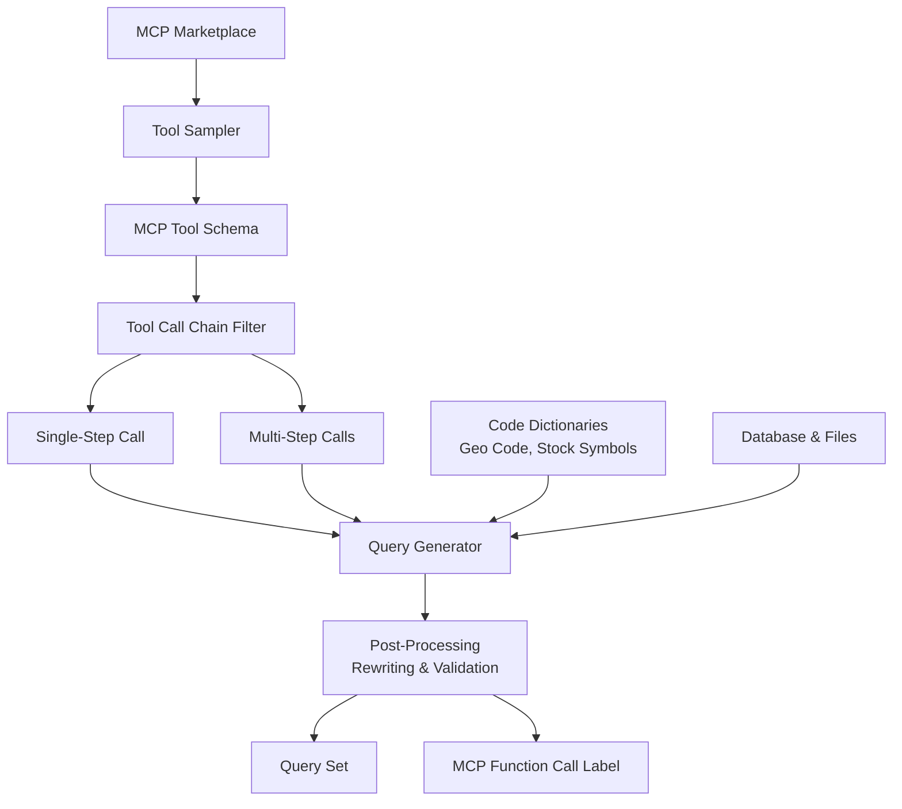
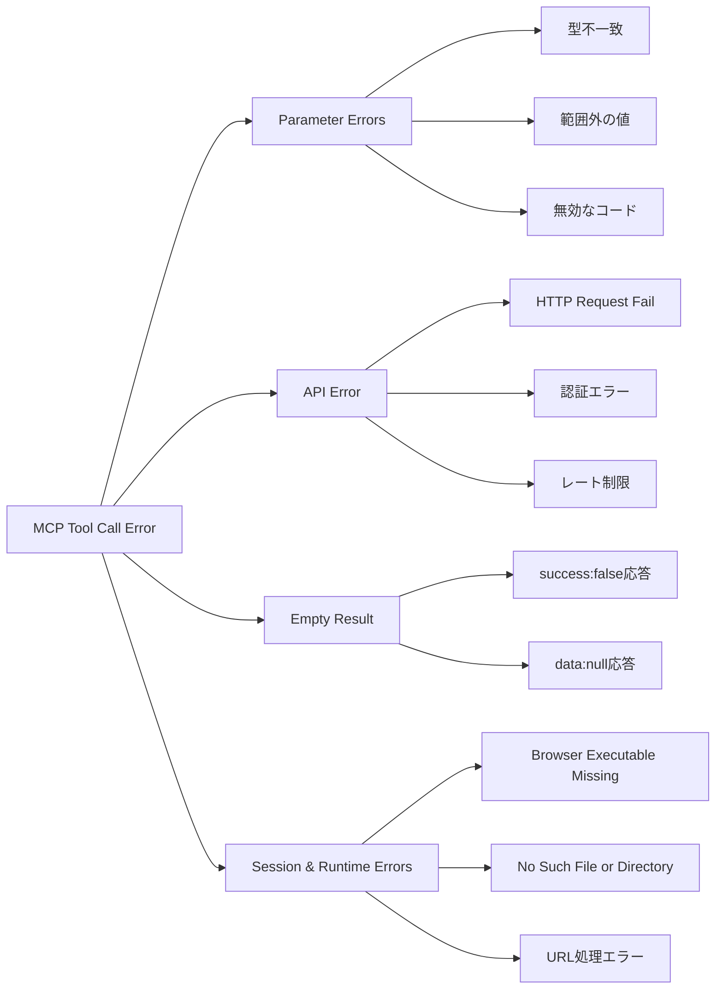

## 論文概要（Abstract）

MCPToolBench++は、LLMエージェントがModel Context Protocol（MCP）ツールを正しく使用できるかを評価する大規模ベンチマークである。2025年7月時点で40カテゴリ以上・4,000超のMCPサーバから収集したツールスキーマを基に、6ドメイン・87ツール・1,509件の質問応答ペアを構築している。シングルステップとマルチステップの両方のツール呼び出しを対象とし、5つのSOTA LLMを評価した結果、ASTスコア（関数選択精度）とPass@1（実行成功率）が必ずしも相関しないことを報告している。

本記事は [arxiv 2508.07575](https://arxiv.org/abs/2508.07575) の解説記事です。

この記事は [Zenn記事: AIエージェントのツール設計8原則：Function Callingを本番で安定稼働させる](https://zenn.dev/0h_n0/articles/cbb9a0aa58e88c) の深掘りです。

## 情報源

- **arXiv ID**: 2508.07575
- **URL**: [https://arxiv.org/abs/2508.07575](https://arxiv.org/abs/2508.07575)
- **著者**: Shiqing Fan, Xichen Ding, Liang Zhang, Linjian Mo（Ant Group）
- **発表年**: 2025年8月
- **分野**: cs.AI
- **コード**: [https://github.com/mcp-tool-bench/MCPToolBenchPP](https://github.com/mcp-tool-bench/MCPToolBenchPP)
- **データセット**: [https://huggingface.co/datasets/MCPToolBench/MCPToolBenchPP](https://huggingface.co/datasets/MCPToolBench/MCPToolBenchPP)

## 背景と動機（Background & Motivation）

LLMのFunction Calling能力は急速に進化しているが、その評価は依然として困難な課題である。従来のベンチマーク（Berkeley Function Calling Leaderboard等）はプログラミング関数や数学関数を中心としており、成功率が高い傾向にある。しかし実世界のMCPツールでは、成功率が保証されず、サーバごとに大きく異なるという特性がある。

著者らは、MCPツール評価における4つの課題を指摘している。

1. **包括的なベンチマークの欠如**: MCPツールは多様なJSONスキーマ、パラメータ型、値スキーマを持つが、これらを横断的にカバーするデータセットが存在しなかった。マーケットプレイス横断でのサーバ設定やツールスキーマの統一的なインデックスも欠如していた。

2. **パラメータ推論の難しさ**: ツール呼び出しには、銘柄コード（MSFT → Microsoft、9988 → Alibaba in HKEX）、ジオコード（CA → California）、交通手段（flight/train）といったコード体系の知識が必要であり、LLMには暗黙的な推論能力が求められる。

3. **多様な応答フォーマット**: MCPサーバの応答は単純なテキストや画像にとどまらず、スクリーンショットのファイル保存、請求書URLの生成など、タスク完了を示すメッセージと関連ファイルの組み合わせという多様な形式をとる。

4. **コンテキストウィンドウの制約**: ツールスキーマのテキスト記述とパラメータ情報はトークン長が大きく、1回の推論で利用できるツール数が制限される。

## 主要な貢献（Key Contributions）

- **貢献1**: 6ドメイン・87ツール・1,509件のQAペアからなる大規模MCPツール使用ベンチマークの構築。シングルステップとマルチステップの両方をカバー
- **貢献2**: マルチステップツール呼び出し評価のための新指標 **AST DAG Accuracy** の提案。ツール呼び出しチェーンの依存関係をDAG（有向非巡回グラフ）として評価
- **貢献3**: MCPマーケットプレイスからの自動ベンチマーク構築パイプラインの開発。ツールサンプリング、テンプレート生成、スロット充填、クエリ書き換え、品質検証の一連の処理を自動化
- **貢献4**: 5つのSOTA LLMの評価と、ASTスコアとPass@1の乖離という重要な知見の報告。ツール選択の信頼性が構文的精度より重要であることを実証
- **貢献5**: ドメイン別のエラー根本原因分析。Parameter Errors、API Error、Empty Result、Session & Runtime Errorsなどの障害パターンを体系的に分類

## 技術的詳細（Technical Details）

### ベンチマーク構築パイプライン

MCPToolBench++のデータ準備プロセスは、以下の5段階で構成されている（論文Figure 2より）。



#### Stage 1: MCPサーバ・ツールスキーマ収集

著者らは複数のMCPマーケットプレイスからサーバ情報を収集している。

- **Smithery.ai**: MCPサーバのマーケットプレイス
- **DeepNLP Store**: AI Agent向けMCPサーバストア
- **PulseMCP**: MCPサーバディレクトリ
- **ModelScope**: Alibaba運営のモデル・ツールプラットフォーム
- **GitHub AI-Agent-Hub/mcp-marketplace**: コミュニティ管理のMCPサーバリスト

各サーバから3種類のスキーマファイルを収集している: `mcp_config.json`（サーバ設定）、`server_meta.json`（メタ情報）、`tool_schema.json`（ツール定義）。`mcp-marketplace` Python SDKを使用してカテゴリ別にフィルタリングし、ローカルにインデックスを構築している。

2025年7月時点でのカテゴリ分布（論文Figure 1より）は、Database（15.7%）、Search（14.1%）、Communication（9.2%）、Finance（6.9%）、File System（6.3%）、Web（6.2%）、Workflow（4.3%）、Blockchain（3.6%）、Entertainment（3.3%）、Browser（3.2%）、Art（3.0%）、Miscellaneous（3.0%）と、40以上のカテゴリに分散している。

#### Stage 2: ツールサンプリング

$M$個のMCPサーバから収集した$N$個のツールと$C$個のカテゴリに対して、異なるサンプリング戦略を適用している。

**シングルステップ**: カテゴリ$c$の$N_c$個の候補から、等確率$p_i$の復元抽出でツール$t_i$をサンプリングする。

**マルチステップ**: ツール呼び出し数ごとにビン（count = 2からcount = $K$、$K$は最大10）に分割し、同一カテゴリ内では非復元抽出で重複のないツールリスト$[t_1, \ldots, t_k, \ldots, t_K]$を生成する。

**クロスカテゴリ**: LLMを使用して意味のあるカテゴリ組み合わせ（例: (finance, plot), (search, map)）を生成し、各カテゴリ内で非復元抽出を適用する。

#### Stage 3: クエリ生成

クエリ生成は4つのサブステップで構成される。

1. **Tool Call Template生成**: サンプリングされたツールリストからLLMがテンプレートを生成。例: `maps_directions`ツールに対して「Can you help me plan the best route from {origin} to {destination}?」
2. **Parameter Values生成**: ツールスキーマのフィールド記述に基づいてLLMがパラメータ値を生成。POI名はLLMの内在知識から、コード体系はCode Dictionariesから取得
3. **Slot Filling**: テンプレートにパラメータ値を充填
4. **Query Rewrite**: 生成クエリの文法修正と自然言語化。例: 「Compare today's stock price change of MSFT and TSLA」→「Compare today's stock price change of Microsoft and Tesla」

#### Stage 4: 後処理と品質検証

2段階の品質フィルタリングを実施している。

- **Semantic check**: 不適切な書き換えの検出。例: 「Find good restaurants near 40.7°, 70.3°」はツールが生座標を要求するがクエリ書き換えでPOI名に変換できないため除外
- **Reasonableness check**: 反事実的クエリの除外。例: 「How can I travel from New York to Tokyo by train?」は物理的に不可能であるため除外

### データセット統計

最終的なデータセットの構成は以下の通りである（論文Table 1より）。

| カテゴリ | インスタンス数 | MCPツール数 | 平均トークン/ツール | 総トークン数 |
|---------|------------|-----------|----------------|-----------|
| Browser | 187 | 32 | 107.4 | 3.4K |
| File System | 241 | 11 | 143.8 | 1.6K |
| Search | 181 | 5 | 555.6 | 2.8K |
| Map | 500 | 32 | 401.3 | 13K |
| Finance | 90 | 1 | 505.0 | 0.5K |
| Pay | 310 | 6 | 656.5 | 3.9K |
| **合計** | **1,509** | **87** | **288.3** | **25K** |

カテゴリごとにツール数と平均トークン長が大きく異なる点が特徴的である。Payカテゴリは6ツールで平均656.5トークン/ツールと最もスキーマが大きく、Browserカテゴリは32ツールで平均107.4トークン/ツールと比較的コンパクトである。

### ツールスキーマ複雑度分析

著者らはLLMが処理すべきMCPツール呼び出しの計算複雑度を形式化している。$M$をMCPサーバ数、$N_t$をサーバあたりの平均ツール数、$T_{tool}$をツールスキーマの平均トークン長とすると、全ツールスキーマの処理複雑度は以下となる。

$$
O(M \times N_t \times T_{tool})
$$

$T_{tool}$は通常0.1K〜1Kの範囲であり、利用可能ツールの総数は数百に達する。Tool Dispatcherを導入することで、関連ツールのみを選択し、複雑度を以下に削減できる。

$$
O(M \times N_k \times T_{tool})
$$

ここで$N_k$（約10）は$N_t$（約100）に比べて大幅に小さく、不要なツールスキーマの除去により精度向上にも寄与すると著者らは述べている。

### 評価指標

MCPToolBench++では4つの評価指標を採用している。

#### 1. Abstract Syntax Tree（AST）スコア

LLMが生成したツール呼び出しを、関数名の一致、必須パラメータの一致、パラメータ型の一致、値の一致の4要素でground truthと比較する。Patil et al. (2024)のBerkeley Function Calling Leaderboardで提案された指標に基づく。

#### 2. AST DAG Accuracy

マルチステップツール呼び出し向けに著者らが新たに提案した指標。ツール呼び出しチェーンの依存関係をDAG（Directed Acyclic Graph）として表現し、予測されたDAGとground truthのDAGを比較する。

$$
\text{AST DAG Accuracy} = \text{calculate\_dag\_accuracy}(\text{DAG}_{predict}, \text{DAG}_{ground\_truth})
$$

例えば「NASDAQ、NYSE、DOW、LSEの最高騰落率銘柄を取得してチャートに描画」というプロンプトの場合、`get_top_change_stocks("NASDAQ")` → `plot_chart`、`get_top_change_stocks("NYSE")` → `plot_chart`のように、並列実行と依存関係をDAGで表現する。`label = 1`は子ノード（各タスクの最終実行ノード）が予測とground truthで一致することを要求する。

#### 3. Pass@1

MCPツール呼び出しの実行結果が期待出力と一致するかを評価する。ツール呼び出しが成功すること、実行結果が空でないこと、期待されるground truthと整合することを条件とする。応答の成否判定にはLLMをjudgeとして使用している。著者らは試行回数のハイパーパラメータを5に設定している。

#### 4. Tool Call Success Rate

各MCPツールの成功実行回数と総実行回数の比率を測定する動的指標。Pass@1との違いは、Success Rateがツール呼び出しの実行成否のみを測定するのに対し、Pass@1は入力パラメータの正確性と返却結果のground truthとの整合性も評価する点にある。

## 実装のポイント（Implementation）

MCPToolBench++を実際に利用する際の要点を整理する。

### ベンチマーク実行環境

著者らは、ベンチマークで使用する全ツールが無料アクセスまたは十分な無料枠を提供していることを検証済みであると述べている。これにより、結果の再現が可能となっている。

### Code Dictionariesの活用

パラメータ値のうち、自然言語からの推論が困難なコード体系（銘柄コード、ジオコード、略語等）にはCode Dictionariesを活用している。

```python
# Code Dictionariesの概念的な実装例
code_dictionaries = {
    "stock_symbols": {
        "Tesla": "TSLA",
        "Microsoft": "MSFT",
        "Tencent": "700",       # HKEX
        "Kweichow Moutai": "600519",  # SSE
    },
    "geo_codes": {
        "California": "CA",
        "New York": "NY",
    },
}

def resolve_parameter(param_name: str, natural_language_value: str) -> str:
    """Code Dictionaryを参照してパラメータ値を解決する。

    Args:
        param_name: パラメータ名（例: "ticker_symbol"）
        natural_language_value: 自然言語のパラメータ値（例: "Tesla"）

    Returns:
        コード体系に変換されたパラメータ値（例: "TSLA"）
    """
    for dict_type, mapping in code_dictionaries.items():
        if natural_language_value in mapping:
            return mapping[natural_language_value]
    return natural_language_value
```

### MCPサーバ設定の取得と利用

ベンチマークのデータセットはHuggingFaceで公開されており、以下のように利用できる。

```python
from datasets import load_dataset

# MCPToolBench++データセットの読み込み
dataset = load_dataset("MCPToolBench/MCPToolBenchPP")

# シングルステップとマルチステップの分離
for example in dataset["test"]:
    query = example["query"]
    ground_truth_calls = example["function_calls"]
    tool_schemas = example["tool_schemas"]

    # ツールスキーマをLLMのコンテキストに注入
    # Tool Dispatcherで関連ツールを絞り込むことを推奨
    relevant_tools = tool_dispatcher(query, tool_schemas, top_k=10)
```

### 多言語対応

データセットには英語以外のクエリも含まれている。地図でのグローバルなルート検索や、各国の金融市場データの取得など、多言語対応が求められるシナリオが設計されている。エージェントはクエリの言語を自動判定し、適切な言語でツールを呼び出す能力が評価される。

## 実験結果（Results）

### モデル別・カテゴリ別のAST・Pass@1スコア

著者らは5つのSOTA LLMをMCPToolBench++で評価した結果を報告している（論文Table 2より）。

| モデル | Browser | | File System | | Search | |
|--------|---------|---------|-------------|---------|--------|--------|
| | AST | Pass@1 | AST | Pass@1 | AST | Pass@1 |
| GPT-4o | 0.6524 | 0.2182 | 0.8863 | 0.8232 | 0.5200 | 0.4720 |
| Qwen2.5-max | 0.7262 | 0.2749 | 0.9419 | 0.8871 | 0.6280 | 0.4600 |
| Claude-3.7-Sonnet | 0.6503 | 0.1840 | 0.8415 | 0.8183 | 0.7280 | **0.6200** |
| Kimi-K2-Instruct | 0.8182 | 0.2524 | 0.9062 | 0.8772 | 0.7320 | 0.3680 |
| Qwen3-coder | **0.8866** | **0.2925** | 0.9080 | 0.8680 | 0.7180 | 0.5227 |

| モデル | Map | | Pay | | Finance | |
|--------|-----|---------|-----|---------|---------|--------|
| | AST | Pass@1 | AST | Pass@1 | AST | Pass@1 |
| GPT-4o | 0.6120 | **0.3616** | 0.7077 | 0.5742 | 0.7200 | **0.2889** |
| Qwen2.5-max | 0.7372 | 0.2272 | 0.6684 | 0.5277 | 0.7511 | 0.2556 |
| Claude-3.7-Sonnet | 0.5820 | 0.2748 | 0.7058 | 0.5574 | 0.7400 | 0.2311 |
| Kimi-K2-Instruct | 0.6088 | 0.2008 | **0.8071** | **0.6761** | 0.7156 | 0.2378 |
| Qwen3-coder | **0.7830** | 0.3054 | 0.7240 | 0.5440 | **0.7320** | 0.2860 |

（太字は各カテゴリの最高値を示す）

### カテゴリ別の傾向分析

論文の結果から以下の傾向が読み取れる。

**File Systemカテゴリが最も高性能**: 全モデルでAST 0.84以上・Pass@1 0.82以上を達成している。ファイル操作のツールスキーマが比較的標準化されており、パラメータ推論が容易であるためと考えられる。

**Browserカテゴリが最も低いPass@1**: 最高でもQwen3-coderの0.2925にとどまる。ブラウザ操作はスクリーンショット保存やセッション管理など、外部環境依存の応答が多く、成功率が低い。

**Mapカテゴリは大規模だが難易度が高い**: 500インスタンスと最多だが、Pass@1は最高でGPT-4oの0.3616にとどまる。ジオコードの推論や範囲外の経緯度値というドメイン固有のエラーが頻発する。

### ASTスコアとPass@1の乖離

著者らが報告した最も重要な知見の1つは、**ASTスコアとPass@1のランキングが必ずしも正の相関を示さない**という点である。

具体的な例として、Searchカテゴリでは以下の現象が観察されている（論文Section 4.2.1より）。

- Claude-3.7-Sonnet: AST 0.728（2位）→ Pass@1 **0.620（1位）**
- Kimi-K2-Instruct: AST 0.732（1位）→ Pass@1 0.368（5位）

著者らの分析によると、Claude-3.7-Sonnetは**Google Custom Search Tool（google-search）**をTavilyなどの他のMCP検索ツールよりも高頻度で選択する傾向があり、このツールのSuccess Rateが高いことがPass@1の向上に寄与している。つまり、ground truthのラベルとは異なるツールを選択しても（ASTスコアは低下）、より信頼性の高いツールを選ぶことで実行成功率が向上するケースがある。

この知見は、**類似機能を持つ複数のツールが存在する場合、ツール選択の信頼性がツール選択の構文的正確性よりも重要である**ことを示唆している。

### ツール成功率の変動

論文Figure 5では、各ドメインのMCPツール別成功率を報告している。

- **File System**: ほぼ全ツールで成功率90%以上（最も安定）
- **Browser**: `playwright_screenshot`が90%以上、`playwright_fill`が70%程度と大きなばらつき
- **Search**: `google-search`が90%以上だが`tavily-extract`は30%程度
- **Map**: 多くのツールが80-90%だが、一部は50%以下
- **Pay**: `create_subscription`等は90%以上、`create_invoice`は50%程度
- **Finance**: `get_stock_price`は80%以上だが`global_market`は40%程度

### エラー根本原因分析

著者らはMCPツール呼び出し失敗のエラーログを詳細に分析し、ドメイン別のエラーパターンを分類している（論文Figure 6より）。



ドメイン固有のエラーパターンとして、以下が報告されている。

- **Map**: 「parameters error range invalid」が最多。LLMが推論した経緯度の値が有効範囲外
- **Browser**: 「Browser Executable Missing」「Session Not Found」。ブラウザ実行環境の依存性
- **Search**: 「URL couldn't be processed」。無効なURLの取得や認証が必要なコンテンツへのアクセス
- **File System**: 「Edit File Error」「No Such File or Directory」。存在しないファイルパスへの操作
- **Pay**: 「API Error」「HTTP Request Fail」。決済APIのバリデーションエラー
- **Finance**: 「API Error」「Empty Result」。データが存在しない銘柄・時期の照会

## 実運用への応用（Practical Applications）

MCPToolBench++の知見は、関連するZenn記事「[AIエージェントのツール設計8原則](https://zenn.dev/0h_n0/articles/cbb9a0aa58e88c)」で述べられているFunction Callingの設計原則と直結する。

### ツール選択の信頼性が構文的正確性を上回る

MCPToolBench++で示されたAST vs Pass@1の乖離は、実運用において「正しいツールを選ぶ」ことと「信頼性の高いツールを選ぶ」ことが異なるという重要な教訓を含む。プロダクション環境では、同一機能を提供する複数のMCPサーバがある場合、成功率の高いサーバを優先するルーティング戦略が有効と考えられる。

### Tool Dispatcherによるコンテキスト効率化

論文で示された複雑度分析$O(M \times N_t \times T_{tool})$から$O(M \times N_k \times T_{tool})$への削減は、実運用でのTool Dispatcher（ツール選択器）の重要性を裏付ける。特にPayカテゴリのように平均656.5トークン/ツールと大きなスキーマを持つツール群では、事前フィルタリングがコンテキストウィンドウの効率的な活用に直結する。

### ドメイン別のエラー対策

エラー根本原因分析の結果を踏まえ、ドメイン固有のフォールバック戦略を設計できる。例えば、Mapドメインではパラメータバリデーション（経緯度の範囲チェック）を事前に実施し、Searchドメインでは成功率の高いツール（google-search）を優先選択するといった戦略が考えられる。

### 多言語対応の考慮

MCPToolBench++が多言語サポートを評価対象としている点は、グローバルに展開するエージェントシステムにおいて、ツール呼び出しの言語依存性を考慮する必要があることを示唆している。

## 関連研究（Related Work）

- **GAIA** (Mialon et al., 2023): エージェントのツール使用能力を評価するベンチマーク。プロンプティングと検索の能力を主に評価する。MCPToolBench++はMCPプロトコルに特化し、より多様なツールドメインをカバーする点で異なる
- **Berkeley Function Calling Leaderboard (BFCL)** (Patil et al., 2024): 多言語のFunction Calling精度をASTメトリクスで評価する。MCPToolBench++はBFCLのAST指標を拡張し、マルチステップ向けのAST DAG Accuracyを新たに提案している
- **ComplexFuncBench** (Zhong et al., 2025): 長いコンテキスト下でのマルチステップFunction Callingに焦点を当てたベンチマーク。MCPToolBench++は実環境のMCPサーバを使用した実行成功率の評価を加えている点が独自性となる
- **ToolACE / ToolBench系** (Liu et al., 2024): APIリポジトリからパイプラインを生成する手法。MCPToolBench++はMCPマーケットプレイスから直接収集する点で差別化される
- **MCP固有ベンチマーク** (Luo et al., 2025; Gao et al., 2025): MCPプロトコル採用に伴い提案されている新しいベンチマーク群。数学やコーディングなど特定ドメインに焦点を当てているのに対し、MCPToolBench++は40以上のカテゴリを横断的にカバーする汎用性が特徴

## まとめと今後の展望

MCPToolBench++は、実世界のMCPマーケットプレイスから4,000超のサーバを収集し、6ドメイン・87ツール・1,509件のQAペアからなるベンチマークを構築した。著者らが示した「ASTスコアとPass@1の乖離」は、ツール選択の構文的正確性と実行時の信頼性が異なる次元の問題であることを浮き彫りにしている。

今後の展望として、カテゴリカバレッジの拡大（現在の6ドメインから全40+カテゴリへ）、より複雑なマルチステップシナリオの追加、そしてツール成功率のリアルタイム監視とベンチマークへの反映が期待される。MCPエコシステムの急速な拡大に伴い、このようなベンチマークの継続的な更新と発展は、LLMエージェントの実用化において不可欠である。

## 参考文献

- **arXiv**: [https://arxiv.org/abs/2508.07575](https://arxiv.org/abs/2508.07575)
- **Code**: [https://github.com/mcp-tool-bench/MCPToolBenchPP](https://github.com/mcp-tool-bench/MCPToolBenchPP)
- **Dataset**: [https://huggingface.co/datasets/MCPToolBench/MCPToolBenchPP](https://huggingface.co/datasets/MCPToolBench/MCPToolBenchPP)
- **Related Zenn article**: [https://zenn.dev/0h_n0/articles/cbb9a0aa58e88c](https://zenn.dev/0h_n0/articles/cbb9a0aa58e88c)
- Patil et al. (2024). "Gorilla: Large Language Model Connected with Massive APIs." Berkeley Function Calling Leaderboard.
- Mialon et al. (2023). "GAIA: A Benchmark for General AI Assistants."
- Zhong et al. (2025). "ComplexFuncBench: Exploring Multi-Step Function Calling."
- Liu et al. (2024). "ToolACE: Winning the Points of LLM Function Calling."
