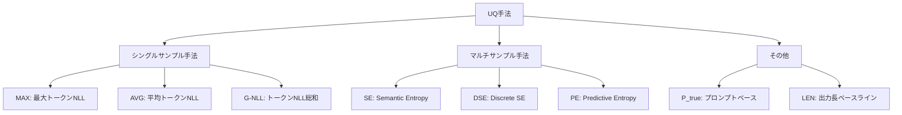
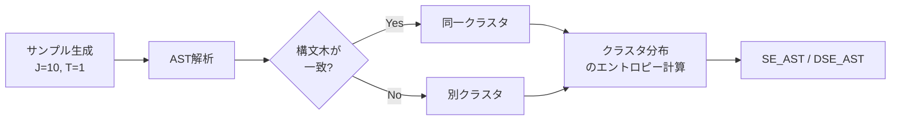

## 論文概要

本記事は [https://arxiv.org/abs/2604.22985](https://arxiv.org/abs/2604.22985) の解説記事です。

本論文は、LLMのFunction Calling（FC）における不確実性定量化（Uncertainty Quantification, UQ）手法を初めて体系的に評価した研究である。LLMが関数を誤って呼び出した場合、送金やデータ削除のような不可逆な操作では深刻な結果を招く。著者らは、自然言語Q&Aタスクで有効とされるSemantic Entropyなどのマルチサンプル手法が、FC設定ではシンプルなシングルサンプル手法（G-NLL）に対して明確な優位性を持たないことを報告している。さらに、FC出力の構造的特性を活用した2つの改善策として、AST解析ベースのクラスタリングとセマンティックトークン選択を提案し、両手法でUQ性能の向上を実証している。

この記事は [Zenn記事: AIエージェントのツール設計8原則：Function Callingを本番で安定稼働させる](https://zenn.dev/0h_n0/articles/cbb9a0aa58e88c) の深掘りです。

## 情報源

- **arXiv ID**: 2604.22985
- **URL**: [https://arxiv.org/abs/2604.22985](https://arxiv.org/abs/2604.22985)
- **著者**: Zihuiwen Ye, Lukas Aichberger（共同筆頭著者、University of Oxford）, Michael Kirchhof, Sinead Williamson, Luca Zappella（Apple）, Yarin Gal（University of Oxford）, Arno Blaas, Adam Golinski（Apple、共同シニア著者）
- **投稿日**: 2026年4月24日
- **分野**: cs.CL（計算言語学）

## 背景と動機

### Function Callingの安全性課題

LLMは外部ツールとの連携を通じて現実世界のタスクを自律的に解決するシステムへと進化している。Function Calling（FC）インターフェースはOpenAI、Google、Anthropicをはじめとする主要LLMプロバイダで広く採用されており、LLMのツール使用能力にアクセスする最も一般的な手段となっている（Carrigan, 2024）。

しかし、テキスト生成における誤りと異なり、ツール使用における誤りは不可逆な結果をもたらしうる。著者らは送金操作やデータ削除を具体例として挙げ、関数呼び出しの実行前にLLMの確信度を評価する必要性を主張している。UQ手法は、不確実性の高い関数呼び出しを検出し、人間によるレビューへ委ねるガードレールとして機能する。

### 既存研究の空白

UQ手法は分類タスクやQ&Aタスクでは研究が進んでいるが（Kirchhof et al., 2024; Kuhn et al., 2023; Ye et al., 2024）、FC設定での体系的評価は存在しなかった。FC出力は事前定義されたシンタックスに従う構造化されたコードであり、自然言語出力とは本質的に異なる性質を持つ。この構造的特性がUQ手法の性能にどう影響するかは未解明であった。

## 主要な貢献

著者らは以下の3点を主要な貢献として挙げている。

- **FC向けUQベンチマークの構築**: Berkeley Function Calling Leaderboard（BFCL）に基づき、8つのLLMで7つのUQ手法を評価する初のベンチマークを構築した。タスクはSimple、Multiple、Parallel、Parallel-Multipleの4種と、応答不能検出（Irrelevance）を含む。
- **マルチサンプル手法の優位性不在の実証**: 自然言語Q&Aで有効なSemantic Entropyが、FC設定では単純なG-NLL（Greedy Negative Log-Likelihood）に対して明確な優位性を示さないことを実証した。
- **FC特性を活用したUQ手法の改善**: マルチサンプル手法ではAST解析ベースのクラスタリング、シングルサンプル手法ではセマンティックトークン選択（Semantically Meaningful Tokens, SMT）により、既存手法のFC設定での性能を改善した。

## 技術的詳細

### UQ手法の分類と数学的定式化

著者らが評価したUQ手法は、シングルサンプル手法とマルチサンプル手法の2つのファミリーに大別される。



#### シングルサンプル手法

シングルサンプル手法は、greedy decodingで得られた単一の出力系列のトークンレベルのlog確率を集約する。出力系列 $\mathbf{y} = (y_1, y_2, \ldots, y_T)$ に対し、各手法は以下のように定義される。

**MAX（最大トークン不確実性）**: 最も不確実なトークンの負の対数尤度を報告する。

$$
\text{MAX}(\mathbf{y}) = \max_{t \in \{1, \ldots, T\}} \left( -\log p(y_t \mid y_{<t}) \right)
$$

**AVG（平均トークン不確実性）**: 全トークンの負の対数尤度の平均を取る。

$$
\text{AVG}(\mathbf{y}) = \frac{1}{T} \sum_{t=1}^{T} \left( -\log p(y_t \mid y_{<t}) \right)
$$

**G-NLL（Greedy Negative Log-Likelihood）**: 全トークンの負の対数尤度の総和を計算する。

$$
\text{G-NLL}(\mathbf{y}) = \sum_{t=1}^{T} \left( -\log p(y_t \mid y_{<t}) \right)
$$

ここで、
- $y_t$: 時刻$t$で生成されたトークン
- $p(y_t \mid y_{<t})$: 時刻$t$におけるトークン$y_t$の条件付き確率
- $T$: 出力系列の長さ

#### マルチサンプル手法

マルチサンプル手法は、温度$T > 0$で$J$個のサンプルを生成し、出力分布のエントロピーを推定する。

**Predictive Entropy（PE）**: 個別サンプルの系列確率を集約した分布のエントロピーを計算する。

$$
H_{PE} = -\sum_{j=1}^{J} \hat{p}(\mathbf{y}^{(j)}) \log \hat{p}(\mathbf{y}^{(j)})
$$

ここで、$\hat{p}(\mathbf{y}^{(j)})$は$j$番目のサンプルの推定確率である。

**Semantic Entropy（SE）**: 意味的に等価なサンプルをクラスタ$c$にグループ化し、クラスタ分布のエントロピーを計算する。

$$
H_{SE} = -\sum_{c \in \mathcal{C}} p(c) \log p(c)
$$

ここで、
- $\mathcal{C}$: 意味的クラスタの集合
- $p(c)$: クラスタ$c$に属するサンプルの確率の総和

**DSE（Discrete Semantic Entropy）**: SEの変種で、クラスタ確率を相対頻度で推定する。

$$
p_{\text{DSE}}(c) = \frac{|\{j : \mathbf{y}^{(j)} \in c\}|}{J}
$$

著者らは、SEの元の実装ではLLMベースのentailment（含意関係）判定でクラスタリングを行うが、FC出力の構造化された性質にはexact string matching（EXM）がより適切であると判断し、2つの系列が完全一致する場合のみ同一クラスタとするEXMベースのクラスタリングを採用している。

### FC出力におけるトークン確率の特性

著者らは、FC出力のトークン確率パターンが自然言語と本質的に異なることを分析している。8つのLLMにおける平均トークン確率は、BFCL（All Combined）で0.97であるのに対し、Natural Questions（NQ）データセットでは0.71にとどまる。

この差異がマルチサンプル手法の性能低下の原因となっている。FC出力ではほぼ全てのトークンが高確率（$\approx 1$）で生成されるため、温度サンプリングで得られる複数サンプルはgreedy出力とほぼ同一になる。結果として、形成されるクラスタ数が少なくなり（BFCLで平均3.4クラスタ vs NQで6.4クラスタ）、SEが誤った出力に対しても低い不確実性スコアを返す問題が生じる。

さらに、不確実性が存在する少数のトークン（確率 $< 1$）についても、第2候補のトークンが構文的に等価（例: `=["` vs `=['`）であることが多く、意味的な差異が生じない。

### AST解析ベースのクラスタリング

マルチサンプル手法の改善として、著者らはAbstract Syntax Tree（AST）解析によるクラスタリングを提案している。EXMでは表面的な文字列の違い（引数の順序、空白の違い等）で別クラスタに分類されるが、AST解析は構文木レベルで比較を行い、引数を辞書として扱うことで順序不変性を実現する。



2つの出力のAST（抽象構文木）が一致すれば同一クラスタに割り当てる。この手法は引数の順列不変性（permutation invariance）を考慮し、`func(a=1, b=2)` と `func(b=2, a=1)` を同一として扱う。

### セマンティックトークン選択（SMT）

シングルサンプル手法の改善として、著者らはSemantically Meaningful Tokens（SMT）の概念を導入している。FC出力には構文的に必要だが意味的には無関係なトークン（括弧、カンマ、等号など）が多数含まれ、これらの低確率がUQスコアを歪める。

著者らは、FC出力においてセマンティックに意味のあるトークンを以下の6カテゴリに分類している。

1. 関数呼び出しの有無を決定するトークン（最初の `[`）
2. 呼び出す関数名を決定するトークン（`history`, `get` 等）
3. 使用するパラメータ名を決定するトークン（`country`, `start`, `end` 等）
4. パラメータ値を決定するトークン（`1`, `8`, `France` 等）
5. 呼び出す関数の数を決定するトークン（`])`、`,`、`)` 等）
6. パラメータの数を決定するトークン

構文的に必要なだけのトークン（`=`、`"`等）は除外し、意味的に重要なトークンのみでUQスコアを計算する。

$$
\text{G-NLL}_{SMT}(\mathbf{y}) = \sum_{t \in \mathcal{S}} \left( -\log p(y_t \mid y_{<t}) \right)
$$

ここで、$\mathcal{S} \subseteq \{1, \ldots, T\}$はセマンティックに意味のあるトークンのインデックス集合である。

SMT抽出はルールベースのアルゴリズムで実装され、FC出力フォーマット（Python形式のリスト、JSON形式等）に応じた個別の実装が必要となる。著者らは、GPT-5.2にPython形式のSMTアルゴリズムと10例のMistral出力を与えることでJSON形式のアルゴリズムを自動生成でき、手動実装との平均AUROC差が0.001に収まることを報告している。

## 実装のポイント

### SMT抽出の実装

SMT抽出の実装はFC出力フォーマットに依存する。Qwen、gemmaなどのモデルはPython形式のリスト（`[func(a=1)]`）で出力するが、MistralはJSON形式で出力する。著者らはフォーマットごとに個別のトークン抽出アルゴリズムを実装している。

```python
from dataclasses import dataclass
from enum import Enum


class TokenCategory(Enum):
    """セマンティックトークンのカテゴリ"""
    CALL_DECISION = "call_decision"      # 関数呼び出し有無
    FUNCTION_NAME = "function_name"      # 関数名
    PARAM_NAME = "param_name"            # パラメータ名
    PARAM_VALUE = "param_value"          # パラメータ値
    FUNCTION_COUNT = "function_count"    # 関数数
    PARAM_COUNT = "param_count"          # パラメータ数
    SYNTACTIC = "syntactic"              # 構文的トークン（除外対象）


@dataclass
class ScoredToken:
    """トークンとそのlog確率"""
    token: str
    log_prob: float
    category: TokenCategory


def extract_smt_indices(
    tokens: list[str],
    fc_format: str = "python",
) -> set[int]:
    """FC出力からセマンティックに意味のあるトークンのインデックスを抽出する。

    Args:
        tokens: トークナイズされたFC出力
        fc_format: 出力フォーマット ("python" or "json")

    Returns:
        セマンティックトークンのインデックス集合
    """
    smt_indices: set[int] = set()
    # Python形式: [func_name(param=value, ...)]
    if fc_format == "python":
        in_func_name = False
        in_param_name = False
        in_param_value = False
        for i, token in enumerate(tokens):
            if i == 0:  # 最初のトークン: 呼び出し有無の決定
                smt_indices.add(i)
                continue
            if token in ("(", ")", "[", "]", "=", ",", '"', "'"):
                # 構文トークン: 一部は関数数・パラメータ数の決定に関与
                if token in (")", ",", "]"):
                    smt_indices.add(i)
                continue
            # 関数名・パラメータ名・パラメータ値は全てセマンティック
            smt_indices.add(i)
    return smt_indices


def compute_gnll_smt(
    tokens: list[str],
    log_probs: list[float],
    fc_format: str = "python",
) -> float:
    """G-NLL_SMTを計算する。

    Args:
        tokens: トークナイズされたFC出力
        log_probs: 各トークンの対数確率
        fc_format: 出力フォーマット

    Returns:
        SMTフィルタ適用後のG-NLLスコア
    """
    smt_indices = extract_smt_indices(tokens, fc_format)
    return sum(
        -lp for i, lp in enumerate(log_probs) if i in smt_indices
    )
```

### ASTベースクラスタリングの実装

AST解析にはPythonの`ast`モジュールを使用する。引数のdictionary表現で順序不変性を確保する。

```python
import ast
from collections import Counter


def ast_cluster(
    samples: list[str],
) -> dict[str, list[int]]:
    """AST解析でFC出力をクラスタリングする。

    Args:
        samples: 複数のFC出力サンプル

    Returns:
        ASTハッシュ -> サンプルインデックスの辞書
    """
    clusters: dict[str, list[int]] = {}
    for i, sample in enumerate(samples):
        try:
            tree = ast.parse(sample, mode="eval")
            # ast.dumpで正規化（引数順序はソートされる）
            normalized = ast.dump(tree, annotate_fields=True)
            clusters.setdefault(normalized, []).append(i)
        except SyntaxError:
            # AST解析失敗は個別クラスタ
            clusters.setdefault(f"__error_{i}", []).append(i)
    return clusters
```

### 評価指標の選択

著者らはAUROC（Area Under the Receiver Operating Characteristic）を主要評価指標として採用している。AUROCは0.5（ランダム推定）から1.0（完全な識別）の範囲を取り、UQスコアが正しい関数呼び出しと誤った関数呼び出しをどれだけ識別できるかを定量化する。正誤判定はBFCLのデフォルト基準に従い、ground truthとのAST一致で判定される。

## Production Deployment Guide

### AWS実装パターン（コスト最適化重視）

本論文のUQ手法をAWS上でFunction Callingの安全性ガードレールとして実装する場合の構成を示す。UQスコアに基づく選択的実行（不確実性の高い呼び出しを人間レビューへ委ねる）が主要な設計パターンとなる。

**注意**: 以下のコスト試算は2026年8月時点のAWS ap-northeast-1（東京）リージョンの料金に基づく概算値である。実際のコストはトラフィックパターン、リージョン、バースト使用量により変動する。最新料金はAWS料金計算ツールで確認を推奨する。

| 構成 | 想定規模 | 主要サービス | 月額概算 |
|------|----------|-------------|---------|
| Small | ~100 req/日 | Lambda + Bedrock + DynamoDB | $60-180 |
| Medium | ~1,000 req/日 | ECS Fargate + Bedrock + ElastiCache | $350-850 |
| Large | 10,000+ req/日 | EKS + Karpenter + Spot + Bedrock Batch | $2,200-5,500 |

**Small構成**: Lambda(1024MB, 120秒) + Bedrock(Claude Sonnet) + DynamoDB(On-Demand) + SNS。UQスコア計算はLambda内で完結し、閾値超過時にSNS経由で人間レビューキューへ送信する。月額内訳: Lambda $10 + Bedrock $30-150 + DynamoDB $5 + SNS $5。シングルサンプル手法（G-NLL_SMT）を採用することで、1回のLLM呼び出しでUQスコアが取得でき、追加のLLMコストが不要。

**Medium構成**: ECS Fargate + Bedrock + ElastiCache(Redis) + SQS。FC結果とUQスコアをRedisにキャッシュし、同一ツール呼び出しパターンの重複評価を回避する。

**Large構成**: EKS + Karpenter(Spot優先) + Bedrock Batch API(50%削減) + S3。マルチサンプル手法（SE_AST）を並列実行し、バッチ処理でコスト最適化する。月額内訳: EKS $200 + EC2 Spot $700-1,800 + Bedrock $1,000-3,000 + ElastiCache $150 + S3 $30。

**コスト削減テクニック**: シングルサンプル手法の採用でマルチサンプル比10倍のスループット向上、Bedrock Batch APIで50%削減、Prompt Cachingで30-90%削減、Spot Instancesで最大90%削減。

### Terraformインフラコード

**Small構成（Serverless: Lambda + Bedrock + DynamoDB）**

```hcl
# --- Small構成: UQガードレール付きFC基盤 (Serverless) ---
terraform {
  required_version = ">= 1.9"
  required_providers {
    aws = { source = "hashicorp/aws", version = "~> 5.80" }
  }
}

provider "aws" { region = "ap-northeast-1" }

# DynamoDB: UQスコア履歴・レビュー待ちキュー (On-Demand + TTL)
resource "aws_dynamodb_table" "uq_scores" {
  name         = "fc-uq-scores"
  billing_mode = "PAY_PER_REQUEST"
  hash_key     = "request_id"
  range_key    = "timestamp"
  attribute { name = "request_id" type = "S" }
  attribute { name = "timestamp"  type = "N" }
  ttl { attribute_name = "expires_at" enabled = true }
  server_side_encryption { enabled = true }
}

# IAMロール: 最小権限
resource "aws_iam_role" "fc_lambda" {
  name = "fc-uq-lambda-role"
  assume_role_policy = jsonencode({
    Version = "2012-10-17"
    Statement = [{
      Action = "sts:AssumeRole"
      Effect = "Allow"
      Principal = { Service = "lambda.amazonaws.com" }
    }]
  })
}

resource "aws_iam_role_policy" "fc_lambda_policy" {
  name = "fc-uq-lambda-policy"
  role = aws_iam_role.fc_lambda.id
  policy = jsonencode({
    Version = "2012-10-17"
    Statement = [
      {
        Effect   = "Allow"
        Action   = ["bedrock:InvokeModel", "bedrock:InvokeModelWithResponseStream"]
        Resource = "arn:aws:bedrock:ap-northeast-1::foundation-model/*"
      },
      {
        Effect   = "Allow"
        Action   = ["dynamodb:PutItem", "dynamodb:GetItem", "dynamodb:Query"]
        Resource = aws_dynamodb_table.uq_scores.arn
      },
      {
        Effect   = "Allow"
        Action   = ["sns:Publish"]
        Resource = aws_sns_topic.human_review.arn
      },
      {
        Effect   = "Allow"
        Action   = ["logs:CreateLogGroup", "logs:CreateLogStream", "logs:PutLogEvents"]
        Resource = "arn:aws:logs:ap-northeast-1:*:*"
      }
    ]
  })
}

# Lambda: UQスコア計算 + 閾値判定
resource "aws_lambda_function" "fc_uq_guard" {
  function_name = "fc-uq-guardrail"
  runtime       = "python3.13"
  handler       = "uq_guard.handler"
  role          = aws_iam_role.fc_lambda.arn
  timeout       = 120
  memory_size   = 1024
  environment {
    variables = {
      UQ_TABLE         = aws_dynamodb_table.uq_scores.name
      UQ_METHOD        = "gnll_smt"          # シングルサンプル推奨
      UQ_THRESHOLD     = "2.5"               # AUROC最適閾値
      REVIEW_TOPIC_ARN = aws_sns_topic.human_review.arn
      BEDROCK_MODEL_ID = "anthropic.claude-sonnet-4-5-20260514-v1:0"
    }
  }
}

# SNS: 人間レビューキュー
resource "aws_sns_topic" "human_review" {
  name              = "fc-human-review"
  kms_master_key_id = "alias/aws/sns"
}

# CloudWatch アラーム: UQ閾値超過率監視
resource "aws_cloudwatch_metric_alarm" "high_uncertainty_rate" {
  alarm_name          = "fc-high-uncertainty-rate"
  comparison_operator = "GreaterThanThreshold"
  evaluation_periods  = 3
  metric_name         = "UQThresholdExceeded"
  namespace           = "FC/UQGuardrail"
  period              = 300
  statistic           = "Sum"
  threshold           = 50  # 5分間で50件超過
  alarm_actions       = [aws_sns_topic.human_review.arn]
}
```

**Large構成（Container: EKS + Karpenter + Spot）**

```hcl
# --- Large構成: マルチサンプルUQ + バッチ処理 ---
module "eks" {
  source  = "terraform-aws-modules/eks/aws"
  version = "~> 20.31"

  cluster_name    = "fc-uq-cluster"
  cluster_version = "1.32"
  vpc_id          = module.vpc.vpc_id
  subnet_ids      = module.vpc.private_subnets

  cluster_endpoint_public_access = false
}

# Karpenter: Spot優先の自動スケーリング
resource "kubectl_manifest" "karpenter_nodepool" {
  yaml_body = yamlencode({
    apiVersion = "karpenter.sh/v1"
    kind       = "NodePool"
    metadata   = { name = "fc-uq-pool" }
    spec = {
      template = {
        spec = {
          requirements = [
            { key = "karpenter.sh/capacity-type", operator = "In", values = ["spot", "on-demand"] },
            { key = "node.kubernetes.io/instance-type", operator = "In",
              values = ["m7i.xlarge", "c7i.xlarge", "m7i.2xlarge"] }
          ]
        }
      }
      limits   = { cpu = "64", memory = "256Gi" }
      disruption = {
        consolidationPolicy = "WhenEmptyOrUnderutilized"
        consolidateAfter    = "60s"
      }
    }
  })
}

# Secrets Manager: Bedrock設定
resource "aws_secretsmanager_secret" "bedrock_config" {
  name       = "fc-uq/bedrock-config"
  kms_key_id = aws_kms_key.fc_uq.id
}

# AWS Budgets: 月額予算アラート
resource "aws_budgets_budget" "fc_uq_monthly" {
  name         = "fc-uq-monthly-budget"
  budget_type  = "COST"
  limit_amount = "5500"
  limit_unit   = "USD"
  time_unit    = "MONTHLY"

  notification {
    comparison_operator       = "GREATER_THAN"
    threshold                 = 80
    threshold_type            = "PERCENTAGE"
    notification_type         = "ACTUAL"
    subscriber_email_addresses = ["ops-team@example.com"]
  }
}
```

### 運用・監視設定

**CloudWatch Logs Insights: UQスコア分析**

```
fields @timestamp, request_id, uq_method, uq_score, is_correct, action_taken
| filter event = "fc_uq_evaluation"
| stats avg(uq_score) as avg_score,
        count(*) as total,
        sum(case when action_taken = 'blocked' then 1 else 0 end) as blocked_count
  by bin(1h)
| sort @timestamp desc
```

**CloudWatch アラーム設定（Python）**

```python
import boto3

cloudwatch = boto3.client("cloudwatch", region_name="ap-northeast-1")


def create_uq_alarms() -> None:
    """UQ関連のCloudWatchアラームを設定する。"""
    # Bedrockトークン使用量スパイク検知
    cloudwatch.put_metric_alarm(
        AlarmName="fc-bedrock-token-spike",
        Namespace="FC/UQGuardrail",
        MetricName="BedrockInputTokens",
        Statistic="Sum",
        Period=3600,
        EvaluationPeriods=2,
        Threshold=500000,
        ComparisonOperator="GreaterThanThreshold",
        AlarmActions=["arn:aws:sns:ap-northeast-1:ACCOUNT:fc-ops"],
    )
    # UQ閾値超過率の異常検知（モデル劣化の兆候）
    cloudwatch.put_metric_alarm(
        AlarmName="fc-uq-rejection-rate-high",
        Namespace="FC/UQGuardrail",
        MetricName="UQRejectionRate",
        Statistic="Average",
        Period=3600,
        EvaluationPeriods=3,
        Threshold=0.3,  # 30%超過で警告
        ComparisonOperator="GreaterThanThreshold",
        AlarmActions=["arn:aws:sns:ap-northeast-1:ACCOUNT:fc-ops"],
    )
```

**X-Ray トレーシング設定**

```python
from aws_xray_sdk.core import xray_recorder, patch_all

patch_all()  # boto3自動計装


@xray_recorder.capture("compute_uq_score")
def compute_uq_with_tracing(
    fc_output: str,
    log_probs: list[float],
    method: str = "gnll_smt",
) -> float:
    """UQスコア計算をX-Rayでトレースする。"""
    subsegment = xray_recorder.current_subsegment()
    if subsegment:
        subsegment.put_annotation("uq_method", method)
        subsegment.put_annotation("output_token_count", len(log_probs))
    score = compute_gnll_smt(
        tokens=fc_output.split(),
        log_probs=log_probs,
    )
    if subsegment:
        subsegment.put_metadata("uq_score", score)
    return score
```

**Cost Explorer自動レポート（Python）**

```python
import boto3
from datetime import date, timedelta


def daily_cost_report() -> dict[str, float]:
    """日次コストレポートを取得しBedrock/Lambda/EKSコストを抽出する。"""
    ce = boto3.client("ce", region_name="ap-northeast-1")
    today = date.today()
    response = ce.get_cost_and_usage(
        TimePeriod={
            "Start": (today - timedelta(days=1)).isoformat(),
            "End": today.isoformat(),
        },
        Granularity="DAILY",
        Metrics=["UnblendedCost"],
        Filter={
            "Tags": {"Key": "Project", "Values": ["fc-uq-guardrail"]}
        },
        GroupBy=[{"Type": "DIMENSION", "Key": "SERVICE"}],
    )
    costs = {}
    for group in response["ResultsByTime"][0]["Groups"]:
        service = group["Keys"][0]
        amount = float(group["Metrics"]["UnblendedCost"]["Amount"])
        costs[service] = amount
    total = sum(costs.values())
    if total > 100:
        sns = boto3.client("sns", region_name="ap-northeast-1")
        sns.publish(
            TopicArn="arn:aws:sns:ap-northeast-1:ACCOUNT:fc-ops",
            Subject=f"FC UQ Daily Cost Alert: ${total:.2f}",
            Message=f"Daily cost exceeded $100: {costs}",
        )
    return costs
```

### コスト最適化チェックリスト

**アーキテクチャ選択**:
- [ ] トラフィック量に応じたServerless/Hybrid/Container構成の選定
- [ ] シングルサンプル手法（G-NLL_SMT）の優先採用でLLM呼び出し回数を最小化
- [ ] マルチサンプル手法はバッチ処理が許容される場合のみ採用

**リソース最適化**:
- [ ] EC2: Spot Instances優先（最大90%削減）
- [ ] Reserved Instances: 1年コミット（最大72%削減）
- [ ] Savings Plans検討
- [ ] Lambda: Power Tuningでメモリサイズ最適化
- [ ] ECS/EKS: Karpenterでアイドル時自動スケールダウン

**LLMコスト削減**:
- [ ] Bedrock Batch API使用（50%削減）
- [ ] Prompt Caching有効化（30-90%削減）
- [ ] UQスコアキャッシュで同一パターンの重複評価回避
- [ ] トークン数制限（FC出力は通常短いため効果限定的）

**監視・アラート**:
- [ ] AWS Budgets月額上限設定
- [ ] CloudWatch: UQスコア分布・閾値超過率の監視
- [ ] Cost Anomaly Detection有効化
- [ ] Cost Explorer日次レポート + SNS通知

**リソース管理**:
- [ ] Lambda未使用バージョン定期削除
- [ ] Project/CostCenter/UQMethodタグ戦略
- [ ] DynamoDB TTLでUQスコア履歴30日自動削除
- [ ] 開発環境の夜間・週末自動停止

## 実験結果

### 8モデル横断のUQ性能比較（AUROC）

論文Table 1より、8つのLLM（Qwen2.5-{0.5,3,7}B-Instruct、Ministral-8B-Instruct-2410、Qwen3-4B-Instruct-2507、gemma-2-9b-it、gemma-3-{4,12}b-it）の平均AUROCを以下に示す。

| タスク | MAX | AVG | G-NLL | SE_EXM | DSE_EXM | PE | P_true | LEN |
|--------|-----|-----|-------|--------|---------|-----|--------|-----|
| Simple | 0.74 | 0.76 | **0.77** | 0.73 | 0.73 | 0.72 | 0.69 | 0.56 |
| Multiple | 0.71 | 0.74 | **0.76** | 0.73 | 0.73 | 0.71 | 0.67 | 0.58 |
| Parallel | 0.66 | 0.72 | **0.71** | 0.66 | 0.66 | 0.67 | 0.62 | 0.49 |
| Parallel-Multiple | 0.72 | 0.74 | **0.76** | 0.73 | 0.73 | 0.72 | 0.67 | 0.57 |
| All Combined | 0.72 | 0.71 | **0.76** | 0.72 | 0.72 | 0.68 | 0.68 | 0.61 |

G-NLLが全タスクカテゴリで最良またはそれに近い性能を示しており、マルチサンプル手法（SE_EXM、DSE_EXM、PE）がG-NLLを上回るケースは存在しない。著者らは、この結果がFC出力の高トークン確率特性に起因すると分析している。

### FC特性を活用した改善結果

**ASTクラスタリングの効果**（論文Table 2より）: SE_ASTは10タスク中8タスクでSE_EXMを改善しているが、G-NLLとの差を解消するには至っていない。All Combinedでは SE_EXM: 0.72 に対し SE_AST: 0.74 と2ポイントの改善が見られる。

**SMTの効果**（論文Table 3より）: G-NLL_SMTは4つの個別タスク中3タスクでG-NLLを上回り、全ての組み合わせタスクでも改善を達成している。All Combinedでは G-NLL: 0.76 に対し G-NLL_SMT: 0.78 と2ポイントの改善が報告されている。Simple + Irrelevanceでは 0.81 から 0.82 への改善が確認されている。

### キャリブレーション結果

著者らはsmoothECE（Expected Calibration Error）でキャリブレーション品質も評価している（論文Figure 1より）。All Combinedタスクにおいて、MAXが最良のキャリブレーション（smECE=0.075）を達成し、G-NLLとP_trueは過小確信（underconfident）、AVGは過大確信（overconfident）の傾向を示している。FC出力では平均トークン確率が約0.97と高いため、自然言語で見られるG-NLLの極端な過小確信が緩和されている。

## 実運用への応用

### Zenn記事との関連

[Zenn記事: AIエージェントのツール設計8原則](https://zenn.dev/0h_n0/articles/cbb9a0aa58e88c) で解説されているFunction Callingの本番安定稼働設計との対応を整理する。

**ガードレール設計への直接適用**: Zenn記事が論じるツール設計原則において、UQ手法は「実行前の確信度チェック」として組み込める。G-NLL_SMTはシングルパスで計算可能なため、レイテンシへの影響は最小限である。不確実性スコアが閾値を超えた場合に人間レビューへ委ねるselective prediction パターンは、不可逆操作（送金、データ削除）を含むエージェントシステムでは実装の価値がある。

**シングルサンプル手法の実用性**: 本論文の知見は、プロダクション環境でマルチサンプル手法を使用する必要がないことを示唆している。マルチサンプル手法はスループットがサンプル数$J$に反比例するため、オンデバイスやリアルタイム要件のある環境では現実的でない。G-NLL_SMTはgreedy decodingの1回の推論でUQスコアを取得でき、追加コストはトークンのlog確率の集約処理のみである。

**ASTベースのequivalenceチェック**: Function Callingの正誤判定にAST一致を用いるアプローチは、引数順序の違いや空白の違いによる偽陽性を排除し、テスト自動化やCI/CDパイプラインでの品質ゲートとしても活用できる。

## 関連研究

- **Semantic Entropy（Kuhn et al., 2023; Farquhar et al., 2024）**: 自然言語Q&Aでの不確実性推定手法。LLMベースのentailment判定でセマンティッククラスタリングを行う。本論文はFC設定でのSEの限界を実証し、ASTベースのクラスタリングによる改善を提案している。
- **BFCL（Yan et al., 2024）**: Berkeley Function Calling Leaderboard。LLMのFC能力を評価するベンチマークだが、精度評価に特化しておりUQ評価は含まれていなかった。本論文はBFCLをUQ評価に拡張している。
- **Shifting Attention to Relevance（Duan et al., 2023）**: 自然言語のUQにおいて関連トークンに注目するアプローチ。本論文のSMTは同様の着想をFC出力の構造に適応させたものである。
- **MARS（Bakman et al., 2024）**: 意味認識型の応答スコアリング手法。自然言語向けに設計されており、FC向けの対応は本論文が初めて行っている。
- **AgentHarm（Andriushchenko et al., 2024）**: LLMエージェントの有害性ベンチマーク。UQを用いた安全性ガードレールは本論文が初めて体系的に評価している。

## まとめと今後の展望

本論文は、LLMのFunction Callingにおける不確実性定量化手法を初めて体系的に評価した研究である。主要な知見として、マルチサンプル手法（Semantic Entropy等）がFC設定ではシングルサンプル手法（G-NLL）に対して明確な優位性を持たないことが実証された。この結果はFC出力のトークン確率が自然言語より高い（平均0.97 vs 0.71）という構造的特性に起因する。

AST解析ベースのクラスタリングとセマンティックトークン選択の2つの改善策は、FC出力の構造的特性を活用しており、今後の研究基盤を提供している。著者らは制限事項として、フロンティアモデル（トークン確率を公開しないAPI）での評価と、マルチターンのエージェント設定での検証を今後の課題として挙げている。

## 参考文献

- **arXiv**: [https://arxiv.org/abs/2604.22985](https://arxiv.org/abs/2604.22985)
- **BFCL Benchmark**: Yan et al., 2024. Berkeley Function Calling Leaderboard.
- **Semantic Entropy**: Kuhn et al., 2023. Semantic Uncertainty.
- **Related Zenn article**: [AIエージェントのツール設計8原則：Function Callingを本番で安定稼働させる](https://zenn.dev/0h_n0/articles/cbb9a0aa58e88c)
