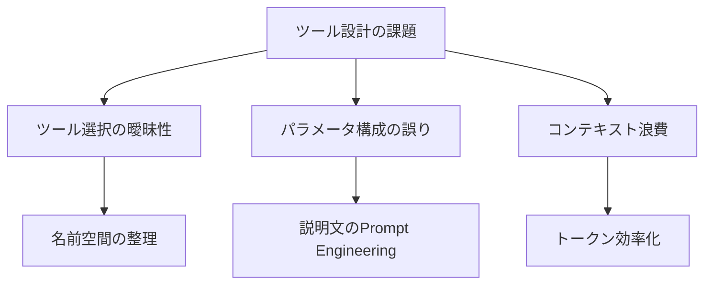
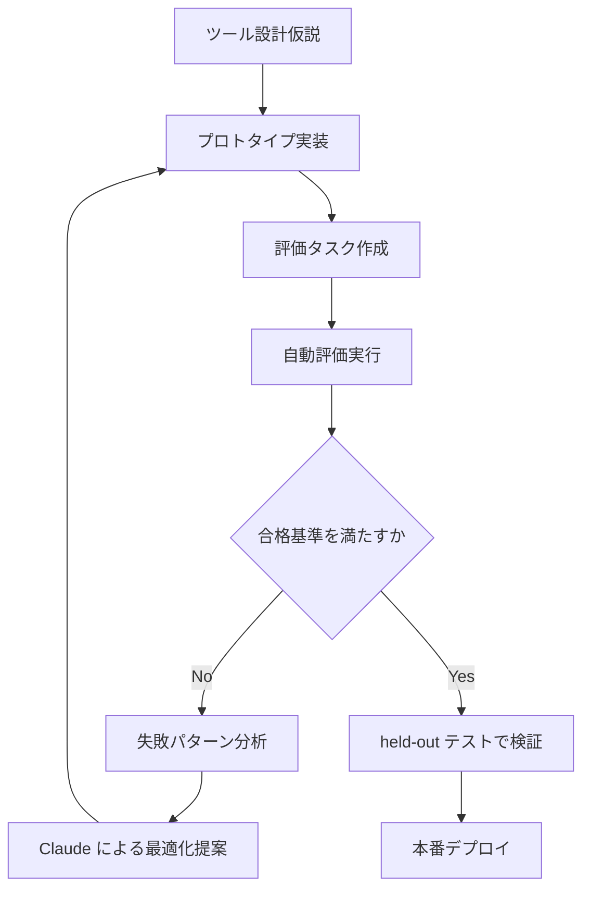

## ブログ概要

Anthropic Applied AIチームが公開した「Writing effective tools for AI agents---using AI agents」は、AIエージェント向けツール設計の実践的ガイドである。著者らは、ツール開発を**プロトタイプ構築 → 包括的評価 → エージェントとの協調最適化**の3フェーズに体系化し、6つの設計原則を導出している。Claude自身がツール最適化に参加した「Claude-optimized tools」が、人間が書いたツールを評価セットにおいて有意に上回ったという報告が注目に値する。

本記事は [https://www.anthropic.com/engineering/writing-tools-for-agents](https://www.anthropic.com/engineering/writing-tools-for-agents) の解説記事です。

この記事は [Zenn記事: AIエージェントのツール設計8原則](https://zenn.dev/0h_n0/articles/cbb9a0aa58e88c) の関連1次情報です。

## 情報源

- **種別**: 企業テックブログ
- **URL**: [https://www.anthropic.com/engineering/writing-tools-for-agents](https://www.anthropic.com/engineering/writing-tools-for-agents)
- **組織**: Anthropic Applied AI Team
- **発表日**: 2025年9月11日

## 技術的背景

AIエージェントの実用性は、利用可能なツールの品質に大きく依存する。人間の開発者はドキュメントや試行錯誤でAPIを習得できるが、AIエージェントはツール定義（名前・説明・パラメータスキーマ）のみを手がかりにツールを利用する。ブログでは、この差異を踏まえた設計方法論を提示している。

エージェントがツールを使用する際の主な課題は以下の3点である。

1. **ツール選択の曖昧性**: 類似ツールから適切なものを選べない
2. **パラメータ構成の誤り**: スキーマの意味を誤解し不正な引数を渡す
3. **コンテキスト浪費**: 冗長なレスポンスがコンテキストウィンドウを圧迫する



## 実装アーキテクチャ: 3フェーズ開発プロセス

### Phase 1: プロトタイプ構築

Claude Codeを使ったツールの初期実装を素早く構築する。Anthropicチームは`llms.txt`形式でAPIドキュメントを提供し、MCP（Model Context Protocol）サーバーとしてツールを実装するアプローチを採用している。

### Phase 2: 包括的評価

ブログで強調されているのは、評価駆動型の開発サイクルである。現実的なタスクセットを構築し、自動グレーダーでツール呼び出しの正確性を判定、失敗パターンからツール設計を改善する。


### Phase 3: エージェントとの協調最適化

評価結果と失敗ログをClaudeに提示し、ツール定義の改善案を生成させる。ブログの評価結果より、Claude-optimizedなSlack・Asana向けMCPツールは、人間が書いたバージョンをheld-outテストセットで有意に上回ったと報告されている。

## 6つの設計原則の詳細

### 原則1: 適切なツール粒度の選択

ブログでは「thin API wrapper」を避け、高レベルな操作を提供するツール設計を推奨している。

```python
# 悪い例: 低レベルラッパー
def list_contacts(page: int = 1, per_page: int = 100) -> list[dict]:
    """全連絡先をページネーション付きで返す。"""
    ...

# 良い例: 高レベル統合ツール
def search_contacts(
    query: str,
    filters: dict[str, str] | None = None,
    max_results: int = 10,
) -> list[dict]:
    """名前・メール・役職などで連絡先を検索する。

    Args:
        query: 検索クエリ（部分一致対応）
        filters: フィルタ条件（例: {"department": "engineering"}）
        max_results: 返却する最大件数

    Returns:
        関連度順にソートされた連絡先のリスト
    """
    ...
```

同様に、`list_users` + `list_events` + `create_event` の3ツールを `schedule_event` 1つに統合する例も示されている。

### 原則2: 名前空間によるツール整理

複数サービスを統合する場合、ツール名にサービス名のプレフィクスを付与する。ブログでは、この命名規則がツール選択精度に非自明な影響を与えると報告されている。

```python
# 名前空間なし（曖昧）
def search(query: str) -> list[dict]: ...

# 名前空間あり（明確）
def asana_search(query: str) -> list[dict]:
    """Asanaのタスクを検索する。"""
    ...

def jira_search(query: str) -> list[dict]:
    """JiraのIssueを検索する。"""
    ...
```

### 原則3: 意味のあるコンテキストを返す

技術的な柔軟性よりもセマンティックな関連性を優先すべきだと述べられている。`ResponseFormat` enumでdetailed/conciseを切り替える設計が示されている。

```python
from enum import Enum

class ResponseFormat(Enum):
    """レスポンスの詳細度を制御する。

    ブログではdetailedが206 tokens、conciseが72 tokensと
    報告されており、約1/3のトークン削減が達成されている。
    """
    DETAILED = "detailed"
    CONCISE = "concise"
```

ブログの評価結果より、conciseフォーマットの使用でdetailed比約65%のトークン削減が達成されている。

### 原則4: トークン効率の最適化

コンテキストウィンドウは有限リソースである。ブログでは以下のテクニックが報告されている。

- **ページネーション**: デフォルトで結果数を制限
- **フィルタリング**: サーバー側で不要データを除外
- **トランケーション**: Claude Codeでは25,000トークンのデフォルト上限が設定されている
- **具体的なエラーメッセージ**: アクション可能な情報を含める

### 原則5: ツール説明文のPrompt Engineering

ブログでは「最も効果的な改善手法の一つ」と位置づけている。「新しいチームメンバーに業務を説明するように」記述することを推奨している。

```python
# 不十分な説明文
def create_issue(title: str, body: str) -> dict:
    """Issueを作成する。"""
    ...

# Prompt Engineeringされた説明文
def create_issue(
    title: str, body: str,
    labels: list[str] | None = None,
    assignees: list[str] | None = None,
) -> dict:
    """GitHubリポジトリにIssueを作成する。

    titleには問題の簡潔な要約を含める（50文字以内推奨）。
    bodyにはMarkdown形式で再現手順・期待動作・環境情報を記述する。
    labelsの一般的な値: "bug", "enhancement", "documentation"

    Args:
        title: Issueのタイトル（50文字以内推奨）
        body: Issue の本文（Markdown形式）
        labels: 付与するラベルのリスト
        assignees: アサインするユーザー名のリスト

    Returns:
        作成されたIssueの情報（id, url, numberを含む）
    """
    ...
```

Claude Sonnet 3.5がSWE-benchでState-of-the-Artを達成した際、ツール説明文の改良が重要な要因の一つであったとブログで報告されている。

### 原則6: レスポンスフォーマットの柔軟性

XML・JSON・Markdownなど複数フォーマットをテストし、タスクによって最適なフォーマットが異なることが報告されている。構造化データにはJSON、人間可読な出力にはMarkdownが適する傾向がある。

## Production Deployment Guide

ブログのツール設計原則を本番環境で運用する際のAWSデプロイメントパターンを示す。

### デプロイメント規模別パターン

| パターン | 構成 | 月額目安 | 適用場面 |
|---------|------|---------|---------|
| Small | Lambda + DynamoDB | $50-200 | MCPサーバー5個以下 |
| Medium | ECS Fargate + Aurora Serverless | $300-800 | MCPサーバー10-20個 |
| Large | EKS + Aurora + ElastiCache | $1,500+ | 50個以上、低レイテンシ要求 |

### Smallパターン: Lambda + API Gateway

MCPツールをLambda関数としてデプロイし、API Gatewayで統合する。原則4のトランケーションロジックをLambda内に実装する。

```hcl
resource "aws_lambda_function" "mcp_tool" {
  for_each      = toset(var.mcp_tools)
  function_name = "mcp-tool-${each.key}"
  runtime       = "python3.12"
  handler       = "handler.lambda_handler"
  timeout       = 30
  memory_size   = 256
  filename      = "${path.module}/dist/${each.key}.zip"
  role          = aws_iam_role.mcp_tool_role.arn

  environment {
    variables = {
      MAX_RESPONSE_TOKENS = "25000"
      DEFAULT_PAGE_SIZE   = "10"
    }
  }
}

resource "aws_apigatewayv2_api" "mcp_gateway" {
  name          = "mcp-tools-gateway"
  protocol_type = "HTTP"
}

variable "mcp_tools" {
  type    = list(string)
  default = ["slack_search", "asana_search", "jira_search"]
}
```

### Largeパターン: EKS + ツールレジストリ + 評価パイプライン

大規模運用では、ツールレジストリをDynamoDBで管理し、原則2（名前空間）に沿ったツール発見機構を実装する。評価パイプラインはStep Functionsでオーケストレーションする。

```hcl
resource "aws_dynamodb_table" "tool_registry" {
  name         = "mcp-tool-registry"
  billing_mode = "PAY_PER_REQUEST"
  hash_key     = "namespace"
  range_key    = "tool_name"

  attribute { name = "namespace" type = "S" }
  attribute { name = "tool_name" type = "S" }

  global_secondary_index {
    name            = "version-index"
    hash_key        = "tool_name"
    range_key       = "version"
    projection_type = "ALL"
  }
}

resource "aws_sfn_state_machine" "eval_pipeline" {
  name     = "mcp-tool-eval-pipeline"
  role_arn = aws_iam_role.step_functions_role.arn
  definition = jsonencode({
    Comment = "MCPツール評価パイプライン（Phase 2準拠）"
    StartAt = "GenerateTasks"
    States = {
      GenerateTasks  = { Type = "Task", Resource = "arn:aws:lambda:*:generate_tasks", Next = "RunEvals" }
      RunEvals       = { Type = "Map", ItemsPath = "$.tasks", MaxConcurrency = 10,
        Iterator = { StartAt = "Exec", States = {
          Exec  = { Type = "Task", Resource = "arn:aws:lambda:*:exec_eval", Next = "Grade" }
          Grade = { Type = "Task", Resource = "arn:aws:lambda:*:grade", End = true }
        }}, Next = "Analyze" }
      Analyze        = { Type = "Task", Resource = "arn:aws:lambda:*:analyze", End = true }
    }
  })
}
```

### モニタリング: CloudWatch + X-Ray

ツール呼び出しのレスポンストークン数・レイテンシ・エラー率をCloudWatch Metricsで監視する。

```python
import boto3
from dataclasses import dataclass

cloudwatch = boto3.client("cloudwatch")

@dataclass
class ToolMetrics:
    """ツール呼び出しのメトリクス。CloudWatchに送信する。"""
    tool_name: str
    response_tokens: int
    latency_ms: float
    success: bool

    def publish(self) -> None:
        """CloudWatch Metricsにメトリクスを送信する。"""
        dims = [{"Name": "ToolName", "Value": self.tool_name}]
        cloudwatch.put_metric_data(Namespace="MCPTools", MetricData=[
            {"MetricName": "ResponseTokens", "Value": self.response_tokens,
             "Unit": "Count", "Dimensions": dims},
            {"MetricName": "Latency", "Value": self.latency_ms,
             "Unit": "Milliseconds", "Dimensions": dims},
        ])
```

### コスト最適化チェックリスト

| 項目 | 対策 | 効果 |
|------|------|------|
| Lambda実行時間 | レスポンスのトランケーション（原則4） | 処理時間30-50%削減 |
| API Gateway転送量 | conciseフォーマットのデフォルト化（原則3） | 転送量約1/3 |
| DynamoDBコスト | ツールレジストリのキャッシュ | 読み取りコスト80%削減 |
| 評価パイプライン | Step Functions Express Workflow | 実行コスト90%削減 |

## パフォーマンス最適化

### Claude-Optimized Tools の評価結果

ブログで報告された重要な知見は、Claude自身によるツール最適化の有効性である。プロセスは以下の通りである。

1. 人間が書いたツール定義でベースライン測定
2. 失敗ケースのログとパターンをClaudeに提示
3. Claudeがツール名・説明文・スキーマの改善案を生成
4. held-outテストセットで汎化性能を検証

ブログの報告によれば、Claude-optimizedなSlack・AsanaのMCPツールは、人間が書いたバージョンをheld-outテストで有意に上回った。

### トークン効率の定量的改善

| フォーマット | トークン数 | 削減率 |
|-------------|-----------|--------|
| detailed | 206 tokens | --- |
| concise | 72 tokens | 約65% |

## 運用での学び

### 評価駆動型開発の実践

ブログで強調されている教訓は、ツール設計もソフトウェアと同様に評価駆動で開発すべきという点である。



### ツール設計のアンチパターン

ブログの内容から導出される避けるべきパターンを整理する。

1. **Thin API Wrapper**: 外部APIの薄いラップはエージェントに低レベルAPI知識を要求する
2. **曖昧なエラーメッセージ**: 「Error occurred」はエージェントのリカバリを困難にする
3. **巨大レスポンス**: フィルタリングなしの全データ返却はコンテキストを浪費する
4. **説明文の軽視**: 品質がツール選択精度に直結するにもかかわらず後回しにされがちである

## 学術研究との関連

ブログの原則は以下の学術研究と密接に関連している。

- **ToolBench（Qin et al., 2023）**: LLMのツール使用能力を体系的に評価するベンチマーク。ブログのPhase 2はこの設計思想の実務適用である
- **In-Context Learning（Brown et al., 2020）**: ツール説明文はin-context instructionとして機能し、原則5の理論的背景を成す
- **Lost in the Middle（Liu et al., 2023）**: コンテキスト後半の情報活用精度の低下リスクを原則3・4のフォーマット最適化で軽減するアプローチと整合する

## まとめと実践への示唆

| 原則 | 核心 | 実装優先度 |
|------|------|-----------|
| 適切なツール粒度 | thin wrapperを避け高レベル統合 | 高 |
| 名前空間 | サービス名のプレフィクス付与 | 高 |
| 意味のあるコンテキスト | ResponseFormat enumでの出力制御 | 中 |
| トークン効率 | ページネーション・トランケーション | 高 |
| 説明文のPrompt Engineering | 新チームメンバーへの説明レベル | 高 |
| フォーマットの柔軟性 | XML/JSON/Markdownのテスト | 低 |

### 実践者へのアクションアイテム

1. **既存ツールの棚卸し**: thin API wrapperを特定し高レベル統合を検討する
2. **評価パイプラインの構築**: ツール変更時に自動評価を実行する仕組みを導入する
3. **ツール説明文のレビュー**: 全ツールの説明文を「新チームメンバーへの説明」基準で見直す
4. **Claude最適化の試行**: 失敗ログからClaudeに改善案を生成させ、held-outテストで検証する

## 参考文献

1. Anthropic. "Writing effective tools for AI agents---using AI agents." Anthropic Engineering Blog, September 11, 2025. [https://www.anthropic.com/engineering/writing-tools-for-agents](https://www.anthropic.com/engineering/writing-tools-for-agents)
2. Anthropic. "Model Context Protocol (MCP)." [https://modelcontextprotocol.io/](https://modelcontextprotocol.io/)
3. Qin, Y., et al. "ToolLLM: Facilitating Large Language Models to Master 16000+ Real-world APIs." arXiv:2307.16789, 2023.
4. Brown, T., et al. "Language Models are Few-Shot Learners." NeurIPS, 2020.
5. Liu, N., et al. "Lost in the Middle: How Language Models Use Long Contexts." TACL, 2023.
