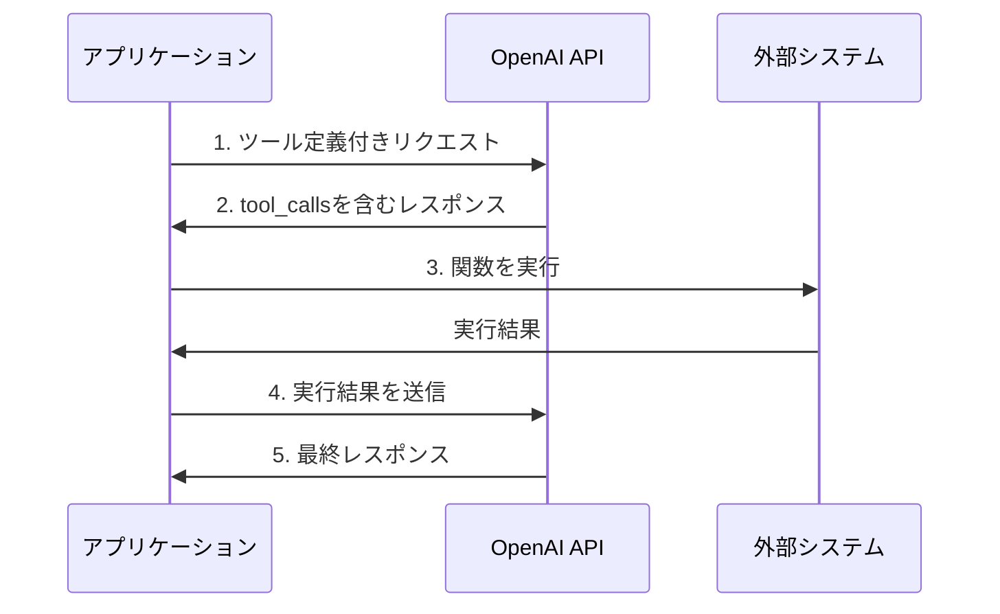
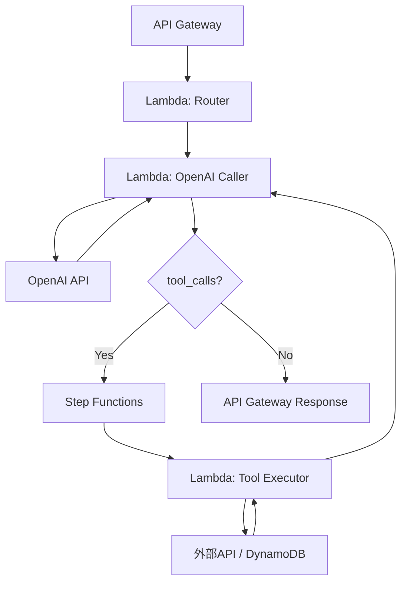
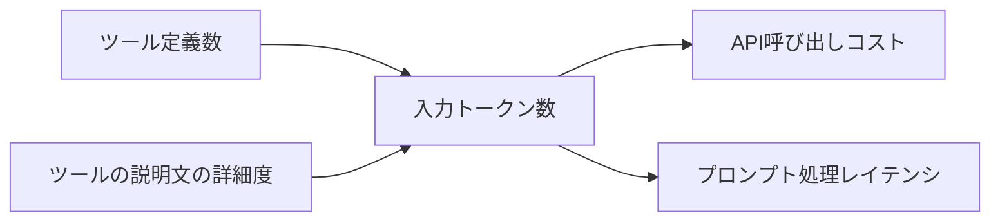
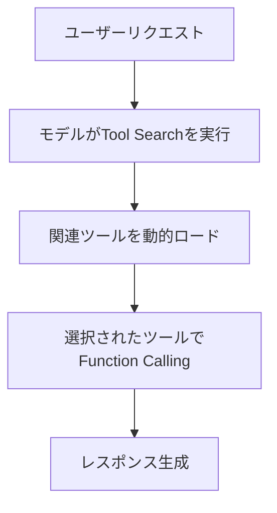

## ブログ概要

OpenAIの公式Function Callingガイドは、LLMが外部システムと連携するためのツール呼び出しメカニズムを体系的に解説したドキュメントである。本ガイドでは、関数定義のJSON Schema設計、Strict Modeによるスキーマ準拠の保証、並列関数呼び出し、ツール名前空間、大規模ツールセット向けのTool Search機能、さらにLark CFGやRegex CFGによるカスタムツールまでをカバーしている。

Zenn記事「AIエージェントのツール設計8原則」ではFunction Callingを本番稼働させるための設計原則を扱ったが、本記事ではOpenAI公式ガイドの技術的詳細に踏み込み、Strict Modeの制約やスキーマ設計のベストプラクティス、トークン最適化の手法を解説する。

本記事は [Zenn記事: AIエージェントのツール設計8原則：Function Callingを本番で安定稼働させる](https://zenn.dev/0h_n0/articles/cbb9a0aa58e88c) の深掘りです。

## 情報源

- **種別**: 企業テックブログ（OpenAI公式開発者ドキュメント）
- **URL**: [Function Calling Guide](https://developers.openai.com/api/docs/guides/function-calling)
- **組織**: OpenAI

本記事は [https://developers.openai.com/api/docs/guides/function-calling](https://developers.openai.com/api/docs/guides/function-calling) の解説記事です。

## 技術的背景

### Function Callingとは

OpenAIのFunction Callingは、LLMが外部システムと構造化されたインターフェースで通信するための機構である。ガイドでは3つの要素を定義している。

| 要素 | 説明 | 役割 |
|------|------|------|
| **Tools** | モデルが利用可能な機能の定義 | 関数名・説明・パラメータスキーマを記述 |
| **Tool Calls** | モデルが生成するツール呼び出しリクエスト | 関数名と引数のJSON |
| **Tool Call Outputs** | ツール実行結果をモデルに返すレスポンス | 実行結果の文字列 |

### Function Callingの進化

OpenAIのFunction Callingは2023年6月のGPT-3.5/GPT-4への導入以降、段階的に機能が拡充されてきた。

| 時期 | 機能 | 意義 |
|------|------|------|
| 2023年6月 | Function Calling初期導入 | モデルがJSON形式で関数呼び出しを生成可能に |
| 2024年8月 | Structured Outputs / Strict Mode | スキーマ準拠を保証（100%準拠） |
| 2025年以降 | Tool Search / Custom Tools | 大規模ツールセットへの対応、文法制約 |

### なぜStrict Modeが重要か

Strict Mode導入以前は、モデルが生成するJSONがスキーマに準拠しない場合があった。OpenAIのガイドでは、Strict Modeが「Structured Outputsを活用してスキーマ準拠を保証する」と説明されている。具体的には、Constrained Decodingによりトークン生成時にスキーマ違反を防ぐ仕組みである。

## 実装アーキテクチャ

### 5ステップフロー

OpenAIのガイドでは、Function Callingの処理フローを以下の5ステップで説明している。



### 関数定義のスキーマ設計

ガイドでは、関数定義に以下の要素が必要と説明されている。

```python
from openai import OpenAI
from typing import Any

client = OpenAI()


def create_tool_definition(
    name: str,
    description: str,
    parameters: dict[str, Any],
    strict: bool = True,
) -> dict[str, Any]:
    """OpenAI Function Calling用のツール定義を生成する。

    Args:
        name: 関数の識別子（a-z, A-Z, 0-9, アンダースコア、ハイフン）
        description: 関数の目的と使用方法
        parameters: JSON Schemaによるパラメータ定義
        strict: Strict Modeの有効化（推奨: True）

    Returns:
        OpenAI API準拠のツール定義dict
    """
    return {
        "type": "function",
        "function": {
            "name": name,
            "description": description,
            "parameters": parameters,
            "strict": strict,
        },
    }
```

### Strict Mode対応のJSON Schema

Strict Modeを有効にする場合、JSON Schemaに以下の制約がある。ガイドでは「すべてのフィールドをrequiredに含め、オプショナルなフィールドはnull型を追加する」と説明されている。

```json
{
  "type": "object",
  "properties": {
    "location": {
      "type": "string",
      "description": "都市名（例: 東京、大阪）"
    },
    "unit": {
      "type": ["string", "null"],
      "enum": ["celsius", "fahrenheit", null],
      "description": "温度の単位。指定なしの場合はnull"
    }
  },
  "required": ["location", "unit"],
  "additionalProperties": false
}
```

Strict Modeの制約をまとめると以下の通りである。

| 制約 | 説明 | 理由 |
|------|------|------|
| `additionalProperties: false` | 定義外のプロパティを禁止 | スキーマ外のフィールド生成を防止 |
| 全フィールドが`required` | オプショナルフィールドは`null`型で表現 | Constrained Decodingの決定性を保証 |
| サポート外のJSON Schema機能あり | 一部の高度な機能は非対応 | デコーディング時の制約生成の実装上の制限 |
| スキーマキャッシュが必要 | ファインチューニングモデルでは初回にキャッシュ構築 | 制約付きデコーディングの前処理 |

### 完全な実装例

以下は、天気情報取得のFunction Callingを実装した例である。

```python
import json
from openai import OpenAI
from typing import Any

client = OpenAI()


def get_weather(location: str, unit: str | None = None) -> dict[str, Any]:
    """外部APIから天気情報を取得する（実装例）。

    Args:
        location: 都市名
        unit: 温度の単位（celsius / fahrenheit）

    Returns:
        天気情報を含むdict
    """
    # 実際には外部APIを呼び出す
    return {
        "location": location,
        "temperature": 22,
        "unit": unit or "celsius",
        "condition": "晴れ",
    }


def run_function_calling() -> str:
    """Function Callingの5ステップフローを実行する。

    Returns:
        モデルの最終レスポンス
    """
    tools = [
        {
            "type": "function",
            "function": {
                "name": "get_weather",
                "description": "指定した都市の現在の天気情報を取得する",
                "parameters": {
                    "type": "object",
                    "properties": {
                        "location": {
                            "type": "string",
                            "description": "都市名（例: 東京、大阪）",
                        },
                        "unit": {
                            "type": ["string", "null"],
                            "enum": ["celsius", "fahrenheit", None],
                            "description": "温度の単位",
                        },
                    },
                    "required": ["location", "unit"],
                    "additionalProperties": False,
                },
                "strict": True,
            },
        }
    ]

    messages: list[dict[str, Any]] = [
        {"role": "user", "content": "東京の天気を教えてください"}
    ]

    # ステップ1: ツール定義付きリクエスト
    response = client.chat.completions.create(
        model="gpt-4o",
        messages=messages,
        tools=tools,
    )

    message = response.choices[0].message

    # ステップ2: tool_callsの確認
    if message.tool_calls:
        for tool_call in message.tool_calls:
            # ステップ3: 関数を実行
            args = json.loads(tool_call.function.arguments)
            result = get_weather(**args)

            # ステップ4: 実行結果を送信
            messages.append(message.model_dump())
            messages.append(
                {
                    "role": "tool",
                    "tool_call_id": tool_call.id,
                    "content": json.dumps(result, ensure_ascii=False),
                }
            )

        # ステップ5: 最終レスポンス
        final_response = client.chat.completions.create(
            model="gpt-4o",
            messages=messages,
            tools=tools,
        )
        return final_response.choices[0].message.content or ""

    return message.content or ""
```

## 本番デプロイガイド

### AWSにおけるFunction Callingパイプラインの構成

Function Callingを本番環境で運用する場合、以下のアーキテクチャパターンが有効である。



### Terraformによるインフラ定義

以下は、Function Callingパイプラインの主要コンポーネントをTerraformで定義する例である。

```hcl
# OpenAI APIキーの管理
resource "aws_secretsmanager_secret" "openai_api_key" {
  name        = "openai-api-key"
  description = "OpenAI API key for Function Calling"
}

# Function Calling実行用Lambda
resource "aws_lambda_function" "openai_caller" {
  function_name = "openai-function-caller"
  runtime       = "python3.12"
  handler       = "handler.lambda_handler"
  timeout       = 120  # Function Callingのラウンドトリップを考慮
  memory_size   = 256

  environment {
    variables = {
      OPENAI_SECRET_ARN = aws_secretsmanager_secret.openai_api_key.arn
      TOOL_EXECUTOR_ARN = aws_lambda_function.tool_executor.arn
    }
  }
}

# ツール実行用Lambda
resource "aws_lambda_function" "tool_executor" {
  function_name = "tool-executor"
  runtime       = "python3.12"
  handler       = "executor.lambda_handler"
  timeout       = 30
  memory_size   = 128
}

# Step Functionsによるオーケストレーション
resource "aws_sfn_state_machine" "function_calling_flow" {
  name     = "function-calling-orchestrator"
  role_arn = aws_iam_role.step_functions_role.arn

  definition = jsonencode({
    StartAt = "CallOpenAI"
    States = {
      CallOpenAI = {
        Type     = "Task"
        Resource = aws_lambda_function.openai_caller.arn
        Next     = "CheckToolCalls"
      }
      CheckToolCalls = {
        Type = "Choice"
        Choices = [
          {
            Variable     = "$.has_tool_calls"
            BooleanEquals = true
            Next         = "ExecuteTools"
          }
        ]
        Default = "ReturnResponse"
      }
      ExecuteTools = {
        Type     = "Task"
        Resource = aws_lambda_function.tool_executor.arn
        Next     = "CallOpenAI"
      }
      ReturnResponse = {
        Type = "Succeed"
      }
    }
  })
}
```

### モニタリングとコスト最適化

Function Callingの本番運用では、以下のメトリクスを監視することが重要である。

```python
import time
import logging
import json
from dataclasses import dataclass, field, asdict

logger = logging.getLogger(__name__)


@dataclass
class FunctionCallingMetrics:
    """Function Calling実行のメトリクスを収集する。"""

    request_id: str
    model: str
    tool_count: int = 0
    tool_call_rounds: int = 0
    total_input_tokens: int = 0
    total_output_tokens: int = 0
    tool_execution_ms: float = 0.0
    total_latency_ms: float = 0.0
    errors: list[str] = field(default_factory=list)

    def log_metrics(self) -> None:
        """構造化ログとしてメトリクスを出力する。"""
        logger.info(
            json.dumps(
                {
                    "event": "function_calling_complete",
                    "level": "info",
                    "ts": time.time(),
                    "request_id": self.request_id,
                    "duration_ms": self.total_latency_ms,
                    **asdict(self),
                },
                ensure_ascii=False,
            )
        )

    @property
    def estimated_cost_usd(self) -> float:
        """トークン使用量からコストを概算する。

        GPT-4oの料金（2026年時点）に基づく概算値。
        実際の料金はOpenAIの公式ページを確認すること。
        """
        input_cost = self.total_input_tokens * 2.5 / 1_000_000
        output_cost = self.total_output_tokens * 10.0 / 1_000_000
        return input_cost + output_cost
```

| メトリクス | 監視目的 | 閾値の目安 |
|-----------|---------|-----------|
| `tool_call_rounds` | 無限ループ検知 | 5回以上で警告 |
| `total_input_tokens` | コスト管理 | ツール定義数に比例して増加 |
| `tool_execution_ms` | 外部API遅延 | SLAに応じて設定 |
| `errors` | 障害検知 | 1件以上で調査 |

## パフォーマンス最適化

### トークン最適化

ガイドでは「関数定義は入力トークンとしてカウントされる」と明記されている。ツール数が増えるとトークン消費が増大し、コストとレイテンシに直結する。



OpenAIのガイドでは以下の最適化戦略を推奨している。

**1. ロードするツール数を制限する**

ガイドでは「初期段階では20関数以内に抑えることを推奨」と述べている。

```python
from typing import Any


def select_relevant_tools(
    user_intent: str,
    all_tools: list[dict[str, Any]],
    max_tools: int = 20,
) -> list[dict[str, Any]]:
    """ユーザーの意図に基づいて関連するツールを選択する。

    Args:
        user_intent: ユーザーのリクエストから推定した意図
        all_tools: 利用可能な全ツール定義
        max_tools: 最大ツール数

    Returns:
        選択されたツール定義のリスト
    """
    # 名前空間ベースのフィルタリング
    intent_namespace_map: dict[str, list[str]] = {
        "billing": ["billing_", "invoice_", "payment_"],
        "shipping": ["shipping_", "tracking_", "delivery_"],
        "crm": ["crm_", "customer_", "contact_"],
    }

    relevant_prefixes: list[str] = []
    for namespace, prefixes in intent_namespace_map.items():
        if namespace in user_intent.lower():
            relevant_prefixes.extend(prefixes)

    if relevant_prefixes:
        filtered = [
            tool
            for tool in all_tools
            if any(
                tool["function"]["name"].startswith(prefix)
                for prefix in relevant_prefixes
            )
        ]
        return filtered[:max_tools]

    return all_tools[:max_tools]
```

**2. 逐次的な関数を統合する**

ガイドでは「常に連続して呼ばれる複数の関数は1つに統合すべき」と推奨している。

```python
# 非推奨: 2つの関数を連続呼び出し
tools_bad = [
    {
        "type": "function",
        "function": {
            "name": "get_user_id",
            "description": "ユーザー名からIDを取得する",
            "parameters": {
                "type": "object",
                "properties": {
                    "username": {"type": "string"},
                },
                "required": ["username"],
                "additionalProperties": False,
            },
            "strict": True,
        },
    },
    {
        "type": "function",
        "function": {
            "name": "get_user_orders",
            "description": "ユーザーIDから注文一覧を取得する",
            "parameters": {
                "type": "object",
                "properties": {
                    "user_id": {"type": "integer"},
                },
                "required": ["user_id"],
                "additionalProperties": False,
            },
            "strict": True,
        },
    },
]

# 推奨: 1つの関数に統合
tools_good = [
    {
        "type": "function",
        "function": {
            "name": "get_user_orders_by_name",
            "description": "ユーザー名から注文一覧を直接取得する",
            "parameters": {
                "type": "object",
                "properties": {
                    "username": {"type": "string"},
                },
                "required": ["username"],
                "additionalProperties": False,
            },
            "strict": True,
        },
    },
]
```

**3. コードにオフロードする**

ガイドでは「関数で実行すべき処理をモデルに頼まない」ことを推奨している。例えば、日付のフォーマット変換やフィルタリングはアプリケーションコードで処理すべきである。

### Tool Choice設定

ガイドでは、モデルのツール選択動作を制御するための4つのオプションを定義している。

| 設定 | 動作 | ユースケース |
|------|------|-------------|
| `auto`（デフォルト） | モデルが自律的に判断 | 汎用的な対話 |
| `required` | 必ずいずれかのツールを呼ぶ | ツール呼び出しを保証したい場合 |
| `{"type": "function", "function": {"name": "..."}}` | 特定の関数を強制 | 決定論的なパイプライン |
| `allowed_tools` | 許可するツールのリストを指定 | ツールのサブセットに限定 |

```python
from openai import OpenAI
from typing import Any

client = OpenAI()


def call_with_tool_choice(
    messages: list[dict[str, Any]],
    tools: list[dict[str, Any]],
    tool_choice: str | dict[str, Any] = "auto",
) -> Any:
    """tool_choice設定を指定してAPIを呼び出す。

    Args:
        messages: チャットメッセージ
        tools: ツール定義
        tool_choice: ツール選択の制御設定

    Returns:
        APIレスポンス
    """
    return client.chat.completions.create(
        model="gpt-4o",
        messages=messages,
        tools=tools,
        tool_choice=tool_choice,
    )
```

### 並列関数呼び出し

ガイドでは、GPT-5以降のモデルがビルトインツールと組み合わせた並列関数呼び出しに対応していると説明されている。並列呼び出しを無効化するには`parallel_tool_calls: false`を設定する。

```python
from openai import OpenAI
from typing import Any

client = OpenAI()


def call_with_parallel_disabled(
    messages: list[dict[str, Any]],
    tools: list[dict[str, Any]],
) -> Any:
    """並列関数呼び出しを無効化してAPIを呼び出す。

    Args:
        messages: チャットメッセージ
        tools: ツール定義

    Returns:
        APIレスポンス
    """
    return client.chat.completions.create(
        model="gpt-4o",
        messages=messages,
        tools=tools,
        parallel_tool_calls=False,
    )
```

並列呼び出しを無効化すべきケースとして、ガイドでは「関数間に依存関係がある場合」を挙げている。

### Tool Search

ガイドでは、大規模なツールエコシステム向けに**Tool Search**機能を説明している。100以上のツールがある場合、全ツール定義をリクエストに含めるとトークンが膨大になる。Tool Searchはモデルがユーザーのリクエストに基づいて必要なツールを動的にロードする仕組みである（GPT-5.4以降で対応）。



### ツール名前空間

ガイドでは、ドメインごとにツールをグループ化する**名前空間パターン**を推奨している。

```python
# 名前空間によるツールのグループ化
tool_namespaces: dict[str, list[str]] = {
    "crm": [
        "crm_get_customer",
        "crm_update_customer",
        "crm_search_customers",
    ],
    "billing": [
        "billing_create_invoice",
        "billing_get_invoice",
        "billing_process_payment",
    ],
    "shipping": [
        "shipping_create_label",
        "shipping_track_package",
        "shipping_estimate_cost",
    ],
}
```

## 運用での学び

### Strict Modeの注意点

Strict Modeは強力だが、以下の制約を理解して設計する必要がある。

**1. サポート外のJSON Schema機能**

ガイドでは「すべてのJSON Schema機能がStrict Modeでサポートされるわけではない」と説明されている。以下の機能は注意が必要である。

| 機能 | Strict Modeでの対応 |
|------|-------------------|
| `additionalProperties` | `false`のみ許可 |
| `enum` | サポートあり |
| `anyOf` / `oneOf` | 一部制限あり |
| `$ref`（再帰） | 深さに制限あり |
| デフォルト値 | Strict Modeでは無視される |

**2. スキーマキャッシュ**

ガイドでは、ファインチューニングしたモデルでStrict Modeを使う場合、「初回リクエスト時にスキーマのキャッシュ構築が必要」と説明されている。これにより初回リクエストのレイテンシが増加する可能性がある。

**3. オプショナルフィールドの設計**

Strict Modeでは全フィールドが`required`であるため、オプショナルなフィールドは型に`null`を含める必要がある。

```python
# Strict Mode対応のオプショナルフィールド設計
strict_schema_with_optional: dict = {
    "type": "object",
    "properties": {
        "query": {
            "type": "string",
            "description": "検索クエリ（必須）",
        },
        "max_results": {
            "type": ["integer", "null"],
            "description": "最大結果数。指定なしの場合はnull（デフォルト10件）",
        },
        "sort_by": {
            "type": ["string", "null"],
            "enum": ["relevance", "date", "popularity", None],
            "description": "ソート順。指定なしの場合はnull",
        },
    },
    "required": ["query", "max_results", "sort_by"],
    "additionalProperties": False,
}
```

### ベストプラクティス: ガイドの3原則

OpenAIのガイドでは、Function Calling設計のベストプラクティスとして3つの原則を挙げている。

**原則1: ドキュメントの品質**

ガイドでは「明確な関数名、明示的な目的、パラメータのフォーマットとエッジケースの記述」を推奨している。

```python
# 良い例: 詳細な説明
good_tool: dict = {
    "type": "function",
    "function": {
        "name": "search_products",
        "description": (
            "商品カタログからキーワード検索を行う。"
            "完全一致ではなく部分一致で検索される。"
            "結果は関連度順にソートされる。"
            "在庫切れ商品も含まれるが、is_in_stockフラグで判別可能。"
        ),
        "parameters": {
            "type": "object",
            "properties": {
                "keyword": {
                    "type": "string",
                    "description": "検索キーワード。複数語はスペース区切り",
                },
                "category": {
                    "type": ["string", "null"],
                    "enum": ["electronics", "clothing", "books", None],
                    "description": "カテゴリで絞り込み。nullで全カテゴリ",
                },
                "max_results": {
                    "type": ["integer", "null"],
                    "description": "最大件数（1-100）。nullの場合は20件",
                },
            },
            "required": ["keyword", "category", "max_results"],
            "additionalProperties": False,
        },
        "strict": True,
    },
}
```

**原則2: ソフトウェアエンジニアリングの原則**

ガイドでは「最小驚きの原則（Principle of Least Surprise）」「enum/objectによる不正状態の防止」「インターンテスト（新人が見ても使い方がわかるか）」を推奨している。

**原則3: 最適化**

ガイドでは「コードにオフロードする」「逐次的な関数を統合する」「初期段階では20関数以内」「大規模セットにはTool Searchを使う」という最適化戦略を推奨している。

### カスタムツール（文法制約）

ガイドでは、JSON Schema以外の出力フォーマットを制御するための**カスタムツール**機能を説明している。Lark CFG（Context-Free Grammar）やRegex CFGで出力文法を定義できる。

```python
# Lark CFGによるカスタムツールの例（ガイドの説明に基づく）
custom_tool_with_grammar: dict = {
    "type": "function",
    "function": {
        "name": "generate_sql_query",
        "description": "ユーザーのリクエストに基づいてSQLクエリを生成する",
        "parameters": {
            "type": "object",
            "properties": {
                "query": {
                    "type": "string",
                    "description": "生成されたSQLクエリ",
                }
            },
            "required": ["query"],
            "additionalProperties": False,
        },
        "strict": True,
    },
}
```

カスタムツールは、SQL生成やDSL（Domain-Specific Language）の生成など、JSON以外の構造化出力が必要なユースケースで有効である。

## 学術研究との関連

Function Callingの技術的基盤は、以下の研究分野と関連している。

| 研究分野 | 関連性 | 代表的な研究 |
|---------|-------|------------|
| Constrained Decoding | Strict Modeの基盤技術 | Willard & Louf (2023) "Efficient Guided Generation for LLMs" |
| Tool-Augmented LLM | Function Callingの概念的基盤 | Schick et al. (2023) "Toolformer" |
| JSON Schema Validation | スキーマ準拠の理論的背景 | JSON Schema Draft 2020-12仕様 |
| LLM Agent | Function Callingを活用したエージェント設計 | Yao et al. (2023) "ReAct" |

Constrained Decodingの研究では、トークン生成時に有限状態オートマトン（FSA）や文脈自由文法（CFG）を使って出力を制約する手法が提案されている。OpenAIのStrict Modeはこの技術を実用化したものであり、JSON Schemaから制約を自動生成する点が特徴的である。

## まとめと実践への示唆

OpenAI公式Function Callingガイドの要点を以下にまとめる。

### 設計チェックリスト

| チェック項目 | 推奨事項 |
|------------|---------|
| Strict Mode | `strict: true`を設定し、スキーマ準拠を保証 |
| スキーマ設計 | `additionalProperties: false`、全フィールド`required` |
| オプショナルフィールド | `null`型を追加して表現 |
| ツール数 | 初期段階では20以内、大規模時はTool Searchを検討 |
| 関数名 | ドメインごとの名前空間で整理 |
| 説明文 | 目的・パラメータ形式・エッジケースを明記 |
| 並列呼び出し | 依存関係がある場合は`parallel_tool_calls: false` |
| トークン管理 | ツール定義は入力トークンとしてカウントされる点に注意 |

### Zenn記事との関連

Zenn記事「AIエージェントのツール設計8原則」で紹介した設計原則は、OpenAI公式ガイドのベストプラクティスと以下の点で整合する。

- **最小驚きの原則**: ガイドが推奨する「Principle of Least Surprise」と同一
- **不正状態の防止**: Strict Modeの`additionalProperties: false`で型レベルで保証
- **トークン効率**: ガイドが推奨する「20関数以内」「逐次関数の統合」と一致

OpenAI公式ガイドは、Function Callingの設計・実装・最適化に関する包括的なリファレンスとして、本番環境でのツール設計に有用である。

## 参考文献

1. OpenAI. "Function Calling Guide." OpenAI Developer Documentation. [https://developers.openai.com/api/docs/guides/function-calling](https://developers.openai.com/api/docs/guides/function-calling)
2. OpenAI. "Structured Outputs." OpenAI Developer Documentation. [https://platform.openai.com/docs/guides/structured-outputs](https://platform.openai.com/docs/guides/structured-outputs)
3. Willard, B., & Louf, R. (2023). "Efficient Guided Generation for Large Language Models." arXiv:2307.09702.
4. Schick, T., et al. (2023). "Toolformer: Language Models Can Teach Themselves to Use Tools." arXiv:2302.04761.
5. Yao, S., et al. (2023). "ReAct: Synergizing Reasoning and Acting in Language Models." arXiv:2210.03629.
