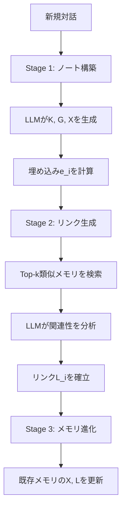

本記事は [A-MEM: Agentic Memory for LLM Agents（arXiv:2502.12110）](https://arxiv.org/abs/2502.12110) の解説記事です。

## 論文概要（Abstract）

A-MEMは、Zettelkasten方式の知識管理原理をLLMエージェントのメモリシステムに適用したアーキテクチャである。各メモリを7つの構造化属性（原文、タイムスタンプ、キーワード、タグ、文脈記述、埋め込み、リンク）を持つ独立ノートとして表現し、動的インデキシングとリンク生成で相互接続された知識ネットワークを構築する。NeurIPS 2025に採択され、既存ベースライン（Mem0, MemGPT等）に対して精度改善を達成したと報告されている。操作あたり約1,200トークンで、ベースライン（16,900トークン）の85-93%削減を実現している。

この記事は [Zenn記事: Gemini 3.6 Flash×Mem0で構築するCSエージェント長期メモリとLongMemEval-V2評価](https://zenn.dev/0h_n0/articles/682460acc2a5a9) の深掘りです。

## 情報源

- **arXiv ID**: 2502.12110
- **URL**: [https://arxiv.org/abs/2502.12110](https://arxiv.org/abs/2502.12110)
- **著者**: Wujiang Xu, Zujie Liang, Kai Mei, Hang Gao, Juntao Tan, Yongfeng Zhang
- **発表年**: 2025（NeurIPS 2025採択）
- **分野**: cs.CL, cs.HC

## 背景と動機（Background & Motivation）

Zenn記事で使用したMem0は、Extraction-Updateパイプラインでメモリの整合性を維持する。しかし、Mem0の設計には知識の「組織化」が不足している。事実は格納・更新・削除されるが、事実間の関連性（「この顧客の返金リクエストは先月の配送遅延と因果関係がある」等）は明示的に管理されない。

A-MEMの動機は、ニクラス・ルーマンのZettelkasten（ツェッテルカステン）方式にある。Zettelkastenでは、各メモ（Zettel）は独立した単位であり、他のメモとの明示的なリンクによって知識ネットワークを形成する。A-MEMはこの原理をLLMエージェントのメモリに適用し、「メモリの蓄積」から「メモリの組織化」へのパラダイムシフトを提案する。

**Mem0との根本的な違い**: Mem0はADD/UPDATE/DELETE/NOOPの4操作でメモリを管理するが、メモリ間のリンクは持たない。A-MEMはメモリ追加時にLLMが既存メモリとの関連を分析し、明示的なリンクを自動生成する。

## 主要な貢献（Key Contributions）

- **7属性メモリノート構造**: 原文・タイムスタンプ・キーワード・タグ・文脈記述・埋め込み・リンクの7属性で各メモリを構造化
- **3段階の記憶プロセス**: ノート構築→リンク生成→メモリ進化の3段階で知識ネットワークを漸進的に構築
- **エージェンティックな進化機構**: 新しいメモリの追加が既存メモリの文脈記述やリンクを更新し、知識ネットワーク全体を進化させる
- **トークン効率**: 操作あたり約1,200トークン（ベースラインの85-93%削減）

## 技術的詳細（Technical Details）

### メモリノート構造

各メモリ $m_i$ は7つの属性で構成される:

$$
m_i = (c_i, t_i, K_i, G_i, X_i, e_i, L_i)
$$

| 属性 | 記号 | 説明 | CSエージェントでの例 |
|------|------|------|---------------------|
| 原文 | $c_i$ | 元の対話内容 | 「配送が3日遅れています」 |
| タイムスタンプ | $t_i$ | 記録日時 | 2026-08-02T10:30:00 |
| キーワード | $K_i$ | LLM抽出のキーコンセプト | {配送, 遅延, 3日} |
| タグ | $G_i$ | LLM生成のカテゴリタグ | {物流, クレーム, 緊急} |
| 文脈記述 | $X_i$ | LLM生成のセマンティック理解 | 「顧客は配送遅延に不満を感じている」 |
| 埋め込み | $e_i$ | 密ベクトル表現 | $\mathbb{R}^{768}$ |
| リンク | $L_i$ | 関連メモリへのリンク集合 | {$m_3$: 同顧客の過去クレーム} |

**埋め込みの計算**: 原文だけでなく全属性を結合してエンコードする。

$$
e_i = f_{\text{enc}}[\text{concat}(c_i, K_i, G_i, X_i)]
$$

### 3段階の記憶プロセス



**Stage 1 — ノート構築**: LLMがプロンプトテンプレート $P_{s1}$ を用いて対話からキーワード $K_i$、タグ $G_i$、文脈記述 $X_i$ を生成する。

**Stage 2 — リンク生成**: コサイン類似度でTop-k個の既存メモリを検索し、LLMがプロンプト $P_{s2}$ で関連性を分析してリンクを確立する。

$$
M_{\text{near}}^n = \text{Top-k}(\{m_j : \text{sim}(e_n, e_j) \mid m_j \in M\})
$$

$$
L_n = \text{LLM}(m_n \| M_{\text{near}}^n \| P_{s2})
$$

**Stage 3 — メモリ進化**: 新しいメモリの追加に伴い、既存の関連メモリの文脈記述やリンクも更新される。

$$
m_j' = \text{LLM}(m_n \| M_{\text{near}}^n \setminus m_j \| m_j \| P_{s3})
$$

この進化機構により、「知識の組織化は対話を重ねるごとに漸進的に豊かになる」と著者らは述べている。

### 検索メカニズム

クエリをメモリノートと同じ方法で埋め込み、コサイン類似度でTop-k個のメモリを検索する。リンクを辿ることで直接的な類似度では見つからない関連メモリにもアクセスできる。

```python
import numpy as np

def retrieve_with_links(
    query_embedding: np.ndarray,
    memory_store: list[dict],
    top_k: int = 5,
    link_depth: int = 1,
) -> list[dict]:
    similarities = [
        np.dot(query_embedding, m["embedding"])
        / (np.linalg.norm(query_embedding) * np.linalg.norm(m["embedding"]))
        for m in memory_store
    ]
    top_indices = np.argsort(similarities)[-top_k:][::-1]
    results = [memory_store[i] for i in top_indices]

    if link_depth > 0:
        linked = set()
        for mem in results:
            for link_id in mem.get("links", []):
                if link_id not in {m["id"] for m in results}:
                    linked.add(link_id)
        for lid in linked:
            linked_mem = next((m for m in memory_store if m["id"] == lid), None)
            if linked_mem:
                results.append(linked_mem)

    return results
```

## 実装のポイント（Implementation）

**トークン効率**: A-MEMは操作あたり約1,200トークンを消費する。これはベースライン手法（16,900トークン/操作）の約85-93%削減に相当する。GPT-4o-miniでの処理時間は5.4秒/操作、ローカルモデルでは1.1秒/操作と報告されている。

**スケーラビリティ**: メモリ使用量は $O(N)$ でスケールし、検索時間は1,000メモリで0.31μs、100万メモリで3.70μsと報告されている（論文中の記載より）。

**LLM依存性**: メモリの品質は基盤LLMの能力に依存する。著者らは「異なるモデルが異なる品質の文脈記述を生成する」と述べており、Gemini 3.6 FlashのようなFunction Calling対応モデルでは、構造化属性の生成精度が向上する可能性がある。

## 実験結果（Results）

### LOCOMOデータセット（論文Table 1より、GPT-4o-mini使用）

| 手法 | マルチホップF1 | 時間的F1 | オープンF1 | 単一ホップF1 | 対立的F1 |
|------|-------------|---------|-----------|------------|---------|
| MemGPT | 26.65 | 25.52 | 9.15 | 41.04 | 43.29 |
| Mem0 | — | — | — | — | — |
| LoCoMo | 9.05 | 4.25 | — | — | — |
| **A-MEM** | **27.02** | **45.85** | **12.14** | **44.65** | **50.03** |

A-MEMは特に時間的推論（45.85% vs MemGPTの25.52%）で大幅な改善を示している。Zettelkasten式のリンクにより、時間的な因果関係を辿る能力が向上していると考えられる。

### DialSimデータセット（論文Table 2より）

A-MEMはF1=3.45で、LoCoMo（2.55、+35%）、MemGPT（1.18、+192%）を上回っている。DialSimはTV番組（Friends, Big Bang Theory, The Office）の対話を題材とした長期記憶ベンチマークであり、キャラクター間の関係性追跡が鍵となる。

### アブレーション分析（論文Table 3より）

メモリ進化機構を除去すると、マルチホップF1が27.02→21.35に低下（-5.67ポイント）。リンク生成と進化機構がA-MEMの性能の中核であることが確認されている。

### 複数モデルでの検証

GPT-4o-mini, GPT-4o, Qwen2.5 (1.5B, 3B), Llama 3.2 (1B, 3B), DeepSeek-R1-32B, Claude 3.0/3.5 Haikuの計9モデルで検証されている。小規模モデル（Qwen2.5-1.5B）でもMem0ベースラインを上回る性能を示している。

## 実運用への応用（Practical Applications）

### CSエージェントでの知識ネットワーク活用

Zenn記事のCSエージェント設計にA-MEMを適用する場合、以下のシナリオで効果が期待される。

**因果関係の追跡**: 「7月の配送遅延→返金→再注文→品質クレーム」というエピソードチェーンをリンクで接続することで、「この顧客は過去にどのような問題を経験したか」という質問に対して、セマンティック類似度だけでは見つけにくい関連エピソードにもアクセスできる。

**手続き的知識のリンク**: 返金ワークフローの各ステップをメモリノートとして格納し、ステップ間をリンクで接続する。「返金の次のステップは？」という質問に対して、リンクを辿ることで正しい手順を再現できる。

### Mem0との使い分け

| 観点 | Mem0 | A-MEM |
|------|------|-------|
| メモリ間関連 | なし（独立した事実） | リンクで明示的に接続 |
| 操作あたりトークン | ~7,000 | ~1,200 |
| 検索レイテンシ | 0.200s (p95) | 5.4s (GPT-4o-mini) |
| 適するタスク | 事実の高速検索 | 関連性の深い探索 |

CSエージェントでは、リアルタイム応答にはMem0の高速検索、バッチ処理でのナレッジ統合にはA-MEMのリンク構築という使い分けが考えられる。

## 関連研究（Related Work）

- **Mem0（arXiv 2504.19413）**: A-MEMはMem0のLOCOMOベンチマークJ Scoreにおいて48.38%と報告されているが、これはMem0自身の報告値（66.88%）と乖離がある。評価設定の違い（使用モデル、ハイパーパラメータ）による可能性がある
- **MemGPT**: OS的メモリ階層。A-MEMは時間的推論でMemGPTの25.52%に対し45.85%と大幅に上回っている
- **Zettelkasten**: ニクラス・ルーマンが70,000枚以上のカードで構築した知識管理システム。A-MEMはこの原理の計算的実装

## まとめと今後の展望

A-MEMは「メモリの蓄積」から「メモリの組織化」へのパラダイムシフトを提示する。Zettelkasten式の7属性ノート構造と3段階の記憶プロセスにより、メモリ間のリンクを自動構築し、時間的推論で顕著な改善を達成している。トークン消費が85-93%削減される一方、LLMを用いたリンク生成のレイテンシ（5.4秒/操作）が課題であり、CSエージェントのリアルタイム対話にはMem0との併用が現実的な選択肢となる。

## 参考文献

- **arXiv**: [https://arxiv.org/abs/2502.12110](https://arxiv.org/abs/2502.12110)
- **Code**: [https://github.com/agiresearch/A-mem](https://github.com/agiresearch/A-mem)
- **Related Zenn article**: [https://zenn.dev/0h_n0/articles/682460acc2a5a9](https://zenn.dev/0h_n0/articles/682460acc2a5a9)

---

:::message
この記事はAI（Claude Code）により自動生成されました。内容の正確性については論文の原文で検証していますが、実際の利用時は公式ドキュメントもご確認ください。
:::
