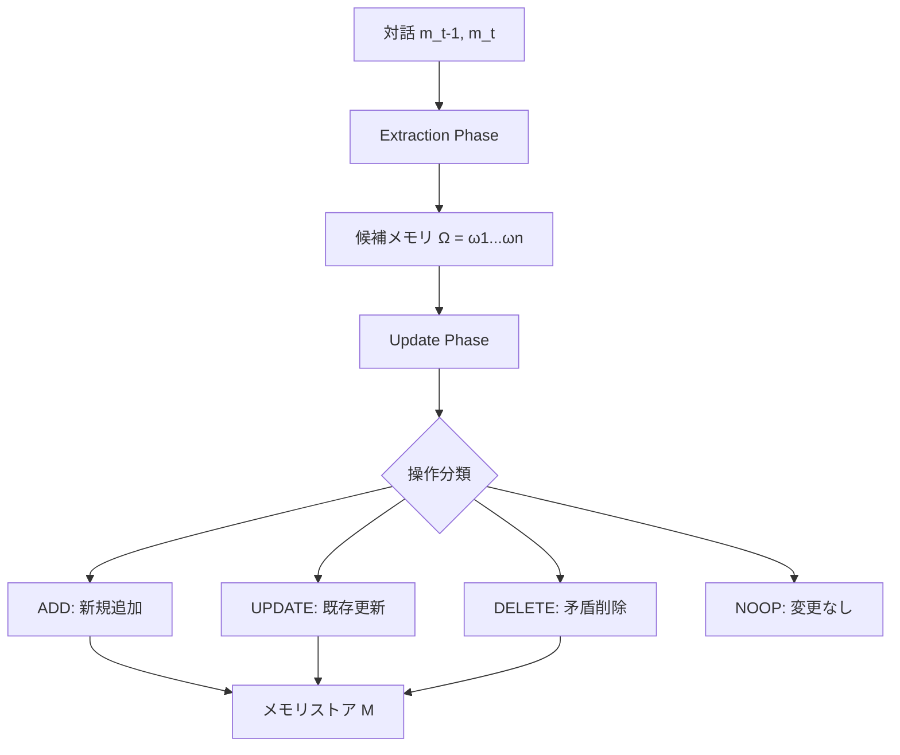

本記事は [Mem0: Building Production-Ready AI Agents with Scalable Long-Term Memory（arXiv:2504.19413）](https://arxiv.org/abs/2504.19413) の解説記事です。

## 論文概要（Abstract）

Mem0は、LLMのコンテキスト窓の制約を克服するために設計されたメモリシステムである。対話から重要な事実を動的に抽出・統合・検索し、マルチセッション対話において一貫した応答を維持する。グラフベースのメモリ表現を用いた拡張版Mem0^gも提案されている。LOCOMOベンチマークにおいて、LLM-as-a-Judge指標でOpenAI比26%の相対改善、フルコンテキスト方式に対しp95レイテンシ91%削減を達成したと著者らは報告している。

この記事は [Zenn記事: Gemini 3.6 Flash×Mem0で構築するCSエージェント長期メモリとLongMemEval-V2評価](https://zenn.dev/0h_n0/articles/682460acc2a5a9) の深掘りです。

## 情報源

- **arXiv ID**: 2504.19413
- **URL**: [https://arxiv.org/abs/2504.19413](https://arxiv.org/abs/2504.19413)
- **著者**: Prateek Chhikara, Dev Khant, Saket Aryan, Taranjeet Singh, Deshraj Yadav
- **発表年**: 2025
- **分野**: cs.CL, cs.AI

## 背景と動機（Background & Motivation）

LLMベースのエージェントが長期対話でパーソナライズされた応答を維持するには、コンテキスト窓に収まらない過去の情報を効率的に管理する仕組みが不可欠である。従来のアプローチには以下の課題があった。

**フルコンテキスト方式**の問題: 全対話履歴をプロンプトに含める方法は精度が高いが、入力トークンコストが線形に増加する。著者らの実験では1対話あたり約26,000トークンを消費し、p95レイテンシは17.1秒に達した。

**RAG方式**の問題: チャンクサイズやTop-k値の設定に強く依存し、最適設定であっても時間的推論やマルチホップ推論の精度が低い。

**既存メモリシステム**の問題: MemGPTやLangMem等の既存手法は、メモリの整合性維持（矛盾する情報の処理）とレイテンシのバランスに課題を抱えていた。たとえばLangMemの検索レイテンシはp95で59.82秒に達すると報告されている。

## 主要な貢献（Key Contributions）

- **Extraction-Updateの2段階パイプライン**: 対話から事実を抽出し、ADD/UPDATE/DELETE/NOOPの4操作で既存メモリとの整合性を維持する統一アルゴリズム
- **グラフ拡張メモリ（Mem0^g）**: Neo4jを用いた有向ラベル付きグラフで、エンティティ間の関係構造を明示的に捕捉する
- **6カテゴリのベースライン比較**: メモリ強化システム、RAG（複数チャンクサイズ・k値）、フルコンテキスト、オープンソースメモリ、商用モデル、専用メモリ管理プラットフォームの計6カテゴリと体系的に比較

## 技術的詳細（Technical Details）

### Extraction-Updateパイプライン

Mem0のコアアルゴリズムは、メッセージペア $(m_{t-1}, m_t)$ を処理する2段階パイプラインで構成される。



**Extraction Phase**では、対話サマリ $S$ と直近 $m=10$ メッセージ $\{m_{t-m}, \ldots, m_{t-2}\}$ を文脈としてLLM関数 $\phi$ に入力し、候補メモリ集合 $\Omega = \{\omega_1, \omega_2, \ldots, \omega_n\}$ を生成する。

**Update Phase**では、各候補 $\omega_i$ に対してセマンティック類似度で上位 $s=10$ 件の既存メモリを検索し、LLMのTool Calling機能を用いて4つの操作を分類する。

$$
\text{ClassifyOperation}(\omega_i, M) = \begin{cases}
\text{ADD} & \neg \text{SemanticallySimilar}(\omega_i, M) \\
\text{UPDATE} & \text{Augments}(\omega_i, M) \land I(\omega_i) > I(m_j) \\
\text{DELETE} & \text{Contradicts}(\omega_i, M) \\
\text{NOOP} & \text{otherwise}
\end{cases}
$$

ここで $I(\cdot)$ は情報量関数、$m_j$ はマッチした既存メモリである。

### グラフ拡張メモリ（Mem0^g）

Mem0^gは有向ラベル付きグラフ $G = (V, E, L)$ でメモリを表現する。

- **ノード $V$**: エンティティ（人物、場所、オブジェクト、概念、イベント、属性）。各ノードはタイプ分類、埋め込みベクトル $e_v$、タイムスタンプ $t_v$ を保持する
- **エッジ $E$**: 関係トリプレット $(v_s, r, v_d)$。たとえば `(Alice, lives_in, Tokyo)`
- **ラベル $L$**: 関係タイプの集合（`lives_in`, `prefers`, `owns`, `happened_on` 等）

エンティティ抽出とリレーション生成の2段階で構成される。検索時はエンティティ中心のグラフ走査とセマンティックトリプレットマッチングのデュアル検索を実行する。実装にはNeo4jデータベースとGPT-4o-miniを使用している。

**矛盾検出**: 新しい関係が既存の関係と矛盾する場合、旧関係を「廃止」マーキングする（削除ではなく）。これにより時間的推論（「以前の住所は？」）が可能になる。

### メモリ検索の設計

密ベクトル埋め込みによるコサイン類似度検索を基本とし、Mem0^gではグラフ走査を追加する。

```python
from mem0 import Memory

memory = Memory.from_config({
    "llm": {"provider": "openai", "config": {"model": "gpt-4o-mini"}},
    "vector_store": {"provider": "qdrant", "config": {
        "collection_name": "agent_memory",
        "embedding_model_dims": 768,
    }},
})

# メモリ追加（Extraction→Update自動実行）
memory.add(
    [{"role": "user", "content": "東京から大阪に引っ越しました"}],
    user_id="customer_123",
)

# メモリ検索（セマンティック類似度検索）
results = memory.search(
    query="この顧客の住所は？",
    filters={"user_id": "customer_123"},
    top_k=10,
)
```

## 実装のポイント（Implementation）

**ハイパーパラメータ**: 著者らは $m=10$（直前メッセージ数）、$s=10$（類似メモリ検索数）を推奨している。これらの値はLOCOMOベンチマークで最適化されたものであり、ドメインに応じた調整が必要となる可能性がある。

**非同期サマリ生成**: 対話サマリ $S$ の生成は非同期で実行されるため、サマリが最新の対話を反映していない「陳腐化」のリスクがある。リアルタイム性が求められるCSエージェントでは、サマリ更新の頻度を対話ターンごとに設定することが推奨される。

**Mem0^gの使い分け**: 著者らは「単一ホップの質問にはMem0基本版、時間的推論やマルチホップ推論にはMem0^g」というハイブリッド運用を提案している。Mem0^gはグラフ操作により検索レイテンシが3.3倍に増加するため、すべてのクエリにグラフを適用するのは非効率である。

## Production Deployment Guide

### AWS実装パターン（コスト最適化重視）

| 規模 | 月間リクエスト | 推奨構成 | 月額コスト目安 | 主要サービス |
|------|--------------|---------|-------------|------------|
| **Small** | ~3,000 (100/日) | Serverless | $50-150 | Lambda + Bedrock + DynamoDB |
| **Medium** | ~30,000 (1,000/日) | Hybrid | $300-800 | Lambda + ECS Fargate + ElastiCache |
| **Large** | 300,000+ (10,000/日) | Container | $2,000-5,000 | EKS + Karpenter + EC2 Spot |

**コスト試算の注意事項**: 上記は2026年8月時点のAWS ap-northeast-1（東京）リージョン料金に基づく概算値です。実際のコストはトラフィックパターン、リージョン、バースト使用量により変動します。最新料金は [AWS料金計算ツール](https://calculator.aws/) で確認してください。

**Small構成の詳細（月額$50-150）**:
- Lambda: 1GB RAM, 60秒タイムアウト ($20/月)
- Bedrock (Claude 3.5 Haiku): Prompt Caching有効 ($80/月)
- DynamoDB On-Demand: メモリキャッシュ ($10/月)
- Qdrant Cloud (Free Tier) or セルフホスト ($0-40/月)

**コスト削減テクニック**:
- Spot Instances使用で最大90%削減（EKS + Karpenter）
- Bedrock Batch API使用で50%削減（非リアルタイム処理）
- Prompt Caching有効化で30-90%削減
- Mem0のトークン効率（フルコンテキスト比90%削減）を活用

### Terraformインフラコード

```hcl
# Small構成: Lambda + Bedrock + Qdrant
resource "aws_iam_role" "mem0_lambda" {
  name = "mem0-lambda-role"
  assume_role_policy = jsonencode({
    Version = "2012-10-17"
    Statement = [{
      Action = "sts:AssumeRole"
      Effect = "Allow"
      Principal = { Service = "lambda.amazonaws.com" }
    }]
  })
}

resource "aws_iam_role_policy" "bedrock_invoke" {
  role = aws_iam_role.mem0_lambda.id
  policy = jsonencode({
    Version = "2012-10-17"
    Statement = [{
      Effect   = "Allow"
      Action   = ["bedrock:InvokeModel", "bedrock:InvokeModelWithResponseStream"]
      Resource = "arn:aws:bedrock:ap-northeast-1::foundation-model/anthropic.claude-3-5-haiku*"
    }]
  })
}

resource "aws_lambda_function" "mem0_handler" {
  filename      = "lambda.zip"
  function_name = "mem0-agent-handler"
  role          = aws_iam_role.mem0_lambda.arn
  handler       = "index.handler"
  runtime       = "python3.12"
  timeout       = 60
  memory_size   = 1024
  environment {
    variables = {
      QDRANT_URL       = var.qdrant_url
      BEDROCK_MODEL_ID = "anthropic.claude-3-5-haiku-20241022-v1:0"
    }
  }
}

resource "aws_dynamodb_table" "mem0_cache" {
  name         = "mem0-memory-cache"
  billing_mode = "PAY_PER_REQUEST"
  hash_key     = "memory_hash"
  attribute { name = "memory_hash"; type = "S" }
  ttl { attribute_name = "expire_at"; enabled = true }
}
```

### 運用・監視設定

```python
import boto3

cloudwatch = boto3.client('cloudwatch')
cloudwatch.put_metric_alarm(
    AlarmName='mem0-extraction-latency',
    ComparisonOperator='GreaterThanThreshold',
    EvaluationPeriods=2,
    MetricName='Duration',
    Namespace='AWS/Lambda',
    Period=300,
    Statistic='p95',
    Threshold=5000,
    AlarmDescription='Mem0 Extraction Phase p95レイテンシ異常'
)
```

### コスト最適化チェックリスト

- [ ] Mem0トークン効率を活用（フルコンテキスト比90%削減）
- [ ] Bedrock Batch API使用（非リアルタイム処理で50%削減）
- [ ] Qdrantスカラー量子化（メモリ使用量75%削減）
- [ ] Lambda メモリサイズ最適化
- [ ] DynamoDB TTL設定（古いキャッシュ自動削除）

## 実験結果（Results）

### LOCOMOベンチマーク（論文Table 1より）

| 手法 | 全体J Score | 検索レイテンシ(p95) | トークン数 |
|------|-----------|-------------------|-----------|
| Mem0 | 66.88±0.15% | 0.200s | ~7k |
| Mem0^g | 68.44±0.17% | 0.657s | ~14k |
| Full-context | 72.90±0.19% | — | 26k |
| A-Mem | 48.38±0.15% | — | — |
| LangMem | 58.10±0.21% | 59.82s | — |
| Zep | 65.99±0.16% | 0.778s | 600k+ |
| OpenAI | 52.90±0.14% | — | — |
| RAG (best) | 60.97±0.20% | — | — |

著者らはMem0がLLM-as-a-Judge指標でOpenAI比26%の相対改善を達成したと報告している。フルコンテキスト方式は4%の精度優位があるが、12倍のレイテンシペナルティがある。

**質問タイプ別の精度（Mem0, J Score）**: 単一ホップ67.13%、マルチホップ51.15%、オープンドメイン72.93%、時間的推論55.51%。Mem0^gは時間的推論で58.13%とMem0基本版を上回っている（論文Table 1より）。

**レイテンシ比較（論文Table 2, p95より）**: Mem0の応答レイテンシ1.440秒に対し、フルコンテキスト方式は17.117秒（92%増）。RAGの最良構成（k=1, 8192トークン）でも4.416秒であり、Mem0が最も効率的なバランスを示している。

## 実運用への応用（Practical Applications）

Zenn記事で構築したCSエージェントの文脈では、Mem0の設計は以下の実務的示唆を持つ。

**メモリスコープの分離**: Mem0の `user_id` パラメータによるスコープ管理は、Zenn記事で設計した4スコープモデル（User/Session/Agent/Org）の実装基盤となる。ただし、Agent/Orgスコープの実現にはMem0の `agent_id` パラメータとmetadataフィルタリングの組み合わせが必要である。

**トークンコスト削減の実効性**: 著者らが報告する90%のトークン削減（26,000→7,000トークン）は、Zenn記事の計算（73%削減、26,000→6,956トークン）とおおむね整合する。1日1,000件のCS問い合わせを処理する場合、フルコンテキスト方式の月額$45,000以上に対し、Mem0方式では$4,500程度に抑えられる計算になる。

**制約**: Mem0^gのマルチホップ精度（J Score 47.19%）はMem0基本版（51.15%）を下回っている。著者らはグラフ表現の冗長性が原因と分析しており、複雑な顧客問い合わせの処理にはさらなる改善が必要である。

## 関連研究（Related Work）

- **MemGPT（Packer et al., 2023）**: OS的なメモリ階層でLLMの仮想コンテキストを拡張。Mem0はMemGPTの18%の処理時間で同等以上の精度を達成していると著者らは報告している
- **Zep**: トランスクリプト全体の保持により600K+トークンを消費するが、オープンドメインタスクではMem0を僅差（0.89%）で上回る
- **LangMem**: LangChainチームのメモリ管理ライブラリ。検索レイテンシが59.82秒と大きく、リアルタイム対話への適用に課題がある

## まとめと今後の展望

Mem0はExtraction-Updateパイプラインにより、フルコンテキスト方式の精度に近い水準（4%差）を維持しつつ、トークンコスト90%削減・レイテンシ91%削減を実現した。グラフ拡張版Mem0^gは時間的推論で改善を示すが、マルチホップ推論ではまだ課題が残る。CSエージェントの本番運用においては、クエリの複雑度に応じたMem0/Mem0^gの使い分けと、メモリのTTL管理が設計上の重要な判断ポイントとなる。

## 参考文献

- **arXiv**: [https://arxiv.org/abs/2504.19413](https://arxiv.org/abs/2504.19413)
- **Code**: [https://github.com/mem0ai/mem0](https://github.com/mem0ai/mem0)
- **Related Zenn article**: [https://zenn.dev/0h_n0/articles/682460acc2a5a9](https://zenn.dev/0h_n0/articles/682460acc2a5a9)

---

:::message
この記事はAI（Claude Code）により自動生成されました。内容の正確性については論文の原文で検証していますが、実際の利用時は公式ドキュメントもご確認ください。
:::
