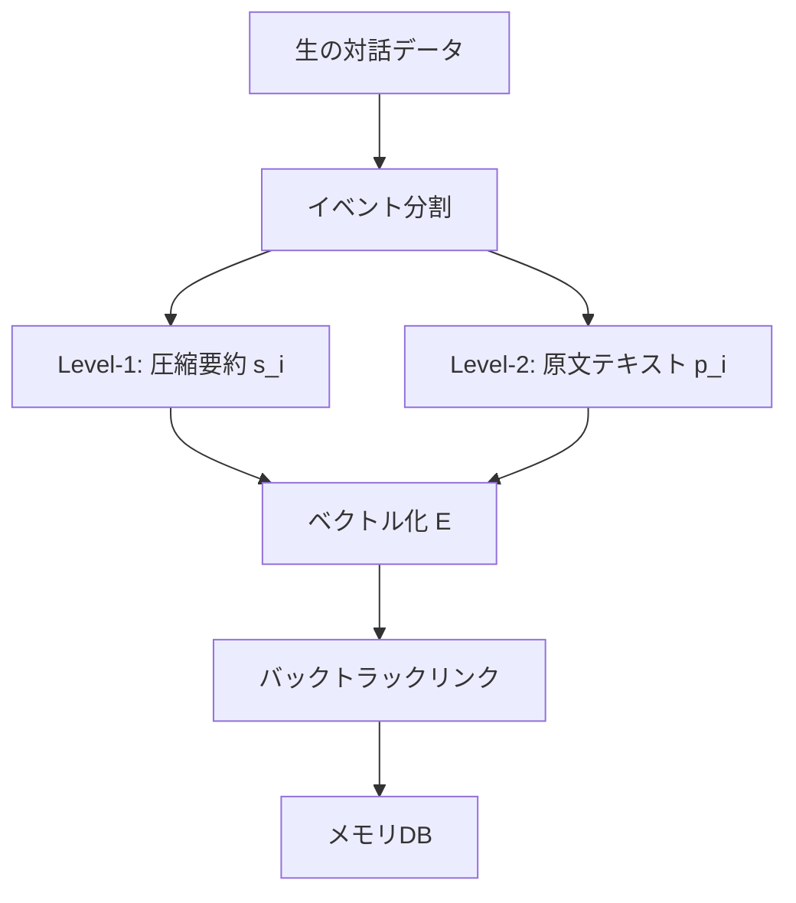

本記事は [HyMem: Hybrid Memory Architecture with Dynamic Retrieval Scheduling（arXiv:2602.13933）](https://arxiv.org/abs/2602.13933) の解説記事です。

## 論文概要（Abstract）

HyMemは、LLMエージェントの長期対話における「効率性と有効性のトレードオフ」を解決するハイブリッドメモリアーキテクチャである。認知経済性（cognitive economy）の原理に着想を得て、二重粒度ストレージ（要約+原文）と二段階検索システム（軽量モジュール+深層モジュール）を統合する。LOCOMOベンチマークで89.55%（フルコンテキスト方式の87.52%を上回る）を達成しつつ、計算コストを92.6%削減したと著者らは報告している。

この記事は [Zenn記事: Gemini 3.6 Flash×Mem0で構築するCSエージェント長期メモリとLongMemEval-V2評価](https://zenn.dev/0h_n0/articles/682460acc2a5a9) の深掘りです。

## 情報源

- **arXiv ID**: 2602.13933
- **URL**: [https://arxiv.org/abs/2602.13933](https://arxiv.org/abs/2602.13933)
- **著者**: Xiaochen Zhao, Kaikai Wang, Xiaowen Zhang, Chen Yao, Aili Wang
- **発表年**: 2026
- **分野**: cs.AI, cs.CL

## 背景と動機（Background & Motivation）

Zenn記事で設計したCSエージェントは、Mem0のセマンティック検索で関連メモリを取得している。しかし、この単一粒度・単一段階の検索には根本的なトレードオフが存在する。

**メモリ圧縮のジレンマ**: 対話を要約してコンパクトに格納すると効率的だが、具体的な発言内容や文脈が失われる。一方、原文をそのまま保持すると詳細は保たれるが、計算コストが増大する。

**静的検索の限界**: 既存のメモリシステムは、クエリの複雑度に関わらず同じ検索パイプラインを使用する。「顧客名は？」という単純な質問と「前回の返金処理で使った方法を先月の配送問題にも適用してほしい」という複雑な質問を同じ方法で処理するのは非効率である。

HyMemは、認知経済性（必要最小限の認知リソースで判断する人間の認知特性）に着想を得て、「まず安く試し、必要なときだけ深く掘る」という動的検索戦略を提案している。

## 主要な貢献（Key Contributions）

- **二重粒度ストレージ**: Level-1要約メモリとLevel-2原文メモリの二層で、効率性と情報保持を両立
- **二段階検索**: 軽量モジュール（ベクトル類似度）→深層モジュール（LLMベース分析）の動的スケジューリング
- **リフレクション機構**: 回答の完全性を事後検証し、不足があれば追加検索を反復する
- **計算コスト92.6%削減**: フルコンテキスト（21.4Kトークン）→HyMem（1.5Kトークン）

## 技術的詳細（Technical Details）

### 二重粒度ストレージ



対話データをイベント単位に分割し、各イベントに対して2つのメモリレベルを生成する。

**Level-1メモリ $s_i$（圧縮要約）**: イベントの「一般的な進行と重要な要素」を抽出した要約。文脈、時間、場所、参加者等の情報を含むが、対話の詳細や社交辞令は省略する。

**Level-2メモリ $p_i$（原文テキスト）**: イベントに含まれる元の対話テキストをそのまま保持する。

両レベルは埋め込みモデル $E$ でベクトル化され、明示的なバックトラックリンクで接続される。これにより、Level-1の要約から必要に応じてLevel-2の原文に遡ることが可能になる。

### 二段階検索システム

**軽量モジュール $L$（第1段階）**:

1. 入力クエリを埋め込みモデルでベクトル化
2. コサイン類似度でLevel-1メモリからTop-k件（$k=10$）を検索
3. 検索結果から中間回答を生成
4. 文脈の完全性を評価し、「忘却」（情報不足）を検出した場合は深層モジュールを起動

**深層モジュール $D$（第2段階、必要時のみ起動）**:

1. **粗粒度セマンティック想起**: Top-N候補（$N=30$）を検索
2. **LLMベース精密検索**: 各候補の「セマンティック関連性、論理的接続、因果的依存関係」をLLMが分析
3. **バックトラック**: 選択されたLevel-1メモリから、バックトラックリンク経由でLevel-2原文を取得
4. **並列バッチ処理**: 複数候補を並列に処理し、LLMの同時実行数に応じて効率化

```python
from dataclasses import dataclass


@dataclass
class HyMemResult:
    answer: str
    used_deep_module: bool
    retrieval_rounds: int
    tokens_consumed: int


def hymem_retrieve(
    query: str,
    level1_memories: list[dict],
    level2_memories: list[dict],
    embedding_model,
    llm,
    top_k: int = 10,
    top_n: int = 30,
) -> HyMemResult:
    query_vec = embedding_model.encode(query)

    # Stage 1: 軽量モジュール
    similarities = [
        cosine_similarity(query_vec, m["embedding"])
        for m in level1_memories
    ]
    top_k_indices = sorted(
        range(len(similarities)),
        key=lambda i: similarities[i],
        reverse=True,
    )[:top_k]
    context = [level1_memories[i]["summary"] for i in top_k_indices]

    intermediate_answer = llm.generate(
        f"Context: {context}\nQuery: {query}"
    )

    # 完全性チェック
    completeness = llm.evaluate(
        f"Answer: {intermediate_answer}\nQuery: {query}\n"
        "Is this answer complete? (yes/no)"
    )

    if completeness == "yes":
        return HyMemResult(
            answer=intermediate_answer,
            used_deep_module=False,
            retrieval_rounds=1,
            tokens_consumed=len(context) * 50,
        )

    # Stage 2: 深層モジュール（情報不足時のみ）
    top_n_indices = sorted(
        range(len(similarities)),
        key=lambda i: similarities[i],
        reverse=True,
    )[:top_n]

    # LLMベース精密検索
    relevant_ids = llm.analyze_relevance(
        query, [level1_memories[i] for i in top_n_indices]
    )

    # Level-2原文をバックトラックで取得
    detailed_context = [
        level2_memories[i]["raw_text"]
        for i in relevant_ids
    ]

    final_answer = llm.generate(
        f"Detailed Context: {detailed_context}\nQuery: {query}"
    )

    return HyMemResult(
        answer=final_answer,
        used_deep_module=True,
        retrieval_rounds=2,
        tokens_consumed=sum(len(c) for c in detailed_context) // 3,
    )
```

### リフレクション機構

リフレクションモジュール $R$ は回答の完全性を事後検証する:

1. クエリを「最小回答可能単位」に分解
2. 各単位が回答に含まれているか検証
3. 未解決の単位がある場合、クエリを再構成 $q_{i+1}$ して追加検索ラウンドを実行
4. 全単位が解決されるまで反復

著者らは「特に複数のメモリセグメントを要する複雑なクエリで効果が顕著」と述べている。

## 実装のポイント（Implementation）

**イベント分割の粒度**: 対話をイベント単位に分割する際の粒度が性能に大きく影響する。CSエージェントでは、「1つの問い合わせ＝1イベント」とする粒度が適切と考えられる。

**深層モジュールの起動判定**: 軽量モジュールの結果から「忘却」を検出する精度が全体性能を左右する。過剰な起動はレイテンシを増加させ、検出漏れは回答品質を低下させる。著者らは完全性評価にLLMを使用しているが、軽量な分類器で代替する余地がある。

**Mem0との統合の可能性**: HyMemのLevel-1要約はMem0のセマンティックメモリ、Level-2原文はエピソディックメモリに対応する。Mem0の `memory.search()` をHyMemの軽量モジュールとして使い、深層モジュールとして原文を辿る2段階検索を実装することが考えられる。

## Production Deployment Guide

### AWS実装パターン（コスト最適化重視）

| 規模 | 月間リクエスト | 推奨構成 | 月額コスト目安 | 主要サービス |
|------|--------------|---------|-------------|------------|
| **Small** | ~3,000 (100/日) | Serverless | $50-150 | Lambda + Bedrock + DynamoDB |
| **Medium** | ~30,000 (1,000/日) | Hybrid | $300-800 | Lambda + ECS Fargate + ElastiCache |
| **Large** | 300,000+ (10,000/日) | Container | $2,000-5,000 | EKS + Karpenter + EC2 Spot |

**コスト試算の注意事項**: 上記は2026年8月時点のAWS ap-northeast-1料金に基づく概算値です。最新料金は [AWS料金計算ツール](https://calculator.aws/) で確認してください。

**HyMem特有のコスト最適化**:
- 軽量モジュールのみで解決できるクエリ比率を監視し、深層モジュール起動率を最小化
- Level-1メモリのみElastiCache (Redis)にキャッシュし、Level-2原文はS3 + DynamoDB
- Bedrock Batch APIで深層モジュールのLLM分析コストを50%削減

### Terraformインフラコード

```hcl
resource "aws_lambda_function" "hymem_lightweight" {
  filename      = "hymem_light.zip"
  function_name = "hymem-lightweight-retrieval"
  role          = aws_iam_role.hymem_lambda.arn
  handler       = "index.handler"
  runtime       = "python3.12"
  timeout       = 15
  memory_size   = 512
  environment {
    variables = {
      QDRANT_URL     = var.qdrant_url
      REDIS_ENDPOINT = aws_elasticache_cluster.level1_cache.cache_nodes[0].address
    }
  }
}

resource "aws_lambda_function" "hymem_deep" {
  filename      = "hymem_deep.zip"
  function_name = "hymem-deep-retrieval"
  role          = aws_iam_role.hymem_lambda.arn
  handler       = "index.handler"
  runtime       = "python3.12"
  timeout       = 120
  memory_size   = 2048
  environment {
    variables = {
      BEDROCK_MODEL_ID = "anthropic.claude-3-5-haiku-20241022-v1:0"
      DYNAMODB_TABLE   = aws_dynamodb_table.level2_raw.name
    }
  }
}

resource "aws_elasticache_cluster" "level1_cache" {
  cluster_id           = "hymem-level1-cache"
  engine               = "redis"
  node_type            = "cache.t3.micro"
  num_cache_nodes      = 1
  parameter_group_name = "default.redis7"
}
```

### コスト最適化チェックリスト

- [ ] 軽量モジュール解決率を80%以上に維持（深層モジュール起動を20%以下に）
- [ ] Level-1メモリをRedisキャッシュ（検索レイテンシ<10ms）
- [ ] Level-2原文はS3 Intelligent-Tiering（アクセス頻度に応じた自動階層化）
- [ ] Bedrock Batch API活用（深層モジュール処理で50%削減）
- [ ] Lambda Power Tuning で最適メモリサイズを特定
- [ ] CloudWatch メトリクスで深層モジュール起動率を監視

## 実験結果（Results）

### LOCOMOベンチマーク（論文Table 1より）

| 手法 | 全体精度 | 平均トークン数 | マルチホップ | 時間的 |
|------|---------|--------------|------------|--------|
| A-Mem | 49.01% | 2.7K | — | — |
| Mem0 | 66.88% | 1.0K | — | — |
| LightMem | 72.99% | 0.8K | — | — |
| Zep | 75.14% | 1.4K | — | — |
| Full-Context | 87.52% | 21.4K | 46.89% | 90.49% |
| **HyMem** | **89.55%** | **1.5K** | **88.16%** | **92.98%** |

HyMemはフルコンテキスト方式を2.03ポイント上回りつつ、トークン数を93%削減している。特にマルチホップ推論では88.16%対46.89%と、41.27ポイントの大幅な改善が報告されている。

### LongMemEval-Sベンチマーク（論文中の記載より）

HyMemは78.80%を達成し、全ベースライン（A-Mem 62.60%、Mem0 53.61%、Zep 61.20%、LightMem 68.64%、Full-Context 58.20%）を上回っている。

### レイテンシ比較（論文中の記載より）

| 手法 | 推論レイテンシ(秒) |
|------|------------------|
| A-Mem | 796.7 |
| Mem0 | 583.4 |
| SimpleMem | 388.3 |
| **HyMem** | **97.4** |

HyMemはMem0に対して検索段階のレイテンシを83.3%削減している。軽量モジュールで大半のクエリを処理し、深層モジュールの起動を抑制することで全体のレイテンシを削減している。

## 実運用への応用（Practical Applications）

### CSエージェントへの適用

HyMemの二段階検索は、CSエージェントの対話パターンに自然に適合する。

**軽量モジュールで処理できるケース（推定80%のクエリ）**: 「顧客の名前は？」「最後の注文日は？」等の単純な事実検索。Level-1要約メモリから即座に回答可能。

**深層モジュールが必要なケース（推定20%のクエリ）**: 「前回の返金処理と同じ方法で対応してほしい」「この顧客の過去3ヶ月のすべての問い合わせを踏まえて、最適な対応を提案して」等の複雑なクエリ。Level-2原文に遡って詳細な文脈を取得する。

### Zenn記事の設計との統合

Zenn記事の3層メモリ（エピソディック/セマンティック/手続き的）にHyMemの二重粒度を適用する:

| HyMemの層 | Zenn記事のメモリ層 | CSエージェントでの内容 |
|-----------|-------------------|---------------------|
| Level-1要約 | セマンティックメモリ | 「顧客AはVIPプラン、配送品質に敏感」 |
| Level-2原文 | エピソディックメモリ | 「7/15 10:30 顧客A: 配送が3日遅れています...」 |
| — | 手続き的メモリ | 返金ワークフロー（HyMemの対象外） |

## 関連研究（Related Work）

- **Mem0（arXiv 2504.19413）**: HyMemの実験ではMem0は66.88%（1.0Kトークン）、HyMemは89.55%（1.5Kトークン）。トークン消費は50%増だが、精度は22.67ポイント改善
- **LightMem**: 最も少ないトークン数（0.8K）で72.99%を達成。トークン効率を最優先する場合の選択肢
- **Full-Context**: 21.4Kトークンで87.52%。HyMemはこれを上回りながら93%のトークン削減を実現

## まとめと今後の展望

HyMemは「まず安く試し、必要なときだけ深く掘る」という認知経済性の原理に基づき、二重粒度ストレージと二段階検索の組み合わせでフルコンテキスト方式を上回る精度（89.55%）を92.6%の計算コスト削減で達成している。CSエージェントにおいては、単純な事実検索（80%のクエリ）を軽量モジュールで高速処理し、複雑な推論（20%のクエリ）のみ深層モジュールで対応する設計が、精度とレイテンシの最適なバランスを実現する。著者らが課題として挙げるマルチモーダル対応と基盤LLM依存性は、今後の研究方向である。

## 参考文献

- **arXiv**: [https://arxiv.org/abs/2602.13933](https://arxiv.org/abs/2602.13933)
- **Related Zenn article**: [https://zenn.dev/0h_n0/articles/682460acc2a5a9](https://zenn.dev/0h_n0/articles/682460acc2a5a9)

---

:::message
この記事はAI（Claude Code）により自動生成されました。内容の正確性については論文の原文で検証していますが、実際の利用時は公式ドキュメントもご確認ください。
:::
