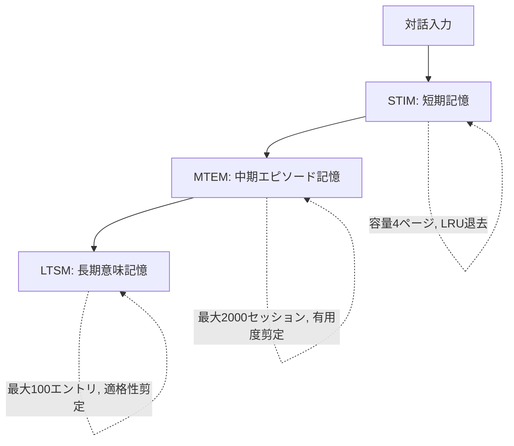

本記事は [Choosing How to Remember: Adaptive Memory Structures for LLM Agents（arXiv:2602.14038）](https://arxiv.org/abs/2602.14038) の解説記事です。

## 論文概要（Abstract）

既存のLLMエージェントメモリシステムは、単一のメモリ構造（ベクトル検索やグラフDB等）に依存しており、対話パターンの多様性に適応できない。FluxMemは、線形・グラフ・階層の3種のメモリ構造を統合し、対話特徴量に基づいてBeta混合モデルで動的に最適な構造を選択するフレームワークである。PERSONAMEMベンチマークで平均+9.18%、LoCoMoで平均+6.14%の改善を達成したと著者らは報告している。

この記事は [Zenn記事: Gemini 3.6 Flash×Mem0で構築するCSエージェント長期メモリとLongMemEval-V2評価](https://zenn.dev/0h_n0/articles/682460acc2a5a9) の深掘りです。

## 情報源

- **arXiv ID**: 2602.14038
- **URL**: [https://arxiv.org/abs/2602.14038](https://arxiv.org/abs/2602.14038)
- **著者**: Mingfei Lu, Mengjia Wu, Feng Liu et al.
- **発表年**: 2026
- **分野**: cs.AI, cs.LG

## 背景と動機（Background & Motivation）

Zenn記事ではMem0を用いた3層メモリアーキテクチャ（エピソディック/セマンティック/手続き的）を設計したが、Mem0はベクトル類似度検索を主軸とする単一のメモリ構造に依存している。この設計には2つの根本的課題がある。

**課題1: 一律的なメモリ構造**: 時系列的な対話履歴の追跡にはリニアメモリが適し、顧客間の関連性分析にはグラフメモリが適し、FAQの階層的な知識にはツリーメモリが適する。しかし、従来システムはこの使い分けを自動化していない。

**課題2: メモリ構造選択の非適応性**: 既存手法は事前に固定した構造を使い、対話のパターンや特性に応じた動的切り替えを行わない。著者らはこの問題を「メモリ構造選択を文脈適応的な意思決定としてモデル化していない」と指摘している。

## 主要な貢献（Key Contributions）

- **3種のメモリ構造の統合**: Linear（時系列保持）、Graph（関係構造）、Hierarchical（抽象化階層）を1つのフレームワークに統合
- **3層メモリ階層（STIM/MTEM/LTSM）**: 認知心理学に基づく短期/中期/長期の階層設計
- **Beta混合モデルゲート**: 類似度スコアの分布をBeta分布でモデル化し、確率的にメモリ候補をフィルタリング
- **オフライン教師あり構造選択器**: 12次元の対話特徴量から最適なメモリ構造を予測するMLPを学習

## 技術的詳細（Technical Details）

### 3層メモリ階層



**STIM（Short-Term Interaction Memory）**: 直近4ページの対話をバッファリングする。認知心理学のワーキングメモリ容量（Miller's 7±2）に基づき、LRU方式で容量超過時に退去する。検索時はフィルタリングなしで全内容をコンテキストに含める。

**MTEM（Mid-Term Episodic Memory）**: 対話履歴をエピソード単位（セマンティックに関連するページ群）で整理する主要リポジトリ。最大2000セッションを保持し、有用度スコアで剪定する。

$$
U(s) = w_1 \cdot c(s) + w_2 \cdot \ell(s) + w_3 \cdot d(s)
$$

ここで $c(s)$: アクセス頻度、$\ell(s)$: インタラクション強度、$d(s)$: 新しさ（recency）。

**LTSM（Long-Term Semantic Memory）**: 高有用度のエピソードから抽象化された永続的知識。ユーザープロファイル、事実、一般知識、対話戦略を格納する。最大100エントリで、適格性に基づく剪定を適用する。

$$
m \in \text{LTSM} \iff u(m) \geq \tau_u \land r(m) \geq \tau_r \land c(m) \geq \tau_c
$$

### 3種のメモリ構造

MTEMにおけるエピソード単位の組織化に、以下の3構造を用意する。

| 構造 | 組織化原理 | 検索方式 | 得意な質問タイプ |
|------|-----------|---------|----------------|
| **Linear** | 時系列順保持 | セマンティック類似度+暗黙的recency | 手順の再現、時系列追跡 |
| **Graph** | エンティティ間関係 | 近傍展開+セマンティックマッチ | 関係性質問、エンティティ中心 |
| **Hierarchical** | 多段階抽象化 | 粗→精の階層的検索 | 概念的質問、トピック横断 |

### Beta混合モデルゲート

検索結果のフィルタリングに、従来の固定閾値ではなくBeta混合モデルに基づく確率的ゲートを使用する。

正規化スコア $x_i \in (0, 1)$ に対して2成分のBeta混合モデルを適用する:

$$
p(x) = \pi \cdot \text{Beta}(x; \alpha_1, \beta_1) + (1 - \pi) \cdot \text{Beta}(x; \alpha_0, \beta_0)
$$

高適合成分 $z=1$ の事後確率でゲーティングする:

$$
g(x) = P(z=1 \mid x) = \frac{\pi \cdot \text{Beta}(x; \alpha_1, \beta_1)}{\sum_k \pi_k \cdot \text{Beta}(x; \alpha_k, \beta_k)}
$$

EMアルゴリズムでパラメータ推定を行う:

- **E-step**: $\log \tilde{r}_{ik} = \log \pi_k + \log \text{Beta}(x_i; \alpha_k, \beta_k)$
- **M-step**: 重みの加重モーメントから $\alpha_k, \beta_k$ を推定

ゲーティング閾値 $\tau = 0.6$ で候補をフィルタリングし、最低保持数 $m_{\min} = 1$ をセーフガードとして設定する。

### オフライン教師あり構造選択器

12次元の対話特徴量ベクトルからメモリ構造を予測する:

```python
FEATURES = [
    "page_count", "avg_page_length", "time_span", "temporal_density",
    "entity_density", "relation_indicators", "is_entity_centric",
    "topic_diversity", "topic_transitions", "is_decision_tree",
    "is_qna_pattern", "semantic_complexity",
]
```

2層MLP（隠れ層サイズ4、3クラスSoftmax出力）をクロスエントロピー損失で学習する。各訓練対話について全3構造を評価し、応答品質スコア $r^{\text{judge}}$ とメモリ利用効率 $r^{\text{mem}}$ の重み付き和で最適構造ラベルを割り当てる:

$$
r_t(s) = \lambda_q \cdot r^{\text{judge}}_t(s) + \lambda_m \cdot r^{\text{mem}}_t(s)
$$

$$
s^*_t = \arg\max_{s \in \{\text{Linear, Graph, Hierarchical}\}} r_t(s)
$$

## 実装のポイント（Implementation）

**Mem0との組み合わせ**: FluxMemの構造選択器をMem0のフロントエンドとして配置し、クエリの特徴量に応じてMem0のベクトル検索（Linear相当）とMem0^gのグラフ検索（Graph相当）を動的に切り替える設計が考えられる。

**BMM閾値の調整**: 著者らのパラメータ感度分析では、$\tau_{\text{BMM}} = 0.5$ が最適とされている（論文Figure 3より）。0.4以下では低品質な候補が混入し、0.7以上では情報の欠落が発生する。

**最低保持数の設定**: $m_{\min}$ を1から3に増加させると一貫して性能が低下すると報告されている。冗長なメモリの強制保持がノイズを増加させるためであり、$m_{\min} = 1$ の使用が推奨される。

## 実験結果（Results）

### PERSONAMEMベンチマーク（論文Table 1より）

| 手法 | 事実想起 | 提案 | 変化追跡 | 理由再訪 | 推薦 | 汎化 | 平均 |
|------|---------|------|---------|---------|------|------|------|
| LangMem | 31.29 | 24.73 | 53.24 | 81.82 | 40.00 | 8.77 | 40.64 |
| Mem0 | 32.13 | 15.05 | 54.68 | 80.81 | 52.73 | 57.89 | 48.55 |
| A-Mem | 63.01 | 27.96 | 54.68 | 85.86 | 69.09 | 57.89 | 59.75 |
| MemoryOS | 72.72 | 17.20 | 58.27 | 78.79 | 72.72 | 56.14 | 59.97 |
| **FluxMem** | **85.27** | **36.56** | **65.47** | **91.92** | **70.91** | **82.46** | **72.43** |

FluxMemは全6カテゴリ中5カテゴリで最高精度を記録し、平均で次点のO-Mem（63.25%）を+9.18%上回っている。特に「事実想起」（85.27%）と「汎化」（82.46%）で大幅な改善が見られる。

### LoCoMoベンチマーク（論文Table 2より）

| 手法 | マルチホップF1 | 単一ホップF1 | 時間的F1 | オープンF1 |
|------|-------------|------------|---------|-----------|
| Mem0 | 28.84 | — | 24.21 | — |
| MemoryOS | 43.03 | 49.31 | 44.43 | — |
| O-mem | 42.64 | 54.89 | 57.48 | 30.58 |
| **FluxMem** | **48.56** | **62.12** | 56.67 | **37.30** |

LoCoMo全体で平均+6.14%の改善を達成している。

### アブレーション分析（論文Table 3-4より）

| 除去要素 | PERSONAMEM平均低下 | LoCoMoマルチホップF1低下 |
|---------|-------------------|----------------------|
| w/o Linear | -3.0% | -4.2% |
| w/o Graph | -4.2% | -6.6% |
| w/o Hierarchy | -3.6% | -6.2% |
| w/o BMM | -3.1% | -7.4% |

3構造すべてとBMMゲートが性能に寄与しており、Graph構造の除去が最も大きな影響を与えている。

## 実運用への応用（Practical Applications）

Zenn記事のCSエージェント設計に対するFluxMemの示唆は以下の通り。

**メモリ構造の動的選択**: 顧客からの「前回の対応と同じ手順で」という要求にはLinear構造（時系列保持）、「この商品を買った他の顧客の傾向は？」にはGraph構造（関係構造）、「返金ポリシー全般について教えて」にはHierarchical構造（階層的知識）が適する。FluxMemの12次元特徴量ベクトルを用いることで、この使い分けを自動化できる。

**3層階層との統合**: FluxMemのSTIM/MTEM/LTSMは、Zenn記事のエピソディック/セマンティック/手続き的メモリとほぼ対応する。STIMがセッション内コンテキスト、MTEMがエピソディック記録、LTSMがセマンティック知識に相当する。

**制約**: FluxMemは学習にオフライン教師データを必要とし、新しいドメイン（たとえば金融CSから医療CSへの移行）では再学習が必要になる。

## 関連研究（Related Work）

- **Mem0（arXiv 2504.19413）**: 本記事のRank 1論文。FluxMemの実験ではMem0はPERSONAMEM平均48.55%であり、FluxMem（72.43%）との差は23.88ポイント
- **A-MEM（arXiv 2502.12110）**: Zettelkasten式のメモリ組織化。FluxMemの実験ではA-MemはPERSONAMEM 59.75%
- **HippoRAG 2**: グラフベースのRAGメモリ。PERSONAMEMで51.87%にとどまり、特に推薦タスク（23.64%）で性能が低い

## まとめと今後の展望

FluxMemは、メモリ構造の選択をルールベースではなくデータ駆動の分類問題として定式化した点で新しい。3種の構造とBMMゲートの組み合わせにより、単一構造の限界を克服し、PERSONAMEMで+9.18%、LoCoMoで+6.14%の改善を達成している。CSエージェントの設計においては、FluxMemの構造選択器をMem0のフロントエンドとして組み込むことで、クエリの特性に応じた最適なメモリ検索が実現できる可能性がある。

## 参考文献

- **arXiv**: [https://arxiv.org/abs/2602.14038](https://arxiv.org/abs/2602.14038)
- **Related Zenn article**: [https://zenn.dev/0h_n0/articles/682460acc2a5a9](https://zenn.dev/0h_n0/articles/682460acc2a5a9)

---

:::message
この記事はAI（Claude Code）により自動生成されました。内容の正確性については論文の原文で検証していますが、実際の利用時は公式ドキュメントもご確認ください。
:::
