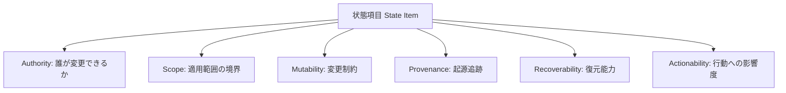

本記事は [Always-On Agents: A Survey of Persistent Memory, State, and Governance in LLM Agents（arXiv:2606.30306）](https://arxiv.org/abs/2606.30306) の解説記事です。

## 論文概要（Abstract）

本サーベイはLLMエージェントを「永続的状態システム」として再定義する。将来の振る舞いが過去のインタラクションで蓄積された永続的状態に依存するシステムとして、取得可能なメモリ、タスク台帳、権限、認証情報、コミットメント、来歴・監査記録、共有状態、トリガー条件、外部効果を包含する。435本の文献を6つの診断軸と9段階のライフサイクルで分析し、状態の蓄積・検索に研究が集中する一方でガバナンス・回復・放棄が不足していることを明らかにした。

この記事は [Zenn記事: Gemini 3.6 Flash×Mem0で構築するCSエージェント長期メモリとLongMemEval-V2評価](https://zenn.dev/0h_n0/articles/682460acc2a5a9) の深掘りです。

## 情報源

- **arXiv ID**: 2606.30306
- **URL**: [https://arxiv.org/abs/2606.30306](https://arxiv.org/abs/2606.30306)
- **著者**: Tianyu Ding, Aditya Nannapaneni, Bingfan Liu, Ling Zhang
- **発表年**: 2026
- **分野**: cs.MA, cs.AI

## 背景と動機（Background & Motivation）

LLMエージェントの研究は、タスク完了精度の向上に焦点を当ててきた。しかし、エージェントが本番環境で長期間稼働（Always-On）する場合、メモリの取得・蓄積だけでなく、状態のガバナンス（誰が変更できるか）、回復（障害後の復元）、放棄（不要な状態の安全な削除）も不可欠である。

著者らは435本の文献をコーディング分析した結果、既存研究が「蓄積と検索」に偏重し、「ガバナンス・回復・放棄」が手薄であることを発見した。Zenn記事で構築したCSエージェントのように長期間顧客対話を管理するシステムでは、この不足が実務上のリスクとなる。たとえば古い顧客情報の安全な削除（GDPR対応）や、障害後のメモリ整合性回復は、蓄積・検索だけでは解決できない問題である。

## 主要な貢献（Key Contributions）

- **永続的状態の包括的分類**: メモリ、タスク台帳、権限、認証情報、コミットメント、来歴記録、共有状態、トリガー条件、外部効果の9種類を定義
- **6つの診断軸（Six Diagnostic Axes）**: 各状態項目を Authority / Scope / Mutability / Provenance / Recoverability / Actionability の6軸で分析するフレームワーク
- **9段階の状態ライフサイクル**: Written → Validated → Organized → Retrieved → Acted Upon → Updated → Forgotten → Audited → Rolled Back
- **AOEP-v0（Always-On Evaluation Protocol）**: 回答品質ではなく、状態変更と回復の義務を定量評価するパイロットプロトコル
- **研究ギャップの体系的同定**: 435本の文献分析に基づく具体的な未解決課題の提示

## 技術的詳細（Technical Details）

### 6つの診断軸



| 診断軸 | 定義 | CSエージェントでの具体例 |
|--------|------|--------------------------|
| **Authority** | 状態の変更を誰が制御するか | 返金処理の承認権限はマネージャーのみ |
| **Scope** | 状態の適用範囲の境界 | 顧客メモリはUser単位、FAQはOrg単位 |
| **Mutability** | 変更可能性の制約 | 手続き的メモリはバージョン管理付き更新のみ |
| **Provenance** | 状態の起源と履歴の追跡 | 「この情報は7/15のセッション003で取得」 |
| **Recoverability** | 障害後の復元能力 | DB障害後にメモリを最終正常状態に復元 |
| **Actionability** | 状態に基づいて行動可能か | エスカレーション条件を検出し自動転送 |

### 状態ライフサイクルの9段階

著者らは状態が経る9つの段階を定義している。

$$
\text{Lifecycle} = \{W, V, O, R, A, U, F, Au, Rb\}
$$

ここで $W$: Written（書き込み）、$V$: Validated（検証）、$O$: Organized（整理）、$R$: Retrieved（検索）、$A$: Acted Upon（実行）、$U$: Updated（更新）、$F$: Forgotten（忘却）、$Au$: Audited（監査）、$Rb$: Rolled Back（ロールバック）。

**Zenn記事のMem0設計との対応**:

| ライフサイクル段階 | Mem0の操作 | 対応するCSエージェント処理 |
|-------------------|-----------|--------------------------|
| Written | `memory.add()` | 対話からメモリ抽出 |
| Validated | Extraction Phaseの事実検証 | LLMによる情報の正確性チェック |
| Organized | セマンティック類似度インデキシング | Qdrantへのベクトル格納 |
| Retrieved | `memory.search()` | クエリに基づくTop-k検索 |
| Acted Upon | コンテキスト注入→応答生成 | Gemini 3.6 Flashでの応答 |
| Updated | UPDATE操作 | 住所変更等の事実更新 |
| Forgotten | DELETE操作 / TTL期限切れ | 90日経過エピソードの自動アーカイブ |
| Audited | **未対応** | **ガバナンスギャップ** |
| Rolled Back | **未対応** | **ガバナンスギャップ** |

### 435本文献のコーディング分析結果

著者らは435本の文献を体系的にコーディングした結果、以下の偏りを発見したと報告している。

**研究が集中している領域**:
- 状態の書き込み（Written）と検索（Retrieved）: 文献の大多数がカバー
- メモリの整理（Organized）: RAGやベクトルDBの文脈で多数の研究

**研究が不足している領域**:
- ガバナンス（Audited）: 状態変更の監査証跡を維持する研究が少ない
- 回復（Rolled Back）: 障害後の状態復元メカニズムの研究が限定的
- 忘却（Forgotten）: 計画的な状態削除（機械学習のunlearningとの接続）が不足

### AOEP-v0 評価プロトコル

Always-On Evaluation Protocol（AOEP-v0）は、従来の回答精度メトリクスに代わる新しい評価方法を提案している。

**従来の評価**: 「質問に正しく回答できたか」（F1, BLEU等）
**AOEP-v0の評価**: 「状態変更と回復の義務を正しく遂行できたか」

具体的には、以下の義務をスコアリングする:
1. **状態変更義務**: 新しい事実を検出したとき、適切に状態を更新したか
2. **整合性維持義務**: 矛盾する情報を検出したとき、正しく解消したか
3. **回復義務**: 状態の破損を検出したとき、最終正常状態に復元できたか
4. **忘却義務**: 不要になった状態を安全に削除できたか

## 実装のポイント（Implementation）

**CSエージェントへの実装示唆**: Zenn記事で設計した3層メモリアーキテクチャ（エピソディック/セマンティック/手続き的）に対して、本サーベイの6診断軸を適用することで設計の盲点を発見できる。

たとえば、Zenn記事の設計ではAuthority（権限管理）が明示されていない。CSエージェントでは「誰がメモリを変更できるか」の制御が重要である。顧客が「住所を変更しました」と言った場合の自動更新と、オペレーターが手動でメモリを修正する場合の権限は区別すべきである。

**Provenance（来歴追跡）の実装例**:

```python
from datetime import datetime

def add_memory_with_provenance(
    memory, content: str, user_id: str,
    session_id: str, source: str = "dialogue"
) -> None:
    memory.add(
        [{"role": "user", "content": content}],
        user_id=user_id,
        metadata={
            "session_id": session_id,
            "source": source,
            "created_at": datetime.now().isoformat(),
            "authority": "auto_extract",
            "version": 1,
        },
    )
```

## 実験結果（Results）

本サーベイは実験論文ではなく文献分析論文であるため、定量的なベンチマーク結果はない。代わりに、435本の文献分析から得られた定性的知見が主要な成果である。

**ライフサイクル段階別の文献カバレッジ（著者らの分析より）**:

| ライフサイクル段階 | カバレッジ | 代表的な研究 |
|-------------------|-----------|------------|
| Written / Retrieved | 高密度 | Mem0, MemGPT, LangMem |
| Organized | 中密度 | RAG系、ベクトルDB系 |
| Updated | 中密度 | Mem0のUPDATE/DELETE |
| Forgotten | 低密度 | Machine Unlearning系 |
| Audited / Rolled Back | 極低密度 | **研究ギャップ** |

## 実運用への応用（Practical Applications）

本サーベイの知見をCSエージェントの設計に応用する3つの方向性を示す。

**1. メモリ監査ログの導入**: AOEP-v0の示唆に基づき、メモリの書き込み・更新・削除のすべてに監査ログを付与する。GDPRの「忘れられる権利」への対応に必須。

**2. 障害回復メカニズム**: Qdrantのスナップショット機能とDynamoDBのPoint-in-Time Recoveryを組み合わせ、メモリストアの障害回復を実現する。

**3. 状態のガバナンスポリシー**: Authority軸に基づき、メモリ変更の権限を階層化する（自動抽出 < オペレーター手動修正 < 管理者強制変更）。

## 関連研究（Related Work）

- **MemTier（arXiv 2605.03675）**: Zenn記事で引用されている階層型メモリアーキテクチャ。本サーベイの分類ではOrganized段階の研究に該当し、Governed/Recovered段階は未対応
- **LongMemEval-V2（arXiv 2605.12493）**: Zenn記事の評価フレームワーク。AOEP-v0はLongMemEval-V2の5能力評価を補完する形で、状態管理の義務遂行を評価する
- **分散システム研究**: 著者らは、エージェントの状態管理をデータベースの ACID特性や分散システムの合意プロトコルと接続すべきと主張している

## まとめと今後の展望

本サーベイは、LLMエージェントのメモリ研究が「蓄積と検索」に偏重し、「ガバナンス・回復・忘却」が体系的に不足していることを435本の文献分析で明らかにした。提案されたAOEP-v0は、回答精度ではなく状態管理の義務遂行を評価する新しい軸を提供する。CSエージェントの本番運用においては、メモリの監査ログ、障害回復メカニズム、権限管理の3つが、Zenn記事の3層メモリ設計を補完する重要な設計要素となる。

## 参考文献

- **arXiv**: [https://arxiv.org/abs/2606.30306](https://arxiv.org/abs/2606.30306)
- **Related Zenn article**: [https://zenn.dev/0h_n0/articles/682460acc2a5a9](https://zenn.dev/0h_n0/articles/682460acc2a5a9)

---

:::message
この記事はAI（Claude Code）により自動生成されました。内容の正確性については論文の原文で検証していますが、実際の利用時は公式ドキュメントもご確認ください。
:::
