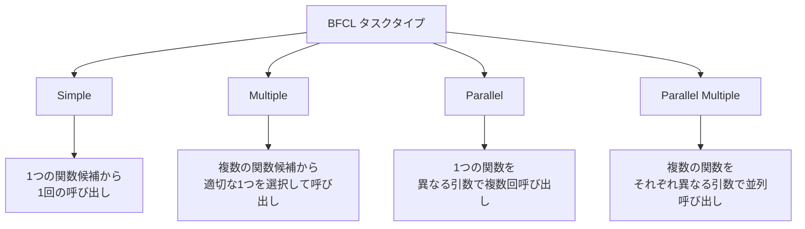
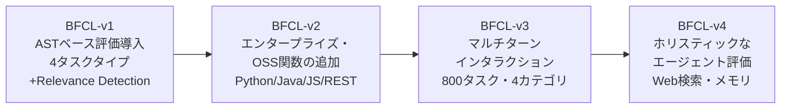

本記事は [The Berkeley Function Calling Leaderboard (BFCL): From Tool Use to Agentic Evaluation of Large Language Models](https://proceedings.mlr.press/v267/patil25a.html) の解説記事です。

## 論文概要

Patil, Mao, Yan, Ji, Suresh, Stoica, Gonzalez (UC Berkeley, 2025) は、LLMの関数呼び出し（Function Calling / Tool Use）能力を体系的に評価するベンチマーク **BFCL (Berkeley Function Calling Leaderboard)** を提案している。BFCLは、Abstract Syntax Tree (AST) に基づく構造的評価手法を導入し、Python・Java・JavaScript・REST APIを含む複数プログラミング言語にわたって数千の関数を評価可能にした。Simple・Multiple・Parallel・Parallel Multipleの4タスクタイプに加え、Relevance Detection（無関係な関数の検出）やMulti-turn対話の評価まで包含する。著者らは70以上のモデルを評価し、先進的なLLMがシングルターンの関数呼び出しでは高い精度を達成する一方、メモリ管理・動的意思決定・長期的推論は依然としてオープンチャレンジであると報告している。

この記事は [Zenn記事: Anthropic Claude API実践活用：モデル選定からコスト最適化まで](https://zenn.dev/0h_n0/articles/7aa294dedf0f90) の深掘りとして、BFCLの評価フレームワークがClaude APIのTool Use設計・最適化にどう活かせるかという視点で解説する。

## 情報源

- **会議名**: ICML 2025 (42nd International Conference on Machine Learning)
- **開催期間**: 2025年7月13日-19日
- **Proceedings**: Volume 267, Pages 48371-48392
- **URL**: [https://proceedings.mlr.press/v267/patil25a.html](https://proceedings.mlr.press/v267/patil25a.html)
- **著者**: Shishir G. Patil, Huanzhi Mao, Fanjia Yan, Charlie Cheng-Jie Ji, Vishnu Suresh, Ion Stoica, Joseph E. Gonzalez (UC Berkeley)

## カンファレンス情報

**ICML (International Conference on Machine Learning)** は機械学習分野における最高峰の国際会議の1つであり、NeurIPS・ICLRと並んで「ML三大会議」と称される。ICML 2025は第42回の開催であり、数千本の投稿の中から厳選された論文のみが採択される。BFCLはLLMのツール使用能力という実用上極めて重要なテーマを扱っており、この分野の標準ベンチマークとしての地位を確立している。

## 技術的詳細

### ASTベース評価手法の設計原理

BFCLの中核をなすのがAST (Abstract Syntax Tree) ベースの評価手法である。従来のFunction Calling評価では、生成された関数呼び出しを実際に実行して結果を比較する「実行ベース評価」が主流だったが、これにはサンドボックス環境の構築コストやAPI呼び出しの副作用といった課題があった。

ASTベース評価は、モデルが生成した関数呼び出しと正解（Ground Truth）をそれぞれ抽象構文木にパースし、構造的な一致を検証する。具体的には以下の要素を比較する。

1. **関数名の一致**: 呼び出された関数名が正解と一致するか
2. **引数キーの一致**: パラメータ名が正しいか
3. **引数値の型整合性**: パラメータの型（string, number, boolean等）が正しいか
4. **引数値の正確性**: パラメータの値が期待値と一致するか

AST Accuracyは以下の式で定義される。

$$
\text{AST\_Acc} = \frac{1}{N} \sum_{i=1}^{N} \mathbb{1}\left[\text{AST}(\hat{y}_i) = \text{AST}(y_i)\right]
$$

ここで、
- $N$: 評価サンプル数
- $\hat{y}_i$: モデルが生成した$i$番目の関数呼び出し
- $y_i$: $i$番目の正解関数呼び出し
- $\text{AST}(\cdot)$: 関数呼び出しを抽象構文木にパースする関数
- $\mathbb{1}[\cdot]$: 条件が真のとき1、偽のとき0を返す指示関数

この手法の利点は、関数を実行せずに構造的正確性を評価できるため、数千の関数にスケールできる点にある。著者らは、AST評価が実行ベース評価と高い相関を持つことも実験で確認している。

### 実行ベース評価との併用

AST評価に加え、BFCLは実行ベース評価 (Executable Accuracy) も提供する。

$$
\text{Exec\_Acc} = \frac{1}{N} \sum_{i=1}^{N} \mathbb{1}\left[\text{exec}(\hat{y}_i) = \text{exec}(y_i)\right]
$$

ここで $\text{exec}(\cdot)$ はサンドボックス環境での関数実行結果を返す。REST APIの評価ではAST評価が困難なため、実行ベース評価が主に使用される。

### 4つのタスクタイプ

BFCLは関数呼び出しの複雑度に応じて4つのタスクタイプを定義している。



**Simple**: ツールキットに1つの関数のみが存在し、モデルはその関数を正しい引数で1回呼び出す。関数選択の曖昧性がないため、パラメータ抽出能力を純粋に測定できる。

**Multiple**: 複数の関数候補からユーザーの意図に合致するものを選択して呼び出す。モデルにはtool descriptionの理解と、クエリとのマッチング能力が求められる。

**Parallel**: 同一の関数を異なる引数で複数回呼び出す。例えば「東京と大阪の天気を教えて」というクエリに対して `get_weather("Tokyo")` と `get_weather("Osaka")` を同時に呼び出す能力を測定する。

**Parallel Multiple**: 異なる関数を並列に呼び出す。例えば「東京の天気と、ドル円の為替レートを教えて」に対して `get_weather("Tokyo")` と `get_exchange_rate("USD", "JPY")` を同時に呼び出す。これは最も複雑なタスクタイプであり、モデルにとって高度な計画能力を要求する。

### Claude APIにおけるタスクタイプの対応

Claude APIのTool Use機能は、BFCLの4つのタスクタイプに直接対応する設計となっている。

**SimpleとMultipleへの対応**: `tool_choice` パラメータで制御する。

```python
import anthropic

client = anthropic.Anthropic()

# Simple: 1つのツールを必ず呼び出す
response = client.messages.create(
    model="claude-sonnet-4-5-20250514",
    max_tokens=1024,
    tools=[{
        "name": "get_weather",
        "description": "指定された都市の現在の天気を取得する。"
                       "都市名は日本語または英語で指定可能。"
                       "気温（摂氏）、湿度（%）、天気概況を返す。",
        "input_schema": {
            "type": "object",
            "properties": {
                "location": {
                    "type": "string",
                    "description": "都市名（例: 東京, San Francisco, CA）"
                }
            },
            "required": ["location"]
        }
    }],
    # BFCLのSimpleタスクに相当: 特定のツールを強制呼び出し
    tool_choice={"type": "tool", "name": "get_weather"},
    messages=[{"role": "user", "content": "東京の天気を教えて"}]
)
```

**ParallelとParallel Multipleへの対応**: Claudeはデフォルトで並列ツール呼び出しをサポートしている。1回のレスポンスに複数の `tool_use` ブロックを含めることで、BFCLのParallelタスクに相当する動作を実現する。

```python
# Parallel Multiple: 複数ツールの並列呼び出しを許可
tools = [
    {
        "name": "get_weather",
        "description": "指定された都市の現在の天気情報を取得する。",
        "input_schema": {
            "type": "object",
            "properties": {
                "location": {"type": "string", "description": "都市名"}
            },
            "required": ["location"]
        }
    },
    {
        "name": "get_exchange_rate",
        "description": "2つの通貨間の最新為替レートを取得する。",
        "input_schema": {
            "type": "object",
            "properties": {
                "from_currency": {"type": "string", "description": "変換元通貨コード（例: USD）"},
                "to_currency": {"type": "string", "description": "変換先通貨コード（例: JPY）"}
            },
            "required": ["from_currency", "to_currency"]
        }
    }
]

response = client.messages.create(
    model="claude-sonnet-4-5-20250514",
    max_tokens=1024,
    tools=tools,
    # auto: Claudeが必要なツールを自動選択（並列呼び出し含む）
    tool_choice={"type": "auto"},
    messages=[{
        "role": "user",
        "content": "東京の天気と、ドル円の為替レートを教えて"
    }]
)

# レスポンスには複数のtool_useブロックが含まれる
for block in response.content:
    if block.type == "tool_use":
        print(f"Tool: {block.name}, Input: {block.input}")
```

逆に並列呼び出しを無効化したい場合は `disable_parallel_tool_use` を使用する。

```python
tool_choice = {"type": "auto", "disable_parallel_tool_use": True}
```

### Relevance Detection: 不要な関数呼び出しの抑制

BFCLはRelevance Detectionという独自の評価カテゴリを設けている。これは、提供された関数がユーザーのクエリに無関係な場合に、モデルが関数呼び出しを適切に抑制できるかを測定する。

$$
\text{Relevance\_Acc} = \frac{1}{N} \sum_{i=1}^{N} \mathbb{1}\left[\hat{y}_i = \emptyset\right]
$$

ここで $\hat{y}_i = \emptyset$ は、モデルが関数呼び出しを生成しなかったことを意味する。

この能力は実運用において極めて重要である。ツールが定義されていても、ユーザーの意図がツールの機能範囲外である場合にハルシネーション的な関数呼び出しを生成してしまうと、不要なAPI呼び出しコストやエラーの原因となる。

Claude APIでは `tool_choice: {"type": "auto"}` を設定することで、Claudeが自律的にツール呼び出しの要否を判断する。BFCLの知見に基づくと、Claude Opusモデルはこのような曖昧なケースで「不足しているパラメータがないか確認し、ユーザーに問い返す」傾向があると報告されている。

### BFCLのバージョン進化

BFCLは4つのバージョンを経て段階的に評価範囲を拡大してきた。



**BFCL-v1**: ASTベース評価メトリクスの導入。Simple・Multiple・Parallel・Parallel Multipleの4タスクタイプとRelevance Detectionを定義した。2,000以上の質問-関数-回答ペアを手作業でキュレーションしている。

**BFCL-v2**: エンタープライズ環境やOSSプロジェクトで実際に使われている関数を追加。Python・Java・JavaScript・REST APIの4言語にわたる評価を拡充し、実世界のユースケースにより近い評価が可能となった。

**BFCL-v3**: マルチターンインタラクションの導入。800のマルチターンタスク（200タスク x 4カテゴリ）で構成され、以下の4カテゴリに分類される。
- **Base**: 標準的なマルチターンタスク
- **Missing Function**: 必要な機能が欠如していることをモデルが認識すべきケース
- **Missing Parameter**: 必要な引数が不足しているケース
- **Long-Context**: 長い会話履歴を含むシナリオ

マルチターン評価では、全ての関数呼び出しが正解参照と一致して初めて正解と判定される。

$$
\text{MultiTurn\_Acc} = \frac{1}{N} \sum_{i=1}^{N} \prod_{t=1}^{T_i} \mathbb{1}\left[\text{AST}(\hat{y}_{i,t}) = \text{AST}(y_{i,t})\right]
$$

ここで $T_i$ は$i$番目のタスクにおけるターン数、$\hat{y}_{i,t}$ は$t$ターン目のモデル出力である。1つのターンでも不一致があればタスク全体が不正解となるため、シングルターンと比較して大幅に難易度が上がる。

**BFCL-v4**: ホリスティックなエージェント評価。Web検索、メモリの読み書き、フォーマット感度テストを追加し、実運用でのエージェント的な動作を総合的に評価する。パラフレーズによる入力の言い換えでAST Accuracyが13-19ポイント低下するという脆弱性や、ディストラクタ関数の追加で1-8ポイントの精度低下が生じるというロバスト性の課題も報告されている。

### Strict Tool Useによるスキーマ準拠の保証

BFCLが明らかにした課題の1つに、モデルが生成する関数呼び出しのスキーマ違反がある。引数の型不一致、必須パラメータの欠落、未定義パラメータの追加などが精度低下の原因となる。

Claude APIでは `strict: true` オプションによるStrict Tool Useモードでこの問題に対処している。Strictモードでは、推論時にJSON Schemaをグラマーにコンパイルし、スキーマに違反するトークンの生成を推論段階で抑制する。

```python
tools = [{
    "name": "search_products",
    "description": "商品カタログから条件に合う商品を検索する。",
    "input_schema": {
        "type": "object",
        "properties": {
            "query": {
                "type": "string",
                "description": "検索キーワード"
            },
            "category": {
                "type": "string",
                "enum": ["electronics", "clothing", "books", "food"],
                "description": "商品カテゴリ"
            },
            "max_price": {
                "type": "number",
                "description": "上限価格（円）"
            },
            "in_stock": {
                "type": "boolean",
                "description": "在庫ありのみに絞るか"
            }
        },
        "required": ["query", "category", "max_price", "in_stock"],
        "additionalProperties": False
    },
    # Strictモードを有効化
    "strict": True
}]
```

Strictモードの制約として、スキーマ内の全てのオブジェクトで `additionalProperties: false` を設定し、全プロパティを `required` に含める必要がある。BFCLのAST評価で測定される「構造的正確性」をAPI側で保証する仕組みとして理解できる。

## 実装のポイント

BFCLの知見を踏まえた、Claude APIでのTool Use実装におけるベストプラクティスを整理する。

### ツール定義の品質がBFCLスコアを左右する

BFCLの評価では、ツール定義（description）の品質がモデルの関数選択精度に大きく影響することが示されている。著者らの報告によると、曖昧なdescriptionはMultipleタスクでの誤選択の主要因となる。

Anthropicのドキュメントでも、ツール定義のdescriptionは「3-4文以上」の詳細な記述が推奨されている。具体的には以下の要素を含めるべきとされている。

1. **ツールの機能**: 何をするツールか
2. **使用条件**: いつ使うべきか（いつ使うべきでないか）
3. **パラメータの意味**: 各パラメータがツールの動作にどう影響するか
4. **制約事項**: ツールが返さない情報、ツール名から推測しづらい制限

### 関連ツールの統合で選択精度を向上

BFCLのMultipleタスクでは、類似した機能を持つ複数のツールからの選択で精度が低下する傾向が報告されている。Anthropicのベストプラクティスでは、関連する操作を1つのツールにまとめ、`action` パラメータで分岐させることが推奨されている。

```python
# 推奨: 関連操作を統合
{
    "name": "manage_order",
    "description": "注文の作成・更新・キャンセルを統一的に管理する。"
                   "actionパラメータで操作種別を指定する。",
    "input_schema": {
        "type": "object",
        "properties": {
            "action": {
                "type": "string",
                "enum": ["create", "update", "cancel"],
                "description": "実行する操作の種別"
            },
            "order_id": {
                "type": "string",
                "description": "注文ID（updateとcancelで必須）"
            },
            "items": {
                "type": "array",
                "items": {"type": "string"},
                "description": "商品リスト（createとupdateで使用）"
            }
        },
        "required": ["action"]
    }
}
```

### マルチターン対話でのコンテキスト管理

BFCL-v3が明らかにしたマルチターンの課題は、Claude APIの会話管理設計に直結する。tool_resultの蓄積によるコンテキスト膨張に注意が必要である。

```python
def run_tool_loop(
    client: anthropic.Anthropic,
    messages: list[dict],
    tools: list[dict],
    max_turns: int = 10,
) -> str:
    """BFCLのマルチターン評価に対応するエージェントループ

    Args:
        client: Anthropicクライアント
        messages: 会話履歴
        tools: ツール定義リスト
        max_turns: 最大ターン数（無限ループ防止）

    Returns:
        最終的なテキスト応答
    """
    for turn in range(max_turns):
        response = client.messages.create(
            model="claude-sonnet-4-5-20250514",
            max_tokens=4096,
            tools=tools,
            messages=messages,
        )

        # ツール呼び出しがなければ終了
        if response.stop_reason == "end_turn":
            return next(
                b.text for b in response.content if b.type == "text"
            )

        # assistantの応答を会話履歴に追加
        messages.append({"role": "assistant", "content": response.content})

        # 各tool_useブロックに対してtool_resultを返す
        tool_results = []
        for block in response.content:
            if block.type == "tool_use":
                result = execute_tool(block.name, block.input)
                tool_results.append({
                    "type": "tool_result",
                    "tool_use_id": block.id,
                    "content": str(result),
                })

        messages.append({"role": "user", "content": tool_results})

    return "最大ターン数に到達しました"
```

## Production Deployment Guide

BFCLの知見を踏まえ、Claude APIのTool Useを本番環境で運用するためのAWS実装パターンを示す。

### AWS実装パターン（コスト最適化重視）

**トラフィック量別の推奨構成**:

| 構成 | トラフィック | アーキテクチャ | 月額コスト概算 |
|------|-------------|---------------|---------------|
| Small | ~100 req/日 | Lambda + Bedrock | $50-150 |
| Medium | ~1,000 req/日 | ECS Fargate + Bedrock | $300-800 |
| Large | 10,000+ req/日 | EKS + Spot + Bedrock | $2,000-5,000 |

注: コスト概算は2026年8月時点のAWS ap-northeast-1（東京）リージョン料金に基づく。実際のコストはトラフィックパターン、ツール呼び出し回数、レスポンス長により変動する。最新料金はAWS料金計算ツールで確認を推奨する。

**Small構成の詳細**: API Gateway + Lambda + Bedrock Claude。Lambdaのメモリ256MB、タイムアウト120秒（ツール呼び出しループを考慮）。DynamoDBで会話履歴とツール結果をキャッシュする。Bedrockのオンデマンド料金がコストの大部分を占める。

**コスト削減テクニック**:
- **Prompt Caching**: ツール定義はリクエスト間で変わらないため、Prompt Cachingで30-90%のトークンコスト削減が可能。BFCLの評価で示されたように、ツール定義のシステムプロンプトは286-589トークンを消費するため、キャッシュの効果が大きい
- **Bedrock Batch API**: 非リアルタイム処理（バッチ評価等）では50%のコスト削減
- **モデル選択ロジック**: BFCLの結果を参考に、Simpleタスクは軽量モデル（Haiku）、Parallel Multipleは高性能モデル（Opus）と使い分ける

### Terraformインフラコード

**Small構成（Serverless）**:

```hcl
# Tool Use API - Serverless構成
# Lambda + API Gateway + Bedrock + DynamoDB

terraform {
  required_version = ">= 1.12"
  required_providers {
    aws = {
      source  = "hashicorp/aws"
      version = "~> 5.82"
    }
  }
}

provider "aws" {
  region = "ap-northeast-1"
}

# DynamoDB: 会話履歴とツール結果のキャッシュ
resource "aws_dynamodb_table" "tool_use_sessions" {
  name         = "tool-use-sessions"
  billing_mode = "PAY_PER_REQUEST"  # On-Demandでコスト最適化
  hash_key     = "session_id"
  range_key    = "turn_number"

  attribute {
    name = "session_id"
    type = "S"
  }

  attribute {
    name = "turn_number"
    type = "N"
  }

  ttl {
    attribute_name = "expires_at"
    enabled        = true
  }

  server_side_encryption {
    enabled = true  # KMS暗号化
  }

  tags = {
    Service = "tool-use-api"
    Cost    = "on-demand"
  }
}

# IAMロール: 最小権限の原則
resource "aws_iam_role" "lambda_tool_use" {
  name = "lambda-tool-use-role"

  assume_role_policy = jsonencode({
    Version = "2012-10-17"
    Statement = [{
      Action = "sts:AssumeRole"
      Effect = "Allow"
      Principal = {
        Service = "lambda.amazonaws.com"
      }
    }]
  })
}

resource "aws_iam_role_policy" "lambda_tool_use_policy" {
  name = "lambda-tool-use-policy"
  role = aws_iam_role.lambda_tool_use.id

  policy = jsonencode({
    Version = "2012-10-17"
    Statement = [
      {
        # Bedrock: Claude呼び出しのみ許可
        Effect = "Allow"
        Action = [
          "bedrock:InvokeModel",
          "bedrock:InvokeModelWithResponseStream"
        ]
        Resource = "arn:aws:bedrock:ap-northeast-1::foundation-model/anthropic.claude-*"
      },
      {
        # DynamoDB: セッションテーブルのみ
        Effect = "Allow"
        Action = [
          "dynamodb:GetItem",
          "dynamodb:PutItem",
          "dynamodb:UpdateItem",
          "dynamodb:Query"
        ]
        Resource = aws_dynamodb_table.tool_use_sessions.arn
      },
      {
        # CloudWatch Logs
        Effect = "Allow"
        Action = [
          "logs:CreateLogGroup",
          "logs:CreateLogStream",
          "logs:PutLogEvents"
        ]
        Resource = "arn:aws:logs:ap-northeast-1:*:*"
      }
    ]
  })
}

# Lambda関数
resource "aws_lambda_function" "tool_use_handler" {
  filename         = "lambda.zip"
  function_name    = "tool-use-handler"
  role             = aws_iam_role.lambda_tool_use.arn
  handler          = "handler.lambda_handler"
  runtime          = "python3.13"
  timeout          = 120  # ツール呼び出しループ考慮
  memory_size      = 256

  environment {
    variables = {
      DYNAMODB_TABLE = aws_dynamodb_table.tool_use_sessions.name
      MODEL_ID       = "anthropic.claude-sonnet-4-5-20250514-v1:0"
      MAX_TOOL_TURNS = "10"
    }
  }

  tracing_config {
    mode = "Active"  # X-Ray有効化
  }

  tags = {
    Service = "tool-use-api"
  }
}

# CloudWatch アラーム: Lambda実行時間監視
resource "aws_cloudwatch_metric_alarm" "lambda_duration" {
  alarm_name          = "tool-use-lambda-duration-high"
  comparison_operator = "GreaterThanThreshold"
  evaluation_periods  = 3
  metric_name         = "Duration"
  namespace           = "AWS/Lambda"
  period              = 300
  statistic           = "p95"
  threshold           = 90000  # 90秒
  alarm_description   = "Lambda P95 duration exceeds 90s"

  dimensions = {
    FunctionName = aws_lambda_function.tool_use_handler.function_name
  }
}
```

**Large構成（Container）**:

```hcl
# Tool Use API - EKS + Karpenter + Spot構成

module "eks" {
  source  = "terraform-aws-modules/eks/aws"
  version = "~> 20.35"

  cluster_name    = "tool-use-cluster"
  cluster_version = "1.32"

  vpc_id     = module.vpc.vpc_id
  subnet_ids = module.vpc.private_subnets

  # Spot Instances優先でコスト削減
  eks_managed_node_groups = {
    spot = {
      instance_types = ["m7i.large", "m6i.large", "m5.large"]
      capacity_type  = "SPOT"
      min_size       = 2
      max_size       = 20
      desired_size   = 3
    }
  }

  tags = {
    Service = "tool-use-api"
    Cost    = "spot-optimized"
  }
}

# Karpenter: 自動スケーリング（Spot優先）
resource "kubectl_manifest" "karpenter_nodepool" {
  yaml_body = yamlencode({
    apiVersion = "karpenter.sh/v1"
    kind       = "NodePool"
    metadata   = { name = "tool-use-pool" }
    spec = {
      template = {
        spec = {
          requirements = [
            {
              key      = "karpenter.sh/capacity-type"
              operator = "In"
              values   = ["spot", "on-demand"]
            },
            {
              key      = "node.kubernetes.io/instance-type"
              operator = "In"
              values   = ["m7i.large", "m6i.large", "c7i.large"]
            }
          ]
        }
      }
      limits = {
        cpu    = "100"
        memory = "200Gi"
      }
      disruption = {
        consolidationPolicy = "WhenEmptyOrUnderutilized"
        consolidateAfter    = "30s"
      }
    }
  })
}

# AWS Budgets: コストアラート
resource "aws_budgets_budget" "tool_use_monthly" {
  name         = "tool-use-monthly-budget"
  budget_type  = "COST"
  limit_amount = "5000"
  limit_unit   = "USD"
  time_unit    = "MONTHLY"

  notification {
    comparison_operator       = "GREATER_THAN"
    threshold                 = 80
    threshold_type            = "PERCENTAGE"
    notification_type         = "ACTUAL"
    subscriber_email_addresses = ["alert@example.com"]
  }
}
```

### 運用・監視設定

**CloudWatch Logs Insights: ツール呼び出しのコスト・レイテンシ分析**:

```
# 1時間あたりのBedrock API呼び出し回数とトークン消費
fields @timestamp, @message
| filter @message like /bedrock_invoke/
| stats count() as invocations,
        sum(input_tokens) as total_input_tokens,
        sum(output_tokens) as total_output_tokens,
        avg(duration_ms) as avg_latency_ms,
        pct(duration_ms, 95) as p95_latency_ms
  by bin(1h) as time_bucket
| sort time_bucket desc
```

**CloudWatch アラーム設定（Python）**:

```python
import boto3

cloudwatch = boto3.client("cloudwatch", region_name="ap-northeast-1")

# Bedrockトークン使用量スパイク検知
cloudwatch.put_metric_alarm(
    AlarmName="bedrock-token-spike",
    MetricName="InputTokenCount",
    Namespace="AWS/Bedrock",
    Statistic="Sum",
    Period=3600,
    EvaluationPeriods=1,
    Threshold=500000,  # 1時間あたり50万トークン
    ComparisonOperator="GreaterThanThreshold",
    AlarmActions=["arn:aws:sns:ap-northeast-1:123456789012:cost-alert"],
    Dimensions=[
        {"Name": "ModelId", "Value": "anthropic.claude-sonnet-4-5-20250514-v1:0"}
    ],
)
```

**X-Ray トレーシング設定（Python）**:

```python
from aws_xray_sdk.core import xray_recorder, patch_all

# boto3を含む全HTTPクライアントを自動計装
patch_all()

@xray_recorder.capture("tool_use_loop")
def handle_tool_use_request(session_id: str, user_message: str) -> str:
    """ツール呼び出しループの実行（X-Rayトレース付き）"""
    subsegment = xray_recorder.current_subsegment()
    subsegment.put_annotation("session_id", session_id)

    # Bedrockへのリクエストは自動トレースされる
    response = invoke_bedrock_with_tools(user_message)

    subsegment.put_metadata("tool_calls_count", count_tool_calls(response))
    subsegment.put_metadata("input_tokens", response["usage"]["input_tokens"])
    subsegment.put_metadata("output_tokens", response["usage"]["output_tokens"])

    return response
```

**Cost Explorer自動レポート（Python）**:

```python
import boto3
from datetime import datetime, timedelta

ce = boto3.client("ce", region_name="us-east-1")
sns = boto3.client("sns", region_name="ap-northeast-1")

def daily_cost_report() -> dict:
    """日次コストレポート取得"""
    today = datetime.utcnow().date()
    yesterday = today - timedelta(days=1)

    response = ce.get_cost_and_usage(
        TimePeriod={
            "Start": str(yesterday),
            "End": str(today),
        },
        Granularity="DAILY",
        Metrics=["UnblendedCost"],
        Filter={
            "Tags": {
                "Key": "Service",
                "Values": ["tool-use-api"],
            }
        },
        GroupBy=[{"Type": "DIMENSION", "Key": "SERVICE"}],
    )

    total = sum(
        float(g["Metrics"]["UnblendedCost"]["Amount"])
        for r in response["ResultsByTime"]
        for g in r["Groups"]
    )

    # $100/日超過でSNS通知
    if total > 100:
        sns.publish(
            TopicArn="arn:aws:sns:ap-northeast-1:123456789012:cost-alert",
            Subject=f"Tool Use API daily cost alert: ${total:.2f}",
            Message=f"Daily cost exceeded $100: ${total:.2f}",
        )

    return {"date": str(yesterday), "total_cost": total}
```

### コスト最適化チェックリスト

**アーキテクチャ選択**:
- [ ] トラフィック量に応じた構成選択（Small: Serverless / Medium: Hybrid / Large: Container）
- [ ] リアルタイム要件の有無で同期/非同期を判断

**リソース最適化**:
- [ ] EC2/EKS: Spot Instances優先（最大90%削減）
- [ ] Reserved Instances: 1年コミットで最大72%削減
- [ ] Savings Plans: コンピューティング全体の割引
- [ ] Lambda: メモリサイズ最適化（Power Tuningで検証）
- [ ] EKS: Karpenterでアイドル時自動スケールダウン

**LLMコスト削減**:
- [ ] Prompt Caching有効化（ツール定義キャッシュで30-90%削減）
- [ ] Bedrock Batch API使用（非リアルタイム処理で50%削減）
- [ ] モデル選択ロジック: BFCLスコアに基づくタスク難易度別モデル選択（Simple→Haiku、Parallel Multiple→Opus）
- [ ] トークン数制限: max_tokensの適切な設定
- [ ] ツール定義の最適化: 不要なツールを除外して入力トークン削減

**監視・アラート**:
- [ ] AWS Budgets: 月次予算アラート設定
- [ ] CloudWatch アラーム: Bedrockトークンスパイク検知
- [ ] Cost Anomaly Detection: 自動異常検知有効化
- [ ] 日次コストレポート: Cost Explorer API + SNS通知

**リソース管理**:
- [ ] 未使用リソース削除: 定期的な棚卸し
- [ ] タグ戦略: Service/Environment/Costタグの徹底
- [ ] DynamoDBセッションTTL: 不要なセッションデータの自動削除
- [ ] ログ保持期間: CloudWatch Logsのリテンション設定（30日）
- [ ] 開発環境: 夜間・休日のスケールダウン

## 実験結果

### モデル別の評価結果

BFCLリーダーボードにおける代表的なモデルの評価結果を以下に示す（論文および公開リーダーボードより）。

| モデル | AST Accuracy | Executable Accuracy | Overall Score |
|--------|-------------|-------------------|---------------|
| ToolACE-8B | 91.4% | 98.2% | 91.4% |
| Qwen2.5-Coder-7B (FunRL) | 90.4% | - | 86.0% |
| GRANITE-20B | 84.1% | 86.5% | 84.7% |

注: 上記スコアは論文および関連文献で報告された値であり、リーダーボードは継続的に更新されるため最新の順位とは異なる場合がある。

### 主要な知見

著者らは以下の知見を報告している。

1. **シングルターンでの高い到達精度**: 先進的なLLMは、Simpleタスクでは90%以上のAST Accuracyを達成しており、単純な関数呼び出しは実用レベルに到達している

2. **コード事前学習モデルの優位性**: コードで事前学習されたモデル（Code-Pretrained Models）は、特に強化学習ファインチューニングとの組み合わせで、複雑なマルチ関数タスクにおいて最大6%の精度向上を示すと報告されている

3. **パラフレーズ脆弱性**: BFCL-v4の評価で、入力クエリの言い換え（パラフレーズ）によりAST Accuracyが13-19ポイント低下することが明らかになった。これはプロダクション環境でのロバスト性に関する重要な警告である

4. **ディストラクタ関数の影響**: ツールキットに無関係な関数を追加すると、1-8ポイントの精度低下が生じる。ツール数の増加に伴う性能劣化は、Large構成での設計上の考慮事項となる

5. **マルチターンの困難性**: BFCL-v3の結果から、メモリ管理・動的意思決定・長期的推論は依然としてオープンチャレンジであると報告されている

### OSSモデルの台頭

著者らの評価結果は、強化学習ベースのファインチューニングを施したオープンソースモデルが、プロプライエタリモデルに匹敵またはそれを上回る性能を示すケースがあることを示している。ToolACE-8Bは8Bパラメータという比較的小さなモデルサイズでありながら、GPT-4を上回るOverall Scoreを達成したと報告されている。

## 実運用への応用

### BFCLスコアに基づくモデル選択戦略

BFCLの評価カテゴリごとのスコアは、タスクの複雑度に応じたモデル選択の指針となる。Claude APIを使用する場合、以下のような段階的な選択ロジックが考えられる。

```python
from enum import Enum

class TaskComplexity(Enum):
    """BFCLタスクタイプに基づく複雑度分類"""
    SIMPLE = "simple"           # 単一ツール・単一呼び出し
    MULTIPLE = "multiple"       # 複数候補からの選択
    PARALLEL = "parallel"       # 並列呼び出し
    PARALLEL_MULTIPLE = "parallel_multiple"  # 複数ツール並列
    MULTI_TURN = "multi_turn"   # マルチターン対話

def select_model(complexity: TaskComplexity) -> str:
    """BFCLの知見に基づくモデル選択

    Args:
        complexity: タスクの複雑度

    Returns:
        Bedrock上のモデルID
    """
    model_map = {
        # Simpleタスク: 軽量モデルで十分（コスト優先）
        TaskComplexity.SIMPLE: "anthropic.claude-haiku-4-5-20250514-v1:0",
        # Multiple: 中間モデル
        TaskComplexity.MULTIPLE: "anthropic.claude-sonnet-4-5-20250514-v1:0",
        # Parallel以上: 高性能モデル（精度優先）
        TaskComplexity.PARALLEL: "anthropic.claude-sonnet-4-5-20250514-v1:0",
        TaskComplexity.PARALLEL_MULTIPLE: "anthropic.claude-sonnet-4-5-20250514-v1:0",
        # Multi-turn: 最高性能モデル
        TaskComplexity.MULTI_TURN: "anthropic.claude-sonnet-4-5-20250514-v1:0",
    }
    return model_map[complexity]
```

### ツール定義の最適化とBFCLのRelevance Detection

BFCLのRelevance Detectionの知見は、本番環境でのツール設計に直接適用できる。ツール数の増加がモデル性能に悪影響を与えるため、以下のアプローチが有効である。

1. **ツール定義の動的ロード**: Claude APIの `tool_search` ツールを活用し、必要なツールのみをオンデマンドでロードする
2. **名前空間の活用**: `github_list_prs`、`slack_send_message` のようにサービス名をプレフィクスに付与し、選択の曖昧性を低減する
3. **不要なツールの除外**: BFCLの評価で示されたディストラクタ効果を踏まえ、各リクエストで必要なツールのみを渡す

### フォーマット感度への対処

BFCL-v4で報告されたパラフレーズ脆弱性は、ユーザー入力の多様性に直面する本番環境で特に重要な課題である。Strict Tool Useモードの利用に加え、ツールのdescriptionに具体的な入力例を `input_examples` フィールドで提供することで、パラフレーズへのロバスト性を向上させることが期待できる。

## まとめ

BFCLは、LLMの関数呼び出し能力を4つのタスクタイプ（Simple・Multiple・Parallel・Parallel Multiple）、Relevance Detection、マルチターン対話の各側面から体系的に評価するフレームワークである。ASTベース評価の導入により、実行環境を必要とせずに構造的正確性を大規模に検証できる点が技術的な貢献として挙げられる。

Claude APIのTool Use機能は、BFCLが定義するタスクタイプに直接対応する設計となっており、`tool_choice`による呼び出し制御、`strict: true`によるスキーマ準拠保証、並列ツール呼び出しのサポートなど、BFCLで評価される能力を実装レベルで活用できる。BFCLの知見を活かしたツール定義の最適化、タスク複雑度に応じたモデル選択、フォーマット感度への対策は、本番環境でのTool Use実装の品質向上に寄与する。

一方、BFCL-v3/v4が明らかにしたマルチターンでのメモリ管理や長期的推論の課題は依然として未解決であり、エージェント的なワークフローの信頼性向上は今後の研究の方向性として注目される。

## 参考文献

- **Conference URL**: [https://proceedings.mlr.press/v267/patil25a.html](https://proceedings.mlr.press/v267/patil25a.html)
- **OpenReview**: [https://openreview.net/forum?id=2GmDdhBdDk](https://openreview.net/forum?id=2GmDdhBdDk)
- **Leaderboard**: [https://gorilla.cs.berkeley.edu/leaderboard.html](https://gorilla.cs.berkeley.edu/leaderboard.html)
- **Code**: [https://github.com/ShishirPatil/gorilla](https://github.com/ShishirPatil/gorilla)
- **Claude Tool Use Docs**: [https://platform.claude.com/docs/en/agents-and-tools/tool-use/overview](https://platform.claude.com/docs/en/agents-and-tools/tool-use/overview)
- **Strict Tool Use**: [https://platform.claude.com/docs/en/agents-and-tools/tool-use/strict-tool-use](https://platform.claude.com/docs/en/agents-and-tools/tool-use/strict-tool-use)
- **Related Zenn article**: [https://zenn.dev/0h_n0/articles/7aa294dedf0f90](https://zenn.dev/0h_n0/articles/7aa294dedf0f90)
