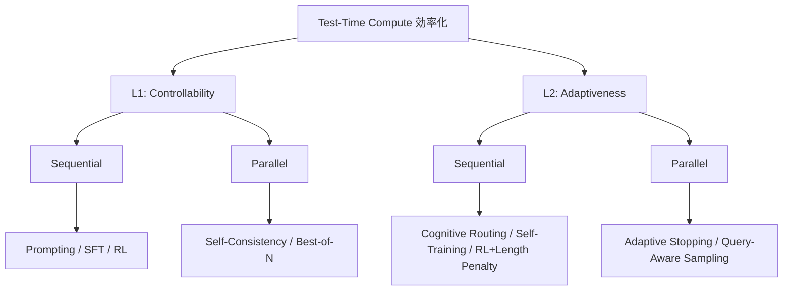
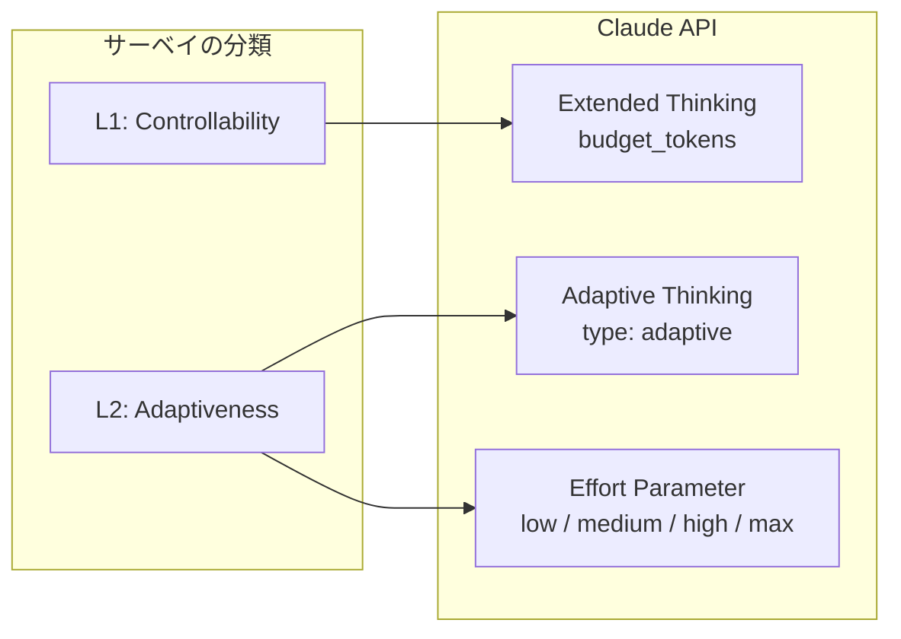
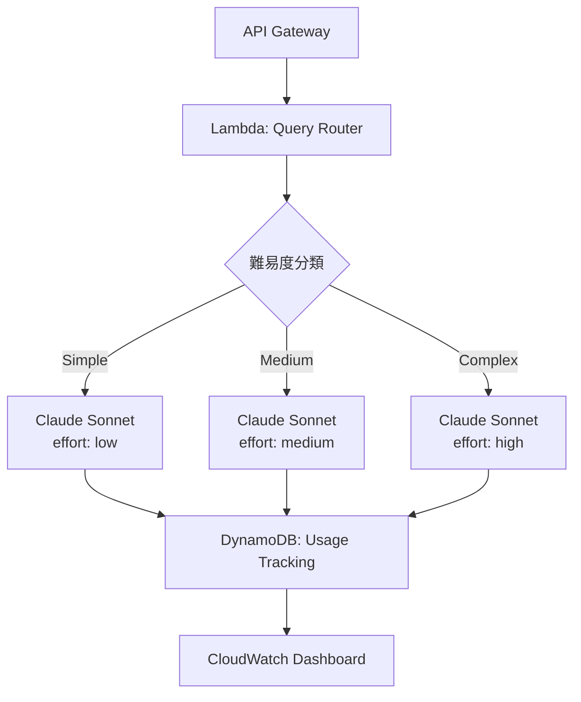

本記事は [Reasoning on a Budget: A Survey of Adaptive and Controllable Test-Time Compute in LLMs（arXiv:2507.02076）](https://arxiv.org/abs/2507.02076) の解説記事です。

## 論文概要（Abstract）

LLMは汎用的な推論・計画能力を持つエージェントとして急速に進化しているが、推論時の計算効率に根本的な問題を抱えている。現在のLLMはタスクの複雑度に関係なく固定量の推論時計算（Test-Time Compute: TTC）を適用するため、単純な問題を過度に考え（overthinking）、難しい問題を十分に考えない（underthinking）。本サーベイは、この問題に対する効率的なTTC戦略を包括的にレビューし、L1-controllability（制御可能性）とL2-adaptiveness（適応性）の2層分類法（taxonomy）を提案する。

この記事は [Zenn記事: Anthropic Claude API実践活用：モデル選定からコスト最適化まで](https://zenn.dev/0h_n0/articles/7aa294dedf0f90) の深掘りです。

## 情報源

- **arXiv ID**: 2507.02076
- **URL**: [https://arxiv.org/abs/2507.02076](https://arxiv.org/abs/2507.02076)
- **著者**: Mohammad Ali Alomrani, Yingxue Zhang, Derek Li et al.
- **発表年**: 2025
- **分野**: cs.AI, cs.LG

## 背景と動機（Background & Motivation）

Zenn記事ではClaude APIのモデル選定やコスト最適化を実践的に解説したが、その背景には「推論に必要な計算量をどう最適化するか」という研究課題がある。

現在のLLM推論には2つの非効率が存在する。

**Overthinking（過剰推論）**: 「2+3は?」のような単純な問題にも数千トークンの推論を行う。先行研究では、タスク精度と推論長が逆U字型の関係を示すことが報告されており、簡単な問題では2Kトークン程度で精度が飽和する一方、モデルは8K以上のトークンを消費する場合がある。

**Underthinking（過小推論）**: 高難度の数学問題やコーディング問題では、固定の計算予算では推論ステップが不足し、誤った結論に到達する。

この非効率はAPIコスト・レイテンシ・エネルギー消費に直結する実務上の問題でもある。Alomraniらは、解決策を体系的に分類するためにサーベイを実施したと述べている。

## 主要な貢献（Key Contributions）

- **2層分類法（Two-Tiered Taxonomy）**: TTC効率化手法をL1-controllability（固定予算下の制御）とL2-adaptiveness（動的スケーリング）に分類し、各層をsequential/parallelに細分化
- **手法横断的なベンチマーク分析**: 主要なプロプライエタリLLMの推論性能とトークン使用量のトレードオフを複数データセットで比較
- **商用API機能との対応関係の明示**: Claude APIのExtended ThinkingやAdaptive Thinkingがサーベイの分類体系のどこに位置するかを提示

## 技術的詳細（Technical Details）

### 2層分類法の全体像



### L1: Controllability（制御可能性）

L1は**事前に定義された計算予算の範囲内で推論を制御する**手法群である。

#### Sequential手法

**Prompting**: 「answer in N tokens」のような指示で出力長を制御する。Budget Forcingと呼ばれる手法では、指定トークン数で推論を強制的に打ち切るか、不足分を追加生成する。形式的には、トークン予算 $B$ に対して:

$$
y = \arg\max_{y':\, |y'| \leq B} \; p(y' \mid x, \text{prompt}_{\text{budget}})
$$

**SFT（教師あり微調整）**: LoRAアダプタで可変長の推論チェインを学習させる。TokenSkipはトークン重要度を評価し、低重要度トークンを圧縮する。

**RL（強化学習）**: Length Controlled Policy Optimization（LCPO）は、出力長に対するペナルティを報酬に組み込む:

$$
r(y, y^*) = r_{\text{correctness}}(y, y^*) - \lambda \cdot \max(0, |y| - B)
$$

$\lambda$ は長さペナルティの重み、$B$ は目標トークン予算である。

#### Parallel手法

**Self-Consistency**: 同一クエリに対して $N$ 個の回答を並列生成し、多数決で最終回答を選択する:

$$
\hat{y} = \arg\max_{y_i} \sum_{j=1}^{N} \mathbb{1}[y_j = y_i]
$$

**Best-of-N**: $N$ 個の回答からOutcome Reward Model（ORM）またはProcess Reward Model（PRM）で最高スコアの回答を選択する。

### L2: Adaptiveness（適応性）

L2は**入力の難易度やモデルの信頼度に基づいて推論計算を動的にスケーリングする**手法群である。L1が「予算を守る」のに対し、L2は「適切な予算を自動決定する」。

#### SelfBudgeter

モデル自身がクエリの複雑度を推定し、必要なトークン予算を自己決定する。双段階訓練パラダイムを採用:

**Phase 1（Cold-Start）**: 入力 $x$ に対して推定予算 $\hat{B}(x)$ を出力し、その予算内で推論を実行する:

$$
\hat{B}(x) = f_{\text{estimator}}(x; \theta), \quad y = f_{\text{reason}}(x, \hat{B}(x); \theta)
$$

**Phase 2（Budget-Guided GRPO）**: GRPO（Group Relative Policy Optimization）に予算遵守報酬を追加する:

$$
r(y, x) = r_{\text{acc}}(y) + \alpha \cdot r_{\text{budget}}(|y|, \hat{B}(x))
$$

著者らは数学推論タスクで平均61%のレスポンス長圧縮を達成しながら精度を維持したと報告している。

#### BudgetThinker

制御トークン $\langle \text{budget}_k \rangle$ をプロンプトに挿入し、推論の深さをトークンレベルで制御する:

$$
y = \text{LLM}(x, \langle \text{budget}_k \rangle), \quad k \in \{1, 2, \ldots, K\}
$$

$k$ が小さいほど簡潔な推論、大きいほど詳細な推論を誘導する。

#### DiffAdapt

隠れ状態から問題の難易度を予測し、Easy/Normal/Hardの3戦略を自動選択する。著者らはU字型エントロピーパターンを報告しており、簡単な問題で高精度にもかかわらず高エントロピー（22-25%の無駄）が生じることがoverthinkingの定量的証拠として示されている。LLMの再訓練不要で、DEER比でwall-clock timeを6倍削減したと報告されている。

### Claude APIとの対応関係



| サーベイの分類 | Claude API機能 | パラメータ | 動作 |
|---|---|---|---|
| L1-controllability | Extended Thinking | `budget_tokens: N` | 固定トークン予算で推論深度を制御 |
| L2-adaptiveness | Adaptive Thinking | `thinking.type: "adaptive"` | 問題難易度に応じて推論量を自動調整 |
| L2-adaptiveness | Effort Parameter | `output_config.effort` | 全トークン出力量を段階的に制御 |

Extended Thinking（`budget_tokens`）はClaude 4.6で非推奨、Claude 4.7以降では400エラーとなる。Adaptive Thinkingへの移行が推奨されており、これはL1からL2へのパラダイムシフトに相当する。

## 実装のポイント

### Adaptive Thinkingの基本パターン

```python
import anthropic

client = anthropic.Anthropic()

# L2-adaptiveness: Adaptive Thinking + Effort
response = client.messages.create(
    model="claude-sonnet-4-6",
    max_tokens=16000,
    thinking={"type": "adaptive"},
    output_config={"effort": "medium"},
    messages=[{"role": "user", "content": "Analyze this code for bugs."}],
)

for block in response.content:
    if block.type == "thinking":
        print(f"[Thinking] {block.thinking[:200]}...")
    elif block.type == "text":
        print(block.text)
```

### 動的Effort選択

サーベイのL2-adaptiveness概念を応用し、クエリ特性に応じてeffortを切り替える:

```python
from dataclasses import dataclass


@dataclass(frozen=True)
class EffortDecision:
    """Effort選択の結果と根拠。"""
    level: str  # low, medium, high, max
    reason: str


def classify_effort(query: str) -> EffortDecision:
    """クエリの特性からeffortレベルを決定する。

    本番環境ではSelfBudgeterのような学習ベースの
    難易度推定器を使うことが望ましい。
    """
    query_lower = query.lower()
    simple_patterns = ["what is", "define", "list"]
    complex_patterns = ["analyze", "compare", "design", "debug", "prove"]

    if any(p in query_lower for p in simple_patterns) and len(query) < 100:
        return EffortDecision(level="low", reason="Simple factual query")
    if any(p in query_lower for p in complex_patterns):
        return EffortDecision(level="high", reason="Complex reasoning task")
    return EffortDecision(level="medium", reason="General query")
```

**キャッシュの注意点**: Anthropic公式ドキュメントによると、effortレベルを変更するとプロンプトキャッシュが無効化される。マルチターン会話では会話単位でeffortを固定する設計が推奨される。

## Production Deployment Guide

### AWS上でのAdaptive Thinkingルーター

サーベイのL2分類を実装するクエリルーターのアーキテクチャを示す。



#### Lambda実装の核心部分

```python
"""AWS Lambda: クエリ難易度に基づくAdaptive Thinking Router。"""
import json
import os
import time
from typing import Any

import anthropic
import boto3

dynamodb = boto3.resource("dynamodb")
usage_table = dynamodb.Table(os.environ["USAGE_TABLE_NAME"])
client = anthropic.Anthropic(api_key=os.environ["ANTHROPIC_API_KEY"])

ROUTING_CONFIG = {
    "simple":   {"model": "claude-sonnet-4-6", "effort": "low",    "max_tokens": 2048},
    "moderate": {"model": "claude-sonnet-4-6", "effort": "medium", "max_tokens": 8192},
    "complex":  {"model": "claude-sonnet-4-6", "effort": "high",   "max_tokens": 16000},
}


def handler(event: dict[str, Any], context: Any) -> dict[str, Any]:
    """クエリをルーティングして応答を返す。"""
    body = json.loads(event["body"])
    query = body["query"]

    # 難易度分類（ルールベース or 学習ベース）
    difficulty = classify_effort(query).level
    tier = {"low": "simple", "medium": "moderate", "high": "complex"}.get(
        difficulty, "moderate"
    )
    config = ROUTING_CONFIG[tier]

    start = time.time()
    response = client.messages.create(
        model=config["model"],
        max_tokens=config["max_tokens"],
        thinking={"type": "adaptive"},
        output_config={"effort": config["effort"]},
        messages=[{"role": "user", "content": query}],
    )
    latency_ms = int((time.time() - start) * 1000)

    # トークン使用量を記録
    usage = response.usage
    usage_table.put_item(Item={
        "request_id": response.id,
        "difficulty": tier,
        "effort": config["effort"],
        "input_tokens": usage.input_tokens,
        "output_tokens": usage.output_tokens,
        "latency_ms": latency_ms,
        "timestamp": int(time.time()),
    })

    text = "".join(b.text for b in response.content if b.type == "text")
    return {"statusCode": 200, "body": json.dumps({"response": text})}
```

#### コスト最適化の効果試算

| 分類 | 想定比率 | effort | コスト比（highを1.0） |
|------|---------|--------|---------------------|
| simple | 40% | low | 0.2 |
| moderate | 35% | medium | 0.5 |
| complex | 25% | high | 1.0 |

上記の比率でクエリが分布すると仮定した場合、全クエリにhighを一律適用する場合と比較して、加重平均で約50%のトークンコスト削減が見込まれる。ただし実際のトラフィックパターンでの検証が必要である。

**監視すべきメトリクス**: `thinking_tokens / output_tokens` の比率をCloudWatchで監視し、overthinkingの兆候を検知する。difficulty別のレイテンシ分布と合わせて、effortルーティングの適切性を継続的に評価する。

## 実験結果（Benchmark Results）

サーベイでは主要なプロプライエタリLLMを複数ベンチマークで比較した結果が報告されている。

1. **推論モデルのトークン膨張**: thinkingモードを持つモデルは、ベースラインと比較して大幅に多くのトークンを消費する。精度は向上するがコスト効率は低下する。

2. **L1制御の不完全性**: Claude 3.7 Sonnetが指定`budget_tokens`を超過するケースが報告されており、L1-controllabilityが理想的には機能していない例として挙げられている。

3. **SelfBudgeterの性能**: 数学推論タスクで平均レスポンス長を61%圧縮しながら精度を維持。問題難易度に応じた予算配分の自動化を達成。

4. **DiffAdaptの性能**: DEER比でwall-clock timeを6倍削減。簡単な問題で22-25%のエントロピー低下（overthinkingの定量的証拠）を報告。LLMの再訓練不要。

## 実運用への応用

### effortパラメータの選定ガイドライン

Anthropic公式ドキュメントに基づくClaude Sonnet 4.6の推奨:

- **medium（推奨デフォルト）**: アジェンティックコーディングやツール多用ワークフローに最適
- **low**: 高スループット・低レイテンシが求められるチャットや非コーディングタスク
- **high**: 品質がコスト・速度より重要な複雑推論タスク
- **max**: トークン制約なしで最高品質を追求するタスク

### Extended Thinkingからの移行

```python
# Before: Extended Thinking (L1-controllability)
response = client.messages.create(
    model="claude-sonnet-4-6",
    max_tokens=16000,
    thinking={"type": "enabled", "budget_tokens": 10000},
    messages=[{"role": "user", "content": query}],
)

# After: Adaptive Thinking (L2-adaptiveness)
response = client.messages.create(
    model="claude-sonnet-4-6",
    max_tokens=16000,
    thinking={"type": "adaptive"},
    output_config={"effort": "high"},
    messages=[{"role": "user", "content": query}],
)
```

### サーベイからの実装上の示唆

1. **一律のeffortは非効率**: 全クエリにhighを適用すると、40%程度を占める単純クエリで不要なトークンを消費する
2. **クエリルーティングが費用対効果大**: ルールベースの難易度分類でも相当のコスト削減が期待できる
3. **キャッシュ効率とのトレードオフ**: 会話内でeffortを変更するとプロンプトキャッシュが無効化される。会話単位でeffortを固定する設計が推奨
4. **monitoring**: thinking_tokensとoutput_tokensの比率を監視し、overthinkingの兆候を検知する

## 関連研究

- **s1: Simple Test-Time Scaling**（Muennighoff et al., 2025）: 「wait」トークンで推論の継続を促すBudget Forcing手法を提案。L1-controllabilityに分類される。
- **Stop Overthinking: A Survey on Efficient Reasoning for Large Language Models**（TMLR 2025）: overthinking問題に焦点を当てた相補的なサーベイ。
- **When More Thinking Hurts**（2024）: タスク精度と推論長の逆U字型関係を実験的に示し、簡単な問題では2Kトークンで精度が飽和することを報告。
- **ARES: Adaptive Reasoning Effort Selection for Efficient LLM Agents**（2025）: エージェントタスクにおける適応的推論努力の選択手法。L2-adaptivenessカテゴリに属する。

## まとめと今後の展望

Alomraniらのサーベイは、LLM推論の計算効率化を、L1-controllability（固定予算制御）とL2-adaptiveness（動的適応）の2層分類法で体系的に整理した。

**実務者にとっての意義**: Claude APIのExtended Thinking（`budget_tokens`）からAdaptive Thinking（effort parameter）への移行は、L1からL2へのパラダイムシフトを反映している。クエリ難易度に応じた動的なeffort選択により、推論品質を維持しながら50%程度のトークンコスト削減が見込める。

**今後の研究方向**: 著者らは以下の課題を指摘している。

1. **Hybrid Thinking Models**: 内部推論（thinking tokens）と外部行動（tool calls）の統合的最適化
2. **信頼度ベースの早期停止**: モデル確信度に基づく推論の動的打ち切り
3. **マルチモーダル推論への拡張**: テキスト以外のモダリティを含む推論での計算効率化

LLMの推論コストが実運用のボトルネックとなりつつある現在、適応的な計算制御は研究と産業の双方で重要性を増している。

## 参考文献

- Alomrani, M.A., Zhang, Y., Li, D. et al. "Reasoning on a Budget: A Survey of Adaptive and Controllable Test-Time Compute in LLMs." arXiv:2507.02076, 2025. [https://arxiv.org/abs/2507.02076](https://arxiv.org/abs/2507.02076)
- Li, D. et al. "SelfBudgeter: Adaptive Token Allocation for Efficient LLM Reasoning." arXiv:2505.11274, 2025. [https://arxiv.org/abs/2505.11274](https://arxiv.org/abs/2505.11274)
- "BudgetThinker: Empowering Budget-aware LLM Reasoning with Control Tokens." arXiv:2508.17196, 2025. [https://arxiv.org/abs/2508.17196](https://arxiv.org/abs/2508.17196)
- "DiffAdapt: Difficulty-Adaptive Reasoning for Token-Efficient LLM Inference." arXiv:2510.19669. [https://arxiv.org/abs/2510.19669](https://arxiv.org/abs/2510.19669)
- Anthropic. "Extended thinking." [https://platform.claude.com/docs/en/build-with-claude/extended-thinking](https://platform.claude.com/docs/en/build-with-claude/extended-thinking)
- Anthropic. "Effort." [https://platform.claude.com/docs/en/build-with-claude/effort](https://platform.claude.com/docs/en/build-with-claude/effort)
- Muennighoff, N. et al. "s1: Simple Test-Time Scaling." arXiv:2501.19393, 2025. [https://arxiv.org/abs/2501.19393](https://arxiv.org/abs/2501.19393)

---

*本記事はAIによって生成されました。内容の正確性には注意を払っていますが、最新の情報は各参考文献の原典をご確認ください。*
