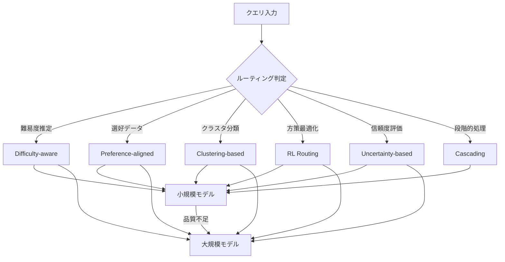
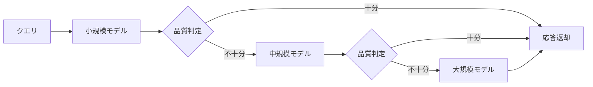

本記事は [Dynamic Model Routing and Cascading for Efficient LLM Inference: A Survey（arXiv:2603.04445）](https://arxiv.org/abs/2603.04445) の解説記事です。

## 論文概要（Abstract）

LLMの急速な発展により、単一モデルですべてのクエリに対応するアプローチはコスト・レイテンシの両面で非効率になっている。小規模モデルでルーティンクエリに対応し、複雑なタスクには高性能モデルを割り当てる動的ルーティングシステムが解決策として注目されている。本サーベイは、6つのルーティングパラダイムを体系的に分類し、3次元の概念的フレームワーク（When / What / How）で設計空間を整理したものである。著者らは、適切に設計されたルーティングシステムが個々のモデルの性能を上回り得ると報告している。

この記事は [Zenn記事: Anthropic Claude API実践活用：モデル選定からコスト最適化まで](https://zenn.dev/0h_n0/articles/7aa294dedf0f90) の深掘りです。

## 情報源

- **arXiv ID**: 2603.04445
- **URL**: [https://arxiv.org/abs/2603.04445](https://arxiv.org/abs/2603.04445)
- **著者**: Yasmin Moslem, John D. Kelleher（ADAPT Centre, Trinity College Dublin / Huawei Ireland）
- **発表年**: 2026（v1: 2月、v2: 4月）
- **分野**: cs.NI, cs.CL, cs.PF

## 背景と動機（Background & Motivation）

Claude Opus / Sonnet / Haiku に代表されるように、LLMプロバイダは性能・コスト・レイテンシの異なる複数モデルを提供している。従来は開発者がルールベースで手動振り分けするか、全クエリを最高性能モデルに送って過剰なコストを支払うかのいずれかだった。

クエリ特性に応じた自動モデル選択（動的ルーティング）が提案されているが、手法が乱立している。本サーベイはこれらを6つのパラダイムに整理し、3次元の設計空間で統一的に理解するフレームワークを提供している。

## 主要な貢献（Key Contributions）

- **6つのルーティングパラダイムの体系的分類**: Difficulty-aware、Human preference-aligned、Clustering-based、RL、Uncertainty-based、Cascadingの6分類を提示し、30以上のシステムを網羅的にレビュー
- **3次元概念フレームワーク（When / What / How）**: ルーティング決定のタイミング、使用する情報信号、計算手法の3軸で設計空間を構造化
- **実証的コスト削減効果の整理**: R2-Reasoner（84.46%コスト削減）、MixLLM（75.82%コスト削減で品質97.25%維持）など、具体的な数値を伴う比較分析

## 技術的詳細（Technical Details）

### 6つのルーティングパラダイム



#### 1. Difficulty-aware Routing

クエリの複雑度を推定し、難易度に応じてモデルを選択する。代表手法のBEST-RouteはDeBERTa-v3-smallをマルチヘッド構成で使用し、クエリの難易度スコアを推定する。Best-of-nnサンプリングと組み合わせ、閾値ベースでコストと精度のバランスを調整する。

#### 2. Human Preference-aligned Routing

人間のフィードバックデータや選好ラベルを活用してルーターを学習する。代表手法のRouteLLMは、強モデルと弱モデルの間のバイナリルーティングを定式化する。Chatbot Arenaの選好データから、強モデルが弱モデルに勝つ確率 $P(\text{strong wins} \mid q)$ を推定する。

$$
\hat{r}(q) = \begin{cases} \text{strong model} & \text{if } P(\text{strong wins} \mid q) > \tau \\ \text{weak model} & \text{otherwise} \end{cases}
$$

ここで $q$ はクエリ、$\tau$ はコスト・品質トレードオフを制御する閾値である。行列分解ルーターでGPT-4の95%の品質をGPT-4呼び出しの26%で達成したと著者らは報告している。

#### 3. Clustering-based Routing

教師なし学習でクエリをグループ化し、クラスタごとに最適なモデルを割り当てる。代表手法のUniRouteは、K-meansクラスタリングで検証セットを分割し、各候補LLMのクラスタ別誤差を評価する。

$$
m^*(q) = \arg\min_{m \in \mathcal{M}} \left[ \text{cost}(m) \times \bar{e}(m, c(q)) \right]
$$

ここで $\mathcal{M}$ はモデル候補集合、$c(q)$ はクエリ $q$ の所属クラスタ、$\bar{e}$ はクラスタ内平均誤差である。新モデルは既存クラスタでテストするだけで追加でき、再学習が不要である。

#### 4. Reinforcement Learning Routing

**方策最適化 -- R2-Reasoner**: タスク分解器とサブタスク割当器の2段構成で、GRPO（Group Relative Policy Optimization）で学習する。著者らは84.46%のAPIコスト削減を達成しながら、競争力のある推論精度を維持したと報告している。

**バンディット -- MixLLM**: コンテキストバンディットとポリシーグラディエントを組み合わせる。

$$
\pi^*(a \mid s) = \arg\max_\pi \mathbb{E}_{s \sim \mathcal{D}, a \sim \pi} \left[ R(s, a) \right]
$$

ここで $s$ はクエリの状態表現、$a$ は選択するモデル、$R(s, a)$ は品質とコストの加重報酬である。GPT-4品質の97.25%を24.18%のコストで達成したと報告されている。

#### 5. Uncertainty-based Routing

モデルの信頼度に基づいてルーティングを決定する。代表手法のCP-RouterはConformal Predictionをlogitsに適用する。

$$
U(q) = 1 - \max_{c \in \mathcal{C}} \text{softmax}(\text{logit}_c(q))
$$

高信頼度の場合は標準LLMで処理し、高不確実性の場合はLarge Reasoning Modelにルーティングする。Self-REFは信頼度トークン `<CN>` / `<UN>` を用いた軽量ファインチューニングで信頼度を抽出する。

#### 6. Cascading

段階的にモデルをエスカレーションする手法。まず小規模モデルで推論を試み、品質が不十分であれば大規模モデルへ段階的にエスカレーションする。



**FrugalGPT**: LLMルーター、DistilBERTベース品質推定器、コスト認識型停止判定器の3コンポーネントで構成される。GPT-4と同等の品質を最大98%のコスト削減で達成できると著者らは報告している。

**AutoMix**: 小規模モデルで生成、Few-shotセルフ検証（ファインチューニング不要）、信頼度が低い場合に大規模モデルへルーティングする3段階カスケード。POMDPモデリングで「解決不可能」なクエリの不要エスカレーションを防止する。

### 概念的フレームワーク（3次元設計空間）

| 次元 | サブカテゴリ | 説明 | 代表システム |
|------|-----------|------|------------|
| **When** | Pre-generation | 出力生成前にクエリ特性で判断 | RouteLLM, UniRoute |
| | Post-generation | 応答品質・信頼度で判断 | FrugalGPT, Self-REF |
| | Multi-stage | 段階的エスカレーション | AutoMix, Router-R1 |
| | Online/Adaptive | デプロイ後フィードバックで更新 | MixLLM, PILOT |
| **What** | Query-level | 語彙・意味的特徴 | BEST-Route |
| | Model metadata | コスト、レイテンシ、ドメイン特化 | IRT-Router |
| | Response-level | 信頼度スコア、トークン確率 | CP-Router |
| **How** | Heuristic | 閾値ルール、コストベースロジック | FrugalGPT |
| | Supervised | 履歴データで学習されたクラシファイア | RouteLLM |
| | Bandit | 探索と活用のバランス（LinUCB） | MixLLM, PILOT |
| | RL Policy | PPO, GRPOで方策最適化 | Router-R1, R2-Reasoner |

著者らは、実用システムは複数のパラダイムを組み合わせた構成的なものになると指摘している。

## 実装のポイント（Implementation）

**ルーター自体のコスト管理**: ルーティング判定にLLMを使用すると、ルーター自体のコストがルーティングによる削減を相殺するリスクがある。BEST-Route（DeBERTa-v3-small）やRouteLLM（行列分解）のように、軽量モデルをルーターに使用すべきである。GreenServでは8ms未満のルーティングオーバーヘッドが報告されている。

**閾値パラメータの設計**: RouteLLMの閾値 $\tau$ やCP-Routerの不確実性閾値は、コストと品質のトレードオフを直接制御する。本番環境では実トラフィックの品質メトリクスを監視しながら動的に調整する仕組みが必要である。

**新モデルへの適応**: UniRouteやICL-Routerのように、新モデル追加時に再学習を不要とするアプローチが実運用では重要である。

## Production Deployment Guide

### AWS実装パターン（コスト最適化重視）

以下のコスト試算は2026年8月時点のAWS ap-northeast-1（東京）リージョン料金に基づく概算値であり、実際のコストはトラフィックパターンにより変動する。

| 構成 | トラフィック | 主要サービス | 月額概算 |
|------|------------|------------|---------|
| Small (Serverless) | ~100 req/日 | Lambda + Bedrock (Haiku/Sonnet) + DynamoDB | $65-155 |
| Medium (Hybrid) | ~1,000 req/日 | ECS Fargate + Bedrock + ElastiCache | $300-700 |
| Large (Container) | 10,000+ req/日 | EKS + EC2 Spot + Bedrock (Opus) + Redis Cluster | $1,500-4,200 |

**コスト削減テクニック**: Spot Instancesで最大90%削減、Reserved Instances（1年）で最大72%削減、Bedrock Batch APIで50%削減、Prompt Cachingで30-90%削減。ルーティングで低コストモデル比率70-85%にしAPI費用を75-85%削減できる。

### Terraformインフラコード

**Small構成（Serverless）**

```hcl
resource "aws_iam_role_policy" "router_permissions" {
  name = "llm-router-permissions"
  role = aws_iam_role.router_lambda.id
  policy = jsonencode({
    Version = "2012-10-17"
    Statement = [
      {
        Effect = "Allow", Action = ["bedrock:InvokeModel"]
        Resource = [
          "arn:aws:bedrock:ap-northeast-1::foundation-model/anthropic.claude-3-haiku*",
          "arn:aws:bedrock:ap-northeast-1::foundation-model/anthropic.claude-sonnet*"
        ]
      },
      {
        Effect = "Allow"
        Action = ["dynamodb:PutItem", "dynamodb:GetItem", "dynamodb:Query"]
        Resource = aws_dynamodb_table.routing_history.arn
      }
    ]
  })
}

resource "aws_lambda_function" "router" {
  function_name = "llm-query-router"
  role          = aws_iam_role.router_lambda.arn
  handler       = "router.handler"
  runtime       = "python3.12"
  timeout       = 30
  memory_size   = 512  # ルーターモデル推論に十分なメモリ
  environment {
    variables = {
      COST_THRESHOLD = "0.7"  # RouteLLM閾値パラメータ
      DEFAULT_MODEL  = "anthropic.claude-3-haiku-20240307-v1:0"
      STRONG_MODEL   = "anthropic.claude-sonnet-4-20250514-v1:0"
    }
  }
  filename = "lambda_router.zip"
}

resource "aws_dynamodb_table" "routing_history" {
  name         = "llm-routing-history"
  billing_mode = "PAY_PER_REQUEST"
  hash_key     = "query_id"
  range_key    = "timestamp"
  attribute { name = "query_id"; type = "S" }
  attribute { name = "timestamp"; type = "N" }
  server_side_encryption { enabled = true }
}
```

**Large構成（Container）**

```hcl
module "eks" {
  source          = "terraform-aws-modules/eks/aws"
  version         = "~> 20.0"
  cluster_name    = "llm-routing-cluster"
  cluster_version = "1.31"
  vpc_id          = aws_vpc.routing.id
  subnet_ids      = aws_subnet.private[*].id
  cluster_endpoint_public_access  = false
  cluster_endpoint_private_access = true
}

resource "kubectl_manifest" "karpenter_nodepool" {
  yaml_body = yamlencode({
    apiVersion = "karpenter.sh/v1"
    kind       = "NodePool"
    metadata   = { name = "routing-pool" }
    spec = {
      template = { spec = { requirements = [
        { key = "karpenter.sh/capacity-type", operator = "In", values = ["spot", "on-demand"] },
        { key = "node.kubernetes.io/instance-type", operator = "In",
          values = ["m6i.large", "m6i.xlarge", "c6i.large"] }
      ]}}
      disruption = { consolidationPolicy = "WhenEmptyOrUnderutilized", consolidateAfter = "30s" }
      limits     = { cpu = "64", memory = "256Gi" }
    }
  })
}

resource "aws_budgets_budget" "monthly" {
  name = "llm-routing-monthly"
  budget_type  = "COST"
  limit_amount = "5000"
  limit_unit   = "USD"
  time_unit    = "MONTHLY"
  notification {
    comparison_operator        = "GREATER_THAN"
    threshold                  = 80
    threshold_type             = "PERCENTAGE"
    notification_type          = "ACTUAL"
    subscriber_email_addresses = ["ops-team@example.com"]
  }
}
```

### 運用・監視設定

**CloudWatch Logs Insights クエリ**

```
# ルーティング分析: モデル別トークン使用量（1時間粒度）
fields @timestamp, model_id, input_tokens, output_tokens
| stats sum(input_tokens) as total_input, sum(output_tokens) as total_output,
        count(*) as req_count by bin(1h), model_id
| filter total_output > 100000
| sort @timestamp desc
```

**監視・トレーシング設定（Python）**

```python
import boto3
from aws_xray_sdk.core import xray_recorder, patch_all
from datetime import datetime, timedelta

patch_all()  # boto3自動計装

@xray_recorder.capture("route_query")
def route_query(query: str) -> dict:
    """クエリをルーティングし、X-Rayでトレーシングする。"""
    subsegment = xray_recorder.current_subsegment()
    difficulty = estimate_difficulty(query)
    model = select_model(difficulty)
    subsegment.put_annotation("selected_model", model)
    subsegment.put_annotation("difficulty_score", round(difficulty, 3))
    return {"model": model, "response": invoke_model(model, query)}

def daily_cost_report() -> dict:
    """日次コストレポートを取得し、$100超過時にSNS通知する。"""
    ce = boto3.client("ce", region_name="us-east-1")
    end = datetime.utcnow().strftime("%Y-%m-%d")
    start = (datetime.utcnow() - timedelta(days=1)).strftime("%Y-%m-%d")
    result = ce.get_cost_and_usage(
        TimePeriod={"Start": start, "End": end},
        Granularity="DAILY", Metrics=["UnblendedCost"],
        Filter={"Tags": {"Key": "Project", "Values": ["llm-routing"]}},
        GroupBy=[{"Type": "DIMENSION", "Key": "SERVICE"}],
    )
    costs = {g["Keys"][0]: float(g["Metrics"]["UnblendedCost"]["Amount"])
             for g in result["ResultsByTime"][0]["Groups"]}
    if sum(costs.values()) > 100:
        boto3.client("sns", region_name="ap-northeast-1").publish(
            TopicArn="arn:aws:sns:ap-northeast-1:ACCOUNT:cost-alerts",
            Subject=f"LLM Routing Cost Alert: ${sum(costs.values()):.2f}",
            Message="Daily cost exceeded $100.",
        )
    return costs
```

### コスト最適化チェックリスト

**アーキテクチャ選択**:
- [ ] ~100 req/日: Serverless（Lambda + Bedrock）
- [ ] ~1,000 req/日: Hybrid（ECS + Bedrock + Cache）
- [ ] 10,000+ req/日: Container（EKS + セルフホスト + Bedrock）

**リソース最適化**:
- [ ] EC2/EKS: Spot Instances優先（最大90%削減）
- [ ] 予測可能なベースライン: Reserved Instances 1年コミット（最大72%削減）
- [ ] Savings Plans: Compute Savings Plans検討
- [ ] Lambda: メモリサイズ最適化（Power Tuningツール使用）
- [ ] ECS/EKS: Karpenterで未使用ノードの自動統合

**LLMコスト削減**:
- [ ] Bedrock Batch API: 非同期処理に使用（50%削減）
- [ ] Prompt Caching: 繰り返しプレフィックスの有効化（30-90%削減）
- [ ] ルーティング閾値: 低コストモデル振り分け比率70-85%
- [ ] トークン数制限: max_tokensパラメータで出力上限設定
- [ ] システムプロンプト共通化: キャッシュヒット率向上

**監視・アラート**:
- [ ] AWS Budgets: 月額予算設定と80%/100%閾値アラート
- [ ] CloudWatch: モデル別トークン使用量の監視
- [ ] Cost Anomaly Detection: 自動異常検知有効化
- [ ] 日次コストレポート: Cost Explorer APIで自動取得

**リソース管理**:
- [ ] 未使用リソース: 週次でIdle Instancesを棚卸し
- [ ] タグ戦略: Project/Environment/CostCenterタグ必須
- [ ] ログライフサイクル: S3 Glacier移行（90日後）
- [ ] 開発環境: 夜間・週末のEKSノード停止
- [ ] NAT Gateway: 不要な場合はVPCエンドポイントで代替

## 実験結果（Results）

### 主要ベンチマーク（論文Section 9より）

| ベンチマーク | 規模 | 対象モデル数 | 評価タスク |
|------------|------|------------|----------|
| RouterBench | 405K+推論出力 | 11 LLM | MMLU, MT-Bench, MBPP, GSM8K等7タスク |
| RouterEval | 200M+レコード | 8,500+ LLM | ARC, HellaSwag, MMLU等12タスク |
| LLMRouterBench | 400K+インスタンス | 33モデル | 21データセット、10ベースラインルーター |

### コスト削減効果の比較（論文より）

| システム | コスト削減 | 品質維持率 | 手法カテゴリ |
|---------|----------|----------|------------|
| FrugalGPT | 最大98% | GPT-4同等 | Cascading |
| RouteLLM | 最大85% | GPT-4の95% | Preference-aligned |
| R2-Reasoner | 84.46% | 競争力のある推論精度 | RL (GRPO) |
| MixLLM | 75.82% | GPT-4品質の97.25% | Bandit |
| GreenServ | エネルギー31%削減 | 精度22%向上 | Bandit (LinUCB) |

著者らは評価指標を性能（ルーティング精度、AUC）、効率（TTFT、TPOT、QPS）、環境（エネルギー消費）の3カテゴリに整理している。

## 実運用への応用（Practical Applications）

Zenn記事ではClaude APIのモデル選定とコスト最適化を扱っているが、本サーベイの知見はその設計を体系化する手がかりとなる。

**Claude APIの3層ルーティング**: Haiku（低コスト）、Sonnet（バランス）、Opus（高性能）の3層は、Cascadingパラダイムに直接対応する。Difficulty-awareで初期振り分けを行い、品質不十分な場合にSonnet、更にOpusへエスカレーションする構成が実現できる。

**Prompt Cachingとルーティングの組み合わせ**: Prompt Caching（キャッシュ済みトークンの入力コスト90%削減）はルーティングと直交する最適化である。同一システムプロンプトのクエリ群を同一モデルに集約することで、キャッシュヒット率とルーティング効率の両方を向上できる。

**Extended Thinkingの活用**: Claude Sonnet/OpusのExtended Thinking機能は、CP-Routerの「Standard LLM vs. Large Reasoning Model」の分岐に相当する。Uncertainty-basedパラダイムで自動判別が可能である。

## 関連研究（Related Work）

- **RouteLLM（Ong et al., 2025, arXiv:2406.18665）**: ICLR 2025採択。Chatbot Arenaの選好データで学習するバイナリルーター。本サーベイではPreference-alignedパラダイムの代表手法
- **FrugalGPT（Chen et al., 2024, arXiv:2305.05176）**: カスケード+品質推定の先駆的研究。DistilBERTベースの品質推定器とコスト認識型停止判定を組み合わせ、最大98%のコスト削減を報告
- **SCOPE（Cao et al., 2026）**: RLで性能推定器を学習し、Chain-of-Thought予測でユーザー定義のトレードオフルールに基づく選択を実現
- **Avengers-Pro（Zhang et al., 2025e）**: クラスタベースルーティングでパレートフロンティアを確立

## まとめと今後の展望

本サーベイは、LLM動的ルーティングの設計空間を6パラダイムと3次元フレームワークで体系化した。R2-Reasonerの84.46%コスト削減やMixLLMの75.82%コスト削減（品質97.25%維持）が示すように、適切なルーティングにより品質を犠牲にせず大幅なコスト削減が可能である。

著者らが指摘する今後の課題は、(1) 新モデル・新ドメインへの汎化性、(2) マルチステージカスケードの体系化、(3) マルチモーダルルーティング、(4) レスポンスレベル信号とオンライン適応の統合、(5) 品質・コスト・レイテンシ・エネルギーの多目的最適化の5点である。

## 参考文献

- **arXiv**: [https://arxiv.org/abs/2603.04445](https://arxiv.org/abs/2603.04445)
- **RouteLLM**: [https://arxiv.org/abs/2406.18665](https://arxiv.org/abs/2406.18665)
- **FrugalGPT**: [https://arxiv.org/abs/2305.05176](https://arxiv.org/abs/2305.05176)
- **Related Zenn article**: [https://zenn.dev/0h_n0/articles/7aa294dedf0f90](https://zenn.dev/0h_n0/articles/7aa294dedf0f90)

---

:::message
この記事はAI（Claude Code）により自動生成されました。内容の正確性については論文の原文で検証していますが、実際の利用時は公式ドキュメントもご確認ください。
:::
